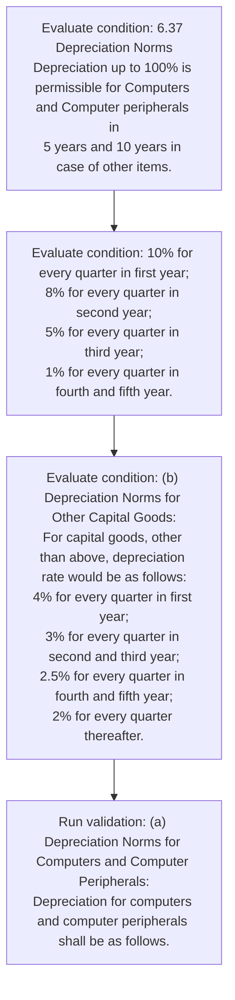

# Chapter 6 / Section 6.37: Depreciation Norms

**Chapter Title:** Export Oriented Units (EOUs), Electronics Hardware Technology Parks (EHTPs), Software Technology Parks (STPs) and Bio-Technology

**Pages:** 21

**Purpose:** 6.37 Depreciation Norms
Depreciation up to 100% is permissible for Computers and Computer peripherals in
5 years and 10 years in case of other items.

**Purpose Thanglish:** Indha Depreciation Norms section-la, 6.37 Depreciation Norms
Depreciation up to 100% is permissible for Computers and Computer peripherals in
5 years and 10 years in case of other items.

**Summary:** 6.37 Depreciation Norms
Depreciation up to 100% is permissible for Computers and Computer peripherals in
5 years and 10 years in case of other items. (a) Depreciation Norms for Computers and Computer Peripherals:
Depreciation for computers and computer peripherals shall be as follows. 10% for every quarter in first year;
8% for every quarter in second year;
5% for every quarter in third year;
1% for every quarter in fourth and fifth year.

**Business Meaning:** Depreciation Norms governs how DGFT business controls should be applied, validated, and enforced.

**Business Explanation:** Depreciation Norms explains the operating rule set that DEKAI should enforce. Key control points include (a) Depreciation Norms for Computers and Computer Peripherals:
Depreciation for computers and computer peripherals shall be as follows.

**Business Explanation Thanglish:** Indha Depreciation Norms section-la, Depreciation Norms explains the operating rule set that DEKAI should enforce. Key control points include (a) Depreciation Norms for Computers and Computer Peripherals:
Depreciation for computers and computer peripherals kandippa be as follows.

## Business Logic
- (a) Depreciation Norms for Computers and Computer Peripherals:
Depreciation for computers and computer peripherals shall be as follows.

## Business Rules
- rule_id=CH6-SEC6_37-R001, rule_description=(a) Depreciation Norms for Computers and Computer Peripherals:
Depreciation for computers and computer peripherals shall be as follows., trigger=Depreciation Norms, condition=6.37 Depreciation Norms
Depreciation up to 100% is permissible for Computers and Computer peripherals in
5 years and 10 years in case of other items., validation=(a) Depreciation Norms for Computers and Computer Peripherals:
Depreciation for computers and computer peripherals shall be as follows., action=Manual review required., exception=No explicit exception found in uploaded documents., output=DEKAI should produce a compliance decision for 6.37 - Depreciation Norms.

## Conditions
- 6.37 Depreciation Norms
Depreciation up to 100% is permissible for Computers and Computer peripherals in
5 years and 10 years in case of other items.
- 10% for every quarter in first year;
8% for every quarter in second year;
5% for every quarter in third year;
1% for every quarter in fourth and fifth year.
- (b) Depreciation Norms for Other Capital Goods:
For capital goods, other than above, depreciation rate would be as follows:
4% for every quarter in first year;
3% for every quarter in second and third year;
2.5% for every quarter in fourth and fifth year;
2% for every quarter thereafter.

## Condition Logic
- id=6.6.37.1, if=6.37 Depreciation Norms
Depreciation up to 100% is permissible for Computers and Computer peripherals in
5 years and 10 years in case of other items., then=Route for review, source=6.37 Depreciation Norms
Depreciation up to 100% is permissible for Computers and Computer peripherals in
5 years and 10 years in case of other items.
- id=6.6.37.2, if=10% for every quarter in first year;
8% for every quarter in second year;
5% for every quarter in third year;
1% for every quarter in fourth and fifth year., then=Route for review, source=10% for every quarter in first year;
8% for every quarter in second year;
5% for every quarter in third year;
1% for every quarter in fourth and fifth year.
- id=6.6.37.3, if=(b) Depreciation Norms for Other Capital Goods:
For capital goods, other than above, depreciation rate would be as follows:
4% for every quarter in first year;
3% for every quarter in second and third year;
2.5% for every quarter in fourth and fifth year;
2% for every quarter thereafter., then=Route for review, source=(b) Depreciation Norms for Other Capital Goods:
For capital goods, other than above, depreciation rate would be as follows:
4% for every quarter in first year;
3% for every quarter in second and third year;
2.5% for every quarter in fourth and fifth year;
2% for every quarter thereafter.

## Validations
- (a) Depreciation Norms for Computers and Computer Peripherals:
Depreciation for computers and computer peripherals shall be as follows.

## Exceptions
- None identified

## Dependencies
- None identified

## Authorities
- None identified

## Required Documents
- None identified

## Timelines
- 6.37 Depreciation Norms
Depreciation up to 100% is permissible for Computers and Computer peripherals in
5 years and 10 years in case of other items.
- (b) Depreciation Norms for Other Capital Goods:
For capital goods, other than above, depreciation rate would be as follows:
4% for every quarter in first year;
3% for every quarter in second and third year;
2.5% for every quarter in fourth and fifth year;
2% for every quarter thereafter.

## Actions
- None identified

## Workflow
- Evaluate condition: 6.37 Depreciation Norms
Depreciation up to 100% is permissible for Computers and Computer peripherals in
5 years and 10 years in case of other items.
- Evaluate condition: 10% for every quarter in first year;
8% for every quarter in second year;
5% for every quarter in third year;
1% for every quarter in fourth and fifth year.
- Evaluate condition: (b) Depreciation Norms for Other Capital Goods:
For capital goods, other than above, depreciation rate would be as follows:
4% for every quarter in first year;
3% for every quarter in second and third year;
2.5% for every quarter in fourth and fifth year;
2% for every quarter thereafter.
- Run validation: (a) Depreciation Norms for Computers and Computer Peripherals:
Depreciation for computers and computer peripherals shall be as follows.

## Workflow ASCII
```text
Depreciation Norms
Evaluate condition: 6.37 Depreciation Norms
Depreciation up to 100% is permissible for Computers and Computer peripherals in
5 years and 10 years in case of other items.
   |
   v
Evaluate condition: 10% for every quarter in first year;
8% for every quarter in second year;
5% for every quarter in third year;
1% for every quarter in fourth and fifth year.
   |
   v
Evaluate condition: (b) Depreciation Norms for Other Capital Goods:
For capital goods, other than above, depreciation rate would be as follows:
4% for every quarter in first year;
3% for every quarter in second and third year;
2.5% for every quarter in fourth and fifth year;
2% for every quarter thereafter.
   |
   v
Run validation: (a) Depreciation Norms for Computers and Computer Peripherals:
Depreciation for computers and computer peripherals shall be as follows.
```

## Decision Tree
- IF section 6.37 applies THEN proceed with standard DGFT workflow

## Decision Tree ASCII
```text
Depreciation Norms Decision
IF section 6.37 applies THEN proceed with standard DGFT workflow
```

## Examples
- User asks to process Depreciation Norms; the platform checks conditions, validations, and documents before action.

**Real-world Example:** Example: an importer or exporter invokes Depreciation Norms, submits the prescribed DGFT records, and DEKAI uses the extracted rules to follow the depreciation norms process.

**Real-world Example Thanglish:** Indha Depreciation Norms section-la, Example: an importer or exporter invokes Depreciation Norms, submits the prescribed DGFT records, and DEKAI uses the extracted rules to follow the depreciation norms process.

## AI Rules
- IF detected context matches section rule THEN enforce: (a) Depreciation Norms for Computers and Computer Peripherals:
Depreciation for computers and computer peripherals shall be as follows.

## Database Fields
- name=section_code, type=string, required=True, source=parsed_section_heading
- name=section_title, type=string, required=True, source=parsed_section_heading
- name=for_flag, type=boolean, required=False, source=keyword:for
- name=and_flag, type=boolean, required=False, source=keyword:and
- name=case_flag, type=boolean, required=False, source=keyword:case
- name=year_flag, type=boolean, required=False, source=keyword:year
- name=than_flag, type=boolean, required=False, source=keyword:than
- name=rate_flag, type=boolean, required=False, source=keyword:rate
- name=norms_flag, type=boolean, required=False, source=keyword:Norms
- name=years_flag, type=boolean, required=False, source=keyword:years

## API Requirements
- method=GET, path=/api/dgft/sections/6.37, purpose=Retrieve knowledge payload for section 6.37, query_params=['include=workflow,decision_tree,validations'], response_fields=['section', 'title', 'summary', 'conditions', 'validations', 'exceptions', 'workflow', 'decision_tree']
- method=POST, path=/api/dgft/Depreciation-Norms/validate, purpose=Validate inputs and documents for Depreciation Norms, request_fields=['section_code', 'section_title'], response_fields=['status', 'errors', 'warnings', 'next_actions']

## UI Screens
- screen_id=Depreciation_Norms_overview, name=Depreciation Norms Overview, purpose=Show section summary, authority, timeline, and eligibility cues., widgets=['summary_card', 'conditions_table', 'authority_badges', 'timeline_panel']
- screen_id=Depreciation_Norms_submission, name=Depreciation Norms Submission, purpose=Capture applicant data and supporting documents., widgets=['dynamic_form', 'document_uploader', 'validation_panel', 'next_action_footer'], fields=['section_code', 'section_title', 'for_flag', 'and_flag', 'case_flag', 'year_flag', 'than_flag', 'rate_flag']

## Error Messages
- Validation failed because the section requirements were not fully met.

## FAQ
- question_en=What is the purpose of section 6.37?, answer_en=Depreciation Norms explains the operating rule set that DEKAI should enforce. Key control points include (a) Depreciation Norms for Computers and Computer Peripherals:
Depreciation for computers and computer peripherals shall be as follows., question_thanglish=Indha Depreciation Norms section-la, What is the purpose of section 6.37?, answer_thanglish=Indha Depreciation Norms section-la, Depreciation Norms explains the operating rule set that DEKAI should enforce. Key control points include (a) Depreciation Norms for Computers and Computer Peripherals:
Depreciation for computers and computer peripherals kandippa be as follows.
- question_en=What documents are required under Depreciation Norms?, answer_en=Not explicitly covered in uploaded documents., question_thanglish=Indha Depreciation Norms section-la, What documents are required under Depreciation Norms?, answer_thanglish=Indha Depreciation Norms section-la, Not explicitly covered in uploaded documents.
- question_en=Which authority handles Depreciation Norms?, answer_en=Not explicitly covered in uploaded documents., question_thanglish=Indha Depreciation Norms section-la, Which authority handles Depreciation Norms?, answer_thanglish=Indha Depreciation Norms section-la, Not explicitly covered in uploaded documents.

## Questions Users May Ask
- What does Depreciation Norms require?
- Which documents are needed for Depreciation Norms?
- How does DEKAI validate Depreciation Norms requests?

## Expected AI Answers
- Depreciation Norms requires the platform to interpret the section text, apply the extracted business rules, and present the correct next action.
- Required documents are inferred from the section text: no explicit documents were detected.
- DEKAI validates Depreciation Norms by checking conditions, required documents, authority references, and exception clauses before recommending an outcome.

## AI Q&A Examples
- question_en=User asks: How do I comply with Depreciation Norms?, answer_en=AI answers: DEKAI should evaluate section 6.37, apply the extracted rules, and guide the user through Evaluate condition: 6.37 Depreciation Norms
Depreciation up to 100% is permissible for Computers and Computer peripherals in
5 years and 10 years in case of other items.., question_thanglish=Indha Depreciation Norms section-la, User asks: How do I comply with Depreciation Norms?, answer_thanglish=Indha Depreciation Norms section-la, AI answers: DEKAI should evaluate section 6.37, apply the extracted rules, and guide the user through Evaluate condition: 6.37 Depreciation Norms
Depreciation up to 100% is permissible for Computers and Computer peripherals in
5 years and 10 years in case of other items..
- question_en=User asks: Which validations apply to Depreciation Norms?, answer_en=AI answers: Applicable validations are (a) Depreciation Norms for Computers and Computer Peripherals:
Depreciation for computers and computer peripherals shall be as follows., question_thanglish=Indha Depreciation Norms section-la, User asks: Which validations apply to Depreciation Norms?, answer_thanglish=Indha Depreciation Norms section-la, AI answers: Applicable validations are (a) Depreciation Norms for Computers and Computer Peripherals:
Depreciation for computers and computer peripherals kandippa be as follows.

## DEKAI AI Implementation Notes
- Capture chapter 6, section 6.37, title, and page references as immutable knowledge metadata.
- Bind validations for Depreciation Norms into a rule engine keyed by the rule IDs extracted for this section.

## DEKAI AI Implementation Notes Thanglish
- Indha Depreciation Norms section-la, Capture chapter 6, section 6.37, title, and page references as immutable knowledge metadata.
- Indha Depreciation Norms section-la, Bind validations for Depreciation Norms into a rule engine keyed by the rule IDs extracted for this section.

## AI Metadata
- Keywords: for, and, case, year, than, rate, Norms, years, other, items, shall, every, first, third, fifth, Goods, above, would, second, fourth
- Search Keywords: for, and, case, year, than, rate, Norms, years, other, items, shall, every, first, third, fifth, Goods, above, would, second, fourth
- Intent: Provide knowledge guidance for Depreciation Norms.
- Tags: 6.37, Depreciation Norms, business-rule, dgft
- Related Sections: 
- Related Chapters: 
- Related Rules: (a) Depreciation Norms for Computers and Computer Peripherals:
Depreciation for computers and computer peripherals shall be as follows.

## Mermaid


## PlantUML
```plantuml
@startuml
start
:Evaluate condition\: 6.37 Depreciation Norms
Depreciation up to 100% is permissible for Computers and Computer peripherals in
5 years and 10 years in case of other items.;
:Evaluate condition\: 10% for every quarter in first year;
8% for every quarter in second year;
5% for every quarter in third year;
1% for every quarter in fourth and fifth year.;
:Evaluate condition\: (b) Depreciation Norms for Other Capital Goods\:
For capital goods, other than above, depreciation rate would be as follows\:
4% for every quarter in first year;
3% for every quarter in second and third year;
2.5% for every quarter in fourth and fifth year;
2% for every quarter thereafter.;
:Run validation\: (a) Depreciation Norms for Computers and Computer Peripherals\:
Depreciation for computers and computer peripherals shall be as follows.;
stop
@enduml
```
