# Chapter 6 / Section 6.38: Conversion

**Chapter Title:** Export Oriented Units (EOUs), Electronics Hardware Technology Parks (EHTPs), Software Technology Parks (STPs) and Bio-Technology

**Pages:** 21, 22

**Purpose:** 6.38 Conversion
a) Existing DTA units, may also apply for conversion into an EOU
/EHTP / STP / BTP unit, but no concession in duties and taxes
would be available under scheme for plant, machinery and
equipment already installed.

**Purpose Thanglish:** Indha Conversion section-la, 6.38 Conversion
a) Existing DTA units, may also apply for conversion into an EOU
/EHTP / STP / BTP unit, but no concession in duties and taxes
would be available under scheme for plant, machinery and
equipment already installed.

**Summary:** 6.38 Conversion
a) Existing DTA units, may also apply for conversion into an EOU
/EHTP / STP / BTP unit, but no concession in duties and taxes
would be available under scheme for plant, machinery and
equipment already installed. For this purpose, DTA unit may apply
to DC / Designated Officer concerned in same manner as applicable
to new units. In case there is an outstanding export commitment
under Advance Authorisation Scheme, it will follow the procedure
laid down in Appendix 6M of Appendices & ANFs.

**Business Meaning:** 6.38 Conversion
a) Existing DTA units, may also apply for conversion into an EOU
/EHTP / STP / BTP unit, but no concession in duties and taxes
would be available under scheme for plant, machinery and
equipment already installed.

**Business Explanation:** 6.38 Conversion
a) Existing DTA units, may also apply for conversion into an EOU
/EHTP / STP / BTP unit, but no concession in duties and taxes
would be available under scheme for plant, machinery and
equipment already installed. For this purpose, DTA unit may apply
to DC / Designated Officer concerned in same manner as applicable
to new units. In case there is an outstanding export commitment
under Advance Authorisation Scheme, it will follow the procedure
laid down in Appendix 6M of Appendices & ANFs.

**Business Explanation Thanglish:** Indha Conversion section-la, 6.38 Conversion
a) Existing DTA units, may also apply for conversion into an EOU
/EHTP / STP / BTP unit, but no concession in duties and taxes
would be available under scheme for plant, machinery and
equipment already installed. For this purpose, DTA unit may apply
to DC / Designated Officer concerned in same manner as applicable
to new units. In case there is an outstanding export commitment
under Advance Authorisation Scheme, it will follow the procedure
laid down in Appendix 6M of Appendices & ANFs.

## Business Logic
- None identified

## Business Rules
- rule_id=CH6-SEC6_38-R001, rule_description=IF validations pass THEN recommend action: 6.38 Conversion
a) Existing DTA units, may also apply for conversion into an EOU
/EHTP / STP / BTP unit, but no concession in duties and taxes
would be available under scheme for plant, machinery and
equipment already installed., trigger=Conversion, condition=In case there is an outstanding export commitment
under Advance Authorisation Scheme, it will follow the procedure
laid down in Appendix 6M of Appendices & ANFs., validation=Not explicitly covered in uploaded documents., action=6.38 Conversion
a) Existing DTA units, may also apply for conversion into an EOU
/EHTP / STP / BTP unit, but no concession in duties and taxes
would be available under scheme for plant, machinery and
equipment already installed., exception=6.38 Conversion
a) Existing DTA units, may also apply for conversion into an EOU
/EHTP / STP / BTP unit, but no concession in duties and taxes
would be available under scheme for plant, machinery and
equipment already installed., output=DEKAI should produce a compliance decision for 6.38 - Conversion.

## Conditions
- In case there is an outstanding export commitment
under Advance Authorisation Scheme, it will follow the procedure
laid down in Appendix 6M of Appendices & ANFs.
- In case DTA unit
has taken EPCG authorisation, the conversion would be permitted
only if either the unit has fulfilled the stipulated Export obligation
and obtained EODC or has made payment of applicable duties and
taxes and compensation cess on capital goods imported under the
EPCG Scheme.
- c) An EOU may be shifted to SEZ with approval of DC provided EOU
has achieved pro-rata obligation under EOU scheme.

## Condition Logic
- id=6.6.38.1, if=In case there is an outstanding export commitment
under Advance Authorisation Scheme, it will follow the procedure
laid down in Appendix 6M of Appendices & ANFs., then=6.38 Conversion
a) Existing DTA units, may also apply for conversion into an EOU
/EHTP / STP / BTP unit, but no concession in duties and taxes
would be available under scheme for plant, machinery and
equipment already installed., source=In case there is an outstanding export commitment
under Advance Authorisation Scheme, it will follow the procedure
laid down in Appendix 6M of Appendices & ANFs.
- id=6.6.38.2, if=In case DTA unit
has taken EPCG authorisation, the conversion would be permitted
only if either the unit has fulfilled the stipulated Export obligation
and obtained EODC or has made payment of applicable duties and
taxes and compensation cess on capital goods imported under the
EPCG Scheme., then=6.38 Conversion
a) Existing DTA units, may also apply for conversion into an EOU
/EHTP / STP / BTP unit, but no concession in duties and taxes
would be available under scheme for plant, machinery and
equipment already installed., source=In case DTA unit
has taken EPCG authorisation, the conversion would be permitted
only if either the unit has fulfilled the stipulated Export obligation
and obtained EODC or has made payment of applicable duties and
taxes and compensation cess on capital goods imported under the
EPCG Scheme.
- id=6.6.38.3, if=c) An EOU may be shifted to SEZ with approval of DC provided EOU
has achieved pro-rata obligation under EOU scheme., then=6.38 Conversion
a) Existing DTA units, may also apply for conversion into an EOU
/EHTP / STP / BTP unit, but no concession in duties and taxes
would be available under scheme for plant, machinery and
equipment already installed., source=c) An EOU may be shifted to SEZ with approval of DC provided EOU
has achieved pro-rata obligation under EOU scheme.

## Validations
- None identified

## Exceptions
- 6.38 Conversion
a) Existing DTA units, may also apply for conversion into an EOU
/EHTP / STP / BTP unit, but no concession in duties and taxes
would be available under scheme for plant, machinery and
equipment already installed.
- In such cases, units will
continue to avail permissible exemption in duties and taxes as
applicable under relevant scheme.
- 153
6.38 Conversion
a)
Existing DTA units, may also apply for conversion into an EOU
/EHTP / STP / BTP unit, but no concession in duties and taxes
would be available under scheme for plant, machinery and
equipment already installed.

## Dependencies
- None identified

## Authorities
- None identified

## Required Documents
- None identified

## Timelines
- None identified

## Actions
- 6.38 Conversion
a) Existing DTA units, may also apply for conversion into an EOU
/EHTP / STP / BTP unit, but no concession in duties and taxes
would be available under scheme for plant, machinery and
equipment already installed.
- For this purpose, DTA unit may apply
to DC / Designated Officer concerned in same manner as applicable
to new units.
- In case DTA unit
has taken EPCG authorisation, the conversion would be permitted
only if either the unit has fulfilled the stipulated Export obligation
and obtained EODC or has made payment of applicable duties and
taxes and compensation cess on capital goods imported under the
EPCG Scheme.
- b) Existing EHTP / STP / BTP units may also apply for conversion /
merger to EOU unit and vice-versa.
- 153
6.38 Conversion
a)
Existing DTA units, may also apply for conversion into an EOU
/EHTP / STP / BTP unit, but no concession in duties and taxes
would be available under scheme for plant, machinery and
equipment already installed.
- b)
Existing EHTP / STP / BTP units may also apply for conversion /
merger to EOU unit and vice-versa.
- EHTP / STP/ BTP units desiring
conversion as an EOU may apply to DC concerned through Officer
designated by Meit Y / Do BT in same manner as
applicable to new units.
- Likewise, EOU desiring conversion into
EHTP / STP / BTP may apply to officer designated by Meit Y / Do BT
through DC concerned.

## Workflow
- Evaluate condition: In case there is an outstanding export commitment
under Advance Authorisation Scheme, it will follow the procedure
laid down in Appendix 6M of Appendices & ANFs.
- Evaluate condition: In case DTA unit
has taken EPCG authorisation, the conversion would be permitted
only if either the unit has fulfilled the stipulated Export obligation
and obtained EODC or has made payment of applicable duties and
taxes and compensation cess on capital goods imported under the
EPCG Scheme.
- Evaluate condition: c) An EOU may be shifted to SEZ with approval of DC provided EOU
has achieved pro-rata obligation under EOU scheme.
- 6.38 Conversion
a) Existing DTA units, may also apply for conversion into an EOU
/EHTP / STP / BTP unit, but no concession in duties and taxes
would be available under scheme for plant, machinery and
equipment already installed.
- For this purpose, DTA unit may apply
to DC / Designated Officer concerned in same manner as applicable
to new units.
- In case DTA unit
has taken EPCG authorisation, the conversion would be permitted
only if either the unit has fulfilled the stipulated Export obligation
and obtained EODC or has made payment of applicable duties and
taxes and compensation cess on capital goods imported under the
EPCG Scheme.
- b) Existing EHTP / STP / BTP units may also apply for conversion /
merger to EOU unit and vice-versa.
- 153
6.38 Conversion
a)
Existing DTA units, may also apply for conversion into an EOU
/EHTP / STP / BTP unit, but no concession in duties and taxes
would be available under scheme for plant, machinery and
equipment already installed.
- b)
Existing EHTP / STP / BTP units may also apply for conversion /
merger to EOU unit and vice-versa.
- Handle exception: 6.38 Conversion
a) Existing DTA units, may also apply for conversion into an EOU
/EHTP / STP / BTP unit, but no concession in duties and taxes
would be available under scheme for plant, machinery and
equipment already installed.

## Workflow ASCII
```text
Conversion
Evaluate condition: In case there is an outstanding export commitment
under Advance Authorisation Scheme, it will follow the procedure
laid down in Appendix 6M of Appendices & ANFs.
   |
   v
Evaluate condition: In case DTA unit
has taken EPCG authorisation, the conversion would be permitted
only if either the unit has fulfilled the stipulated Export obligation
and obtained EODC or has made payment of applicable duties and
taxes and compensation cess on capital goods imported under the
EPCG Scheme.
   |
   v
Evaluate condition: c) An EOU may be shifted to SEZ with approval of DC provided EOU
has achieved pro-rata obligation under EOU scheme.
   |
   v
6.38 Conversion
a) Existing DTA units, may also apply for conversion into an EOU
/EHTP / STP / BTP unit, but no concession in duties and taxes
would be available under scheme for plant, machinery and
equipment already installed.
   |
   v
For this purpose, DTA unit may apply
to DC / Designated Officer concerned in same manner as applicable
to new units.
   |
   v
In case DTA unit
has taken EPCG authorisation, the conversion would be permitted
only if either the unit has fulfilled the stipulated Export obligation
and obtained EODC or has made payment of applicable duties and
taxes and compensation cess on capital goods imported under the
EPCG Scheme.
   |
   v
b) Existing EHTP / STP / BTP units may also apply for conversion /
merger to EOU unit and vice-versa.
   |
   v
153
6.38 Conversion
a)
Existing DTA units, may also apply for conversion into an EOU
/EHTP / STP / BTP unit, but no concession in duties and taxes
would be available under scheme for plant, machinery and
equipment already installed.
   |
   v
b)
Existing EHTP / STP / BTP units may also apply for conversion /
merger to EOU unit and vice-versa.
   |
   v
Handle exception: 6.38 Conversion
a) Existing DTA units, may also apply for conversion into an EOU
/EHTP / STP / BTP unit, but no concession in duties and taxes
would be available under scheme for plant, machinery and
equipment already installed.
```

## Decision Tree
- IF In case there is an outstanding export commitment
under Advance Authorisation Scheme, it will follow the procedure
laid down in Appendix 6M of Appendices & ANFs. THEN 6.38 Conversion
a) Existing DTA units, may also apply for conversion into an EOU
/EHTP / STP / BTP unit, but no concession in duties and taxes
would be available under scheme for plant, machinery and
equipment already installed.
- IF In case DTA unit
has taken EPCG authorisation, the conversion would be permitted
only if either the unit has fulfilled the stipulated Export obligation
and obtained EODC or has made payment of applicable duties and
taxes and compensation cess on capital goods imported under the
EPCG Scheme. THEN 6.38 Conversion
a) Existing DTA units, may also apply for conversion into an EOU
/EHTP / STP / BTP unit, but no concession in duties and taxes
would be available under scheme for plant, machinery and
equipment already installed.
- IF c) An EOU may be shifted to SEZ with approval of DC provided EOU
has achieved pro-rata obligation under EOU scheme. THEN 6.38 Conversion
a) Existing DTA units, may also apply for conversion into an EOU
/EHTP / STP / BTP unit, but no concession in duties and taxes
would be available under scheme for plant, machinery and
equipment already installed.
- IF exception applies (6.38 Conversion
a) Existing DTA units, may also apply for conversion into an EOU
/EHTP / STP / BTP unit, but no concession in duties and taxes
would be available under scheme for plant, machinery and
equipment already installed.) THEN route to manual review
- IF exception applies (In such cases, units will
continue to avail permissible exemption in duties and taxes as
applicable under relevant scheme.) THEN route to manual review
- IF exception applies (153
6.38 Conversion
a)
Existing DTA units, may also apply for conversion into an EOU
/EHTP / STP / BTP unit, but no concession in duties and taxes
would be available under scheme for plant, machinery and
equipment already installed.) THEN route to manual review

## Decision Tree ASCII
```text
Conversion Decision
IF In case there is an outstanding export commitment
under Advance Authorisation Scheme, it will follow the procedure
laid down in Appendix 6M of Appendices & ANFs. THEN 6.38 Conversion
a) Existing DTA units, may also apply for conversion into an EOU
/EHTP / STP / BTP unit, but no concession in duties and taxes
would be available under scheme for plant, machinery and
equipment already installed.
   |
   v
IF In case DTA unit
has taken EPCG authorisation, the conversion would be permitted
only if either the unit has fulfilled the stipulated Export obligation
and obtained EODC or has made payment of applicable duties and
taxes and compensation cess on capital goods imported under the
EPCG Scheme. THEN 6.38 Conversion
a) Existing DTA units, may also apply for conversion into an EOU
/EHTP / STP / BTP unit, but no concession in duties and taxes
would be available under scheme for plant, machinery and
equipment already installed.
   |
   v
IF c) An EOU may be shifted to SEZ with approval of DC provided EOU
has achieved pro-rata obligation under EOU scheme. THEN 6.38 Conversion
a) Existing DTA units, may also apply for conversion into an EOU
/EHTP / STP / BTP unit, but no concession in duties and taxes
would be available under scheme for plant, machinery and
equipment already installed.
   |
   v
IF exception applies (6.38 Conversion
a) Existing DTA units, may also apply for conversion into an EOU
/EHTP / STP / BTP unit, but no concession in duties and taxes
would be available under scheme for plant, machinery and
equipment already installed.) THEN route to manual review
   |
   v
IF exception applies (In such cases, units will
continue to avail permissible exemption in duties and taxes as
applicable under relevant scheme.) THEN route to manual review
   |
   v
IF exception applies (153
6.38 Conversion
a)
Existing DTA units, may also apply for conversion into an EOU
/EHTP / STP / BTP unit, but no concession in duties and taxes
would be available under scheme for plant, machinery and
equipment already installed.) THEN route to manual review
```

## Examples
- User asks to process Conversion; the platform checks conditions, validations, and documents before action.

**Real-world Example:** Example: an importer or exporter invokes Conversion, submits the prescribed DGFT records, and DEKAI uses the extracted rules to 6.38 conversion
a) existing dta units, may also apply for conversion into an eou
/ehtp / stp / btp unit, but no concession in duties and taxes
would be available under scheme for plant, machinery and
equipment already installed..

**Real-world Example Thanglish:** Indha Conversion section-la, Example: an importer or exporter invokes Conversion, submits the prescribed DGFT records, and DEKAI uses the extracted rules to 6.38 conversion
a) existing dta units, may also apply for conversion into an eou
/ehtp / stp / btp unit, but no concession in duties and taxes
would be available under scheme for plant, machinery and
equipment already installed..

## AI Rules
- IF validations pass THEN recommend action: 6.38 Conversion
a) Existing DTA units, may also apply for conversion into an EOU
/EHTP / STP / BTP unit, but no concession in duties and taxes
would be available under scheme for plant, machinery and
equipment already installed.

## Database Fields
- name=section_code, type=string, required=True, source=parsed_section_heading
- name=section_title, type=string, required=True, source=parsed_section_heading
- name=dta_flag, type=boolean, required=False, source=keyword:DTA
- name=may_flag, type=boolean, required=False, source=keyword:may
- name=for_flag, type=boolean, required=False, source=keyword:for
- name=eou_flag, type=boolean, required=False, source=keyword:EOU
- name=stp_flag, type=boolean, required=False, source=keyword:STP
- name=btp_flag, type=boolean, required=False, source=keyword:BTP
- name=but_flag, type=boolean, required=False, source=keyword:but
- name=and_flag, type=boolean, required=False, source=keyword:and

## API Requirements
- method=GET, path=/api/dgft/sections/6.38, purpose=Retrieve knowledge payload for section 6.38, query_params=['include=workflow,decision_tree,validations'], response_fields=['section', 'title', 'summary', 'conditions', 'validations', 'exceptions', 'workflow', 'decision_tree']
- method=POST, path=/api/dgft/Conversion/validate, purpose=Validate inputs and documents for Conversion, request_fields=['section_code', 'section_title'], response_fields=['status', 'errors', 'warnings', 'next_actions']
- method=POST, path=/api/dgft/Conversion/execute, purpose=Trigger business action for 6.38 Conversion
a) Existing DTA units, may also apply for conversion into an EOU
/EHTP / STP / BTP unit, but no concession in duties and taxes
would be available under scheme for plant, machinery and
equipment already installed., request_fields=['section_code', 'section_title'], response_fields=['reference_id', 'status', 'authority', 'timeline']

## UI Screens
- screen_id=Conversion_overview, name=Conversion Overview, purpose=Show section summary, authority, timeline, and eligibility cues., widgets=['summary_card', 'conditions_table', 'authority_badges', 'timeline_panel']
- screen_id=Conversion_submission, name=Conversion Submission, purpose=Capture applicant data and supporting documents., widgets=['dynamic_form', 'document_uploader', 'validation_panel', 'next_action_footer'], fields=['section_code', 'section_title', 'dta_flag', 'may_flag', 'for_flag', 'eou_flag', 'stp_flag', 'btp_flag']
- screen_id=Conversion_exceptions, name=Conversion Exception Review, purpose=Explain exception handling and manual review triggers., widgets=['exception_banner', 'decision_tree', 'case_notes']

## Error Messages
- Validation failed because the section requirements were not fully met.

## FAQ
- question_en=What is the purpose of section 6.38?, answer_en=6.38 Conversion
a) Existing DTA units, may also apply for conversion into an EOU
/EHTP / STP / BTP unit, but no concession in duties and taxes
would be available under scheme for plant, machinery and
equipment already installed. For this purpose, DTA unit may apply
to DC / Designated Officer concerned in same manner as applicable
to new units. In case there is an outstanding export commitment
under Advance Authorisation Scheme, it will follow the procedure
laid down in Appendix 6M of Appendices & ANFs., question_thanglish=Indha Conversion section-la, What is the purpose of section 6.38?, answer_thanglish=Indha Conversion section-la, 6.38 Conversion
a) Existing DTA units, may also apply for conversion into an EOU
/EHTP / STP / BTP unit, but no concession in duties and taxes
would be available under scheme for plant, machinery and
equipment already installed. For this purpose, DTA unit may apply
to DC / Designated Officer concerned in same manner as applicable
to new units. In case there is an outstanding export commitment
under Advance Authorisation Scheme, it will follow the procedure
laid down in Appendix 6M of Appendices & ANFs.
- question_en=What documents are required under Conversion?, answer_en=Not explicitly covered in uploaded documents., question_thanglish=Indha Conversion section-la, What documents are required under Conversion?, answer_thanglish=Indha Conversion section-la, Not explicitly covered in uploaded documents.
- question_en=Which authority handles Conversion?, answer_en=Not explicitly covered in uploaded documents., question_thanglish=Indha Conversion section-la, Which authority handles Conversion?, answer_thanglish=Indha Conversion section-la, Not explicitly covered in uploaded documents.

## Questions Users May Ask
- What does Conversion require?
- Which documents are needed for Conversion?
- How does DEKAI validate Conversion requests?
- What action should be taken for Conversion?

## Expected AI Answers
- Conversion requires the platform to interpret the section text, apply the extracted business rules, and present the correct next action.
- Required documents are inferred from the section text: no explicit documents were detected.
- DEKAI validates Conversion by checking conditions, required documents, authority references, and exception clauses before recommending an outcome.
- The primary extracted action is: 6.38 Conversion
a) Existing DTA units, may also apply for conversion into an EOU
/EHTP / STP / BTP unit, but no concession in duties and taxes
would be available under scheme for plant, machinery and
equipment already installed.

## AI Q&A Examples
- question_en=User asks: How do I comply with Conversion?, answer_en=AI answers: DEKAI should evaluate section 6.38, apply the extracted rules, and guide the user through Evaluate condition: In case there is an outstanding export commitment
under Advance Authorisation Scheme, it will follow the procedure
laid down in Appendix 6M of Appendices & ANFs.., question_thanglish=Indha Conversion section-la, User asks: How do I comply with Conversion?, answer_thanglish=Indha Conversion section-la, AI answers: DEKAI should evaluate section 6.38, apply the extracted rules, and guide the user through Evaluate condition: In case there is an outstanding export commitment
under Advance Authorisation Scheme, it will follow the procedure
laid down in Appendix 6M of Appendices & ANFs..
- question_en=User asks: Which validations apply to Conversion?, answer_en=AI answers: Applicable validations are not explicitly covered in the uploaded documents., question_thanglish=Indha Conversion section-la, User asks: Which validations apply to Conversion?, answer_thanglish=Indha Conversion section-la, AI answers: Applicable validations are not explicitly covered in the uploaded documents.

## DEKAI AI Implementation Notes
- Capture chapter 6, section 6.38, title, and page references as immutable knowledge metadata.
- Bind validations for Conversion into a rule engine keyed by the rule IDs extracted for this section.
- Trigger manual review when exception clauses are detected.

## DEKAI AI Implementation Notes Thanglish
- Indha Conversion section-la, Capture chapter 6, section 6.38, title, and page references as immutable knowledge metadata.
- Indha Conversion section-la, Bind validations for Conversion into a rule engine keyed by the rule IDs extracted for this section.
- Indha Conversion section-la, Trigger manual review when exception clauses are detected.

## AI Metadata
- Keywords: DTA, may, for, EOU, STP, BTP, but, and, new, the, has, SEZ, also, into, EHTP, unit, this, same, case, will
- Search Keywords: DTA, may, for, EOU, STP, BTP, but, and, new, the, has, SEZ, also, into, EHTP, unit, this, same, case, will
- Intent: Support Conversion processing and compliance validation.
- Tags: 6.38, Conversion, dgft
- Related Sections: 
- Related Chapters: 
- Related Rules: 

## Mermaid

```mermaid
flowchart TD
    S1["Evaluate condition: In case there is an outstanding export commitment
under Advance Authorisation Scheme, it will follow the procedure
laid down in Appendix 6M of Appendices & ANFs."]
    S2["Evaluate condition: In case DTA unit
has taken EPCG authorisation, the conversion would be permitted
only if either the unit has fulfilled the stipulated Export obligation
and obtained EODC or has made payment of applicable duties and
taxes and compensation cess on capital goods imported under the
EPCG Scheme."]
    S1 --> S2
    S3["Evaluate condition: c) An EOU may be shifted to SEZ with approval of DC provided EOU
has achieved pro-rata obligation under EOU scheme."]
    S2 --> S3
    S4["6.38 Conversion
a) Existing DTA units, may also apply for conversion into an EOU
/EHTP / STP / BTP unit, but no concession in duties and taxes
would be available under scheme for plant, machinery and
equipment already installed."]
    S3 --> S4
    S5["For this purpose, DTA unit may apply
to DC / Designated Officer concerned in same manner as applicable
to new units."]
    S4 --> S5
    S6["In case DTA unit
has taken EPCG authorisation, the conversion would be permitted
only if either the unit has fulfilled the stipulated Export obligation
and obtained EODC or has made payment of applicable duties and
taxes and compensation cess on capital goods imported under the
EPCG Scheme."]
    S5 --> S6
    S7["b) Existing EHTP / STP / BTP units may also apply for conversion /
merger to EOU unit and vice-versa."]
    S6 --> S7
    S8["153
6.38 Conversion
a)
Existing DTA units, may also apply for conversion into an EOU
/EHTP / STP / BTP unit, but no concession in duties and taxes
would be available under scheme for plant, machinery and
equipment already installed."]
    S7 --> S8
    S9["b)
Existing EHTP / STP / BTP units may also apply for conversion /
merger to EOU unit and vice-versa."]
    S8 --> S9
    S10["Handle exception: 6.38 Conversion
a) Existing DTA units, may also apply for conversion into an EOU
/EHTP / STP / BTP unit, but no concession in duties and taxes
would be available under scheme for plant, machinery and
equipment already installed."]
    S9 --> S10
```


## PlantUML
```plantuml
@startuml
start
:Evaluate condition\: In case there is an outstanding export commitment
under Advance Authorisation Scheme, it will follow the procedure
laid down in Appendix 6M of Appendices & ANFs.;
:Evaluate condition\: In case DTA unit
has taken EPCG authorisation, the conversion would be permitted
only if either the unit has fulfilled the stipulated Export obligation
and obtained EODC or has made payment of applicable duties and
taxes and compensation cess on capital goods imported under the
EPCG Scheme.;
:Evaluate condition\: c) An EOU may be shifted to SEZ with approval of DC provided EOU
has achieved pro-rata obligation under EOU scheme.;
:6.38 Conversion
a) Existing DTA units, may also apply for conversion into an EOU
/EHTP / STP / BTP unit, but no concession in duties and taxes
would be available under scheme for plant, machinery and
equipment already installed.;
:For this purpose, DTA unit may apply
to DC / Designated Officer concerned in same manner as applicable
to new units.;
:In case DTA unit
has taken EPCG authorisation, the conversion would be permitted
only if either the unit has fulfilled the stipulated Export obligation
and obtained EODC or has made payment of applicable duties and
taxes and compensation cess on capital goods imported under the
EPCG Scheme.;
:b) Existing EHTP / STP / BTP units may also apply for conversion /
merger to EOU unit and vice-versa.;
:153
6.38 Conversion
a)
Existing DTA units, may also apply for conversion into an EOU
/EHTP / STP / BTP unit, but no concession in duties and taxes
would be available under scheme for plant, machinery and
equipment already installed.;
:b)
Existing EHTP / STP / BTP units may also apply for conversion /
merger to EOU unit and vice-versa.;
:Handle exception\: 6.38 Conversion
a) Existing DTA units, may also apply for conversion into an EOU
/EHTP / STP / BTP unit, but no concession in duties and taxes
would be available under scheme for plant, machinery and
equipment already installed.;
stop
@enduml
```
