# Chapter 6 / Section 6.39: Fast Track Clearance Procedure

**Chapter Title:** Export Oriented Units (EOUs), Electronics Hardware Technology Parks (EHTPs), Software Technology Parks (STPs) and Bio-Technology

**Pages:** 22

**Purpose:** 6.39 Fast Track Clearance Procedure
a) Eligibility: EOUs having a status holder certificate under FTP shall
be eligible for Fast Track Clearance Procedure.

**Purpose Thanglish:** Indha Fast Track Clearance Procedure section-la, 6.39 Fast Track Clearance Procedure
a) Eligibility: EOUs having a status holder certificate under FTP kandippa
be eligible for Fast Track Clearance Procedure.

**Summary:** 6.39 Fast Track Clearance Procedure
a) Eligibility: EOUs having a status holder certificate under FTP shall
be eligible for Fast Track Clearance Procedure. b) Examination of Import Cargo: Status holder units shall be
exempted from examination of import cargo at port of import. However, jurisdictional Commissioner of Customs may examine
consignments at unit’s place on random basis.

**Business Meaning:** Fast Track Clearance Procedure governs how DGFT business controls should be applied, validated, and enforced.

**Business Explanation:** Fast Track Clearance Procedure explains the operating rule set that DEKAI should enforce. Key control points include 6.39 Fast Track Clearance Procedure
a) Eligibility: EOUs having a status holder certificate under FTP shall
be eligible for Fast Track Clearance Procedure. The section also drives actions such as c) Installation of Computers: Eligible EOUs may install two computers
in their administrative / registered office outside premises of the
unit under prior intimation to jurisdictional Asstt..

**Business Explanation Thanglish:** Indha Fast Track Clearance Procedure section-la, Fast Track Clearance Procedure explains the operating rule set that DEKAI should enforce. Key control points include 6.39 Fast Track Clearance Procedure
a) Eligibility: EOUs having a status holder certificate under FTP kandippa
be eligible for Fast Track Clearance Procedure. The section also drives actions such as c) Installation of Computers: Eligible EOUs may install two computers
in their administrative / registered office outside premises of the
unit under prior intimation to jurisdictional Asstt..

## Business Logic
- 6.39 Fast Track Clearance Procedure
a) Eligibility: EOUs having a status holder certificate under FTP shall
be eligible for Fast Track Clearance Procedure.
- b) Examination of Import Cargo: Status holder units shall be
exempted from examination of import cargo at port of import.
- c) Installation of Computers: Eligible EOUs may install two computers
in their administrative / registered office outside premises of the
unit under prior intimation to jurisdictional Asstt.
- d) Procurement of DG sets: Procurement of DG set of capacity
commensurate with actual requirement of unit shall be permitted
under intimation to DC and jurisdictional Customs authority.
- e) Temporary removal of Capital Goods: Eligible EOU may remove
their capital goods or parts thereof for repairs under prior
intimation to jurisdictional Asst.
- f) Personal carriage of samples: Personal carriage of samples of Gems
& Jewellery by status holder EOUs are allowed subject to limit fixed
in Paragraph 6.24 without a need for prior permission from DC /
Customs.
- g) Activities which do not require permission: In respect of following
activities of a status holder, permission will not be required from
DC or jurisdictional Central Excise/Customs authority: DTA sale of
finished products in terms of Paragraph 6.07(a) of FTP;
Participation in exhibition and Personal carriage of Gems &
Jewellery for export promotion tours subject to fulfilment of
conditions of Paragraph 6.23 of HBP.
- 6.39 Fast Track Clearance Procedure
a)
Eligibility: EOUs having a status holder certificate under FTP shall
be eligible for Fast Track Clearance Procedure.
- b)
Examination of Import Cargo: Status holder units shall be
exempted from examination of import cargo at port of import.
- c)
Installation of Computers: Eligible EOUs may install two computers
in their administrative / registered office outside premises of the
unit under prior intimation to jurisdictional Asstt.
- d)
Procurement of DG sets: Procurement of DG set of capacity
commensurate with actual requirement of unit shall be permitted
under intimation to DC and jurisdictional Customs authority.
- e)
Temporary removal of Capital Goods: Eligible EOU may remove
their capital goods or parts thereof for repairs under prior
intimation to jurisdictional Asst.
- f)
Personal carriage of samples: Personal carriage of samples of Gems
& Jewellery by status holder EOUs are allowed subject to limit fixed
in Paragraph 6.24 without a need for prior permission from DC /
Customs.
- g)
Activities which do not require permission: In respect of following
activities of a status holder, permission will not be required from
DC or jurisdictional Central Excise/Customs authority: DTA sale of
finished products in terms of Paragraph 6.07(a) of FTP;
Participation in exhibition and Personal carriage of Gems &
Jewellery for export promotion tours subject to fulfilment of
conditions of Paragraph 6.23 of HBP.

## Business Rules
- rule_id=CH6-SEC6_39-R001, rule_description=6.39 Fast Track Clearance Procedure
a) Eligibility: EOUs having a status holder certificate under FTP shall
be eligible for Fast Track Clearance Procedure., trigger=Fast Track Clearance Procedure, condition=6.39 Fast Track Clearance Procedure
a) Eligibility: EOUs having a status holder certificate under FTP shall
be eligible for Fast Track Clearance Procedure., validation=6.39 Fast Track Clearance Procedure
a) Eligibility: EOUs having a status holder certificate under FTP shall
be eligible for Fast Track Clearance Procedure., action=c) Installation of Computers: Eligible EOUs may install two computers
in their administrative / registered office outside premises of the
unit under prior intimation to jurisdictional Asstt., exception=b) Examination of Import Cargo: Status holder units shall be
exempted from examination of import cargo at port of import., output=DEKAI should produce a compliance decision for 6.39 - Fast Track Clearance Procedure.
- rule_id=CH6-SEC6_39-R002, rule_description=b) Examination of Import Cargo: Status holder units shall be
exempted from examination of import cargo at port of import., trigger=Fast Track Clearance Procedure, condition=f) Personal carriage of samples: Personal carriage of samples of Gems
& Jewellery by status holder EOUs are allowed subject to limit fixed
in Paragraph 6.24 without a need for prior permission from DC /
Customs., validation=b) Examination of Import Cargo: Status holder units shall be
exempted from examination of import cargo at port of import., action=154
conversion as an EOU may apply to DC concerned through Officer
designated by Meit Y / Do BT in same manner as
applicable to new units., exception=However, jurisdictional Commissioner of Customs may examine
consignments at unit’s place on random basis., output=DEKAI should produce a compliance decision for 6.39 - Fast Track Clearance Procedure.
- rule_id=CH6-SEC6_39-R003, rule_description=c) Installation of Computers: Eligible EOUs may install two computers
in their administrative / registered office outside premises of the
unit under prior intimation to jurisdictional Asstt., trigger=Fast Track Clearance Procedure, condition=g) Activities which do not require permission: In respect of following
activities of a status holder, permission will not be required from
DC or jurisdictional Central Excise/Customs authority: DTA sale of
finished products in terms of Paragraph 6.07(a) of FTP;
Participation in exhibition and Personal carriage of Gems &
Jewellery for export promotion tours subject to fulfilment of
conditions of Paragraph 6.23 of HBP., validation=c) Installation of Computers: Eligible EOUs may install two computers
in their administrative / registered office outside premises of the
unit under prior intimation to jurisdictional Asstt., action=Likewise, EOU desiring conversion into
EHTP / STP / BTP may apply to officer designated by Meit Y / Do BT
through DC concerned., exception=However, prior intimation
thereof needs to be given., output=DEKAI should produce a compliance decision for 6.39 - Fast Track Clearance Procedure.
- rule_id=CH6-SEC6_39-R004, rule_description=d) Procurement of DG sets: Procurement of DG set of capacity
commensurate with actual requirement of unit shall be permitted
under intimation to DC and jurisdictional Customs authority., trigger=Fast Track Clearance Procedure, condition=c)
An EOU may be shifted to SEZ with approval of DC provided EOU
has achieved pro-rata obligation under EOU scheme., validation=d) Procurement of DG sets: Procurement of DG set of capacity
commensurate with actual requirement of unit shall be permitted
under intimation to DC and jurisdictional Customs authority., action=c)
Installation of Computers: Eligible EOUs may install two computers
in their administrative / registered office outside premises of the
unit under prior intimation to jurisdictional Asstt., exception=b)
Examination of Import Cargo: Status holder units shall be
exempted from examination of import cargo at port of import., output=DEKAI should produce a compliance decision for 6.39 - Fast Track Clearance Procedure.
- rule_id=CH6-SEC6_39-R005, rule_description=e) Temporary removal of Capital Goods: Eligible EOU may remove
their capital goods or parts thereof for repairs under prior
intimation to jurisdictional Asst., trigger=Fast Track Clearance Procedure, condition=6.39 Fast Track Clearance Procedure
a)
Eligibility: EOUs having a status holder certificate under FTP shall
be eligible for Fast Track Clearance Procedure., validation=e) Temporary removal of Capital Goods: Eligible EOU may remove
their capital goods or parts thereof for repairs under prior
intimation to jurisdictional Asst., action=c)
Installation of Computers: Eligible EOUs may install two computers
in their administrative / registered office outside premises of the
unit under prior intimation to jurisdictional Asstt., exception=b)
Examination of Import Cargo: Status holder units shall be
exempted from examination of import cargo at port of import., output=DEKAI should produce a compliance decision for 6.39 - Fast Track Clearance Procedure.
- rule_id=CH6-SEC6_39-R006, rule_description=f) Personal carriage of samples: Personal carriage of samples of Gems
& Jewellery by status holder EOUs are allowed subject to limit fixed
in Paragraph 6.24 without a need for prior permission from DC /
Customs., trigger=Fast Track Clearance Procedure, condition=f)
Personal carriage of samples: Personal carriage of samples of Gems
& Jewellery by status holder EOUs are allowed subject to limit fixed
in Paragraph 6.24 without a need for prior permission from DC /
Customs., validation=g) Activities which do not require permission: In respect of following
activities of a status holder, permission will not be required from
DC or jurisdictional Central Excise/Customs authority: DTA sale of
finished products in terms of Paragraph 6.07(a) of FTP;
Participation in exhibition and Personal carriage of Gems &
Jewellery for export promotion tours subject to fulfilment of
conditions of Paragraph 6.23 of HBP., action=c)
Installation of Computers: Eligible EOUs may install two computers
in their administrative / registered office outside premises of the
unit under prior intimation to jurisdictional Asstt., exception=b)
Examination of Import Cargo: Status holder units shall be
exempted from examination of import cargo at port of import., output=DEKAI should produce a compliance decision for 6.39 - Fast Track Clearance Procedure.
- rule_id=CH6-SEC6_39-R007, rule_description=g) Activities which do not require permission: In respect of following
activities of a status holder, permission will not be required from
DC or jurisdictional Central Excise/Customs authority: DTA sale of
finished products in terms of Paragraph 6.07(a) of FTP;
Participation in exhibition and Personal carriage of Gems &
Jewellery for export promotion tours subject to fulfilment of
conditions of Paragraph 6.23 of HBP., trigger=Fast Track Clearance Procedure, condition=g)
Activities which do not require permission: In respect of following
activities of a status holder, permission will not be required from
DC or jurisdictional Central Excise/Customs authority: DTA sale of
finished products in terms of Paragraph 6.07(a) of FTP;
Participation in exhibition and Personal carriage of Gems &
Jewellery for export promotion tours subject to fulfilment of
conditions of Paragraph 6.23 of HBP., validation=6.39 Fast Track Clearance Procedure
a)
Eligibility: EOUs having a status holder certificate under FTP shall
be eligible for Fast Track Clearance Procedure., action=c)
Installation of Computers: Eligible EOUs may install two computers
in their administrative / registered office outside premises of the
unit under prior intimation to jurisdictional Asstt., exception=b)
Examination of Import Cargo: Status holder units shall be
exempted from examination of import cargo at port of import., output=DEKAI should produce a compliance decision for 6.39 - Fast Track Clearance Procedure.
- rule_id=CH6-SEC6_39-R008, rule_description=6.39 Fast Track Clearance Procedure
a)
Eligibility: EOUs having a status holder certificate under FTP shall
be eligible for Fast Track Clearance Procedure., trigger=Fast Track Clearance Procedure, condition=g)
Activities which do not require permission: In respect of following
activities of a status holder, permission will not be required from
DC or jurisdictional Central Excise/Customs authority: DTA sale of
finished products in terms of Paragraph 6.07(a) of FTP;
Participation in exhibition and Personal carriage of Gems &
Jewellery for export promotion tours subject to fulfilment of
conditions of Paragraph 6.23 of HBP., validation=b)
Examination of Import Cargo: Status holder units shall be
exempted from examination of import cargo at port of import., action=c)
Installation of Computers: Eligible EOUs may install two computers
in their administrative / registered office outside premises of the
unit under prior intimation to jurisdictional Asstt., exception=b)
Examination of Import Cargo: Status holder units shall be
exempted from examination of import cargo at port of import., output=DEKAI should produce a compliance decision for 6.39 - Fast Track Clearance Procedure.
- rule_id=CH6-SEC6_39-R009, rule_description=b)
Examination of Import Cargo: Status holder units shall be
exempted from examination of import cargo at port of import., trigger=Fast Track Clearance Procedure, condition=g)
Activities which do not require permission: In respect of following
activities of a status holder, permission will not be required from
DC or jurisdictional Central Excise/Customs authority: DTA sale of
finished products in terms of Paragraph 6.07(a) of FTP;
Participation in exhibition and Personal carriage of Gems &
Jewellery for export promotion tours subject to fulfilment of
conditions of Paragraph 6.23 of HBP., validation=c)
Installation of Computers: Eligible EOUs may install two computers
in their administrative / registered office outside premises of the
unit under prior intimation to jurisdictional Asstt., action=c)
Installation of Computers: Eligible EOUs may install two computers
in their administrative / registered office outside premises of the
unit under prior intimation to jurisdictional Asstt., exception=b)
Examination of Import Cargo: Status holder units shall be
exempted from examination of import cargo at port of import., output=DEKAI should produce a compliance decision for 6.39 - Fast Track Clearance Procedure.
- rule_id=CH6-SEC6_39-R010, rule_description=c)
Installation of Computers: Eligible EOUs may install two computers
in their administrative / registered office outside premises of the
unit under prior intimation to jurisdictional Asstt., trigger=Fast Track Clearance Procedure, condition=g)
Activities which do not require permission: In respect of following
activities of a status holder, permission will not be required from
DC or jurisdictional Central Excise/Customs authority: DTA sale of
finished products in terms of Paragraph 6.07(a) of FTP;
Participation in exhibition and Personal carriage of Gems &
Jewellery for export promotion tours subject to fulfilment of
conditions of Paragraph 6.23 of HBP., validation=d)
Procurement of DG sets: Procurement of DG set of capacity
commensurate with actual requirement of unit shall be permitted
under intimation to DC and jurisdictional Customs authority., action=c)
Installation of Computers: Eligible EOUs may install two computers
in their administrative / registered office outside premises of the
unit under prior intimation to jurisdictional Asstt., exception=b)
Examination of Import Cargo: Status holder units shall be
exempted from examination of import cargo at port of import., output=DEKAI should produce a compliance decision for 6.39 - Fast Track Clearance Procedure.
- rule_id=CH6-SEC6_39-R011, rule_description=d)
Procurement of DG sets: Procurement of DG set of capacity
commensurate with actual requirement of unit shall be permitted
under intimation to DC and jurisdictional Customs authority., trigger=Fast Track Clearance Procedure, condition=g)
Activities which do not require permission: In respect of following
activities of a status holder, permission will not be required from
DC or jurisdictional Central Excise/Customs authority: DTA sale of
finished products in terms of Paragraph 6.07(a) of FTP;
Participation in exhibition and Personal carriage of Gems &
Jewellery for export promotion tours subject to fulfilment of
conditions of Paragraph 6.23 of HBP., validation=e)
Temporary removal of Capital Goods: Eligible EOU may remove
their capital goods or parts thereof for repairs under prior
intimation to jurisdictional Asst., action=c)
Installation of Computers: Eligible EOUs may install two computers
in their administrative / registered office outside premises of the
unit under prior intimation to jurisdictional Asstt., exception=b)
Examination of Import Cargo: Status holder units shall be
exempted from examination of import cargo at port of import., output=DEKAI should produce a compliance decision for 6.39 - Fast Track Clearance Procedure.
- rule_id=CH6-SEC6_39-R012, rule_description=e)
Temporary removal of Capital Goods: Eligible EOU may remove
their capital goods or parts thereof for repairs under prior
intimation to jurisdictional Asst., trigger=Fast Track Clearance Procedure, condition=g)
Activities which do not require permission: In respect of following
activities of a status holder, permission will not be required from
DC or jurisdictional Central Excise/Customs authority: DTA sale of
finished products in terms of Paragraph 6.07(a) of FTP;
Participation in exhibition and Personal carriage of Gems &
Jewellery for export promotion tours subject to fulfilment of
conditions of Paragraph 6.23 of HBP., validation=g)
Activities which do not require permission: In respect of following
activities of a status holder, permission will not be required from
DC or jurisdictional Central Excise/Customs authority: DTA sale of
finished products in terms of Paragraph 6.07(a) of FTP;
Participation in exhibition and Personal carriage of Gems &
Jewellery for export promotion tours subject to fulfilment of
conditions of Paragraph 6.23 of HBP., action=c)
Installation of Computers: Eligible EOUs may install two computers
in their administrative / registered office outside premises of the
unit under prior intimation to jurisdictional Asstt., exception=b)
Examination of Import Cargo: Status holder units shall be
exempted from examination of import cargo at port of import., output=DEKAI should produce a compliance decision for 6.39 - Fast Track Clearance Procedure.
- rule_id=CH6-SEC6_39-R013, rule_description=f)
Personal carriage of samples: Personal carriage of samples of Gems
& Jewellery by status holder EOUs are allowed subject to limit fixed
in Paragraph 6.24 without a need for prior permission from DC /
Customs., trigger=Fast Track Clearance Procedure, condition=g)
Activities which do not require permission: In respect of following
activities of a status holder, permission will not be required from
DC or jurisdictional Central Excise/Customs authority: DTA sale of
finished products in terms of Paragraph 6.07(a) of FTP;
Participation in exhibition and Personal carriage of Gems &
Jewellery for export promotion tours subject to fulfilment of
conditions of Paragraph 6.23 of HBP., validation=g)
Activities which do not require permission: In respect of following
activities of a status holder, permission will not be required from
DC or jurisdictional Central Excise/Customs authority: DTA sale of
finished products in terms of Paragraph 6.07(a) of FTP;
Participation in exhibition and Personal carriage of Gems &
Jewellery for export promotion tours subject to fulfilment of
conditions of Paragraph 6.23 of HBP., action=c)
Installation of Computers: Eligible EOUs may install two computers
in their administrative / registered office outside premises of the
unit under prior intimation to jurisdictional Asstt., exception=b)
Examination of Import Cargo: Status holder units shall be
exempted from examination of import cargo at port of import., output=DEKAI should produce a compliance decision for 6.39 - Fast Track Clearance Procedure.
- rule_id=CH6-SEC6_39-R014, rule_description=g)
Activities which do not require permission: In respect of following
activities of a status holder, permission will not be required from
DC or jurisdictional Central Excise/Customs authority: DTA sale of
finished products in terms of Paragraph 6.07(a) of FTP;
Participation in exhibition and Personal carriage of Gems &
Jewellery for export promotion tours subject to fulfilment of
conditions of Paragraph 6.23 of HBP., trigger=Fast Track Clearance Procedure, condition=g)
Activities which do not require permission: In respect of following
activities of a status holder, permission will not be required from
DC or jurisdictional Central Excise/Customs authority: DTA sale of
finished products in terms of Paragraph 6.07(a) of FTP;
Participation in exhibition and Personal carriage of Gems &
Jewellery for export promotion tours subject to fulfilment of
conditions of Paragraph 6.23 of HBP., validation=g)
Activities which do not require permission: In respect of following
activities of a status holder, permission will not be required from
DC or jurisdictional Central Excise/Customs authority: DTA sale of
finished products in terms of Paragraph 6.07(a) of FTP;
Participation in exhibition and Personal carriage of Gems &
Jewellery for export promotion tours subject to fulfilment of
conditions of Paragraph 6.23 of HBP., action=c)
Installation of Computers: Eligible EOUs may install two computers
in their administrative / registered office outside premises of the
unit under prior intimation to jurisdictional Asstt., exception=b)
Examination of Import Cargo: Status holder units shall be
exempted from examination of import cargo at port of import., output=DEKAI should produce a compliance decision for 6.39 - Fast Track Clearance Procedure.

## Conditions
- 6.39 Fast Track Clearance Procedure
a) Eligibility: EOUs having a status holder certificate under FTP shall
be eligible for Fast Track Clearance Procedure.
- f) Personal carriage of samples: Personal carriage of samples of Gems
& Jewellery by status holder EOUs are allowed subject to limit fixed
in Paragraph 6.24 without a need for prior permission from DC /
Customs.
- g) Activities which do not require permission: In respect of following
activities of a status holder, permission will not be required from
DC or jurisdictional Central Excise/Customs authority: DTA sale of
finished products in terms of Paragraph 6.07(a) of FTP;
Participation in exhibition and Personal carriage of Gems &
Jewellery for export promotion tours subject to fulfilment of
conditions of Paragraph 6.23 of HBP.
- c)
An EOU may be shifted to SEZ with approval of DC provided EOU
has achieved pro-rata obligation under EOU scheme.
- 6.39 Fast Track Clearance Procedure
a)
Eligibility: EOUs having a status holder certificate under FTP shall
be eligible for Fast Track Clearance Procedure.
- f)
Personal carriage of samples: Personal carriage of samples of Gems
& Jewellery by status holder EOUs are allowed subject to limit fixed
in Paragraph 6.24 without a need for prior permission from DC /
Customs.
- g)
Activities which do not require permission: In respect of following
activities of a status holder, permission will not be required from
DC or jurisdictional Central Excise/Customs authority: DTA sale of
finished products in terms of Paragraph 6.07(a) of FTP;
Participation in exhibition and Personal carriage of Gems &
Jewellery for export promotion tours subject to fulfilment of
conditions of Paragraph 6.23 of HBP.

## Condition Logic
- id=6.6.39.1, if=6.39 Fast Track Clearance Procedure
a) Eligibility: EOUs having a status holder certificate under FTP shall
be eligible for Fast Track Clearance Procedure., then=c) Installation of Computers: Eligible EOUs may install two computers
in their administrative / registered office outside premises of the
unit under prior intimation to jurisdictional Asstt., source=6.39 Fast Track Clearance Procedure
a) Eligibility: EOUs having a status holder certificate under FTP shall
be eligible for Fast Track Clearance Procedure.
- id=6.6.39.2, if=f) Personal carriage of samples: Personal carriage of samples of Gems
& Jewellery by status holder EOUs are allowed subject to limit fixed
in Paragraph 6.24 without a need for prior permission from DC /
Customs., then=c) Installation of Computers: Eligible EOUs may install two computers
in their administrative / registered office outside premises of the
unit under prior intimation to jurisdictional Asstt., source=f) Personal carriage of samples: Personal carriage of samples of Gems
& Jewellery by status holder EOUs are allowed subject to limit fixed
in Paragraph 6.24 without a need for prior permission from DC /
Customs.
- id=6.6.39.3, if=g) Activities which do not require permission: In respect of following
activities of a status holder, permission will not be required from
DC or jurisdictional Central Excise/Customs authority: DTA sale of
finished products in terms of Paragraph 6.07(a) of FTP;
Participation in exhibition and Personal carriage of Gems &
Jewellery for export promotion tours subject to fulfilment of
conditions of Paragraph 6.23 of HBP., then=c) Installation of Computers: Eligible EOUs may install two computers
in their administrative / registered office outside premises of the
unit under prior intimation to jurisdictional Asstt., source=g) Activities which do not require permission: In respect of following
activities of a status holder, permission will not be required from
DC or jurisdictional Central Excise/Customs authority: DTA sale of
finished products in terms of Paragraph 6.07(a) of FTP;
Participation in exhibition and Personal carriage of Gems &
Jewellery for export promotion tours subject to fulfilment of
conditions of Paragraph 6.23 of HBP.
- id=6.6.39.4, if=c)
An EOU may be shifted to SEZ with approval of DC provided EOU
has achieved pro-rata obligation under EOU scheme., then=c) Installation of Computers: Eligible EOUs may install two computers
in their administrative / registered office outside premises of the
unit under prior intimation to jurisdictional Asstt., source=c)
An EOU may be shifted to SEZ with approval of DC provided EOU
has achieved pro-rata obligation under EOU scheme.
- id=6.6.39.5, if=6.39 Fast Track Clearance Procedure
a)
Eligibility: EOUs having a status holder certificate under FTP shall
be eligible for Fast Track Clearance Procedure., then=c) Installation of Computers: Eligible EOUs may install two computers
in their administrative / registered office outside premises of the
unit under prior intimation to jurisdictional Asstt., source=6.39 Fast Track Clearance Procedure
a)
Eligibility: EOUs having a status holder certificate under FTP shall
be eligible for Fast Track Clearance Procedure.
- id=6.6.39.6, if=f)
Personal carriage of samples: Personal carriage of samples of Gems
& Jewellery by status holder EOUs are allowed subject to limit fixed
in Paragraph 6.24 without a need for prior permission from DC /
Customs., then=c) Installation of Computers: Eligible EOUs may install two computers
in their administrative / registered office outside premises of the
unit under prior intimation to jurisdictional Asstt., source=f)
Personal carriage of samples: Personal carriage of samples of Gems
& Jewellery by status holder EOUs are allowed subject to limit fixed
in Paragraph 6.24 without a need for prior permission from DC /
Customs.
- id=6.6.39.7, if=g)
Activities which do not require permission: In respect of following
activities of a status holder, permission will not be required from
DC or jurisdictional Central Excise/Customs authority: DTA sale of
finished products in terms of Paragraph 6.07(a) of FTP;
Participation in exhibition and Personal carriage of Gems &
Jewellery for export promotion tours subject to fulfilment of
conditions of Paragraph 6.23 of HBP., then=c) Installation of Computers: Eligible EOUs may install two computers
in their administrative / registered office outside premises of the
unit under prior intimation to jurisdictional Asstt., source=g)
Activities which do not require permission: In respect of following
activities of a status holder, permission will not be required from
DC or jurisdictional Central Excise/Customs authority: DTA sale of
finished products in terms of Paragraph 6.07(a) of FTP;
Participation in exhibition and Personal carriage of Gems &
Jewellery for export promotion tours subject to fulfilment of
conditions of Paragraph 6.23 of HBP.

## Validations
- 6.39 Fast Track Clearance Procedure
a) Eligibility: EOUs having a status holder certificate under FTP shall
be eligible for Fast Track Clearance Procedure.
- b) Examination of Import Cargo: Status holder units shall be
exempted from examination of import cargo at port of import.
- c) Installation of Computers: Eligible EOUs may install two computers
in their administrative / registered office outside premises of the
unit under prior intimation to jurisdictional Asstt.
- d) Procurement of DG sets: Procurement of DG set of capacity
commensurate with actual requirement of unit shall be permitted
under intimation to DC and jurisdictional Customs authority.
- e) Temporary removal of Capital Goods: Eligible EOU may remove
their capital goods or parts thereof for repairs under prior
intimation to jurisdictional Asst.
- g) Activities which do not require permission: In respect of following
activities of a status holder, permission will not be required from
DC or jurisdictional Central Excise/Customs authority: DTA sale of
finished products in terms of Paragraph 6.07(a) of FTP;
Participation in exhibition and Personal carriage of Gems &
Jewellery for export promotion tours subject to fulfilment of
conditions of Paragraph 6.23 of HBP.
- 6.39 Fast Track Clearance Procedure
a)
Eligibility: EOUs having a status holder certificate under FTP shall
be eligible for Fast Track Clearance Procedure.
- b)
Examination of Import Cargo: Status holder units shall be
exempted from examination of import cargo at port of import.
- c)
Installation of Computers: Eligible EOUs may install two computers
in their administrative / registered office outside premises of the
unit under prior intimation to jurisdictional Asstt.
- d)
Procurement of DG sets: Procurement of DG set of capacity
commensurate with actual requirement of unit shall be permitted
under intimation to DC and jurisdictional Customs authority.
- e)
Temporary removal of Capital Goods: Eligible EOU may remove
their capital goods or parts thereof for repairs under prior
intimation to jurisdictional Asst.
- g)
Activities which do not require permission: In respect of following
activities of a status holder, permission will not be required from
DC or jurisdictional Central Excise/Customs authority: DTA sale of
finished products in terms of Paragraph 6.07(a) of FTP;
Participation in exhibition and Personal carriage of Gems &
Jewellery for export promotion tours subject to fulfilment of
conditions of Paragraph 6.23 of HBP.

## Exceptions
- b) Examination of Import Cargo: Status holder units shall be
exempted from examination of import cargo at port of import.
- However, jurisdictional Commissioner of Customs may examine
consignments at unit’s place on random basis.
- However, prior intimation
thereof needs to be given.
- b)
Examination of Import Cargo: Status holder units shall be
exempted from examination of import cargo at port of import.

## Dependencies
- 6.24
- 6.07
- 6.23

## Authorities
- Customs
- Commissioner of Customs
- Deputy Commissioner of Customs
- Customs authority
- DC and jurisdictional Customs
- Deputy Commissioner
- DC or jurisdictional Central Excise/Customs

## Required Documents
- 6.39 Fast Track Clearance Procedure
a) Eligibility: EOUs having a status holder certificate under FTP shall
be eligible for Fast Track Clearance Procedure.
- 6.39 Fast Track Clearance Procedure
a)
Eligibility: EOUs having a status holder certificate under FTP shall
be eligible for Fast Track Clearance Procedure.

## Timelines
- None identified

## Actions
- c) Installation of Computers: Eligible EOUs may install two computers
in their administrative / registered office outside premises of the
unit under prior intimation to jurisdictional Asstt.
- 154
conversion as an EOU may apply to DC concerned through Officer
designated by Meit Y / Do BT in same manner as
applicable to new units.
- Likewise, EOU desiring conversion into
EHTP / STP / BTP may apply to officer designated by Meit Y / Do BT
through DC concerned.
- c)
Installation of Computers: Eligible EOUs may install two computers
in their administrative / registered office outside premises of the
unit under prior intimation to jurisdictional Asstt.

## Workflow
- Evaluate condition: 6.39 Fast Track Clearance Procedure
a) Eligibility: EOUs having a status holder certificate under FTP shall
be eligible for Fast Track Clearance Procedure.
- Evaluate condition: f) Personal carriage of samples: Personal carriage of samples of Gems
& Jewellery by status holder EOUs are allowed subject to limit fixed
in Paragraph 6.24 without a need for prior permission from DC /
Customs.
- Evaluate condition: g) Activities which do not require permission: In respect of following
activities of a status holder, permission will not be required from
DC or jurisdictional Central Excise/Customs authority: DTA sale of
finished products in terms of Paragraph 6.07(a) of FTP;
Participation in exhibition and Personal carriage of Gems &
Jewellery for export promotion tours subject to fulfilment of
conditions of Paragraph 6.23 of HBP.
- c) Installation of Computers: Eligible EOUs may install two computers
in their administrative / registered office outside premises of the
unit under prior intimation to jurisdictional Asstt.
- 154
conversion as an EOU may apply to DC concerned through Officer
designated by Meit Y / Do BT in same manner as
applicable to new units.
- Likewise, EOU desiring conversion into
EHTP / STP / BTP may apply to officer designated by Meit Y / Do BT
through DC concerned.
- c)
Installation of Computers: Eligible EOUs may install two computers
in their administrative / registered office outside premises of the
unit under prior intimation to jurisdictional Asstt.
- Run validation: 6.39 Fast Track Clearance Procedure
a) Eligibility: EOUs having a status holder certificate under FTP shall
be eligible for Fast Track Clearance Procedure.
- Run validation: b) Examination of Import Cargo: Status holder units shall be
exempted from examination of import cargo at port of import.
- Run validation: c) Installation of Computers: Eligible EOUs may install two computers
in their administrative / registered office outside premises of the
unit under prior intimation to jurisdictional Asstt.
- Handle exception: b) Examination of Import Cargo: Status holder units shall be
exempted from examination of import cargo at port of import.

## Workflow ASCII
```text
Fast Track Clearance Procedure
Evaluate condition: 6.39 Fast Track Clearance Procedure
a) Eligibility: EOUs having a status holder certificate under FTP shall
be eligible for Fast Track Clearance Procedure.
   |
   v
Evaluate condition: f) Personal carriage of samples: Personal carriage of samples of Gems
& Jewellery by status holder EOUs are allowed subject to limit fixed
in Paragraph 6.24 without a need for prior permission from DC /
Customs.
   |
   v
Evaluate condition: g) Activities which do not require permission: In respect of following
activities of a status holder, permission will not be required from
DC or jurisdictional Central Excise/Customs authority: DTA sale of
finished products in terms of Paragraph 6.07(a) of FTP;
Participation in exhibition and Personal carriage of Gems &
Jewellery for export promotion tours subject to fulfilment of
conditions of Paragraph 6.23 of HBP.
   |
   v
c) Installation of Computers: Eligible EOUs may install two computers
in their administrative / registered office outside premises of the
unit under prior intimation to jurisdictional Asstt.
   |
   v
154
conversion as an EOU may apply to DC concerned through Officer
designated by Meit Y / Do BT in same manner as
applicable to new units.
   |
   v
Likewise, EOU desiring conversion into
EHTP / STP / BTP may apply to officer designated by Meit Y / Do BT
through DC concerned.
   |
   v
c)
Installation of Computers: Eligible EOUs may install two computers
in their administrative / registered office outside premises of the
unit under prior intimation to jurisdictional Asstt.
   |
   v
Run validation: 6.39 Fast Track Clearance Procedure
a) Eligibility: EOUs having a status holder certificate under FTP shall
be eligible for Fast Track Clearance Procedure.
   |
   v
Run validation: b) Examination of Import Cargo: Status holder units shall be
exempted from examination of import cargo at port of import.
   |
   v
Run validation: c) Installation of Computers: Eligible EOUs may install two computers
in their administrative / registered office outside premises of the
unit under prior intimation to jurisdictional Asstt.
   |
   v
Handle exception: b) Examination of Import Cargo: Status holder units shall be
exempted from examination of import cargo at port of import.
```

## Decision Tree
- IF 6.39 Fast Track Clearance Procedure
a) Eligibility: EOUs having a status holder certificate under FTP shall
be eligible for Fast Track Clearance Procedure. THEN c) Installation of Computers: Eligible EOUs may install two computers
in their administrative / registered office outside premises of the
unit under prior intimation to jurisdictional Asstt.
- IF f) Personal carriage of samples: Personal carriage of samples of Gems
& Jewellery by status holder EOUs are allowed subject to limit fixed
in Paragraph 6.24 without a need for prior permission from DC /
Customs. THEN c) Installation of Computers: Eligible EOUs may install two computers
in their administrative / registered office outside premises of the
unit under prior intimation to jurisdictional Asstt.
- IF g) Activities which do not require permission: In respect of following
activities of a status holder, permission will not be required from
DC or jurisdictional Central Excise/Customs authority: DTA sale of
finished products in terms of Paragraph 6.07(a) of FTP;
Participation in exhibition and Personal carriage of Gems &
Jewellery for export promotion tours subject to fulfilment of
conditions of Paragraph 6.23 of HBP. THEN c) Installation of Computers: Eligible EOUs may install two computers
in their administrative / registered office outside premises of the
unit under prior intimation to jurisdictional Asstt.
- IF c)
An EOU may be shifted to SEZ with approval of DC provided EOU
has achieved pro-rata obligation under EOU scheme. THEN c) Installation of Computers: Eligible EOUs may install two computers
in their administrative / registered office outside premises of the
unit under prior intimation to jurisdictional Asstt.
- IF 6.39 Fast Track Clearance Procedure
a)
Eligibility: EOUs having a status holder certificate under FTP shall
be eligible for Fast Track Clearance Procedure. THEN c) Installation of Computers: Eligible EOUs may install two computers
in their administrative / registered office outside premises of the
unit under prior intimation to jurisdictional Asstt.
- IF exception applies (b) Examination of Import Cargo: Status holder units shall be
exempted from examination of import cargo at port of import.) THEN route to manual review
- IF exception applies (However, jurisdictional Commissioner of Customs may examine
consignments at unit’s place on random basis.) THEN route to manual review
- IF exception applies (However, prior intimation
thereof needs to be given.) THEN route to manual review

## Decision Tree ASCII
```text
Fast Track Clearance Procedure Decision
IF 6.39 Fast Track Clearance Procedure
a) Eligibility: EOUs having a status holder certificate under FTP shall
be eligible for Fast Track Clearance Procedure. THEN c) Installation of Computers: Eligible EOUs may install two computers
in their administrative / registered office outside premises of the
unit under prior intimation to jurisdictional Asstt.
   |
   v
IF f) Personal carriage of samples: Personal carriage of samples of Gems
& Jewellery by status holder EOUs are allowed subject to limit fixed
in Paragraph 6.24 without a need for prior permission from DC /
Customs. THEN c) Installation of Computers: Eligible EOUs may install two computers
in their administrative / registered office outside premises of the
unit under prior intimation to jurisdictional Asstt.
   |
   v
IF g) Activities which do not require permission: In respect of following
activities of a status holder, permission will not be required from
DC or jurisdictional Central Excise/Customs authority: DTA sale of
finished products in terms of Paragraph 6.07(a) of FTP;
Participation in exhibition and Personal carriage of Gems &
Jewellery for export promotion tours subject to fulfilment of
conditions of Paragraph 6.23 of HBP. THEN c) Installation of Computers: Eligible EOUs may install two computers
in their administrative / registered office outside premises of the
unit under prior intimation to jurisdictional Asstt.
   |
   v
IF c)
An EOU may be shifted to SEZ with approval of DC provided EOU
has achieved pro-rata obligation under EOU scheme. THEN c) Installation of Computers: Eligible EOUs may install two computers
in their administrative / registered office outside premises of the
unit under prior intimation to jurisdictional Asstt.
   |
   v
IF 6.39 Fast Track Clearance Procedure
a)
Eligibility: EOUs having a status holder certificate under FTP shall
be eligible for Fast Track Clearance Procedure. THEN c) Installation of Computers: Eligible EOUs may install two computers
in their administrative / registered office outside premises of the
unit under prior intimation to jurisdictional Asstt.
   |
   v
IF exception applies (b) Examination of Import Cargo: Status holder units shall be
exempted from examination of import cargo at port of import.) THEN route to manual review
   |
   v
IF exception applies (However, jurisdictional Commissioner of Customs may examine
consignments at unit’s place on random basis.) THEN route to manual review
   |
   v
IF exception applies (However, prior intimation
thereof needs to be given.) THEN route to manual review
```

## Examples
- User asks to process Fast Track Clearance Procedure; the platform checks conditions, validations, and documents before action.

**Real-world Example:** Example: an importer or exporter invokes Fast Track Clearance Procedure, submits 6.39 Fast Track Clearance Procedure
a) Eligibility: EOUs having a status holder certificate under FTP shall
be eligible for Fast Track Clearance Procedure., 6.39 Fast Track Clearance Procedure
a)
Eligibility: EOUs having a status holder certificate under FTP shall
be eligible for Fast Track Clearance Procedure., and DEKAI uses the extracted rules to c) installation of computers: eligible eous may install two computers
in their administrative / registered office outside premises of the
unit under prior intimation to jurisdictional asstt..

**Real-world Example Thanglish:** Indha Fast Track Clearance Procedure section-la, Example: an importer or exporter invokes Fast Track Clearance Procedure, submits 6.39 Fast Track Clearance Procedure
a) Eligibility: EOUs having a status holder certificate under FTP kandippa
be eligible for Fast Track Clearance Procedure., 6.39 Fast Track Clearance Procedure
a)
Eligibility: EOUs having a status holder certificate under FTP kandippa
be eligible for Fast Track Clearance Procedure., and DEKAI uses the extracted rules to c) installation of computers: eligible eous may install two computers
in their administrative / registered office outside premises of the
unit under prior intimation to jurisdictional asstt..

## AI Rules
- IF detected context matches section rule THEN enforce: 6.39 Fast Track Clearance Procedure
a) Eligibility: EOUs having a status holder certificate under FTP shall
be eligible for Fast Track Clearance Procedure.
- IF detected context matches section rule THEN enforce: b) Examination of Import Cargo: Status holder units shall be
exempted from examination of import cargo at port of import.
- IF detected context matches section rule THEN enforce: c) Installation of Computers: Eligible EOUs may install two computers
in their administrative / registered office outside premises of the
unit under prior intimation to jurisdictional Asstt.
- IF detected context matches section rule THEN enforce: d) Procurement of DG sets: Procurement of DG set of capacity
commensurate with actual requirement of unit shall be permitted
under intimation to DC and jurisdictional Customs authority.
- IF detected context matches section rule THEN enforce: e) Temporary removal of Capital Goods: Eligible EOU may remove
their capital goods or parts thereof for repairs under prior
intimation to jurisdictional Asst.
- IF detected context matches section rule THEN enforce: f) Personal carriage of samples: Personal carriage of samples of Gems
& Jewellery by status holder EOUs are allowed subject to limit fixed
in Paragraph 6.24 without a need for prior permission from DC /
Customs.
- IF validations pass THEN recommend action: c) Installation of Computers: Eligible EOUs may install two computers
in their administrative / registered office outside premises of the
unit under prior intimation to jurisdictional Asstt.

## Database Fields
- name=section_code, type=string, required=True, source=parsed_section_heading
- name=section_title, type=string, required=True, source=parsed_section_heading
- name=ftp_flag, type=boolean, required=False, source=keyword:FTP
- name=for_flag, type=boolean, required=False, source=keyword:for
- name=may_flag, type=boolean, required=False, source=keyword:may
- name=two_flag, type=boolean, required=False, source=keyword:two
- name=the_flag, type=boolean, required=False, source=keyword:the
- name=set_flag, type=boolean, required=False, source=keyword:set
- name=and_flag, type=boolean, required=False, source=keyword:and
- name=eou_flag, type=boolean, required=False, source=keyword:EOU
- name=document_1_submitted, type=boolean, required=True, source=6.39 Fast Track Clearance Procedure
a) Eligibility: EOUs having a status holder certificate under FTP shall
be eligible for Fast Track Clearance Procedure.
- name=document_2_submitted, type=boolean, required=True, source=6.39 Fast Track Clearance Procedure
a)
Eligibility: EOUs having a status holder certificate under FTP shall
be eligible for Fast Track Clearance Procedure.

## API Requirements
- method=GET, path=/api/dgft/sections/6.39, purpose=Retrieve knowledge payload for section 6.39, query_params=['include=workflow,decision_tree,validations'], response_fields=['section', 'title', 'summary', 'conditions', 'validations', 'exceptions', 'workflow', 'decision_tree']
- method=POST, path=/api/dgft/Fast-Track-Clearance-Procedure/validate, purpose=Validate inputs and documents for Fast Track Clearance Procedure, request_fields=['section_code', 'section_title', 'document_1_submitted', 'document_2_submitted'], response_fields=['status', 'errors', 'warnings', 'next_actions']
- method=POST, path=/api/dgft/Fast-Track-Clearance-Procedure/execute, purpose=Trigger business action for c) Installation of Computers: Eligible EOUs may install two computers
in their administrative / registered office outside premises of the
unit under prior intimation to jurisdictional Asstt., request_fields=['section_code', 'section_title', 'document_1_submitted', 'document_2_submitted'], response_fields=['reference_id', 'status', 'authority', 'timeline']

## UI Screens
- screen_id=Fast_Track_Clearance_Procedure_overview, name=Fast Track Clearance Procedure Overview, purpose=Show section summary, authority, timeline, and eligibility cues., widgets=['summary_card', 'conditions_table', 'authority_badges', 'timeline_panel']
- screen_id=Fast_Track_Clearance_Procedure_submission, name=Fast Track Clearance Procedure Submission, purpose=Capture applicant data and supporting documents., widgets=['dynamic_form', 'document_uploader', 'validation_panel', 'next_action_footer'], fields=['section_code', 'section_title', 'ftp_flag', 'for_flag', 'may_flag', 'two_flag', 'the_flag', 'set_flag']
- screen_id=Fast_Track_Clearance_Procedure_exceptions, name=Fast Track Clearance Procedure Exception Review, purpose=Explain exception handling and manual review triggers., widgets=['exception_banner', 'decision_tree', 'case_notes']

## Error Messages
- Validation failed because the section requirements were not fully met.

## FAQ
- question_en=What is the purpose of section 6.39?, answer_en=Fast Track Clearance Procedure explains the operating rule set that DEKAI should enforce. Key control points include 6.39 Fast Track Clearance Procedure
a) Eligibility: EOUs having a status holder certificate under FTP shall
be eligible for Fast Track Clearance Procedure. The section also drives actions such as c) Installation of Computers: Eligible EOUs may install two computers
in their administrative / registered office outside premises of the
unit under prior intimation to jurisdictional Asstt.., question_thanglish=Indha Fast Track Clearance Procedure section-la, What is the purpose of section 6.39?, answer_thanglish=Indha Fast Track Clearance Procedure section-la, Fast Track Clearance Procedure explains the operating rule set that DEKAI should enforce. Key control points include 6.39 Fast Track Clearance Procedure
a) Eligibility: EOUs having a status holder certificate under FTP kandippa
be eligible for Fast Track Clearance Procedure. The section also drives actions such as c) Installation of Computers: Eligible EOUs may install two computers
in their administrative / registered office outside premises of the
unit under prior intimation to jurisdictional Asstt..
- question_en=What documents are required under Fast Track Clearance Procedure?, answer_en=6.39 Fast Track Clearance Procedure
a) Eligibility: EOUs having a status holder certificate under FTP shall
be eligible for Fast Track Clearance Procedure., 6.39 Fast Track Clearance Procedure
a)
Eligibility: EOUs having a status holder certificate under FTP shall
be eligible for Fast Track Clearance Procedure., question_thanglish=Indha Fast Track Clearance Procedure section-la, What documents are required under Fast Track Clearance Procedure?, answer_thanglish=Indha Fast Track Clearance Procedure section-la, 6.39 Fast Track Clearance Procedure
a) Eligibility: EOUs having a status holder certificate under FTP kandippa
be eligible for Fast Track Clearance Procedure., 6.39 Fast Track Clearance Procedure
a)
Eligibility: EOUs having a status holder certificate under FTP kandippa
be eligible for Fast Track Clearance Procedure.
- question_en=Which authority handles Fast Track Clearance Procedure?, answer_en=Customs, Commissioner of Customs, Deputy Commissioner of Customs, Customs authority, DC and jurisdictional Customs, Deputy Commissioner, DC or jurisdictional Central Excise/Customs, question_thanglish=Indha Fast Track Clearance Procedure section-la, Which authority handles Fast Track Clearance Procedure?, answer_thanglish=Indha Fast Track Clearance Procedure section-la, Customs, Commissioner of Customs, Deputy Commissioner of Customs, Customs authority, DC and jurisdictional Customs, Deputy Commissioner, DC or jurisdictional Central Excise/Customs

## Questions Users May Ask
- What does Fast Track Clearance Procedure require?
- Which documents are needed for Fast Track Clearance Procedure?
- How does DEKAI validate Fast Track Clearance Procedure requests?
- What action should be taken for Fast Track Clearance Procedure?

## Expected AI Answers
- Fast Track Clearance Procedure requires the platform to interpret the section text, apply the extracted business rules, and present the correct next action.
- Required documents are inferred from the section text: 6.39 Fast Track Clearance Procedure
a) Eligibility: EOUs having a status holder certificate under FTP shall
be eligible for Fast Track Clearance Procedure., 6.39 Fast Track Clearance Procedure
a)
Eligibility: EOUs having a status holder certificate under FTP shall
be eligible for Fast Track Clearance Procedure.
- DEKAI validates Fast Track Clearance Procedure by checking conditions, required documents, authority references, and exception clauses before recommending an outcome.
- The primary extracted action is: c) Installation of Computers: Eligible EOUs may install two computers
in their administrative / registered office outside premises of the
unit under prior intimation to jurisdictional Asstt.

## AI Q&A Examples
- question_en=User asks: How do I comply with Fast Track Clearance Procedure?, answer_en=AI answers: DEKAI should evaluate section 6.39, apply the extracted rules, and guide the user through Evaluate condition: 6.39 Fast Track Clearance Procedure
a) Eligibility: EOUs having a status holder certificate under FTP shall
be eligible for Fast Track Clearance Procedure.., question_thanglish=Indha Fast Track Clearance Procedure section-la, User asks: How do I comply with Fast Track Clearance Procedure?, answer_thanglish=Indha Fast Track Clearance Procedure section-la, AI answers: DEKAI should evaluate section 6.39, apply the extracted rules, and guide the user through Evaluate condition: 6.39 Fast Track Clearance Procedure
a) Eligibility: EOUs having a status holder certificate under FTP kandippa
be eligible for Fast Track Clearance Procedure..
- question_en=User asks: Which validations apply to Fast Track Clearance Procedure?, answer_en=AI answers: Applicable validations are 6.39 Fast Track Clearance Procedure
a) Eligibility: EOUs having a status holder certificate under FTP shall
be eligible for Fast Track Clearance Procedure., b) Examination of Import Cargo: Status holder units shall be
exempted from examination of import cargo at port of import., c) Installation of Computers: Eligible EOUs may install two computers
in their administrative / registered office outside premises of the
unit under prior intimation to jurisdictional Asstt., question_thanglish=Indha Fast Track Clearance Procedure section-la, User asks: Which validations apply to Fast Track Clearance Procedure?, answer_thanglish=Indha Fast Track Clearance Procedure section-la, AI answers: Applicable validations are 6.39 Fast Track Clearance Procedure
a) Eligibility: EOUs having a status holder certificate under FTP kandippa
be eligible for Fast Track Clearance Procedure., b) Examination of import Cargo: Status holder units kandippa be
exempted from examination of import cargo at port of import., c) Installation of Computers: Eligible EOUs may install two computers
in their administrative / registered office outside premises of the
unit under prior intimation to jurisdictional Asstt.

## DEKAI AI Implementation Notes
- Capture chapter 6, section 6.39, title, and page references as immutable knowledge metadata.
- Bind validations for Fast Track Clearance Procedure into a rule engine keyed by the rule IDs extracted for this section.
- Expose document upload controls for: 6.39 Fast Track Clearance Procedure
a) Eligibility: EOUs having a status holder certificate under FTP shall
be eligible for Fast Track Clearance Procedure., 6.39 Fast Track Clearance Procedure
a)
Eligibility: EOUs having a status holder certificate under FTP shall
be eligible for Fast Track Clearance Procedure..
- Route escalations or approvals to: Customs, Commissioner of Customs, Deputy Commissioner of Customs, Customs authority.
- Trigger manual review when exception clauses are detected.
- Show contextual links to related sections: 6.07, 6.23, 6.24.

## DEKAI AI Implementation Notes Thanglish
- Indha Fast Track Clearance Procedure section-la, Capture chapter 6, section 6.39, title, and page references as immutable knowledge metadata.
- Indha Fast Track Clearance Procedure section-la, Bind validations for Fast Track Clearance Procedure into a rule engine keyed by the rule IDs extracted for this section.
- Indha Fast Track Clearance Procedure section-la, Expose document upload controls for: 6.39 Fast Track Clearance Procedure
a) Eligibility: EOUs having a status holder certificate under FTP kandippa
be eligible for Fast Track Clearance Procedure., 6.39 Fast Track Clearance Procedure
a)
Eligibility: EOUs having a status holder certificate under FTP kandippa
be eligible for Fast Track Clearance Procedure..
- Indha Fast Track Clearance Procedure section-la, Route escalations or approvals to: Customs, Commissioner of Customs, Deputy Commissioner of Customs, Customs authority.
- Indha Fast Track Clearance Procedure section-la, Trigger manual review when exception clauses are detected.
- Indha Fast Track Clearance Procedure section-la, Show contextual links to related sections: 6.07, 6.23, 6.24.

## AI Metadata
- Keywords: FTP, for, may, two, the, set, and, EOU, are, not, DTA, HBP, new, STP, BTP, SEZ, has, Fast, EOUs, from
- Search Keywords: FTP, for, may, two, the, set, and, EOU, are, not, DTA, HBP, new, STP, BTP, SEZ, has, Fast, EOUs, from
- Intent: Support Fast Track Clearance Procedure processing and compliance validation.
- Tags: 6.39, Fast Track Clearance Procedure, business-rule, document-driven, dgft
- Related Sections: 6.07, 6.23, 6.24
- Related Chapters: 
- Related Rules: 6.39 Fast Track Clearance Procedure
a) Eligibility: EOUs having a status holder certificate under FTP shall
be eligible for Fast Track Clearance Procedure., b) Examination of Import Cargo: Status holder units shall be
exempted from examination of import cargo at port of import., c) Installation of Computers: Eligible EOUs may install two computers
in their administrative / registered office outside premises of the
unit under prior intimation to jurisdictional Asstt., d) Procurement of DG sets: Procurement of DG set of capacity
commensurate with actual requirement of unit shall be permitted
under intimation to DC and jurisdictional Customs authority., e) Temporary removal of Capital Goods: Eligible EOU may remove
their capital goods or parts thereof for repairs under prior
intimation to jurisdictional Asst.

## Mermaid

```mermaid
flowchart TD
    S1["Evaluate condition: 6.39 Fast Track Clearance Procedure
a) Eligibility: EOUs having a status holder certificate under FTP shall
be eligible for Fast Track Clearance Procedure."]
    S2["Evaluate condition: f) Personal carriage of samples: Personal carriage of samples of Gems
& Jewellery by status holder EOUs are allowed subject to limit fixed
in Paragraph 6.24 without a need for prior permission from DC /
Customs."]
    S1 --> S2
    S3["Evaluate condition: g) Activities which do not require permission: In respect of following
activities of a status holder, permission will not be required from
DC or jurisdictional Central Excise/Customs authority: DTA sale of
finished products in terms of Paragraph 6.07(a) of FTP;
Participation in exhibition and Personal carriage of Gems &
Jewellery for export promotion tours subject to fulfilment of
conditions of Paragraph 6.23 of HBP."]
    S2 --> S3
    S4["c) Installation of Computers: Eligible EOUs may install two computers
in their administrative / registered office outside premises of the
unit under prior intimation to jurisdictional Asstt."]
    S3 --> S4
    S5["154
conversion as an EOU may apply to DC concerned through Officer
designated by Meit Y / Do BT in same manner as
applicable to new units."]
    S4 --> S5
    S6["Likewise, EOU desiring conversion into
EHTP / STP / BTP may apply to officer designated by Meit Y / Do BT
through DC concerned."]
    S5 --> S6
    S7["c)
Installation of Computers: Eligible EOUs may install two computers
in their administrative / registered office outside premises of the
unit under prior intimation to jurisdictional Asstt."]
    S6 --> S7
    S8["Run validation: 6.39 Fast Track Clearance Procedure
a) Eligibility: EOUs having a status holder certificate under FTP shall
be eligible for Fast Track Clearance Procedure."]
    S7 --> S8
    S9["Run validation: b) Examination of Import Cargo: Status holder units shall be
exempted from examination of import cargo at port of import."]
    S8 --> S9
    S10["Run validation: c) Installation of Computers: Eligible EOUs may install two computers
in their administrative / registered office outside premises of the
unit under prior intimation to jurisdictional Asstt."]
    S9 --> S10
    S11["Handle exception: b) Examination of Import Cargo: Status holder units shall be
exempted from examination of import cargo at port of import."]
    S10 --> S11
```


## PlantUML
```plantuml
@startuml
start
:Evaluate condition\: 6.39 Fast Track Clearance Procedure
a) Eligibility\: EOUs having a status holder certificate under FTP shall
be eligible for Fast Track Clearance Procedure.;
:Evaluate condition\: f) Personal carriage of samples\: Personal carriage of samples of Gems
& Jewellery by status holder EOUs are allowed subject to limit fixed
in Paragraph 6.24 without a need for prior permission from DC /
Customs.;
:Evaluate condition\: g) Activities which do not require permission\: In respect of following
activities of a status holder, permission will not be required from
DC or jurisdictional Central Excise/Customs authority\: DTA sale of
finished products in terms of Paragraph 6.07(a) of FTP;
Participation in exhibition and Personal carriage of Gems &
Jewellery for export promotion tours subject to fulfilment of
conditions of Paragraph 6.23 of HBP.;
:c) Installation of Computers\: Eligible EOUs may install two computers
in their administrative / registered office outside premises of the
unit under prior intimation to jurisdictional Asstt.;
:154
conversion as an EOU may apply to DC concerned through Officer
designated by Meit Y / Do BT in same manner as
applicable to new units.;
:Likewise, EOU desiring conversion into
EHTP / STP / BTP may apply to officer designated by Meit Y / Do BT
through DC concerned.;
:c)
Installation of Computers\: Eligible EOUs may install two computers
in their administrative / registered office outside premises of the
unit under prior intimation to jurisdictional Asstt.;
:Run validation\: 6.39 Fast Track Clearance Procedure
a) Eligibility\: EOUs having a status holder certificate under FTP shall
be eligible for Fast Track Clearance Procedure.;
:Run validation\: b) Examination of Import Cargo\: Status holder units shall be
exempted from examination of import cargo at port of import.;
:Run validation\: c) Installation of Computers\: Eligible EOUs may install two computers
in their administrative / registered office outside premises of the
unit under prior intimation to jurisdictional Asstt.;
:Handle exception\: b) Examination of Import Cargo\: Status holder units shall be
exempted from examination of import cargo at port of import.;
stop
@enduml
```
