# Chapter 6 / Section 6.40: Time Bound Disposal of Applications

**Chapter Title:** Export Oriented Units (EOUs), Electronics Hardware Technology Parks (EHTPs), Software Technology Parks (STPs) and Bio-Technology

**Pages:** 23, 24

**Purpose:** 6.40 Time Bound Disposal of Applications
DC shall dispose of applications expeditiously.

**Purpose Thanglish:** Indha Time Bound Disposal of Applications section-la, 6.40 Time Bound Disposal of Applications
DC kandippa dispose of applications expeditiously.

**Summary:** 6.40 Time Bound Disposal of Applications
DC shall dispose of applications expeditiously. Following time schedule shall
normally be followed to dispose of applications provided application is
complete in all respects and is accompanied with prescribed documents. S.

**Business Meaning:** Time Bound Disposal of Applications governs how DGFT business controls should be applied, validated, and enforced.

**Business Explanation:** Time Bound Disposal of Applications explains the operating rule set that DEKAI should enforce. Key control points include 6.40 Time Bound Disposal of Applications
DC shall dispose of applications expeditiously. The section also drives actions such as for disposal
(days)
1 Issue of Lo P / Lo I 15
2 Conversion of Lo P / Lo I 15
3 Acceptance of LUT 3
4 Renewal of LUT 3
5 Permission for broad banding / Diversification 3
6 Permission for change in locations 7
7 Permission for Advance DTA sale 2
8 Permission for merger of units 7
9 Permission for enhancement of production capacity 3
10 Cancellation of Lo P 3
11 Permission for debonding / exit 7
12 Permission for DTA sale 2
13 Eligibility certificate for employment visa for lower 2
level technicians
14 Issue of Green Card 2
15 Renewal of Green Card Same
Day
16 Permission to lease CG 1
17 Permission for disposal of scrap / waste 2
18 Permission for change in name 2
19 Inter Unit Transfer 2
20 Wastage Norms, ad-hoc 2
21 Permission for re-import Same
day
22 Permission for re-export Same
day
23 Permission for replacement / repair of goods Same
day
24 Authorisation of softex form 1
25 Reimbursement of CST claims 7
26 Issue of GSP Certificate Same
day
pg..

**Business Explanation Thanglish:** Indha Time Bound Disposal of Applications section-la, Time Bound Disposal of Applications explains the operating rule set that DEKAI should enforce. Key control points include 6.40 Time Bound Disposal of Applications
DC kandippa dispose of applications expeditiously. The section also drives actions such as for disposal
(days)
1 Issue of Lo P / Lo I 15
2 Conversion of Lo P / Lo I 15
3 Acceptance of LUT 3
4 Renewal of LUT 3
5 Permission for broad banding / Diversification 3
6 Permission for change in locations 7
7 Permission for Advance DTA sale 2
8 Permission for merger of units 7
9 Permission for enhancement of production capacity 3
10 Cancellation of Lo P 3
11 Permission for debonding / exit 7
12 Permission for DTA sale 2
13 Eligibility certificate for employment visa for lower 2
level technicians
14 Issue of Green Card 2
15 Renewal of Green Card Same
Day
16 Permission to lease CG 1
17 Permission for disposal of scrap / waste 2
18 Permission for change in name 2
19 Inter Unit Transfer 2
20 Wastage Norms, ad-hoc 2
21 Permission for re-import Same
day
22 Permission for re-export Same
day
23 Permission for replacement / repair of goods Same
day
24 Authorisation of softex form 1
25 Reimbursement of CST claims 7
26 Issue of GSP Certificate Same
day
pg..

## Business Logic
- 6.40 Time Bound Disposal of Applications
DC shall dispose of applications expeditiously.
- Following time schedule shall
normally be followed to dispose of applications provided application is
complete in all respects and is accompanied with prescribed documents.
- 155
6.40 Time Bound Disposal of Applications
DC shall dispose of applications expeditiously.

## Business Rules
- rule_id=CH6-SEC6_40-R001, rule_description=6.40 Time Bound Disposal of Applications
DC shall dispose of applications expeditiously., trigger=Time Bound Disposal of Applications, condition=for disposal
(days)
1 Issue of Lo P / Lo I 15
2 Conversion of Lo P / Lo I 15
3 Acceptance of LUT 3
4 Renewal of LUT 3
5 Permission for broad banding / Diversification 3
6 Permission for change in locations 7
7 Permission for Advance DTA sale 2
8 Permission for merger of units 7
9 Permission for enhancement of production capacity 3
10 Cancellation of Lo P 3
11 Permission for debonding / exit 7
12 Permission for DTA sale 2
13 Eligibility certificate for employment visa for lower 2
level technicians
14 Issue of Green Card 2
15 Renewal of Green Card Same
Day
16 Permission to lease CG 1
17 Permission for disposal of scrap / waste 2
18 Permission for change in name 2
19 Inter Unit Transfer 2
20 Wastage Norms, ad-hoc 2
21 Permission for re-import Same
day
22 Permission for re-export Same
day
23 Permission for replacement / repair of goods Same
day
24 Authorisation of softex form 1
25 Reimbursement of CST claims 7
26 Issue of GSP Certificate Same
day
pg., validation=6.40 Time Bound Disposal of Applications
DC shall dispose of applications expeditiously., action=for disposal
(days)
1 Issue of Lo P / Lo I 15
2 Conversion of Lo P / Lo I 15
3 Acceptance of LUT 3
4 Renewal of LUT 3
5 Permission for broad banding / Diversification 3
6 Permission for change in locations 7
7 Permission for Advance DTA sale 2
8 Permission for merger of units 7
9 Permission for enhancement of production capacity 3
10 Cancellation of Lo P 3
11 Permission for debonding / exit 7
12 Permission for DTA sale 2
13 Eligibility certificate for employment visa for lower 2
level technicians
14 Issue of Green Card 2
15 Renewal of Green Card Same
Day
16 Permission to lease CG 1
17 Permission for disposal of scrap / waste 2
18 Permission for change in name 2
19 Inter Unit Transfer 2
20 Wastage Norms, ad-hoc 2
21 Permission for re-import Same
day
22 Permission for re-export Same
day
23 Permission for replacement / repair of goods Same
day
24 Authorisation of softex form 1
25 Reimbursement of CST claims 7
26 Issue of GSP Certificate Same
day
pg., exception=No explicit exception found in uploaded documents., output=DEKAI should produce a compliance decision for 6.40 - Time Bound Disposal of Applications.
- rule_id=CH6-SEC6_40-R002, rule_description=Following time schedule shall
normally be followed to dispose of applications provided application is
complete in all respects and is accompanied with prescribed documents., trigger=Time Bound Disposal of Applications, condition=| | for disposal
| | (days)
1 | Issue of Lo P / Lo I | 15
2 | Conversion of Lo P / Lo I | 15
3 | Acceptance of LUT | 3
4 | Renewal of LUT | 3
5 | Permission for broad banding / Diversification | 3
6 | Permission for change in locations | 7
7 | Permission for Advance DTA sale | 2
8 | Permission for merger of units | 7
9 | Permission for enhancement of production capacity | 3
10 | Cancellation of Lo P | 3
11 | Permission for debonding / exit | 7
12 | Permission for DTA sale | 2
13 | Eligibility certificate for employment visa for lower
level technicians | 2
14 | Issue of Green Card | 2
15 | Renewal of Green Card | Same
Day
16 | Permission to lease CG | 1
17 | Permission for disposal of scrap / waste | 2
18 | Permission for change in name | 2
19 | Inter Unit Transfer | 2
20 | Wastage Norms, ad-hoc | 2
21 | Permission for re-import | Same
day
22 | Permission for re-export | Same
day
23 | Permission for replacement / repair of goods | Same
day
24 | Authorisation of softex form | 1
25 | Reimbursement of CST claims | 7
26 | Issue of GSP Certificate | Same
day
pg., validation=Following time schedule shall
normally be followed to dispose of applications provided application is
complete in all respects and is accompanied with prescribed documents., action=| | for disposal
| | (days)
1 | Issue of Lo P / Lo I | 15
2 | Conversion of Lo P / Lo I | 15
3 | Acceptance of LUT | 3
4 | Renewal of LUT | 3
5 | Permission for broad banding / Diversification | 3
6 | Permission for change in locations | 7
7 | Permission for Advance DTA sale | 2
8 | Permission for merger of units | 7
9 | Permission for enhancement of production capacity | 3
10 | Cancellation of Lo P | 3
11 | Permission for debonding / exit | 7
12 | Permission for DTA sale | 2
13 | Eligibility certificate for employment visa for lower
level technicians | 2
14 | Issue of Green Card | 2
15 | Renewal of Green Card | Same
Day
16 | Permission to lease CG | 1
17 | Permission for disposal of scrap / waste | 2
18 | Permission for change in name | 2
19 | Inter Unit Transfer | 2
20 | Wastage Norms, ad-hoc | 2
21 | Permission for re-import | Same
day
22 | Permission for re-export | Same
day
23 | Permission for replacement / repair of goods | Same
day
24 | Authorisation of softex form | 1
25 | Reimbursement of CST claims | 7
26 | Issue of GSP Certificate | Same
day
pg., exception=No explicit exception found in uploaded documents., output=DEKAI should produce a compliance decision for 6.40 - Time Bound Disposal of Applications.
- rule_id=CH6-SEC6_40-R003, rule_description=155
6.40 Time Bound Disposal of Applications
DC shall dispose of applications expeditiously., trigger=Time Bound Disposal of Applications, condition=Time limit
for disposal
(days)
1
Issue of Lo P / Lo I
15
2
Conversion of Lo P / Lo I
15
3
Acceptance of LUT
3
4
Renewal of LUT
3
5
Permission for broad banding / Diversification
3
6
Permission for change in locations
7
7
Permission for Advance DTA sale
2
8
Permission for merger of units
7
9
Permission for enhancement of production capacity
3
10
Cancellation of Lo P
3
11
Permission for debonding / exit
7
12
Permission for DTA sale
2
13
Eligibility certificate for employment visa for lower
level technicians
2
14
Issue of Green Card
2
15
Renewal of Green Card
Same
Day
16
Permission to lease CG
1
17
Permission for disposal of scrap / waste
2
18
Permission for change in name
2
19
Inter Unit Transfer
2
20
Wastage Norms, ad-hoc
2
21
Permission for re-import
Same
day
22
Permission for re-export
Same
day
23
Permission for replacement / repair of goods
Same
day
24
Authorisation of softex form
1
25
Reimbursement of CST claims
7
26
Issue of GSP Certificate
Same
day
27 Permission for conversion of EOU to STPI/EPCG 5
28 Permission of final exit of EOU 5
29 Permission of extension of EOU 2
30 Permission to allow increase in value of CG 2
31 Permission for export through exhibition / tour 2
32 Reimbursement of Duty Drawback / TED 7, validation=155
6.40 Time Bound Disposal of Applications
DC shall dispose of applications expeditiously., action=Time limit
for disposal
(days)
1
Issue of Lo P / Lo I
15
2
Conversion of Lo P / Lo I
15
3
Acceptance of LUT
3
4
Renewal of LUT
3
5
Permission for broad banding / Diversification
3
6
Permission for change in locations
7
7
Permission for Advance DTA sale
2
8
Permission for merger of units
7
9
Permission for enhancement of production capacity
3
10
Cancellation of Lo P
3
11
Permission for debonding / exit
7
12
Permission for DTA sale
2
13
Eligibility certificate for employment visa for lower
level technicians
2
14
Issue of Green Card
2
15
Renewal of Green Card
Same
Day
16
Permission to lease CG
1
17
Permission for disposal of scrap / waste
2
18
Permission for change in name
2
19
Inter Unit Transfer
2
20
Wastage Norms, ad-hoc
2
21
Permission for re-import
Same
day
22
Permission for re-export
Same
day
23
Permission for replacement / repair of goods
Same
day
24
Authorisation of softex form
1
25
Reimbursement of CST claims
7
26
Issue of GSP Certificate
Same
day
27 Permission for conversion of EOU to STPI/EPCG 5
28 Permission of final exit of EOU 5
29 Permission of extension of EOU 2
30 Permission to allow increase in value of CG 2
31 Permission for export through exhibition / tour 2
32 Reimbursement of Duty Drawback / TED 7, exception=No explicit exception found in uploaded documents., output=DEKAI should produce a compliance decision for 6.40 - Time Bound Disposal of Applications.

## Conditions
- for disposal
(days)
1 Issue of Lo P / Lo I 15
2 Conversion of Lo P / Lo I 15
3 Acceptance of LUT 3
4 Renewal of LUT 3
5 Permission for broad banding / Diversification 3
6 Permission for change in locations 7
7 Permission for Advance DTA sale 2
8 Permission for merger of units 7
9 Permission for enhancement of production capacity 3
10 Cancellation of Lo P 3
11 Permission for debonding / exit 7
12 Permission for DTA sale 2
13 Eligibility certificate for employment visa for lower 2
level technicians
14 Issue of Green Card 2
15 Renewal of Green Card Same
Day
16 Permission to lease CG 1
17 Permission for disposal of scrap / waste 2
18 Permission for change in name 2
19 Inter Unit Transfer 2
20 Wastage Norms, ad-hoc 2
21 Permission for re-import Same
day
22 Permission for re-export Same
day
23 Permission for replacement / repair of goods Same
day
24 Authorisation of softex form 1
25 Reimbursement of CST claims 7
26 Issue of GSP Certificate Same
day
pg.
- | | for disposal
| | (days)
1 | Issue of Lo P / Lo I | 15
2 | Conversion of Lo P / Lo I | 15
3 | Acceptance of LUT | 3
4 | Renewal of LUT | 3
5 | Permission for broad banding / Diversification | 3
6 | Permission for change in locations | 7
7 | Permission for Advance DTA sale | 2
8 | Permission for merger of units | 7
9 | Permission for enhancement of production capacity | 3
10 | Cancellation of Lo P | 3
11 | Permission for debonding / exit | 7
12 | Permission for DTA sale | 2
13 | Eligibility certificate for employment visa for lower
level technicians | 2
14 | Issue of Green Card | 2
15 | Renewal of Green Card | Same
Day
16 | Permission to lease CG | 1
17 | Permission for disposal of scrap / waste | 2
18 | Permission for change in name | 2
19 | Inter Unit Transfer | 2
20 | Wastage Norms, ad-hoc | 2
21 | Permission for re-import | Same
day
22 | Permission for re-export | Same
day
23 | Permission for replacement / repair of goods | Same
day
24 | Authorisation of softex form | 1
25 | Reimbursement of CST claims | 7
26 | Issue of GSP Certificate | Same
day
pg.
- Time limit
for disposal
(days)
1
Issue of Lo P / Lo I
15
2
Conversion of Lo P / Lo I
15
3
Acceptance of LUT
3
4
Renewal of LUT
3
5
Permission for broad banding / Diversification
3
6
Permission for change in locations
7
7
Permission for Advance DTA sale
2
8
Permission for merger of units
7
9
Permission for enhancement of production capacity
3
10
Cancellation of Lo P
3
11
Permission for debonding / exit
7
12
Permission for DTA sale
2
13
Eligibility certificate for employment visa for lower
level technicians
2
14
Issue of Green Card
2
15
Renewal of Green Card
Same
Day
16
Permission to lease CG
1
17
Permission for disposal of scrap / waste
2
18
Permission for change in name
2
19
Inter Unit Transfer
2
20
Wastage Norms, ad-hoc
2
21
Permission for re-import
Same
day
22
Permission for re-export
Same
day
23
Permission for replacement / repair of goods
Same
day
24
Authorisation of softex form
1
25
Reimbursement of CST claims
7
26
Issue of GSP Certificate
Same
day
27 Permission for conversion of EOU to STPI/EPCG 5
28 Permission of final exit of EOU 5
29 Permission of extension of EOU 2
30 Permission to allow increase in value of CG 2
31 Permission for export through exhibition / tour 2
32 Reimbursement of Duty Drawback / TED 7

## Condition Logic
- id=6.6.40.1, if=for disposal
(days)
1 Issue of Lo P / Lo I 15
2 Conversion of Lo P / Lo I 15
3 Acceptance of LUT 3
4 Renewal of LUT 3
5 Permission for broad banding / Diversification 3
6 Permission for change in locations 7
7 Permission for Advance DTA sale 2
8 Permission for merger of units 7
9 Permission for enhancement of production capacity 3
10 Cancellation of Lo P 3
11 Permission for debonding / exit 7
12 Permission for DTA sale 2
13 Eligibility certificate for employment visa for lower 2
level technicians
14 Issue of Green Card 2
15 Renewal of Green Card Same
Day
16 Permission to lease CG 1
17 Permission for disposal of scrap / waste 2
18 Permission for change in name 2
19 Inter Unit Transfer 2
20 Wastage Norms, ad-hoc 2
21 Permission for re-import Same
day
22 Permission for re-export Same
day
23 Permission for replacement / repair of goods Same
day
24 Authorisation of softex form 1
25 Reimbursement of CST claims 7
26 Issue of GSP Certificate Same
day
pg., then=for disposal
(days)
1 Issue of Lo P / Lo I 15
2 Conversion of Lo P / Lo I 15
3 Acceptance of LUT 3
4 Renewal of LUT 3
5 Permission for broad banding / Diversification 3
6 Permission for change in locations 7
7 Permission for Advance DTA sale 2
8 Permission for merger of units 7
9 Permission for enhancement of production capacity 3
10 Cancellation of Lo P 3
11 Permission for debonding / exit 7
12 Permission for DTA sale 2
13 Eligibility certificate for employment visa for lower 2
level technicians
14 Issue of Green Card 2
15 Renewal of Green Card Same
Day
16 Permission to lease CG 1
17 Permission for disposal of scrap / waste 2
18 Permission for change in name 2
19 Inter Unit Transfer 2
20 Wastage Norms, ad-hoc 2
21 Permission for re-import Same
day
22 Permission for re-export Same
day
23 Permission for replacement / repair of goods Same
day
24 Authorisation of softex form 1
25 Reimbursement of CST claims 7
26 Issue of GSP Certificate Same
day
pg., source=for disposal
(days)
1 Issue of Lo P / Lo I 15
2 Conversion of Lo P / Lo I 15
3 Acceptance of LUT 3
4 Renewal of LUT 3
5 Permission for broad banding / Diversification 3
6 Permission for change in locations 7
7 Permission for Advance DTA sale 2
8 Permission for merger of units 7
9 Permission for enhancement of production capacity 3
10 Cancellation of Lo P 3
11 Permission for debonding / exit 7
12 Permission for DTA sale 2
13 Eligibility certificate for employment visa for lower 2
level technicians
14 Issue of Green Card 2
15 Renewal of Green Card Same
Day
16 Permission to lease CG 1
17 Permission for disposal of scrap / waste 2
18 Permission for change in name 2
19 Inter Unit Transfer 2
20 Wastage Norms, ad-hoc 2
21 Permission for re-import Same
day
22 Permission for re-export Same
day
23 Permission for replacement / repair of goods Same
day
24 Authorisation of softex form 1
25 Reimbursement of CST claims 7
26 Issue of GSP Certificate Same
day
pg.
- id=6.6.40.2, if=| | for disposal
| | (days)
1 | Issue of Lo P / Lo I | 15
2 | Conversion of Lo P / Lo I | 15
3 | Acceptance of LUT | 3
4 | Renewal of LUT | 3
5 | Permission for broad banding / Diversification | 3
6 | Permission for change in locations | 7
7 | Permission for Advance DTA sale | 2
8 | Permission for merger of units | 7
9 | Permission for enhancement of production capacity | 3
10 | Cancellation of Lo P | 3
11 | Permission for debonding / exit | 7
12 | Permission for DTA sale | 2
13 | Eligibility certificate for employment visa for lower
level technicians | 2
14 | Issue of Green Card | 2
15 | Renewal of Green Card | Same
Day
16 | Permission to lease CG | 1
17 | Permission for disposal of scrap / waste | 2
18 | Permission for change in name | 2
19 | Inter Unit Transfer | 2
20 | Wastage Norms, ad-hoc | 2
21 | Permission for re-import | Same
day
22 | Permission for re-export | Same
day
23 | Permission for replacement / repair of goods | Same
day
24 | Authorisation of softex form | 1
25 | Reimbursement of CST claims | 7
26 | Issue of GSP Certificate | Same
day
pg., then=for disposal
(days)
1 Issue of Lo P / Lo I 15
2 Conversion of Lo P / Lo I 15
3 Acceptance of LUT 3
4 Renewal of LUT 3
5 Permission for broad banding / Diversification 3
6 Permission for change in locations 7
7 Permission for Advance DTA sale 2
8 Permission for merger of units 7
9 Permission for enhancement of production capacity 3
10 Cancellation of Lo P 3
11 Permission for debonding / exit 7
12 Permission for DTA sale 2
13 Eligibility certificate for employment visa for lower 2
level technicians
14 Issue of Green Card 2
15 Renewal of Green Card Same
Day
16 Permission to lease CG 1
17 Permission for disposal of scrap / waste 2
18 Permission for change in name 2
19 Inter Unit Transfer 2
20 Wastage Norms, ad-hoc 2
21 Permission for re-import Same
day
22 Permission for re-export Same
day
23 Permission for replacement / repair of goods Same
day
24 Authorisation of softex form 1
25 Reimbursement of CST claims 7
26 Issue of GSP Certificate Same
day
pg., source=| | for disposal
| | (days)
1 | Issue of Lo P / Lo I | 15
2 | Conversion of Lo P / Lo I | 15
3 | Acceptance of LUT | 3
4 | Renewal of LUT | 3
5 | Permission for broad banding / Diversification | 3
6 | Permission for change in locations | 7
7 | Permission for Advance DTA sale | 2
8 | Permission for merger of units | 7
9 | Permission for enhancement of production capacity | 3
10 | Cancellation of Lo P | 3
11 | Permission for debonding / exit | 7
12 | Permission for DTA sale | 2
13 | Eligibility certificate for employment visa for lower
level technicians | 2
14 | Issue of Green Card | 2
15 | Renewal of Green Card | Same
Day
16 | Permission to lease CG | 1
17 | Permission for disposal of scrap / waste | 2
18 | Permission for change in name | 2
19 | Inter Unit Transfer | 2
20 | Wastage Norms, ad-hoc | 2
21 | Permission for re-import | Same
day
22 | Permission for re-export | Same
day
23 | Permission for replacement / repair of goods | Same
day
24 | Authorisation of softex form | 1
25 | Reimbursement of CST claims | 7
26 | Issue of GSP Certificate | Same
day
pg.
- id=6.6.40.3, if=Time limit
for disposal
(days)
1
Issue of Lo P / Lo I
15
2
Conversion of Lo P / Lo I
15
3
Acceptance of LUT
3
4
Renewal of LUT
3
5
Permission for broad banding / Diversification
3
6
Permission for change in locations
7
7
Permission for Advance DTA sale
2
8
Permission for merger of units
7
9
Permission for enhancement of production capacity
3
10
Cancellation of Lo P
3
11
Permission for debonding / exit
7
12
Permission for DTA sale
2
13
Eligibility certificate for employment visa for lower
level technicians
2
14
Issue of Green Card
2
15
Renewal of Green Card
Same
Day
16
Permission to lease CG
1
17
Permission for disposal of scrap / waste
2
18
Permission for change in name
2
19
Inter Unit Transfer
2
20
Wastage Norms, ad-hoc
2
21
Permission for re-import
Same
day
22
Permission for re-export
Same
day
23
Permission for replacement / repair of goods
Same
day
24
Authorisation of softex form
1
25
Reimbursement of CST claims
7
26
Issue of GSP Certificate
Same
day
27 Permission for conversion of EOU to STPI/EPCG 5
28 Permission of final exit of EOU 5
29 Permission of extension of EOU 2
30 Permission to allow increase in value of CG 2
31 Permission for export through exhibition / tour 2
32 Reimbursement of Duty Drawback / TED 7, then=for disposal
(days)
1 Issue of Lo P / Lo I 15
2 Conversion of Lo P / Lo I 15
3 Acceptance of LUT 3
4 Renewal of LUT 3
5 Permission for broad banding / Diversification 3
6 Permission for change in locations 7
7 Permission for Advance DTA sale 2
8 Permission for merger of units 7
9 Permission for enhancement of production capacity 3
10 Cancellation of Lo P 3
11 Permission for debonding / exit 7
12 Permission for DTA sale 2
13 Eligibility certificate for employment visa for lower 2
level technicians
14 Issue of Green Card 2
15 Renewal of Green Card Same
Day
16 Permission to lease CG 1
17 Permission for disposal of scrap / waste 2
18 Permission for change in name 2
19 Inter Unit Transfer 2
20 Wastage Norms, ad-hoc 2
21 Permission for re-import Same
day
22 Permission for re-export Same
day
23 Permission for replacement / repair of goods Same
day
24 Authorisation of softex form 1
25 Reimbursement of CST claims 7
26 Issue of GSP Certificate Same
day
pg., source=Time limit
for disposal
(days)
1
Issue of Lo P / Lo I
15
2
Conversion of Lo P / Lo I
15
3
Acceptance of LUT
3
4
Renewal of LUT
3
5
Permission for broad banding / Diversification
3
6
Permission for change in locations
7
7
Permission for Advance DTA sale
2
8
Permission for merger of units
7
9
Permission for enhancement of production capacity
3
10
Cancellation of Lo P
3
11
Permission for debonding / exit
7
12
Permission for DTA sale
2
13
Eligibility certificate for employment visa for lower
level technicians
2
14
Issue of Green Card
2
15
Renewal of Green Card
Same
Day
16
Permission to lease CG
1
17
Permission for disposal of scrap / waste
2
18
Permission for change in name
2
19
Inter Unit Transfer
2
20
Wastage Norms, ad-hoc
2
21
Permission for re-import
Same
day
22
Permission for re-export
Same
day
23
Permission for replacement / repair of goods
Same
day
24
Authorisation of softex form
1
25
Reimbursement of CST claims
7
26
Issue of GSP Certificate
Same
day
27 Permission for conversion of EOU to STPI/EPCG 5
28 Permission of final exit of EOU 5
29 Permission of extension of EOU 2
30 Permission to allow increase in value of CG 2
31 Permission for export through exhibition / tour 2
32 Reimbursement of Duty Drawback / TED 7

## Validations
- 6.40 Time Bound Disposal of Applications
DC shall dispose of applications expeditiously.
- Following time schedule shall
normally be followed to dispose of applications provided application is
complete in all respects and is accompanied with prescribed documents.
- 155
6.40 Time Bound Disposal of Applications
DC shall dispose of applications expeditiously.

## Exceptions
- None identified

## Dependencies
- None identified

## Authorities
- None identified

## Required Documents
- 6.40 Time Bound Disposal of Applications
DC shall dispose of applications expeditiously.
- Following time schedule shall
normally be followed to dispose of applications provided application is
complete in all respects and is accompanied with prescribed documents.
- Category of Application
- Issue of GSP Certificate
- 155
6.40 Time Bound Disposal of Applications
DC shall dispose of applications expeditiously.

## Timelines
- for disposal
(days)
1 Issue of Lo P / Lo I 15
2 Conversion of Lo P / Lo I 15
3 Acceptance of LUT 3
4 Renewal of LUT 3
5 Permission for broad banding / Diversification 3
6 Permission for change in locations 7
7 Permission for Advance DTA sale 2
8 Permission for merger of units 7
9 Permission for enhancement of production capacity 3
10 Cancellation of Lo P 3
11 Permission for debonding / exit 7
12 Permission for DTA sale 2
13 Eligibility certificate for employment visa for lower 2
level technicians
14 Issue of Green Card 2
15 Renewal of Green Card Same
Day
16 Permission to lease CG 1
17 Permission for disposal of scrap / waste 2
18 Permission for change in name 2
19 Inter Unit Transfer 2
20 Wastage Norms, ad-hoc 2
21 Permission for re-import Same
day
22 Permission for re-export Same
day
23 Permission for replacement / repair of goods Same
day
24 Authorisation of softex form 1
25 Reimbursement of CST claims 7
26 Issue of GSP Certificate Same
day
pg.
- | | for disposal
| | (days)
1 | Issue of Lo P / Lo I | 15
2 | Conversion of Lo P / Lo I | 15
3 | Acceptance of LUT | 3
4 | Renewal of LUT | 3
5 | Permission for broad banding / Diversification | 3
6 | Permission for change in locations | 7
7 | Permission for Advance DTA sale | 2
8 | Permission for merger of units | 7
9 | Permission for enhancement of production capacity | 3
10 | Cancellation of Lo P | 3
11 | Permission for debonding / exit | 7
12 | Permission for DTA sale | 2
13 | Eligibility certificate for employment visa for lower
level technicians | 2
14 | Issue of Green Card | 2
15 | Renewal of Green Card | Same
Day
16 | Permission to lease CG | 1
17 | Permission for disposal of scrap / waste | 2
18 | Permission for change in name | 2
19 | Inter Unit Transfer | 2
20 | Wastage Norms, ad-hoc | 2
21 | Permission for re-import | Same
day
22 | Permission for re-export | Same
day
23 | Permission for replacement / repair of goods | Same
day
24 | Authorisation of softex form | 1
25 | Reimbursement of CST claims | 7
26 | Issue of GSP Certificate | Same
day
pg.
- Time limit
for disposal
(days)
1
Issue of Lo P / Lo I
15
2
Conversion of Lo P / Lo I
15
3
Acceptance of LUT
3
4
Renewal of LUT
3
5
Permission for broad banding / Diversification
3
6
Permission for change in locations
7
7
Permission for Advance DTA sale
2
8
Permission for merger of units
7
9
Permission for enhancement of production capacity
3
10
Cancellation of Lo P
3
11
Permission for debonding / exit
7
12
Permission for DTA sale
2
13
Eligibility certificate for employment visa for lower
level technicians
2
14
Issue of Green Card
2
15
Renewal of Green Card
Same
Day
16
Permission to lease CG
1
17
Permission for disposal of scrap / waste
2
18
Permission for change in name
2
19
Inter Unit Transfer
2
20
Wastage Norms, ad-hoc
2
21
Permission for re-import
Same
day
22
Permission for re-export
Same
day
23
Permission for replacement / repair of goods
Same
day
24
Authorisation of softex form
1
25
Reimbursement of CST claims
7
26
Issue of GSP Certificate
Same
day
27 Permission for conversion of EOU to STPI/EPCG 5
28 Permission of final exit of EOU 5
29 Permission of extension of EOU 2
30 Permission to allow increase in value of CG 2
31 Permission for export through exhibition / tour 2
32 Reimbursement of Duty Drawback / TED 7

## Actions
- for disposal
(days)
1 Issue of Lo P / Lo I 15
2 Conversion of Lo P / Lo I 15
3 Acceptance of LUT 3
4 Renewal of LUT 3
5 Permission for broad banding / Diversification 3
6 Permission for change in locations 7
7 Permission for Advance DTA sale 2
8 Permission for merger of units 7
9 Permission for enhancement of production capacity 3
10 Cancellation of Lo P 3
11 Permission for debonding / exit 7
12 Permission for DTA sale 2
13 Eligibility certificate for employment visa for lower 2
level technicians
14 Issue of Green Card 2
15 Renewal of Green Card Same
Day
16 Permission to lease CG 1
17 Permission for disposal of scrap / waste 2
18 Permission for change in name 2
19 Inter Unit Transfer 2
20 Wastage Norms, ad-hoc 2
21 Permission for re-import Same
day
22 Permission for re-export Same
day
23 Permission for replacement / repair of goods Same
day
24 Authorisation of softex form 1
25 Reimbursement of CST claims 7
26 Issue of GSP Certificate Same
day
pg.
- | | for disposal
| | (days)
1 | Issue of Lo P / Lo I | 15
2 | Conversion of Lo P / Lo I | 15
3 | Acceptance of LUT | 3
4 | Renewal of LUT | 3
5 | Permission for broad banding / Diversification | 3
6 | Permission for change in locations | 7
7 | Permission for Advance DTA sale | 2
8 | Permission for merger of units | 7
9 | Permission for enhancement of production capacity | 3
10 | Cancellation of Lo P | 3
11 | Permission for debonding / exit | 7
12 | Permission for DTA sale | 2
13 | Eligibility certificate for employment visa for lower
level technicians | 2
14 | Issue of Green Card | 2
15 | Renewal of Green Card | Same
Day
16 | Permission to lease CG | 1
17 | Permission for disposal of scrap / waste | 2
18 | Permission for change in name | 2
19 | Inter Unit Transfer | 2
20 | Wastage Norms, ad-hoc | 2
21 | Permission for re-import | Same
day
22 | Permission for re-export | Same
day
23 | Permission for replacement / repair of goods | Same
day
24 | Authorisation of softex form | 1
25 | Reimbursement of CST claims | 7
26 | Issue of GSP Certificate | Same
day
pg.
- Time limit
for disposal
(days)
1
Issue of Lo P / Lo I
15
2
Conversion of Lo P / Lo I
15
3
Acceptance of LUT
3
4
Renewal of LUT
3
5
Permission for broad banding / Diversification
3
6
Permission for change in locations
7
7
Permission for Advance DTA sale
2
8
Permission for merger of units
7
9
Permission for enhancement of production capacity
3
10
Cancellation of Lo P
3
11
Permission for debonding / exit
7
12
Permission for DTA sale
2
13
Eligibility certificate for employment visa for lower
level technicians
2
14
Issue of Green Card
2
15
Renewal of Green Card
Same
Day
16
Permission to lease CG
1
17
Permission for disposal of scrap / waste
2
18
Permission for change in name
2
19
Inter Unit Transfer
2
20
Wastage Norms, ad-hoc
2
21
Permission for re-import
Same
day
22
Permission for re-export
Same
day
23
Permission for replacement / repair of goods
Same
day
24
Authorisation of softex form
1
25
Reimbursement of CST claims
7
26
Issue of GSP Certificate
Same
day
27 Permission for conversion of EOU to STPI/EPCG 5
28 Permission of final exit of EOU 5
29 Permission of extension of EOU 2
30 Permission to allow increase in value of CG 2
31 Permission for export through exhibition / tour 2
32 Reimbursement of Duty Drawback / TED 7

## Workflow
- Evaluate condition: for disposal
(days)
1 Issue of Lo P / Lo I 15
2 Conversion of Lo P / Lo I 15
3 Acceptance of LUT 3
4 Renewal of LUT 3
5 Permission for broad banding / Diversification 3
6 Permission for change in locations 7
7 Permission for Advance DTA sale 2
8 Permission for merger of units 7
9 Permission for enhancement of production capacity 3
10 Cancellation of Lo P 3
11 Permission for debonding / exit 7
12 Permission for DTA sale 2
13 Eligibility certificate for employment visa for lower 2
level technicians
14 Issue of Green Card 2
15 Renewal of Green Card Same
Day
16 Permission to lease CG 1
17 Permission for disposal of scrap / waste 2
18 Permission for change in name 2
19 Inter Unit Transfer 2
20 Wastage Norms, ad-hoc 2
21 Permission for re-import Same
day
22 Permission for re-export Same
day
23 Permission for replacement / repair of goods Same
day
24 Authorisation of softex form 1
25 Reimbursement of CST claims 7
26 Issue of GSP Certificate Same
day
pg.
- Evaluate condition: | | for disposal
| | (days)
1 | Issue of Lo P / Lo I | 15
2 | Conversion of Lo P / Lo I | 15
3 | Acceptance of LUT | 3
4 | Renewal of LUT | 3
5 | Permission for broad banding / Diversification | 3
6 | Permission for change in locations | 7
7 | Permission for Advance DTA sale | 2
8 | Permission for merger of units | 7
9 | Permission for enhancement of production capacity | 3
10 | Cancellation of Lo P | 3
11 | Permission for debonding / exit | 7
12 | Permission for DTA sale | 2
13 | Eligibility certificate for employment visa for lower
level technicians | 2
14 | Issue of Green Card | 2
15 | Renewal of Green Card | Same
Day
16 | Permission to lease CG | 1
17 | Permission for disposal of scrap / waste | 2
18 | Permission for change in name | 2
19 | Inter Unit Transfer | 2
20 | Wastage Norms, ad-hoc | 2
21 | Permission for re-import | Same
day
22 | Permission for re-export | Same
day
23 | Permission for replacement / repair of goods | Same
day
24 | Authorisation of softex form | 1
25 | Reimbursement of CST claims | 7
26 | Issue of GSP Certificate | Same
day
pg.
- Evaluate condition: Time limit
for disposal
(days)
1
Issue of Lo P / Lo I
15
2
Conversion of Lo P / Lo I
15
3
Acceptance of LUT
3
4
Renewal of LUT
3
5
Permission for broad banding / Diversification
3
6
Permission for change in locations
7
7
Permission for Advance DTA sale
2
8
Permission for merger of units
7
9
Permission for enhancement of production capacity
3
10
Cancellation of Lo P
3
11
Permission for debonding / exit
7
12
Permission for DTA sale
2
13
Eligibility certificate for employment visa for lower
level technicians
2
14
Issue of Green Card
2
15
Renewal of Green Card
Same
Day
16
Permission to lease CG
1
17
Permission for disposal of scrap / waste
2
18
Permission for change in name
2
19
Inter Unit Transfer
2
20
Wastage Norms, ad-hoc
2
21
Permission for re-import
Same
day
22
Permission for re-export
Same
day
23
Permission for replacement / repair of goods
Same
day
24
Authorisation of softex form
1
25
Reimbursement of CST claims
7
26
Issue of GSP Certificate
Same
day
27 Permission for conversion of EOU to STPI/EPCG 5
28 Permission of final exit of EOU 5
29 Permission of extension of EOU 2
30 Permission to allow increase in value of CG 2
31 Permission for export through exhibition / tour 2
32 Reimbursement of Duty Drawback / TED 7
- for disposal
(days)
1 Issue of Lo P / Lo I 15
2 Conversion of Lo P / Lo I 15
3 Acceptance of LUT 3
4 Renewal of LUT 3
5 Permission for broad banding / Diversification 3
6 Permission for change in locations 7
7 Permission for Advance DTA sale 2
8 Permission for merger of units 7
9 Permission for enhancement of production capacity 3
10 Cancellation of Lo P 3
11 Permission for debonding / exit 7
12 Permission for DTA sale 2
13 Eligibility certificate for employment visa for lower 2
level technicians
14 Issue of Green Card 2
15 Renewal of Green Card Same
Day
16 Permission to lease CG 1
17 Permission for disposal of scrap / waste 2
18 Permission for change in name 2
19 Inter Unit Transfer 2
20 Wastage Norms, ad-hoc 2
21 Permission for re-import Same
day
22 Permission for re-export Same
day
23 Permission for replacement / repair of goods Same
day
24 Authorisation of softex form 1
25 Reimbursement of CST claims 7
26 Issue of GSP Certificate Same
day
pg.
- | | for disposal
| | (days)
1 | Issue of Lo P / Lo I | 15
2 | Conversion of Lo P / Lo I | 15
3 | Acceptance of LUT | 3
4 | Renewal of LUT | 3
5 | Permission for broad banding / Diversification | 3
6 | Permission for change in locations | 7
7 | Permission for Advance DTA sale | 2
8 | Permission for merger of units | 7
9 | Permission for enhancement of production capacity | 3
10 | Cancellation of Lo P | 3
11 | Permission for debonding / exit | 7
12 | Permission for DTA sale | 2
13 | Eligibility certificate for employment visa for lower
level technicians | 2
14 | Issue of Green Card | 2
15 | Renewal of Green Card | Same
Day
16 | Permission to lease CG | 1
17 | Permission for disposal of scrap / waste | 2
18 | Permission for change in name | 2
19 | Inter Unit Transfer | 2
20 | Wastage Norms, ad-hoc | 2
21 | Permission for re-import | Same
day
22 | Permission for re-export | Same
day
23 | Permission for replacement / repair of goods | Same
day
24 | Authorisation of softex form | 1
25 | Reimbursement of CST claims | 7
26 | Issue of GSP Certificate | Same
day
pg.
- Time limit
for disposal
(days)
1
Issue of Lo P / Lo I
15
2
Conversion of Lo P / Lo I
15
3
Acceptance of LUT
3
4
Renewal of LUT
3
5
Permission for broad banding / Diversification
3
6
Permission for change in locations
7
7
Permission for Advance DTA sale
2
8
Permission for merger of units
7
9
Permission for enhancement of production capacity
3
10
Cancellation of Lo P
3
11
Permission for debonding / exit
7
12
Permission for DTA sale
2
13
Eligibility certificate for employment visa for lower
level technicians
2
14
Issue of Green Card
2
15
Renewal of Green Card
Same
Day
16
Permission to lease CG
1
17
Permission for disposal of scrap / waste
2
18
Permission for change in name
2
19
Inter Unit Transfer
2
20
Wastage Norms, ad-hoc
2
21
Permission for re-import
Same
day
22
Permission for re-export
Same
day
23
Permission for replacement / repair of goods
Same
day
24
Authorisation of softex form
1
25
Reimbursement of CST claims
7
26
Issue of GSP Certificate
Same
day
27 Permission for conversion of EOU to STPI/EPCG 5
28 Permission of final exit of EOU 5
29 Permission of extension of EOU 2
30 Permission to allow increase in value of CG 2
31 Permission for export through exhibition / tour 2
32 Reimbursement of Duty Drawback / TED 7
- Run validation: 6.40 Time Bound Disposal of Applications
DC shall dispose of applications expeditiously.
- Run validation: Following time schedule shall
normally be followed to dispose of applications provided application is
complete in all respects and is accompanied with prescribed documents.
- Run validation: 155
6.40 Time Bound Disposal of Applications
DC shall dispose of applications expeditiously.

## Workflow ASCII
```text
Time Bound Disposal of Applications
Evaluate condition: for disposal
(days)
1 Issue of Lo P / Lo I 15
2 Conversion of Lo P / Lo I 15
3 Acceptance of LUT 3
4 Renewal of LUT 3
5 Permission for broad banding / Diversification 3
6 Permission for change in locations 7
7 Permission for Advance DTA sale 2
8 Permission for merger of units 7
9 Permission for enhancement of production capacity 3
10 Cancellation of Lo P 3
11 Permission for debonding / exit 7
12 Permission for DTA sale 2
13 Eligibility certificate for employment visa for lower 2
level technicians
14 Issue of Green Card 2
15 Renewal of Green Card Same
Day
16 Permission to lease CG 1
17 Permission for disposal of scrap / waste 2
18 Permission for change in name 2
19 Inter Unit Transfer 2
20 Wastage Norms, ad-hoc 2
21 Permission for re-import Same
day
22 Permission for re-export Same
day
23 Permission for replacement / repair of goods Same
day
24 Authorisation of softex form 1
25 Reimbursement of CST claims 7
26 Issue of GSP Certificate Same
day
pg.
   |
   v
Evaluate condition: | | for disposal
| | (days)
1 | Issue of Lo P / Lo I | 15
2 | Conversion of Lo P / Lo I | 15
3 | Acceptance of LUT | 3
4 | Renewal of LUT | 3
5 | Permission for broad banding / Diversification | 3
6 | Permission for change in locations | 7
7 | Permission for Advance DTA sale | 2
8 | Permission for merger of units | 7
9 | Permission for enhancement of production capacity | 3
10 | Cancellation of Lo P | 3
11 | Permission for debonding / exit | 7
12 | Permission for DTA sale | 2
13 | Eligibility certificate for employment visa for lower
level technicians | 2
14 | Issue of Green Card | 2
15 | Renewal of Green Card | Same
Day
16 | Permission to lease CG | 1
17 | Permission for disposal of scrap / waste | 2
18 | Permission for change in name | 2
19 | Inter Unit Transfer | 2
20 | Wastage Norms, ad-hoc | 2
21 | Permission for re-import | Same
day
22 | Permission for re-export | Same
day
23 | Permission for replacement / repair of goods | Same
day
24 | Authorisation of softex form | 1
25 | Reimbursement of CST claims | 7
26 | Issue of GSP Certificate | Same
day
pg.
   |
   v
Evaluate condition: Time limit
for disposal
(days)
1
Issue of Lo P / Lo I
15
2
Conversion of Lo P / Lo I
15
3
Acceptance of LUT
3
4
Renewal of LUT
3
5
Permission for broad banding / Diversification
3
6
Permission for change in locations
7
7
Permission for Advance DTA sale
2
8
Permission for merger of units
7
9
Permission for enhancement of production capacity
3
10
Cancellation of Lo P
3
11
Permission for debonding / exit
7
12
Permission for DTA sale
2
13
Eligibility certificate for employment visa for lower
level technicians
2
14
Issue of Green Card
2
15
Renewal of Green Card
Same
Day
16
Permission to lease CG
1
17
Permission for disposal of scrap / waste
2
18
Permission for change in name
2
19
Inter Unit Transfer
2
20
Wastage Norms, ad-hoc
2
21
Permission for re-import
Same
day
22
Permission for re-export
Same
day
23
Permission for replacement / repair of goods
Same
day
24
Authorisation of softex form
1
25
Reimbursement of CST claims
7
26
Issue of GSP Certificate
Same
day
27 Permission for conversion of EOU to STPI/EPCG 5
28 Permission of final exit of EOU 5
29 Permission of extension of EOU 2
30 Permission to allow increase in value of CG 2
31 Permission for export through exhibition / tour 2
32 Reimbursement of Duty Drawback / TED 7
   |
   v
for disposal
(days)
1 Issue of Lo P / Lo I 15
2 Conversion of Lo P / Lo I 15
3 Acceptance of LUT 3
4 Renewal of LUT 3
5 Permission for broad banding / Diversification 3
6 Permission for change in locations 7
7 Permission for Advance DTA sale 2
8 Permission for merger of units 7
9 Permission for enhancement of production capacity 3
10 Cancellation of Lo P 3
11 Permission for debonding / exit 7
12 Permission for DTA sale 2
13 Eligibility certificate for employment visa for lower 2
level technicians
14 Issue of Green Card 2
15 Renewal of Green Card Same
Day
16 Permission to lease CG 1
17 Permission for disposal of scrap / waste 2
18 Permission for change in name 2
19 Inter Unit Transfer 2
20 Wastage Norms, ad-hoc 2
21 Permission for re-import Same
day
22 Permission for re-export Same
day
23 Permission for replacement / repair of goods Same
day
24 Authorisation of softex form 1
25 Reimbursement of CST claims 7
26 Issue of GSP Certificate Same
day
pg.
   |
   v
| | for disposal
| | (days)
1 | Issue of Lo P / Lo I | 15
2 | Conversion of Lo P / Lo I | 15
3 | Acceptance of LUT | 3
4 | Renewal of LUT | 3
5 | Permission for broad banding / Diversification | 3
6 | Permission for change in locations | 7
7 | Permission for Advance DTA sale | 2
8 | Permission for merger of units | 7
9 | Permission for enhancement of production capacity | 3
10 | Cancellation of Lo P | 3
11 | Permission for debonding / exit | 7
12 | Permission for DTA sale | 2
13 | Eligibility certificate for employment visa for lower
level technicians | 2
14 | Issue of Green Card | 2
15 | Renewal of Green Card | Same
Day
16 | Permission to lease CG | 1
17 | Permission for disposal of scrap / waste | 2
18 | Permission for change in name | 2
19 | Inter Unit Transfer | 2
20 | Wastage Norms, ad-hoc | 2
21 | Permission for re-import | Same
day
22 | Permission for re-export | Same
day
23 | Permission for replacement / repair of goods | Same
day
24 | Authorisation of softex form | 1
25 | Reimbursement of CST claims | 7
26 | Issue of GSP Certificate | Same
day
pg.
   |
   v
Time limit
for disposal
(days)
1
Issue of Lo P / Lo I
15
2
Conversion of Lo P / Lo I
15
3
Acceptance of LUT
3
4
Renewal of LUT
3
5
Permission for broad banding / Diversification
3
6
Permission for change in locations
7
7
Permission for Advance DTA sale
2
8
Permission for merger of units
7
9
Permission for enhancement of production capacity
3
10
Cancellation of Lo P
3
11
Permission for debonding / exit
7
12
Permission for DTA sale
2
13
Eligibility certificate for employment visa for lower
level technicians
2
14
Issue of Green Card
2
15
Renewal of Green Card
Same
Day
16
Permission to lease CG
1
17
Permission for disposal of scrap / waste
2
18
Permission for change in name
2
19
Inter Unit Transfer
2
20
Wastage Norms, ad-hoc
2
21
Permission for re-import
Same
day
22
Permission for re-export
Same
day
23
Permission for replacement / repair of goods
Same
day
24
Authorisation of softex form
1
25
Reimbursement of CST claims
7
26
Issue of GSP Certificate
Same
day
27 Permission for conversion of EOU to STPI/EPCG 5
28 Permission of final exit of EOU 5
29 Permission of extension of EOU 2
30 Permission to allow increase in value of CG 2
31 Permission for export through exhibition / tour 2
32 Reimbursement of Duty Drawback / TED 7
   |
   v
Run validation: 6.40 Time Bound Disposal of Applications
DC shall dispose of applications expeditiously.
   |
   v
Run validation: Following time schedule shall
normally be followed to dispose of applications provided application is
complete in all respects and is accompanied with prescribed documents.
   |
   v
Run validation: 155
6.40 Time Bound Disposal of Applications
DC shall dispose of applications expeditiously.
```

## Decision Tree
- IF for disposal
(days)
1 Issue of Lo P / Lo I 15
2 Conversion of Lo P / Lo I 15
3 Acceptance of LUT 3
4 Renewal of LUT 3
5 Permission for broad banding / Diversification 3
6 Permission for change in locations 7
7 Permission for Advance DTA sale 2
8 Permission for merger of units 7
9 Permission for enhancement of production capacity 3
10 Cancellation of Lo P 3
11 Permission for debonding / exit 7
12 Permission for DTA sale 2
13 Eligibility certificate for employment visa for lower 2
level technicians
14 Issue of Green Card 2
15 Renewal of Green Card Same
Day
16 Permission to lease CG 1
17 Permission for disposal of scrap / waste 2
18 Permission for change in name 2
19 Inter Unit Transfer 2
20 Wastage Norms, ad-hoc 2
21 Permission for re-import Same
day
22 Permission for re-export Same
day
23 Permission for replacement / repair of goods Same
day
24 Authorisation of softex form 1
25 Reimbursement of CST claims 7
26 Issue of GSP Certificate Same
day
pg. THEN for disposal
(days)
1 Issue of Lo P / Lo I 15
2 Conversion of Lo P / Lo I 15
3 Acceptance of LUT 3
4 Renewal of LUT 3
5 Permission for broad banding / Diversification 3
6 Permission for change in locations 7
7 Permission for Advance DTA sale 2
8 Permission for merger of units 7
9 Permission for enhancement of production capacity 3
10 Cancellation of Lo P 3
11 Permission for debonding / exit 7
12 Permission for DTA sale 2
13 Eligibility certificate for employment visa for lower 2
level technicians
14 Issue of Green Card 2
15 Renewal of Green Card Same
Day
16 Permission to lease CG 1
17 Permission for disposal of scrap / waste 2
18 Permission for change in name 2
19 Inter Unit Transfer 2
20 Wastage Norms, ad-hoc 2
21 Permission for re-import Same
day
22 Permission for re-export Same
day
23 Permission for replacement / repair of goods Same
day
24 Authorisation of softex form 1
25 Reimbursement of CST claims 7
26 Issue of GSP Certificate Same
day
pg.
- IF | | for disposal
| | (days)
1 | Issue of Lo P / Lo I | 15
2 | Conversion of Lo P / Lo I | 15
3 | Acceptance of LUT | 3
4 | Renewal of LUT | 3
5 | Permission for broad banding / Diversification | 3
6 | Permission for change in locations | 7
7 | Permission for Advance DTA sale | 2
8 | Permission for merger of units | 7
9 | Permission for enhancement of production capacity | 3
10 | Cancellation of Lo P | 3
11 | Permission for debonding / exit | 7
12 | Permission for DTA sale | 2
13 | Eligibility certificate for employment visa for lower
level technicians | 2
14 | Issue of Green Card | 2
15 | Renewal of Green Card | Same
Day
16 | Permission to lease CG | 1
17 | Permission for disposal of scrap / waste | 2
18 | Permission for change in name | 2
19 | Inter Unit Transfer | 2
20 | Wastage Norms, ad-hoc | 2
21 | Permission for re-import | Same
day
22 | Permission for re-export | Same
day
23 | Permission for replacement / repair of goods | Same
day
24 | Authorisation of softex form | 1
25 | Reimbursement of CST claims | 7
26 | Issue of GSP Certificate | Same
day
pg. THEN for disposal
(days)
1 Issue of Lo P / Lo I 15
2 Conversion of Lo P / Lo I 15
3 Acceptance of LUT 3
4 Renewal of LUT 3
5 Permission for broad banding / Diversification 3
6 Permission for change in locations 7
7 Permission for Advance DTA sale 2
8 Permission for merger of units 7
9 Permission for enhancement of production capacity 3
10 Cancellation of Lo P 3
11 Permission for debonding / exit 7
12 Permission for DTA sale 2
13 Eligibility certificate for employment visa for lower 2
level technicians
14 Issue of Green Card 2
15 Renewal of Green Card Same
Day
16 Permission to lease CG 1
17 Permission for disposal of scrap / waste 2
18 Permission for change in name 2
19 Inter Unit Transfer 2
20 Wastage Norms, ad-hoc 2
21 Permission for re-import Same
day
22 Permission for re-export Same
day
23 Permission for replacement / repair of goods Same
day
24 Authorisation of softex form 1
25 Reimbursement of CST claims 7
26 Issue of GSP Certificate Same
day
pg.
- IF Time limit
for disposal
(days)
1
Issue of Lo P / Lo I
15
2
Conversion of Lo P / Lo I
15
3
Acceptance of LUT
3
4
Renewal of LUT
3
5
Permission for broad banding / Diversification
3
6
Permission for change in locations
7
7
Permission for Advance DTA sale
2
8
Permission for merger of units
7
9
Permission for enhancement of production capacity
3
10
Cancellation of Lo P
3
11
Permission for debonding / exit
7
12
Permission for DTA sale
2
13
Eligibility certificate for employment visa for lower
level technicians
2
14
Issue of Green Card
2
15
Renewal of Green Card
Same
Day
16
Permission to lease CG
1
17
Permission for disposal of scrap / waste
2
18
Permission for change in name
2
19
Inter Unit Transfer
2
20
Wastage Norms, ad-hoc
2
21
Permission for re-import
Same
day
22
Permission for re-export
Same
day
23
Permission for replacement / repair of goods
Same
day
24
Authorisation of softex form
1
25
Reimbursement of CST claims
7
26
Issue of GSP Certificate
Same
day
27 Permission for conversion of EOU to STPI/EPCG 5
28 Permission of final exit of EOU 5
29 Permission of extension of EOU 2
30 Permission to allow increase in value of CG 2
31 Permission for export through exhibition / tour 2
32 Reimbursement of Duty Drawback / TED 7 THEN for disposal
(days)
1 Issue of Lo P / Lo I 15
2 Conversion of Lo P / Lo I 15
3 Acceptance of LUT 3
4 Renewal of LUT 3
5 Permission for broad banding / Diversification 3
6 Permission for change in locations 7
7 Permission for Advance DTA sale 2
8 Permission for merger of units 7
9 Permission for enhancement of production capacity 3
10 Cancellation of Lo P 3
11 Permission for debonding / exit 7
12 Permission for DTA sale 2
13 Eligibility certificate for employment visa for lower 2
level technicians
14 Issue of Green Card 2
15 Renewal of Green Card Same
Day
16 Permission to lease CG 1
17 Permission for disposal of scrap / waste 2
18 Permission for change in name 2
19 Inter Unit Transfer 2
20 Wastage Norms, ad-hoc 2
21 Permission for re-import Same
day
22 Permission for re-export Same
day
23 Permission for replacement / repair of goods Same
day
24 Authorisation of softex form 1
25 Reimbursement of CST claims 7
26 Issue of GSP Certificate Same
day
pg.

## Decision Tree ASCII
```text
Time Bound Disposal of Applications Decision
IF for disposal
(days)
1 Issue of Lo P / Lo I 15
2 Conversion of Lo P / Lo I 15
3 Acceptance of LUT 3
4 Renewal of LUT 3
5 Permission for broad banding / Diversification 3
6 Permission for change in locations 7
7 Permission for Advance DTA sale 2
8 Permission for merger of units 7
9 Permission for enhancement of production capacity 3
10 Cancellation of Lo P 3
11 Permission for debonding / exit 7
12 Permission for DTA sale 2
13 Eligibility certificate for employment visa for lower 2
level technicians
14 Issue of Green Card 2
15 Renewal of Green Card Same
Day
16 Permission to lease CG 1
17 Permission for disposal of scrap / waste 2
18 Permission for change in name 2
19 Inter Unit Transfer 2
20 Wastage Norms, ad-hoc 2
21 Permission for re-import Same
day
22 Permission for re-export Same
day
23 Permission for replacement / repair of goods Same
day
24 Authorisation of softex form 1
25 Reimbursement of CST claims 7
26 Issue of GSP Certificate Same
day
pg. THEN for disposal
(days)
1 Issue of Lo P / Lo I 15
2 Conversion of Lo P / Lo I 15
3 Acceptance of LUT 3
4 Renewal of LUT 3
5 Permission for broad banding / Diversification 3
6 Permission for change in locations 7
7 Permission for Advance DTA sale 2
8 Permission for merger of units 7
9 Permission for enhancement of production capacity 3
10 Cancellation of Lo P 3
11 Permission for debonding / exit 7
12 Permission for DTA sale 2
13 Eligibility certificate for employment visa for lower 2
level technicians
14 Issue of Green Card 2
15 Renewal of Green Card Same
Day
16 Permission to lease CG 1
17 Permission for disposal of scrap / waste 2
18 Permission for change in name 2
19 Inter Unit Transfer 2
20 Wastage Norms, ad-hoc 2
21 Permission for re-import Same
day
22 Permission for re-export Same
day
23 Permission for replacement / repair of goods Same
day
24 Authorisation of softex form 1
25 Reimbursement of CST claims 7
26 Issue of GSP Certificate Same
day
pg.
   |
   v
IF | | for disposal
| | (days)
1 | Issue of Lo P / Lo I | 15
2 | Conversion of Lo P / Lo I | 15
3 | Acceptance of LUT | 3
4 | Renewal of LUT | 3
5 | Permission for broad banding / Diversification | 3
6 | Permission for change in locations | 7
7 | Permission for Advance DTA sale | 2
8 | Permission for merger of units | 7
9 | Permission for enhancement of production capacity | 3
10 | Cancellation of Lo P | 3
11 | Permission for debonding / exit | 7
12 | Permission for DTA sale | 2
13 | Eligibility certificate for employment visa for lower
level technicians | 2
14 | Issue of Green Card | 2
15 | Renewal of Green Card | Same
Day
16 | Permission to lease CG | 1
17 | Permission for disposal of scrap / waste | 2
18 | Permission for change in name | 2
19 | Inter Unit Transfer | 2
20 | Wastage Norms, ad-hoc | 2
21 | Permission for re-import | Same
day
22 | Permission for re-export | Same
day
23 | Permission for replacement / repair of goods | Same
day
24 | Authorisation of softex form | 1
25 | Reimbursement of CST claims | 7
26 | Issue of GSP Certificate | Same
day
pg. THEN for disposal
(days)
1 Issue of Lo P / Lo I 15
2 Conversion of Lo P / Lo I 15
3 Acceptance of LUT 3
4 Renewal of LUT 3
5 Permission for broad banding / Diversification 3
6 Permission for change in locations 7
7 Permission for Advance DTA sale 2
8 Permission for merger of units 7
9 Permission for enhancement of production capacity 3
10 Cancellation of Lo P 3
11 Permission for debonding / exit 7
12 Permission for DTA sale 2
13 Eligibility certificate for employment visa for lower 2
level technicians
14 Issue of Green Card 2
15 Renewal of Green Card Same
Day
16 Permission to lease CG 1
17 Permission for disposal of scrap / waste 2
18 Permission for change in name 2
19 Inter Unit Transfer 2
20 Wastage Norms, ad-hoc 2
21 Permission for re-import Same
day
22 Permission for re-export Same
day
23 Permission for replacement / repair of goods Same
day
24 Authorisation of softex form 1
25 Reimbursement of CST claims 7
26 Issue of GSP Certificate Same
day
pg.
   |
   v
IF Time limit
for disposal
(days)
1
Issue of Lo P / Lo I
15
2
Conversion of Lo P / Lo I
15
3
Acceptance of LUT
3
4
Renewal of LUT
3
5
Permission for broad banding / Diversification
3
6
Permission for change in locations
7
7
Permission for Advance DTA sale
2
8
Permission for merger of units
7
9
Permission for enhancement of production capacity
3
10
Cancellation of Lo P
3
11
Permission for debonding / exit
7
12
Permission for DTA sale
2
13
Eligibility certificate for employment visa for lower
level technicians
2
14
Issue of Green Card
2
15
Renewal of Green Card
Same
Day
16
Permission to lease CG
1
17
Permission for disposal of scrap / waste
2
18
Permission for change in name
2
19
Inter Unit Transfer
2
20
Wastage Norms, ad-hoc
2
21
Permission for re-import
Same
day
22
Permission for re-export
Same
day
23
Permission for replacement / repair of goods
Same
day
24
Authorisation of softex form
1
25
Reimbursement of CST claims
7
26
Issue of GSP Certificate
Same
day
27 Permission for conversion of EOU to STPI/EPCG 5
28 Permission of final exit of EOU 5
29 Permission of extension of EOU 2
30 Permission to allow increase in value of CG 2
31 Permission for export through exhibition / tour 2
32 Reimbursement of Duty Drawback / TED 7 THEN for disposal
(days)
1 Issue of Lo P / Lo I 15
2 Conversion of Lo P / Lo I 15
3 Acceptance of LUT 3
4 Renewal of LUT 3
5 Permission for broad banding / Diversification 3
6 Permission for change in locations 7
7 Permission for Advance DTA sale 2
8 Permission for merger of units 7
9 Permission for enhancement of production capacity 3
10 Cancellation of Lo P 3
11 Permission for debonding / exit 7
12 Permission for DTA sale 2
13 Eligibility certificate for employment visa for lower 2
level technicians
14 Issue of Green Card 2
15 Renewal of Green Card Same
Day
16 Permission to lease CG 1
17 Permission for disposal of scrap / waste 2
18 Permission for change in name 2
19 Inter Unit Transfer 2
20 Wastage Norms, ad-hoc 2
21 Permission for re-import Same
day
22 Permission for re-export Same
day
23 Permission for replacement / repair of goods Same
day
24 Authorisation of softex form 1
25 Reimbursement of CST claims 7
26 Issue of GSP Certificate Same
day
pg.
```

## Examples
- User asks to process Time Bound Disposal of Applications; the platform checks conditions, validations, and documents before action.

**Real-world Example:** Example: an importer or exporter invokes Time Bound Disposal of Applications, submits 6.40 Time Bound Disposal of Applications
DC shall dispose of applications expeditiously., Following time schedule shall
normally be followed to dispose of applications provided application is
complete in all respects and is accompanied with prescribed documents., Category of Application, and DEKAI uses the extracted rules to for disposal
(days)
1 issue of lo p / lo i 15
2 conversion of lo p / lo i 15
3 acceptance of lut 3
4 renewal of lut 3
5 permission for broad banding / diversification 3
6 permission for change in locations 7
7 permission for advance dta sale 2
8 permission for merger of units 7
9 permission for enhancement of production capacity 3
10 cancellation of lo p 3
11 permission for debonding / exit 7
12 permission for dta sale 2
13 eligibility certificate for employment visa for lower 2
level technicians
14 issue of green card 2
15 renewal of green card same
day
16 permission to lease cg 1
17 permission for disposal of scrap / waste 2
18 permission for change in name 2
19 inter unit transfer 2
20 wastage norms, ad-hoc 2
21 permission for re-import same
day
22 permission for re-export same
day
23 permission for replacement / repair of goods same
day
24 authorisation of softex form 1
25 reimbursement of cst claims 7
26 issue of gsp certificate same
day
pg..

**Real-world Example Thanglish:** Indha Time Bound Disposal of Applications section-la, Example: an importer or exporter invokes Time Bound Disposal of Applications, submits 6.40 Time Bound Disposal of Applications
DC kandippa dispose of applications expeditiously., Following time schedule kandippa
normally be followed to dispose of applications provided application is
complete in all respects and is accompanied with prescribed documents., Category of application, and DEKAI uses the extracted rules to for disposal
(days)
1 issue of lo p / lo i 15
2 conversion of lo p / lo i 15
3 acceptance of lut 3
4 renewal of lut 3
5 permission for broad banding / diversification 3
6 permission for change in locations 7
7 permission for advance dta sale 2
8 permission for merger of units 7
9 permission for enhancement of production capacity 3
10 cancellation of lo p 3
11 permission for debonding / exit 7
12 permission for dta sale 2
13 eligibility certificate for employment visa for lower 2
level technicians
14 issue of green card 2
15 renewal of green card same
day
16 permission to lease cg 1
17 permission for disposal of scrap / waste 2
18 permission for change in name 2
19 inter unit transfer 2
20 wastage norms, ad-hoc 2
21 permission for re-import same
day
22 permission for re-export same
day
23 permission for replacement / repair of goods same
day
24 authorisation of softex form 1
25 reimbursement of cst claims 7
26 issue of gsp certificate same
day
pg..

## AI Rules
- IF detected context matches section rule THEN enforce: 6.40 Time Bound Disposal of Applications
DC shall dispose of applications expeditiously.
- IF detected context matches section rule THEN enforce: Following time schedule shall
normally be followed to dispose of applications provided application is
complete in all respects and is accompanied with prescribed documents.
- IF detected context matches section rule THEN enforce: 155
6.40 Time Bound Disposal of Applications
DC shall dispose of applications expeditiously.
- IF validations pass THEN recommend action: for disposal
(days)
1 Issue of Lo P / Lo I 15
2 Conversion of Lo P / Lo I 15
3 Acceptance of LUT 3
4 Renewal of LUT 3
5 Permission for broad banding / Diversification 3
6 Permission for change in locations 7
7 Permission for Advance DTA sale 2
8 Permission for merger of units 7
9 Permission for enhancement of production capacity 3
10 Cancellation of Lo P 3
11 Permission for debonding / exit 7
12 Permission for DTA sale 2
13 Eligibility certificate for employment visa for lower 2
level technicians
14 Issue of Green Card 2
15 Renewal of Green Card Same
Day
16 Permission to lease CG 1
17 Permission for disposal of scrap / waste 2
18 Permission for change in name 2
19 Inter Unit Transfer 2
20 Wastage Norms, ad-hoc 2
21 Permission for re-import Same
day
22 Permission for re-export Same
day
23 Permission for replacement / repair of goods Same
day
24 Authorisation of softex form 1
25 Reimbursement of CST claims 7
26 Issue of GSP Certificate Same
day
pg.

## Database Fields
- name=section_code, type=string, required=True, source=parsed_section_heading
- name=section_title, type=string, required=True, source=parsed_section_heading
- name=all_flag, type=boolean, required=False, source=keyword:all
- name=and_flag, type=boolean, required=False, source=keyword:and
- name=for_flag, type=boolean, required=False, source=keyword:for
- name=lut_flag, type=boolean, required=False, source=keyword:LUT
- name=dta_flag, type=boolean, required=False, source=keyword:DTA
- name=day_flag, type=boolean, required=False, source=keyword:Day
- name=cst_flag, type=boolean, required=False, source=keyword:CST
- name=gsp_flag, type=boolean, required=False, source=keyword:GSP
- name=document_1_submitted, type=boolean, required=True, source=6.40 Time Bound Disposal of Applications
DC shall dispose of applications expeditiously.
- name=document_2_submitted, type=boolean, required=True, source=Following time schedule shall
normally be followed to dispose of applications provided application is
complete in all respects and is accompanied with prescribed documents.
- name=document_3_submitted, type=boolean, required=True, source=Category of Application
- name=document_4_submitted, type=boolean, required=True, source=Issue of GSP Certificate
- name=document_5_submitted, type=boolean, required=True, source=155
6.40 Time Bound Disposal of Applications
DC shall dispose of applications expeditiously.

## API Requirements
- method=GET, path=/api/dgft/sections/6.40, purpose=Retrieve knowledge payload for section 6.40, query_params=['include=workflow,decision_tree,validations'], response_fields=['section', 'title', 'summary', 'conditions', 'validations', 'exceptions', 'workflow', 'decision_tree']
- method=POST, path=/api/dgft/Time-Bound-Disposal-of-Applications/validate, purpose=Validate inputs and documents for Time Bound Disposal of Applications, request_fields=['section_code', 'section_title', 'document_1_submitted', 'document_2_submitted', 'document_3_submitted', 'document_4_submitted', 'document_5_submitted'], response_fields=['status', 'errors', 'warnings', 'next_actions']
- method=POST, path=/api/dgft/Time-Bound-Disposal-of-Applications/execute, purpose=Trigger business action for for disposal
(days)
1 Issue of Lo P / Lo I 15
2 Conversion of Lo P / Lo I 15
3 Acceptance of LUT 3
4 Renewal of LUT 3
5 Permission for broad banding / Diversification 3
6 Permission for change in locations 7
7 Permission for Advance DTA sale 2
8 Permission for merger of units 7
9 Permission for enhancement of production capacity 3
10 Cancellation of Lo P 3
11 Permission for debonding / exit 7
12 Permission for DTA sale 2
13 Eligibility certificate for employment visa for lower 2
level technicians
14 Issue of Green Card 2
15 Renewal of Green Card Same
Day
16 Permission to lease CG 1
17 Permission for disposal of scrap / waste 2
18 Permission for change in name 2
19 Inter Unit Transfer 2
20 Wastage Norms, ad-hoc 2
21 Permission for re-import Same
day
22 Permission for re-export Same
day
23 Permission for replacement / repair of goods Same
day
24 Authorisation of softex form 1
25 Reimbursement of CST claims 7
26 Issue of GSP Certificate Same
day
pg., request_fields=['section_code', 'section_title', 'document_1_submitted', 'document_2_submitted', 'document_3_submitted', 'document_4_submitted', 'document_5_submitted'], response_fields=['reference_id', 'status', 'authority', 'timeline']

## UI Screens
- screen_id=Time_Bound_Disposal_of_Applications_overview, name=Time Bound Disposal of Applications Overview, purpose=Show section summary, authority, timeline, and eligibility cues., widgets=['summary_card', 'conditions_table', 'authority_badges', 'timeline_panel']
- screen_id=Time_Bound_Disposal_of_Applications_submission, name=Time Bound Disposal of Applications Submission, purpose=Capture applicant data and supporting documents., widgets=['dynamic_form', 'document_uploader', 'validation_panel', 'next_action_footer'], fields=['section_code', 'section_title', 'all_flag', 'and_flag', 'for_flag', 'lut_flag', 'dta_flag', 'day_flag']

## Error Messages
- Validation failed because the section requirements were not fully met.

## FAQ
- question_en=What is the purpose of section 6.40?, answer_en=Time Bound Disposal of Applications explains the operating rule set that DEKAI should enforce. Key control points include 6.40 Time Bound Disposal of Applications
DC shall dispose of applications expeditiously. The section also drives actions such as for disposal
(days)
1 Issue of Lo P / Lo I 15
2 Conversion of Lo P / Lo I 15
3 Acceptance of LUT 3
4 Renewal of LUT 3
5 Permission for broad banding / Diversification 3
6 Permission for change in locations 7
7 Permission for Advance DTA sale 2
8 Permission for merger of units 7
9 Permission for enhancement of production capacity 3
10 Cancellation of Lo P 3
11 Permission for debonding / exit 7
12 Permission for DTA sale 2
13 Eligibility certificate for employment visa for lower 2
level technicians
14 Issue of Green Card 2
15 Renewal of Green Card Same
Day
16 Permission to lease CG 1
17 Permission for disposal of scrap / waste 2
18 Permission for change in name 2
19 Inter Unit Transfer 2
20 Wastage Norms, ad-hoc 2
21 Permission for re-import Same
day
22 Permission for re-export Same
day
23 Permission for replacement / repair of goods Same
day
24 Authorisation of softex form 1
25 Reimbursement of CST claims 7
26 Issue of GSP Certificate Same
day
pg.., question_thanglish=Indha Time Bound Disposal of Applications section-la, What is the purpose of section 6.40?, answer_thanglish=Indha Time Bound Disposal of Applications section-la, Time Bound Disposal of Applications explains the operating rule set that DEKAI should enforce. Key control points include 6.40 Time Bound Disposal of Applications
DC kandippa dispose of applications expeditiously. The section also drives actions such as for disposal
(days)
1 Issue of Lo P / Lo I 15
2 Conversion of Lo P / Lo I 15
3 Acceptance of LUT 3
4 Renewal of LUT 3
5 Permission for broad banding / Diversification 3
6 Permission for change in locations 7
7 Permission for Advance DTA sale 2
8 Permission for merger of units 7
9 Permission for enhancement of production capacity 3
10 Cancellation of Lo P 3
11 Permission for debonding / exit 7
12 Permission for DTA sale 2
13 Eligibility certificate for employment visa for lower 2
level technicians
14 Issue of Green Card 2
15 Renewal of Green Card Same
Day
16 Permission to lease CG 1
17 Permission for disposal of scrap / waste 2
18 Permission for change in name 2
19 Inter Unit Transfer 2
20 Wastage Norms, ad-hoc 2
21 Permission for re-import Same
day
22 Permission for re-export Same
day
23 Permission for replacement / repair of goods Same
day
24 Authorisation of softex form 1
25 Reimbursement of CST claims 7
26 Issue of GSP Certificate Same
day
pg..
- question_en=What documents are required under Time Bound Disposal of Applications?, answer_en=6.40 Time Bound Disposal of Applications
DC shall dispose of applications expeditiously., Following time schedule shall
normally be followed to dispose of applications provided application is
complete in all respects and is accompanied with prescribed documents., Category of Application, Issue of GSP Certificate, 155
6.40 Time Bound Disposal of Applications
DC shall dispose of applications expeditiously., question_thanglish=Indha Time Bound Disposal of Applications section-la, What documents are required under Time Bound Disposal of Applications?, answer_thanglish=Indha Time Bound Disposal of Applications section-la, 6.40 Time Bound Disposal of Applications
DC kandippa dispose of applications expeditiously., Following time schedule kandippa
normally be followed to dispose of applications provided application is
complete in all respects and is accompanied with prescribed documents., Category of application, Issue of GSP Certificate, 155
6.40 Time Bound Disposal of Applications
DC kandippa dispose of applications expeditiously.
- question_en=Which authority handles Time Bound Disposal of Applications?, answer_en=Not explicitly covered in uploaded documents., question_thanglish=Indha Time Bound Disposal of Applications section-la, Which authority handles Time Bound Disposal of Applications?, answer_thanglish=Indha Time Bound Disposal of Applications section-la, Not explicitly covered in uploaded documents.

## Questions Users May Ask
- What does Time Bound Disposal of Applications require?
- Which documents are needed for Time Bound Disposal of Applications?
- How does DEKAI validate Time Bound Disposal of Applications requests?
- What action should be taken for Time Bound Disposal of Applications?

## Expected AI Answers
- Time Bound Disposal of Applications requires the platform to interpret the section text, apply the extracted business rules, and present the correct next action.
- Required documents are inferred from the section text: 6.40 Time Bound Disposal of Applications
DC shall dispose of applications expeditiously., Following time schedule shall
normally be followed to dispose of applications provided application is
complete in all respects and is accompanied with prescribed documents., Category of Application, Issue of GSP Certificate, 155
6.40 Time Bound Disposal of Applications
DC shall dispose of applications expeditiously.
- DEKAI validates Time Bound Disposal of Applications by checking conditions, required documents, authority references, and exception clauses before recommending an outcome.
- The primary extracted action is: for disposal
(days)
1 Issue of Lo P / Lo I 15
2 Conversion of Lo P / Lo I 15
3 Acceptance of LUT 3
4 Renewal of LUT 3
5 Permission for broad banding / Diversification 3
6 Permission for change in locations 7
7 Permission for Advance DTA sale 2
8 Permission for merger of units 7
9 Permission for enhancement of production capacity 3
10 Cancellation of Lo P 3
11 Permission for debonding / exit 7
12 Permission for DTA sale 2
13 Eligibility certificate for employment visa for lower 2
level technicians
14 Issue of Green Card 2
15 Renewal of Green Card Same
Day
16 Permission to lease CG 1
17 Permission for disposal of scrap / waste 2
18 Permission for change in name 2
19 Inter Unit Transfer 2
20 Wastage Norms, ad-hoc 2
21 Permission for re-import Same
day
22 Permission for re-export Same
day
23 Permission for replacement / repair of goods Same
day
24 Authorisation of softex form 1
25 Reimbursement of CST claims 7
26 Issue of GSP Certificate Same
day
pg.

## AI Q&A Examples
- question_en=User asks: How do I comply with Time Bound Disposal of Applications?, answer_en=AI answers: DEKAI should evaluate section 6.40, apply the extracted rules, and guide the user through Evaluate condition: for disposal
(days)
1 Issue of Lo P / Lo I 15
2 Conversion of Lo P / Lo I 15
3 Acceptance of LUT 3
4 Renewal of LUT 3
5 Permission for broad banding / Diversification 3
6 Permission for change in locations 7
7 Permission for Advance DTA sale 2
8 Permission for merger of units 7
9 Permission for enhancement of production capacity 3
10 Cancellation of Lo P 3
11 Permission for debonding / exit 7
12 Permission for DTA sale 2
13 Eligibility certificate for employment visa for lower 2
level technicians
14 Issue of Green Card 2
15 Renewal of Green Card Same
Day
16 Permission to lease CG 1
17 Permission for disposal of scrap / waste 2
18 Permission for change in name 2
19 Inter Unit Transfer 2
20 Wastage Norms, ad-hoc 2
21 Permission for re-import Same
day
22 Permission for re-export Same
day
23 Permission for replacement / repair of goods Same
day
24 Authorisation of softex form 1
25 Reimbursement of CST claims 7
26 Issue of GSP Certificate Same
day
pg.., question_thanglish=Indha Time Bound Disposal of Applications section-la, User asks: How do I comply with Time Bound Disposal of Applications?, answer_thanglish=Indha Time Bound Disposal of Applications section-la, AI answers: DEKAI should evaluate section 6.40, apply the extracted rules, and guide the user through Evaluate condition: for disposal
(days)
1 Issue of Lo P / Lo I 15
2 Conversion of Lo P / Lo I 15
3 Acceptance of LUT 3
4 Renewal of LUT 3
5 Permission for broad banding / Diversification 3
6 Permission for change in locations 7
7 Permission for Advance DTA sale 2
8 Permission for merger of units 7
9 Permission for enhancement of production capacity 3
10 Cancellation of Lo P 3
11 Permission for debonding / exit 7
12 Permission for DTA sale 2
13 Eligibility certificate for employment visa for lower 2
level technicians
14 Issue of Green Card 2
15 Renewal of Green Card Same
Day
16 Permission to lease CG 1
17 Permission for disposal of scrap / waste 2
18 Permission for change in name 2
19 Inter Unit Transfer 2
20 Wastage Norms, ad-hoc 2
21 Permission for re-import Same
day
22 Permission for re-export Same
day
23 Permission for replacement / repair of goods Same
day
24 Authorisation of softex form 1
25 Reimbursement of CST claims 7
26 Issue of GSP Certificate Same
day
pg..
- question_en=User asks: Which validations apply to Time Bound Disposal of Applications?, answer_en=AI answers: Applicable validations are 6.40 Time Bound Disposal of Applications
DC shall dispose of applications expeditiously., Following time schedule shall
normally be followed to dispose of applications provided application is
complete in all respects and is accompanied with prescribed documents., 155
6.40 Time Bound Disposal of Applications
DC shall dispose of applications expeditiously., question_thanglish=Indha Time Bound Disposal of Applications section-la, User asks: Which validations apply to Time Bound Disposal of Applications?, answer_thanglish=Indha Time Bound Disposal of Applications section-la, AI answers: Applicable validations are 6.40 Time Bound Disposal of Applications
DC kandippa dispose of applications expeditiously., Following time schedule kandippa
normally be followed to dispose of applications provided application is
complete in all respects and is accompanied with prescribed documents., 155
6.40 Time Bound Disposal of Applications
DC kandippa dispose of applications expeditiously.

## DEKAI AI Implementation Notes
- Capture chapter 6, section 6.40, title, and page references as immutable knowledge metadata.
- Bind validations for Time Bound Disposal of Applications into a rule engine keyed by the rule IDs extracted for this section.
- Expose document upload controls for: 6.40 Time Bound Disposal of Applications
DC shall dispose of applications expeditiously., Following time schedule shall
normally be followed to dispose of applications provided application is
complete in all respects and is accompanied with prescribed documents., Category of Application, Issue of GSP Certificate, 155
6.40 Time Bound Disposal of Applications
DC shall dispose of applications expeditiously..

## DEKAI AI Implementation Notes Thanglish
- Indha Time Bound Disposal of Applications section-la, Capture chapter 6, section 6.40, title, and page references as immutable knowledge metadata.
- Indha Time Bound Disposal of Applications section-la, Bind validations for Time Bound Disposal of Applications into a rule engine keyed by the rule IDs extracted for this section.
- Indha Time Bound Disposal of Applications section-la, Expose document upload controls for: 6.40 Time Bound Disposal of Applications
DC kandippa dispose of applications expeditiously., Following time schedule kandippa
normally be followed to dispose of applications provided application is
complete in all respects and is accompanied with prescribed documents., Category of application, Issue of GSP Certificate, 155
6.40 Time Bound Disposal of Applications
DC kandippa dispose of applications expeditiously..

## AI Metadata
- Keywords: all, and, for, LUT, DTA, Day, CST, GSP, EOU, TED, Time, with, days, sale, exit, visa, Card, Same, name, Unit
- Search Keywords: all, and, for, LUT, DTA, Day, CST, GSP, EOU, TED, Time, with, days, sale, exit, visa, Card, Same, name, Unit
- Intent: Support Time Bound Disposal of Applications processing and compliance validation.
- Tags: 6.40, Time Bound Disposal of Applications, business-rule, document-driven, dgft
- Related Sections: 
- Related Chapters: 
- Related Rules: 6.40 Time Bound Disposal of Applications
DC shall dispose of applications expeditiously., Following time schedule shall
normally be followed to dispose of applications provided application is
complete in all respects and is accompanied with prescribed documents., 155
6.40 Time Bound Disposal of Applications
DC shall dispose of applications expeditiously.

## Mermaid


## PlantUML

```plantuml
@startuml
start
:Evaluate condition\: for disposal
(days)
1 Issue of Lo P / Lo I 15
2 Conversion of Lo P / Lo I 15
3 Acceptance of LUT 3
4 Renewal of LUT 3
5 Permission for broad banding / Diversification 3
6 Permission for change in locations 7
7 Permission for Advance DTA sale 2
8 Permission for merger of units 7
9 Permission for enhancement of production capacity 3
10 Cancellation of Lo P 3
11 Permission for debonding / exit 7
12 Permission for DTA sale 2
13 Eligibility certificate for employment visa for lower 2
level technicians
14 Issue of Green Card 2
15 Renewal of Green Card Same
Day
16 Permission to lease CG 1
17 Permission for disposal of scrap / waste 2
18 Permission for change in name 2
19 Inter Unit Transfer 2
20 Wastage Norms, ad-hoc 2
21 Permission for re-import Same
day
22 Permission for re-export Same
day
23 Permission for replacement / repair of goods Same
day
24 Authorisation of softex form 1
25 Reimbursement of CST claims 7
26 Issue of GSP Certificate Same
day
pg.;
:Evaluate condition\: | | for disposal
| | (days)
1 | Issue of Lo P / Lo I | 15
2 | Conversion of Lo P / Lo I | 15
3 | Acceptance of LUT | 3
4 | Renewal of LUT | 3
5 | Permission for broad banding / Diversification | 3
6 | Permission for change in locations | 7
7 | Permission for Advance DTA sale | 2
8 | Permission for merger of units | 7
9 | Permission for enhancement of production capacity | 3
10 | Cancellation of Lo P | 3
11 | Permission for debonding / exit | 7
12 | Permission for DTA sale | 2
13 | Eligibility certificate for employment visa for lower
level technicians | 2
14 | Issue of Green Card | 2
15 | Renewal of Green Card | Same
Day
16 | Permission to lease CG | 1
17 | Permission for disposal of scrap / waste | 2
18 | Permission for change in name | 2
19 | Inter Unit Transfer | 2
20 | Wastage Norms, ad-hoc | 2
21 | Permission for re-import | Same
day
22 | Permission for re-export | Same
day
23 | Permission for replacement / repair of goods | Same
day
24 | Authorisation of softex form | 1
25 | Reimbursement of CST claims | 7
26 | Issue of GSP Certificate | Same
day
pg.;
:Evaluate condition\: Time limit
for disposal
(days)
1
Issue of Lo P / Lo I
15
2
Conversion of Lo P / Lo I
15
3
Acceptance of LUT
3
4
Renewal of LUT
3
5
Permission for broad banding / Diversification
3
6
Permission for change in locations
7
7
Permission for Advance DTA sale
2
8
Permission for merger of units
7
9
Permission for enhancement of production capacity
3
10
Cancellation of Lo P
3
11
Permission for debonding / exit
7
12
Permission for DTA sale
2
13
Eligibility certificate for employment visa for lower
level technicians
2
14
Issue of Green Card
2
15
Renewal of Green Card
Same
Day
16
Permission to lease CG
1
17
Permission for disposal of scrap / waste
2
18
Permission for change in name
2
19
Inter Unit Transfer
2
20
Wastage Norms, ad-hoc
2
21
Permission for re-import
Same
day
22
Permission for re-export
Same
day
23
Permission for replacement / repair of goods
Same
day
24
Authorisation of softex form
1
25
Reimbursement of CST claims
7
26
Issue of GSP Certificate
Same
day
27 Permission for conversion of EOU to STPI/EPCG 5
28 Permission of final exit of EOU 5
29 Permission of extension of EOU 2
30 Permission to allow increase in value of CG 2
31 Permission for export through exhibition / tour 2
32 Reimbursement of Duty Drawback / TED 7;
:for disposal
(days)
1 Issue of Lo P / Lo I 15
2 Conversion of Lo P / Lo I 15
3 Acceptance of LUT 3
4 Renewal of LUT 3
5 Permission for broad banding / Diversification 3
6 Permission for change in locations 7
7 Permission for Advance DTA sale 2
8 Permission for merger of units 7
9 Permission for enhancement of production capacity 3
10 Cancellation of Lo P 3
11 Permission for debonding / exit 7
12 Permission for DTA sale 2
13 Eligibility certificate for employment visa for lower 2
level technicians
14 Issue of Green Card 2
15 Renewal of Green Card Same
Day
16 Permission to lease CG 1
17 Permission for disposal of scrap / waste 2
18 Permission for change in name 2
19 Inter Unit Transfer 2
20 Wastage Norms, ad-hoc 2
21 Permission for re-import Same
day
22 Permission for re-export Same
day
23 Permission for replacement / repair of goods Same
day
24 Authorisation of softex form 1
25 Reimbursement of CST claims 7
26 Issue of GSP Certificate Same
day
pg.;
:| | for disposal
| | (days)
1 | Issue of Lo P / Lo I | 15
2 | Conversion of Lo P / Lo I | 15
3 | Acceptance of LUT | 3
4 | Renewal of LUT | 3
5 | Permission for broad banding / Diversification | 3
6 | Permission for change in locations | 7
7 | Permission for Advance DTA sale | 2
8 | Permission for merger of units | 7
9 | Permission for enhancement of production capacity | 3
10 | Cancellation of Lo P | 3
11 | Permission for debonding / exit | 7
12 | Permission for DTA sale | 2
13 | Eligibility certificate for employment visa for lower
level technicians | 2
14 | Issue of Green Card | 2
15 | Renewal of Green Card | Same
Day
16 | Permission to lease CG | 1
17 | Permission for disposal of scrap / waste | 2
18 | Permission for change in name | 2
19 | Inter Unit Transfer | 2
20 | Wastage Norms, ad-hoc | 2
21 | Permission for re-import | Same
day
22 | Permission for re-export | Same
day
23 | Permission for replacement / repair of goods | Same
day
24 | Authorisation of softex form | 1
25 | Reimbursement of CST claims | 7
26 | Issue of GSP Certificate | Same
day
pg.;
:Time limit
for disposal
(days)
1
Issue of Lo P / Lo I
15
2
Conversion of Lo P / Lo I
15
3
Acceptance of LUT
3
4
Renewal of LUT
3
5
Permission for broad banding / Diversification
3
6
Permission for change in locations
7
7
Permission for Advance DTA sale
2
8
Permission for merger of units
7
9
Permission for enhancement of production capacity
3
10
Cancellation of Lo P
3
11
Permission for debonding / exit
7
12
Permission for DTA sale
2
13
Eligibility certificate for employment visa for lower
level technicians
2
14
Issue of Green Card
2
15
Renewal of Green Card
Same
Day
16
Permission to lease CG
1
17
Permission for disposal of scrap / waste
2
18
Permission for change in name
2
19
Inter Unit Transfer
2
20
Wastage Norms, ad-hoc
2
21
Permission for re-import
Same
day
22
Permission for re-export
Same
day
23
Permission for replacement / repair of goods
Same
day
24
Authorisation of softex form
1
25
Reimbursement of CST claims
7
26
Issue of GSP Certificate
Same
day
27 Permission for conversion of EOU to STPI/EPCG 5
28 Permission of final exit of EOU 5
29 Permission of extension of EOU 2
30 Permission to allow increase in value of CG 2
31 Permission for export through exhibition / tour 2
32 Reimbursement of Duty Drawback / TED 7;
:Run validation\: 6.40 Time Bound Disposal of Applications
DC shall dispose of applications expeditiously.;
:Run validation\: Following time schedule shall
normally be followed to dispose of applications provided application is
complete in all respects and is accompanied with prescribed documents.;
:Run validation\: 155
6.40 Time Bound Disposal of Applications
DC shall dispose of applications expeditiously.;
stop
@enduml
```

