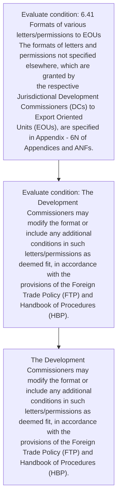
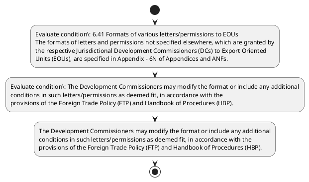

# Chapter 6 / Section 6.41: Formats of various letters/permissions to EOUs

**Chapter Title:** Export Oriented Units (EOUs), Electronics Hardware Technology Parks (EHTPs), Software Technology Parks (STPs) and Bio-Technology

**Pages:** 24

**Purpose:** 6.41 Formats of various letters/permissions to EOUs
The formats of letters and permissions not specified elsewhere, which are granted by
the respective Jurisdictional Development Commissioners (DCs) to Export Oriented
Units (EOUs), are specified in Appendix - 6N of Appendices and ANFs.

**Purpose Thanglish:** Indha Formats of various letters/permissions to EOUs section-la, 6.41 Formats of various letters/permissions to EOUs
The formats of letters and permissions not specified elsewhere, which are granted by
the respective Jurisdictional Development Commissioners (DCs) to export Oriented
Units (EOUs), are specified in Appendix - 6N of Appendices and ANFs.

**Summary:** 6.41 Formats of various letters/permissions to EOUs
The formats of letters and permissions not specified elsewhere, which are granted by
the respective Jurisdictional Development Commissioners (DCs) to Export Oriented
Units (EOUs), are specified in Appendix - 6N of Appendices and ANFs. The Development Commissioners may modify the format or include any additional
conditions in such letters/permissions as deemed fit, in accordance with the
provisions of the Foreign Trade Policy (FTP) and Handbook of Procedures (HBP). pg.

**Business Meaning:** 6.41 Formats of various letters/permissions to EOUs
The formats of letters and permissions not specified elsewhere, which are granted by
the respective Jurisdictional Development Commissioners (DCs) to Export Oriented
Units (EOUs), are specified in Appendix - 6N of Appendices and ANFs.

**Business Explanation:** 6.41 Formats of various letters/permissions to EOUs
The formats of letters and permissions not specified elsewhere, which are granted by
the respective Jurisdictional Development Commissioners (DCs) to Export Oriented
Units (EOUs), are specified in Appendix - 6N of Appendices and ANFs. The Development Commissioners may modify the format or include any additional
conditions in such letters/permissions as deemed fit, in accordance with the
provisions of the Foreign Trade Policy (FTP) and Handbook of Procedures (HBP). pg.

**Business Explanation Thanglish:** Indha Formats of various letters/permissions to EOUs section-la, 6.41 Formats of various letters/permissions to EOUs
The formats of letters and permissions not specified elsewhere, which are granted by
the respective Jurisdictional Development Commissioners (DCs) to export Oriented
Units (EOUs), are specified in Appendix - 6N of Appendices and ANFs. The Development Commissioners may modify the format or include any additional
conditions in such letters/permissions as deemed fit, in accordance with the
provisions of the Foreign Trade Policy (FTP) and Handbook of Procedures (HBP). pg.

## Business Logic
- None identified

## Business Rules
- rule_id=CH6-SEC6_41-R001, rule_description=IF validations pass THEN recommend action: The Development Commissioners may modify the format or include any additional
conditions in such letters/permissions as deemed fit, in accordance with the
provisions of the Foreign Trade Policy (FTP) and Handbook of Procedures (HBP)., trigger=Formats of various letters/permissions to EOUs, condition=6.41 Formats of various letters/permissions to EOUs
The formats of letters and permissions not specified elsewhere, which are granted by
the respective Jurisdictional Development Commissioners (DCs) to Export Oriented
Units (EOUs), are specified in Appendix - 6N of Appendices and ANFs., validation=Not explicitly covered in uploaded documents., action=The Development Commissioners may modify the format or include any additional
conditions in such letters/permissions as deemed fit, in accordance with the
provisions of the Foreign Trade Policy (FTP) and Handbook of Procedures (HBP)., exception=No explicit exception found in uploaded documents., output=DEKAI should produce a compliance decision for 6.41 - Formats of various letters/permissions to EOUs.

## Conditions
- 6.41 Formats of various letters/permissions to EOUs
The formats of letters and permissions not specified elsewhere, which are granted by
the respective Jurisdictional Development Commissioners (DCs) to Export Oriented
Units (EOUs), are specified in Appendix - 6N of Appendices and ANFs.
- The Development Commissioners may modify the format or include any additional
conditions in such letters/permissions as deemed fit, in accordance with the
provisions of the Foreign Trade Policy (FTP) and Handbook of Procedures (HBP).

## Condition Logic
- id=6.6.41.1, if=6.41 Formats of various letters/permissions to EOUs
The formats of letters and permissions not specified elsewhere, which are granted by
the respective Jurisdictional Development Commissioners (DCs) to Export Oriented
Units (EOUs), are specified in Appendix - 6N of Appendices and ANFs., then=The Development Commissioners may modify the format or include any additional
conditions in such letters/permissions as deemed fit, in accordance with the
provisions of the Foreign Trade Policy (FTP) and Handbook of Procedures (HBP)., source=6.41 Formats of various letters/permissions to EOUs
The formats of letters and permissions not specified elsewhere, which are granted by
the respective Jurisdictional Development Commissioners (DCs) to Export Oriented
Units (EOUs), are specified in Appendix - 6N of Appendices and ANFs.
- id=6.6.41.2, if=The Development Commissioners may modify the format or include any additional
conditions in such letters/permissions as deemed fit, in accordance with the
provisions of the Foreign Trade Policy (FTP) and Handbook of Procedures (HBP)., then=The Development Commissioners may modify the format or include any additional
conditions in such letters/permissions as deemed fit, in accordance with the
provisions of the Foreign Trade Policy (FTP) and Handbook of Procedures (HBP)., source=The Development Commissioners may modify the format or include any additional
conditions in such letters/permissions as deemed fit, in accordance with the
provisions of the Foreign Trade Policy (FTP) and Handbook of Procedures (HBP).

## Validations
- None identified

## Exceptions
- None identified

## Dependencies
- None identified

## Authorities
- None identified

## Required Documents
- None identified

## Timelines
- None identified

## Actions
- The Development Commissioners may modify the format or include any additional
conditions in such letters/permissions as deemed fit, in accordance with the
provisions of the Foreign Trade Policy (FTP) and Handbook of Procedures (HBP).

## Workflow
- Evaluate condition: 6.41 Formats of various letters/permissions to EOUs
The formats of letters and permissions not specified elsewhere, which are granted by
the respective Jurisdictional Development Commissioners (DCs) to Export Oriented
Units (EOUs), are specified in Appendix - 6N of Appendices and ANFs.
- Evaluate condition: The Development Commissioners may modify the format or include any additional
conditions in such letters/permissions as deemed fit, in accordance with the
provisions of the Foreign Trade Policy (FTP) and Handbook of Procedures (HBP).
- The Development Commissioners may modify the format or include any additional
conditions in such letters/permissions as deemed fit, in accordance with the
provisions of the Foreign Trade Policy (FTP) and Handbook of Procedures (HBP).

## Workflow ASCII
```text
Formats of various letters/permissions to EOUs
Evaluate condition: 6.41 Formats of various letters/permissions to EOUs
The formats of letters and permissions not specified elsewhere, which are granted by
the respective Jurisdictional Development Commissioners (DCs) to Export Oriented
Units (EOUs), are specified in Appendix - 6N of Appendices and ANFs.
   |
   v
Evaluate condition: The Development Commissioners may modify the format or include any additional
conditions in such letters/permissions as deemed fit, in accordance with the
provisions of the Foreign Trade Policy (FTP) and Handbook of Procedures (HBP).
   |
   v
The Development Commissioners may modify the format or include any additional
conditions in such letters/permissions as deemed fit, in accordance with the
provisions of the Foreign Trade Policy (FTP) and Handbook of Procedures (HBP).
```

## Decision Tree
- IF 6.41 Formats of various letters/permissions to EOUs
The formats of letters and permissions not specified elsewhere, which are granted by
the respective Jurisdictional Development Commissioners (DCs) to Export Oriented
Units (EOUs), are specified in Appendix - 6N of Appendices and ANFs. THEN The Development Commissioners may modify the format or include any additional
conditions in such letters/permissions as deemed fit, in accordance with the
provisions of the Foreign Trade Policy (FTP) and Handbook of Procedures (HBP).
- IF The Development Commissioners may modify the format or include any additional
conditions in such letters/permissions as deemed fit, in accordance with the
provisions of the Foreign Trade Policy (FTP) and Handbook of Procedures (HBP). THEN The Development Commissioners may modify the format or include any additional
conditions in such letters/permissions as deemed fit, in accordance with the
provisions of the Foreign Trade Policy (FTP) and Handbook of Procedures (HBP).

## Decision Tree ASCII
```text
Formats of various letters/permissions to EOUs Decision
IF 6.41 Formats of various letters/permissions to EOUs
The formats of letters and permissions not specified elsewhere, which are granted by
the respective Jurisdictional Development Commissioners (DCs) to Export Oriented
Units (EOUs), are specified in Appendix - 6N of Appendices and ANFs. THEN The Development Commissioners may modify the format or include any additional
conditions in such letters/permissions as deemed fit, in accordance with the
provisions of the Foreign Trade Policy (FTP) and Handbook of Procedures (HBP).
   |
   v
IF The Development Commissioners may modify the format or include any additional
conditions in such letters/permissions as deemed fit, in accordance with the
provisions of the Foreign Trade Policy (FTP) and Handbook of Procedures (HBP). THEN The Development Commissioners may modify the format or include any additional
conditions in such letters/permissions as deemed fit, in accordance with the
provisions of the Foreign Trade Policy (FTP) and Handbook of Procedures (HBP).
```

## Examples
- User asks to process Formats of various letters/permissions to EOUs; the platform checks conditions, validations, and documents before action.

**Real-world Example:** Example: an importer or exporter invokes Formats of various letters/permissions to EOUs, submits the prescribed DGFT records, and DEKAI uses the extracted rules to the development commissioners may modify the format or include any additional
conditions in such letters/permissions as deemed fit, in accordance with the
provisions of the foreign trade policy (ftp) and handbook of procedures (hbp)..

**Real-world Example Thanglish:** Indha Formats of various letters/permissions to EOUs section-la, Example: an importer or exporter invokes Formats of various letters/permissions to EOUs, submits the prescribed DGFT records, and DEKAI uses the extracted rules to the development commissioners may modify the format or include any additional
conditions in such letters/permissions as deemed fit, in accordance with the
provisions of the foreign trade policy (ftp) and handbook of procedures (hbp)..

## AI Rules
- IF validations pass THEN recommend action: The Development Commissioners may modify the format or include any additional
conditions in such letters/permissions as deemed fit, in accordance with the
provisions of the Foreign Trade Policy (FTP) and Handbook of Procedures (HBP).

## Database Fields
- name=section_code, type=string, required=True, source=parsed_section_heading
- name=section_title, type=string, required=True, source=parsed_section_heading
- name=the_flag, type=boolean, required=False, source=keyword:The
- name=and_flag, type=boolean, required=False, source=keyword:and
- name=not_flag, type=boolean, required=False, source=keyword:not
- name=are_flag, type=boolean, required=False, source=keyword:are
- name=dcs_flag, type=boolean, required=False, source=keyword:DCs
- name=may_flag, type=boolean, required=False, source=keyword:may
- name=any_flag, type=boolean, required=False, source=keyword:any
- name=fit_flag, type=boolean, required=False, source=keyword:fit

## API Requirements
- method=GET, path=/api/dgft/sections/6.41, purpose=Retrieve knowledge payload for section 6.41, query_params=['include=workflow,decision_tree,validations'], response_fields=['section', 'title', 'summary', 'conditions', 'validations', 'exceptions', 'workflow', 'decision_tree']
- method=POST, path=/api/dgft/Formats-of-various-letters-permissions-to-EOUs/validate, purpose=Validate inputs and documents for Formats of various letters/permissions to EOUs, request_fields=['section_code', 'section_title'], response_fields=['status', 'errors', 'warnings', 'next_actions']
- method=POST, path=/api/dgft/Formats-of-various-letters-permissions-to-EOUs/execute, purpose=Trigger business action for The Development Commissioners may modify the format or include any additional
conditions in such letters/permissions as deemed fit, in accordance with the
provisions of the Foreign Trade Policy (FTP) and Handbook of Procedures (HBP)., request_fields=['section_code', 'section_title'], response_fields=['reference_id', 'status', 'authority', 'timeline']

## UI Screens
- screen_id=Formats_of_various_letters_permissions_to_EOUs_overview, name=Formats of various letters/permissions to EOUs Overview, purpose=Show section summary, authority, timeline, and eligibility cues., widgets=['summary_card', 'conditions_table', 'authority_badges', 'timeline_panel']
- screen_id=Formats_of_various_letters_permissions_to_EOUs_submission, name=Formats of various letters/permissions to EOUs Submission, purpose=Capture applicant data and supporting documents., widgets=['dynamic_form', 'document_uploader', 'validation_panel', 'next_action_footer'], fields=['section_code', 'section_title', 'the_flag', 'and_flag', 'not_flag', 'are_flag', 'dcs_flag', 'may_flag']

## Error Messages
- Validation failed because the section requirements were not fully met.

## FAQ
- question_en=What is the purpose of section 6.41?, answer_en=6.41 Formats of various letters/permissions to EOUs
The formats of letters and permissions not specified elsewhere, which are granted by
the respective Jurisdictional Development Commissioners (DCs) to Export Oriented
Units (EOUs), are specified in Appendix - 6N of Appendices and ANFs. The Development Commissioners may modify the format or include any additional
conditions in such letters/permissions as deemed fit, in accordance with the
provisions of the Foreign Trade Policy (FTP) and Handbook of Procedures (HBP). pg., question_thanglish=Indha Formats of various letters/permissions to EOUs section-la, What is the purpose of section 6.41?, answer_thanglish=Indha Formats of various letters/permissions to EOUs section-la, 6.41 Formats of various letters/permissions to EOUs
The formats of letters and permissions not specified elsewhere, which are granted by
the respective Jurisdictional Development Commissioners (DCs) to export Oriented
Units (EOUs), are specified in Appendix - 6N of Appendices and ANFs. The Development Commissioners may modify the format or include any additional
conditions in such letters/permissions as deemed fit, in accordance with the
provisions of the Foreign Trade Policy (FTP) and Handbook of Procedures (HBP). pg.
- question_en=What documents are required under Formats of various letters/permissions to EOUs?, answer_en=Not explicitly covered in uploaded documents., question_thanglish=Indha Formats of various letters/permissions to EOUs section-la, What documents are required under Formats of various letters/permissions to EOUs?, answer_thanglish=Indha Formats of various letters/permissions to EOUs section-la, Not explicitly covered in uploaded documents.
- question_en=Which authority handles Formats of various letters/permissions to EOUs?, answer_en=Not explicitly covered in uploaded documents., question_thanglish=Indha Formats of various letters/permissions to EOUs section-la, Which authority handles Formats of various letters/permissions to EOUs?, answer_thanglish=Indha Formats of various letters/permissions to EOUs section-la, Not explicitly covered in uploaded documents.

## Questions Users May Ask
- What does Formats of various letters/permissions to EOUs require?
- Which documents are needed for Formats of various letters/permissions to EOUs?
- How does DEKAI validate Formats of various letters/permissions to EOUs requests?
- What action should be taken for Formats of various letters/permissions to EOUs?

## Expected AI Answers
- Formats of various letters/permissions to EOUs requires the platform to interpret the section text, apply the extracted business rules, and present the correct next action.
- Required documents are inferred from the section text: no explicit documents were detected.
- DEKAI validates Formats of various letters/permissions to EOUs by checking conditions, required documents, authority references, and exception clauses before recommending an outcome.
- The primary extracted action is: The Development Commissioners may modify the format or include any additional
conditions in such letters/permissions as deemed fit, in accordance with the
provisions of the Foreign Trade Policy (FTP) and Handbook of Procedures (HBP).

## AI Q&A Examples
- question_en=User asks: How do I comply with Formats of various letters/permissions to EOUs?, answer_en=AI answers: DEKAI should evaluate section 6.41, apply the extracted rules, and guide the user through Evaluate condition: 6.41 Formats of various letters/permissions to EOUs
The formats of letters and permissions not specified elsewhere, which are granted by
the respective Jurisdictional Development Commissioners (DCs) to Export Oriented
Units (EOUs), are specified in Appendix - 6N of Appendices and ANFs.., question_thanglish=Indha Formats of various letters/permissions to EOUs section-la, User asks: How do I comply with Formats of various letters/permissions to EOUs?, answer_thanglish=Indha Formats of various letters/permissions to EOUs section-la, AI answers: DEKAI should evaluate section 6.41, apply the extracted rules, and guide the user through Evaluate condition: 6.41 Formats of various letters/permissions to EOUs
The formats of letters and permissions not specified elsewhere, which are granted by
the respective Jurisdictional Development Commissioners (DCs) to export Oriented
Units (EOUs), are specified in Appendix - 6N of Appendices and ANFs..
- question_en=User asks: Which validations apply to Formats of various letters/permissions to EOUs?, answer_en=AI answers: Applicable validations are not explicitly covered in the uploaded documents., question_thanglish=Indha Formats of various letters/permissions to EOUs section-la, User asks: Which validations apply to Formats of various letters/permissions to EOUs?, answer_thanglish=Indha Formats of various letters/permissions to EOUs section-la, AI answers: Applicable validations are not explicitly covered in the uploaded documents.

## DEKAI AI Implementation Notes
- Capture chapter 6, section 6.41, title, and page references as immutable knowledge metadata.
- Bind validations for Formats of various letters/permissions to EOUs into a rule engine keyed by the rule IDs extracted for this section.

## DEKAI AI Implementation Notes Thanglish
- Indha Formats of various letters/permissions to EOUs section-la, Capture chapter 6, section 6.41, title, and page references as immutable knowledge metadata.
- Indha Formats of various letters/permissions to EOUs section-la, Bind validations for Formats of various letters/permissions to EOUs into a rule engine keyed by the rule IDs extracted for this section.

## AI Metadata
- Keywords: The, and, not, are, DCs, may, any, fit, FTP, HBP, for, EOU, TED, EOUs, ANFs, such, with, exit, tour, Duty
- Search Keywords: The, and, not, are, DCs, may, any, fit, FTP, HBP, for, EOU, TED, EOUs, ANFs, such, with, exit, tour, Duty
- Intent: Support Formats of various letters/permissions to EOUs processing and compliance validation.
- Tags: 6.41, Formats of various letters/permissions to EOUs, dgft
- Related Sections: 
- Related Chapters: 
- Related Rules: 

## Mermaid


## PlantUML

