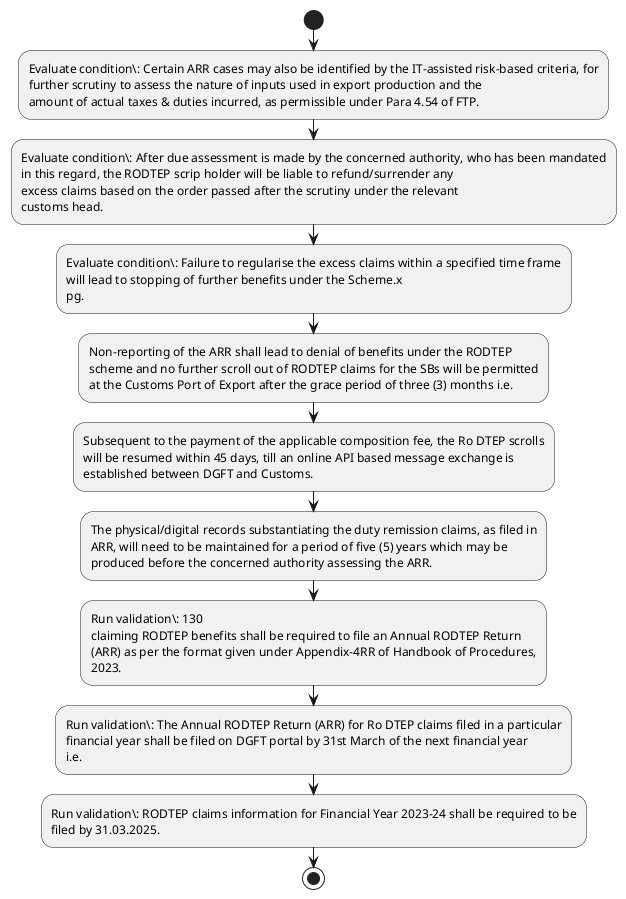

# Chapter 4 / Section 6: Certain ARR cases may also be identified by the IT-assisted risk-based criteria, for

**Chapter Title:** Duty Exemption / Remission Schemes

**Pages:** 55

**Purpose:** Certain ARR cases may also be identified by the IT-assisted risk-based criteria, for
further scrutiny to assess the nature of inputs used in export production and the
amount of actual taxes & duties incurred, as permissible under Para 4.54 of FTP.

**Purpose Thanglish:** Indha Certain ARR cases may also be identified by the IT-assisted risk-based criteria, for section-la, Certain ARR cases may also be identified by the IT-assisted risk-based criteria, for
further scrutiny to assess the nature of inputs used in export production and the
amount of actual taxes & duties incurred, as permissible under Para 4.54 of FTP.

**Summary:** 6. Certain ARR cases may also be identified by the IT-assisted risk-based criteria, for
further scrutiny to assess the nature of inputs used in export production and the
amount of actual taxes & duties incurred, as permissible under Para 4.54 of FTP. After due assessment is made by the concerned authority, who has been mandated
in this regard, the RODTEP scrip holder will be liable to refund/surrender any
excess claims based on the order passed after the scrutiny under the relevant
customs head.

**Business Meaning:** Certain ARR cases may also be identified by the IT-assisted risk-based criteria, for governs how DGFT business controls should be applied, validated, and enforced.

**Business Explanation:** Certain ARR cases may also be identified by the IT-assisted risk-based criteria, for explains the operating rule set that DEKAI should enforce. Key control points include 130
claiming RODTEP benefits shall be required to file an Annual RODTEP Return
(ARR) as per the format given under Appendix-4RR of Handbook of Procedures,
2023. The section also drives actions such as Non-reporting of the ARR shall lead to denial of benefits under the RODTEP
scheme and no further scroll out of RODTEP claims for the SBs will be permitted
at the Customs Port of Export after the grace period of three (3) months i.e..

**Business Explanation Thanglish:** Indha Certain ARR cases may also be identified by the IT-assisted risk-based criteria, for section-la, Certain ARR cases may also be identified by the IT-assisted risk-based criteria, for explains the operating rule set that DEKAI should enforce. Key control points include 130
claiming RODTEP benefits kandippa be required to file an Annual RODTEP Return
(ARR) as per the format given under Appendix-4RR of Handbook of Procedures,
2023. The section also drives actions such as Non-reporting of the ARR kandippa lead to denial of benefits under the RODTEP
scheme and no further scroll out of RODTEP claims for the SBs will be permitted
at the Customs Port of export after the grace period of three (3) months i.e..

## Business Logic
- 130
claiming RODTEP benefits shall be required to file an Annual RODTEP Return
(ARR) as per the format given under Appendix-4RR of Handbook of Procedures,
2023.
- The Annual RODTEP Return (ARR) for Ro DTEP claims filed in a particular
financial year shall be filed on DGFT portal by 31st March of the next financial year
i.e.
- RODTEP claims information for Financial Year 2023-24 shall be required to be
filed by 31.03.2025.
- Non-reporting of the ARR shall lead to denial of benefits under the RODTEP
scheme and no further scroll out of RODTEP claims for the SBs will be permitted
at the Customs Port of Export after the grace period of three (3) months i.e.
- The resumption of scroll out shall also
cover the Shipping Bills that were not scrolled out earlier on account of non-
compliance of ARR.

## Business Rules
- rule_id=CH4-SEC6-R001, rule_description=130
claiming RODTEP benefits shall be required to file an Annual RODTEP Return
(ARR) as per the format given under Appendix-4RR of Handbook of Procedures,
2023., trigger=Certain ARR cases may also be identified by the IT-assisted risk-based criteria, for, condition=Certain ARR cases may also be identified by the IT-assisted risk-based criteria, for
further scrutiny to assess the nature of inputs used in export production and the
amount of actual taxes & duties incurred, as permissible under Para 4.54 of FTP., validation=130
claiming RODTEP benefits shall be required to file an Annual RODTEP Return
(ARR) as per the format given under Appendix-4RR of Handbook of Procedures,
2023., action=Non-reporting of the ARR shall lead to denial of benefits under the RODTEP
scheme and no further scroll out of RODTEP claims for the SBs will be permitted
at the Customs Port of Export after the grace period of three (3) months i.e., exception=No explicit exception found in uploaded documents., output=DEKAI should produce a compliance decision for 6 - Certain ARR cases may also be identified by the IT-assisted risk-based criteria, for.
- rule_id=CH4-SEC6-R002, rule_description=The Annual RODTEP Return (ARR) for Ro DTEP claims filed in a particular
financial year shall be filed on DGFT portal by 31st March of the next financial year
i.e., trigger=Certain ARR cases may also be identified by the IT-assisted risk-based criteria, for, condition=After due assessment is made by the concerned authority, who has been mandated
in this regard, the RODTEP scrip holder will be liable to refund/surrender any
excess claims based on the order passed after the scrutiny under the relevant
customs head., validation=The Annual RODTEP Return (ARR) for Ro DTEP claims filed in a particular
financial year shall be filed on DGFT portal by 31st March of the next financial year
i.e., action=Subsequent to the payment of the applicable composition fee, the Ro DTEP scrolls
will be resumed within 45 days, till an online API based message exchange is
established between DGFT and Customs., exception=No explicit exception found in uploaded documents., output=DEKAI should produce a compliance decision for 6 - Certain ARR cases may also be identified by the IT-assisted risk-based criteria, for.
- rule_id=CH4-SEC6-R003, rule_description=RODTEP claims information for Financial Year 2023-24 shall be required to be
filed by 31.03.2025., trigger=Certain ARR cases may also be identified by the IT-assisted risk-based criteria, for, condition=Failure to regularise the excess claims within a specified time frame
will lead to stopping of further benefits under the Scheme.x
pg., validation=RODTEP claims information for Financial Year 2023-24 shall be required to be
filed by 31.03.2025., action=The physical/digital records substantiating the duty remission claims, as filed in
ARR, will need to be maintained for a period of five (5) years which may be
produced before the concerned authority assessing the ARR., exception=No explicit exception found in uploaded documents., output=DEKAI should produce a compliance decision for 6 - Certain ARR cases may also be identified by the IT-assisted risk-based criteria, for.
- rule_id=CH4-SEC6-R004, rule_description=Non-reporting of the ARR shall lead to denial of benefits under the RODTEP
scheme and no further scroll out of RODTEP claims for the SBs will be permitted
at the Customs Port of Export after the grace period of three (3) months i.e., trigger=Certain ARR cases may also be identified by the IT-assisted risk-based criteria, for, condition=Non-reporting of the ARR shall lead to denial of benefits under the RODTEP
scheme and no further scroll out of RODTEP claims for the SBs will be permitted
at the Customs Port of Export after the grace period of three (3) months i.e., validation=Non-reporting of the ARR shall lead to denial of benefits under the RODTEP
scheme and no further scroll out of RODTEP claims for the SBs will be permitted
at the Customs Port of Export after the grace period of three (3) months i.e., action=The physical/digital records substantiating the duty remission claims, as filed in
ARR, will need to be maintained for a period of five (5) years which may be
produced before the concerned authority assessing the ARR., exception=No explicit exception found in uploaded documents., output=DEKAI should produce a compliance decision for 6 - Certain ARR cases may also be identified by the IT-assisted risk-based criteria, for.
- rule_id=CH4-SEC6-R005, rule_description=The resumption of scroll out shall also
cover the Shipping Bills that were not scrolled out earlier on account of non-
compliance of ARR., trigger=Certain ARR cases may also be identified by the IT-assisted risk-based criteria, for, condition=after
30th June., validation=The resumption of scroll out shall also
cover the Shipping Bills that were not scrolled out earlier on account of non-
compliance of ARR., action=The physical/digital records substantiating the duty remission claims, as filed in
ARR, will need to be maintained for a period of five (5) years which may be
produced before the concerned authority assessing the ARR., exception=No explicit exception found in uploaded documents., output=DEKAI should produce a compliance decision for 6 - Certain ARR cases may also be identified by the IT-assisted risk-based criteria, for.

## Conditions
- Certain ARR cases may also be identified by the IT-assisted risk-based criteria, for
further scrutiny to assess the nature of inputs used in export production and the
amount of actual taxes & duties incurred, as permissible under Para 4.54 of FTP.
- After due assessment is made by the concerned authority, who has been mandated
in this regard, the RODTEP scrip holder will be liable to refund/surrender any
excess claims based on the order passed after the scrutiny under the relevant
customs head.
- Failure to regularise the excess claims within a specified time frame
will lead to stopping of further benefits under the Scheme.x
pg.
- Non-reporting of the ARR shall lead to denial of benefits under the RODTEP
scheme and no further scroll out of RODTEP claims for the SBs will be permitted
at the Customs Port of Export after the grace period of three (3) months i.e.
- after
30th June.
- Thereafter, a composition fees of Rs.20,000 /- will need to be paid after 30th June.
- The physical/digital records substantiating the duty remission claims, as filed in
ARR, will need to be maintained for a period of five (5) years which may be
produced before the concerned authority assessing the ARR.
- ARR filings may also be periodically assessed for necessary due diligence and
presented before Ro DTEP Committee for suitable revision of rates including for
the consideration of higher rates wherever warranted.
- Failure to regularise the excess claims within a specified time frame
will lead to stopping of further benefits under the Scheme.x

## Condition Logic
- id=4.6.1, if=Certain ARR cases may also be identified by the IT-assisted risk-based criteria, for
further scrutiny to assess the nature of inputs used in export production and the
amount of actual taxes & duties incurred, as permissible under Para 4.54 of FTP., then=Non-reporting of the ARR shall lead to denial of benefits under the RODTEP
scheme and no further scroll out of RODTEP claims for the SBs will be permitted
at the Customs Port of Export after the grace period of three (3) months i.e., source=Certain ARR cases may also be identified by the IT-assisted risk-based criteria, for
further scrutiny to assess the nature of inputs used in export production and the
amount of actual taxes & duties incurred, as permissible under Para 4.54 of FTP.
- id=4.6.2, if=After due assessment is made by the concerned authority, who has been mandated
in this regard, the RODTEP scrip holder will be liable to refund/surrender any
excess claims based on the order passed after the scrutiny under the relevant
customs head., then=Non-reporting of the ARR shall lead to denial of benefits under the RODTEP
scheme and no further scroll out of RODTEP claims for the SBs will be permitted
at the Customs Port of Export after the grace period of three (3) months i.e., source=After due assessment is made by the concerned authority, who has been mandated
in this regard, the RODTEP scrip holder will be liable to refund/surrender any
excess claims based on the order passed after the scrutiny under the relevant
customs head.
- id=4.6.3, if=Failure to regularise the excess claims within a specified time frame
will lead to stopping of further benefits under the Scheme.x
pg., then=Non-reporting of the ARR shall lead to denial of benefits under the RODTEP
scheme and no further scroll out of RODTEP claims for the SBs will be permitted
at the Customs Port of Export after the grace period of three (3) months i.e., source=Failure to regularise the excess claims within a specified time frame
will lead to stopping of further benefits under the Scheme.x
pg.
- id=4.6.4, if=Non-reporting of the ARR shall lead to denial of benefits under the RODTEP
scheme and no further scroll out of RODTEP claims for the SBs will be permitted
at the Customs Port of Export after the grace period of three (3) months i.e., then=Non-reporting of the ARR shall lead to denial of benefits under the RODTEP
scheme and no further scroll out of RODTEP claims for the SBs will be permitted
at the Customs Port of Export after the grace period of three (3) months i.e., source=Non-reporting of the ARR shall lead to denial of benefits under the RODTEP
scheme and no further scroll out of RODTEP claims for the SBs will be permitted
at the Customs Port of Export after the grace period of three (3) months i.e.
- id=4.6.5, if=after
30th June., then=Non-reporting of the ARR shall lead to denial of benefits under the RODTEP
scheme and no further scroll out of RODTEP claims for the SBs will be permitted
at the Customs Port of Export after the grace period of three (3) months i.e., source=after
30th June.
- id=4.6.6, if=Thereafter, a composition fees of Rs.20,000 /- will need to be paid after 30th June., then=Non-reporting of the ARR shall lead to denial of benefits under the RODTEP
scheme and no further scroll out of RODTEP claims for the SBs will be permitted
at the Customs Port of Export after the grace period of three (3) months i.e., source=Thereafter, a composition fees of Rs.20,000 /- will need to be paid after 30th June.
- id=4.6.7, if=The physical/digital records substantiating the duty remission claims, as filed in
ARR, will need to be maintained for a period of five (5) years which may be
produced before the concerned authority assessing the ARR., then=Non-reporting of the ARR shall lead to denial of benefits under the RODTEP
scheme and no further scroll out of RODTEP claims for the SBs will be permitted
at the Customs Port of Export after the grace period of three (3) months i.e., source=The physical/digital records substantiating the duty remission claims, as filed in
ARR, will need to be maintained for a period of five (5) years which may be
produced before the concerned authority assessing the ARR.
- id=4.6.8, if=ARR filings may also be periodically assessed for necessary due diligence and
presented before Ro DTEP Committee for suitable revision of rates including for
the consideration of higher rates wherever warranted., then=Non-reporting of the ARR shall lead to denial of benefits under the RODTEP
scheme and no further scroll out of RODTEP claims for the SBs will be permitted
at the Customs Port of Export after the grace period of three (3) months i.e., source=ARR filings may also be periodically assessed for necessary due diligence and
presented before Ro DTEP Committee for suitable revision of rates including for
the consideration of higher rates wherever warranted.
- id=4.6.9, if=Failure to regularise the excess claims within a specified time frame
will lead to stopping of further benefits under the Scheme.x, then=Non-reporting of the ARR shall lead to denial of benefits under the RODTEP
scheme and no further scroll out of RODTEP claims for the SBs will be permitted
at the Customs Port of Export after the grace period of three (3) months i.e., source=Failure to regularise the excess claims within a specified time frame
will lead to stopping of further benefits under the Scheme.x

## Validations
- 130
claiming RODTEP benefits shall be required to file an Annual RODTEP Return
(ARR) as per the format given under Appendix-4RR of Handbook of Procedures,
2023.
- The Annual RODTEP Return (ARR) for Ro DTEP claims filed in a particular
financial year shall be filed on DGFT portal by 31st March of the next financial year
i.e.
- RODTEP claims information for Financial Year 2023-24 shall be required to be
filed by 31.03.2025.
- Non-reporting of the ARR shall lead to denial of benefits under the RODTEP
scheme and no further scroll out of RODTEP claims for the SBs will be permitted
at the Customs Port of Export after the grace period of three (3) months i.e.
- The resumption of scroll out shall also
cover the Shipping Bills that were not scrolled out earlier on account of non-
compliance of ARR.

## Exceptions
- None identified

## Dependencies
- 4.54
- 1
- 2
- 3
- 4
- 5

## Authorities
- customs
- DGFT
- DGFT and Customs
- Ro DTEP Committee

## Required Documents
- The resumption of scroll out shall also
cover the Shipping Bills that were not scrolled out earlier on account of non-
compliance of ARR.

## Timelines
- After due assessment is made by the concerned authority, who has been mandated
in this regard, the RODTEP scrip holder will be liable to refund/surrender any
excess claims based on the order passed after the scrutiny under the relevant
customs head.
- Failure to regularise the excess claims within a specified time frame
will lead to stopping of further benefits under the Scheme.x
pg.
- Non-reporting of the ARR shall lead to denial of benefits under the RODTEP
scheme and no further scroll out of RODTEP claims for the SBs will be permitted
at the Customs Port of Export after the grace period of three (3) months i.e.
- after
30th June.
- RODTEP claims information for Financial Year 2023-24 with
composition fees can be filed within a grace period of 3 months i.e.by 30.06.2025.
- Thereafter, a composition fees of Rs.20,000 /- will need to be paid after 30th June.
- Subsequent to the payment of the applicable composition fee, the Ro DTEP scrolls
will be resumed within 45 days, till an online API based message exchange is
established between DGFT and Customs.
- The physical/digital records substantiating the duty remission claims, as filed in
ARR, will need to be maintained for a period of five (5) years which may be
produced before the concerned authority assessing the ARR.
- ARR filings may also be periodically assessed for necessary due diligence and
presented before Ro DTEP Committee for suitable revision of rates including for
the consideration of higher rates wherever warranted.
- Failure to regularise the excess claims within a specified time frame
will lead to stopping of further benefits under the Scheme.x

## Actions
- Non-reporting of the ARR shall lead to denial of benefits under the RODTEP
scheme and no further scroll out of RODTEP claims for the SBs will be permitted
at the Customs Port of Export after the grace period of three (3) months i.e.
- Subsequent to the payment of the applicable composition fee, the Ro DTEP scrolls
will be resumed within 45 days, till an online API based message exchange is
established between DGFT and Customs.
- The physical/digital records substantiating the duty remission claims, as filed in
ARR, will need to be maintained for a period of five (5) years which may be
produced before the concerned authority assessing the ARR.

## Workflow
- Evaluate condition: Certain ARR cases may also be identified by the IT-assisted risk-based criteria, for
further scrutiny to assess the nature of inputs used in export production and the
amount of actual taxes & duties incurred, as permissible under Para 4.54 of FTP.
- Evaluate condition: After due assessment is made by the concerned authority, who has been mandated
in this regard, the RODTEP scrip holder will be liable to refund/surrender any
excess claims based on the order passed after the scrutiny under the relevant
customs head.
- Evaluate condition: Failure to regularise the excess claims within a specified time frame
will lead to stopping of further benefits under the Scheme.x
pg.
- Non-reporting of the ARR shall lead to denial of benefits under the RODTEP
scheme and no further scroll out of RODTEP claims for the SBs will be permitted
at the Customs Port of Export after the grace period of three (3) months i.e.
- Subsequent to the payment of the applicable composition fee, the Ro DTEP scrolls
will be resumed within 45 days, till an online API based message exchange is
established between DGFT and Customs.
- The physical/digital records substantiating the duty remission claims, as filed in
ARR, will need to be maintained for a period of five (5) years which may be
produced before the concerned authority assessing the ARR.
- Run validation: 130
claiming RODTEP benefits shall be required to file an Annual RODTEP Return
(ARR) as per the format given under Appendix-4RR of Handbook of Procedures,
2023.
- Run validation: The Annual RODTEP Return (ARR) for Ro DTEP claims filed in a particular
financial year shall be filed on DGFT portal by 31st March of the next financial year
i.e.
- Run validation: RODTEP claims information for Financial Year 2023-24 shall be required to be
filed by 31.03.2025.

## Workflow ASCII
```text
Certain ARR cases may also be identified by the IT-assisted risk-based criteria, for
Evaluate condition: Certain ARR cases may also be identified by the IT-assisted risk-based criteria, for
further scrutiny to assess the nature of inputs used in export production and the
amount of actual taxes & duties incurred, as permissible under Para 4.54 of FTP.
   |
   v
Evaluate condition: After due assessment is made by the concerned authority, who has been mandated
in this regard, the RODTEP scrip holder will be liable to refund/surrender any
excess claims based on the order passed after the scrutiny under the relevant
customs head.
   |
   v
Evaluate condition: Failure to regularise the excess claims within a specified time frame
will lead to stopping of further benefits under the Scheme.x
pg.
   |
   v
Non-reporting of the ARR shall lead to denial of benefits under the RODTEP
scheme and no further scroll out of RODTEP claims for the SBs will be permitted
at the Customs Port of Export after the grace period of three (3) months i.e.
   |
   v
Subsequent to the payment of the applicable composition fee, the Ro DTEP scrolls
will be resumed within 45 days, till an online API based message exchange is
established between DGFT and Customs.
   |
   v
The physical/digital records substantiating the duty remission claims, as filed in
ARR, will need to be maintained for a period of five (5) years which may be
produced before the concerned authority assessing the ARR.
   |
   v
Run validation: 130
claiming RODTEP benefits shall be required to file an Annual RODTEP Return
(ARR) as per the format given under Appendix-4RR of Handbook of Procedures,
2023.
   |
   v
Run validation: The Annual RODTEP Return (ARR) for Ro DTEP claims filed in a particular
financial year shall be filed on DGFT portal by 31st March of the next financial year
i.e.
   |
   v
Run validation: RODTEP claims information for Financial Year 2023-24 shall be required to be
filed by 31.03.2025.
```

## Decision Tree
- IF Certain ARR cases may also be identified by the IT-assisted risk-based criteria, for
further scrutiny to assess the nature of inputs used in export production and the
amount of actual taxes & duties incurred, as permissible under Para 4.54 of FTP. THEN Non-reporting of the ARR shall lead to denial of benefits under the RODTEP
scheme and no further scroll out of RODTEP claims for the SBs will be permitted
at the Customs Port of Export after the grace period of three (3) months i.e.
- IF After due assessment is made by the concerned authority, who has been mandated
in this regard, the RODTEP scrip holder will be liable to refund/surrender any
excess claims based on the order passed after the scrutiny under the relevant
customs head. THEN Non-reporting of the ARR shall lead to denial of benefits under the RODTEP
scheme and no further scroll out of RODTEP claims for the SBs will be permitted
at the Customs Port of Export after the grace period of three (3) months i.e.
- IF Failure to regularise the excess claims within a specified time frame
will lead to stopping of further benefits under the Scheme.x
pg. THEN Non-reporting of the ARR shall lead to denial of benefits under the RODTEP
scheme and no further scroll out of RODTEP claims for the SBs will be permitted
at the Customs Port of Export after the grace period of three (3) months i.e.
- IF Non-reporting of the ARR shall lead to denial of benefits under the RODTEP
scheme and no further scroll out of RODTEP claims for the SBs will be permitted
at the Customs Port of Export after the grace period of three (3) months i.e. THEN Non-reporting of the ARR shall lead to denial of benefits under the RODTEP
scheme and no further scroll out of RODTEP claims for the SBs will be permitted
at the Customs Port of Export after the grace period of three (3) months i.e.
- IF after
30th June. THEN Non-reporting of the ARR shall lead to denial of benefits under the RODTEP
scheme and no further scroll out of RODTEP claims for the SBs will be permitted
at the Customs Port of Export after the grace period of three (3) months i.e.

## Decision Tree ASCII
```text
Certain ARR cases may also be identified by the IT-assisted risk-based criteria, for Decision
IF Certain ARR cases may also be identified by the IT-assisted risk-based criteria, for
further scrutiny to assess the nature of inputs used in export production and the
amount of actual taxes & duties incurred, as permissible under Para 4.54 of FTP. THEN Non-reporting of the ARR shall lead to denial of benefits under the RODTEP
scheme and no further scroll out of RODTEP claims for the SBs will be permitted
at the Customs Port of Export after the grace period of three (3) months i.e.
   |
   v
IF After due assessment is made by the concerned authority, who has been mandated
in this regard, the RODTEP scrip holder will be liable to refund/surrender any
excess claims based on the order passed after the scrutiny under the relevant
customs head. THEN Non-reporting of the ARR shall lead to denial of benefits under the RODTEP
scheme and no further scroll out of RODTEP claims for the SBs will be permitted
at the Customs Port of Export after the grace period of three (3) months i.e.
   |
   v
IF Failure to regularise the excess claims within a specified time frame
will lead to stopping of further benefits under the Scheme.x
pg. THEN Non-reporting of the ARR shall lead to denial of benefits under the RODTEP
scheme and no further scroll out of RODTEP claims for the SBs will be permitted
at the Customs Port of Export after the grace period of three (3) months i.e.
   |
   v
IF Non-reporting of the ARR shall lead to denial of benefits under the RODTEP
scheme and no further scroll out of RODTEP claims for the SBs will be permitted
at the Customs Port of Export after the grace period of three (3) months i.e. THEN Non-reporting of the ARR shall lead to denial of benefits under the RODTEP
scheme and no further scroll out of RODTEP claims for the SBs will be permitted
at the Customs Port of Export after the grace period of three (3) months i.e.
   |
   v
IF after
30th June. THEN Non-reporting of the ARR shall lead to denial of benefits under the RODTEP
scheme and no further scroll out of RODTEP claims for the SBs will be permitted
at the Customs Port of Export after the grace period of three (3) months i.e.
```

## Examples
- User asks to process Certain ARR cases may also be identified by the IT-assisted risk-based criteria, for; the platform checks conditions, validations, and documents before action.

**Real-world Example:** Example: an importer or exporter invokes Certain ARR cases may also be identified by the IT-assisted risk-based criteria, for, submits The resumption of scroll out shall also
cover the Shipping Bills that were not scrolled out earlier on account of non-
compliance of ARR., and DEKAI uses the extracted rules to non-reporting of the arr shall lead to denial of benefits under the rodtep
scheme and no further scroll out of rodtep claims for the sbs will be permitted
at the customs port of export after the grace period of three (3) months i.e..

**Real-world Example Thanglish:** Indha Certain ARR cases may also be identified by the IT-assisted risk-based criteria, for section-la, Example: an importer or exporter invokes Certain ARR cases may also be identified by the IT-assisted risk-based criteria, for, submits The resumption of scroll out kandippa also
cover the Shipping Bills that were not scrolled out earlier on account of non-
compliance of ARR., and DEKAI uses the extracted rules to non-reporting of the arr kandippa lead to denial of benefits under the rodtep
scheme and no further scroll out of rodtep claims for the sbs will be permitted
at the customs port of export after the grace period of three (3) months i.e..

## AI Rules
- IF detected context matches section rule THEN enforce: 130
claiming RODTEP benefits shall be required to file an Annual RODTEP Return
(ARR) as per the format given under Appendix-4RR of Handbook of Procedures,
2023.
- IF detected context matches section rule THEN enforce: The Annual RODTEP Return (ARR) for Ro DTEP claims filed in a particular
financial year shall be filed on DGFT portal by 31st March of the next financial year
i.e.
- IF detected context matches section rule THEN enforce: RODTEP claims information for Financial Year 2023-24 shall be required to be
filed by 31.03.2025.
- IF detected context matches section rule THEN enforce: Non-reporting of the ARR shall lead to denial of benefits under the RODTEP
scheme and no further scroll out of RODTEP claims for the SBs will be permitted
at the Customs Port of Export after the grace period of three (3) months i.e.
- IF detected context matches section rule THEN enforce: The resumption of scroll out shall also
cover the Shipping Bills that were not scrolled out earlier on account of non-
compliance of ARR.
- IF validations pass THEN recommend action: Non-reporting of the ARR shall lead to denial of benefits under the RODTEP
scheme and no further scroll out of RODTEP claims for the SBs will be permitted
at the Customs Port of Export after the grace period of three (3) months i.e.

## Database Fields
- name=section_code, type=string, required=True, source=parsed_section_heading
- name=section_title, type=string, required=True, source=parsed_section_heading
- name=arr_flag, type=boolean, required=False, source=keyword:ARR
- name=may_flag, type=boolean, required=False, source=keyword:may
- name=the_flag, type=boolean, required=False, source=keyword:the
- name=for_flag, type=boolean, required=False, source=keyword:for
- name=and_flag, type=boolean, required=False, source=keyword:and
- name=ftp_flag, type=boolean, required=False, source=keyword:FTP
- name=due_flag, type=boolean, required=False, source=keyword:due
- name=who_flag, type=boolean, required=False, source=keyword:who
- name=document_1_submitted, type=boolean, required=True, source=The resumption of scroll out shall also
cover the Shipping Bills that were not scrolled out earlier on account of non-
compliance of ARR.

## API Requirements
- method=GET, path=/api/dgft/sections/6, purpose=Retrieve knowledge payload for section 6, query_params=['include=workflow,decision_tree,validations'], response_fields=['section', 'title', 'summary', 'conditions', 'validations', 'exceptions', 'workflow', 'decision_tree']
- method=POST, path=/api/dgft/Certain-ARR-cases-may-also-be-identified-by-the-IT-assisted-risk-based-criteria-for/validate, purpose=Validate inputs and documents for Certain ARR cases may also be identified by the IT-assisted risk-based criteria, for, request_fields=['section_code', 'section_title', 'document_1_submitted'], response_fields=['status', 'errors', 'warnings', 'next_actions']
- method=POST, path=/api/dgft/Certain-ARR-cases-may-also-be-identified-by-the-IT-assisted-risk-based-criteria-for/execute, purpose=Trigger business action for Non-reporting of the ARR shall lead to denial of benefits under the RODTEP
scheme and no further scroll out of RODTEP claims for the SBs will be permitted
at the Customs Port of Export after the grace period of three (3) months i.e., request_fields=['section_code', 'section_title', 'document_1_submitted'], response_fields=['reference_id', 'status', 'authority', 'timeline']

## UI Screens
- screen_id=Certain_ARR_cases_may_also_be_identified_by_the_IT_assisted_risk_based_criteria_for_overview, name=Certain ARR cases may also be identified by the IT-assisted risk-based criteria, for Overview, purpose=Show section summary, authority, timeline, and eligibility cues., widgets=['summary_card', 'conditions_table', 'authority_badges', 'timeline_panel']
- screen_id=Certain_ARR_cases_may_also_be_identified_by_the_IT_assisted_risk_based_criteria_for_submission, name=Certain ARR cases may also be identified by the IT-assisted risk-based criteria, for Submission, purpose=Capture applicant data and supporting documents., widgets=['dynamic_form', 'document_uploader', 'validation_panel', 'next_action_footer'], fields=['section_code', 'section_title', 'arr_flag', 'may_flag', 'the_flag', 'for_flag', 'and_flag', 'ftp_flag']

## Error Messages
- Validation failed because the section requirements were not fully met.

## FAQ
- question_en=What is the purpose of section 6?, answer_en=Certain ARR cases may also be identified by the IT-assisted risk-based criteria, for explains the operating rule set that DEKAI should enforce. Key control points include 130
claiming RODTEP benefits shall be required to file an Annual RODTEP Return
(ARR) as per the format given under Appendix-4RR of Handbook of Procedures,
2023. The section also drives actions such as Non-reporting of the ARR shall lead to denial of benefits under the RODTEP
scheme and no further scroll out of RODTEP claims for the SBs will be permitted
at the Customs Port of Export after the grace period of three (3) months i.e.., question_thanglish=Indha Certain ARR cases may also be identified by the IT-assisted risk-based criteria, for section-la, What is the purpose of section 6?, answer_thanglish=Indha Certain ARR cases may also be identified by the IT-assisted risk-based criteria, for section-la, Certain ARR cases may also be identified by the IT-assisted risk-based criteria, for explains the operating rule set that DEKAI should enforce. Key control points include 130
claiming RODTEP benefits kandippa be required to file an Annual RODTEP Return
(ARR) as per the format given under Appendix-4RR of Handbook of Procedures,
2023. The section also drives actions such as Non-reporting of the ARR kandippa lead to denial of benefits under the RODTEP
scheme and no further scroll out of RODTEP claims for the SBs will be permitted
at the Customs Port of export after the grace period of three (3) months i.e..
- question_en=What documents are required under Certain ARR cases may also be identified by the IT-assisted risk-based criteria, for?, answer_en=The resumption of scroll out shall also
cover the Shipping Bills that were not scrolled out earlier on account of non-
compliance of ARR., question_thanglish=Indha Certain ARR cases may also be identified by the IT-assisted risk-based criteria, for section-la, What documents are required under Certain ARR cases may also be identified by the IT-assisted risk-based criteria, for?, answer_thanglish=Indha Certain ARR cases may also be identified by the IT-assisted risk-based criteria, for section-la, The resumption of scroll out kandippa also
cover the Shipping Bills that were not scrolled out earlier on account of non-
compliance of ARR.
- question_en=Which authority handles Certain ARR cases may also be identified by the IT-assisted risk-based criteria, for?, answer_en=customs, DGFT, DGFT and Customs, Ro DTEP Committee, question_thanglish=Indha Certain ARR cases may also be identified by the IT-assisted risk-based criteria, for section-la, Which authority handles Certain ARR cases may also be identified by the IT-assisted risk-based criteria, for?, answer_thanglish=Indha Certain ARR cases may also be identified by the IT-assisted risk-based criteria, for section-la, customs, DGFT, DGFT and Customs, Ro DTEP Committee

## Questions Users May Ask
- What does Certain ARR cases may also be identified by the IT-assisted risk-based criteria, for require?
- Which documents are needed for Certain ARR cases may also be identified by the IT-assisted risk-based criteria, for?
- How does DEKAI validate Certain ARR cases may also be identified by the IT-assisted risk-based criteria, for requests?
- What action should be taken for Certain ARR cases may also be identified by the IT-assisted risk-based criteria, for?

## Expected AI Answers
- Certain ARR cases may also be identified by the IT-assisted risk-based criteria, for requires the platform to interpret the section text, apply the extracted business rules, and present the correct next action.
- Required documents are inferred from the section text: The resumption of scroll out shall also
cover the Shipping Bills that were not scrolled out earlier on account of non-
compliance of ARR.
- DEKAI validates Certain ARR cases may also be identified by the IT-assisted risk-based criteria, for by checking conditions, required documents, authority references, and exception clauses before recommending an outcome.
- The primary extracted action is: Non-reporting of the ARR shall lead to denial of benefits under the RODTEP
scheme and no further scroll out of RODTEP claims for the SBs will be permitted
at the Customs Port of Export after the grace period of three (3) months i.e.

## AI Q&A Examples
- question_en=User asks: How do I comply with Certain ARR cases may also be identified by the IT-assisted risk-based criteria, for?, answer_en=AI answers: DEKAI should evaluate section 6, apply the extracted rules, and guide the user through Evaluate condition: Certain ARR cases may also be identified by the IT-assisted risk-based criteria, for
further scrutiny to assess the nature of inputs used in export production and the
amount of actual taxes & duties incurred, as permissible under Para 4.54 of FTP.., question_thanglish=Indha Certain ARR cases may also be identified by the IT-assisted risk-based criteria, for section-la, User asks: How do I comply with Certain ARR cases may also be identified by the IT-assisted risk-based criteria, for?, answer_thanglish=Indha Certain ARR cases may also be identified by the IT-assisted risk-based criteria, for section-la, AI answers: DEKAI should evaluate section 6, apply the extracted rules, and guide the user through Evaluate condition: Certain ARR cases may also be identified by the IT-assisted risk-based criteria, for
further scrutiny to assess the nature of inputs used in export production and the
amount of actual taxes & duties incurred, as permissible under Para 4.54 of FTP..
- question_en=User asks: Which validations apply to Certain ARR cases may also be identified by the IT-assisted risk-based criteria, for?, answer_en=AI answers: Applicable validations are 130
claiming RODTEP benefits shall be required to file an Annual RODTEP Return
(ARR) as per the format given under Appendix-4RR of Handbook of Procedures,
2023., The Annual RODTEP Return (ARR) for Ro DTEP claims filed in a particular
financial year shall be filed on DGFT portal by 31st March of the next financial year
i.e., RODTEP claims information for Financial Year 2023-24 shall be required to be
filed by 31.03.2025., question_thanglish=Indha Certain ARR cases may also be identified by the IT-assisted risk-based criteria, for section-la, User asks: Which validations apply to Certain ARR cases may also be identified by the IT-assisted risk-based criteria, for?, answer_thanglish=Indha Certain ARR cases may also be identified by the IT-assisted risk-based criteria, for section-la, AI answers: Applicable validations are 130
claiming RODTEP benefits kandippa be required to file an Annual RODTEP Return
(ARR) as per the format given under Appendix-4RR of Handbook of Procedures,
2023., The Annual RODTEP Return (ARR) for Ro DTEP claims filed in a particular
financial year kandippa be filed on DGFT portal by 31st March of the next financial year
i.e., RODTEP claims information for Financial Year 2023-24 kandippa be required to be
filed by 31.03.2025.

## DEKAI AI Implementation Notes
- Capture chapter 4, section 6, title, and page references as immutable knowledge metadata.
- Bind validations for Certain ARR cases may also be identified by the IT-assisted risk-based criteria, for into a rule engine keyed by the rule IDs extracted for this section.
- Expose document upload controls for: The resumption of scroll out shall also
cover the Shipping Bills that were not scrolled out earlier on account of non-
compliance of ARR..
- Route escalations or approvals to: customs, DGFT, DGFT and Customs, Ro DTEP Committee.
- Show contextual links to related sections: 4.54, 1, 2, 3, 4, 5.

## DEKAI AI Implementation Notes Thanglish
- Indha Certain ARR cases may also be identified by the IT-assisted risk-based criteria, for section-la, Capture chapter 4, section 6, title, and page references as immutable knowledge metadata.
- Indha Certain ARR cases may also be identified by the IT-assisted risk-based criteria, for section-la, Bind validations for Certain ARR cases may also be identified by the IT-assisted risk-based criteria, for into a rule engine keyed by the rule IDs extracted for this section.
- Indha Certain ARR cases may also be identified by the IT-assisted risk-based criteria, for section-la, Expose document upload controls for: The resumption of scroll out kandippa also
cover the Shipping Bills that were not scrolled out earlier on account of non-
compliance of ARR..
- Indha Certain ARR cases may also be identified by the IT-assisted risk-based criteria, for section-la, Route escalations or approvals to: customs, DGFT, DGFT and Customs, Ro DTEP Committee.
- Indha Certain ARR cases may also be identified by the IT-assisted risk-based criteria, for section-la, Show contextual links to related sections: 4.54, 1, 2, 3, 4, 5.

## AI Metadata
- Keywords: ARR, may, the, for, and, FTP, due, who, has, any, per, all, out, SBs, fee, can, API, not, non, also
- Search Keywords: ARR, may, the, for, and, FTP, due, who, has, any, per, all, out, SBs, fee, can, API, not, non, also
- Intent: Support Certain ARR cases may also be identified by the IT-assisted risk-based criteria, for processing and compliance validation.
- Tags: 6, Certain ARR cases may also be identified by the IT-assisted risk-based criteria, for, business-rule, document-driven, dgft
- Related Sections: 4.54, 1, 2, 3, 4, 5
- Related Chapters: 
- Related Rules: 130
claiming RODTEP benefits shall be required to file an Annual RODTEP Return
(ARR) as per the format given under Appendix-4RR of Handbook of Procedures,
2023., The Annual RODTEP Return (ARR) for Ro DTEP claims filed in a particular
financial year shall be filed on DGFT portal by 31st March of the next financial year
i.e., RODTEP claims information for Financial Year 2023-24 shall be required to be
filed by 31.03.2025., Non-reporting of the ARR shall lead to denial of benefits under the RODTEP
scheme and no further scroll out of RODTEP claims for the SBs will be permitted
at the Customs Port of Export after the grace period of three (3) months i.e., The resumption of scroll out shall also
cover the Shipping Bills that were not scrolled out earlier on account of non-
compliance of ARR.

## Mermaid

```mermaid
flowchart TD
    S1["Evaluate condition: Certain ARR cases may also be identified by the IT-assisted risk-based criteria, for
further scrutiny to assess the nature of inputs used in export production and the
amount of actual taxes & duties incurred, as permissible under Para 4.54 of FTP."]
    S2["Evaluate condition: After due assessment is made by the concerned authority, who has been mandated
in this regard, the RODTEP scrip holder will be liable to refund/surrender any
excess claims based on the order passed after the scrutiny under the relevant
customs head."]
    S1 --> S2
    S3["Evaluate condition: Failure to regularise the excess claims within a specified time frame
will lead to stopping of further benefits under the Scheme.x
pg."]
    S2 --> S3
    S4["Non-reporting of the ARR shall lead to denial of benefits under the RODTEP
scheme and no further scroll out of RODTEP claims for the SBs will be permitted
at the Customs Port of Export after the grace period of three (3) months i.e."]
    S3 --> S4
    S5["Subsequent to the payment of the applicable composition fee, the Ro DTEP scrolls
will be resumed within 45 days, till an online API based message exchange is
established between DGFT and Customs."]
    S4 --> S5
    S6["The physical/digital records substantiating the duty remission claims, as filed in
ARR, will need to be maintained for a period of five (5) years which may be
produced before the concerned authority assessing the ARR."]
    S5 --> S6
    S7["Run validation: 130
claiming RODTEP benefits shall be required to file an Annual RODTEP Return
(ARR) as per the format given under Appendix-4RR of Handbook of Procedures,
2023."]
    S6 --> S7
    S8["Run validation: The Annual RODTEP Return (ARR) for Ro DTEP claims filed in a particular
financial year shall be filed on DGFT portal by 31st March of the next financial year
i.e."]
    S7 --> S8
    S9["Run validation: RODTEP claims information for Financial Year 2023-24 shall be required to be
filed by 31.03.2025."]
    S8 --> S9
```


## PlantUML

