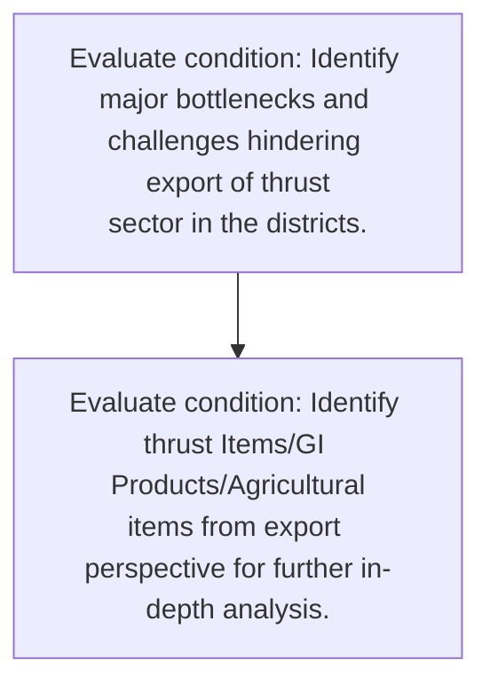
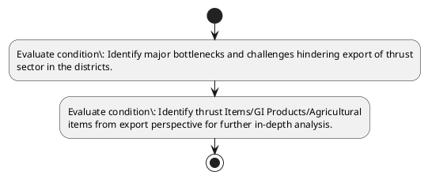

# Chapter 3 / Section 6: Identify major bottlenecks and challenges hindering export of thrust

**Chapter Title:** Developing Districts as Export Hubs

**Pages:** 4

**Purpose:** Identify thrust Items/GI Products/Agricultural
items from export perspective for further in-depth analysis.

**Purpose Thanglish:** Indha Identify major bottlenecks and challenges hindering export of thrust section-la, Identify thrust Items/GI Products/Agricultural
items from export perspective for further in-depth analysis.

**Summary:** 6. Identify major bottlenecks and challenges hindering export of thrust
sector in the districts. Identify thrust Items/GI Products/Agricultural
items from export perspective for further in-depth analysis.

**Business Meaning:** 6.

**Business Explanation:** 6. Identify major bottlenecks and challenges hindering export of thrust
sector in the districts. Identify thrust Items/GI Products/Agricultural
items from export perspective for further in-depth analysis.

**Business Explanation Thanglish:** Indha Identify major bottlenecks and challenges hindering export of thrust section-la, 6. Identify major bottlenecks and challenges hindering export of thrust
sector in the districts. Identify thrust Items/GI Products/Agricultural
items from export perspective for further in-depth analysis.

## Business Logic
- None identified

## Business Rules
- rule_id=CH3-SEC6-R001, rule_description=6. Identify major bottlenecks and challenges hindering export of thrust
sector in the districts. Identify thrust Items/GI Products/Agricultural
items from export perspective for further in-depth analysis., trigger=Identify major bottlenecks and challenges hindering export of thrust, condition=Identify major bottlenecks and challenges hindering export of thrust
sector in the districts., validation=Not explicitly covered in uploaded documents., action=Manual review required., exception=No explicit exception found in uploaded documents., output=DEKAI should produce a compliance decision for 6 - Identify major bottlenecks and challenges hindering export of thrust.

## Conditions
- Identify major bottlenecks and challenges hindering export of thrust
sector in the districts.
- Identify thrust Items/GI Products/Agricultural
items from export perspective for further in-depth analysis.

## Condition Logic
- id=3.6.1, if=Identify major bottlenecks and challenges hindering export of thrust
sector in the districts., then=Route for review, source=Identify major bottlenecks and challenges hindering export of thrust
sector in the districts.
- id=3.6.2, if=Identify thrust Items/GI Products/Agricultural
items from export perspective for further in-depth analysis., then=Route for review, source=Identify thrust Items/GI Products/Agricultural
items from export perspective for further in-depth analysis.

## Validations
- None identified

## Exceptions
- None identified

## Dependencies
- None identified

## Authorities
- None identified

## Required Documents
- None identified

## Timelines
- None identified

## Actions
- None identified

## Workflow
- Evaluate condition: Identify major bottlenecks and challenges hindering export of thrust
sector in the districts.
- Evaluate condition: Identify thrust Items/GI Products/Agricultural
items from export perspective for further in-depth analysis.

## Workflow ASCII
```text
Identify major bottlenecks and challenges hindering export of thrust
Evaluate condition: Identify major bottlenecks and challenges hindering export of thrust
sector in the districts.
   |
   v
Evaluate condition: Identify thrust Items/GI Products/Agricultural
items from export perspective for further in-depth analysis.
```

## Decision Tree
- IF section 6 applies THEN proceed with standard DGFT workflow

## Decision Tree ASCII
```text
Identify major bottlenecks and challenges hindering export of thrust Decision
IF section 6 applies THEN proceed with standard DGFT workflow
```

## Examples
- User asks to process Identify major bottlenecks and challenges hindering export of thrust; the platform checks conditions, validations, and documents before action.

**Real-world Example:** Example: an importer or exporter invokes Identify major bottlenecks and challenges hindering export of thrust, submits the prescribed DGFT records, and DEKAI uses the extracted rules to follow the identify major bottlenecks and challenges hindering export of thrust process.

**Real-world Example Thanglish:** Indha Identify major bottlenecks and challenges hindering export of thrust section-la, Example: an importer or exporter invokes Identify major bottlenecks and challenges hindering export of thrust, submits the prescribed DGFT records, and DEKAI uses the extracted rules to follow the identify major bottlenecks and challenges hindering export of thrust process.

## AI Rules
- None identified

## Database Fields
- name=section_code, type=string, required=True, source=parsed_section_heading
- name=section_title, type=string, required=True, source=parsed_section_heading
- name=and_flag, type=boolean, required=False, source=keyword:and
- name=the_flag, type=boolean, required=False, source=keyword:the
- name=for_flag, type=boolean, required=False, source=keyword:for
- name=from_flag, type=boolean, required=False, source=keyword:from
- name=major_flag, type=boolean, required=False, source=keyword:major
- name=items_flag, type=boolean, required=False, source=keyword:items
- name=export_flag, type=boolean, required=False, source=keyword:export
- name=thrust_flag, type=boolean, required=False, source=keyword:thrust

## API Requirements
- method=GET, path=/api/dgft/sections/6, purpose=Retrieve knowledge payload for section 6, query_params=['include=workflow,decision_tree,validations'], response_fields=['section', 'title', 'summary', 'conditions', 'validations', 'exceptions', 'workflow', 'decision_tree']
- method=POST, path=/api/dgft/Identify-major-bottlenecks-and-challenges-hindering-export-of-thrust/validate, purpose=Validate inputs and documents for Identify major bottlenecks and challenges hindering export of thrust, request_fields=['section_code', 'section_title'], response_fields=['status', 'errors', 'warnings', 'next_actions']

## UI Screens
- screen_id=Identify_major_bottlenecks_and_challenges_hindering_export_of_thrust_overview, name=Identify major bottlenecks and challenges hindering export of thrust Overview, purpose=Show section summary, authority, timeline, and eligibility cues., widgets=['summary_card', 'conditions_table', 'authority_badges', 'timeline_panel']
- screen_id=Identify_major_bottlenecks_and_challenges_hindering_export_of_thrust_submission, name=Identify major bottlenecks and challenges hindering export of thrust Submission, purpose=Capture applicant data and supporting documents., widgets=['dynamic_form', 'document_uploader', 'validation_panel', 'next_action_footer'], fields=['section_code', 'section_title', 'and_flag', 'the_flag', 'for_flag', 'from_flag', 'major_flag', 'items_flag']

## Error Messages
- Validation failed because the section requirements were not fully met.

## FAQ
- question_en=What is the purpose of section 6?, answer_en=6. Identify major bottlenecks and challenges hindering export of thrust
sector in the districts. Identify thrust Items/GI Products/Agricultural
items from export perspective for further in-depth analysis., question_thanglish=Indha Identify major bottlenecks and challenges hindering export of thrust section-la, What is the purpose of section 6?, answer_thanglish=Indha Identify major bottlenecks and challenges hindering export of thrust section-la, 6. Identify major bottlenecks and challenges hindering export of thrust
sector in the districts. Identify thrust Items/GI Products/Agricultural
items from export perspective for further in-depth analysis.
- question_en=What documents are required under Identify major bottlenecks and challenges hindering export of thrust?, answer_en=Not explicitly covered in uploaded documents., question_thanglish=Indha Identify major bottlenecks and challenges hindering export of thrust section-la, What documents are required under Identify major bottlenecks and challenges hindering export of thrust?, answer_thanglish=Indha Identify major bottlenecks and challenges hindering export of thrust section-la, Not explicitly covered in uploaded documents.
- question_en=Which authority handles Identify major bottlenecks and challenges hindering export of thrust?, answer_en=Not explicitly covered in uploaded documents., question_thanglish=Indha Identify major bottlenecks and challenges hindering export of thrust section-la, Which authority handles Identify major bottlenecks and challenges hindering export of thrust?, answer_thanglish=Indha Identify major bottlenecks and challenges hindering export of thrust section-la, Not explicitly covered in uploaded documents.

## Questions Users May Ask
- What does Identify major bottlenecks and challenges hindering export of thrust require?
- Which documents are needed for Identify major bottlenecks and challenges hindering export of thrust?
- How does DEKAI validate Identify major bottlenecks and challenges hindering export of thrust requests?

## Expected AI Answers
- Identify major bottlenecks and challenges hindering export of thrust requires the platform to interpret the section text, apply the extracted business rules, and present the correct next action.
- Required documents are inferred from the section text: no explicit documents were detected.
- DEKAI validates Identify major bottlenecks and challenges hindering export of thrust by checking conditions, required documents, authority references, and exception clauses before recommending an outcome.

## AI Q&A Examples
- question_en=User asks: How do I comply with Identify major bottlenecks and challenges hindering export of thrust?, answer_en=AI answers: DEKAI should evaluate section 6, apply the extracted rules, and guide the user through Evaluate condition: Identify major bottlenecks and challenges hindering export of thrust
sector in the districts.., question_thanglish=Indha Identify major bottlenecks and challenges hindering export of thrust section-la, User asks: How do I comply with Identify major bottlenecks and challenges hindering export of thrust?, answer_thanglish=Indha Identify major bottlenecks and challenges hindering export of thrust section-la, AI answers: DEKAI should evaluate section 6, apply the extracted rules, and guide the user through Evaluate condition: Identify major bottlenecks and challenges hindering export of thrust
sector in the districts..
- question_en=User asks: Which validations apply to Identify major bottlenecks and challenges hindering export of thrust?, answer_en=AI answers: Applicable validations are not explicitly covered in the uploaded documents., question_thanglish=Indha Identify major bottlenecks and challenges hindering export of thrust section-la, User asks: Which validations apply to Identify major bottlenecks and challenges hindering export of thrust?, answer_thanglish=Indha Identify major bottlenecks and challenges hindering export of thrust section-la, AI answers: Applicable validations are not explicitly covered in the uploaded documents.

## DEKAI AI Implementation Notes
- Capture chapter 3, section 6, title, and page references as immutable knowledge metadata.
- Bind validations for Identify major bottlenecks and challenges hindering export of thrust into a rule engine keyed by the rule IDs extracted for this section.

## DEKAI AI Implementation Notes Thanglish
- Indha Identify major bottlenecks and challenges hindering export of thrust section-la, Capture chapter 3, section 6, title, and page references as immutable knowledge metadata.
- Indha Identify major bottlenecks and challenges hindering export of thrust section-la, Bind validations for Identify major bottlenecks and challenges hindering export of thrust into a rule engine keyed by the rule IDs extracted for this section.

## AI Metadata
- Keywords: and, the, for, from, major, items, export, thrust, sector, further, Identify, Items/GI, in-depth, analysis, hindering, districts, challenges, bottlenecks, perspective, Products/Agricultural
- Search Keywords: and, the, for, from, major, items, export, thrust, sector, further, Identify, Items/GI, in-depth, analysis, hindering, districts, challenges, bottlenecks, perspective, Products/Agricultural
- Intent: Provide knowledge guidance for Identify major bottlenecks and challenges hindering export of thrust.
- Tags: 6, Identify major bottlenecks and challenges hindering export of thrust, dgft
- Related Sections: 
- Related Chapters: 
- Related Rules: 

## Mermaid


## PlantUML

