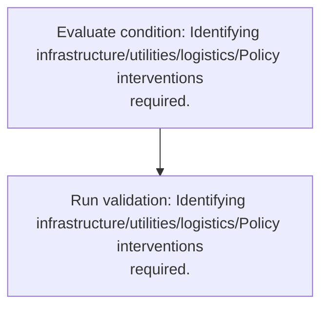
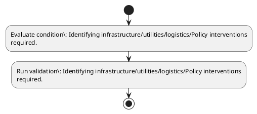

# Chapter 3 / Section 6: Identifying infrastructure/utilities/logistics/Policy interventions

**Chapter Title:** Developing Districts as Export Hubs

**Pages:** 5

**Purpose:** Defines the operational requirements for Identifying infrastructure/utilities/logistics/Policy interventions.

**Purpose Thanglish:** Indha Identifying infrastructure/utilities/logistics/Policy interventions section-la, Defines the operational requirements for Identifying infrastructure/utilities/logistics/Policy interventions.

**Summary:** 6. Identifying infrastructure/utilities/logistics/Policy interventions
required.

**Business Meaning:** 6.

**Business Explanation:** 6. Identifying infrastructure/utilities/logistics/Policy interventions
required.

**Business Explanation Thanglish:** Indha Identifying infrastructure/utilities/logistics/Policy interventions section-la, 6. Identifying infrastructure/utilities/logistics/Policy interventions
required.

## Business Logic
- None identified

## Business Rules
- rule_id=CH3-SEC6-R001, rule_description=6. Identifying infrastructure/utilities/logistics/Policy interventions
required., trigger=Identifying infrastructure/utilities/logistics/Policy interventions, condition=Identifying infrastructure/utilities/logistics/Policy interventions
required., validation=Identifying infrastructure/utilities/logistics/Policy interventions
required., action=Manual review required., exception=No explicit exception found in uploaded documents., output=DEKAI should produce a compliance decision for 6 - Identifying infrastructure/utilities/logistics/Policy interventions.

## Conditions
- Identifying infrastructure/utilities/logistics/Policy interventions
required.

## Condition Logic
- id=3.6.1, if=Identifying infrastructure/utilities/logistics/Policy interventions
required., then=Route for review, source=Identifying infrastructure/utilities/logistics/Policy interventions
required.

## Validations
- Identifying infrastructure/utilities/logistics/Policy interventions
required.

## Exceptions
- None identified

## Dependencies
- None identified

## Authorities
- None identified

## Required Documents
- None identified

## Timelines
- None identified

## Actions
- None identified

## Workflow
- Evaluate condition: Identifying infrastructure/utilities/logistics/Policy interventions
required.
- Run validation: Identifying infrastructure/utilities/logistics/Policy interventions
required.

## Workflow ASCII
```text
Identifying infrastructure/utilities/logistics/Policy interventions
Evaluate condition: Identifying infrastructure/utilities/logistics/Policy interventions
required.
   |
   v
Run validation: Identifying infrastructure/utilities/logistics/Policy interventions
required.
```

## Decision Tree
- IF section 6 applies THEN proceed with standard DGFT workflow

## Decision Tree ASCII
```text
Identifying infrastructure/utilities/logistics/Policy interventions Decision
IF section 6 applies THEN proceed with standard DGFT workflow
```

## Examples
- User asks to process Identifying infrastructure/utilities/logistics/Policy interventions; the platform checks conditions, validations, and documents before action.

**Real-world Example:** Example: an importer or exporter invokes Identifying infrastructure/utilities/logistics/Policy interventions, submits the prescribed DGFT records, and DEKAI uses the extracted rules to follow the identifying infrastructure/utilities/logistics/policy interventions process.

**Real-world Example Thanglish:** Indha Identifying infrastructure/utilities/logistics/Policy interventions section-la, Example: an importer or exporter invokes Identifying infrastructure/utilities/logistics/Policy interventions, submits the prescribed DGFT records, and DEKAI uses the extracted rules to follow the identifying infrastructure/utilities/logistics/policy interventions process.

## AI Rules
- None identified

## Database Fields
- name=section_code, type=string, required=True, source=parsed_section_heading
- name=section_title, type=string, required=True, source=parsed_section_heading
- name=required_flag, type=boolean, required=False, source=keyword:required
- name=identifying_flag, type=boolean, required=False, source=keyword:Identifying
- name=interventions_flag, type=boolean, required=False, source=keyword:interventions
- name=infrastructure_utilities_logistics_policy_flag, type=boolean, required=False, source=keyword:infrastructure/utilities/logistics/Policy

## API Requirements
- method=GET, path=/api/dgft/sections/6, purpose=Retrieve knowledge payload for section 6, query_params=['include=workflow,decision_tree,validations'], response_fields=['section', 'title', 'summary', 'conditions', 'validations', 'exceptions', 'workflow', 'decision_tree']
- method=POST, path=/api/dgft/Identifying-infrastructure-utilities-logistics-Policy-interventions/validate, purpose=Validate inputs and documents for Identifying infrastructure/utilities/logistics/Policy interventions, request_fields=['section_code', 'section_title'], response_fields=['status', 'errors', 'warnings', 'next_actions']

## UI Screens
- screen_id=Identifying_infrastructure_utilities_logistics_Policy_interventions_overview, name=Identifying infrastructure/utilities/logistics/Policy interventions Overview, purpose=Show section summary, authority, timeline, and eligibility cues., widgets=['summary_card', 'conditions_table', 'authority_badges', 'timeline_panel']
- screen_id=Identifying_infrastructure_utilities_logistics_Policy_interventions_submission, name=Identifying infrastructure/utilities/logistics/Policy interventions Submission, purpose=Capture applicant data and supporting documents., widgets=['dynamic_form', 'document_uploader', 'validation_panel', 'next_action_footer'], fields=['section_code', 'section_title', 'required_flag', 'identifying_flag', 'interventions_flag', 'infrastructure_utilities_logistics_policy_flag']

## Error Messages
- Validation failed because the section requirements were not fully met.

## FAQ
- question_en=What is the purpose of section 6?, answer_en=6. Identifying infrastructure/utilities/logistics/Policy interventions
required., question_thanglish=Indha Identifying infrastructure/utilities/logistics/Policy interventions section-la, What is the purpose of section 6?, answer_thanglish=Indha Identifying infrastructure/utilities/logistics/Policy interventions section-la, 6. Identifying infrastructure/utilities/logistics/Policy interventions
required.
- question_en=What documents are required under Identifying infrastructure/utilities/logistics/Policy interventions?, answer_en=Not explicitly covered in uploaded documents., question_thanglish=Indha Identifying infrastructure/utilities/logistics/Policy interventions section-la, What documents are required under Identifying infrastructure/utilities/logistics/Policy interventions?, answer_thanglish=Indha Identifying infrastructure/utilities/logistics/Policy interventions section-la, Not explicitly covered in uploaded documents.
- question_en=Which authority handles Identifying infrastructure/utilities/logistics/Policy interventions?, answer_en=Not explicitly covered in uploaded documents., question_thanglish=Indha Identifying infrastructure/utilities/logistics/Policy interventions section-la, Which authority handles Identifying infrastructure/utilities/logistics/Policy interventions?, answer_thanglish=Indha Identifying infrastructure/utilities/logistics/Policy interventions section-la, Not explicitly covered in uploaded documents.

## Questions Users May Ask
- What does Identifying infrastructure/utilities/logistics/Policy interventions require?
- Which documents are needed for Identifying infrastructure/utilities/logistics/Policy interventions?
- How does DEKAI validate Identifying infrastructure/utilities/logistics/Policy interventions requests?

## Expected AI Answers
- Identifying infrastructure/utilities/logistics/Policy interventions requires the platform to interpret the section text, apply the extracted business rules, and present the correct next action.
- Required documents are inferred from the section text: no explicit documents were detected.
- DEKAI validates Identifying infrastructure/utilities/logistics/Policy interventions by checking conditions, required documents, authority references, and exception clauses before recommending an outcome.

## AI Q&A Examples
- question_en=User asks: How do I comply with Identifying infrastructure/utilities/logistics/Policy interventions?, answer_en=AI answers: DEKAI should evaluate section 6, apply the extracted rules, and guide the user through Evaluate condition: Identifying infrastructure/utilities/logistics/Policy interventions
required.., question_thanglish=Indha Identifying infrastructure/utilities/logistics/Policy interventions section-la, User asks: How do I comply with Identifying infrastructure/utilities/logistics/Policy interventions?, answer_thanglish=Indha Identifying infrastructure/utilities/logistics/Policy interventions section-la, AI answers: DEKAI should evaluate section 6, apply the extracted rules, and guide the user through Evaluate condition: Identifying infrastructure/utilities/logistics/Policy interventions
required..
- question_en=User asks: Which validations apply to Identifying infrastructure/utilities/logistics/Policy interventions?, answer_en=AI answers: Applicable validations are Identifying infrastructure/utilities/logistics/Policy interventions
required., question_thanglish=Indha Identifying infrastructure/utilities/logistics/Policy interventions section-la, User asks: Which validations apply to Identifying infrastructure/utilities/logistics/Policy interventions?, answer_thanglish=Indha Identifying infrastructure/utilities/logistics/Policy interventions section-la, AI answers: Applicable validations are Identifying infrastructure/utilities/logistics/Policy interventions
required.

## DEKAI AI Implementation Notes
- Capture chapter 3, section 6, title, and page references as immutable knowledge metadata.
- Bind validations for Identifying infrastructure/utilities/logistics/Policy interventions into a rule engine keyed by the rule IDs extracted for this section.

## DEKAI AI Implementation Notes Thanglish
- Indha Identifying infrastructure/utilities/logistics/Policy interventions section-la, Capture chapter 3, section 6, title, and page references as immutable knowledge metadata.
- Indha Identifying infrastructure/utilities/logistics/Policy interventions section-la, Bind validations for Identifying infrastructure/utilities/logistics/Policy interventions into a rule engine keyed by the rule IDs extracted for this section.

## AI Metadata
- Keywords: required, Identifying, interventions, infrastructure/utilities/logistics/Policy
- Search Keywords: required, Identifying, interventions, infrastructure/utilities/logistics/Policy
- Intent: Provide knowledge guidance for Identifying infrastructure/utilities/logistics/Policy interventions.
- Tags: 6, Identifying infrastructure/utilities/logistics/Policy interventions, dgft
- Related Sections: 
- Related Chapters: 
- Related Rules: 

## Mermaid


## PlantUML

