# Chapter  / Section 6: MESSAGE FUNCTION

**Chapter Title:** TradeNetDeclaration.IPTDEC Ver2.1 (2)

**Pages:** 6, 7, 8

**Purpose:** MESSAGE FUNCTION
The Trade Net Declaration message permits the transfer of data from the Declarant to SC and CA (if applicable) for the
purpose of meeting legislative and/or operational requirements in respect of the declaration of goods for import, export
or transit.

**Purpose Thanglish:** Indha MESSAGE FUNCTION section-la, MESSAGE FUNCTION
The Trade Net Declaration message permits the transfer of data from the Declarant to SC and CA (if applicable) for the
purpose of meeting legislative and/or operational requirements in respect of the declaration of goods for import, export
or transit.

**Summary:** 6. MESSAGE FUNCTION
The Trade Net Declaration message permits the transfer of data from the Declarant to SC and CA (if applicable) for the
purpose of meeting legislative and/or operational requirements in respect of the declaration of goods for import, export
or transit. Transfer conditions are:
Code Declaration Type Transfer Conditions
DUT Duty To allow the Declarant to submit Declarations such as anti-dumping
duties, excise for local manufacturing, previously exempted vehicles
and short payment
GST GST (including duty exemption) To allow the Declarant to submit Declarations such as:
a) non-dutiable HS for
i) direct import
ii) release from FTZ to customs territories
iii) release from BW to customs territories and,
iv) release of Class II cargoes from BWCY
b) dutiable HS
i) Motor vehicles
ii) Ethyl alcohol for lab use
iii) Industrial exemption
iv) Beer for SAF
c) Short Payment
d) Auction cargoes release from FTZ or local cargoes which entered
ALPS & subsequently enter customs territory
DNG Duty & GST To allow the Declarant to submit Declarations such as:
a) Direct import
b) Local manufacturing
c) Sale of:
i) embassy vehicles to others
ii) vehicles by foreign armed forces
iii) vehicles by disabled persons
Trade Net Declaration.IPTDEC Ver2.1.doc Message Specification XML (IPTDEC)
OFFICIAL (CLOSED)
Prepared by:
TDS41-MDS-XML-IPTDEC-M
Code | Declaration Type | Transfer Conditions
DUT | Duty | To allow the Declarant to submit Declarations such as anti-dumping
duties, excise for local manufacturing, previously exempted vehicles
and short payment
GST | GST (including duty exemption) | To allow the Declarant to submit Declarations such as:
a) non-dutiable HS for
i) direct import
ii) release from FTZ to customs territories
iii) release from BW to customs territories and,
iv) release of Class II cargoes from BWCY
b) dutiable HS
i) Motor vehicles
ii) Ethyl alcohol for lab use
iii) Industrial exemption
iv) Beer for SAF
c) Short Payment
d) Auction cargoes release from FTZ or local cargoes which entered
ALPS & subsequently enter customs territory
DNG | Duty & GST | To allow the Declarant to submit Declarations such as:
a) Direct import
b) Local manufacturing
c) Sale of:
i) embassy vehicles to others
ii) vehicles by foreign armed forces
iii) vehicles by disabled persons
OFFICIAL (CLOSED)
TRADENET MESSAGE
18/11/2021 11:10
AM
Prepared by:
For:
Release Date
18/11/2021
Ver
4.1
Reference
TRADENET
Document Id.

**Business Meaning:** 6.

**Business Explanation:** 6. MESSAGE FUNCTION
The Trade Net Declaration message permits the transfer of data from the Declarant to SC and CA (if applicable) for the
purpose of meeting legislative and/or operational requirements in respect of the declaration of goods for import, export
or transit. Transfer conditions are:
Code Declaration Type Transfer Conditions
DUT Duty To allow the Declarant to submit Declarations such as anti-dumping
duties, excise for local manufacturing, previously exempted vehicles
and short payment
GST GST (including duty exemption) To allow the Declarant to submit Declarations such as:
a) non-dutiable HS for
i) direct import
ii) release from FTZ to customs territories
iii) release from BW to customs territories and,
iv) release of Class II cargoes from BWCY
b) dutiable HS
i) Motor vehicles
ii) Ethyl alcohol for lab use
iii) Industrial exemption
iv) Beer for SAF
c) Short Payment
d) Auction cargoes release from FTZ or local cargoes which entered
ALPS & subsequently enter customs territory
DNG Duty & GST To allow the Declarant to submit Declarations such as:
a) Direct import
b) Local manufacturing
c) Sale of:
i) embassy vehicles to others
ii) vehicles by foreign armed forces
iii) vehicles by disabled persons
Trade Net Declaration.IPTDEC Ver2.1.doc Message Specification XML (IPTDEC)
OFFICIAL (CLOSED)
Prepared by:
TDS41-MDS-XML-IPTDEC-M
Code | Declaration Type | Transfer Conditions
DUT | Duty | To allow the Declarant to submit Declarations such as anti-dumping
duties, excise for local manufacturing, previously exempted vehicles
and short payment
GST | GST (including duty exemption) | To allow the Declarant to submit Declarations such as:
a) non-dutiable HS for
i) direct import
ii) release from FTZ to customs territories
iii) release from BW to customs territories and,
iv) release of Class II cargoes from BWCY
b) dutiable HS
i) Motor vehicles
ii) Ethyl alcohol for lab use
iii) Industrial exemption
iv) Beer for SAF
c) Short Payment
d) Auction cargoes release from FTZ or local cargoes which entered
ALPS & subsequently enter customs territory
DNG | Duty & GST | To allow the Declarant to submit Declarations such as:
a) Direct import
b) Local manufacturing
c) Sale of:
i) embassy vehicles to others
ii) vehicles by foreign armed forces
iii) vehicles by disabled persons
OFFICIAL (CLOSED)
TRADENET MESSAGE
18/11/2021 11:10
AM
Prepared by:
For:
Release Date
18/11/2021
Ver
4.1
Reference
TRADENET
Document Id.

**Business Explanation Thanglish:** Indha MESSAGE FUNCTION section-la, 6. MESSAGE FUNCTION
The Trade Net Declaration message permits the transfer of data from the Declarant to SC and CA (if applicable) for the
purpose of meeting legislative and/or operational requirements in respect of the declaration of goods for import, export
or transit. Transfer conditions are:
Code Declaration Type Transfer Conditions
DUT Duty To allow the Declarant to submit Declarations such as anti-dumping
duties, excise for local manufacturing, previously exempted vehicles
and short payment
GST GST (including duty exemption) To allow the Declarant to submit Declarations such as:
a) non-dutiable HS for
i) direct import
ii) release from FTZ to customs territories
iii) release from BW to customs territories and,
iv) release of Class II cargoes from BWCY
b) dutiable HS
i) Motor vehicles
ii) Ethyl alcohol for lab use
iii) Industrial exemption
iv) Beer for SAF
c) Short Payment
d) Auction cargoes release from FTZ or local cargoes which entered
ALPS & subsequently enter customs territory
DNG Duty & GST To allow the Declarant to submit Declarations such as:
a) Direct import
b) Local manufacturing
c) Sale of:
i) embassy vehicles to others
ii) vehicles by foreign armed forces
iii) vehicles by disabled persons
Trade Net Declaration.IPTDEC Ver2.1.doc Message Specification XML (IPTDEC)
OFFICIAL (CLOSED)
Prepared by:
TDS41-MDS-XML-IPTDEC-M
Code | Declaration Type | Transfer Conditions
DUT | Duty | To allow the Declarant to submit Declarations such as anti-dumping
duties, excise for local manufacturing, previously exempted vehicles
and short payment
GST | GST (including duty exemption) | To allow the Declarant to submit Declarations such as:
a) non-dutiable HS for
i) direct import
ii) release from FTZ to customs territories
iii) release from BW to customs territories and,
iv) release of Class II cargoes from BWCY
b) dutiable HS
i) Motor vehicles
ii) Ethyl alcohol for lab use
iii) Industrial exemption
iv) Beer for SAF
c) Short Payment
d) Auction cargoes release from FTZ or local cargoes which entered
ALPS & subsequently enter customs territory
DNG | Duty & GST | To allow the Declarant to submit Declarations such as:
a) Direct import
b) Local manufacturing
c) Sale of:
i) embassy vehicles to others
ii) vehicles by foreign armed forces
iii) vehicles by disabled persons
OFFICIAL (CLOSED)
TRADENET MESSAGE
18/11/2021 11:10
AM
Prepared by:
For:
Release Date
18/11/2021
Ver
4.1
Reference
TRADENET
Document Id.

## Business Logic
- None identified

## Business Rules
- rule_id=CH-SEC6-R001, rule_description=IF validations pass THEN recommend action: Transfer conditions are:
Code Declaration Type Transfer Conditions
DUT Duty To allow the Declarant to submit Declarations such as anti-dumping
duties, excise for local manufacturing, previously exempted vehicles
and short payment
GST GST (including duty exemption) To allow the Declarant to submit Declarations such as:
a) non-dutiable HS for
i) direct import
ii) release from FTZ to customs territories
iii) release from BW to customs territories and,
iv) release of Class II cargoes from BWCY
b) dutiable HS
i) Motor vehicles
ii) Ethyl alcohol for lab use
iii) Industrial exemption
iv) Beer for SAF
c) Short Payment
d) Auction cargoes release from FTZ or local cargoes which entered
ALPS & subsequently enter customs territory
DNG Duty & GST To allow the Declarant to submit Declarations such as:
a) Direct import
b) Local manufacturing
c) Sale of:
i) embassy vehicles to others
ii) vehicles by foreign armed forces
iii) vehicles by disabled persons
Trade Net Declaration.IPTDEC Ver2.1.doc Message Specification XML (IPTDEC)
OFFICIAL (CLOSED)
Prepared by:
TDS41-MDS-XML-IPTDEC-M
Code | Declaration Type | Transfer Conditions
DUT | Duty | To allow the Declarant to submit Declarations such as anti-dumping
duties, excise for local manufacturing, previously exempted vehicles
and short payment
GST | GST (including duty exemption) | To allow the Declarant to submit Declarations such as:
a) non-dutiable HS for
i) direct import
ii) release from FTZ to customs territories
iii) release from BW to customs territories and,
iv) release of Class II cargoes from BWCY
b) dutiable HS
i) Motor vehicles
ii) Ethyl alcohol for lab use
iii) Industrial exemption
iv) Beer for SAF
c) Short Payment
d) Auction cargoes release from FTZ or local cargoes which entered
ALPS & subsequently enter customs territory
DNG | Duty & GST | To allow the Declarant to submit Declarations such as:
a) Direct import
b) Local manufacturing
c) Sale of:
i) embassy vehicles to others
ii) vehicles by foreign armed forces
iii) vehicles by disabled persons
OFFICIAL (CLOSED)
TRADENET MESSAGE
18/11/2021 11:10
AM
Prepared by:
For:
Release Date
18/11/2021
Ver
4.1
Reference
TRADENET
Document Id., trigger=MESSAGE FUNCTION, condition=MESSAGE FUNCTION
The Trade Net Declaration message permits the transfer of data from the Declarant to SC and CA (if applicable) for the
purpose of meeting legislative and/or operational requirements in respect of the declaration of goods for import, export
or transit., validation=Not explicitly covered in uploaded documents., action=Transfer conditions are:
Code Declaration Type Transfer Conditions
DUT Duty To allow the Declarant to submit Declarations such as anti-dumping
duties, excise for local manufacturing, previously exempted vehicles
and short payment
GST GST (including duty exemption) To allow the Declarant to submit Declarations such as:
a) non-dutiable HS for
i) direct import
ii) release from FTZ to customs territories
iii) release from BW to customs territories and,
iv) release of Class II cargoes from BWCY
b) dutiable HS
i) Motor vehicles
ii) Ethyl alcohol for lab use
iii) Industrial exemption
iv) Beer for SAF
c) Short Payment
d) Auction cargoes release from FTZ or local cargoes which entered
ALPS & subsequently enter customs territory
DNG Duty & GST To allow the Declarant to submit Declarations such as:
a) Direct import
b) Local manufacturing
c) Sale of:
i) embassy vehicles to others
ii) vehicles by foreign armed forces
iii) vehicles by disabled persons
Trade Net Declaration.IPTDEC Ver2.1.doc Message Specification XML (IPTDEC)
OFFICIAL (CLOSED)
Prepared by:
TDS41-MDS-XML-IPTDEC-M
Code | Declaration Type | Transfer Conditions
DUT | Duty | To allow the Declarant to submit Declarations such as anti-dumping
duties, excise for local manufacturing, previously exempted vehicles
and short payment
GST | GST (including duty exemption) | To allow the Declarant to submit Declarations such as:
a) non-dutiable HS for
i) direct import
ii) release from FTZ to customs territories
iii) release from BW to customs territories and,
iv) release of Class II cargoes from BWCY
b) dutiable HS
i) Motor vehicles
ii) Ethyl alcohol for lab use
iii) Industrial exemption
iv) Beer for SAF
c) Short Payment
d) Auction cargoes release from FTZ or local cargoes which entered
ALPS & subsequently enter customs territory
DNG | Duty & GST | To allow the Declarant to submit Declarations such as:
a) Direct import
b) Local manufacturing
c) Sale of:
i) embassy vehicles to others
ii) vehicles by foreign armed forces
iii) vehicles by disabled persons
OFFICIAL (CLOSED)
TRADENET MESSAGE
18/11/2021 11:10
AM
Prepared by:
For:
Release Date
18/11/2021
Ver
4.1
Reference
TRADENET
Document Id., exception=Transfer conditions are:
Code Declaration Type Transfer Conditions
DUT Duty To allow the Declarant to submit Declarations such as anti-dumping
duties, excise for local manufacturing, previously exempted vehicles
and short payment
GST GST (including duty exemption) To allow the Declarant to submit Declarations such as:
a) non-dutiable HS for
i) direct import
ii) release from FTZ to customs territories
iii) release from BW to customs territories and,
iv) release of Class II cargoes from BWCY
b) dutiable HS
i) Motor vehicles
ii) Ethyl alcohol for lab use
iii) Industrial exemption
iv) Beer for SAF
c) Short Payment
d) Auction cargoes release from FTZ or local cargoes which entered
ALPS & subsequently enter customs territory
DNG Duty & GST To allow the Declarant to submit Declarations such as:
a) Direct import
b) Local manufacturing
c) Sale of:
i) embassy vehicles to others
ii) vehicles by foreign armed forces
iii) vehicles by disabled persons
Trade Net Declaration.IPTDEC Ver2.1.doc Message Specification XML (IPTDEC)
OFFICIAL (CLOSED)
Prepared by:
TDS41-MDS-XML-IPTDEC-M
Code | Declaration Type | Transfer Conditions
DUT | Duty | To allow the Declarant to submit Declarations such as anti-dumping
duties, excise for local manufacturing, previously exempted vehicles
and short payment
GST | GST (including duty exemption) | To allow the Declarant to submit Declarations such as:
a) non-dutiable HS for
i) direct import
ii) release from FTZ to customs territories
iii) release from BW to customs territories and,
iv) release of Class II cargoes from BWCY
b) dutiable HS
i) Motor vehicles
ii) Ethyl alcohol for lab use
iii) Industrial exemption
iv) Beer for SAF
c) Short Payment
d) Auction cargoes release from FTZ or local cargoes which entered
ALPS & subsequently enter customs territory
DNG | Duty & GST | To allow the Declarant to submit Declarations such as:
a) Direct import
b) Local manufacturing
c) Sale of:
i) embassy vehicles to others
ii) vehicles by foreign armed forces
iii) vehicles by disabled persons
OFFICIAL (CLOSED)
TRADENET MESSAGE
18/11/2021 11:10
AM
Prepared by:
For:
Release Date
18/11/2021
Ver
4.1
Reference
TRADENET
Document Id., output=DEKAI should produce a compliance decision for 6 - MESSAGE FUNCTION.

## Conditions
- MESSAGE FUNCTION
The Trade Net Declaration message permits the transfer of data from the Declarant to SC and CA (if applicable) for the
purpose of meeting legislative and/or operational requirements in respect of the declaration of goods for import, export
or transit.
- Transfer conditions are:
Code Declaration Type Transfer Conditions
DUT Duty To allow the Declarant to submit Declarations such as anti-dumping
duties, excise for local manufacturing, previously exempted vehicles
and short payment
GST GST (including duty exemption) To allow the Declarant to submit Declarations such as:
a) non-dutiable HS for
i) direct import
ii) release from FTZ to customs territories
iii) release from BW to customs territories and,
iv) release of Class II cargoes from BWCY
b) dutiable HS
i) Motor vehicles
ii) Ethyl alcohol for lab use
iii) Industrial exemption
iv) Beer for SAF
c) Short Payment
d) Auction cargoes release from FTZ or local cargoes which entered
ALPS & subsequently enter customs territory
DNG Duty & GST To allow the Declarant to submit Declarations such as:
a) Direct import
b) Local manufacturing
c) Sale of:
i) embassy vehicles to others
ii) vehicles by foreign armed forces
iii) vehicles by disabled persons
Trade Net Declaration.IPTDEC Ver2.1.doc Message Specification XML (IPTDEC)
OFFICIAL (CLOSED)
Prepared by:
TDS41-MDS-XML-IPTDEC-M
Code | Declaration Type | Transfer Conditions
DUT | Duty | To allow the Declarant to submit Declarations such as anti-dumping
duties, excise for local manufacturing, previously exempted vehicles
and short payment
GST | GST (including duty exemption) | To allow the Declarant to submit Declarations such as:
a) non-dutiable HS for
i) direct import
ii) release from FTZ to customs territories
iii) release from BW to customs territories and,
iv) release of Class II cargoes from BWCY
b) dutiable HS
i) Motor vehicles
ii) Ethyl alcohol for lab use
iii) Industrial exemption
iv) Beer for SAF
c) Short Payment
d) Auction cargoes release from FTZ or local cargoes which entered
ALPS & subsequently enter customs territory
DNG | Duty & GST | To allow the Declarant to submit Declarations such as:
a) Direct import
b) Local manufacturing
c) Sale of:
i) embassy vehicles to others
ii) vehicles by foreign armed forces
iii) vehicles by disabled persons
OFFICIAL (CLOSED)
TRADENET MESSAGE
18/11/2021 11:10
AM
Prepared by:
For:
Release Date
18/11/2021
Ver
4.1
Reference
TRADENET
Document Id.
- Transfer conditions are:
Code Declaration Type
Transfer Conditions
DUT
Duty
To allow the Declarant to submit Declarations such as anti-dumping
duties, excise for local manufacturing, previously exempted vehicles
and short payment
GST
GST (including duty exemption)
To allow the Declarant to submit Declarations such as:
a) non-dutiable HS for
i) direct import
ii) release from FTZ to customs territories
iii) release from BW to customs territories and,
iv) release of Class II cargoes from BWCY
b) dutiable HS
i) Motor vehicles
ii) Ethyl alcohol for lab use
iii) Industrial exemption
iv) Beer for SAF
c) Short Payment
d) Auction cargoes release from FTZ or local cargoes which entered
ALPS & subsequently enter customs territory
DNG
Duty & GST
To allow the Declarant to submit Declarations such as:
a) Direct import
b) Local manufacturing
c) Sale of:
i) embassy vehicles to others
ii) vehicles by foreign armed forces
iii) vehicles by disabled persons
OFFICIAL (CLOSED)
AM
d) Release of goods from FTZ
e) Release of goods from LW
f) Release of AD goods from FTZ
g) Release of Class II cargoes from BWCY
h) Short payment of GST and duty
BKT Blanket To allow the Declarant to submit Declarations such as:
a) gas
b) water
c) video tapes
d) petroleum
Trade Net Declaration.IPTDEC Ver2.1.doc Message Specification XML (IPTDEC)
OFFICIAL (CLOSED)
Prepared by:
TDS41-MDS-XML-IPTDEC-M
| | d) Release of goods from FTZ
e) Release of goods from LW
f) Release of AD goods from FTZ
g) Release of Class II cargoes from BWCY
h) Short payment of GST and duty
BKT | Blanket | To allow the Declarant to submit Declarations such as:
a) gas
b) water
c) video tapes
d) petroleum
OFFICIAL (CLOSED)
TRADENET MESSAGE
18/11/2021 11:10
AM
Prepared by:
For:
Release Date
18/11/2021
Ver
4.1
Reference
TRADENET
Document Id.
- TDS41-MDS-XML-IPTDEC-M
Trade Net Declaration.IPTDEC Ver2.1.doc
OFFICIAL (CLOSED)
d) Release of goods from FTZ
e) Release of goods from LW
f) Release of AD goods from FTZ
g) Release of Class II cargoes from BWCY
h) Short payment of GST and duty
BKT
Blanket
To allow the Declarant to submit Declarations such as:
a) gas
b) water
c) video tapes
d) petroleum
OFFICIAL (CLOSED)
AM
Sender: Traders, Freight Forwarders, Air Cargo Agents, Shipping Agents
Logical Destinations: SC and CAs (if applicable)(via Trade Net system)
Response message: Trade Net Response message
- for the Issuing Authorities to issue the respective Permit to the Declarant; refer to
reference 2 for more details
- for the Issuing Authorities to inform the Declarant on the rejection of
the declaration; refer to reference 3 for more details)
- for the Issuing Authorities and Trade Net system to inform the Declarant
on the errors found when processing the declaration message; refer to
reference 4 for more details)

## Condition Logic
- id=.6.1, if=MESSAGE FUNCTION
The Trade Net Declaration message permits the transfer of data from the Declarant to SC and CA (if applicable) for the
purpose of meeting legislative and/or operational requirements in respect of the declaration of goods for import, export
or transit., then=Transfer conditions are:
Code Declaration Type Transfer Conditions
DUT Duty To allow the Declarant to submit Declarations such as anti-dumping
duties, excise for local manufacturing, previously exempted vehicles
and short payment
GST GST (including duty exemption) To allow the Declarant to submit Declarations such as:
a) non-dutiable HS for
i) direct import
ii) release from FTZ to customs territories
iii) release from BW to customs territories and,
iv) release of Class II cargoes from BWCY
b) dutiable HS
i) Motor vehicles
ii) Ethyl alcohol for lab use
iii) Industrial exemption
iv) Beer for SAF
c) Short Payment
d) Auction cargoes release from FTZ or local cargoes which entered
ALPS & subsequently enter customs territory
DNG Duty & GST To allow the Declarant to submit Declarations such as:
a) Direct import
b) Local manufacturing
c) Sale of:
i) embassy vehicles to others
ii) vehicles by foreign armed forces
iii) vehicles by disabled persons
Trade Net Declaration.IPTDEC Ver2.1.doc Message Specification XML (IPTDEC)
OFFICIAL (CLOSED)
Prepared by:
TDS41-MDS-XML-IPTDEC-M
Code | Declaration Type | Transfer Conditions
DUT | Duty | To allow the Declarant to submit Declarations such as anti-dumping
duties, excise for local manufacturing, previously exempted vehicles
and short payment
GST | GST (including duty exemption) | To allow the Declarant to submit Declarations such as:
a) non-dutiable HS for
i) direct import
ii) release from FTZ to customs territories
iii) release from BW to customs territories and,
iv) release of Class II cargoes from BWCY
b) dutiable HS
i) Motor vehicles
ii) Ethyl alcohol for lab use
iii) Industrial exemption
iv) Beer for SAF
c) Short Payment
d) Auction cargoes release from FTZ or local cargoes which entered
ALPS & subsequently enter customs territory
DNG | Duty & GST | To allow the Declarant to submit Declarations such as:
a) Direct import
b) Local manufacturing
c) Sale of:
i) embassy vehicles to others
ii) vehicles by foreign armed forces
iii) vehicles by disabled persons
OFFICIAL (CLOSED)
TRADENET MESSAGE
18/11/2021 11:10
AM
Prepared by:
For:
Release Date
18/11/2021
Ver
4.1
Reference
TRADENET
Document Id., source=MESSAGE FUNCTION
The Trade Net Declaration message permits the transfer of data from the Declarant to SC and CA (if applicable) for the
purpose of meeting legislative and/or operational requirements in respect of the declaration of goods for import, export
or transit.
- id=.6.2, if=Transfer conditions are:
Code Declaration Type Transfer Conditions
DUT Duty To allow the Declarant to submit Declarations such as anti-dumping
duties, excise for local manufacturing, previously exempted vehicles
and short payment
GST GST (including duty exemption) To allow the Declarant to submit Declarations such as:
a) non-dutiable HS for
i) direct import
ii) release from FTZ to customs territories
iii) release from BW to customs territories and,
iv) release of Class II cargoes from BWCY
b) dutiable HS
i) Motor vehicles
ii) Ethyl alcohol for lab use
iii) Industrial exemption
iv) Beer for SAF
c) Short Payment
d) Auction cargoes release from FTZ or local cargoes which entered
ALPS & subsequently enter customs territory
DNG Duty & GST To allow the Declarant to submit Declarations such as:
a) Direct import
b) Local manufacturing
c) Sale of:
i) embassy vehicles to others
ii) vehicles by foreign armed forces
iii) vehicles by disabled persons
Trade Net Declaration.IPTDEC Ver2.1.doc Message Specification XML (IPTDEC)
OFFICIAL (CLOSED)
Prepared by:
TDS41-MDS-XML-IPTDEC-M
Code | Declaration Type | Transfer Conditions
DUT | Duty | To allow the Declarant to submit Declarations such as anti-dumping
duties, excise for local manufacturing, previously exempted vehicles
and short payment
GST | GST (including duty exemption) | To allow the Declarant to submit Declarations such as:
a) non-dutiable HS for
i) direct import
ii) release from FTZ to customs territories
iii) release from BW to customs territories and,
iv) release of Class II cargoes from BWCY
b) dutiable HS
i) Motor vehicles
ii) Ethyl alcohol for lab use
iii) Industrial exemption
iv) Beer for SAF
c) Short Payment
d) Auction cargoes release from FTZ or local cargoes which entered
ALPS & subsequently enter customs territory
DNG | Duty & GST | To allow the Declarant to submit Declarations such as:
a) Direct import
b) Local manufacturing
c) Sale of:
i) embassy vehicles to others
ii) vehicles by foreign armed forces
iii) vehicles by disabled persons
OFFICIAL (CLOSED)
TRADENET MESSAGE
18/11/2021 11:10
AM
Prepared by:
For:
Release Date
18/11/2021
Ver
4.1
Reference
TRADENET
Document Id., then=Transfer conditions are:
Code Declaration Type Transfer Conditions
DUT Duty To allow the Declarant to submit Declarations such as anti-dumping
duties, excise for local manufacturing, previously exempted vehicles
and short payment
GST GST (including duty exemption) To allow the Declarant to submit Declarations such as:
a) non-dutiable HS for
i) direct import
ii) release from FTZ to customs territories
iii) release from BW to customs territories and,
iv) release of Class II cargoes from BWCY
b) dutiable HS
i) Motor vehicles
ii) Ethyl alcohol for lab use
iii) Industrial exemption
iv) Beer for SAF
c) Short Payment
d) Auction cargoes release from FTZ or local cargoes which entered
ALPS & subsequently enter customs territory
DNG Duty & GST To allow the Declarant to submit Declarations such as:
a) Direct import
b) Local manufacturing
c) Sale of:
i) embassy vehicles to others
ii) vehicles by foreign armed forces
iii) vehicles by disabled persons
Trade Net Declaration.IPTDEC Ver2.1.doc Message Specification XML (IPTDEC)
OFFICIAL (CLOSED)
Prepared by:
TDS41-MDS-XML-IPTDEC-M
Code | Declaration Type | Transfer Conditions
DUT | Duty | To allow the Declarant to submit Declarations such as anti-dumping
duties, excise for local manufacturing, previously exempted vehicles
and short payment
GST | GST (including duty exemption) | To allow the Declarant to submit Declarations such as:
a) non-dutiable HS for
i) direct import
ii) release from FTZ to customs territories
iii) release from BW to customs territories and,
iv) release of Class II cargoes from BWCY
b) dutiable HS
i) Motor vehicles
ii) Ethyl alcohol for lab use
iii) Industrial exemption
iv) Beer for SAF
c) Short Payment
d) Auction cargoes release from FTZ or local cargoes which entered
ALPS & subsequently enter customs territory
DNG | Duty & GST | To allow the Declarant to submit Declarations such as:
a) Direct import
b) Local manufacturing
c) Sale of:
i) embassy vehicles to others
ii) vehicles by foreign armed forces
iii) vehicles by disabled persons
OFFICIAL (CLOSED)
TRADENET MESSAGE
18/11/2021 11:10
AM
Prepared by:
For:
Release Date
18/11/2021
Ver
4.1
Reference
TRADENET
Document Id., source=Transfer conditions are:
Code Declaration Type Transfer Conditions
DUT Duty To allow the Declarant to submit Declarations such as anti-dumping
duties, excise for local manufacturing, previously exempted vehicles
and short payment
GST GST (including duty exemption) To allow the Declarant to submit Declarations such as:
a) non-dutiable HS for
i) direct import
ii) release from FTZ to customs territories
iii) release from BW to customs territories and,
iv) release of Class II cargoes from BWCY
b) dutiable HS
i) Motor vehicles
ii) Ethyl alcohol for lab use
iii) Industrial exemption
iv) Beer for SAF
c) Short Payment
d) Auction cargoes release from FTZ or local cargoes which entered
ALPS & subsequently enter customs territory
DNG Duty & GST To allow the Declarant to submit Declarations such as:
a) Direct import
b) Local manufacturing
c) Sale of:
i) embassy vehicles to others
ii) vehicles by foreign armed forces
iii) vehicles by disabled persons
Trade Net Declaration.IPTDEC Ver2.1.doc Message Specification XML (IPTDEC)
OFFICIAL (CLOSED)
Prepared by:
TDS41-MDS-XML-IPTDEC-M
Code | Declaration Type | Transfer Conditions
DUT | Duty | To allow the Declarant to submit Declarations such as anti-dumping
duties, excise for local manufacturing, previously exempted vehicles
and short payment
GST | GST (including duty exemption) | To allow the Declarant to submit Declarations such as:
a) non-dutiable HS for
i) direct import
ii) release from FTZ to customs territories
iii) release from BW to customs territories and,
iv) release of Class II cargoes from BWCY
b) dutiable HS
i) Motor vehicles
ii) Ethyl alcohol for lab use
iii) Industrial exemption
iv) Beer for SAF
c) Short Payment
d) Auction cargoes release from FTZ or local cargoes which entered
ALPS & subsequently enter customs territory
DNG | Duty & GST | To allow the Declarant to submit Declarations such as:
a) Direct import
b) Local manufacturing
c) Sale of:
i) embassy vehicles to others
ii) vehicles by foreign armed forces
iii) vehicles by disabled persons
OFFICIAL (CLOSED)
TRADENET MESSAGE
18/11/2021 11:10
AM
Prepared by:
For:
Release Date
18/11/2021
Ver
4.1
Reference
TRADENET
Document Id.
- id=.6.3, if=Transfer conditions are:
Code Declaration Type
Transfer Conditions
DUT
Duty
To allow the Declarant to submit Declarations such as anti-dumping
duties, excise for local manufacturing, previously exempted vehicles
and short payment
GST
GST (including duty exemption)
To allow the Declarant to submit Declarations such as:
a) non-dutiable HS for
i) direct import
ii) release from FTZ to customs territories
iii) release from BW to customs territories and,
iv) release of Class II cargoes from BWCY
b) dutiable HS
i) Motor vehicles
ii) Ethyl alcohol for lab use
iii) Industrial exemption
iv) Beer for SAF
c) Short Payment
d) Auction cargoes release from FTZ or local cargoes which entered
ALPS & subsequently enter customs territory
DNG
Duty & GST
To allow the Declarant to submit Declarations such as:
a) Direct import
b) Local manufacturing
c) Sale of:
i) embassy vehicles to others
ii) vehicles by foreign armed forces
iii) vehicles by disabled persons
OFFICIAL (CLOSED)
AM
d) Release of goods from FTZ
e) Release of goods from LW
f) Release of AD goods from FTZ
g) Release of Class II cargoes from BWCY
h) Short payment of GST and duty
BKT Blanket To allow the Declarant to submit Declarations such as:
a) gas
b) water
c) video tapes
d) petroleum
Trade Net Declaration.IPTDEC Ver2.1.doc Message Specification XML (IPTDEC)
OFFICIAL (CLOSED)
Prepared by:
TDS41-MDS-XML-IPTDEC-M
| | d) Release of goods from FTZ
e) Release of goods from LW
f) Release of AD goods from FTZ
g) Release of Class II cargoes from BWCY
h) Short payment of GST and duty
BKT | Blanket | To allow the Declarant to submit Declarations such as:
a) gas
b) water
c) video tapes
d) petroleum
OFFICIAL (CLOSED)
TRADENET MESSAGE
18/11/2021 11:10
AM
Prepared by:
For:
Release Date
18/11/2021
Ver
4.1
Reference
TRADENET
Document Id., then=Transfer conditions are:
Code Declaration Type Transfer Conditions
DUT Duty To allow the Declarant to submit Declarations such as anti-dumping
duties, excise for local manufacturing, previously exempted vehicles
and short payment
GST GST (including duty exemption) To allow the Declarant to submit Declarations such as:
a) non-dutiable HS for
i) direct import
ii) release from FTZ to customs territories
iii) release from BW to customs territories and,
iv) release of Class II cargoes from BWCY
b) dutiable HS
i) Motor vehicles
ii) Ethyl alcohol for lab use
iii) Industrial exemption
iv) Beer for SAF
c) Short Payment
d) Auction cargoes release from FTZ or local cargoes which entered
ALPS & subsequently enter customs territory
DNG Duty & GST To allow the Declarant to submit Declarations such as:
a) Direct import
b) Local manufacturing
c) Sale of:
i) embassy vehicles to others
ii) vehicles by foreign armed forces
iii) vehicles by disabled persons
Trade Net Declaration.IPTDEC Ver2.1.doc Message Specification XML (IPTDEC)
OFFICIAL (CLOSED)
Prepared by:
TDS41-MDS-XML-IPTDEC-M
Code | Declaration Type | Transfer Conditions
DUT | Duty | To allow the Declarant to submit Declarations such as anti-dumping
duties, excise for local manufacturing, previously exempted vehicles
and short payment
GST | GST (including duty exemption) | To allow the Declarant to submit Declarations such as:
a) non-dutiable HS for
i) direct import
ii) release from FTZ to customs territories
iii) release from BW to customs territories and,
iv) release of Class II cargoes from BWCY
b) dutiable HS
i) Motor vehicles
ii) Ethyl alcohol for lab use
iii) Industrial exemption
iv) Beer for SAF
c) Short Payment
d) Auction cargoes release from FTZ or local cargoes which entered
ALPS & subsequently enter customs territory
DNG | Duty & GST | To allow the Declarant to submit Declarations such as:
a) Direct import
b) Local manufacturing
c) Sale of:
i) embassy vehicles to others
ii) vehicles by foreign armed forces
iii) vehicles by disabled persons
OFFICIAL (CLOSED)
TRADENET MESSAGE
18/11/2021 11:10
AM
Prepared by:
For:
Release Date
18/11/2021
Ver
4.1
Reference
TRADENET
Document Id., source=Transfer conditions are:
Code Declaration Type
Transfer Conditions
DUT
Duty
To allow the Declarant to submit Declarations such as anti-dumping
duties, excise for local manufacturing, previously exempted vehicles
and short payment
GST
GST (including duty exemption)
To allow the Declarant to submit Declarations such as:
a) non-dutiable HS for
i) direct import
ii) release from FTZ to customs territories
iii) release from BW to customs territories and,
iv) release of Class II cargoes from BWCY
b) dutiable HS
i) Motor vehicles
ii) Ethyl alcohol for lab use
iii) Industrial exemption
iv) Beer for SAF
c) Short Payment
d) Auction cargoes release from FTZ or local cargoes which entered
ALPS & subsequently enter customs territory
DNG
Duty & GST
To allow the Declarant to submit Declarations such as:
a) Direct import
b) Local manufacturing
c) Sale of:
i) embassy vehicles to others
ii) vehicles by foreign armed forces
iii) vehicles by disabled persons
OFFICIAL (CLOSED)
AM
d) Release of goods from FTZ
e) Release of goods from LW
f) Release of AD goods from FTZ
g) Release of Class II cargoes from BWCY
h) Short payment of GST and duty
BKT Blanket To allow the Declarant to submit Declarations such as:
a) gas
b) water
c) video tapes
d) petroleum
Trade Net Declaration.IPTDEC Ver2.1.doc Message Specification XML (IPTDEC)
OFFICIAL (CLOSED)
Prepared by:
TDS41-MDS-XML-IPTDEC-M
| | d) Release of goods from FTZ
e) Release of goods from LW
f) Release of AD goods from FTZ
g) Release of Class II cargoes from BWCY
h) Short payment of GST and duty
BKT | Blanket | To allow the Declarant to submit Declarations such as:
a) gas
b) water
c) video tapes
d) petroleum
OFFICIAL (CLOSED)
TRADENET MESSAGE
18/11/2021 11:10
AM
Prepared by:
For:
Release Date
18/11/2021
Ver
4.1
Reference
TRADENET
Document Id.
- id=.6.4, if=TDS41-MDS-XML-IPTDEC-M
Trade Net Declaration.IPTDEC Ver2.1.doc
OFFICIAL (CLOSED)
d) Release of goods from FTZ
e) Release of goods from LW
f) Release of AD goods from FTZ
g) Release of Class II cargoes from BWCY
h) Short payment of GST and duty
BKT
Blanket
To allow the Declarant to submit Declarations such as:
a) gas
b) water
c) video tapes
d) petroleum
OFFICIAL (CLOSED)
AM
Sender: Traders, Freight Forwarders, Air Cargo Agents, Shipping Agents
Logical Destinations: SC and CAs (if applicable)(via Trade Net system)
Response message: Trade Net Response message
- for the Issuing Authorities to issue the respective Permit to the Declarant; refer to
reference 2 for more details
- for the Issuing Authorities to inform the Declarant on the rejection of
the declaration; refer to reference 3 for more details)
- for the Issuing Authorities and Trade Net system to inform the Declarant
on the errors found when processing the declaration message; refer to
reference 4 for more details), then=Transfer conditions are:
Code Declaration Type Transfer Conditions
DUT Duty To allow the Declarant to submit Declarations such as anti-dumping
duties, excise for local manufacturing, previously exempted vehicles
and short payment
GST GST (including duty exemption) To allow the Declarant to submit Declarations such as:
a) non-dutiable HS for
i) direct import
ii) release from FTZ to customs territories
iii) release from BW to customs territories and,
iv) release of Class II cargoes from BWCY
b) dutiable HS
i) Motor vehicles
ii) Ethyl alcohol for lab use
iii) Industrial exemption
iv) Beer for SAF
c) Short Payment
d) Auction cargoes release from FTZ or local cargoes which entered
ALPS & subsequently enter customs territory
DNG Duty & GST To allow the Declarant to submit Declarations such as:
a) Direct import
b) Local manufacturing
c) Sale of:
i) embassy vehicles to others
ii) vehicles by foreign armed forces
iii) vehicles by disabled persons
Trade Net Declaration.IPTDEC Ver2.1.doc Message Specification XML (IPTDEC)
OFFICIAL (CLOSED)
Prepared by:
TDS41-MDS-XML-IPTDEC-M
Code | Declaration Type | Transfer Conditions
DUT | Duty | To allow the Declarant to submit Declarations such as anti-dumping
duties, excise for local manufacturing, previously exempted vehicles
and short payment
GST | GST (including duty exemption) | To allow the Declarant to submit Declarations such as:
a) non-dutiable HS for
i) direct import
ii) release from FTZ to customs territories
iii) release from BW to customs territories and,
iv) release of Class II cargoes from BWCY
b) dutiable HS
i) Motor vehicles
ii) Ethyl alcohol for lab use
iii) Industrial exemption
iv) Beer for SAF
c) Short Payment
d) Auction cargoes release from FTZ or local cargoes which entered
ALPS & subsequently enter customs territory
DNG | Duty & GST | To allow the Declarant to submit Declarations such as:
a) Direct import
b) Local manufacturing
c) Sale of:
i) embassy vehicles to others
ii) vehicles by foreign armed forces
iii) vehicles by disabled persons
OFFICIAL (CLOSED)
TRADENET MESSAGE
18/11/2021 11:10
AM
Prepared by:
For:
Release Date
18/11/2021
Ver
4.1
Reference
TRADENET
Document Id., source=TDS41-MDS-XML-IPTDEC-M
Trade Net Declaration.IPTDEC Ver2.1.doc
OFFICIAL (CLOSED)
d) Release of goods from FTZ
e) Release of goods from LW
f) Release of AD goods from FTZ
g) Release of Class II cargoes from BWCY
h) Short payment of GST and duty
BKT
Blanket
To allow the Declarant to submit Declarations such as:
a) gas
b) water
c) video tapes
d) petroleum
OFFICIAL (CLOSED)
AM
Sender: Traders, Freight Forwarders, Air Cargo Agents, Shipping Agents
Logical Destinations: SC and CAs (if applicable)(via Trade Net system)
Response message: Trade Net Response message
- for the Issuing Authorities to issue the respective Permit to the Declarant; refer to
reference 2 for more details
- for the Issuing Authorities to inform the Declarant on the rejection of
the declaration; refer to reference 3 for more details)
- for the Issuing Authorities and Trade Net system to inform the Declarant
on the errors found when processing the declaration message; refer to
reference 4 for more details)

## Validations
- None identified

## Exceptions
- Transfer conditions are:
Code Declaration Type Transfer Conditions
DUT Duty To allow the Declarant to submit Declarations such as anti-dumping
duties, excise for local manufacturing, previously exempted vehicles
and short payment
GST GST (including duty exemption) To allow the Declarant to submit Declarations such as:
a) non-dutiable HS for
i) direct import
ii) release from FTZ to customs territories
iii) release from BW to customs territories and,
iv) release of Class II cargoes from BWCY
b) dutiable HS
i) Motor vehicles
ii) Ethyl alcohol for lab use
iii) Industrial exemption
iv) Beer for SAF
c) Short Payment
d) Auction cargoes release from FTZ or local cargoes which entered
ALPS & subsequently enter customs territory
DNG Duty & GST To allow the Declarant to submit Declarations such as:
a) Direct import
b) Local manufacturing
c) Sale of:
i) embassy vehicles to others
ii) vehicles by foreign armed forces
iii) vehicles by disabled persons
Trade Net Declaration.IPTDEC Ver2.1.doc Message Specification XML (IPTDEC)
OFFICIAL (CLOSED)
Prepared by:
TDS41-MDS-XML-IPTDEC-M
Code | Declaration Type | Transfer Conditions
DUT | Duty | To allow the Declarant to submit Declarations such as anti-dumping
duties, excise for local manufacturing, previously exempted vehicles
and short payment
GST | GST (including duty exemption) | To allow the Declarant to submit Declarations such as:
a) non-dutiable HS for
i) direct import
ii) release from FTZ to customs territories
iii) release from BW to customs territories and,
iv) release of Class II cargoes from BWCY
b) dutiable HS
i) Motor vehicles
ii) Ethyl alcohol for lab use
iii) Industrial exemption
iv) Beer for SAF
c) Short Payment
d) Auction cargoes release from FTZ or local cargoes which entered
ALPS & subsequently enter customs territory
DNG | Duty & GST | To allow the Declarant to submit Declarations such as:
a) Direct import
b) Local manufacturing
c) Sale of:
i) embassy vehicles to others
ii) vehicles by foreign armed forces
iii) vehicles by disabled persons
OFFICIAL (CLOSED)
TRADENET MESSAGE
18/11/2021 11:10
AM
Prepared by:
For:
Release Date
18/11/2021
Ver
4.1
Reference
TRADENET
Document Id.
- Transfer conditions are:
Code Declaration Type
Transfer Conditions
DUT
Duty
To allow the Declarant to submit Declarations such as anti-dumping
duties, excise for local manufacturing, previously exempted vehicles
and short payment
GST
GST (including duty exemption)
To allow the Declarant to submit Declarations such as:
a) non-dutiable HS for
i) direct import
ii) release from FTZ to customs territories
iii) release from BW to customs territories and,
iv) release of Class II cargoes from BWCY
b) dutiable HS
i) Motor vehicles
ii) Ethyl alcohol for lab use
iii) Industrial exemption
iv) Beer for SAF
c) Short Payment
d) Auction cargoes release from FTZ or local cargoes which entered
ALPS & subsequently enter customs territory
DNG
Duty & GST
To allow the Declarant to submit Declarations such as:
a) Direct import
b) Local manufacturing
c) Sale of:
i) embassy vehicles to others
ii) vehicles by foreign armed forces
iii) vehicles by disabled persons
OFFICIAL (CLOSED)
AM
d) Release of goods from FTZ
e) Release of goods from LW
f) Release of AD goods from FTZ
g) Release of Class II cargoes from BWCY
h) Short payment of GST and duty
BKT Blanket To allow the Declarant to submit Declarations such as:
a) gas
b) water
c) video tapes
d) petroleum
Trade Net Declaration.IPTDEC Ver2.1.doc Message Specification XML (IPTDEC)
OFFICIAL (CLOSED)
Prepared by:
TDS41-MDS-XML-IPTDEC-M
| | d) Release of goods from FTZ
e) Release of goods from LW
f) Release of AD goods from FTZ
g) Release of Class II cargoes from BWCY
h) Short payment of GST and duty
BKT | Blanket | To allow the Declarant to submit Declarations such as:
a) gas
b) water
c) video tapes
d) petroleum
OFFICIAL (CLOSED)
TRADENET MESSAGE
18/11/2021 11:10
AM
Prepared by:
For:
Release Date
18/11/2021
Ver
4.1
Reference
TRADENET
Document Id.

## Dependencies
- 1
- 2
- 3
- 4
- 8

## Authorities
- customs
- Issuing Authorities

## Required Documents
- The Trade Net Declaration
- Code Declaration
- Trade Net Declaration

## Timelines
- None identified

## Actions
- Transfer conditions are:
Code Declaration Type Transfer Conditions
DUT Duty To allow the Declarant to submit Declarations such as anti-dumping
duties, excise for local manufacturing, previously exempted vehicles
and short payment
GST GST (including duty exemption) To allow the Declarant to submit Declarations such as:
a) non-dutiable HS for
i) direct import
ii) release from FTZ to customs territories
iii) release from BW to customs territories and,
iv) release of Class II cargoes from BWCY
b) dutiable HS
i) Motor vehicles
ii) Ethyl alcohol for lab use
iii) Industrial exemption
iv) Beer for SAF
c) Short Payment
d) Auction cargoes release from FTZ or local cargoes which entered
ALPS & subsequently enter customs territory
DNG Duty & GST To allow the Declarant to submit Declarations such as:
a) Direct import
b) Local manufacturing
c) Sale of:
i) embassy vehicles to others
ii) vehicles by foreign armed forces
iii) vehicles by disabled persons
Trade Net Declaration.IPTDEC Ver2.1.doc Message Specification XML (IPTDEC)
OFFICIAL (CLOSED)
Prepared by:
TDS41-MDS-XML-IPTDEC-M
Code | Declaration Type | Transfer Conditions
DUT | Duty | To allow the Declarant to submit Declarations such as anti-dumping
duties, excise for local manufacturing, previously exempted vehicles
and short payment
GST | GST (including duty exemption) | To allow the Declarant to submit Declarations such as:
a) non-dutiable HS for
i) direct import
ii) release from FTZ to customs territories
iii) release from BW to customs territories and,
iv) release of Class II cargoes from BWCY
b) dutiable HS
i) Motor vehicles
ii) Ethyl alcohol for lab use
iii) Industrial exemption
iv) Beer for SAF
c) Short Payment
d) Auction cargoes release from FTZ or local cargoes which entered
ALPS & subsequently enter customs territory
DNG | Duty & GST | To allow the Declarant to submit Declarations such as:
a) Direct import
b) Local manufacturing
c) Sale of:
i) embassy vehicles to others
ii) vehicles by foreign armed forces
iii) vehicles by disabled persons
OFFICIAL (CLOSED)
TRADENET MESSAGE
18/11/2021 11:10
AM
Prepared by:
For:
Release Date
18/11/2021
Ver
4.1
Reference
TRADENET
Document Id.
- Transfer conditions are:
Code Declaration Type
Transfer Conditions
DUT
Duty
To allow the Declarant to submit Declarations such as anti-dumping
duties, excise for local manufacturing, previously exempted vehicles
and short payment
GST
GST (including duty exemption)
To allow the Declarant to submit Declarations such as:
a) non-dutiable HS for
i) direct import
ii) release from FTZ to customs territories
iii) release from BW to customs territories and,
iv) release of Class II cargoes from BWCY
b) dutiable HS
i) Motor vehicles
ii) Ethyl alcohol for lab use
iii) Industrial exemption
iv) Beer for SAF
c) Short Payment
d) Auction cargoes release from FTZ or local cargoes which entered
ALPS & subsequently enter customs territory
DNG
Duty & GST
To allow the Declarant to submit Declarations such as:
a) Direct import
b) Local manufacturing
c) Sale of:
i) embassy vehicles to others
ii) vehicles by foreign armed forces
iii) vehicles by disabled persons
OFFICIAL (CLOSED)
AM
d) Release of goods from FTZ
e) Release of goods from LW
f) Release of AD goods from FTZ
g) Release of Class II cargoes from BWCY
h) Short payment of GST and duty
BKT Blanket To allow the Declarant to submit Declarations such as:
a) gas
b) water
c) video tapes
d) petroleum
Trade Net Declaration.IPTDEC Ver2.1.doc Message Specification XML (IPTDEC)
OFFICIAL (CLOSED)
Prepared by:
TDS41-MDS-XML-IPTDEC-M
| | d) Release of goods from FTZ
e) Release of goods from LW
f) Release of AD goods from FTZ
g) Release of Class II cargoes from BWCY
h) Short payment of GST and duty
BKT | Blanket | To allow the Declarant to submit Declarations such as:
a) gas
b) water
c) video tapes
d) petroleum
OFFICIAL (CLOSED)
TRADENET MESSAGE
18/11/2021 11:10
AM
Prepared by:
For:
Release Date
18/11/2021
Ver
4.1
Reference
TRADENET
Document Id.
- TDS41-MDS-XML-IPTDEC-M
Trade Net Declaration.IPTDEC Ver2.1.doc
OFFICIAL (CLOSED)
d) Release of goods from FTZ
e) Release of goods from LW
f) Release of AD goods from FTZ
g) Release of Class II cargoes from BWCY
h) Short payment of GST and duty
BKT
Blanket
To allow the Declarant to submit Declarations such as:
a) gas
b) water
c) video tapes
d) petroleum
OFFICIAL (CLOSED)
AM
Sender: Traders, Freight Forwarders, Air Cargo Agents, Shipping Agents
Logical Destinations: SC and CAs (if applicable)(via Trade Net system)
Response message: Trade Net Response message
- for the Issuing Authorities to issue the respective Permit to the Declarant; refer to
reference 2 for more details
- for the Issuing Authorities to inform the Declarant on the rejection of
the declaration; refer to reference 3 for more details)
- for the Issuing Authorities and Trade Net system to inform the Declarant
on the errors found when processing the declaration message; refer to
reference 4 for more details)

## Workflow
- Evaluate condition: MESSAGE FUNCTION
The Trade Net Declaration message permits the transfer of data from the Declarant to SC and CA (if applicable) for the
purpose of meeting legislative and/or operational requirements in respect of the declaration of goods for import, export
or transit.
- Evaluate condition: Transfer conditions are:
Code Declaration Type Transfer Conditions
DUT Duty To allow the Declarant to submit Declarations such as anti-dumping
duties, excise for local manufacturing, previously exempted vehicles
and short payment
GST GST (including duty exemption) To allow the Declarant to submit Declarations such as:
a) non-dutiable HS for
i) direct import
ii) release from FTZ to customs territories
iii) release from BW to customs territories and,
iv) release of Class II cargoes from BWCY
b) dutiable HS
i) Motor vehicles
ii) Ethyl alcohol for lab use
iii) Industrial exemption
iv) Beer for SAF
c) Short Payment
d) Auction cargoes release from FTZ or local cargoes which entered
ALPS & subsequently enter customs territory
DNG Duty & GST To allow the Declarant to submit Declarations such as:
a) Direct import
b) Local manufacturing
c) Sale of:
i) embassy vehicles to others
ii) vehicles by foreign armed forces
iii) vehicles by disabled persons
Trade Net Declaration.IPTDEC Ver2.1.doc Message Specification XML (IPTDEC)
OFFICIAL (CLOSED)
Prepared by:
TDS41-MDS-XML-IPTDEC-M
Code | Declaration Type | Transfer Conditions
DUT | Duty | To allow the Declarant to submit Declarations such as anti-dumping
duties, excise for local manufacturing, previously exempted vehicles
and short payment
GST | GST (including duty exemption) | To allow the Declarant to submit Declarations such as:
a) non-dutiable HS for
i) direct import
ii) release from FTZ to customs territories
iii) release from BW to customs territories and,
iv) release of Class II cargoes from BWCY
b) dutiable HS
i) Motor vehicles
ii) Ethyl alcohol for lab use
iii) Industrial exemption
iv) Beer for SAF
c) Short Payment
d) Auction cargoes release from FTZ or local cargoes which entered
ALPS & subsequently enter customs territory
DNG | Duty & GST | To allow the Declarant to submit Declarations such as:
a) Direct import
b) Local manufacturing
c) Sale of:
i) embassy vehicles to others
ii) vehicles by foreign armed forces
iii) vehicles by disabled persons
OFFICIAL (CLOSED)
TRADENET MESSAGE
18/11/2021 11:10
AM
Prepared by:
For:
Release Date
18/11/2021
Ver
4.1
Reference
TRADENET
Document Id.
- Evaluate condition: Transfer conditions are:
Code Declaration Type
Transfer Conditions
DUT
Duty
To allow the Declarant to submit Declarations such as anti-dumping
duties, excise for local manufacturing, previously exempted vehicles
and short payment
GST
GST (including duty exemption)
To allow the Declarant to submit Declarations such as:
a) non-dutiable HS for
i) direct import
ii) release from FTZ to customs territories
iii) release from BW to customs territories and,
iv) release of Class II cargoes from BWCY
b) dutiable HS
i) Motor vehicles
ii) Ethyl alcohol for lab use
iii) Industrial exemption
iv) Beer for SAF
c) Short Payment
d) Auction cargoes release from FTZ or local cargoes which entered
ALPS & subsequently enter customs territory
DNG
Duty & GST
To allow the Declarant to submit Declarations such as:
a) Direct import
b) Local manufacturing
c) Sale of:
i) embassy vehicles to others
ii) vehicles by foreign armed forces
iii) vehicles by disabled persons
OFFICIAL (CLOSED)
AM
d) Release of goods from FTZ
e) Release of goods from LW
f) Release of AD goods from FTZ
g) Release of Class II cargoes from BWCY
h) Short payment of GST and duty
BKT Blanket To allow the Declarant to submit Declarations such as:
a) gas
b) water
c) video tapes
d) petroleum
Trade Net Declaration.IPTDEC Ver2.1.doc Message Specification XML (IPTDEC)
OFFICIAL (CLOSED)
Prepared by:
TDS41-MDS-XML-IPTDEC-M
| | d) Release of goods from FTZ
e) Release of goods from LW
f) Release of AD goods from FTZ
g) Release of Class II cargoes from BWCY
h) Short payment of GST and duty
BKT | Blanket | To allow the Declarant to submit Declarations such as:
a) gas
b) water
c) video tapes
d) petroleum
OFFICIAL (CLOSED)
TRADENET MESSAGE
18/11/2021 11:10
AM
Prepared by:
For:
Release Date
18/11/2021
Ver
4.1
Reference
TRADENET
Document Id.
- Transfer conditions are:
Code Declaration Type Transfer Conditions
DUT Duty To allow the Declarant to submit Declarations such as anti-dumping
duties, excise for local manufacturing, previously exempted vehicles
and short payment
GST GST (including duty exemption) To allow the Declarant to submit Declarations such as:
a) non-dutiable HS for
i) direct import
ii) release from FTZ to customs territories
iii) release from BW to customs territories and,
iv) release of Class II cargoes from BWCY
b) dutiable HS
i) Motor vehicles
ii) Ethyl alcohol for lab use
iii) Industrial exemption
iv) Beer for SAF
c) Short Payment
d) Auction cargoes release from FTZ or local cargoes which entered
ALPS & subsequently enter customs territory
DNG Duty & GST To allow the Declarant to submit Declarations such as:
a) Direct import
b) Local manufacturing
c) Sale of:
i) embassy vehicles to others
ii) vehicles by foreign armed forces
iii) vehicles by disabled persons
Trade Net Declaration.IPTDEC Ver2.1.doc Message Specification XML (IPTDEC)
OFFICIAL (CLOSED)
Prepared by:
TDS41-MDS-XML-IPTDEC-M
Code | Declaration Type | Transfer Conditions
DUT | Duty | To allow the Declarant to submit Declarations such as anti-dumping
duties, excise for local manufacturing, previously exempted vehicles
and short payment
GST | GST (including duty exemption) | To allow the Declarant to submit Declarations such as:
a) non-dutiable HS for
i) direct import
ii) release from FTZ to customs territories
iii) release from BW to customs territories and,
iv) release of Class II cargoes from BWCY
b) dutiable HS
i) Motor vehicles
ii) Ethyl alcohol for lab use
iii) Industrial exemption
iv) Beer for SAF
c) Short Payment
d) Auction cargoes release from FTZ or local cargoes which entered
ALPS & subsequently enter customs territory
DNG | Duty & GST | To allow the Declarant to submit Declarations such as:
a) Direct import
b) Local manufacturing
c) Sale of:
i) embassy vehicles to others
ii) vehicles by foreign armed forces
iii) vehicles by disabled persons
OFFICIAL (CLOSED)
TRADENET MESSAGE
18/11/2021 11:10
AM
Prepared by:
For:
Release Date
18/11/2021
Ver
4.1
Reference
TRADENET
Document Id.
- Transfer conditions are:
Code Declaration Type
Transfer Conditions
DUT
Duty
To allow the Declarant to submit Declarations such as anti-dumping
duties, excise for local manufacturing, previously exempted vehicles
and short payment
GST
GST (including duty exemption)
To allow the Declarant to submit Declarations such as:
a) non-dutiable HS for
i) direct import
ii) release from FTZ to customs territories
iii) release from BW to customs territories and,
iv) release of Class II cargoes from BWCY
b) dutiable HS
i) Motor vehicles
ii) Ethyl alcohol for lab use
iii) Industrial exemption
iv) Beer for SAF
c) Short Payment
d) Auction cargoes release from FTZ or local cargoes which entered
ALPS & subsequently enter customs territory
DNG
Duty & GST
To allow the Declarant to submit Declarations such as:
a) Direct import
b) Local manufacturing
c) Sale of:
i) embassy vehicles to others
ii) vehicles by foreign armed forces
iii) vehicles by disabled persons
OFFICIAL (CLOSED)
AM
d) Release of goods from FTZ
e) Release of goods from LW
f) Release of AD goods from FTZ
g) Release of Class II cargoes from BWCY
h) Short payment of GST and duty
BKT Blanket To allow the Declarant to submit Declarations such as:
a) gas
b) water
c) video tapes
d) petroleum
Trade Net Declaration.IPTDEC Ver2.1.doc Message Specification XML (IPTDEC)
OFFICIAL (CLOSED)
Prepared by:
TDS41-MDS-XML-IPTDEC-M
| | d) Release of goods from FTZ
e) Release of goods from LW
f) Release of AD goods from FTZ
g) Release of Class II cargoes from BWCY
h) Short payment of GST and duty
BKT | Blanket | To allow the Declarant to submit Declarations such as:
a) gas
b) water
c) video tapes
d) petroleum
OFFICIAL (CLOSED)
TRADENET MESSAGE
18/11/2021 11:10
AM
Prepared by:
For:
Release Date
18/11/2021
Ver
4.1
Reference
TRADENET
Document Id.
- TDS41-MDS-XML-IPTDEC-M
Trade Net Declaration.IPTDEC Ver2.1.doc
OFFICIAL (CLOSED)
d) Release of goods from FTZ
e) Release of goods from LW
f) Release of AD goods from FTZ
g) Release of Class II cargoes from BWCY
h) Short payment of GST and duty
BKT
Blanket
To allow the Declarant to submit Declarations such as:
a) gas
b) water
c) video tapes
d) petroleum
OFFICIAL (CLOSED)
AM
Sender: Traders, Freight Forwarders, Air Cargo Agents, Shipping Agents
Logical Destinations: SC and CAs (if applicable)(via Trade Net system)
Response message: Trade Net Response message
- for the Issuing Authorities to issue the respective Permit to the Declarant; refer to
reference 2 for more details
- for the Issuing Authorities to inform the Declarant on the rejection of
the declaration; refer to reference 3 for more details)
- for the Issuing Authorities and Trade Net system to inform the Declarant
on the errors found when processing the declaration message; refer to
reference 4 for more details)
- Handle exception: Transfer conditions are:
Code Declaration Type Transfer Conditions
DUT Duty To allow the Declarant to submit Declarations such as anti-dumping
duties, excise for local manufacturing, previously exempted vehicles
and short payment
GST GST (including duty exemption) To allow the Declarant to submit Declarations such as:
a) non-dutiable HS for
i) direct import
ii) release from FTZ to customs territories
iii) release from BW to customs territories and,
iv) release of Class II cargoes from BWCY
b) dutiable HS
i) Motor vehicles
ii) Ethyl alcohol for lab use
iii) Industrial exemption
iv) Beer for SAF
c) Short Payment
d) Auction cargoes release from FTZ or local cargoes which entered
ALPS & subsequently enter customs territory
DNG Duty & GST To allow the Declarant to submit Declarations such as:
a) Direct import
b) Local manufacturing
c) Sale of:
i) embassy vehicles to others
ii) vehicles by foreign armed forces
iii) vehicles by disabled persons
Trade Net Declaration.IPTDEC Ver2.1.doc Message Specification XML (IPTDEC)
OFFICIAL (CLOSED)
Prepared by:
TDS41-MDS-XML-IPTDEC-M
Code | Declaration Type | Transfer Conditions
DUT | Duty | To allow the Declarant to submit Declarations such as anti-dumping
duties, excise for local manufacturing, previously exempted vehicles
and short payment
GST | GST (including duty exemption) | To allow the Declarant to submit Declarations such as:
a) non-dutiable HS for
i) direct import
ii) release from FTZ to customs territories
iii) release from BW to customs territories and,
iv) release of Class II cargoes from BWCY
b) dutiable HS
i) Motor vehicles
ii) Ethyl alcohol for lab use
iii) Industrial exemption
iv) Beer for SAF
c) Short Payment
d) Auction cargoes release from FTZ or local cargoes which entered
ALPS & subsequently enter customs territory
DNG | Duty & GST | To allow the Declarant to submit Declarations such as:
a) Direct import
b) Local manufacturing
c) Sale of:
i) embassy vehicles to others
ii) vehicles by foreign armed forces
iii) vehicles by disabled persons
OFFICIAL (CLOSED)
TRADENET MESSAGE
18/11/2021 11:10
AM
Prepared by:
For:
Release Date
18/11/2021
Ver
4.1
Reference
TRADENET
Document Id.

## Workflow ASCII
```text
MESSAGE FUNCTION
Evaluate condition: MESSAGE FUNCTION
The Trade Net Declaration message permits the transfer of data from the Declarant to SC and CA (if applicable) for the
purpose of meeting legislative and/or operational requirements in respect of the declaration of goods for import, export
or transit.
   |
   v
Evaluate condition: Transfer conditions are:
Code Declaration Type Transfer Conditions
DUT Duty To allow the Declarant to submit Declarations such as anti-dumping
duties, excise for local manufacturing, previously exempted vehicles
and short payment
GST GST (including duty exemption) To allow the Declarant to submit Declarations such as:
a) non-dutiable HS for
i) direct import
ii) release from FTZ to customs territories
iii) release from BW to customs territories and,
iv) release of Class II cargoes from BWCY
b) dutiable HS
i) Motor vehicles
ii) Ethyl alcohol for lab use
iii) Industrial exemption
iv) Beer for SAF
c) Short Payment
d) Auction cargoes release from FTZ or local cargoes which entered
ALPS & subsequently enter customs territory
DNG Duty & GST To allow the Declarant to submit Declarations such as:
a) Direct import
b) Local manufacturing
c) Sale of:
i) embassy vehicles to others
ii) vehicles by foreign armed forces
iii) vehicles by disabled persons
Trade Net Declaration.IPTDEC Ver2.1.doc Message Specification XML (IPTDEC)
OFFICIAL (CLOSED)
Prepared by:
TDS41-MDS-XML-IPTDEC-M
Code | Declaration Type | Transfer Conditions
DUT | Duty | To allow the Declarant to submit Declarations such as anti-dumping
duties, excise for local manufacturing, previously exempted vehicles
and short payment
GST | GST (including duty exemption) | To allow the Declarant to submit Declarations such as:
a) non-dutiable HS for
i) direct import
ii) release from FTZ to customs territories
iii) release from BW to customs territories and,
iv) release of Class II cargoes from BWCY
b) dutiable HS
i) Motor vehicles
ii) Ethyl alcohol for lab use
iii) Industrial exemption
iv) Beer for SAF
c) Short Payment
d) Auction cargoes release from FTZ or local cargoes which entered
ALPS & subsequently enter customs territory
DNG | Duty & GST | To allow the Declarant to submit Declarations such as:
a) Direct import
b) Local manufacturing
c) Sale of:
i) embassy vehicles to others
ii) vehicles by foreign armed forces
iii) vehicles by disabled persons
OFFICIAL (CLOSED)
TRADENET MESSAGE
18/11/2021 11:10
AM
Prepared by:
For:
Release Date
18/11/2021
Ver
4.1
Reference
TRADENET
Document Id.
   |
   v
Evaluate condition: Transfer conditions are:
Code Declaration Type
Transfer Conditions
DUT
Duty
To allow the Declarant to submit Declarations such as anti-dumping
duties, excise for local manufacturing, previously exempted vehicles
and short payment
GST
GST (including duty exemption)
To allow the Declarant to submit Declarations such as:
a) non-dutiable HS for
i) direct import
ii) release from FTZ to customs territories
iii) release from BW to customs territories and,
iv) release of Class II cargoes from BWCY
b) dutiable HS
i) Motor vehicles
ii) Ethyl alcohol for lab use
iii) Industrial exemption
iv) Beer for SAF
c) Short Payment
d) Auction cargoes release from FTZ or local cargoes which entered
ALPS & subsequently enter customs territory
DNG
Duty & GST
To allow the Declarant to submit Declarations such as:
a) Direct import
b) Local manufacturing
c) Sale of:
i) embassy vehicles to others
ii) vehicles by foreign armed forces
iii) vehicles by disabled persons
OFFICIAL (CLOSED)
AM
d) Release of goods from FTZ
e) Release of goods from LW
f) Release of AD goods from FTZ
g) Release of Class II cargoes from BWCY
h) Short payment of GST and duty
BKT Blanket To allow the Declarant to submit Declarations such as:
a) gas
b) water
c) video tapes
d) petroleum
Trade Net Declaration.IPTDEC Ver2.1.doc Message Specification XML (IPTDEC)
OFFICIAL (CLOSED)
Prepared by:
TDS41-MDS-XML-IPTDEC-M
| | d) Release of goods from FTZ
e) Release of goods from LW
f) Release of AD goods from FTZ
g) Release of Class II cargoes from BWCY
h) Short payment of GST and duty
BKT | Blanket | To allow the Declarant to submit Declarations such as:
a) gas
b) water
c) video tapes
d) petroleum
OFFICIAL (CLOSED)
TRADENET MESSAGE
18/11/2021 11:10
AM
Prepared by:
For:
Release Date
18/11/2021
Ver
4.1
Reference
TRADENET
Document Id.
   |
   v
Transfer conditions are:
Code Declaration Type Transfer Conditions
DUT Duty To allow the Declarant to submit Declarations such as anti-dumping
duties, excise for local manufacturing, previously exempted vehicles
and short payment
GST GST (including duty exemption) To allow the Declarant to submit Declarations such as:
a) non-dutiable HS for
i) direct import
ii) release from FTZ to customs territories
iii) release from BW to customs territories and,
iv) release of Class II cargoes from BWCY
b) dutiable HS
i) Motor vehicles
ii) Ethyl alcohol for lab use
iii) Industrial exemption
iv) Beer for SAF
c) Short Payment
d) Auction cargoes release from FTZ or local cargoes which entered
ALPS & subsequently enter customs territory
DNG Duty & GST To allow the Declarant to submit Declarations such as:
a) Direct import
b) Local manufacturing
c) Sale of:
i) embassy vehicles to others
ii) vehicles by foreign armed forces
iii) vehicles by disabled persons
Trade Net Declaration.IPTDEC Ver2.1.doc Message Specification XML (IPTDEC)
OFFICIAL (CLOSED)
Prepared by:
TDS41-MDS-XML-IPTDEC-M
Code | Declaration Type | Transfer Conditions
DUT | Duty | To allow the Declarant to submit Declarations such as anti-dumping
duties, excise for local manufacturing, previously exempted vehicles
and short payment
GST | GST (including duty exemption) | To allow the Declarant to submit Declarations such as:
a) non-dutiable HS for
i) direct import
ii) release from FTZ to customs territories
iii) release from BW to customs territories and,
iv) release of Class II cargoes from BWCY
b) dutiable HS
i) Motor vehicles
ii) Ethyl alcohol for lab use
iii) Industrial exemption
iv) Beer for SAF
c) Short Payment
d) Auction cargoes release from FTZ or local cargoes which entered
ALPS & subsequently enter customs territory
DNG | Duty & GST | To allow the Declarant to submit Declarations such as:
a) Direct import
b) Local manufacturing
c) Sale of:
i) embassy vehicles to others
ii) vehicles by foreign armed forces
iii) vehicles by disabled persons
OFFICIAL (CLOSED)
TRADENET MESSAGE
18/11/2021 11:10
AM
Prepared by:
For:
Release Date
18/11/2021
Ver
4.1
Reference
TRADENET
Document Id.
   |
   v
Transfer conditions are:
Code Declaration Type
Transfer Conditions
DUT
Duty
To allow the Declarant to submit Declarations such as anti-dumping
duties, excise for local manufacturing, previously exempted vehicles
and short payment
GST
GST (including duty exemption)
To allow the Declarant to submit Declarations such as:
a) non-dutiable HS for
i) direct import
ii) release from FTZ to customs territories
iii) release from BW to customs territories and,
iv) release of Class II cargoes from BWCY
b) dutiable HS
i) Motor vehicles
ii) Ethyl alcohol for lab use
iii) Industrial exemption
iv) Beer for SAF
c) Short Payment
d) Auction cargoes release from FTZ or local cargoes which entered
ALPS & subsequently enter customs territory
DNG
Duty & GST
To allow the Declarant to submit Declarations such as:
a) Direct import
b) Local manufacturing
c) Sale of:
i) embassy vehicles to others
ii) vehicles by foreign armed forces
iii) vehicles by disabled persons
OFFICIAL (CLOSED)
AM
d) Release of goods from FTZ
e) Release of goods from LW
f) Release of AD goods from FTZ
g) Release of Class II cargoes from BWCY
h) Short payment of GST and duty
BKT Blanket To allow the Declarant to submit Declarations such as:
a) gas
b) water
c) video tapes
d) petroleum
Trade Net Declaration.IPTDEC Ver2.1.doc Message Specification XML (IPTDEC)
OFFICIAL (CLOSED)
Prepared by:
TDS41-MDS-XML-IPTDEC-M
| | d) Release of goods from FTZ
e) Release of goods from LW
f) Release of AD goods from FTZ
g) Release of Class II cargoes from BWCY
h) Short payment of GST and duty
BKT | Blanket | To allow the Declarant to submit Declarations such as:
a) gas
b) water
c) video tapes
d) petroleum
OFFICIAL (CLOSED)
TRADENET MESSAGE
18/11/2021 11:10
AM
Prepared by:
For:
Release Date
18/11/2021
Ver
4.1
Reference
TRADENET
Document Id.
   |
   v
TDS41-MDS-XML-IPTDEC-M
Trade Net Declaration.IPTDEC Ver2.1.doc
OFFICIAL (CLOSED)
d) Release of goods from FTZ
e) Release of goods from LW
f) Release of AD goods from FTZ
g) Release of Class II cargoes from BWCY
h) Short payment of GST and duty
BKT
Blanket
To allow the Declarant to submit Declarations such as:
a) gas
b) water
c) video tapes
d) petroleum
OFFICIAL (CLOSED)
AM
Sender: Traders, Freight Forwarders, Air Cargo Agents, Shipping Agents
Logical Destinations: SC and CAs (if applicable)(via Trade Net system)
Response message: Trade Net Response message
- for the Issuing Authorities to issue the respective Permit to the Declarant; refer to
reference 2 for more details
- for the Issuing Authorities to inform the Declarant on the rejection of
the declaration; refer to reference 3 for more details)
- for the Issuing Authorities and Trade Net system to inform the Declarant
on the errors found when processing the declaration message; refer to
reference 4 for more details)
   |
   v
Handle exception: Transfer conditions are:
Code Declaration Type Transfer Conditions
DUT Duty To allow the Declarant to submit Declarations such as anti-dumping
duties, excise for local manufacturing, previously exempted vehicles
and short payment
GST GST (including duty exemption) To allow the Declarant to submit Declarations such as:
a) non-dutiable HS for
i) direct import
ii) release from FTZ to customs territories
iii) release from BW to customs territories and,
iv) release of Class II cargoes from BWCY
b) dutiable HS
i) Motor vehicles
ii) Ethyl alcohol for lab use
iii) Industrial exemption
iv) Beer for SAF
c) Short Payment
d) Auction cargoes release from FTZ or local cargoes which entered
ALPS & subsequently enter customs territory
DNG Duty & GST To allow the Declarant to submit Declarations such as:
a) Direct import
b) Local manufacturing
c) Sale of:
i) embassy vehicles to others
ii) vehicles by foreign armed forces
iii) vehicles by disabled persons
Trade Net Declaration.IPTDEC Ver2.1.doc Message Specification XML (IPTDEC)
OFFICIAL (CLOSED)
Prepared by:
TDS41-MDS-XML-IPTDEC-M
Code | Declaration Type | Transfer Conditions
DUT | Duty | To allow the Declarant to submit Declarations such as anti-dumping
duties, excise for local manufacturing, previously exempted vehicles
and short payment
GST | GST (including duty exemption) | To allow the Declarant to submit Declarations such as:
a) non-dutiable HS for
i) direct import
ii) release from FTZ to customs territories
iii) release from BW to customs territories and,
iv) release of Class II cargoes from BWCY
b) dutiable HS
i) Motor vehicles
ii) Ethyl alcohol for lab use
iii) Industrial exemption
iv) Beer for SAF
c) Short Payment
d) Auction cargoes release from FTZ or local cargoes which entered
ALPS & subsequently enter customs territory
DNG | Duty & GST | To allow the Declarant to submit Declarations such as:
a) Direct import
b) Local manufacturing
c) Sale of:
i) embassy vehicles to others
ii) vehicles by foreign armed forces
iii) vehicles by disabled persons
OFFICIAL (CLOSED)
TRADENET MESSAGE
18/11/2021 11:10
AM
Prepared by:
For:
Release Date
18/11/2021
Ver
4.1
Reference
TRADENET
Document Id.
```

## Decision Tree
- IF MESSAGE FUNCTION
The Trade Net Declaration message permits the transfer of data from the Declarant to SC and CA (if applicable) for the
purpose of meeting legislative and/or operational requirements in respect of the declaration of goods for import, export
or transit. THEN Transfer conditions are:
Code Declaration Type Transfer Conditions
DUT Duty To allow the Declarant to submit Declarations such as anti-dumping
duties, excise for local manufacturing, previously exempted vehicles
and short payment
GST GST (including duty exemption) To allow the Declarant to submit Declarations such as:
a) non-dutiable HS for
i) direct import
ii) release from FTZ to customs territories
iii) release from BW to customs territories and,
iv) release of Class II cargoes from BWCY
b) dutiable HS
i) Motor vehicles
ii) Ethyl alcohol for lab use
iii) Industrial exemption
iv) Beer for SAF
c) Short Payment
d) Auction cargoes release from FTZ or local cargoes which entered
ALPS & subsequently enter customs territory
DNG Duty & GST To allow the Declarant to submit Declarations such as:
a) Direct import
b) Local manufacturing
c) Sale of:
i) embassy vehicles to others
ii) vehicles by foreign armed forces
iii) vehicles by disabled persons
Trade Net Declaration.IPTDEC Ver2.1.doc Message Specification XML (IPTDEC)
OFFICIAL (CLOSED)
Prepared by:
TDS41-MDS-XML-IPTDEC-M
Code | Declaration Type | Transfer Conditions
DUT | Duty | To allow the Declarant to submit Declarations such as anti-dumping
duties, excise for local manufacturing, previously exempted vehicles
and short payment
GST | GST (including duty exemption) | To allow the Declarant to submit Declarations such as:
a) non-dutiable HS for
i) direct import
ii) release from FTZ to customs territories
iii) release from BW to customs territories and,
iv) release of Class II cargoes from BWCY
b) dutiable HS
i) Motor vehicles
ii) Ethyl alcohol for lab use
iii) Industrial exemption
iv) Beer for SAF
c) Short Payment
d) Auction cargoes release from FTZ or local cargoes which entered
ALPS & subsequently enter customs territory
DNG | Duty & GST | To allow the Declarant to submit Declarations such as:
a) Direct import
b) Local manufacturing
c) Sale of:
i) embassy vehicles to others
ii) vehicles by foreign armed forces
iii) vehicles by disabled persons
OFFICIAL (CLOSED)
TRADENET MESSAGE
18/11/2021 11:10
AM
Prepared by:
For:
Release Date
18/11/2021
Ver
4.1
Reference
TRADENET
Document Id.
- IF Transfer conditions are:
Code Declaration Type Transfer Conditions
DUT Duty To allow the Declarant to submit Declarations such as anti-dumping
duties, excise for local manufacturing, previously exempted vehicles
and short payment
GST GST (including duty exemption) To allow the Declarant to submit Declarations such as:
a) non-dutiable HS for
i) direct import
ii) release from FTZ to customs territories
iii) release from BW to customs territories and,
iv) release of Class II cargoes from BWCY
b) dutiable HS
i) Motor vehicles
ii) Ethyl alcohol for lab use
iii) Industrial exemption
iv) Beer for SAF
c) Short Payment
d) Auction cargoes release from FTZ or local cargoes which entered
ALPS & subsequently enter customs territory
DNG Duty & GST To allow the Declarant to submit Declarations such as:
a) Direct import
b) Local manufacturing
c) Sale of:
i) embassy vehicles to others
ii) vehicles by foreign armed forces
iii) vehicles by disabled persons
Trade Net Declaration.IPTDEC Ver2.1.doc Message Specification XML (IPTDEC)
OFFICIAL (CLOSED)
Prepared by:
TDS41-MDS-XML-IPTDEC-M
Code | Declaration Type | Transfer Conditions
DUT | Duty | To allow the Declarant to submit Declarations such as anti-dumping
duties, excise for local manufacturing, previously exempted vehicles
and short payment
GST | GST (including duty exemption) | To allow the Declarant to submit Declarations such as:
a) non-dutiable HS for
i) direct import
ii) release from FTZ to customs territories
iii) release from BW to customs territories and,
iv) release of Class II cargoes from BWCY
b) dutiable HS
i) Motor vehicles
ii) Ethyl alcohol for lab use
iii) Industrial exemption
iv) Beer for SAF
c) Short Payment
d) Auction cargoes release from FTZ or local cargoes which entered
ALPS & subsequently enter customs territory
DNG | Duty & GST | To allow the Declarant to submit Declarations such as:
a) Direct import
b) Local manufacturing
c) Sale of:
i) embassy vehicles to others
ii) vehicles by foreign armed forces
iii) vehicles by disabled persons
OFFICIAL (CLOSED)
TRADENET MESSAGE
18/11/2021 11:10
AM
Prepared by:
For:
Release Date
18/11/2021
Ver
4.1
Reference
TRADENET
Document Id. THEN Transfer conditions are:
Code Declaration Type Transfer Conditions
DUT Duty To allow the Declarant to submit Declarations such as anti-dumping
duties, excise for local manufacturing, previously exempted vehicles
and short payment
GST GST (including duty exemption) To allow the Declarant to submit Declarations such as:
a) non-dutiable HS for
i) direct import
ii) release from FTZ to customs territories
iii) release from BW to customs territories and,
iv) release of Class II cargoes from BWCY
b) dutiable HS
i) Motor vehicles
ii) Ethyl alcohol for lab use
iii) Industrial exemption
iv) Beer for SAF
c) Short Payment
d) Auction cargoes release from FTZ or local cargoes which entered
ALPS & subsequently enter customs territory
DNG Duty & GST To allow the Declarant to submit Declarations such as:
a) Direct import
b) Local manufacturing
c) Sale of:
i) embassy vehicles to others
ii) vehicles by foreign armed forces
iii) vehicles by disabled persons
Trade Net Declaration.IPTDEC Ver2.1.doc Message Specification XML (IPTDEC)
OFFICIAL (CLOSED)
Prepared by:
TDS41-MDS-XML-IPTDEC-M
Code | Declaration Type | Transfer Conditions
DUT | Duty | To allow the Declarant to submit Declarations such as anti-dumping
duties, excise for local manufacturing, previously exempted vehicles
and short payment
GST | GST (including duty exemption) | To allow the Declarant to submit Declarations such as:
a) non-dutiable HS for
i) direct import
ii) release from FTZ to customs territories
iii) release from BW to customs territories and,
iv) release of Class II cargoes from BWCY
b) dutiable HS
i) Motor vehicles
ii) Ethyl alcohol for lab use
iii) Industrial exemption
iv) Beer for SAF
c) Short Payment
d) Auction cargoes release from FTZ or local cargoes which entered
ALPS & subsequently enter customs territory
DNG | Duty & GST | To allow the Declarant to submit Declarations such as:
a) Direct import
b) Local manufacturing
c) Sale of:
i) embassy vehicles to others
ii) vehicles by foreign armed forces
iii) vehicles by disabled persons
OFFICIAL (CLOSED)
TRADENET MESSAGE
18/11/2021 11:10
AM
Prepared by:
For:
Release Date
18/11/2021
Ver
4.1
Reference
TRADENET
Document Id.
- IF Transfer conditions are:
Code Declaration Type
Transfer Conditions
DUT
Duty
To allow the Declarant to submit Declarations such as anti-dumping
duties, excise for local manufacturing, previously exempted vehicles
and short payment
GST
GST (including duty exemption)
To allow the Declarant to submit Declarations such as:
a) non-dutiable HS for
i) direct import
ii) release from FTZ to customs territories
iii) release from BW to customs territories and,
iv) release of Class II cargoes from BWCY
b) dutiable HS
i) Motor vehicles
ii) Ethyl alcohol for lab use
iii) Industrial exemption
iv) Beer for SAF
c) Short Payment
d) Auction cargoes release from FTZ or local cargoes which entered
ALPS & subsequently enter customs territory
DNG
Duty & GST
To allow the Declarant to submit Declarations such as:
a) Direct import
b) Local manufacturing
c) Sale of:
i) embassy vehicles to others
ii) vehicles by foreign armed forces
iii) vehicles by disabled persons
OFFICIAL (CLOSED)
AM
d) Release of goods from FTZ
e) Release of goods from LW
f) Release of AD goods from FTZ
g) Release of Class II cargoes from BWCY
h) Short payment of GST and duty
BKT Blanket To allow the Declarant to submit Declarations such as:
a) gas
b) water
c) video tapes
d) petroleum
Trade Net Declaration.IPTDEC Ver2.1.doc Message Specification XML (IPTDEC)
OFFICIAL (CLOSED)
Prepared by:
TDS41-MDS-XML-IPTDEC-M
| | d) Release of goods from FTZ
e) Release of goods from LW
f) Release of AD goods from FTZ
g) Release of Class II cargoes from BWCY
h) Short payment of GST and duty
BKT | Blanket | To allow the Declarant to submit Declarations such as:
a) gas
b) water
c) video tapes
d) petroleum
OFFICIAL (CLOSED)
TRADENET MESSAGE
18/11/2021 11:10
AM
Prepared by:
For:
Release Date
18/11/2021
Ver
4.1
Reference
TRADENET
Document Id. THEN Transfer conditions are:
Code Declaration Type Transfer Conditions
DUT Duty To allow the Declarant to submit Declarations such as anti-dumping
duties, excise for local manufacturing, previously exempted vehicles
and short payment
GST GST (including duty exemption) To allow the Declarant to submit Declarations such as:
a) non-dutiable HS for
i) direct import
ii) release from FTZ to customs territories
iii) release from BW to customs territories and,
iv) release of Class II cargoes from BWCY
b) dutiable HS
i) Motor vehicles
ii) Ethyl alcohol for lab use
iii) Industrial exemption
iv) Beer for SAF
c) Short Payment
d) Auction cargoes release from FTZ or local cargoes which entered
ALPS & subsequently enter customs territory
DNG Duty & GST To allow the Declarant to submit Declarations such as:
a) Direct import
b) Local manufacturing
c) Sale of:
i) embassy vehicles to others
ii) vehicles by foreign armed forces
iii) vehicles by disabled persons
Trade Net Declaration.IPTDEC Ver2.1.doc Message Specification XML (IPTDEC)
OFFICIAL (CLOSED)
Prepared by:
TDS41-MDS-XML-IPTDEC-M
Code | Declaration Type | Transfer Conditions
DUT | Duty | To allow the Declarant to submit Declarations such as anti-dumping
duties, excise for local manufacturing, previously exempted vehicles
and short payment
GST | GST (including duty exemption) | To allow the Declarant to submit Declarations such as:
a) non-dutiable HS for
i) direct import
ii) release from FTZ to customs territories
iii) release from BW to customs territories and,
iv) release of Class II cargoes from BWCY
b) dutiable HS
i) Motor vehicles
ii) Ethyl alcohol for lab use
iii) Industrial exemption
iv) Beer for SAF
c) Short Payment
d) Auction cargoes release from FTZ or local cargoes which entered
ALPS & subsequently enter customs territory
DNG | Duty & GST | To allow the Declarant to submit Declarations such as:
a) Direct import
b) Local manufacturing
c) Sale of:
i) embassy vehicles to others
ii) vehicles by foreign armed forces
iii) vehicles by disabled persons
OFFICIAL (CLOSED)
TRADENET MESSAGE
18/11/2021 11:10
AM
Prepared by:
For:
Release Date
18/11/2021
Ver
4.1
Reference
TRADENET
Document Id.
- IF TDS41-MDS-XML-IPTDEC-M
Trade Net Declaration.IPTDEC Ver2.1.doc
OFFICIAL (CLOSED)
d) Release of goods from FTZ
e) Release of goods from LW
f) Release of AD goods from FTZ
g) Release of Class II cargoes from BWCY
h) Short payment of GST and duty
BKT
Blanket
To allow the Declarant to submit Declarations such as:
a) gas
b) water
c) video tapes
d) petroleum
OFFICIAL (CLOSED)
AM
Sender: Traders, Freight Forwarders, Air Cargo Agents, Shipping Agents
Logical Destinations: SC and CAs (if applicable)(via Trade Net system)
Response message: Trade Net Response message
- for the Issuing Authorities to issue the respective Permit to the Declarant; refer to
reference 2 for more details
- for the Issuing Authorities to inform the Declarant on the rejection of
the declaration; refer to reference 3 for more details)
- for the Issuing Authorities and Trade Net system to inform the Declarant
on the errors found when processing the declaration message; refer to
reference 4 for more details) THEN Transfer conditions are:
Code Declaration Type Transfer Conditions
DUT Duty To allow the Declarant to submit Declarations such as anti-dumping
duties, excise for local manufacturing, previously exempted vehicles
and short payment
GST GST (including duty exemption) To allow the Declarant to submit Declarations such as:
a) non-dutiable HS for
i) direct import
ii) release from FTZ to customs territories
iii) release from BW to customs territories and,
iv) release of Class II cargoes from BWCY
b) dutiable HS
i) Motor vehicles
ii) Ethyl alcohol for lab use
iii) Industrial exemption
iv) Beer for SAF
c) Short Payment
d) Auction cargoes release from FTZ or local cargoes which entered
ALPS & subsequently enter customs territory
DNG Duty & GST To allow the Declarant to submit Declarations such as:
a) Direct import
b) Local manufacturing
c) Sale of:
i) embassy vehicles to others
ii) vehicles by foreign armed forces
iii) vehicles by disabled persons
Trade Net Declaration.IPTDEC Ver2.1.doc Message Specification XML (IPTDEC)
OFFICIAL (CLOSED)
Prepared by:
TDS41-MDS-XML-IPTDEC-M
Code | Declaration Type | Transfer Conditions
DUT | Duty | To allow the Declarant to submit Declarations such as anti-dumping
duties, excise for local manufacturing, previously exempted vehicles
and short payment
GST | GST (including duty exemption) | To allow the Declarant to submit Declarations such as:
a) non-dutiable HS for
i) direct import
ii) release from FTZ to customs territories
iii) release from BW to customs territories and,
iv) release of Class II cargoes from BWCY
b) dutiable HS
i) Motor vehicles
ii) Ethyl alcohol for lab use
iii) Industrial exemption
iv) Beer for SAF
c) Short Payment
d) Auction cargoes release from FTZ or local cargoes which entered
ALPS & subsequently enter customs territory
DNG | Duty & GST | To allow the Declarant to submit Declarations such as:
a) Direct import
b) Local manufacturing
c) Sale of:
i) embassy vehicles to others
ii) vehicles by foreign armed forces
iii) vehicles by disabled persons
OFFICIAL (CLOSED)
TRADENET MESSAGE
18/11/2021 11:10
AM
Prepared by:
For:
Release Date
18/11/2021
Ver
4.1
Reference
TRADENET
Document Id.
- IF exception applies (Transfer conditions are:
Code Declaration Type Transfer Conditions
DUT Duty To allow the Declarant to submit Declarations such as anti-dumping
duties, excise for local manufacturing, previously exempted vehicles
and short payment
GST GST (including duty exemption) To allow the Declarant to submit Declarations such as:
a) non-dutiable HS for
i) direct import
ii) release from FTZ to customs territories
iii) release from BW to customs territories and,
iv) release of Class II cargoes from BWCY
b) dutiable HS
i) Motor vehicles
ii) Ethyl alcohol for lab use
iii) Industrial exemption
iv) Beer for SAF
c) Short Payment
d) Auction cargoes release from FTZ or local cargoes which entered
ALPS & subsequently enter customs territory
DNG Duty & GST To allow the Declarant to submit Declarations such as:
a) Direct import
b) Local manufacturing
c) Sale of:
i) embassy vehicles to others
ii) vehicles by foreign armed forces
iii) vehicles by disabled persons
Trade Net Declaration.IPTDEC Ver2.1.doc Message Specification XML (IPTDEC)
OFFICIAL (CLOSED)
Prepared by:
TDS41-MDS-XML-IPTDEC-M
Code | Declaration Type | Transfer Conditions
DUT | Duty | To allow the Declarant to submit Declarations such as anti-dumping
duties, excise for local manufacturing, previously exempted vehicles
and short payment
GST | GST (including duty exemption) | To allow the Declarant to submit Declarations such as:
a) non-dutiable HS for
i) direct import
ii) release from FTZ to customs territories
iii) release from BW to customs territories and,
iv) release of Class II cargoes from BWCY
b) dutiable HS
i) Motor vehicles
ii) Ethyl alcohol for lab use
iii) Industrial exemption
iv) Beer for SAF
c) Short Payment
d) Auction cargoes release from FTZ or local cargoes which entered
ALPS & subsequently enter customs territory
DNG | Duty & GST | To allow the Declarant to submit Declarations such as:
a) Direct import
b) Local manufacturing
c) Sale of:
i) embassy vehicles to others
ii) vehicles by foreign armed forces
iii) vehicles by disabled persons
OFFICIAL (CLOSED)
TRADENET MESSAGE
18/11/2021 11:10
AM
Prepared by:
For:
Release Date
18/11/2021
Ver
4.1
Reference
TRADENET
Document Id.) THEN route to manual review
- IF exception applies (Transfer conditions are:
Code Declaration Type
Transfer Conditions
DUT
Duty
To allow the Declarant to submit Declarations such as anti-dumping
duties, excise for local manufacturing, previously exempted vehicles
and short payment
GST
GST (including duty exemption)
To allow the Declarant to submit Declarations such as:
a) non-dutiable HS for
i) direct import
ii) release from FTZ to customs territories
iii) release from BW to customs territories and,
iv) release of Class II cargoes from BWCY
b) dutiable HS
i) Motor vehicles
ii) Ethyl alcohol for lab use
iii) Industrial exemption
iv) Beer for SAF
c) Short Payment
d) Auction cargoes release from FTZ or local cargoes which entered
ALPS & subsequently enter customs territory
DNG
Duty & GST
To allow the Declarant to submit Declarations such as:
a) Direct import
b) Local manufacturing
c) Sale of:
i) embassy vehicles to others
ii) vehicles by foreign armed forces
iii) vehicles by disabled persons
OFFICIAL (CLOSED)
AM
d) Release of goods from FTZ
e) Release of goods from LW
f) Release of AD goods from FTZ
g) Release of Class II cargoes from BWCY
h) Short payment of GST and duty
BKT Blanket To allow the Declarant to submit Declarations such as:
a) gas
b) water
c) video tapes
d) petroleum
Trade Net Declaration.IPTDEC Ver2.1.doc Message Specification XML (IPTDEC)
OFFICIAL (CLOSED)
Prepared by:
TDS41-MDS-XML-IPTDEC-M
| | d) Release of goods from FTZ
e) Release of goods from LW
f) Release of AD goods from FTZ
g) Release of Class II cargoes from BWCY
h) Short payment of GST and duty
BKT | Blanket | To allow the Declarant to submit Declarations such as:
a) gas
b) water
c) video tapes
d) petroleum
OFFICIAL (CLOSED)
TRADENET MESSAGE
18/11/2021 11:10
AM
Prepared by:
For:
Release Date
18/11/2021
Ver
4.1
Reference
TRADENET
Document Id.) THEN route to manual review

## Decision Tree ASCII
```text
MESSAGE FUNCTION Decision
IF MESSAGE FUNCTION
The Trade Net Declaration message permits the transfer of data from the Declarant to SC and CA (if applicable) for the
purpose of meeting legislative and/or operational requirements in respect of the declaration of goods for import, export
or transit. THEN Transfer conditions are:
Code Declaration Type Transfer Conditions
DUT Duty To allow the Declarant to submit Declarations such as anti-dumping
duties, excise for local manufacturing, previously exempted vehicles
and short payment
GST GST (including duty exemption) To allow the Declarant to submit Declarations such as:
a) non-dutiable HS for
i) direct import
ii) release from FTZ to customs territories
iii) release from BW to customs territories and,
iv) release of Class II cargoes from BWCY
b) dutiable HS
i) Motor vehicles
ii) Ethyl alcohol for lab use
iii) Industrial exemption
iv) Beer for SAF
c) Short Payment
d) Auction cargoes release from FTZ or local cargoes which entered
ALPS & subsequently enter customs territory
DNG Duty & GST To allow the Declarant to submit Declarations such as:
a) Direct import
b) Local manufacturing
c) Sale of:
i) embassy vehicles to others
ii) vehicles by foreign armed forces
iii) vehicles by disabled persons
Trade Net Declaration.IPTDEC Ver2.1.doc Message Specification XML (IPTDEC)
OFFICIAL (CLOSED)
Prepared by:
TDS41-MDS-XML-IPTDEC-M
Code | Declaration Type | Transfer Conditions
DUT | Duty | To allow the Declarant to submit Declarations such as anti-dumping
duties, excise for local manufacturing, previously exempted vehicles
and short payment
GST | GST (including duty exemption) | To allow the Declarant to submit Declarations such as:
a) non-dutiable HS for
i) direct import
ii) release from FTZ to customs territories
iii) release from BW to customs territories and,
iv) release of Class II cargoes from BWCY
b) dutiable HS
i) Motor vehicles
ii) Ethyl alcohol for lab use
iii) Industrial exemption
iv) Beer for SAF
c) Short Payment
d) Auction cargoes release from FTZ or local cargoes which entered
ALPS & subsequently enter customs territory
DNG | Duty & GST | To allow the Declarant to submit Declarations such as:
a) Direct import
b) Local manufacturing
c) Sale of:
i) embassy vehicles to others
ii) vehicles by foreign armed forces
iii) vehicles by disabled persons
OFFICIAL (CLOSED)
TRADENET MESSAGE
18/11/2021 11:10
AM
Prepared by:
For:
Release Date
18/11/2021
Ver
4.1
Reference
TRADENET
Document Id.
   |
   v
IF Transfer conditions are:
Code Declaration Type Transfer Conditions
DUT Duty To allow the Declarant to submit Declarations such as anti-dumping
duties, excise for local manufacturing, previously exempted vehicles
and short payment
GST GST (including duty exemption) To allow the Declarant to submit Declarations such as:
a) non-dutiable HS for
i) direct import
ii) release from FTZ to customs territories
iii) release from BW to customs territories and,
iv) release of Class II cargoes from BWCY
b) dutiable HS
i) Motor vehicles
ii) Ethyl alcohol for lab use
iii) Industrial exemption
iv) Beer for SAF
c) Short Payment
d) Auction cargoes release from FTZ or local cargoes which entered
ALPS & subsequently enter customs territory
DNG Duty & GST To allow the Declarant to submit Declarations such as:
a) Direct import
b) Local manufacturing
c) Sale of:
i) embassy vehicles to others
ii) vehicles by foreign armed forces
iii) vehicles by disabled persons
Trade Net Declaration.IPTDEC Ver2.1.doc Message Specification XML (IPTDEC)
OFFICIAL (CLOSED)
Prepared by:
TDS41-MDS-XML-IPTDEC-M
Code | Declaration Type | Transfer Conditions
DUT | Duty | To allow the Declarant to submit Declarations such as anti-dumping
duties, excise for local manufacturing, previously exempted vehicles
and short payment
GST | GST (including duty exemption) | To allow the Declarant to submit Declarations such as:
a) non-dutiable HS for
i) direct import
ii) release from FTZ to customs territories
iii) release from BW to customs territories and,
iv) release of Class II cargoes from BWCY
b) dutiable HS
i) Motor vehicles
ii) Ethyl alcohol for lab use
iii) Industrial exemption
iv) Beer for SAF
c) Short Payment
d) Auction cargoes release from FTZ or local cargoes which entered
ALPS & subsequently enter customs territory
DNG | Duty & GST | To allow the Declarant to submit Declarations such as:
a) Direct import
b) Local manufacturing
c) Sale of:
i) embassy vehicles to others
ii) vehicles by foreign armed forces
iii) vehicles by disabled persons
OFFICIAL (CLOSED)
TRADENET MESSAGE
18/11/2021 11:10
AM
Prepared by:
For:
Release Date
18/11/2021
Ver
4.1
Reference
TRADENET
Document Id. THEN Transfer conditions are:
Code Declaration Type Transfer Conditions
DUT Duty To allow the Declarant to submit Declarations such as anti-dumping
duties, excise for local manufacturing, previously exempted vehicles
and short payment
GST GST (including duty exemption) To allow the Declarant to submit Declarations such as:
a) non-dutiable HS for
i) direct import
ii) release from FTZ to customs territories
iii) release from BW to customs territories and,
iv) release of Class II cargoes from BWCY
b) dutiable HS
i) Motor vehicles
ii) Ethyl alcohol for lab use
iii) Industrial exemption
iv) Beer for SAF
c) Short Payment
d) Auction cargoes release from FTZ or local cargoes which entered
ALPS & subsequently enter customs territory
DNG Duty & GST To allow the Declarant to submit Declarations such as:
a) Direct import
b) Local manufacturing
c) Sale of:
i) embassy vehicles to others
ii) vehicles by foreign armed forces
iii) vehicles by disabled persons
Trade Net Declaration.IPTDEC Ver2.1.doc Message Specification XML (IPTDEC)
OFFICIAL (CLOSED)
Prepared by:
TDS41-MDS-XML-IPTDEC-M
Code | Declaration Type | Transfer Conditions
DUT | Duty | To allow the Declarant to submit Declarations such as anti-dumping
duties, excise for local manufacturing, previously exempted vehicles
and short payment
GST | GST (including duty exemption) | To allow the Declarant to submit Declarations such as:
a) non-dutiable HS for
i) direct import
ii) release from FTZ to customs territories
iii) release from BW to customs territories and,
iv) release of Class II cargoes from BWCY
b) dutiable HS
i) Motor vehicles
ii) Ethyl alcohol for lab use
iii) Industrial exemption
iv) Beer for SAF
c) Short Payment
d) Auction cargoes release from FTZ or local cargoes which entered
ALPS & subsequently enter customs territory
DNG | Duty & GST | To allow the Declarant to submit Declarations such as:
a) Direct import
b) Local manufacturing
c) Sale of:
i) embassy vehicles to others
ii) vehicles by foreign armed forces
iii) vehicles by disabled persons
OFFICIAL (CLOSED)
TRADENET MESSAGE
18/11/2021 11:10
AM
Prepared by:
For:
Release Date
18/11/2021
Ver
4.1
Reference
TRADENET
Document Id.
   |
   v
IF Transfer conditions are:
Code Declaration Type
Transfer Conditions
DUT
Duty
To allow the Declarant to submit Declarations such as anti-dumping
duties, excise for local manufacturing, previously exempted vehicles
and short payment
GST
GST (including duty exemption)
To allow the Declarant to submit Declarations such as:
a) non-dutiable HS for
i) direct import
ii) release from FTZ to customs territories
iii) release from BW to customs territories and,
iv) release of Class II cargoes from BWCY
b) dutiable HS
i) Motor vehicles
ii) Ethyl alcohol for lab use
iii) Industrial exemption
iv) Beer for SAF
c) Short Payment
d) Auction cargoes release from FTZ or local cargoes which entered
ALPS & subsequently enter customs territory
DNG
Duty & GST
To allow the Declarant to submit Declarations such as:
a) Direct import
b) Local manufacturing
c) Sale of:
i) embassy vehicles to others
ii) vehicles by foreign armed forces
iii) vehicles by disabled persons
OFFICIAL (CLOSED)
AM
d) Release of goods from FTZ
e) Release of goods from LW
f) Release of AD goods from FTZ
g) Release of Class II cargoes from BWCY
h) Short payment of GST and duty
BKT Blanket To allow the Declarant to submit Declarations such as:
a) gas
b) water
c) video tapes
d) petroleum
Trade Net Declaration.IPTDEC Ver2.1.doc Message Specification XML (IPTDEC)
OFFICIAL (CLOSED)
Prepared by:
TDS41-MDS-XML-IPTDEC-M
| | d) Release of goods from FTZ
e) Release of goods from LW
f) Release of AD goods from FTZ
g) Release of Class II cargoes from BWCY
h) Short payment of GST and duty
BKT | Blanket | To allow the Declarant to submit Declarations such as:
a) gas
b) water
c) video tapes
d) petroleum
OFFICIAL (CLOSED)
TRADENET MESSAGE
18/11/2021 11:10
AM
Prepared by:
For:
Release Date
18/11/2021
Ver
4.1
Reference
TRADENET
Document Id. THEN Transfer conditions are:
Code Declaration Type Transfer Conditions
DUT Duty To allow the Declarant to submit Declarations such as anti-dumping
duties, excise for local manufacturing, previously exempted vehicles
and short payment
GST GST (including duty exemption) To allow the Declarant to submit Declarations such as:
a) non-dutiable HS for
i) direct import
ii) release from FTZ to customs territories
iii) release from BW to customs territories and,
iv) release of Class II cargoes from BWCY
b) dutiable HS
i) Motor vehicles
ii) Ethyl alcohol for lab use
iii) Industrial exemption
iv) Beer for SAF
c) Short Payment
d) Auction cargoes release from FTZ or local cargoes which entered
ALPS & subsequently enter customs territory
DNG Duty & GST To allow the Declarant to submit Declarations such as:
a) Direct import
b) Local manufacturing
c) Sale of:
i) embassy vehicles to others
ii) vehicles by foreign armed forces
iii) vehicles by disabled persons
Trade Net Declaration.IPTDEC Ver2.1.doc Message Specification XML (IPTDEC)
OFFICIAL (CLOSED)
Prepared by:
TDS41-MDS-XML-IPTDEC-M
Code | Declaration Type | Transfer Conditions
DUT | Duty | To allow the Declarant to submit Declarations such as anti-dumping
duties, excise for local manufacturing, previously exempted vehicles
and short payment
GST | GST (including duty exemption) | To allow the Declarant to submit Declarations such as:
a) non-dutiable HS for
i) direct import
ii) release from FTZ to customs territories
iii) release from BW to customs territories and,
iv) release of Class II cargoes from BWCY
b) dutiable HS
i) Motor vehicles
ii) Ethyl alcohol for lab use
iii) Industrial exemption
iv) Beer for SAF
c) Short Payment
d) Auction cargoes release from FTZ or local cargoes which entered
ALPS & subsequently enter customs territory
DNG | Duty & GST | To allow the Declarant to submit Declarations such as:
a) Direct import
b) Local manufacturing
c) Sale of:
i) embassy vehicles to others
ii) vehicles by foreign armed forces
iii) vehicles by disabled persons
OFFICIAL (CLOSED)
TRADENET MESSAGE
18/11/2021 11:10
AM
Prepared by:
For:
Release Date
18/11/2021
Ver
4.1
Reference
TRADENET
Document Id.
   |
   v
IF TDS41-MDS-XML-IPTDEC-M
Trade Net Declaration.IPTDEC Ver2.1.doc
OFFICIAL (CLOSED)
d) Release of goods from FTZ
e) Release of goods from LW
f) Release of AD goods from FTZ
g) Release of Class II cargoes from BWCY
h) Short payment of GST and duty
BKT
Blanket
To allow the Declarant to submit Declarations such as:
a) gas
b) water
c) video tapes
d) petroleum
OFFICIAL (CLOSED)
AM
Sender: Traders, Freight Forwarders, Air Cargo Agents, Shipping Agents
Logical Destinations: SC and CAs (if applicable)(via Trade Net system)
Response message: Trade Net Response message
- for the Issuing Authorities to issue the respective Permit to the Declarant; refer to
reference 2 for more details
- for the Issuing Authorities to inform the Declarant on the rejection of
the declaration; refer to reference 3 for more details)
- for the Issuing Authorities and Trade Net system to inform the Declarant
on the errors found when processing the declaration message; refer to
reference 4 for more details) THEN Transfer conditions are:
Code Declaration Type Transfer Conditions
DUT Duty To allow the Declarant to submit Declarations such as anti-dumping
duties, excise for local manufacturing, previously exempted vehicles
and short payment
GST GST (including duty exemption) To allow the Declarant to submit Declarations such as:
a) non-dutiable HS for
i) direct import
ii) release from FTZ to customs territories
iii) release from BW to customs territories and,
iv) release of Class II cargoes from BWCY
b) dutiable HS
i) Motor vehicles
ii) Ethyl alcohol for lab use
iii) Industrial exemption
iv) Beer for SAF
c) Short Payment
d) Auction cargoes release from FTZ or local cargoes which entered
ALPS & subsequently enter customs territory
DNG Duty & GST To allow the Declarant to submit Declarations such as:
a) Direct import
b) Local manufacturing
c) Sale of:
i) embassy vehicles to others
ii) vehicles by foreign armed forces
iii) vehicles by disabled persons
Trade Net Declaration.IPTDEC Ver2.1.doc Message Specification XML (IPTDEC)
OFFICIAL (CLOSED)
Prepared by:
TDS41-MDS-XML-IPTDEC-M
Code | Declaration Type | Transfer Conditions
DUT | Duty | To allow the Declarant to submit Declarations such as anti-dumping
duties, excise for local manufacturing, previously exempted vehicles
and short payment
GST | GST (including duty exemption) | To allow the Declarant to submit Declarations such as:
a) non-dutiable HS for
i) direct import
ii) release from FTZ to customs territories
iii) release from BW to customs territories and,
iv) release of Class II cargoes from BWCY
b) dutiable HS
i) Motor vehicles
ii) Ethyl alcohol for lab use
iii) Industrial exemption
iv) Beer for SAF
c) Short Payment
d) Auction cargoes release from FTZ or local cargoes which entered
ALPS & subsequently enter customs territory
DNG | Duty & GST | To allow the Declarant to submit Declarations such as:
a) Direct import
b) Local manufacturing
c) Sale of:
i) embassy vehicles to others
ii) vehicles by foreign armed forces
iii) vehicles by disabled persons
OFFICIAL (CLOSED)
TRADENET MESSAGE
18/11/2021 11:10
AM
Prepared by:
For:
Release Date
18/11/2021
Ver
4.1
Reference
TRADENET
Document Id.
   |
   v
IF exception applies (Transfer conditions are:
Code Declaration Type Transfer Conditions
DUT Duty To allow the Declarant to submit Declarations such as anti-dumping
duties, excise for local manufacturing, previously exempted vehicles
and short payment
GST GST (including duty exemption) To allow the Declarant to submit Declarations such as:
a) non-dutiable HS for
i) direct import
ii) release from FTZ to customs territories
iii) release from BW to customs territories and,
iv) release of Class II cargoes from BWCY
b) dutiable HS
i) Motor vehicles
ii) Ethyl alcohol for lab use
iii) Industrial exemption
iv) Beer for SAF
c) Short Payment
d) Auction cargoes release from FTZ or local cargoes which entered
ALPS & subsequently enter customs territory
DNG Duty & GST To allow the Declarant to submit Declarations such as:
a) Direct import
b) Local manufacturing
c) Sale of:
i) embassy vehicles to others
ii) vehicles by foreign armed forces
iii) vehicles by disabled persons
Trade Net Declaration.IPTDEC Ver2.1.doc Message Specification XML (IPTDEC)
OFFICIAL (CLOSED)
Prepared by:
TDS41-MDS-XML-IPTDEC-M
Code | Declaration Type | Transfer Conditions
DUT | Duty | To allow the Declarant to submit Declarations such as anti-dumping
duties, excise for local manufacturing, previously exempted vehicles
and short payment
GST | GST (including duty exemption) | To allow the Declarant to submit Declarations such as:
a) non-dutiable HS for
i) direct import
ii) release from FTZ to customs territories
iii) release from BW to customs territories and,
iv) release of Class II cargoes from BWCY
b) dutiable HS
i) Motor vehicles
ii) Ethyl alcohol for lab use
iii) Industrial exemption
iv) Beer for SAF
c) Short Payment
d) Auction cargoes release from FTZ or local cargoes which entered
ALPS & subsequently enter customs territory
DNG | Duty & GST | To allow the Declarant to submit Declarations such as:
a) Direct import
b) Local manufacturing
c) Sale of:
i) embassy vehicles to others
ii) vehicles by foreign armed forces
iii) vehicles by disabled persons
OFFICIAL (CLOSED)
TRADENET MESSAGE
18/11/2021 11:10
AM
Prepared by:
For:
Release Date
18/11/2021
Ver
4.1
Reference
TRADENET
Document Id.) THEN route to manual review
   |
   v
IF exception applies (Transfer conditions are:
Code Declaration Type
Transfer Conditions
DUT
Duty
To allow the Declarant to submit Declarations such as anti-dumping
duties, excise for local manufacturing, previously exempted vehicles
and short payment
GST
GST (including duty exemption)
To allow the Declarant to submit Declarations such as:
a) non-dutiable HS for
i) direct import
ii) release from FTZ to customs territories
iii) release from BW to customs territories and,
iv) release of Class II cargoes from BWCY
b) dutiable HS
i) Motor vehicles
ii) Ethyl alcohol for lab use
iii) Industrial exemption
iv) Beer for SAF
c) Short Payment
d) Auction cargoes release from FTZ or local cargoes which entered
ALPS & subsequently enter customs territory
DNG
Duty & GST
To allow the Declarant to submit Declarations such as:
a) Direct import
b) Local manufacturing
c) Sale of:
i) embassy vehicles to others
ii) vehicles by foreign armed forces
iii) vehicles by disabled persons
OFFICIAL (CLOSED)
AM
d) Release of goods from FTZ
e) Release of goods from LW
f) Release of AD goods from FTZ
g) Release of Class II cargoes from BWCY
h) Short payment of GST and duty
BKT Blanket To allow the Declarant to submit Declarations such as:
a) gas
b) water
c) video tapes
d) petroleum
Trade Net Declaration.IPTDEC Ver2.1.doc Message Specification XML (IPTDEC)
OFFICIAL (CLOSED)
Prepared by:
TDS41-MDS-XML-IPTDEC-M
| | d) Release of goods from FTZ
e) Release of goods from LW
f) Release of AD goods from FTZ
g) Release of Class II cargoes from BWCY
h) Short payment of GST and duty
BKT | Blanket | To allow the Declarant to submit Declarations such as:
a) gas
b) water
c) video tapes
d) petroleum
OFFICIAL (CLOSED)
TRADENET MESSAGE
18/11/2021 11:10
AM
Prepared by:
For:
Release Date
18/11/2021
Ver
4.1
Reference
TRADENET
Document Id.) THEN route to manual review
```

## Examples
- Transfer conditions are:
Code Declaration Type Transfer Conditions
DUT Duty To allow the Declarant to submit Declarations such as anti-dumping
duties, excise for local manufacturing, previously exempted vehicles
and short payment
GST GST (including duty exemption) To allow the Declarant to submit Declarations such as:
a) non-dutiable HS for
i) direct import
ii) release from FTZ to customs territories
iii) release from BW to customs territories and,
iv) release of Class II cargoes from BWCY
b) dutiable HS
i) Motor vehicles
ii) Ethyl alcohol for lab use
iii) Industrial exemption
iv) Beer for SAF
c) Short Payment
d) Auction cargoes release from FTZ or local cargoes which entered
ALPS & subsequently enter customs territory
DNG Duty & GST To allow the Declarant to submit Declarations such as:
a) Direct import
b) Local manufacturing
c) Sale of:
i) embassy vehicles to others
ii) vehicles by foreign armed forces
iii) vehicles by disabled persons
Trade Net Declaration.IPTDEC Ver2.1.doc Message Specification XML (IPTDEC)
OFFICIAL (CLOSED)
Prepared by:
TDS41-MDS-XML-IPTDEC-M
Code | Declaration Type | Transfer Conditions
DUT | Duty | To allow the Declarant to submit Declarations such as anti-dumping
duties, excise for local manufacturing, previously exempted vehicles
and short payment
GST | GST (including duty exemption) | To allow the Declarant to submit Declarations such as:
a) non-dutiable HS for
i) direct import
ii) release from FTZ to customs territories
iii) release from BW to customs territories and,
iv) release of Class II cargoes from BWCY
b) dutiable HS
i) Motor vehicles
ii) Ethyl alcohol for lab use
iii) Industrial exemption
iv) Beer for SAF
c) Short Payment
d) Auction cargoes release from FTZ or local cargoes which entered
ALPS & subsequently enter customs territory
DNG | Duty & GST | To allow the Declarant to submit Declarations such as:
a) Direct import
b) Local manufacturing
c) Sale of:
i) embassy vehicles to others
ii) vehicles by foreign armed forces
iii) vehicles by disabled persons
OFFICIAL (CLOSED)
TRADENET MESSAGE
18/11/2021 11:10
AM
Prepared by:
For:
Release Date
18/11/2021
Ver
4.1
Reference
TRADENET
Document Id.
- Transfer conditions are:
Code Declaration Type
Transfer Conditions
DUT
Duty
To allow the Declarant to submit Declarations such as anti-dumping
duties, excise for local manufacturing, previously exempted vehicles
and short payment
GST
GST (including duty exemption)
To allow the Declarant to submit Declarations such as:
a) non-dutiable HS for
i) direct import
ii) release from FTZ to customs territories
iii) release from BW to customs territories and,
iv) release of Class II cargoes from BWCY
b) dutiable HS
i) Motor vehicles
ii) Ethyl alcohol for lab use
iii) Industrial exemption
iv) Beer for SAF
c) Short Payment
d) Auction cargoes release from FTZ or local cargoes which entered
ALPS & subsequently enter customs territory
DNG
Duty & GST
To allow the Declarant to submit Declarations such as:
a) Direct import
b) Local manufacturing
c) Sale of:
i) embassy vehicles to others
ii) vehicles by foreign armed forces
iii) vehicles by disabled persons
OFFICIAL (CLOSED)
AM
d) Release of goods from FTZ
e) Release of goods from LW
f) Release of AD goods from FTZ
g) Release of Class II cargoes from BWCY
h) Short payment of GST and duty
BKT Blanket To allow the Declarant to submit Declarations such as:
a) gas
b) water
c) video tapes
d) petroleum
Trade Net Declaration.IPTDEC Ver2.1.doc Message Specification XML (IPTDEC)
OFFICIAL (CLOSED)
Prepared by:
TDS41-MDS-XML-IPTDEC-M
| | d) Release of goods from FTZ
e) Release of goods from LW
f) Release of AD goods from FTZ
g) Release of Class II cargoes from BWCY
h) Short payment of GST and duty
BKT | Blanket | To allow the Declarant to submit Declarations such as:
a) gas
b) water
c) video tapes
d) petroleum
OFFICIAL (CLOSED)
TRADENET MESSAGE
18/11/2021 11:10
AM
Prepared by:
For:
Release Date
18/11/2021
Ver
4.1
Reference
TRADENET
Document Id.
- TDS41-MDS-XML-IPTDEC-M
Trade Net Declaration.IPTDEC Ver2.1.doc
OFFICIAL (CLOSED)
d) Release of goods from FTZ
e) Release of goods from LW
f) Release of AD goods from FTZ
g) Release of Class II cargoes from BWCY
h) Short payment of GST and duty
BKT
Blanket
To allow the Declarant to submit Declarations such as:
a) gas
b) water
c) video tapes
d) petroleum
OFFICIAL (CLOSED)
AM
Sender: Traders, Freight Forwarders, Air Cargo Agents, Shipping Agents
Logical Destinations: SC and CAs (if applicable)(via Trade Net system)
Response message: Trade Net Response message
- for the Issuing Authorities to issue the respective Permit to the Declarant; refer to
reference 2 for more details
- for the Issuing Authorities to inform the Declarant on the rejection of
the declaration; refer to reference 3 for more details)
- for the Issuing Authorities and Trade Net system to inform the Declarant
on the errors found when processing the declaration message; refer to
reference 4 for more details)

**Real-world Example:** Example: an importer or exporter invokes MESSAGE FUNCTION, submits The Trade Net Declaration, Code Declaration, Trade Net Declaration, and DEKAI uses the extracted rules to transfer conditions are:
code declaration type transfer conditions
dut duty to allow the declarant to submit declarations such as anti-dumping
duties, excise for local manufacturing, previously exempted vehicles
and short payment
gst gst (including duty exemption) to allow the declarant to submit declarations such as:
a) non-dutiable hs for
i) direct import
ii) release from ftz to customs territories
iii) release from bw to customs territories and,
iv) release of class ii cargoes from bwcy
b) dutiable hs
i) motor vehicles
ii) ethyl alcohol for lab use
iii) industrial exemption
iv) beer for saf
c) short payment
d) auction cargoes release from ftz or local cargoes which entered
alps & subsequently enter customs territory
dng duty & gst to allow the declarant to submit declarations such as:
a) direct import
b) local manufacturing
c) sale of:
i) embassy vehicles to others
ii) vehicles by foreign armed forces
iii) vehicles by disabled persons
trade net declaration.iptdec ver2.1.doc message specification xml (iptdec)
official (closed)
prepared by:
tds41-mds-xml-iptdec-m
code | declaration type | transfer conditions
dut | duty | to allow the declarant to submit declarations such as anti-dumping
duties, excise for local manufacturing, previously exempted vehicles
and short payment
gst | gst (including duty exemption) | to allow the declarant to submit declarations such as:
a) non-dutiable hs for
i) direct import
ii) release from ftz to customs territories
iii) release from bw to customs territories and,
iv) release of class ii cargoes from bwcy
b) dutiable hs
i) motor vehicles
ii) ethyl alcohol for lab use
iii) industrial exemption
iv) beer for saf
c) short payment
d) auction cargoes release from ftz or local cargoes which entered
alps & subsequently enter customs territory
dng | duty & gst | to allow the declarant to submit declarations such as:
a) direct import
b) local manufacturing
c) sale of:
i) embassy vehicles to others
ii) vehicles by foreign armed forces
iii) vehicles by disabled persons
official (closed)
tradenet message
18/11/2021 11:10
am
prepared by:
for:
release date
18/11/2021
ver
4.1
reference
tradenet
document id..

**Real-world Example Thanglish:** Indha MESSAGE FUNCTION section-la, Example: an importer or exporter invokes MESSAGE FUNCTION, submits The Trade Net Declaration, Code Declaration, Trade Net Declaration, and DEKAI uses the extracted rules to transfer conditions are:
code declaration type transfer conditions
dut duty to allow the declarant to submit declarations such as anti-dumping
duties, excise for local manufacturing, previously exempted vehicles
and short payment
gst gst (including duty exemption) to allow the declarant to submit declarations such as:
a) non-dutiable hs for
i) direct import
ii) release from ftz to customs territories
iii) release from bw to customs territories and,
iv) release of class ii cargoes from bwcy
b) dutiable hs
i) motor vehicles
ii) ethyl alcohol for lab use
iii) industrial exemption
iv) beer for saf
c) short payment
d) auction cargoes release from ftz or local cargoes which entered
alps & subsequently enter customs territory
dng duty & gst to allow the declarant to submit declarations such as:
a) direct import
b) local manufacturing
c) sale of:
i) embassy vehicles to others
ii) vehicles by foreign armed forces
iii) vehicles by disabled persons
trade net declaration.iptdec ver2.1.doc message specification xml (iptdec)
official (closed)
prepared by:
tds41-mds-xml-iptdec-m
code | declaration type | transfer conditions
dut | duty | to allow the declarant to submit declarations such as anti-dumping
duties, excise for local manufacturing, previously exempted vehicles
and short payment
gst | gst (including duty exemption) | to allow the declarant to submit declarations such as:
a) non-dutiable hs for
i) direct import
ii) release from ftz to customs territories
iii) release from bw to customs territories and,
iv) release of class ii cargoes from bwcy
b) dutiable hs
i) motor vehicles
ii) ethyl alcohol for lab use
iii) industrial exemption
iv) beer for saf
c) short payment
d) auction cargoes release from ftz or local cargoes which entered
alps & subsequently enter customs territory
dng | duty & gst | to allow the declarant to submit declarations such as:
a) direct import
b) local manufacturing
c) sale of:
i) embassy vehicles to others
ii) vehicles by foreign armed forces
iii) vehicles by disabled persons
official (closed)
tradenet message
18/11/2021 11:10
am
prepared by:
for:
release date
18/11/2021
ver
4.1
reference
tradenet
document id..

## AI Rules
- IF validations pass THEN recommend action: Transfer conditions are:
Code Declaration Type Transfer Conditions
DUT Duty To allow the Declarant to submit Declarations such as anti-dumping
duties, excise for local manufacturing, previously exempted vehicles
and short payment
GST GST (including duty exemption) To allow the Declarant to submit Declarations such as:
a) non-dutiable HS for
i) direct import
ii) release from FTZ to customs territories
iii) release from BW to customs territories and,
iv) release of Class II cargoes from BWCY
b) dutiable HS
i) Motor vehicles
ii) Ethyl alcohol for lab use
iii) Industrial exemption
iv) Beer for SAF
c) Short Payment
d) Auction cargoes release from FTZ or local cargoes which entered
ALPS & subsequently enter customs territory
DNG Duty & GST To allow the Declarant to submit Declarations such as:
a) Direct import
b) Local manufacturing
c) Sale of:
i) embassy vehicles to others
ii) vehicles by foreign armed forces
iii) vehicles by disabled persons
Trade Net Declaration.IPTDEC Ver2.1.doc Message Specification XML (IPTDEC)
OFFICIAL (CLOSED)
Prepared by:
TDS41-MDS-XML-IPTDEC-M
Code | Declaration Type | Transfer Conditions
DUT | Duty | To allow the Declarant to submit Declarations such as anti-dumping
duties, excise for local manufacturing, previously exempted vehicles
and short payment
GST | GST (including duty exemption) | To allow the Declarant to submit Declarations such as:
a) non-dutiable HS for
i) direct import
ii) release from FTZ to customs territories
iii) release from BW to customs territories and,
iv) release of Class II cargoes from BWCY
b) dutiable HS
i) Motor vehicles
ii) Ethyl alcohol for lab use
iii) Industrial exemption
iv) Beer for SAF
c) Short Payment
d) Auction cargoes release from FTZ or local cargoes which entered
ALPS & subsequently enter customs territory
DNG | Duty & GST | To allow the Declarant to submit Declarations such as:
a) Direct import
b) Local manufacturing
c) Sale of:
i) embassy vehicles to others
ii) vehicles by foreign armed forces
iii) vehicles by disabled persons
OFFICIAL (CLOSED)
TRADENET MESSAGE
18/11/2021 11:10
AM
Prepared by:
For:
Release Date
18/11/2021
Ver
4.1
Reference
TRADENET
Document Id.

## Database Fields
- name=section_code, type=string, required=True, source=parsed_section_heading
- name=section_title, type=string, required=True, source=parsed_section_heading
- name=the_flag, type=boolean, required=False, source=keyword:The
- name=net_flag, type=boolean, required=False, source=keyword:Net
- name=and_flag, type=boolean, required=False, source=keyword:and
- name=for_flag, type=boolean, required=False, source=keyword:for
- name=are_flag, type=boolean, required=False, source=keyword:are
- name=dut_flag, type=boolean, required=False, source=keyword:DUT
- name=gst_flag, type=boolean, required=False, source=keyword:GST
- name=ftz_flag, type=boolean, required=False, source=keyword:FTZ
- name=document_1_submitted, type=boolean, required=True, source=The Trade Net Declaration
- name=document_2_submitted, type=boolean, required=True, source=Code Declaration
- name=document_3_submitted, type=boolean, required=True, source=Trade Net Declaration

## API Requirements
- method=GET, path=/api/dgft/sections/6, purpose=Retrieve knowledge payload for section 6, query_params=['include=workflow,decision_tree,validations'], response_fields=['section', 'title', 'summary', 'conditions', 'validations', 'exceptions', 'workflow', 'decision_tree']
- method=POST, path=/api/dgft/MESSAGE-FUNCTION/validate, purpose=Validate inputs and documents for MESSAGE FUNCTION, request_fields=['section_code', 'section_title', 'document_1_submitted', 'document_2_submitted', 'document_3_submitted'], response_fields=['status', 'errors', 'warnings', 'next_actions']
- method=POST, path=/api/dgft/MESSAGE-FUNCTION/execute, purpose=Trigger business action for Transfer conditions are:
Code Declaration Type Transfer Conditions
DUT Duty To allow the Declarant to submit Declarations such as anti-dumping
duties, excise for local manufacturing, previously exempted vehicles
and short payment
GST GST (including duty exemption) To allow the Declarant to submit Declarations such as:
a) non-dutiable HS for
i) direct import
ii) release from FTZ to customs territories
iii) release from BW to customs territories and,
iv) release of Class II cargoes from BWCY
b) dutiable HS
i) Motor vehicles
ii) Ethyl alcohol for lab use
iii) Industrial exemption
iv) Beer for SAF
c) Short Payment
d) Auction cargoes release from FTZ or local cargoes which entered
ALPS & subsequently enter customs territory
DNG Duty & GST To allow the Declarant to submit Declarations such as:
a) Direct import
b) Local manufacturing
c) Sale of:
i) embassy vehicles to others
ii) vehicles by foreign armed forces
iii) vehicles by disabled persons
Trade Net Declaration.IPTDEC Ver2.1.doc Message Specification XML (IPTDEC)
OFFICIAL (CLOSED)
Prepared by:
TDS41-MDS-XML-IPTDEC-M
Code | Declaration Type | Transfer Conditions
DUT | Duty | To allow the Declarant to submit Declarations such as anti-dumping
duties, excise for local manufacturing, previously exempted vehicles
and short payment
GST | GST (including duty exemption) | To allow the Declarant to submit Declarations such as:
a) non-dutiable HS for
i) direct import
ii) release from FTZ to customs territories
iii) release from BW to customs territories and,
iv) release of Class II cargoes from BWCY
b) dutiable HS
i) Motor vehicles
ii) Ethyl alcohol for lab use
iii) Industrial exemption
iv) Beer for SAF
c) Short Payment
d) Auction cargoes release from FTZ or local cargoes which entered
ALPS & subsequently enter customs territory
DNG | Duty & GST | To allow the Declarant to submit Declarations such as:
a) Direct import
b) Local manufacturing
c) Sale of:
i) embassy vehicles to others
ii) vehicles by foreign armed forces
iii) vehicles by disabled persons
OFFICIAL (CLOSED)
TRADENET MESSAGE
18/11/2021 11:10
AM
Prepared by:
For:
Release Date
18/11/2021
Ver
4.1
Reference
TRADENET
Document Id., request_fields=['section_code', 'section_title', 'document_1_submitted', 'document_2_submitted', 'document_3_submitted'], response_fields=['reference_id', 'status', 'authority', 'timeline']

## UI Screens
- screen_id=MESSAGE_FUNCTION_overview, name=MESSAGE FUNCTION Overview, purpose=Show section summary, authority, timeline, and eligibility cues., widgets=['summary_card', 'conditions_table', 'authority_badges', 'timeline_panel']
- screen_id=MESSAGE_FUNCTION_submission, name=MESSAGE FUNCTION Submission, purpose=Capture applicant data and supporting documents., widgets=['dynamic_form', 'document_uploader', 'validation_panel', 'next_action_footer'], fields=['section_code', 'section_title', 'the_flag', 'net_flag', 'and_flag', 'for_flag', 'are_flag', 'dut_flag']
- screen_id=MESSAGE_FUNCTION_exceptions, name=MESSAGE FUNCTION Exception Review, purpose=Explain exception handling and manual review triggers., widgets=['exception_banner', 'decision_tree', 'case_notes']

## Error Messages
- Validation failed because the section requirements were not fully met.

## FAQ
- question_en=What is the purpose of section 6?, answer_en=6. MESSAGE FUNCTION
The Trade Net Declaration message permits the transfer of data from the Declarant to SC and CA (if applicable) for the
purpose of meeting legislative and/or operational requirements in respect of the declaration of goods for import, export
or transit. Transfer conditions are:
Code Declaration Type Transfer Conditions
DUT Duty To allow the Declarant to submit Declarations such as anti-dumping
duties, excise for local manufacturing, previously exempted vehicles
and short payment
GST GST (including duty exemption) To allow the Declarant to submit Declarations such as:
a) non-dutiable HS for
i) direct import
ii) release from FTZ to customs territories
iii) release from BW to customs territories and,
iv) release of Class II cargoes from BWCY
b) dutiable HS
i) Motor vehicles
ii) Ethyl alcohol for lab use
iii) Industrial exemption
iv) Beer for SAF
c) Short Payment
d) Auction cargoes release from FTZ or local cargoes which entered
ALPS & subsequently enter customs territory
DNG Duty & GST To allow the Declarant to submit Declarations such as:
a) Direct import
b) Local manufacturing
c) Sale of:
i) embassy vehicles to others
ii) vehicles by foreign armed forces
iii) vehicles by disabled persons
Trade Net Declaration.IPTDEC Ver2.1.doc Message Specification XML (IPTDEC)
OFFICIAL (CLOSED)
Prepared by:
TDS41-MDS-XML-IPTDEC-M
Code | Declaration Type | Transfer Conditions
DUT | Duty | To allow the Declarant to submit Declarations such as anti-dumping
duties, excise for local manufacturing, previously exempted vehicles
and short payment
GST | GST (including duty exemption) | To allow the Declarant to submit Declarations such as:
a) non-dutiable HS for
i) direct import
ii) release from FTZ to customs territories
iii) release from BW to customs territories and,
iv) release of Class II cargoes from BWCY
b) dutiable HS
i) Motor vehicles
ii) Ethyl alcohol for lab use
iii) Industrial exemption
iv) Beer for SAF
c) Short Payment
d) Auction cargoes release from FTZ or local cargoes which entered
ALPS & subsequently enter customs territory
DNG | Duty & GST | To allow the Declarant to submit Declarations such as:
a) Direct import
b) Local manufacturing
c) Sale of:
i) embassy vehicles to others
ii) vehicles by foreign armed forces
iii) vehicles by disabled persons
OFFICIAL (CLOSED)
TRADENET MESSAGE
18/11/2021 11:10
AM
Prepared by:
For:
Release Date
18/11/2021
Ver
4.1
Reference
TRADENET
Document Id., question_thanglish=Indha MESSAGE FUNCTION section-la, What is the purpose of section 6?, answer_thanglish=Indha MESSAGE FUNCTION section-la, 6. MESSAGE FUNCTION
The Trade Net Declaration message permits the transfer of data from the Declarant to SC and CA (if applicable) for the
purpose of meeting legislative and/or operational requirements in respect of the declaration of goods for import, export
or transit. Transfer conditions are:
Code Declaration Type Transfer Conditions
DUT Duty To allow the Declarant to submit Declarations such as anti-dumping
duties, excise for local manufacturing, previously exempted vehicles
and short payment
GST GST (including duty exemption) To allow the Declarant to submit Declarations such as:
a) non-dutiable HS for
i) direct import
ii) release from FTZ to customs territories
iii) release from BW to customs territories and,
iv) release of Class II cargoes from BWCY
b) dutiable HS
i) Motor vehicles
ii) Ethyl alcohol for lab use
iii) Industrial exemption
iv) Beer for SAF
c) Short Payment
d) Auction cargoes release from FTZ or local cargoes which entered
ALPS & subsequently enter customs territory
DNG Duty & GST To allow the Declarant to submit Declarations such as:
a) Direct import
b) Local manufacturing
c) Sale of:
i) embassy vehicles to others
ii) vehicles by foreign armed forces
iii) vehicles by disabled persons
Trade Net Declaration.IPTDEC Ver2.1.doc Message Specification XML (IPTDEC)
OFFICIAL (CLOSED)
Prepared by:
TDS41-MDS-XML-IPTDEC-M
Code | Declaration Type | Transfer Conditions
DUT | Duty | To allow the Declarant to submit Declarations such as anti-dumping
duties, excise for local manufacturing, previously exempted vehicles
and short payment
GST | GST (including duty exemption) | To allow the Declarant to submit Declarations such as:
a) non-dutiable HS for
i) direct import
ii) release from FTZ to customs territories
iii) release from BW to customs territories and,
iv) release of Class II cargoes from BWCY
b) dutiable HS
i) Motor vehicles
ii) Ethyl alcohol for lab use
iii) Industrial exemption
iv) Beer for SAF
c) Short Payment
d) Auction cargoes release from FTZ or local cargoes which entered
ALPS & subsequently enter customs territory
DNG | Duty & GST | To allow the Declarant to submit Declarations such as:
a) Direct import
b) Local manufacturing
c) Sale of:
i) embassy vehicles to others
ii) vehicles by foreign armed forces
iii) vehicles by disabled persons
OFFICIAL (CLOSED)
TRADENET MESSAGE
18/11/2021 11:10
AM
Prepared by:
For:
Release Date
18/11/2021
Ver
4.1
Reference
TRADENET
Document Id.
- question_en=What documents are required under MESSAGE FUNCTION?, answer_en=The Trade Net Declaration, Code Declaration, Trade Net Declaration, question_thanglish=Indha MESSAGE FUNCTION section-la, What documents are required under MESSAGE FUNCTION?, answer_thanglish=Indha MESSAGE FUNCTION section-la, The Trade Net Declaration, Code Declaration, Trade Net Declaration
- question_en=Which authority handles MESSAGE FUNCTION?, answer_en=customs, Issuing Authorities, question_thanglish=Indha MESSAGE FUNCTION section-la, Which authority handles MESSAGE FUNCTION?, answer_thanglish=Indha MESSAGE FUNCTION section-la, customs, Issuing Authorities

## Questions Users May Ask
- What does MESSAGE FUNCTION require?
- Which documents are needed for MESSAGE FUNCTION?
- How does DEKAI validate MESSAGE FUNCTION requests?
- What action should be taken for MESSAGE FUNCTION?

## Expected AI Answers
- MESSAGE FUNCTION requires the platform to interpret the section text, apply the extracted business rules, and present the correct next action.
- Required documents are inferred from the section text: The Trade Net Declaration, Code Declaration, Trade Net Declaration
- DEKAI validates MESSAGE FUNCTION by checking conditions, required documents, authority references, and exception clauses before recommending an outcome.
- The primary extracted action is: Transfer conditions are:
Code Declaration Type Transfer Conditions
DUT Duty To allow the Declarant to submit Declarations such as anti-dumping
duties, excise for local manufacturing, previously exempted vehicles
and short payment
GST GST (including duty exemption) To allow the Declarant to submit Declarations such as:
a) non-dutiable HS for
i) direct import
ii) release from FTZ to customs territories
iii) release from BW to customs territories and,
iv) release of Class II cargoes from BWCY
b) dutiable HS
i) Motor vehicles
ii) Ethyl alcohol for lab use
iii) Industrial exemption
iv) Beer for SAF
c) Short Payment
d) Auction cargoes release from FTZ or local cargoes which entered
ALPS & subsequently enter customs territory
DNG Duty & GST To allow the Declarant to submit Declarations such as:
a) Direct import
b) Local manufacturing
c) Sale of:
i) embassy vehicles to others
ii) vehicles by foreign armed forces
iii) vehicles by disabled persons
Trade Net Declaration.IPTDEC Ver2.1.doc Message Specification XML (IPTDEC)
OFFICIAL (CLOSED)
Prepared by:
TDS41-MDS-XML-IPTDEC-M
Code | Declaration Type | Transfer Conditions
DUT | Duty | To allow the Declarant to submit Declarations such as anti-dumping
duties, excise for local manufacturing, previously exempted vehicles
and short payment
GST | GST (including duty exemption) | To allow the Declarant to submit Declarations such as:
a) non-dutiable HS for
i) direct import
ii) release from FTZ to customs territories
iii) release from BW to customs territories and,
iv) release of Class II cargoes from BWCY
b) dutiable HS
i) Motor vehicles
ii) Ethyl alcohol for lab use
iii) Industrial exemption
iv) Beer for SAF
c) Short Payment
d) Auction cargoes release from FTZ or local cargoes which entered
ALPS & subsequently enter customs territory
DNG | Duty & GST | To allow the Declarant to submit Declarations such as:
a) Direct import
b) Local manufacturing
c) Sale of:
i) embassy vehicles to others
ii) vehicles by foreign armed forces
iii) vehicles by disabled persons
OFFICIAL (CLOSED)
TRADENET MESSAGE
18/11/2021 11:10
AM
Prepared by:
For:
Release Date
18/11/2021
Ver
4.1
Reference
TRADENET
Document Id.

## AI Q&A Examples
- question_en=User asks: How do I comply with MESSAGE FUNCTION?, answer_en=AI answers: DEKAI should evaluate section 6, apply the extracted rules, and guide the user through Evaluate condition: MESSAGE FUNCTION
The Trade Net Declaration message permits the transfer of data from the Declarant to SC and CA (if applicable) for the
purpose of meeting legislative and/or operational requirements in respect of the declaration of goods for import, export
or transit.., question_thanglish=Indha MESSAGE FUNCTION section-la, User asks: How do I comply with MESSAGE FUNCTION?, answer_thanglish=Indha MESSAGE FUNCTION section-la, AI answers: DEKAI should evaluate section 6, apply the extracted rules, and guide the user through Evaluate condition: MESSAGE FUNCTION
The Trade Net Declaration message permits the transfer of data from the Declarant to SC and CA (if applicable) for the
purpose of meeting legislative and/or operational requirements in respect of the declaration of goods for import, export
or transit..
- question_en=User asks: Which validations apply to MESSAGE FUNCTION?, answer_en=AI answers: Applicable validations are not explicitly covered in the uploaded documents., question_thanglish=Indha MESSAGE FUNCTION section-la, User asks: Which validations apply to MESSAGE FUNCTION?, answer_thanglish=Indha MESSAGE FUNCTION section-la, AI answers: Applicable validations are not explicitly covered in the uploaded documents.

## DEKAI AI Implementation Notes
- Capture chapter , section 6, title, and page references as immutable knowledge metadata.
- Bind validations for MESSAGE FUNCTION into a rule engine keyed by the rule IDs extracted for this section.
- Expose document upload controls for: The Trade Net Declaration, Code Declaration, Trade Net Declaration.
- Route escalations or approvals to: customs, Issuing Authorities.
- Trigger manual review when exception clauses are detected.
- Show contextual links to related sections: 1, 2, 3, 4, 8.

## DEKAI AI Implementation Notes Thanglish
- Indha MESSAGE FUNCTION section-la, Capture chapter , section 6, title, and page references as immutable knowledge metadata.
- Indha MESSAGE FUNCTION section-la, Bind validations for MESSAGE FUNCTION into a rule engine keyed by the rule IDs extracted for this section.
- Indha MESSAGE FUNCTION section-la, Expose document upload controls for: The Trade Net Declaration, Code Declaration, Trade Net Declaration.
- Indha MESSAGE FUNCTION section-la, Route escalations or approvals to: customs, Issuing Authorities.
- Indha MESSAGE FUNCTION section-la, Trigger manual review when exception clauses are detected.
- Indha MESSAGE FUNCTION section-la, Show contextual links to related sections: 1, 2, 3, 4, 8.

## AI Metadata
- Keywords: The, Net, and, for, are, DUT, GST, FTZ, iii, lab, use, SAF, DNG, doc, XML, Ver, BKT, gas, Air, CAs
- Search Keywords: The, Net, and, for, are, DUT, GST, FTZ, iii, lab, use, SAF, DNG, doc, XML, Ver, BKT, gas, Air, CAs
- Intent: Support MESSAGE FUNCTION processing and compliance validation.
- Tags: 6, MESSAGE FUNCTION, document-driven, dgft
- Related Sections: 1, 2, 3, 4, 8
- Related Chapters: 
- Related Rules: 

## Mermaid


## PlantUML

```plantuml
@startuml
start
:Evaluate condition\: MESSAGE FUNCTION
The Trade Net Declaration message permits the transfer of data from the Declarant to SC and CA (if applicable) for the
purpose of meeting legislative and/or operational requirements in respect of the declaration of goods for import, export
or transit.;
:Evaluate condition\: Transfer conditions are\:
Code Declaration Type Transfer Conditions
DUT Duty To allow the Declarant to submit Declarations such as anti-dumping
duties, excise for local manufacturing, previously exempted vehicles
and short payment
GST GST (including duty exemption) To allow the Declarant to submit Declarations such as\:
a) non-dutiable HS for
i) direct import
ii) release from FTZ to customs territories
iii) release from BW to customs territories and,
iv) release of Class II cargoes from BWCY
b) dutiable HS
i) Motor vehicles
ii) Ethyl alcohol for lab use
iii) Industrial exemption
iv) Beer for SAF
c) Short Payment
d) Auction cargoes release from FTZ or local cargoes which entered
ALPS & subsequently enter customs territory
DNG Duty & GST To allow the Declarant to submit Declarations such as\:
a) Direct import
b) Local manufacturing
c) Sale of\:
i) embassy vehicles to others
ii) vehicles by foreign armed forces
iii) vehicles by disabled persons
Trade Net Declaration.IPTDEC Ver2.1.doc Message Specification XML (IPTDEC)
OFFICIAL (CLOSED)
Prepared by\:
TDS41-MDS-XML-IPTDEC-M
Code | Declaration Type | Transfer Conditions
DUT | Duty | To allow the Declarant to submit Declarations such as anti-dumping
duties, excise for local manufacturing, previously exempted vehicles
and short payment
GST | GST (including duty exemption) | To allow the Declarant to submit Declarations such as\:
a) non-dutiable HS for
i) direct import
ii) release from FTZ to customs territories
iii) release from BW to customs territories and,
iv) release of Class II cargoes from BWCY
b) dutiable HS
i) Motor vehicles
ii) Ethyl alcohol for lab use
iii) Industrial exemption
iv) Beer for SAF
c) Short Payment
d) Auction cargoes release from FTZ or local cargoes which entered
ALPS & subsequently enter customs territory
DNG | Duty & GST | To allow the Declarant to submit Declarations such as\:
a) Direct import
b) Local manufacturing
c) Sale of\:
i) embassy vehicles to others
ii) vehicles by foreign armed forces
iii) vehicles by disabled persons
OFFICIAL (CLOSED)
TRADENET MESSAGE
18/11/2021 11\:10
AM
Prepared by\:
For\:
Release Date
18/11/2021
Ver
4.1
Reference
TRADENET
Document Id.;
:Evaluate condition\: Transfer conditions are\:
Code Declaration Type
Transfer Conditions
DUT
Duty
To allow the Declarant to submit Declarations such as anti-dumping
duties, excise for local manufacturing, previously exempted vehicles
and short payment
GST
GST (including duty exemption)
To allow the Declarant to submit Declarations such as\:
a) non-dutiable HS for
i) direct import
ii) release from FTZ to customs territories
iii) release from BW to customs territories and,
iv) release of Class II cargoes from BWCY
b) dutiable HS
i) Motor vehicles
ii) Ethyl alcohol for lab use
iii) Industrial exemption
iv) Beer for SAF
c) Short Payment
d) Auction cargoes release from FTZ or local cargoes which entered
ALPS & subsequently enter customs territory
DNG
Duty & GST
To allow the Declarant to submit Declarations such as\:
a) Direct import
b) Local manufacturing
c) Sale of\:
i) embassy vehicles to others
ii) vehicles by foreign armed forces
iii) vehicles by disabled persons
OFFICIAL (CLOSED)
AM
d) Release of goods from FTZ
e) Release of goods from LW
f) Release of AD goods from FTZ
g) Release of Class II cargoes from BWCY
h) Short payment of GST and duty
BKT Blanket To allow the Declarant to submit Declarations such as\:
a) gas
b) water
c) video tapes
d) petroleum
Trade Net Declaration.IPTDEC Ver2.1.doc Message Specification XML (IPTDEC)
OFFICIAL (CLOSED)
Prepared by\:
TDS41-MDS-XML-IPTDEC-M
| | d) Release of goods from FTZ
e) Release of goods from LW
f) Release of AD goods from FTZ
g) Release of Class II cargoes from BWCY
h) Short payment of GST and duty
BKT | Blanket | To allow the Declarant to submit Declarations such as\:
a) gas
b) water
c) video tapes
d) petroleum
OFFICIAL (CLOSED)
TRADENET MESSAGE
18/11/2021 11\:10
AM
Prepared by\:
For\:
Release Date
18/11/2021
Ver
4.1
Reference
TRADENET
Document Id.;
:Transfer conditions are\:
Code Declaration Type Transfer Conditions
DUT Duty To allow the Declarant to submit Declarations such as anti-dumping
duties, excise for local manufacturing, previously exempted vehicles
and short payment
GST GST (including duty exemption) To allow the Declarant to submit Declarations such as\:
a) non-dutiable HS for
i) direct import
ii) release from FTZ to customs territories
iii) release from BW to customs territories and,
iv) release of Class II cargoes from BWCY
b) dutiable HS
i) Motor vehicles
ii) Ethyl alcohol for lab use
iii) Industrial exemption
iv) Beer for SAF
c) Short Payment
d) Auction cargoes release from FTZ or local cargoes which entered
ALPS & subsequently enter customs territory
DNG Duty & GST To allow the Declarant to submit Declarations such as\:
a) Direct import
b) Local manufacturing
c) Sale of\:
i) embassy vehicles to others
ii) vehicles by foreign armed forces
iii) vehicles by disabled persons
Trade Net Declaration.IPTDEC Ver2.1.doc Message Specification XML (IPTDEC)
OFFICIAL (CLOSED)
Prepared by\:
TDS41-MDS-XML-IPTDEC-M
Code | Declaration Type | Transfer Conditions
DUT | Duty | To allow the Declarant to submit Declarations such as anti-dumping
duties, excise for local manufacturing, previously exempted vehicles
and short payment
GST | GST (including duty exemption) | To allow the Declarant to submit Declarations such as\:
a) non-dutiable HS for
i) direct import
ii) release from FTZ to customs territories
iii) release from BW to customs territories and,
iv) release of Class II cargoes from BWCY
b) dutiable HS
i) Motor vehicles
ii) Ethyl alcohol for lab use
iii) Industrial exemption
iv) Beer for SAF
c) Short Payment
d) Auction cargoes release from FTZ or local cargoes which entered
ALPS & subsequently enter customs territory
DNG | Duty & GST | To allow the Declarant to submit Declarations such as\:
a) Direct import
b) Local manufacturing
c) Sale of\:
i) embassy vehicles to others
ii) vehicles by foreign armed forces
iii) vehicles by disabled persons
OFFICIAL (CLOSED)
TRADENET MESSAGE
18/11/2021 11\:10
AM
Prepared by\:
For\:
Release Date
18/11/2021
Ver
4.1
Reference
TRADENET
Document Id.;
:Transfer conditions are\:
Code Declaration Type
Transfer Conditions
DUT
Duty
To allow the Declarant to submit Declarations such as anti-dumping
duties, excise for local manufacturing, previously exempted vehicles
and short payment
GST
GST (including duty exemption)
To allow the Declarant to submit Declarations such as\:
a) non-dutiable HS for
i) direct import
ii) release from FTZ to customs territories
iii) release from BW to customs territories and,
iv) release of Class II cargoes from BWCY
b) dutiable HS
i) Motor vehicles
ii) Ethyl alcohol for lab use
iii) Industrial exemption
iv) Beer for SAF
c) Short Payment
d) Auction cargoes release from FTZ or local cargoes which entered
ALPS & subsequently enter customs territory
DNG
Duty & GST
To allow the Declarant to submit Declarations such as\:
a) Direct import
b) Local manufacturing
c) Sale of\:
i) embassy vehicles to others
ii) vehicles by foreign armed forces
iii) vehicles by disabled persons
OFFICIAL (CLOSED)
AM
d) Release of goods from FTZ
e) Release of goods from LW
f) Release of AD goods from FTZ
g) Release of Class II cargoes from BWCY
h) Short payment of GST and duty
BKT Blanket To allow the Declarant to submit Declarations such as\:
a) gas
b) water
c) video tapes
d) petroleum
Trade Net Declaration.IPTDEC Ver2.1.doc Message Specification XML (IPTDEC)
OFFICIAL (CLOSED)
Prepared by\:
TDS41-MDS-XML-IPTDEC-M
| | d) Release of goods from FTZ
e) Release of goods from LW
f) Release of AD goods from FTZ
g) Release of Class II cargoes from BWCY
h) Short payment of GST and duty
BKT | Blanket | To allow the Declarant to submit Declarations such as\:
a) gas
b) water
c) video tapes
d) petroleum
OFFICIAL (CLOSED)
TRADENET MESSAGE
18/11/2021 11\:10
AM
Prepared by\:
For\:
Release Date
18/11/2021
Ver
4.1
Reference
TRADENET
Document Id.;
:TDS41-MDS-XML-IPTDEC-M
Trade Net Declaration.IPTDEC Ver2.1.doc
OFFICIAL (CLOSED)
d) Release of goods from FTZ
e) Release of goods from LW
f) Release of AD goods from FTZ
g) Release of Class II cargoes from BWCY
h) Short payment of GST and duty
BKT
Blanket
To allow the Declarant to submit Declarations such as\:
a) gas
b) water
c) video tapes
d) petroleum
OFFICIAL (CLOSED)
AM
Sender\: Traders, Freight Forwarders, Air Cargo Agents, Shipping Agents
Logical Destinations\: SC and CAs (if applicable)(via Trade Net system)
Response message\: Trade Net Response message
- for the Issuing Authorities to issue the respective Permit to the Declarant; refer to
reference 2 for more details
- for the Issuing Authorities to inform the Declarant on the rejection of
the declaration; refer to reference 3 for more details)
- for the Issuing Authorities and Trade Net system to inform the Declarant
on the errors found when processing the declaration message; refer to
reference 4 for more details);
:Handle exception\: Transfer conditions are\:
Code Declaration Type Transfer Conditions
DUT Duty To allow the Declarant to submit Declarations such as anti-dumping
duties, excise for local manufacturing, previously exempted vehicles
and short payment
GST GST (including duty exemption) To allow the Declarant to submit Declarations such as\:
a) non-dutiable HS for
i) direct import
ii) release from FTZ to customs territories
iii) release from BW to customs territories and,
iv) release of Class II cargoes from BWCY
b) dutiable HS
i) Motor vehicles
ii) Ethyl alcohol for lab use
iii) Industrial exemption
iv) Beer for SAF
c) Short Payment
d) Auction cargoes release from FTZ or local cargoes which entered
ALPS & subsequently enter customs territory
DNG Duty & GST To allow the Declarant to submit Declarations such as\:
a) Direct import
b) Local manufacturing
c) Sale of\:
i) embassy vehicles to others
ii) vehicles by foreign armed forces
iii) vehicles by disabled persons
Trade Net Declaration.IPTDEC Ver2.1.doc Message Specification XML (IPTDEC)
OFFICIAL (CLOSED)
Prepared by\:
TDS41-MDS-XML-IPTDEC-M
Code | Declaration Type | Transfer Conditions
DUT | Duty | To allow the Declarant to submit Declarations such as anti-dumping
duties, excise for local manufacturing, previously exempted vehicles
and short payment
GST | GST (including duty exemption) | To allow the Declarant to submit Declarations such as\:
a) non-dutiable HS for
i) direct import
ii) release from FTZ to customs territories
iii) release from BW to customs territories and,
iv) release of Class II cargoes from BWCY
b) dutiable HS
i) Motor vehicles
ii) Ethyl alcohol for lab use
iii) Industrial exemption
iv) Beer for SAF
c) Short Payment
d) Auction cargoes release from FTZ or local cargoes which entered
ALPS & subsequently enter customs territory
DNG | Duty & GST | To allow the Declarant to submit Declarations such as\:
a) Direct import
b) Local manufacturing
c) Sale of\:
i) embassy vehicles to others
ii) vehicles by foreign armed forces
iii) vehicles by disabled persons
OFFICIAL (CLOSED)
TRADENET MESSAGE
18/11/2021 11\:10
AM
Prepared by\:
For\:
Release Date
18/11/2021
Ver
4.1
Reference
TRADENET
Document Id.;
stop
@enduml
```

