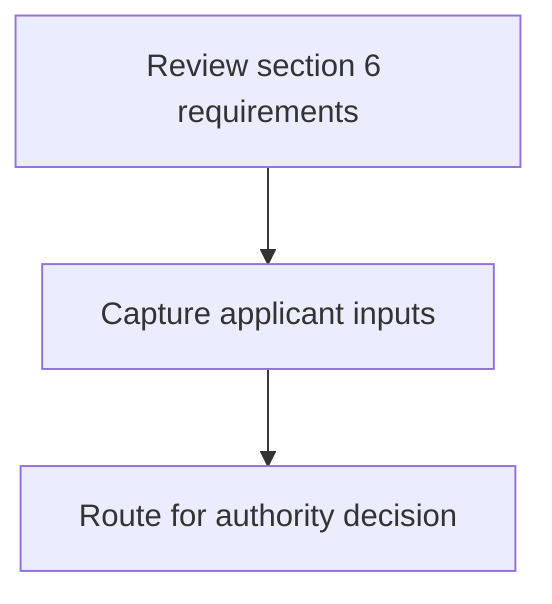
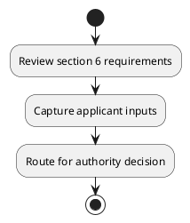

# Chapter 8 / Section 6: Representative of Export Inspection Agency: Member

**Chapter Title:** Quality Complaints and Trade Disputes

**Pages:** 3

**Purpose:** Defines the operational requirements for Representative of Export Inspection Agency: Member.

**Purpose Thanglish:** Indha Representative of Export Inspection Agency: Member section-la, Defines the operational requirements for Representative of export Inspection Agency: Member.

**Summary:** 6. Representative of Export Inspection Agency: Member

**Business Meaning:** 6.

**Business Explanation:** 6. Representative of Export Inspection Agency: Member

**Business Explanation Thanglish:** Indha Representative of Export Inspection Agency: Member section-la, 6. Representative of export Inspection Agency: Member

## Business Logic
- None identified

## Business Rules
- rule_id=CH8-SEC6-R001, rule_description=6. Representative of Export Inspection Agency: Member, trigger=Representative of Export Inspection Agency: Member, condition=Not explicitly covered in uploaded documents., validation=Not explicitly covered in uploaded documents., action=Manual review required., exception=No explicit exception found in uploaded documents., output=DEKAI should produce a compliance decision for 6 - Representative of Export Inspection Agency: Member.

## Conditions
- None identified

## Condition Logic
- None identified

## Validations
- None identified

## Exceptions
- None identified

## Dependencies
- None identified

## Authorities
- None identified

## Required Documents
- None identified

## Timelines
- None identified

## Actions
- None identified

## Workflow
- Review section 6 requirements
- Capture applicant inputs
- Route for authority decision

## Workflow ASCII
```text
Representative of Export Inspection Agency: Member
Review section 6 requirements
   |
   v
Capture applicant inputs
   |
   v
Route for authority decision
```

## Decision Tree
- IF section 6 applies THEN proceed with standard DGFT workflow

## Decision Tree ASCII
```text
Representative of Export Inspection Agency: Member Decision
IF section 6 applies THEN proceed with standard DGFT workflow
```

## Examples
- User asks to process Representative of Export Inspection Agency: Member; the platform checks conditions, validations, and documents before action.

**Real-world Example:** Example: an importer or exporter invokes Representative of Export Inspection Agency: Member, submits the prescribed DGFT records, and DEKAI uses the extracted rules to follow the representative of export inspection agency: member process.

**Real-world Example Thanglish:** Indha Representative of Export Inspection Agency: Member section-la, Example: an importer or exporter invokes Representative of export Inspection Agency: Member, submits the prescribed DGFT records, and DEKAI uses the extracted rules to follow the representative of export inspection agency: member process.

## AI Rules
- None identified

## Database Fields
- name=section_code, type=string, required=True, source=parsed_section_heading
- name=section_title, type=string, required=True, source=parsed_section_heading
- name=export_flag, type=boolean, required=False, source=keyword:Export
- name=agency_flag, type=boolean, required=False, source=keyword:Agency
- name=member_flag, type=boolean, required=False, source=keyword:Member
- name=inspection_flag, type=boolean, required=False, source=keyword:Inspection
- name=representative_flag, type=boolean, required=False, source=keyword:Representative

## API Requirements
- method=GET, path=/api/dgft/sections/6, purpose=Retrieve knowledge payload for section 6, query_params=['include=workflow,decision_tree,validations'], response_fields=['section', 'title', 'summary', 'conditions', 'validations', 'exceptions', 'workflow', 'decision_tree']
- method=POST, path=/api/dgft/Representative-of-Export-Inspection-Agency-Member/validate, purpose=Validate inputs and documents for Representative of Export Inspection Agency: Member, request_fields=['section_code', 'section_title'], response_fields=['status', 'errors', 'warnings', 'next_actions']

## UI Screens
- screen_id=Representative_of_Export_Inspection_Agency_Member_overview, name=Representative of Export Inspection Agency: Member Overview, purpose=Show section summary, authority, timeline, and eligibility cues., widgets=['summary_card', 'conditions_table', 'authority_badges', 'timeline_panel']
- screen_id=Representative_of_Export_Inspection_Agency_Member_submission, name=Representative of Export Inspection Agency: Member Submission, purpose=Capture applicant data and supporting documents., widgets=['dynamic_form', 'document_uploader', 'validation_panel', 'next_action_footer'], fields=['section_code', 'section_title', 'export_flag', 'agency_flag', 'member_flag', 'inspection_flag', 'representative_flag']

## Error Messages
- Validation failed because the section requirements were not fully met.

## FAQ
- question_en=What is the purpose of section 6?, answer_en=6. Representative of Export Inspection Agency: Member, question_thanglish=Indha Representative of Export Inspection Agency: Member section-la, What is the purpose of section 6?, answer_thanglish=Indha Representative of Export Inspection Agency: Member section-la, 6. Representative of export Inspection Agency: Member
- question_en=What documents are required under Representative of Export Inspection Agency: Member?, answer_en=Not explicitly covered in uploaded documents., question_thanglish=Indha Representative of Export Inspection Agency: Member section-la, What documents are required under Representative of export Inspection Agency: Member?, answer_thanglish=Indha Representative of Export Inspection Agency: Member section-la, Not explicitly covered in uploaded documents.
- question_en=Which authority handles Representative of Export Inspection Agency: Member?, answer_en=Not explicitly covered in uploaded documents., question_thanglish=Indha Representative of Export Inspection Agency: Member section-la, Which authority handles Representative of export Inspection Agency: Member?, answer_thanglish=Indha Representative of Export Inspection Agency: Member section-la, Not explicitly covered in uploaded documents.

## Questions Users May Ask
- What does Representative of Export Inspection Agency: Member require?
- Which documents are needed for Representative of Export Inspection Agency: Member?
- How does DEKAI validate Representative of Export Inspection Agency: Member requests?

## Expected AI Answers
- Representative of Export Inspection Agency: Member requires the platform to interpret the section text, apply the extracted business rules, and present the correct next action.
- Required documents are inferred from the section text: no explicit documents were detected.
- DEKAI validates Representative of Export Inspection Agency: Member by checking conditions, required documents, authority references, and exception clauses before recommending an outcome.

## AI Q&A Examples
- question_en=User asks: How do I comply with Representative of Export Inspection Agency: Member?, answer_en=AI answers: DEKAI should evaluate section 6, apply the extracted rules, and guide the user through Review section 6 requirements., question_thanglish=Indha Representative of Export Inspection Agency: Member section-la, User asks: How do I comply with Representative of export Inspection Agency: Member?, answer_thanglish=Indha Representative of Export Inspection Agency: Member section-la, AI answers: DEKAI should evaluate section 6, apply the extracted rules, and guide the user through Review section 6 requirements.
- question_en=User asks: Which validations apply to Representative of Export Inspection Agency: Member?, answer_en=AI answers: Applicable validations are not explicitly covered in the uploaded documents., question_thanglish=Indha Representative of Export Inspection Agency: Member section-la, User asks: Which validations apply to Representative of export Inspection Agency: Member?, answer_thanglish=Indha Representative of Export Inspection Agency: Member section-la, AI answers: Applicable validations are not explicitly covered in the uploaded documents.

## DEKAI AI Implementation Notes
- Capture chapter 8, section 6, title, and page references as immutable knowledge metadata.
- Bind validations for Representative of Export Inspection Agency: Member into a rule engine keyed by the rule IDs extracted for this section.

## DEKAI AI Implementation Notes Thanglish
- Indha Representative of Export Inspection Agency: Member section-la, Capture chapter 8, section 6, title, and page references as immutable knowledge metadata.
- Indha Representative of Export Inspection Agency: Member section-la, Bind validations for Representative of export Inspection Agency: Member into a rule engine keyed by the rule IDs extracted for this section.

## AI Metadata
- Keywords: Export, Agency, Member, Inspection, Representative
- Search Keywords: Export, Agency, Member, Inspection, Representative
- Intent: Provide knowledge guidance for Representative of Export Inspection Agency: Member.
- Tags: 6, Representative of Export Inspection Agency: Member, dgft
- Related Sections: 
- Related Chapters: 
- Related Rules: 

## Mermaid


## PlantUML

