# Chapter 10 / Section 6: SCOMET GAET issued for export / re-export of SCOMET items under

**Chapter Title:** SCOMET: Special Chemicals, Organisms, Materials, Equipment and Technologies

**Pages:** 42

**Purpose:** SCOMET GAET issued for export / re-export of SCOMET items under
Authorisation the above Categories / Sub Categories shall be valid for
Issued under Three years from the date of issue of GAET subject to
GAET Policy subsequent post reporting(s) on quarterly basis to be
reported within 30 days from the last quarter
pg.

**Purpose Thanglish:** Indha SCOMET GAET issued for export / re-export of SCOMET items under section-la, SCOMET GAET issued for export / re-export of SCOMET items under
Authorisation the above Categories / Sub Categories kandippa be valid for
Issued under Three years from the date of issue of GAET subject to
GAET Policy subsequent post reporting(s) on quarterly basis to be
reported within 30 days from the last quarter
pg.

**Summary:** 6. SCOMET GAET issued for export / re-export of SCOMET items under
Authorisation the above Categories / Sub Categories shall be valid for
Issued under Three years from the date of issue of GAET subject to
GAET Policy subsequent post reporting(s) on quarterly basis to be
reported within 30 days from the last quarter
pg. 1110
S.No.

**Business Meaning:** SCOMET GAET issued for export / re-export of SCOMET items under governs how DGFT business controls should be applied, validated, and enforced.

**Business Explanation:** SCOMET GAET issued for export / re-export of SCOMET items under explains the operating rule set that DEKAI should enforce. Key control points include SCOMET GAET issued for export / re-export of SCOMET items under
Authorisation the above Categories / Sub Categories shall be valid for
Issued under Three years from the date of issue of GAET subject to
GAET Policy subsequent post reporting(s) on quarterly basis to be
reported within 30 days from the last quarter
pg. The section also drives actions such as SCOMET GAET issued for export / re-export of SCOMET items under
Authorisation the above Categories / Sub Categories shall be valid for
Issued under Three years from the date of issue of GAET subject to
GAET Policy subsequent post reporting(s) on quarterly basis to be
reported within 30 days from the last quarter
pg..

**Business Explanation Thanglish:** Indha SCOMET GAET issued for export / re-export of SCOMET items under section-la, SCOMET GAET issued for export / re-export of SCOMET items under explains the operating rule set that DEKAI should enforce. Key control points include SCOMET GAET issued for export / re-export of SCOMET items under
Authorisation the above Categories / Sub Categories kandippa be valid for
Issued under Three years from the date of issue of GAET subject to
GAET Policy subsequent post reporting(s) on quarterly basis to be
reported within 30 days from the last quarter
pg. The section also drives actions such as SCOMET GAET issued for export / re-export of SCOMET items under
Authorisation the above Categories / Sub Categories kandippa be valid for
Issued under Three years from the date of issue of GAET subject to
GAET Policy subsequent post reporting(s) on quarterly basis to be
reported within 30 days from the last quarter
pg..

## Business Logic
- SCOMET GAET issued for export / re-export of SCOMET items under
Authorisation the above Categories / Sub Categories shall be valid for
Issued under Three years from the date of issue of GAET subject to
GAET Policy subsequent post reporting(s) on quarterly basis to be
reported within 30 days from the last quarter
pg.
- | Type of SCOMET | Validity Period
| Authorisation |
1 | SCOMET
Authorisation | The validity period of the SCOMET authorisation shall be
for a period of 24 months, unless otherwise specified.
- 2 | SCOMET
Authorisation
Issued under
GAICT Policy | GAICT authorisation issued for intra-company transfers
of SCOMET items/software/technology shall be valid for
a period of 3(three years) from the date of issue of
authorisation and shall be further subject to the
following validity timelines, whichever is earlier:
i.
- 3 | SCOMET
Authorisation
issued under
GAEC Policy | GAEC issued for export / re-export of SCOMET items
under the above Categories / Sub Categories (excluding
software and technology) shall be valid for a period of
5(five) years from the date of issue of GAEC subject to
subsequent post reporting(s) on quarterly basis to be
reported within 30 days from the last quarter;
4 | SCOMET
Authorisation
Issued under
GAER Policy | GAER issued for export of imported SCOMET items after
repair shall be valid for a period of 1 year from the date
of issue of GAER subject to subsequent post reporting(s)
within 30 days from such export.
- | SCOMET
Authorisation
Issued under
GAED Policy | GAED issued for export / re-export of SCOMET items under
the above Categories / Sub Categories shall be valid for a
period of Three years from the date of issue of
GAED subject to subsequent post reporting(s) on quarterly
basis to be reported within 30 days from the last quarter;
6.
- | SCOMET
Authorisation
Issued under
GAET Policy | GAET issued for export / re-export of SCOMET items under
the above Categories / Sub Categories shall be valid for
Three years from the date of issue of GAET subject to
subsequent post reporting(s) on quarterly basis to be
reported within 30 days from the last quarter
pg.

## Business Rules
- rule_id=CH10-SEC6-R001, rule_description=SCOMET GAET issued for export / re-export of SCOMET items under
Authorisation the above Categories / Sub Categories shall be valid for
Issued under Three years from the date of issue of GAET subject to
GAET Policy subsequent post reporting(s) on quarterly basis to be
reported within 30 days from the last quarter
pg., trigger=SCOMET GAET issued for export / re-export of SCOMET items under, condition=SCOMET GAET issued for export / re-export of SCOMET items under
Authorisation the above Categories / Sub Categories shall be valid for
Issued under Three years from the date of issue of GAET subject to
GAET Policy subsequent post reporting(s) on quarterly basis to be
reported within 30 days from the last quarter
pg., validation=SCOMET GAET issued for export / re-export of SCOMET items under
Authorisation the above Categories / Sub Categories shall be valid for
Issued under Three years from the date of issue of GAET subject to
GAET Policy subsequent post reporting(s) on quarterly basis to be
reported within 30 days from the last quarter
pg., action=SCOMET GAET issued for export / re-export of SCOMET items under
Authorisation the above Categories / Sub Categories shall be valid for
Issued under Three years from the date of issue of GAET subject to
GAET Policy subsequent post reporting(s) on quarterly basis to be
reported within 30 days from the last quarter
pg., exception=| Type of SCOMET | Validity Period
| Authorisation |
1 | SCOMET
Authorisation | The validity period of the SCOMET authorisation shall be
for a period of 24 months, unless otherwise specified., output=DEKAI should produce a compliance decision for 6 - SCOMET GAET issued for export / re-export of SCOMET items under.
- rule_id=CH10-SEC6-R002, rule_description=| Type of SCOMET | Validity Period
| Authorisation |
1 | SCOMET
Authorisation | The validity period of the SCOMET authorisation shall be
for a period of 24 months, unless otherwise specified., trigger=SCOMET GAET issued for export / re-export of SCOMET items under, condition=| Type of SCOMET | Validity Period
| Authorisation |
1 | SCOMET
Authorisation | The validity period of the SCOMET authorisation shall be
for a period of 24 months, unless otherwise specified., validation=| Type of SCOMET | Validity Period
| Authorisation |
1 | SCOMET
Authorisation | The validity period of the SCOMET authorisation shall be
for a period of 24 months, unless otherwise specified., action=2 | SCOMET
Authorisation
Issued under
GAICT Policy | GAICT authorisation issued for intra-company transfers
of SCOMET items/software/technology shall be valid for
a period of 3(three years) from the date of issue of
authorisation and shall be further subject to the
following validity timelines, whichever is earlier:
i., exception=Till the validity of license exception of foreign parent
company; or
ii., output=DEKAI should produce a compliance decision for 6 - SCOMET GAET issued for export / re-export of SCOMET items under.
- rule_id=CH10-SEC6-R003, rule_description=2 | SCOMET
Authorisation
Issued under
GAICT Policy | GAICT authorisation issued for intra-company transfers
of SCOMET items/software/technology shall be valid for
a period of 3(three years) from the date of issue of
authorisation and shall be further subject to the
following validity timelines, whichever is earlier:
i., trigger=SCOMET GAET issued for export / re-export of SCOMET items under, condition=2 | SCOMET
Authorisation
Issued under
GAICT Policy | GAICT authorisation issued for intra-company transfers
of SCOMET items/software/technology shall be valid for
a period of 3(three years) from the date of issue of
authorisation and shall be further subject to the
following validity timelines, whichever is earlier:
i., validation=2 | SCOMET
Authorisation
Issued under
GAICT Policy | GAICT authorisation issued for intra-company transfers
of SCOMET items/software/technology shall be valid for
a period of 3(three years) from the date of issue of
authorisation and shall be further subject to the
following validity timelines, whichever is earlier:
i., action=3 | SCOMET
Authorisation
issued under
GAEC Policy | GAEC issued for export / re-export of SCOMET items
under the above Categories / Sub Categories (excluding
software and technology) shall be valid for a period of
5(five) years from the date of issue of GAEC subject to
subsequent post reporting(s) on quarterly basis to be
reported within 30 days from the last quarter;
4 | SCOMET
Authorisation
Issued under
GAER Policy | GAER issued for export of imported SCOMET items after
repair shall be valid for a period of 1 year from the date
of issue of GAER subject to subsequent post reporting(s)
within 30 days from such export., exception=Till the validity of license exception of foreign parent
company for subsidiary(ies) of the parent company
abroad; or
iii., output=DEKAI should produce a compliance decision for 6 - SCOMET GAET issued for export / re-export of SCOMET items under.
- rule_id=CH10-SEC6-R004, rule_description=3 | SCOMET
Authorisation
issued under
GAEC Policy | GAEC issued for export / re-export of SCOMET items
under the above Categories / Sub Categories (excluding
software and technology) shall be valid for a period of
5(five) years from the date of issue of GAEC subject to
subsequent post reporting(s) on quarterly basis to be
reported within 30 days from the last quarter;
4 | SCOMET
Authorisation
Issued under
GAER Policy | GAER issued for export of imported SCOMET items after
repair shall be valid for a period of 1 year from the date
of issue of GAER subject to subsequent post reporting(s)
within 30 days from such export., trigger=SCOMET GAET issued for export / re-export of SCOMET items under, condition=3 | SCOMET
Authorisation
issued under
GAEC Policy | GAEC issued for export / re-export of SCOMET items
under the above Categories / Sub Categories (excluding
software and technology) shall be valid for a period of
5(five) years from the date of issue of GAEC subject to
subsequent post reporting(s) on quarterly basis to be
reported within 30 days from the last quarter;
4 | SCOMET
Authorisation
Issued under
GAER Policy | GAER issued for export of imported SCOMET items after
repair shall be valid for a period of 1 year from the date
of issue of GAER subject to subsequent post reporting(s)
within 30 days from such export., validation=3 | SCOMET
Authorisation
issued under
GAEC Policy | GAEC issued for export / re-export of SCOMET items
under the above Categories / Sub Categories (excluding
software and technology) shall be valid for a period of
5(five) years from the date of issue of GAEC subject to
subsequent post reporting(s) on quarterly basis to be
reported within 30 days from the last quarter;
4 | SCOMET
Authorisation
Issued under
GAER Policy | GAER issued for export of imported SCOMET items after
repair shall be valid for a period of 1 year from the date
of issue of GAER subject to subsequent post reporting(s)
within 30 days from such export., action=| SCOMET
Authorisation
Issued under
GAED Policy | GAED issued for export / re-export of SCOMET items under
the above Categories / Sub Categories shall be valid for a
period of Three years from the date of issue of
GAED subject to subsequent post reporting(s) on quarterly
basis to be reported within 30 days from the last quarter;
6., exception=Till the validity of license exception of foreign parent
company for subsidiary(ies) of the parent company
abroad; or
iii., output=DEKAI should produce a compliance decision for 6 - SCOMET GAET issued for export / re-export of SCOMET items under.
- rule_id=CH10-SEC6-R005, rule_description=| SCOMET
Authorisation
Issued under
GAED Policy | GAED issued for export / re-export of SCOMET items under
the above Categories / Sub Categories shall be valid for a
period of Three years from the date of issue of
GAED subject to subsequent post reporting(s) on quarterly
basis to be reported within 30 days from the last quarter;
6., trigger=SCOMET GAET issued for export / re-export of SCOMET items under, condition=| SCOMET
Authorisation
Issued under
GAED Policy | GAED issued for export / re-export of SCOMET items under
the above Categories / Sub Categories shall be valid for a
period of Three years from the date of issue of
GAED subject to subsequent post reporting(s) on quarterly
basis to be reported within 30 days from the last quarter;
6., validation=| SCOMET
Authorisation
Issued under
GAED Policy | GAED issued for export / re-export of SCOMET items under
the above Categories / Sub Categories shall be valid for a
period of Three years from the date of issue of
GAED subject to subsequent post reporting(s) on quarterly
basis to be reported within 30 days from the last quarter;
6., action=| SCOMET
Authorisation
Issued under
GAET Policy | GAET issued for export / re-export of SCOMET items under
the above Categories / Sub Categories shall be valid for
Three years from the date of issue of GAET subject to
subsequent post reporting(s) on quarterly basis to be
reported within 30 days from the last quarter
pg., exception=Till the validity of license exception of foreign parent
company for subsidiary(ies) of the parent company
abroad; or
iii., output=DEKAI should produce a compliance decision for 6 - SCOMET GAET issued for export / re-export of SCOMET items under.
- rule_id=CH10-SEC6-R006, rule_description=| SCOMET
Authorisation
Issued under
GAET Policy | GAET issued for export / re-export of SCOMET items under
the above Categories / Sub Categories shall be valid for
Three years from the date of issue of GAET subject to
subsequent post reporting(s) on quarterly basis to be
reported within 30 days from the last quarter
pg., trigger=SCOMET GAET issued for export / re-export of SCOMET items under, condition=| SCOMET
Authorisation
Issued under
GAET Policy | GAET issued for export / re-export of SCOMET items under
the above Categories / Sub Categories shall be valid for
Three years from the date of issue of GAET subject to
subsequent post reporting(s) on quarterly basis to be
reported within 30 days from the last quarter
pg., validation=| SCOMET
Authorisation
Issued under
GAET Policy | GAET issued for export / re-export of SCOMET items under
the above Categories / Sub Categories shall be valid for
Three years from the date of issue of GAET subject to
subsequent post reporting(s) on quarterly basis to be
reported within 30 days from the last quarter
pg., action=| SCOMET
Authorisation
Issued under
GAET Policy | GAET issued for export / re-export of SCOMET items under
the above Categories / Sub Categories shall be valid for
Three years from the date of issue of GAET subject to
subsequent post reporting(s) on quarterly basis to be
reported within 30 days from the last quarter
pg., exception=Till the validity of license exception of foreign parent
company for subsidiary(ies) of the parent company
abroad; or
iii., output=DEKAI should produce a compliance decision for 6 - SCOMET GAET issued for export / re-export of SCOMET items under.

## Conditions
- SCOMET GAET issued for export / re-export of SCOMET items under
Authorisation the above Categories / Sub Categories shall be valid for
Issued under Three years from the date of issue of GAET subject to
GAET Policy subsequent post reporting(s) on quarterly basis to be
reported within 30 days from the last quarter
pg.
- | Type of SCOMET | Validity Period
| Authorisation |
1 | SCOMET
Authorisation | The validity period of the SCOMET authorisation shall be
for a period of 24 months, unless otherwise specified.
- 2 | SCOMET
Authorisation
Issued under
GAICT Policy | GAICT authorisation issued for intra-company transfers
of SCOMET items/software/technology shall be valid for
a period of 3(three years) from the date of issue of
authorisation and shall be further subject to the
following validity timelines, whichever is earlier:
i.
- 3 | SCOMET
Authorisation
issued under
GAEC Policy | GAEC issued for export / re-export of SCOMET items
under the above Categories / Sub Categories (excluding
software and technology) shall be valid for a period of
5(five) years from the date of issue of GAEC subject to
subsequent post reporting(s) on quarterly basis to be
reported within 30 days from the last quarter;
4 | SCOMET
Authorisation
Issued under
GAER Policy | GAER issued for export of imported SCOMET items after
repair shall be valid for a period of 1 year from the date
of issue of GAER subject to subsequent post reporting(s)
within 30 days from such export.
- | SCOMET
Authorisation
Issued under
GAED Policy | GAED issued for export / re-export of SCOMET items under
the above Categories / Sub Categories shall be valid for a
period of Three years from the date of issue of
GAED subject to subsequent post reporting(s) on quarterly
basis to be reported within 30 days from the last quarter;
6.
- | SCOMET
Authorisation
Issued under
GAET Policy | GAET issued for export / re-export of SCOMET items under
the above Categories / Sub Categories shall be valid for
Three years from the date of issue of GAET subject to
subsequent post reporting(s) on quarterly basis to be
reported within 30 days from the last quarter
pg.

## Condition Logic
- id=10.6.1, if=SCOMET GAET issued for export / re-export of SCOMET items under
Authorisation the above Categories / Sub Categories shall be valid for
Issued under Three years from the date of issue of GAET subject to
GAET Policy subsequent post reporting(s) on quarterly basis to be
reported within 30 days from the last quarter
pg., then=SCOMET GAET issued for export / re-export of SCOMET items under
Authorisation the above Categories / Sub Categories shall be valid for
Issued under Three years from the date of issue of GAET subject to
GAET Policy subsequent post reporting(s) on quarterly basis to be
reported within 30 days from the last quarter
pg., source=SCOMET GAET issued for export / re-export of SCOMET items under
Authorisation the above Categories / Sub Categories shall be valid for
Issued under Three years from the date of issue of GAET subject to
GAET Policy subsequent post reporting(s) on quarterly basis to be
reported within 30 days from the last quarter
pg.
- id=10.6.2, if=| Type of SCOMET | Validity Period
| Authorisation |
1 | SCOMET
Authorisation | The validity period of the SCOMET authorisation shall be
for a period of 24 months, unless otherwise specified., then=SCOMET GAET issued for export / re-export of SCOMET items under
Authorisation the above Categories / Sub Categories shall be valid for
Issued under Three years from the date of issue of GAET subject to
GAET Policy subsequent post reporting(s) on quarterly basis to be
reported within 30 days from the last quarter
pg., source=| Type of SCOMET | Validity Period
| Authorisation |
1 | SCOMET
Authorisation | The validity period of the SCOMET authorisation shall be
for a period of 24 months, unless otherwise specified.
- id=10.6.3, if=2 | SCOMET
Authorisation
Issued under
GAICT Policy | GAICT authorisation issued for intra-company transfers
of SCOMET items/software/technology shall be valid for
a period of 3(three years) from the date of issue of
authorisation and shall be further subject to the
following validity timelines, whichever is earlier:
i., then=SCOMET GAET issued for export / re-export of SCOMET items under
Authorisation the above Categories / Sub Categories shall be valid for
Issued under Three years from the date of issue of GAET subject to
GAET Policy subsequent post reporting(s) on quarterly basis to be
reported within 30 days from the last quarter
pg., source=2 | SCOMET
Authorisation
Issued under
GAICT Policy | GAICT authorisation issued for intra-company transfers
of SCOMET items/software/technology shall be valid for
a period of 3(three years) from the date of issue of
authorisation and shall be further subject to the
following validity timelines, whichever is earlier:
i.
- id=10.6.4, if=3 | SCOMET
Authorisation
issued under
GAEC Policy | GAEC issued for export / re-export of SCOMET items
under the above Categories / Sub Categories (excluding
software and technology) shall be valid for a period of
5(five) years from the date of issue of GAEC subject to
subsequent post reporting(s) on quarterly basis to be
reported within 30 days from the last quarter;
4 | SCOMET
Authorisation
Issued under
GAER Policy | GAER issued for export of imported SCOMET items after
repair shall be valid for a period of 1 year from the date
of issue of GAER subject to subsequent post reporting(s)
within 30 days from such export., then=SCOMET GAET issued for export / re-export of SCOMET items under
Authorisation the above Categories / Sub Categories shall be valid for
Issued under Three years from the date of issue of GAET subject to
GAET Policy subsequent post reporting(s) on quarterly basis to be
reported within 30 days from the last quarter
pg., source=3 | SCOMET
Authorisation
issued under
GAEC Policy | GAEC issued for export / re-export of SCOMET items
under the above Categories / Sub Categories (excluding
software and technology) shall be valid for a period of
5(five) years from the date of issue of GAEC subject to
subsequent post reporting(s) on quarterly basis to be
reported within 30 days from the last quarter;
4 | SCOMET
Authorisation
Issued under
GAER Policy | GAER issued for export of imported SCOMET items after
repair shall be valid for a period of 1 year from the date
of issue of GAER subject to subsequent post reporting(s)
within 30 days from such export.
- id=10.6.5, if=| SCOMET
Authorisation
Issued under
GAED Policy | GAED issued for export / re-export of SCOMET items under
the above Categories / Sub Categories shall be valid for a
period of Three years from the date of issue of
GAED subject to subsequent post reporting(s) on quarterly
basis to be reported within 30 days from the last quarter;
6., then=SCOMET GAET issued for export / re-export of SCOMET items under
Authorisation the above Categories / Sub Categories shall be valid for
Issued under Three years from the date of issue of GAET subject to
GAET Policy subsequent post reporting(s) on quarterly basis to be
reported within 30 days from the last quarter
pg., source=| SCOMET
Authorisation
Issued under
GAED Policy | GAED issued for export / re-export of SCOMET items under
the above Categories / Sub Categories shall be valid for a
period of Three years from the date of issue of
GAED subject to subsequent post reporting(s) on quarterly
basis to be reported within 30 days from the last quarter;
6.
- id=10.6.6, if=| SCOMET
Authorisation
Issued under
GAET Policy | GAET issued for export / re-export of SCOMET items under
the above Categories / Sub Categories shall be valid for
Three years from the date of issue of GAET subject to
subsequent post reporting(s) on quarterly basis to be
reported within 30 days from the last quarter
pg., then=SCOMET GAET issued for export / re-export of SCOMET items under
Authorisation the above Categories / Sub Categories shall be valid for
Issued under Three years from the date of issue of GAET subject to
GAET Policy subsequent post reporting(s) on quarterly basis to be
reported within 30 days from the last quarter
pg., source=| SCOMET
Authorisation
Issued under
GAET Policy | GAET issued for export / re-export of SCOMET items under
the above Categories / Sub Categories shall be valid for
Three years from the date of issue of GAET subject to
subsequent post reporting(s) on quarterly basis to be
reported within 30 days from the last quarter
pg.

## Validations
- SCOMET GAET issued for export / re-export of SCOMET items under
Authorisation the above Categories / Sub Categories shall be valid for
Issued under Three years from the date of issue of GAET subject to
GAET Policy subsequent post reporting(s) on quarterly basis to be
reported within 30 days from the last quarter
pg.
- | Type of SCOMET | Validity Period
| Authorisation |
1 | SCOMET
Authorisation | The validity period of the SCOMET authorisation shall be
for a period of 24 months, unless otherwise specified.
- 2 | SCOMET
Authorisation
Issued under
GAICT Policy | GAICT authorisation issued for intra-company transfers
of SCOMET items/software/technology shall be valid for
a period of 3(three years) from the date of issue of
authorisation and shall be further subject to the
following validity timelines, whichever is earlier:
i.
- 3 | SCOMET
Authorisation
issued under
GAEC Policy | GAEC issued for export / re-export of SCOMET items
under the above Categories / Sub Categories (excluding
software and technology) shall be valid for a period of
5(five) years from the date of issue of GAEC subject to
subsequent post reporting(s) on quarterly basis to be
reported within 30 days from the last quarter;
4 | SCOMET
Authorisation
Issued under
GAER Policy | GAER issued for export of imported SCOMET items after
repair shall be valid for a period of 1 year from the date
of issue of GAER subject to subsequent post reporting(s)
within 30 days from such export.
- | SCOMET
Authorisation
Issued under
GAED Policy | GAED issued for export / re-export of SCOMET items under
the above Categories / Sub Categories shall be valid for a
period of Three years from the date of issue of
GAED subject to subsequent post reporting(s) on quarterly
basis to be reported within 30 days from the last quarter;
6.
- | SCOMET
Authorisation
Issued under
GAET Policy | GAET issued for export / re-export of SCOMET items under
the above Categories / Sub Categories shall be valid for
Three years from the date of issue of GAET subject to
subsequent post reporting(s) on quarterly basis to be
reported within 30 days from the last quarter
pg.

## Exceptions
- | Type of SCOMET | Validity Period
| Authorisation |
1 | SCOMET
Authorisation | The validity period of the SCOMET authorisation shall be
for a period of 24 months, unless otherwise specified.
- Till the validity of license exception of foreign parent
company; or
ii.
- Till the validity of license exception of foreign parent
company for subsidiary(ies) of the parent company
abroad; or
iii.

## Dependencies
- 1
- 2
- 3
- 4
- 5

## Authorities
- None identified

## Required Documents
- Till the validity of license exception of foreign parent
company; or
ii.
- Till the validity of license exception of foreign parent
company for subsidiary(ies) of the parent company
abroad; or
iii.

## Timelines
- SCOMET GAET issued for export / re-export of SCOMET items under
Authorisation the above Categories / Sub Categories shall be valid for
Issued under Three years from the date of issue of GAET subject to
GAET Policy subsequent post reporting(s) on quarterly basis to be
reported within 30 days from the last quarter
pg.
- | Type of SCOMET | Validity Period
| Authorisation |
1 | SCOMET
Authorisation | The validity period of the SCOMET authorisation shall be
for a period of 24 months, unless otherwise specified.
- 2 | SCOMET
Authorisation
Issued under
GAICT Policy | GAICT authorisation issued for intra-company transfers
of SCOMET items/software/technology shall be valid for
a period of 3(three years) from the date of issue of
authorisation and shall be further subject to the
following validity timelines, whichever is earlier:
i.
- 3 | SCOMET
Authorisation
issued under
GAEC Policy | GAEC issued for export / re-export of SCOMET items
under the above Categories / Sub Categories (excluding
software and technology) shall be valid for a period of
5(five) years from the date of issue of GAEC subject to
subsequent post reporting(s) on quarterly basis to be
reported within 30 days from the last quarter;
4 | SCOMET
Authorisation
Issued under
GAER Policy | GAER issued for export of imported SCOMET items after
repair shall be valid for a period of 1 year from the date
of issue of GAER subject to subsequent post reporting(s)
within 30 days from such export.
- | SCOMET
Authorisation
Issued under
GAED Policy | GAED issued for export / re-export of SCOMET items under
the above Categories / Sub Categories shall be valid for a
period of Three years from the date of issue of
GAED subject to subsequent post reporting(s) on quarterly
basis to be reported within 30 days from the last quarter;
6.
- | SCOMET
Authorisation
Issued under
GAET Policy | GAET issued for export / re-export of SCOMET items under
the above Categories / Sub Categories shall be valid for
Three years from the date of issue of GAET subject to
subsequent post reporting(s) on quarterly basis to be
reported within 30 days from the last quarter
pg.

## Actions
- SCOMET GAET issued for export / re-export of SCOMET items under
Authorisation the above Categories / Sub Categories shall be valid for
Issued under Three years from the date of issue of GAET subject to
GAET Policy subsequent post reporting(s) on quarterly basis to be
reported within 30 days from the last quarter
pg.
- 2 | SCOMET
Authorisation
Issued under
GAICT Policy | GAICT authorisation issued for intra-company transfers
of SCOMET items/software/technology shall be valid for
a period of 3(three years) from the date of issue of
authorisation and shall be further subject to the
following validity timelines, whichever is earlier:
i.
- 3 | SCOMET
Authorisation
issued under
GAEC Policy | GAEC issued for export / re-export of SCOMET items
under the above Categories / Sub Categories (excluding
software and technology) shall be valid for a period of
5(five) years from the date of issue of GAEC subject to
subsequent post reporting(s) on quarterly basis to be
reported within 30 days from the last quarter;
4 | SCOMET
Authorisation
Issued under
GAER Policy | GAER issued for export of imported SCOMET items after
repair shall be valid for a period of 1 year from the date
of issue of GAER subject to subsequent post reporting(s)
within 30 days from such export.
- | SCOMET
Authorisation
Issued under
GAED Policy | GAED issued for export / re-export of SCOMET items under
the above Categories / Sub Categories shall be valid for a
period of Three years from the date of issue of
GAED subject to subsequent post reporting(s) on quarterly
basis to be reported within 30 days from the last quarter;
6.
- | SCOMET
Authorisation
Issued under
GAET Policy | GAET issued for export / re-export of SCOMET items under
the above Categories / Sub Categories shall be valid for
Three years from the date of issue of GAET subject to
subsequent post reporting(s) on quarterly basis to be
reported within 30 days from the last quarter
pg.

## Workflow
- Evaluate condition: SCOMET GAET issued for export / re-export of SCOMET items under
Authorisation the above Categories / Sub Categories shall be valid for
Issued under Three years from the date of issue of GAET subject to
GAET Policy subsequent post reporting(s) on quarterly basis to be
reported within 30 days from the last quarter
pg.
- Evaluate condition: | Type of SCOMET | Validity Period
| Authorisation |
1 | SCOMET
Authorisation | The validity period of the SCOMET authorisation shall be
for a period of 24 months, unless otherwise specified.
- Evaluate condition: 2 | SCOMET
Authorisation
Issued under
GAICT Policy | GAICT authorisation issued for intra-company transfers
of SCOMET items/software/technology shall be valid for
a period of 3(three years) from the date of issue of
authorisation and shall be further subject to the
following validity timelines, whichever is earlier:
i.
- SCOMET GAET issued for export / re-export of SCOMET items under
Authorisation the above Categories / Sub Categories shall be valid for
Issued under Three years from the date of issue of GAET subject to
GAET Policy subsequent post reporting(s) on quarterly basis to be
reported within 30 days from the last quarter
pg.
- 2 | SCOMET
Authorisation
Issued under
GAICT Policy | GAICT authorisation issued for intra-company transfers
of SCOMET items/software/technology shall be valid for
a period of 3(three years) from the date of issue of
authorisation and shall be further subject to the
following validity timelines, whichever is earlier:
i.
- 3 | SCOMET
Authorisation
issued under
GAEC Policy | GAEC issued for export / re-export of SCOMET items
under the above Categories / Sub Categories (excluding
software and technology) shall be valid for a period of
5(five) years from the date of issue of GAEC subject to
subsequent post reporting(s) on quarterly basis to be
reported within 30 days from the last quarter;
4 | SCOMET
Authorisation
Issued under
GAER Policy | GAER issued for export of imported SCOMET items after
repair shall be valid for a period of 1 year from the date
of issue of GAER subject to subsequent post reporting(s)
within 30 days from such export.
- | SCOMET
Authorisation
Issued under
GAED Policy | GAED issued for export / re-export of SCOMET items under
the above Categories / Sub Categories shall be valid for a
period of Three years from the date of issue of
GAED subject to subsequent post reporting(s) on quarterly
basis to be reported within 30 days from the last quarter;
6.
- | SCOMET
Authorisation
Issued under
GAET Policy | GAET issued for export / re-export of SCOMET items under
the above Categories / Sub Categories shall be valid for
Three years from the date of issue of GAET subject to
subsequent post reporting(s) on quarterly basis to be
reported within 30 days from the last quarter
pg.
- Run validation: SCOMET GAET issued for export / re-export of SCOMET items under
Authorisation the above Categories / Sub Categories shall be valid for
Issued under Three years from the date of issue of GAET subject to
GAET Policy subsequent post reporting(s) on quarterly basis to be
reported within 30 days from the last quarter
pg.
- Run validation: | Type of SCOMET | Validity Period
| Authorisation |
1 | SCOMET
Authorisation | The validity period of the SCOMET authorisation shall be
for a period of 24 months, unless otherwise specified.
- Run validation: 2 | SCOMET
Authorisation
Issued under
GAICT Policy | GAICT authorisation issued for intra-company transfers
of SCOMET items/software/technology shall be valid for
a period of 3(three years) from the date of issue of
authorisation and shall be further subject to the
following validity timelines, whichever is earlier:
i.
- Handle exception: | Type of SCOMET | Validity Period
| Authorisation |
1 | SCOMET
Authorisation | The validity period of the SCOMET authorisation shall be
for a period of 24 months, unless otherwise specified.

## Workflow ASCII
```text
SCOMET GAET issued for export / re-export of SCOMET items under
Evaluate condition: SCOMET GAET issued for export / re-export of SCOMET items under
Authorisation the above Categories / Sub Categories shall be valid for
Issued under Three years from the date of issue of GAET subject to
GAET Policy subsequent post reporting(s) on quarterly basis to be
reported within 30 days from the last quarter
pg.
   |
   v
Evaluate condition: | Type of SCOMET | Validity Period
| Authorisation |
1 | SCOMET
Authorisation | The validity period of the SCOMET authorisation shall be
for a period of 24 months, unless otherwise specified.
   |
   v
Evaluate condition: 2 | SCOMET
Authorisation
Issued under
GAICT Policy | GAICT authorisation issued for intra-company transfers
of SCOMET items/software/technology shall be valid for
a period of 3(three years) from the date of issue of
authorisation and shall be further subject to the
following validity timelines, whichever is earlier:
i.
   |
   v
SCOMET GAET issued for export / re-export of SCOMET items under
Authorisation the above Categories / Sub Categories shall be valid for
Issued under Three years from the date of issue of GAET subject to
GAET Policy subsequent post reporting(s) on quarterly basis to be
reported within 30 days from the last quarter
pg.
   |
   v
2 | SCOMET
Authorisation
Issued under
GAICT Policy | GAICT authorisation issued for intra-company transfers
of SCOMET items/software/technology shall be valid for
a period of 3(three years) from the date of issue of
authorisation and shall be further subject to the
following validity timelines, whichever is earlier:
i.
   |
   v
3 | SCOMET
Authorisation
issued under
GAEC Policy | GAEC issued for export / re-export of SCOMET items
under the above Categories / Sub Categories (excluding
software and technology) shall be valid for a period of
5(five) years from the date of issue of GAEC subject to
subsequent post reporting(s) on quarterly basis to be
reported within 30 days from the last quarter;
4 | SCOMET
Authorisation
Issued under
GAER Policy | GAER issued for export of imported SCOMET items after
repair shall be valid for a period of 1 year from the date
of issue of GAER subject to subsequent post reporting(s)
within 30 days from such export.
   |
   v
| SCOMET
Authorisation
Issued under
GAED Policy | GAED issued for export / re-export of SCOMET items under
the above Categories / Sub Categories shall be valid for a
period of Three years from the date of issue of
GAED subject to subsequent post reporting(s) on quarterly
basis to be reported within 30 days from the last quarter;
6.
   |
   v
| SCOMET
Authorisation
Issued under
GAET Policy | GAET issued for export / re-export of SCOMET items under
the above Categories / Sub Categories shall be valid for
Three years from the date of issue of GAET subject to
subsequent post reporting(s) on quarterly basis to be
reported within 30 days from the last quarter
pg.
   |
   v
Run validation: SCOMET GAET issued for export / re-export of SCOMET items under
Authorisation the above Categories / Sub Categories shall be valid for
Issued under Three years from the date of issue of GAET subject to
GAET Policy subsequent post reporting(s) on quarterly basis to be
reported within 30 days from the last quarter
pg.
   |
   v
Run validation: | Type of SCOMET | Validity Period
| Authorisation |
1 | SCOMET
Authorisation | The validity period of the SCOMET authorisation shall be
for a period of 24 months, unless otherwise specified.
   |
   v
Run validation: 2 | SCOMET
Authorisation
Issued under
GAICT Policy | GAICT authorisation issued for intra-company transfers
of SCOMET items/software/technology shall be valid for
a period of 3(three years) from the date of issue of
authorisation and shall be further subject to the
following validity timelines, whichever is earlier:
i.
   |
   v
Handle exception: | Type of SCOMET | Validity Period
| Authorisation |
1 | SCOMET
Authorisation | The validity period of the SCOMET authorisation shall be
for a period of 24 months, unless otherwise specified.
```

## Decision Tree
- IF SCOMET GAET issued for export / re-export of SCOMET items under
Authorisation the above Categories / Sub Categories shall be valid for
Issued under Three years from the date of issue of GAET subject to
GAET Policy subsequent post reporting(s) on quarterly basis to be
reported within 30 days from the last quarter
pg. THEN SCOMET GAET issued for export / re-export of SCOMET items under
Authorisation the above Categories / Sub Categories shall be valid for
Issued under Three years from the date of issue of GAET subject to
GAET Policy subsequent post reporting(s) on quarterly basis to be
reported within 30 days from the last quarter
pg.
- IF | Type of SCOMET | Validity Period
| Authorisation |
1 | SCOMET
Authorisation | The validity period of the SCOMET authorisation shall be
for a period of 24 months, unless otherwise specified. THEN SCOMET GAET issued for export / re-export of SCOMET items under
Authorisation the above Categories / Sub Categories shall be valid for
Issued under Three years from the date of issue of GAET subject to
GAET Policy subsequent post reporting(s) on quarterly basis to be
reported within 30 days from the last quarter
pg.
- IF 2 | SCOMET
Authorisation
Issued under
GAICT Policy | GAICT authorisation issued for intra-company transfers
of SCOMET items/software/technology shall be valid for
a period of 3(three years) from the date of issue of
authorisation and shall be further subject to the
following validity timelines, whichever is earlier:
i. THEN SCOMET GAET issued for export / re-export of SCOMET items under
Authorisation the above Categories / Sub Categories shall be valid for
Issued under Three years from the date of issue of GAET subject to
GAET Policy subsequent post reporting(s) on quarterly basis to be
reported within 30 days from the last quarter
pg.
- IF 3 | SCOMET
Authorisation
issued under
GAEC Policy | GAEC issued for export / re-export of SCOMET items
under the above Categories / Sub Categories (excluding
software and technology) shall be valid for a period of
5(five) years from the date of issue of GAEC subject to
subsequent post reporting(s) on quarterly basis to be
reported within 30 days from the last quarter;
4 | SCOMET
Authorisation
Issued under
GAER Policy | GAER issued for export of imported SCOMET items after
repair shall be valid for a period of 1 year from the date
of issue of GAER subject to subsequent post reporting(s)
within 30 days from such export. THEN SCOMET GAET issued for export / re-export of SCOMET items under
Authorisation the above Categories / Sub Categories shall be valid for
Issued under Three years from the date of issue of GAET subject to
GAET Policy subsequent post reporting(s) on quarterly basis to be
reported within 30 days from the last quarter
pg.
- IF | SCOMET
Authorisation
Issued under
GAED Policy | GAED issued for export / re-export of SCOMET items under
the above Categories / Sub Categories shall be valid for a
period of Three years from the date of issue of
GAED subject to subsequent post reporting(s) on quarterly
basis to be reported within 30 days from the last quarter;
6. THEN SCOMET GAET issued for export / re-export of SCOMET items under
Authorisation the above Categories / Sub Categories shall be valid for
Issued under Three years from the date of issue of GAET subject to
GAET Policy subsequent post reporting(s) on quarterly basis to be
reported within 30 days from the last quarter
pg.
- IF exception applies (| Type of SCOMET | Validity Period
| Authorisation |
1 | SCOMET
Authorisation | The validity period of the SCOMET authorisation shall be
for a period of 24 months, unless otherwise specified.) THEN route to manual review
- IF exception applies (Till the validity of license exception of foreign parent
company; or
ii.) THEN route to manual review
- IF exception applies (Till the validity of license exception of foreign parent
company for subsidiary(ies) of the parent company
abroad; or
iii.) THEN route to manual review

## Decision Tree ASCII
```text
SCOMET GAET issued for export / re-export of SCOMET items under Decision
IF SCOMET GAET issued for export / re-export of SCOMET items under
Authorisation the above Categories / Sub Categories shall be valid for
Issued under Three years from the date of issue of GAET subject to
GAET Policy subsequent post reporting(s) on quarterly basis to be
reported within 30 days from the last quarter
pg. THEN SCOMET GAET issued for export / re-export of SCOMET items under
Authorisation the above Categories / Sub Categories shall be valid for
Issued under Three years from the date of issue of GAET subject to
GAET Policy subsequent post reporting(s) on quarterly basis to be
reported within 30 days from the last quarter
pg.
   |
   v
IF | Type of SCOMET | Validity Period
| Authorisation |
1 | SCOMET
Authorisation | The validity period of the SCOMET authorisation shall be
for a period of 24 months, unless otherwise specified. THEN SCOMET GAET issued for export / re-export of SCOMET items under
Authorisation the above Categories / Sub Categories shall be valid for
Issued under Three years from the date of issue of GAET subject to
GAET Policy subsequent post reporting(s) on quarterly basis to be
reported within 30 days from the last quarter
pg.
   |
   v
IF 2 | SCOMET
Authorisation
Issued under
GAICT Policy | GAICT authorisation issued for intra-company transfers
of SCOMET items/software/technology shall be valid for
a period of 3(three years) from the date of issue of
authorisation and shall be further subject to the
following validity timelines, whichever is earlier:
i. THEN SCOMET GAET issued for export / re-export of SCOMET items under
Authorisation the above Categories / Sub Categories shall be valid for
Issued under Three years from the date of issue of GAET subject to
GAET Policy subsequent post reporting(s) on quarterly basis to be
reported within 30 days from the last quarter
pg.
   |
   v
IF 3 | SCOMET
Authorisation
issued under
GAEC Policy | GAEC issued for export / re-export of SCOMET items
under the above Categories / Sub Categories (excluding
software and technology) shall be valid for a period of
5(five) years from the date of issue of GAEC subject to
subsequent post reporting(s) on quarterly basis to be
reported within 30 days from the last quarter;
4 | SCOMET
Authorisation
Issued under
GAER Policy | GAER issued for export of imported SCOMET items after
repair shall be valid for a period of 1 year from the date
of issue of GAER subject to subsequent post reporting(s)
within 30 days from such export. THEN SCOMET GAET issued for export / re-export of SCOMET items under
Authorisation the above Categories / Sub Categories shall be valid for
Issued under Three years from the date of issue of GAET subject to
GAET Policy subsequent post reporting(s) on quarterly basis to be
reported within 30 days from the last quarter
pg.
   |
   v
IF | SCOMET
Authorisation
Issued under
GAED Policy | GAED issued for export / re-export of SCOMET items under
the above Categories / Sub Categories shall be valid for a
period of Three years from the date of issue of
GAED subject to subsequent post reporting(s) on quarterly
basis to be reported within 30 days from the last quarter;
6. THEN SCOMET GAET issued for export / re-export of SCOMET items under
Authorisation the above Categories / Sub Categories shall be valid for
Issued under Three years from the date of issue of GAET subject to
GAET Policy subsequent post reporting(s) on quarterly basis to be
reported within 30 days from the last quarter
pg.
   |
   v
IF exception applies (| Type of SCOMET | Validity Period
| Authorisation |
1 | SCOMET
Authorisation | The validity period of the SCOMET authorisation shall be
for a period of 24 months, unless otherwise specified.) THEN route to manual review
   |
   v
IF exception applies (Till the validity of license exception of foreign parent
company; or
ii.) THEN route to manual review
   |
   v
IF exception applies (Till the validity of license exception of foreign parent
company for subsidiary(ies) of the parent company
abroad; or
iii.) THEN route to manual review
```

## Examples
- User asks to process SCOMET GAET issued for export / re-export of SCOMET items under; the platform checks conditions, validations, and documents before action.

**Real-world Example:** Example: an importer or exporter invokes SCOMET GAET issued for export / re-export of SCOMET items under, submits Till the validity of license exception of foreign parent
company; or
ii., Till the validity of license exception of foreign parent
company for subsidiary(ies) of the parent company
abroad; or
iii., and DEKAI uses the extracted rules to scomet gaet issued for export / re-export of scomet items under
authorisation the above categories / sub categories shall be valid for
issued under three years from the date of issue of gaet subject to
gaet policy subsequent post reporting(s) on quarterly basis to be
reported within 30 days from the last quarter
pg..

**Real-world Example Thanglish:** Indha SCOMET GAET issued for export / re-export of SCOMET items under section-la, Example: an importer or exporter invokes SCOMET GAET issued for export / re-export of SCOMET items under, submits Till the validity of license exception of foreign parent
company; or
ii., Till the validity of license exception of foreign parent
company for subsidiary(ies) of the parent company
abroad; or
iii., and DEKAI uses the extracted rules to scomet gaet issued for export / re-export of scomet items under
authorisation the above categories / sub categories kandippa be valid for
issued under three years from the date of issue of gaet subject to
gaet policy subsequent post reporting(s) on quarterly basis to be
reported within 30 days from the last quarter
pg..

## AI Rules
- IF detected context matches section rule THEN enforce: SCOMET GAET issued for export / re-export of SCOMET items under
Authorisation the above Categories / Sub Categories shall be valid for
Issued under Three years from the date of issue of GAET subject to
GAET Policy subsequent post reporting(s) on quarterly basis to be
reported within 30 days from the last quarter
pg.
- IF detected context matches section rule THEN enforce: | Type of SCOMET | Validity Period
| Authorisation |
1 | SCOMET
Authorisation | The validity period of the SCOMET authorisation shall be
for a period of 24 months, unless otherwise specified.
- IF detected context matches section rule THEN enforce: 2 | SCOMET
Authorisation
Issued under
GAICT Policy | GAICT authorisation issued for intra-company transfers
of SCOMET items/software/technology shall be valid for
a period of 3(three years) from the date of issue of
authorisation and shall be further subject to the
following validity timelines, whichever is earlier:
i.
- IF detected context matches section rule THEN enforce: 3 | SCOMET
Authorisation
issued under
GAEC Policy | GAEC issued for export / re-export of SCOMET items
under the above Categories / Sub Categories (excluding
software and technology) shall be valid for a period of
5(five) years from the date of issue of GAEC subject to
subsequent post reporting(s) on quarterly basis to be
reported within 30 days from the last quarter;
4 | SCOMET
Authorisation
Issued under
GAER Policy | GAER issued for export of imported SCOMET items after
repair shall be valid for a period of 1 year from the date
of issue of GAER subject to subsequent post reporting(s)
within 30 days from such export.
- IF detected context matches section rule THEN enforce: | SCOMET
Authorisation
Issued under
GAED Policy | GAED issued for export / re-export of SCOMET items under
the above Categories / Sub Categories shall be valid for a
period of Three years from the date of issue of
GAED subject to subsequent post reporting(s) on quarterly
basis to be reported within 30 days from the last quarter;
6.
- IF detected context matches section rule THEN enforce: | SCOMET
Authorisation
Issued under
GAET Policy | GAET issued for export / re-export of SCOMET items under
the above Categories / Sub Categories shall be valid for
Three years from the date of issue of GAET subject to
subsequent post reporting(s) on quarterly basis to be
reported within 30 days from the last quarter
pg.
- IF validations pass THEN recommend action: SCOMET GAET issued for export / re-export of SCOMET items under
Authorisation the above Categories / Sub Categories shall be valid for
Issued under Three years from the date of issue of GAET subject to
GAET Policy subsequent post reporting(s) on quarterly basis to be
reported within 30 days from the last quarter
pg.

## Database Fields
- name=section_code, type=string, required=True, source=parsed_section_heading
- name=section_title, type=string, required=True, source=parsed_section_heading
- name=for_flag, type=boolean, required=False, source=keyword:for
- name=the_flag, type=boolean, required=False, source=keyword:the
- name=sub_flag, type=boolean, required=False, source=keyword:Sub
- name=and_flag, type=boolean, required=False, source=keyword:and
- name=ies_flag, type=boolean, required=False, source=keyword:ies
- name=iii_flag, type=boolean, required=False, source=keyword:iii
- name=msa_flag, type=boolean, required=False, source=keyword:MSA
- name=gaet_flag, type=boolean, required=False, source=keyword:GAET
- name=document_1_submitted, type=boolean, required=True, source=Till the validity of license exception of foreign parent
company; or
ii.
- name=document_2_submitted, type=boolean, required=True, source=Till the validity of license exception of foreign parent
company for subsidiary(ies) of the parent company
abroad; or
iii.

## API Requirements
- method=GET, path=/api/dgft/sections/6, purpose=Retrieve knowledge payload for section 6, query_params=['include=workflow,decision_tree,validations'], response_fields=['section', 'title', 'summary', 'conditions', 'validations', 'exceptions', 'workflow', 'decision_tree']
- method=POST, path=/api/dgft/SCOMET-GAET-issued-for-export-re-export-of-SCOMET-items-under/validate, purpose=Validate inputs and documents for SCOMET GAET issued for export / re-export of SCOMET items under, request_fields=['section_code', 'section_title', 'document_1_submitted', 'document_2_submitted'], response_fields=['status', 'errors', 'warnings', 'next_actions']
- method=POST, path=/api/dgft/SCOMET-GAET-issued-for-export-re-export-of-SCOMET-items-under/execute, purpose=Trigger business action for SCOMET GAET issued for export / re-export of SCOMET items under
Authorisation the above Categories / Sub Categories shall be valid for
Issued under Three years from the date of issue of GAET subject to
GAET Policy subsequent post reporting(s) on quarterly basis to be
reported within 30 days from the last quarter
pg., request_fields=['section_code', 'section_title', 'document_1_submitted', 'document_2_submitted'], response_fields=['reference_id', 'status', 'authority', 'timeline']

## UI Screens
- screen_id=SCOMET_GAET_issued_for_export_re_export_of_SCOMET_items_under_overview, name=SCOMET GAET issued for export / re-export of SCOMET items under Overview, purpose=Show section summary, authority, timeline, and eligibility cues., widgets=['summary_card', 'conditions_table', 'authority_badges', 'timeline_panel']
- screen_id=SCOMET_GAET_issued_for_export_re_export_of_SCOMET_items_under_submission, name=SCOMET GAET issued for export / re-export of SCOMET items under Submission, purpose=Capture applicant data and supporting documents., widgets=['dynamic_form', 'document_uploader', 'validation_panel', 'next_action_footer'], fields=['section_code', 'section_title', 'for_flag', 'the_flag', 'sub_flag', 'and_flag', 'ies_flag', 'iii_flag']
- screen_id=SCOMET_GAET_issued_for_export_re_export_of_SCOMET_items_under_exceptions, name=SCOMET GAET issued for export / re-export of SCOMET items under Exception Review, purpose=Explain exception handling and manual review triggers., widgets=['exception_banner', 'decision_tree', 'case_notes']

## Error Messages
- Validation failed because the section requirements were not fully met.

## FAQ
- question_en=What is the purpose of section 6?, answer_en=SCOMET GAET issued for export / re-export of SCOMET items under explains the operating rule set that DEKAI should enforce. Key control points include SCOMET GAET issued for export / re-export of SCOMET items under
Authorisation the above Categories / Sub Categories shall be valid for
Issued under Three years from the date of issue of GAET subject to
GAET Policy subsequent post reporting(s) on quarterly basis to be
reported within 30 days from the last quarter
pg. The section also drives actions such as SCOMET GAET issued for export / re-export of SCOMET items under
Authorisation the above Categories / Sub Categories shall be valid for
Issued under Three years from the date of issue of GAET subject to
GAET Policy subsequent post reporting(s) on quarterly basis to be
reported within 30 days from the last quarter
pg.., question_thanglish=Indha SCOMET GAET issued for export / re-export of SCOMET items under section-la, What is the purpose of section 6?, answer_thanglish=Indha SCOMET GAET issued for export / re-export of SCOMET items under section-la, SCOMET GAET issued for export / re-export of SCOMET items under explains the operating rule set that DEKAI should enforce. Key control points include SCOMET GAET issued for export / re-export of SCOMET items under
Authorisation the above Categories / Sub Categories kandippa be valid for
Issued under Three years from the date of issue of GAET subject to
GAET Policy subsequent post reporting(s) on quarterly basis to be
reported within 30 days from the last quarter
pg. The section also drives actions such as SCOMET GAET issued for export / re-export of SCOMET items under
Authorisation the above Categories / Sub Categories kandippa be valid for
Issued under Three years from the date of issue of GAET subject to
GAET Policy subsequent post reporting(s) on quarterly basis to be
reported within 30 days from the last quarter
pg..
- question_en=What documents are required under SCOMET GAET issued for export / re-export of SCOMET items under?, answer_en=Till the validity of license exception of foreign parent
company; or
ii., Till the validity of license exception of foreign parent
company for subsidiary(ies) of the parent company
abroad; or
iii., question_thanglish=Indha SCOMET GAET issued for export / re-export of SCOMET items under section-la, What documents are required under SCOMET GAET issued for export / re-export of SCOMET items under?, answer_thanglish=Indha SCOMET GAET issued for export / re-export of SCOMET items under section-la, Till the validity of license exception of foreign parent
company; or
ii., Till the validity of license exception of foreign parent
company for subsidiary(ies) of the parent company
abroad; or
iii.
- question_en=Which authority handles SCOMET GAET issued for export / re-export of SCOMET items under?, answer_en=Not explicitly covered in uploaded documents., question_thanglish=Indha SCOMET GAET issued for export / re-export of SCOMET items under section-la, Which authority handles SCOMET GAET issued for export / re-export of SCOMET items under?, answer_thanglish=Indha SCOMET GAET issued for export / re-export of SCOMET items under section-la, Not explicitly covered in uploaded documents.

## Questions Users May Ask
- What does SCOMET GAET issued for export / re-export of SCOMET items under require?
- Which documents are needed for SCOMET GAET issued for export / re-export of SCOMET items under?
- How does DEKAI validate SCOMET GAET issued for export / re-export of SCOMET items under requests?
- What action should be taken for SCOMET GAET issued for export / re-export of SCOMET items under?

## Expected AI Answers
- SCOMET GAET issued for export / re-export of SCOMET items under requires the platform to interpret the section text, apply the extracted business rules, and present the correct next action.
- Required documents are inferred from the section text: Till the validity of license exception of foreign parent
company; or
ii., Till the validity of license exception of foreign parent
company for subsidiary(ies) of the parent company
abroad; or
iii.
- DEKAI validates SCOMET GAET issued for export / re-export of SCOMET items under by checking conditions, required documents, authority references, and exception clauses before recommending an outcome.
- The primary extracted action is: SCOMET GAET issued for export / re-export of SCOMET items under
Authorisation the above Categories / Sub Categories shall be valid for
Issued under Three years from the date of issue of GAET subject to
GAET Policy subsequent post reporting(s) on quarterly basis to be
reported within 30 days from the last quarter
pg.

## AI Q&A Examples
- question_en=User asks: How do I comply with SCOMET GAET issued for export / re-export of SCOMET items under?, answer_en=AI answers: DEKAI should evaluate section 6, apply the extracted rules, and guide the user through Evaluate condition: SCOMET GAET issued for export / re-export of SCOMET items under
Authorisation the above Categories / Sub Categories shall be valid for
Issued under Three years from the date of issue of GAET subject to
GAET Policy subsequent post reporting(s) on quarterly basis to be
reported within 30 days from the last quarter
pg.., question_thanglish=Indha SCOMET GAET issued for export / re-export of SCOMET items under section-la, User asks: How do I comply with SCOMET GAET issued for export / re-export of SCOMET items under?, answer_thanglish=Indha SCOMET GAET issued for export / re-export of SCOMET items under section-la, AI answers: DEKAI should evaluate section 6, apply the extracted rules, and guide the user through Evaluate condition: SCOMET GAET issued for export / re-export of SCOMET items under
Authorisation the above Categories / Sub Categories kandippa be valid for
Issued under Three years from the date of issue of GAET subject to
GAET Policy subsequent post reporting(s) on quarterly basis to be
reported within 30 days from the last quarter
pg..
- question_en=User asks: Which validations apply to SCOMET GAET issued for export / re-export of SCOMET items under?, answer_en=AI answers: Applicable validations are SCOMET GAET issued for export / re-export of SCOMET items under
Authorisation the above Categories / Sub Categories shall be valid for
Issued under Three years from the date of issue of GAET subject to
GAET Policy subsequent post reporting(s) on quarterly basis to be
reported within 30 days from the last quarter
pg., | Type of SCOMET | Validity Period
| Authorisation |
1 | SCOMET
Authorisation | The validity period of the SCOMET authorisation shall be
for a period of 24 months, unless otherwise specified., 2 | SCOMET
Authorisation
Issued under
GAICT Policy | GAICT authorisation issued for intra-company transfers
of SCOMET items/software/technology shall be valid for
a period of 3(three years) from the date of issue of
authorisation and shall be further subject to the
following validity timelines, whichever is earlier:
i., question_thanglish=Indha SCOMET GAET issued for export / re-export of SCOMET items under section-la, User asks: Which validations apply to SCOMET GAET issued for export / re-export of SCOMET items under?, answer_thanglish=Indha SCOMET GAET issued for export / re-export of SCOMET items under section-la, AI answers: Applicable validations are SCOMET GAET issued for export / re-export of SCOMET items under
Authorisation the above Categories / Sub Categories kandippa be valid for
Issued under Three years from the date of issue of GAET subject to
GAET Policy subsequent post reporting(s) on quarterly basis to be
reported within 30 days from the last quarter
pg., | Type of SCOMET | Validity Period
| Authorisation |
1 | SCOMET
Authorisation | The validity period of the SCOMET authorisation kandippa be
for a period of 24 months, unless otherwise specified., 2 | SCOMET
Authorisation
Issued under
GAICT Policy | GAICT authorisation issued for intra-company transfers
of SCOMET items/software/technology kandippa be valid for
a period of 3(three years) from the date of issue of
authorisation and kandippa be further subject to the
following validity timelines, whichever is earlier:
i.

## DEKAI AI Implementation Notes
- Capture chapter 10, section 6, title, and page references as immutable knowledge metadata.
- Bind validations for SCOMET GAET issued for export / re-export of SCOMET items under into a rule engine keyed by the rule IDs extracted for this section.
- Expose document upload controls for: Till the validity of license exception of foreign parent
company; or
ii., Till the validity of license exception of foreign parent
company for subsidiary(ies) of the parent company
abroad; or
iii..
- Trigger manual review when exception clauses are detected.
- Show contextual links to related sections: 1, 2, 3, 4, 5.

## DEKAI AI Implementation Notes Thanglish
- Indha SCOMET GAET issued for export / re-export of SCOMET items under section-la, Capture chapter 10, section 6, title, and page references as immutable knowledge metadata.
- Indha SCOMET GAET issued for export / re-export of SCOMET items under section-la, Bind validations for SCOMET GAET issued for export / re-export of SCOMET items under into a rule engine keyed by the rule IDs extracted for this section.
- Indha SCOMET GAET issued for export / re-export of SCOMET items under section-la, Expose document upload controls for: Till the validity of license exception of foreign parent
company; or
ii., Till the validity of license exception of foreign parent
company for subsidiary(ies) of the parent company
abroad; or
iii..
- Indha SCOMET GAET issued for export / re-export of SCOMET items under section-la, Trigger manual review when exception clauses are detected.
- Indha SCOMET GAET issued for export / re-export of SCOMET items under section-la, Show contextual links to related sections: 1, 2, 3, 4, 5.

## AI Metadata
- Keywords: for, the, Sub, and, ies, iii, MSA, GAET, from, date, post, days, last, Type, Till, with, GAEC, five, GAER, year
- Search Keywords: for, the, Sub, and, ies, iii, MSA, GAET, from, date, post, days, last, Type, Till, with, GAEC, five, GAER, year
- Intent: Support SCOMET GAET issued for export / re-export of SCOMET items under processing and compliance validation.
- Tags: 6, SCOMET GAET issued for export / re-export of SCOMET items under, business-rule, document-driven, dgft
- Related Sections: 1, 2, 3, 4, 5
- Related Chapters: 
- Related Rules: SCOMET GAET issued for export / re-export of SCOMET items under
Authorisation the above Categories / Sub Categories shall be valid for
Issued under Three years from the date of issue of GAET subject to
GAET Policy subsequent post reporting(s) on quarterly basis to be
reported within 30 days from the last quarter
pg., | Type of SCOMET | Validity Period
| Authorisation |
1 | SCOMET
Authorisation | The validity period of the SCOMET authorisation shall be
for a period of 24 months, unless otherwise specified., 2 | SCOMET
Authorisation
Issued under
GAICT Policy | GAICT authorisation issued for intra-company transfers
of SCOMET items/software/technology shall be valid for
a period of 3(three years) from the date of issue of
authorisation and shall be further subject to the
following validity timelines, whichever is earlier:
i., 3 | SCOMET
Authorisation
issued under
GAEC Policy | GAEC issued for export / re-export of SCOMET items
under the above Categories / Sub Categories (excluding
software and technology) shall be valid for a period of
5(five) years from the date of issue of GAEC subject to
subsequent post reporting(s) on quarterly basis to be
reported within 30 days from the last quarter;
4 | SCOMET
Authorisation
Issued under
GAER Policy | GAER issued for export of imported SCOMET items after
repair shall be valid for a period of 1 year from the date
of issue of GAER subject to subsequent post reporting(s)
within 30 days from such export., | SCOMET
Authorisation
Issued under
GAED Policy | GAED issued for export / re-export of SCOMET items under
the above Categories / Sub Categories shall be valid for a
period of Three years from the date of issue of
GAED subject to subsequent post reporting(s) on quarterly
basis to be reported within 30 days from the last quarter;
6.

## Mermaid

```mermaid
flowchart TD
    S1["Evaluate condition: SCOMET GAET issued for export / re-export of SCOMET items under
Authorisation the above Categories / Sub Categories shall be valid for
Issued under Three years from the date of issue of GAET subject to
GAET Policy subsequent post reporting(s) on quarterly basis to be
reported within 30 days from the last quarter
pg."]
    S2["Evaluate condition: | Type of SCOMET | Validity Period
| Authorisation |
1 | SCOMET
Authorisation | The validity period of the SCOMET authorisation shall be
for a period of 24 months, unless otherwise specified."]
    S1 --> S2
    S3["Evaluate condition: 2 | SCOMET
Authorisation
Issued under
GAICT Policy | GAICT authorisation issued for intra-company transfers
of SCOMET items/software/technology shall be valid for
a period of 3(three years) from the date of issue of
authorisation and shall be further subject to the
following validity timelines, whichever is earlier:
i."]
    S2 --> S3
    S4["SCOMET GAET issued for export / re-export of SCOMET items under
Authorisation the above Categories / Sub Categories shall be valid for
Issued under Three years from the date of issue of GAET subject to
GAET Policy subsequent post reporting(s) on quarterly basis to be
reported within 30 days from the last quarter
pg."]
    S3 --> S4
    S5["2 | SCOMET
Authorisation
Issued under
GAICT Policy | GAICT authorisation issued for intra-company transfers
of SCOMET items/software/technology shall be valid for
a period of 3(three years) from the date of issue of
authorisation and shall be further subject to the
following validity timelines, whichever is earlier:
i."]
    S4 --> S5
    S6["3 | SCOMET
Authorisation
issued under
GAEC Policy | GAEC issued for export / re-export of SCOMET items
under the above Categories / Sub Categories (excluding
software and technology) shall be valid for a period of
5(five) years from the date of issue of GAEC subject to
subsequent post reporting(s) on quarterly basis to be
reported within 30 days from the last quarter;
4 | SCOMET
Authorisation
Issued under
GAER Policy | GAER issued for export of imported SCOMET items after
repair shall be valid for a period of 1 year from the date
of issue of GAER subject to subsequent post reporting(s)
within 30 days from such export."]
    S5 --> S6
    S7["| SCOMET
Authorisation
Issued under
GAED Policy | GAED issued for export / re-export of SCOMET items under
the above Categories / Sub Categories shall be valid for a
period of Three years from the date of issue of
GAED subject to subsequent post reporting(s) on quarterly
basis to be reported within 30 days from the last quarter;
6."]
    S6 --> S7
    S8["| SCOMET
Authorisation
Issued under
GAET Policy | GAET issued for export / re-export of SCOMET items under
the above Categories / Sub Categories shall be valid for
Three years from the date of issue of GAET subject to
subsequent post reporting(s) on quarterly basis to be
reported within 30 days from the last quarter
pg."]
    S7 --> S8
    S9["Run validation: SCOMET GAET issued for export / re-export of SCOMET items under
Authorisation the above Categories / Sub Categories shall be valid for
Issued under Three years from the date of issue of GAET subject to
GAET Policy subsequent post reporting(s) on quarterly basis to be
reported within 30 days from the last quarter
pg."]
    S8 --> S9
    S10["Run validation: | Type of SCOMET | Validity Period
| Authorisation |
1 | SCOMET
Authorisation | The validity period of the SCOMET authorisation shall be
for a period of 24 months, unless otherwise specified."]
    S9 --> S10
    S11["Run validation: 2 | SCOMET
Authorisation
Issued under
GAICT Policy | GAICT authorisation issued for intra-company transfers
of SCOMET items/software/technology shall be valid for
a period of 3(three years) from the date of issue of
authorisation and shall be further subject to the
following validity timelines, whichever is earlier:
i."]
    S10 --> S11
    S12["Handle exception: | Type of SCOMET | Validity Period
| Authorisation |
1 | SCOMET
Authorisation | The validity period of the SCOMET authorisation shall be
for a period of 24 months, unless otherwise specified."]
    S11 --> S12
```


## PlantUML
```plantuml
@startuml
start
:Evaluate condition\: SCOMET GAET issued for export / re-export of SCOMET items under
Authorisation the above Categories / Sub Categories shall be valid for
Issued under Three years from the date of issue of GAET subject to
GAET Policy subsequent post reporting(s) on quarterly basis to be
reported within 30 days from the last quarter
pg.;
:Evaluate condition\: | Type of SCOMET | Validity Period
| Authorisation |
1 | SCOMET
Authorisation | The validity period of the SCOMET authorisation shall be
for a period of 24 months, unless otherwise specified.;
:Evaluate condition\: 2 | SCOMET
Authorisation
Issued under
GAICT Policy | GAICT authorisation issued for intra-company transfers
of SCOMET items/software/technology shall be valid for
a period of 3(three years) from the date of issue of
authorisation and shall be further subject to the
following validity timelines, whichever is earlier\:
i.;
:SCOMET GAET issued for export / re-export of SCOMET items under
Authorisation the above Categories / Sub Categories shall be valid for
Issued under Three years from the date of issue of GAET subject to
GAET Policy subsequent post reporting(s) on quarterly basis to be
reported within 30 days from the last quarter
pg.;
:2 | SCOMET
Authorisation
Issued under
GAICT Policy | GAICT authorisation issued for intra-company transfers
of SCOMET items/software/technology shall be valid for
a period of 3(three years) from the date of issue of
authorisation and shall be further subject to the
following validity timelines, whichever is earlier\:
i.;
:3 | SCOMET
Authorisation
issued under
GAEC Policy | GAEC issued for export / re-export of SCOMET items
under the above Categories / Sub Categories (excluding
software and technology) shall be valid for a period of
5(five) years from the date of issue of GAEC subject to
subsequent post reporting(s) on quarterly basis to be
reported within 30 days from the last quarter;
4 | SCOMET
Authorisation
Issued under
GAER Policy | GAER issued for export of imported SCOMET items after
repair shall be valid for a period of 1 year from the date
of issue of GAER subject to subsequent post reporting(s)
within 30 days from such export.;
:| SCOMET
Authorisation
Issued under
GAED Policy | GAED issued for export / re-export of SCOMET items under
the above Categories / Sub Categories shall be valid for a
period of Three years from the date of issue of
GAED subject to subsequent post reporting(s) on quarterly
basis to be reported within 30 days from the last quarter;
6.;
:| SCOMET
Authorisation
Issued under
GAET Policy | GAET issued for export / re-export of SCOMET items under
the above Categories / Sub Categories shall be valid for
Three years from the date of issue of GAET subject to
subsequent post reporting(s) on quarterly basis to be
reported within 30 days from the last quarter
pg.;
:Run validation\: SCOMET GAET issued for export / re-export of SCOMET items under
Authorisation the above Categories / Sub Categories shall be valid for
Issued under Three years from the date of issue of GAET subject to
GAET Policy subsequent post reporting(s) on quarterly basis to be
reported within 30 days from the last quarter
pg.;
:Run validation\: | Type of SCOMET | Validity Period
| Authorisation |
1 | SCOMET
Authorisation | The validity period of the SCOMET authorisation shall be
for a period of 24 months, unless otherwise specified.;
:Run validation\: 2 | SCOMET
Authorisation
Issued under
GAICT Policy | GAICT authorisation issued for intra-company transfers
of SCOMET items/software/technology shall be valid for
a period of 3(three years) from the date of issue of
authorisation and shall be further subject to the
following validity timelines, whichever is earlier\:
i.;
:Handle exception\: | Type of SCOMET | Validity Period
| Authorisation |
1 | SCOMET
Authorisation | The validity period of the SCOMET authorisation shall be
for a period of 24 months, unless otherwise specified.;
stop
@enduml
```
