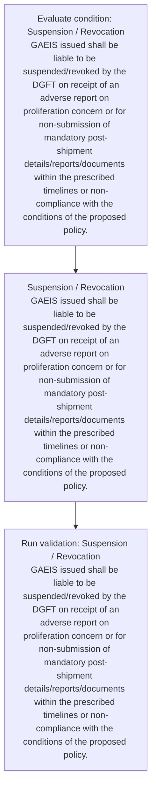
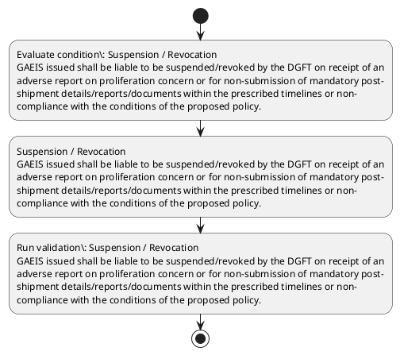

# Chapter 10 / Section 6: Suspension / Revocation

**Chapter Title:** SCOMET: Special Chemicals, Organisms, Materials, Equipment and Technologies

**Pages:** 35

**Purpose:** Suspension / Revocation
GAEIS issued shall be liable to be suspended/revoked by the DGFT on receipt of an
adverse report on proliferation concern or for non-submission of mandatory post-
shipment details/reports/documents within the prescribed timelines or non-
compliance with the conditions of the proposed policy.

**Purpose Thanglish:** Indha Suspension / Revocation section-la, Suspension / Revocation
GAEIS issued kandippa be liable to be suspended/revoked by the DGFT on receipt of an
adverse report on proliferation concern or for non-submission of mandatory post-
shipment details/reports/documents within the prescribed timelines or non-
compliance with the conditions of the proposed policy.

**Summary:** 6. Suspension / Revocation
GAEIS issued shall be liable to be suspended/revoked by the DGFT on receipt of an
adverse report on proliferation concern or for non-submission of mandatory post-
shipment details/reports/documents within the prescribed timelines or non-
compliance with the conditions of the proposed policy.

**Business Meaning:** Suspension / Revocation governs how DGFT business controls should be applied, validated, and enforced.

**Business Explanation:** Suspension / Revocation explains the operating rule set that DEKAI should enforce. Key control points include Suspension / Revocation
GAEIS issued shall be liable to be suspended/revoked by the DGFT on receipt of an
adverse report on proliferation concern or for non-submission of mandatory post-
shipment details/reports/documents within the prescribed timelines or non-
compliance with the conditions of the proposed policy. The section also drives actions such as Suspension / Revocation
GAEIS issued shall be liable to be suspended/revoked by the DGFT on receipt of an
adverse report on proliferation concern or for non-submission of mandatory post-
shipment details/reports/documents within the prescribed timelines or non-
compliance with the conditions of the proposed policy..

**Business Explanation Thanglish:** Indha Suspension / Revocation section-la, Suspension / Revocation explains the operating rule set that DEKAI should enforce. Key control points include Suspension / Revocation
GAEIS issued kandippa be liable to be suspended/revoked by the DGFT on receipt of an
adverse report on proliferation concern or for non-submission of mandatory post-
shipment details/reports/documents within the prescribed timelines or non-
compliance with the conditions of the proposed policy. The section also drives actions such as Suspension / Revocation
GAEIS issued kandippa be liable to be suspended/revoked by the DGFT on receipt of an
adverse report on proliferation concern or for non-submission of mandatory post-
shipment details/reports/documents within the prescribed timelines or non-
compliance with the conditions of the proposed policy..

## Business Logic
- Suspension / Revocation
GAEIS issued shall be liable to be suspended/revoked by the DGFT on receipt of an
adverse report on proliferation concern or for non-submission of mandatory post-
shipment details/reports/documents within the prescribed timelines or non-
compliance with the conditions of the proposed policy.

## Business Rules
- rule_id=CH10-SEC6-R001, rule_description=Suspension / Revocation
GAEIS issued shall be liable to be suspended/revoked by the DGFT on receipt of an
adverse report on proliferation concern or for non-submission of mandatory post-
shipment details/reports/documents within the prescribed timelines or non-
compliance with the conditions of the proposed policy., trigger=Suspension / Revocation, condition=Suspension / Revocation
GAEIS issued shall be liable to be suspended/revoked by the DGFT on receipt of an
adverse report on proliferation concern or for non-submission of mandatory post-
shipment details/reports/documents within the prescribed timelines or non-
compliance with the conditions of the proposed policy., validation=Suspension / Revocation
GAEIS issued shall be liable to be suspended/revoked by the DGFT on receipt of an
adverse report on proliferation concern or for non-submission of mandatory post-
shipment details/reports/documents within the prescribed timelines or non-
compliance with the conditions of the proposed policy., action=Suspension / Revocation
GAEIS issued shall be liable to be suspended/revoked by the DGFT on receipt of an
adverse report on proliferation concern or for non-submission of mandatory post-
shipment details/reports/documents within the prescribed timelines or non-
compliance with the conditions of the proposed policy., exception=No explicit exception found in uploaded documents., output=DEKAI should produce a compliance decision for 6 - Suspension / Revocation.

## Conditions
- Suspension / Revocation
GAEIS issued shall be liable to be suspended/revoked by the DGFT on receipt of an
adverse report on proliferation concern or for non-submission of mandatory post-
shipment details/reports/documents within the prescribed timelines or non-
compliance with the conditions of the proposed policy.

## Condition Logic
- id=10.6.1, if=Suspension / Revocation
GAEIS issued shall be liable to be suspended/revoked by the DGFT on receipt of an
adverse report on proliferation concern or for non-submission of mandatory post-
shipment details/reports/documents within the prescribed timelines or non-
compliance with the conditions of the proposed policy., then=Suspension / Revocation
GAEIS issued shall be liable to be suspended/revoked by the DGFT on receipt of an
adverse report on proliferation concern or for non-submission of mandatory post-
shipment details/reports/documents within the prescribed timelines or non-
compliance with the conditions of the proposed policy., source=Suspension / Revocation
GAEIS issued shall be liable to be suspended/revoked by the DGFT on receipt of an
adverse report on proliferation concern or for non-submission of mandatory post-
shipment details/reports/documents within the prescribed timelines or non-
compliance with the conditions of the proposed policy.

## Validations
- Suspension / Revocation
GAEIS issued shall be liable to be suspended/revoked by the DGFT on receipt of an
adverse report on proliferation concern or for non-submission of mandatory post-
shipment details/reports/documents within the prescribed timelines or non-
compliance with the conditions of the proposed policy.

## Exceptions
- None identified

## Dependencies
- None identified

## Authorities
- DGFT
- GAEIS issued shall be liable to be suspended/revoked by the DGFT

## Required Documents
- Suspension / Revocation
GAEIS issued shall be liable to be suspended/revoked by the DGFT on receipt of an
adverse report on proliferation concern or for non-submission of mandatory post-
shipment details/reports/documents within the prescribed timelines or non-
compliance with the conditions of the proposed policy.

## Timelines
- Suspension / Revocation
GAEIS issued shall be liable to be suspended/revoked by the DGFT on receipt of an
adverse report on proliferation concern or for non-submission of mandatory post-
shipment details/reports/documents within the prescribed timelines or non-
compliance with the conditions of the proposed policy.

## Actions
- Suspension / Revocation
GAEIS issued shall be liable to be suspended/revoked by the DGFT on receipt of an
adverse report on proliferation concern or for non-submission of mandatory post-
shipment details/reports/documents within the prescribed timelines or non-
compliance with the conditions of the proposed policy.

## Workflow
- Evaluate condition: Suspension / Revocation
GAEIS issued shall be liable to be suspended/revoked by the DGFT on receipt of an
adverse report on proliferation concern or for non-submission of mandatory post-
shipment details/reports/documents within the prescribed timelines or non-
compliance with the conditions of the proposed policy.
- Suspension / Revocation
GAEIS issued shall be liable to be suspended/revoked by the DGFT on receipt of an
adverse report on proliferation concern or for non-submission of mandatory post-
shipment details/reports/documents within the prescribed timelines or non-
compliance with the conditions of the proposed policy.
- Run validation: Suspension / Revocation
GAEIS issued shall be liable to be suspended/revoked by the DGFT on receipt of an
adverse report on proliferation concern or for non-submission of mandatory post-
shipment details/reports/documents within the prescribed timelines or non-
compliance with the conditions of the proposed policy.

## Workflow ASCII
```text
Suspension / Revocation
Evaluate condition: Suspension / Revocation
GAEIS issued shall be liable to be suspended/revoked by the DGFT on receipt of an
adverse report on proliferation concern or for non-submission of mandatory post-
shipment details/reports/documents within the prescribed timelines or non-
compliance with the conditions of the proposed policy.
   |
   v
Suspension / Revocation
GAEIS issued shall be liable to be suspended/revoked by the DGFT on receipt of an
adverse report on proliferation concern or for non-submission of mandatory post-
shipment details/reports/documents within the prescribed timelines or non-
compliance with the conditions of the proposed policy.
   |
   v
Run validation: Suspension / Revocation
GAEIS issued shall be liable to be suspended/revoked by the DGFT on receipt of an
adverse report on proliferation concern or for non-submission of mandatory post-
shipment details/reports/documents within the prescribed timelines or non-
compliance with the conditions of the proposed policy.
```

## Decision Tree
- IF Suspension / Revocation
GAEIS issued shall be liable to be suspended/revoked by the DGFT on receipt of an
adverse report on proliferation concern or for non-submission of mandatory post-
shipment details/reports/documents within the prescribed timelines or non-
compliance with the conditions of the proposed policy. THEN Suspension / Revocation
GAEIS issued shall be liable to be suspended/revoked by the DGFT on receipt of an
adverse report on proliferation concern or for non-submission of mandatory post-
shipment details/reports/documents within the prescribed timelines or non-
compliance with the conditions of the proposed policy.

## Decision Tree ASCII
```text
Suspension / Revocation Decision
IF Suspension / Revocation
GAEIS issued shall be liable to be suspended/revoked by the DGFT on receipt of an
adverse report on proliferation concern or for non-submission of mandatory post-
shipment details/reports/documents within the prescribed timelines or non-
compliance with the conditions of the proposed policy. THEN Suspension / Revocation
GAEIS issued shall be liable to be suspended/revoked by the DGFT on receipt of an
adverse report on proliferation concern or for non-submission of mandatory post-
shipment details/reports/documents within the prescribed timelines or non-
compliance with the conditions of the proposed policy.
```

## Examples
- User asks to process Suspension / Revocation; the platform checks conditions, validations, and documents before action.

**Real-world Example:** Example: an importer or exporter invokes Suspension / Revocation, submits Suspension / Revocation
GAEIS issued shall be liable to be suspended/revoked by the DGFT on receipt of an
adverse report on proliferation concern or for non-submission of mandatory post-
shipment details/reports/documents within the prescribed timelines or non-
compliance with the conditions of the proposed policy., and DEKAI uses the extracted rules to suspension / revocation
gaeis issued shall be liable to be suspended/revoked by the dgft on receipt of an
adverse report on proliferation concern or for non-submission of mandatory post-
shipment details/reports/documents within the prescribed timelines or non-
compliance with the conditions of the proposed policy..

**Real-world Example Thanglish:** Indha Suspension / Revocation section-la, Example: an importer or exporter invokes Suspension / Revocation, submits Suspension / Revocation
GAEIS issued kandippa be liable to be suspended/revoked by the DGFT on receipt of an
adverse report on proliferation concern or for non-submission of mandatory post-
shipment details/reports/documents within the prescribed timelines or non-
compliance with the conditions of the proposed policy., and DEKAI uses the extracted rules to suspension / revocation
gaeis issued kandippa be liable to be suspended/revoked by the dgft on receipt of an
adverse report on proliferation concern or for non-submission of mandatory post-
shipment details/reports/documents within the prescribed timelines or non-
compliance with the conditions of the proposed policy..

## AI Rules
- IF detected context matches section rule THEN enforce: Suspension / Revocation
GAEIS issued shall be liable to be suspended/revoked by the DGFT on receipt of an
adverse report on proliferation concern or for non-submission of mandatory post-
shipment details/reports/documents within the prescribed timelines or non-
compliance with the conditions of the proposed policy.
- IF validations pass THEN recommend action: Suspension / Revocation
GAEIS issued shall be liable to be suspended/revoked by the DGFT on receipt of an
adverse report on proliferation concern or for non-submission of mandatory post-
shipment details/reports/documents within the prescribed timelines or non-
compliance with the conditions of the proposed policy.

## Database Fields
- name=section_code, type=string, required=True, source=parsed_section_heading
- name=section_title, type=string, required=True, source=parsed_section_heading
- name=the_flag, type=boolean, required=False, source=keyword:the
- name=for_flag, type=boolean, required=False, source=keyword:for
- name=non_flag, type=boolean, required=False, source=keyword:non
- name=dgft_flag, type=boolean, required=False, source=keyword:DGFT
- name=post_flag, type=boolean, required=False, source=keyword:post
- name=with_flag, type=boolean, required=False, source=keyword:with
- name=gaeis_flag, type=boolean, required=False, source=keyword:GAEIS
- name=shall_flag, type=boolean, required=False, source=keyword:shall
- name=document_1_submitted, type=boolean, required=True, source=Suspension / Revocation
GAEIS issued shall be liable to be suspended/revoked by the DGFT on receipt of an
adverse report on proliferation concern or for non-submission of mandatory post-
shipment details/reports/documents within the prescribed timelines or non-
compliance with the conditions of the proposed policy.

## API Requirements
- method=GET, path=/api/dgft/sections/6, purpose=Retrieve knowledge payload for section 6, query_params=['include=workflow,decision_tree,validations'], response_fields=['section', 'title', 'summary', 'conditions', 'validations', 'exceptions', 'workflow', 'decision_tree']
- method=POST, path=/api/dgft/Suspension-Revocation/validate, purpose=Validate inputs and documents for Suspension / Revocation, request_fields=['section_code', 'section_title', 'document_1_submitted'], response_fields=['status', 'errors', 'warnings', 'next_actions']
- method=POST, path=/api/dgft/Suspension-Revocation/execute, purpose=Trigger business action for Suspension / Revocation
GAEIS issued shall be liable to be suspended/revoked by the DGFT on receipt of an
adverse report on proliferation concern or for non-submission of mandatory post-
shipment details/reports/documents within the prescribed timelines or non-
compliance with the conditions of the proposed policy., request_fields=['section_code', 'section_title', 'document_1_submitted'], response_fields=['reference_id', 'status', 'authority', 'timeline']

## UI Screens
- screen_id=Suspension_Revocation_overview, name=Suspension / Revocation Overview, purpose=Show section summary, authority, timeline, and eligibility cues., widgets=['summary_card', 'conditions_table', 'authority_badges', 'timeline_panel']
- screen_id=Suspension_Revocation_submission, name=Suspension / Revocation Submission, purpose=Capture applicant data and supporting documents., widgets=['dynamic_form', 'document_uploader', 'validation_panel', 'next_action_footer'], fields=['section_code', 'section_title', 'the_flag', 'for_flag', 'non_flag', 'dgft_flag', 'post_flag', 'with_flag']

## Error Messages
- Validation failed because the section requirements were not fully met.

## FAQ
- question_en=What is the purpose of section 6?, answer_en=Suspension / Revocation explains the operating rule set that DEKAI should enforce. Key control points include Suspension / Revocation
GAEIS issued shall be liable to be suspended/revoked by the DGFT on receipt of an
adverse report on proliferation concern or for non-submission of mandatory post-
shipment details/reports/documents within the prescribed timelines or non-
compliance with the conditions of the proposed policy. The section also drives actions such as Suspension / Revocation
GAEIS issued shall be liable to be suspended/revoked by the DGFT on receipt of an
adverse report on proliferation concern or for non-submission of mandatory post-
shipment details/reports/documents within the prescribed timelines or non-
compliance with the conditions of the proposed policy.., question_thanglish=Indha Suspension / Revocation section-la, What is the purpose of section 6?, answer_thanglish=Indha Suspension / Revocation section-la, Suspension / Revocation explains the operating rule set that DEKAI should enforce. Key control points include Suspension / Revocation
GAEIS issued kandippa be liable to be suspended/revoked by the DGFT on receipt of an
adverse report on proliferation concern or for non-submission of mandatory post-
shipment details/reports/documents within the prescribed timelines or non-
compliance with the conditions of the proposed policy. The section also drives actions such as Suspension / Revocation
GAEIS issued kandippa be liable to be suspended/revoked by the DGFT on receipt of an
adverse report on proliferation concern or for non-submission of mandatory post-
shipment details/reports/documents within the prescribed timelines or non-
compliance with the conditions of the proposed policy..
- question_en=What documents are required under Suspension / Revocation?, answer_en=Suspension / Revocation
GAEIS issued shall be liable to be suspended/revoked by the DGFT on receipt of an
adverse report on proliferation concern or for non-submission of mandatory post-
shipment details/reports/documents within the prescribed timelines or non-
compliance with the conditions of the proposed policy., question_thanglish=Indha Suspension / Revocation section-la, What documents are required under Suspension / Revocation?, answer_thanglish=Indha Suspension / Revocation section-la, Suspension / Revocation
GAEIS issued kandippa be liable to be suspended/revoked by the DGFT on receipt of an
adverse report on proliferation concern or for non-submission of mandatory post-
shipment details/reports/documents within the prescribed timelines or non-
compliance with the conditions of the proposed policy.
- question_en=Which authority handles Suspension / Revocation?, answer_en=DGFT, GAEIS issued shall be liable to be suspended/revoked by the DGFT, question_thanglish=Indha Suspension / Revocation section-la, Which authority handles Suspension / Revocation?, answer_thanglish=Indha Suspension / Revocation section-la, DGFT, GAEIS issued kandippa be liable to be suspended/revoked by the DGFT

## Questions Users May Ask
- What does Suspension / Revocation require?
- Which documents are needed for Suspension / Revocation?
- How does DEKAI validate Suspension / Revocation requests?
- What action should be taken for Suspension / Revocation?

## Expected AI Answers
- Suspension / Revocation requires the platform to interpret the section text, apply the extracted business rules, and present the correct next action.
- Required documents are inferred from the section text: Suspension / Revocation
GAEIS issued shall be liable to be suspended/revoked by the DGFT on receipt of an
adverse report on proliferation concern or for non-submission of mandatory post-
shipment details/reports/documents within the prescribed timelines or non-
compliance with the conditions of the proposed policy.
- DEKAI validates Suspension / Revocation by checking conditions, required documents, authority references, and exception clauses before recommending an outcome.
- The primary extracted action is: Suspension / Revocation
GAEIS issued shall be liable to be suspended/revoked by the DGFT on receipt of an
adverse report on proliferation concern or for non-submission of mandatory post-
shipment details/reports/documents within the prescribed timelines or non-
compliance with the conditions of the proposed policy.

## AI Q&A Examples
- question_en=User asks: How do I comply with Suspension / Revocation?, answer_en=AI answers: DEKAI should evaluate section 6, apply the extracted rules, and guide the user through Evaluate condition: Suspension / Revocation
GAEIS issued shall be liable to be suspended/revoked by the DGFT on receipt of an
adverse report on proliferation concern or for non-submission of mandatory post-
shipment details/reports/documents within the prescribed timelines or non-
compliance with the conditions of the proposed policy.., question_thanglish=Indha Suspension / Revocation section-la, User asks: How do I comply with Suspension / Revocation?, answer_thanglish=Indha Suspension / Revocation section-la, AI answers: DEKAI should evaluate section 6, apply the extracted rules, and guide the user through Evaluate condition: Suspension / Revocation
GAEIS issued kandippa be liable to be suspended/revoked by the DGFT on receipt of an
adverse report on proliferation concern or for non-submission of mandatory post-
shipment details/reports/documents within the prescribed timelines or non-
compliance with the conditions of the proposed policy..
- question_en=User asks: Which validations apply to Suspension / Revocation?, answer_en=AI answers: Applicable validations are Suspension / Revocation
GAEIS issued shall be liable to be suspended/revoked by the DGFT on receipt of an
adverse report on proliferation concern or for non-submission of mandatory post-
shipment details/reports/documents within the prescribed timelines or non-
compliance with the conditions of the proposed policy., question_thanglish=Indha Suspension / Revocation section-la, User asks: Which validations apply to Suspension / Revocation?, answer_thanglish=Indha Suspension / Revocation section-la, AI answers: Applicable validations are Suspension / Revocation
GAEIS issued kandippa be liable to be suspended/revoked by the DGFT on receipt of an
adverse report on proliferation concern or for non-submission of mandatory post-
shipment details/reports/documents within the prescribed timelines or non-
compliance with the conditions of the proposed policy.

## DEKAI AI Implementation Notes
- Capture chapter 10, section 6, title, and page references as immutable knowledge metadata.
- Bind validations for Suspension / Revocation into a rule engine keyed by the rule IDs extracted for this section.
- Expose document upload controls for: Suspension / Revocation
GAEIS issued shall be liable to be suspended/revoked by the DGFT on receipt of an
adverse report on proliferation concern or for non-submission of mandatory post-
shipment details/reports/documents within the prescribed timelines or non-
compliance with the conditions of the proposed policy..
- Route escalations or approvals to: DGFT, GAEIS issued shall be liable to be suspended/revoked by the DGFT.

## DEKAI AI Implementation Notes Thanglish
- Indha Suspension / Revocation section-la, Capture chapter 10, section 6, title, and page references as immutable knowledge metadata.
- Indha Suspension / Revocation section-la, Bind validations for Suspension / Revocation into a rule engine keyed by the rule IDs extracted for this section.
- Indha Suspension / Revocation section-la, Expose document upload controls for: Suspension / Revocation
GAEIS issued kandippa be liable to be suspended/revoked by the DGFT on receipt of an
adverse report on proliferation concern or for non-submission of mandatory post-
shipment details/reports/documents within the prescribed timelines or non-
compliance with the conditions of the proposed policy..
- Indha Suspension / Revocation section-la, Route escalations or approvals to: DGFT, GAEIS issued kandippa be liable to be suspended/revoked by the DGFT.

## AI Metadata
- Keywords: the, for, non, DGFT, post, with, GAEIS, shall, issued, liable, report, within, policy, receipt, adverse, concern, shipment, proposed, mandatory, timelines
- Search Keywords: the, for, non, DGFT, post, with, GAEIS, shall, issued, liable, report, within, policy, receipt, adverse, concern, shipment, proposed, mandatory, timelines
- Intent: Support Suspension / Revocation processing and compliance validation.
- Tags: 6, Suspension / Revocation, business-rule, document-driven, dgft
- Related Sections: 
- Related Chapters: 
- Related Rules: Suspension / Revocation
GAEIS issued shall be liable to be suspended/revoked by the DGFT on receipt of an
adverse report on proliferation concern or for non-submission of mandatory post-
shipment details/reports/documents within the prescribed timelines or non-
compliance with the conditions of the proposed policy.

## Mermaid


## PlantUML

