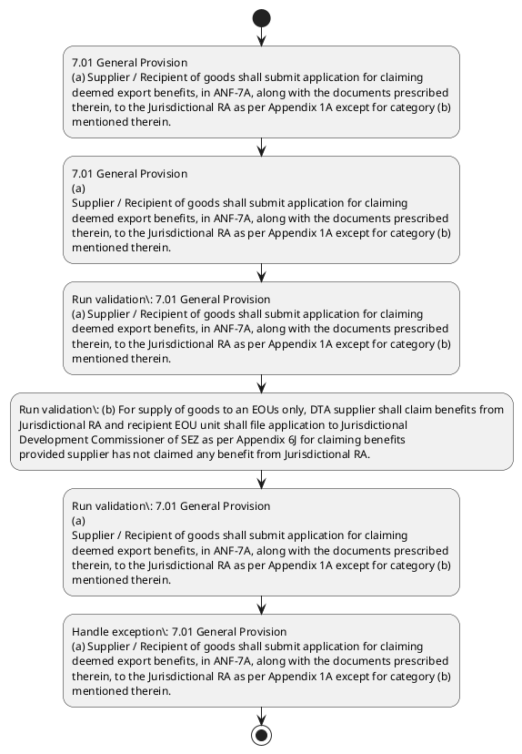

# Chapter 7 / Section 7.01: General Provision

**Chapter Title:** Deemed Exports

**Pages:** 2

**Purpose:** 7.01 General Provision
(a) Supplier / Recipient of goods shall submit application for claiming
deemed export benefits, in ANF-7A, along with the documents prescribed
therein, to the Jurisdictional RA as per Appendix 1A except for category (b)
mentioned therein.

**Purpose Thanglish:** Indha General Provision section-la, 7.01 General Provision
(a) Supplier / Recipient of goods kandippa submit application for claiming
deemed export benefits, in ANF-7A, along with the documents prescribed
therein, to the Jurisdictional RA as per Appendix 1A except for category (b)
mentioned therein.

**Summary:** 7.01 General Provision
(a) Supplier / Recipient of goods shall submit application for claiming
deemed export benefits, in ANF-7A, along with the documents prescribed
therein, to the Jurisdictional RA as per Appendix 1A except for category (b)
mentioned therein. (b) For supply of goods to an EOUs only, DTA supplier shall claim benefits from
Jurisdictional RA and recipient EOU unit shall file application to Jurisdictional
Development Commissioner of SEZ as per Appendix 6J for claiming benefits
provided supplier has not claimed any benefit from Jurisdictional RA. 7.01 General Provision
(a)
Supplier / Recipient of goods shall submit application for claiming
deemed export benefits, in ANF-7A, along with the documents prescribed
therein, to the Jurisdictional RA as per Appendix 1A except for category (b)
mentioned therein.

**Business Meaning:** General Provision governs how DGFT business controls should be applied, validated, and enforced.

**Business Explanation:** General Provision explains the operating rule set that DEKAI should enforce. Key control points include 7.01 General Provision
(a) Supplier / Recipient of goods shall submit application for claiming
deemed export benefits, in ANF-7A, along with the documents prescribed
therein, to the Jurisdictional RA as per Appendix 1A except for category (b)
mentioned therein. The section also drives actions such as 7.01 General Provision
(a) Supplier / Recipient of goods shall submit application for claiming
deemed export benefits, in ANF-7A, along with the documents prescribed
therein, to the Jurisdictional RA as per Appendix 1A except for category (b)
mentioned therein..

**Business Explanation Thanglish:** Indha General Provision section-la, General Provision explains the operating rule set that DEKAI should enforce. Key control points include 7.01 General Provision
(a) Supplier / Recipient of goods kandippa submit application for claiming
deemed export benefits, in ANF-7A, along with the documents prescribed
therein, to the Jurisdictional RA as per Appendix 1A except for category (b)
mentioned therein. The section also drives actions such as 7.01 General Provision
(a) Supplier / Recipient of goods kandippa submit application for claiming
deemed export benefits, in ANF-7A, along with the documents prescribed
therein, to the Jurisdictional RA as per Appendix 1A except for category (b)
mentioned therein..

## Business Logic
- 7.01 General Provision
(a) Supplier / Recipient of goods shall submit application for claiming
deemed export benefits, in ANF-7A, along with the documents prescribed
therein, to the Jurisdictional RA as per Appendix 1A except for category (b)
mentioned therein.
- (b) For supply of goods to an EOUs only, DTA supplier shall claim benefits from
Jurisdictional RA and recipient EOU unit shall file application to Jurisdictional
Development Commissioner of SEZ as per Appendix 6J for claiming benefits
provided supplier has not claimed any benefit from Jurisdictional RA.
- 7.01 General Provision
(a)
Supplier / Recipient of goods shall submit application for claiming
deemed export benefits, in ANF-7A, along with the documents prescribed
therein, to the Jurisdictional RA as per Appendix 1A except for category (b)
mentioned therein.
- (b)
For supply of goods to an EOUs only, DTA supplier shall claim benefits from
Jurisdictional RA and recipient EOU unit shall file application to Jurisdictional
Development Commissioner of SEZ as per Appendix 6J for claiming benefits
provided supplier has not claimed any benefit from Jurisdictional RA.

## Business Rules
- rule_id=CH7-SEC7_01-R001, rule_description=7.01 General Provision
(a) Supplier / Recipient of goods shall submit application for claiming
deemed export benefits, in ANF-7A, along with the documents prescribed
therein, to the Jurisdictional RA as per Appendix 1A except for category (b)
mentioned therein., trigger=General Provision, condition=Section 7.01 is applicable, validation=7.01 General Provision
(a) Supplier / Recipient of goods shall submit application for claiming
deemed export benefits, in ANF-7A, along with the documents prescribed
therein, to the Jurisdictional RA as per Appendix 1A except for category (b)
mentioned therein., action=7.01 General Provision
(a) Supplier / Recipient of goods shall submit application for claiming
deemed export benefits, in ANF-7A, along with the documents prescribed
therein, to the Jurisdictional RA as per Appendix 1A except for category (b)
mentioned therein., exception=7.01 General Provision
(a) Supplier / Recipient of goods shall submit application for claiming
deemed export benefits, in ANF-7A, along with the documents prescribed
therein, to the Jurisdictional RA as per Appendix 1A except for category (b)
mentioned therein., output=DEKAI should produce a compliance decision for 7.01 - General Provision.
- rule_id=CH7-SEC7_01-R002, rule_description=(b) For supply of goods to an EOUs only, DTA supplier shall claim benefits from
Jurisdictional RA and recipient EOU unit shall file application to Jurisdictional
Development Commissioner of SEZ as per Appendix 6J for claiming benefits
provided supplier has not claimed any benefit from Jurisdictional RA., trigger=General Provision, condition=Section 7.01 is applicable, validation=(b) For supply of goods to an EOUs only, DTA supplier shall claim benefits from
Jurisdictional RA and recipient EOU unit shall file application to Jurisdictional
Development Commissioner of SEZ as per Appendix 6J for claiming benefits
provided supplier has not claimed any benefit from Jurisdictional RA., action=7.01 General Provision
(a)
Supplier / Recipient of goods shall submit application for claiming
deemed export benefits, in ANF-7A, along with the documents prescribed
therein, to the Jurisdictional RA as per Appendix 1A except for category (b)
mentioned therein., exception=7.01 General Provision
(a)
Supplier / Recipient of goods shall submit application for claiming
deemed export benefits, in ANF-7A, along with the documents prescribed
therein, to the Jurisdictional RA as per Appendix 1A except for category (b)
mentioned therein., output=DEKAI should produce a compliance decision for 7.01 - General Provision.
- rule_id=CH7-SEC7_01-R003, rule_description=7.01 General Provision
(a)
Supplier / Recipient of goods shall submit application for claiming
deemed export benefits, in ANF-7A, along with the documents prescribed
therein, to the Jurisdictional RA as per Appendix 1A except for category (b)
mentioned therein., trigger=General Provision, condition=Section 7.01 is applicable, validation=7.01 General Provision
(a)
Supplier / Recipient of goods shall submit application for claiming
deemed export benefits, in ANF-7A, along with the documents prescribed
therein, to the Jurisdictional RA as per Appendix 1A except for category (b)
mentioned therein., action=7.01 General Provision
(a)
Supplier / Recipient of goods shall submit application for claiming
deemed export benefits, in ANF-7A, along with the documents prescribed
therein, to the Jurisdictional RA as per Appendix 1A except for category (b)
mentioned therein., exception=7.01 General Provision
(a)
Supplier / Recipient of goods shall submit application for claiming
deemed export benefits, in ANF-7A, along with the documents prescribed
therein, to the Jurisdictional RA as per Appendix 1A except for category (b)
mentioned therein., output=DEKAI should produce a compliance decision for 7.01 - General Provision.
- rule_id=CH7-SEC7_01-R004, rule_description=(b)
For supply of goods to an EOUs only, DTA supplier shall claim benefits from
Jurisdictional RA and recipient EOU unit shall file application to Jurisdictional
Development Commissioner of SEZ as per Appendix 6J for claiming benefits
provided supplier has not claimed any benefit from Jurisdictional RA., trigger=General Provision, condition=Section 7.01 is applicable, validation=(b)
For supply of goods to an EOUs only, DTA supplier shall claim benefits from
Jurisdictional RA and recipient EOU unit shall file application to Jurisdictional
Development Commissioner of SEZ as per Appendix 6J for claiming benefits
provided supplier has not claimed any benefit from Jurisdictional RA., action=7.01 General Provision
(a)
Supplier / Recipient of goods shall submit application for claiming
deemed export benefits, in ANF-7A, along with the documents prescribed
therein, to the Jurisdictional RA as per Appendix 1A except for category (b)
mentioned therein., exception=7.01 General Provision
(a)
Supplier / Recipient of goods shall submit application for claiming
deemed export benefits, in ANF-7A, along with the documents prescribed
therein, to the Jurisdictional RA as per Appendix 1A except for category (b)
mentioned therein., output=DEKAI should produce a compliance decision for 7.01 - General Provision.

## Conditions
- None identified

## Condition Logic
- id=7.7.01.1, if=Section 7.01 is applicable, then=7.01 General Provision
(a) Supplier / Recipient of goods shall submit application for claiming
deemed export benefits, in ANF-7A, along with the documents prescribed
therein, to the Jurisdictional RA as per Appendix 1A except for category (b)
mentioned therein., source=Derived from uploaded documents

## Validations
- 7.01 General Provision
(a) Supplier / Recipient of goods shall submit application for claiming
deemed export benefits, in ANF-7A, along with the documents prescribed
therein, to the Jurisdictional RA as per Appendix 1A except for category (b)
mentioned therein.
- (b) For supply of goods to an EOUs only, DTA supplier shall claim benefits from
Jurisdictional RA and recipient EOU unit shall file application to Jurisdictional
Development Commissioner of SEZ as per Appendix 6J for claiming benefits
provided supplier has not claimed any benefit from Jurisdictional RA.
- 7.01 General Provision
(a)
Supplier / Recipient of goods shall submit application for claiming
deemed export benefits, in ANF-7A, along with the documents prescribed
therein, to the Jurisdictional RA as per Appendix 1A except for category (b)
mentioned therein.
- (b)
For supply of goods to an EOUs only, DTA supplier shall claim benefits from
Jurisdictional RA and recipient EOU unit shall file application to Jurisdictional
Development Commissioner of SEZ as per Appendix 6J for claiming benefits
provided supplier has not claimed any benefit from Jurisdictional RA.

## Exceptions
- 7.01 General Provision
(a) Supplier / Recipient of goods shall submit application for claiming
deemed export benefits, in ANF-7A, along with the documents prescribed
therein, to the Jurisdictional RA as per Appendix 1A except for category (b)
mentioned therein.
- 7.01 General Provision
(a)
Supplier / Recipient of goods shall submit application for claiming
deemed export benefits, in ANF-7A, along with the documents prescribed
therein, to the Jurisdictional RA as per Appendix 1A except for category (b)
mentioned therein.

## Dependencies
- None identified

## Authorities
- RA
- Jurisdictional RA
- Development Commissioner

## Required Documents
- 7.01 General Provision
(a) Supplier / Recipient of goods shall submit application for claiming
deemed export benefits, in ANF-7A, along with the documents prescribed
therein, to the Jurisdictional RA as per Appendix 1A except for category (b)
mentioned therein.
- (b) For supply of goods to an EOUs only, DTA supplier shall claim benefits from
Jurisdictional RA and recipient EOU unit shall file application to Jurisdictional
Development Commissioner of SEZ as per Appendix 6J for claiming benefits
provided supplier has not claimed any benefit from Jurisdictional RA.
- 7.01 General Provision
(a)
Supplier / Recipient of goods shall submit application for claiming
deemed export benefits, in ANF-7A, along with the documents prescribed
therein, to the Jurisdictional RA as per Appendix 1A except for category (b)
mentioned therein.
- (b)
For supply of goods to an EOUs only, DTA supplier shall claim benefits from
Jurisdictional RA and recipient EOU unit shall file application to Jurisdictional
Development Commissioner of SEZ as per Appendix 6J for claiming benefits
provided supplier has not claimed any benefit from Jurisdictional RA.

## Timelines
- None identified

## Actions
- 7.01 General Provision
(a) Supplier / Recipient of goods shall submit application for claiming
deemed export benefits, in ANF-7A, along with the documents prescribed
therein, to the Jurisdictional RA as per Appendix 1A except for category (b)
mentioned therein.
- 7.01 General Provision
(a)
Supplier / Recipient of goods shall submit application for claiming
deemed export benefits, in ANF-7A, along with the documents prescribed
therein, to the Jurisdictional RA as per Appendix 1A except for category (b)
mentioned therein.

## Workflow
- 7.01 General Provision
(a) Supplier / Recipient of goods shall submit application for claiming
deemed export benefits, in ANF-7A, along with the documents prescribed
therein, to the Jurisdictional RA as per Appendix 1A except for category (b)
mentioned therein.
- 7.01 General Provision
(a)
Supplier / Recipient of goods shall submit application for claiming
deemed export benefits, in ANF-7A, along with the documents prescribed
therein, to the Jurisdictional RA as per Appendix 1A except for category (b)
mentioned therein.
- Run validation: 7.01 General Provision
(a) Supplier / Recipient of goods shall submit application for claiming
deemed export benefits, in ANF-7A, along with the documents prescribed
therein, to the Jurisdictional RA as per Appendix 1A except for category (b)
mentioned therein.
- Run validation: (b) For supply of goods to an EOUs only, DTA supplier shall claim benefits from
Jurisdictional RA and recipient EOU unit shall file application to Jurisdictional
Development Commissioner of SEZ as per Appendix 6J for claiming benefits
provided supplier has not claimed any benefit from Jurisdictional RA.
- Run validation: 7.01 General Provision
(a)
Supplier / Recipient of goods shall submit application for claiming
deemed export benefits, in ANF-7A, along with the documents prescribed
therein, to the Jurisdictional RA as per Appendix 1A except for category (b)
mentioned therein.
- Handle exception: 7.01 General Provision
(a) Supplier / Recipient of goods shall submit application for claiming
deemed export benefits, in ANF-7A, along with the documents prescribed
therein, to the Jurisdictional RA as per Appendix 1A except for category (b)
mentioned therein.

## Workflow ASCII
```text
General Provision
7.01 General Provision
(a) Supplier / Recipient of goods shall submit application for claiming
deemed export benefits, in ANF-7A, along with the documents prescribed
therein, to the Jurisdictional RA as per Appendix 1A except for category (b)
mentioned therein.
   |
   v
7.01 General Provision
(a)
Supplier / Recipient of goods shall submit application for claiming
deemed export benefits, in ANF-7A, along with the documents prescribed
therein, to the Jurisdictional RA as per Appendix 1A except for category (b)
mentioned therein.
   |
   v
Run validation: 7.01 General Provision
(a) Supplier / Recipient of goods shall submit application for claiming
deemed export benefits, in ANF-7A, along with the documents prescribed
therein, to the Jurisdictional RA as per Appendix 1A except for category (b)
mentioned therein.
   |
   v
Run validation: (b) For supply of goods to an EOUs only, DTA supplier shall claim benefits from
Jurisdictional RA and recipient EOU unit shall file application to Jurisdictional
Development Commissioner of SEZ as per Appendix 6J for claiming benefits
provided supplier has not claimed any benefit from Jurisdictional RA.
   |
   v
Run validation: 7.01 General Provision
(a)
Supplier / Recipient of goods shall submit application for claiming
deemed export benefits, in ANF-7A, along with the documents prescribed
therein, to the Jurisdictional RA as per Appendix 1A except for category (b)
mentioned therein.
   |
   v
Handle exception: 7.01 General Provision
(a) Supplier / Recipient of goods shall submit application for claiming
deemed export benefits, in ANF-7A, along with the documents prescribed
therein, to the Jurisdictional RA as per Appendix 1A except for category (b)
mentioned therein.
```

## Decision Tree
- IF exception applies (7.01 General Provision
(a) Supplier / Recipient of goods shall submit application for claiming
deemed export benefits, in ANF-7A, along with the documents prescribed
therein, to the Jurisdictional RA as per Appendix 1A except for category (b)
mentioned therein.) THEN route to manual review
- IF exception applies (7.01 General Provision
(a)
Supplier / Recipient of goods shall submit application for claiming
deemed export benefits, in ANF-7A, along with the documents prescribed
therein, to the Jurisdictional RA as per Appendix 1A except for category (b)
mentioned therein.) THEN route to manual review

## Decision Tree ASCII
```text
General Provision Decision
IF exception applies (7.01 General Provision
(a) Supplier / Recipient of goods shall submit application for claiming
deemed export benefits, in ANF-7A, along with the documents prescribed
therein, to the Jurisdictional RA as per Appendix 1A except for category (b)
mentioned therein.) THEN route to manual review
   |
   v
IF exception applies (7.01 General Provision
(a)
Supplier / Recipient of goods shall submit application for claiming
deemed export benefits, in ANF-7A, along with the documents prescribed
therein, to the Jurisdictional RA as per Appendix 1A except for category (b)
mentioned therein.) THEN route to manual review
```

## Examples
- User asks to process General Provision; the platform checks conditions, validations, and documents before action.

**Real-world Example:** Example: an importer or exporter invokes General Provision, submits 7.01 General Provision
(a) Supplier / Recipient of goods shall submit application for claiming
deemed export benefits, in ANF-7A, along with the documents prescribed
therein, to the Jurisdictional RA as per Appendix 1A except for category (b)
mentioned therein., (b) For supply of goods to an EOUs only, DTA supplier shall claim benefits from
Jurisdictional RA and recipient EOU unit shall file application to Jurisdictional
Development Commissioner of SEZ as per Appendix 6J for claiming benefits
provided supplier has not claimed any benefit from Jurisdictional RA., 7.01 General Provision
(a)
Supplier / Recipient of goods shall submit application for claiming
deemed export benefits, in ANF-7A, along with the documents prescribed
therein, to the Jurisdictional RA as per Appendix 1A except for category (b)
mentioned therein., and DEKAI uses the extracted rules to 7.01 general provision
(a) supplier / recipient of goods shall submit application for claiming
deemed export benefits, in anf-7a, along with the documents prescribed
therein, to the jurisdictional ra as per appendix 1a except for category (b)
mentioned therein..

**Real-world Example Thanglish:** Indha General Provision section-la, Example: an importer or exporter invokes General Provision, submits 7.01 General Provision
(a) Supplier / Recipient of goods kandippa submit application for claiming
deemed export benefits, in ANF-7A, along with the documents prescribed
therein, to the Jurisdictional RA as per Appendix 1A except for category (b)
mentioned therein., (b) For supply of goods to an EOUs only, DTA supplier kandippa claim benefits from
Jurisdictional RA and recipient EOU unit kandippa file application to Jurisdictional
Development Commissioner of SEZ as per Appendix 6J for claiming benefits
provided supplier has not claimed any benefit from Jurisdictional RA., 7.01 General Provision
(a)
Supplier / Recipient of goods kandippa submit application for claiming
deemed export benefits, in ANF-7A, along with the documents prescribed
therein, to the Jurisdictional RA as per Appendix 1A except for category (b)
mentioned therein., and DEKAI uses the extracted rules to 7.01 general provision
(a) supplier / recipient of goods kandippa submit application for claiming
deemed export benefits, in anf-7a, along with the documents prescribed
therein, to the jurisdictional ra as per appendix 1a except for category (b)
mentioned therein..

## AI Rules
- IF detected context matches section rule THEN enforce: 7.01 General Provision
(a) Supplier / Recipient of goods shall submit application for claiming
deemed export benefits, in ANF-7A, along with the documents prescribed
therein, to the Jurisdictional RA as per Appendix 1A except for category (b)
mentioned therein.
- IF detected context matches section rule THEN enforce: (b) For supply of goods to an EOUs only, DTA supplier shall claim benefits from
Jurisdictional RA and recipient EOU unit shall file application to Jurisdictional
Development Commissioner of SEZ as per Appendix 6J for claiming benefits
provided supplier has not claimed any benefit from Jurisdictional RA.
- IF detected context matches section rule THEN enforce: 7.01 General Provision
(a)
Supplier / Recipient of goods shall submit application for claiming
deemed export benefits, in ANF-7A, along with the documents prescribed
therein, to the Jurisdictional RA as per Appendix 1A except for category (b)
mentioned therein.
- IF detected context matches section rule THEN enforce: (b)
For supply of goods to an EOUs only, DTA supplier shall claim benefits from
Jurisdictional RA and recipient EOU unit shall file application to Jurisdictional
Development Commissioner of SEZ as per Appendix 6J for claiming benefits
provided supplier has not claimed any benefit from Jurisdictional RA.
- IF validations pass THEN recommend action: 7.01 General Provision
(a) Supplier / Recipient of goods shall submit application for claiming
deemed export benefits, in ANF-7A, along with the documents prescribed
therein, to the Jurisdictional RA as per Appendix 1A except for category (b)
mentioned therein.

## Database Fields
- name=section_code, type=string, required=True, source=parsed_section_heading
- name=section_title, type=string, required=True, source=parsed_section_heading
- name=for_flag, type=boolean, required=False, source=keyword:for
- name=the_flag, type=boolean, required=False, source=keyword:the
- name=per_flag, type=boolean, required=False, source=keyword:per
- name=dta_flag, type=boolean, required=False, source=keyword:DTA
- name=and_flag, type=boolean, required=False, source=keyword:and
- name=eou_flag, type=boolean, required=False, source=keyword:EOU
- name=sez_flag, type=boolean, required=False, source=keyword:SEZ
- name=has_flag, type=boolean, required=False, source=keyword:has
- name=document_1_submitted, type=boolean, required=True, source=7.01 General Provision
(a) Supplier / Recipient of goods shall submit application for claiming
deemed export benefits, in ANF-7A, along with the documents prescribed
therein, to the Jurisdictional RA as per Appendix 1A except for category (b)
mentioned therein.
- name=document_2_submitted, type=boolean, required=True, source=(b) For supply of goods to an EOUs only, DTA supplier shall claim benefits from
Jurisdictional RA and recipient EOU unit shall file application to Jurisdictional
Development Commissioner of SEZ as per Appendix 6J for claiming benefits
provided supplier has not claimed any benefit from Jurisdictional RA.
- name=document_3_submitted, type=boolean, required=True, source=7.01 General Provision
(a)
Supplier / Recipient of goods shall submit application for claiming
deemed export benefits, in ANF-7A, along with the documents prescribed
therein, to the Jurisdictional RA as per Appendix 1A except for category (b)
mentioned therein.
- name=document_4_submitted, type=boolean, required=True, source=(b)
For supply of goods to an EOUs only, DTA supplier shall claim benefits from
Jurisdictional RA and recipient EOU unit shall file application to Jurisdictional
Development Commissioner of SEZ as per Appendix 6J for claiming benefits
provided supplier has not claimed any benefit from Jurisdictional RA.

## API Requirements
- method=GET, path=/api/dgft/sections/7.01, purpose=Retrieve knowledge payload for section 7.01, query_params=['include=workflow,decision_tree,validations'], response_fields=['section', 'title', 'summary', 'conditions', 'validations', 'exceptions', 'workflow', 'decision_tree']
- method=POST, path=/api/dgft/General-Provision/validate, purpose=Validate inputs and documents for General Provision, request_fields=['section_code', 'section_title', 'document_1_submitted', 'document_2_submitted', 'document_3_submitted', 'document_4_submitted'], response_fields=['status', 'errors', 'warnings', 'next_actions']
- method=POST, path=/api/dgft/General-Provision/execute, purpose=Trigger business action for 7.01 General Provision
(a) Supplier / Recipient of goods shall submit application for claiming
deemed export benefits, in ANF-7A, along with the documents prescribed
therein, to the Jurisdictional RA as per Appendix 1A except for category (b)
mentioned therein., request_fields=['section_code', 'section_title', 'document_1_submitted', 'document_2_submitted', 'document_3_submitted', 'document_4_submitted'], response_fields=['reference_id', 'status', 'authority', 'timeline']

## UI Screens
- screen_id=General_Provision_overview, name=General Provision Overview, purpose=Show section summary, authority, timeline, and eligibility cues., widgets=['summary_card', 'conditions_table', 'authority_badges', 'timeline_panel']
- screen_id=General_Provision_submission, name=General Provision Submission, purpose=Capture applicant data and supporting documents., widgets=['dynamic_form', 'document_uploader', 'validation_panel', 'next_action_footer'], fields=['section_code', 'section_title', 'for_flag', 'the_flag', 'per_flag', 'dta_flag', 'and_flag', 'eou_flag']
- screen_id=General_Provision_exceptions, name=General Provision Exception Review, purpose=Explain exception handling and manual review triggers., widgets=['exception_banner', 'decision_tree', 'case_notes']

## Error Messages
- Validation failed because the section requirements were not fully met.

## FAQ
- question_en=What is the purpose of section 7.01?, answer_en=General Provision explains the operating rule set that DEKAI should enforce. Key control points include 7.01 General Provision
(a) Supplier / Recipient of goods shall submit application for claiming
deemed export benefits, in ANF-7A, along with the documents prescribed
therein, to the Jurisdictional RA as per Appendix 1A except for category (b)
mentioned therein. The section also drives actions such as 7.01 General Provision
(a) Supplier / Recipient of goods shall submit application for claiming
deemed export benefits, in ANF-7A, along with the documents prescribed
therein, to the Jurisdictional RA as per Appendix 1A except for category (b)
mentioned therein.., question_thanglish=Indha General Provision section-la, What is the purpose of section 7.01?, answer_thanglish=Indha General Provision section-la, General Provision explains the operating rule set that DEKAI should enforce. Key control points include 7.01 General Provision
(a) Supplier / Recipient of goods kandippa submit application for claiming
deemed export benefits, in ANF-7A, along with the documents prescribed
therein, to the Jurisdictional RA as per Appendix 1A except for category (b)
mentioned therein. The section also drives actions such as 7.01 General Provision
(a) Supplier / Recipient of goods kandippa submit application for claiming
deemed export benefits, in ANF-7A, along with the documents prescribed
therein, to the Jurisdictional RA as per Appendix 1A except for category (b)
mentioned therein..
- question_en=What documents are required under General Provision?, answer_en=7.01 General Provision
(a) Supplier / Recipient of goods shall submit application for claiming
deemed export benefits, in ANF-7A, along with the documents prescribed
therein, to the Jurisdictional RA as per Appendix 1A except for category (b)
mentioned therein., (b) For supply of goods to an EOUs only, DTA supplier shall claim benefits from
Jurisdictional RA and recipient EOU unit shall file application to Jurisdictional
Development Commissioner of SEZ as per Appendix 6J for claiming benefits
provided supplier has not claimed any benefit from Jurisdictional RA., 7.01 General Provision
(a)
Supplier / Recipient of goods shall submit application for claiming
deemed export benefits, in ANF-7A, along with the documents prescribed
therein, to the Jurisdictional RA as per Appendix 1A except for category (b)
mentioned therein., (b)
For supply of goods to an EOUs only, DTA supplier shall claim benefits from
Jurisdictional RA and recipient EOU unit shall file application to Jurisdictional
Development Commissioner of SEZ as per Appendix 6J for claiming benefits
provided supplier has not claimed any benefit from Jurisdictional RA., question_thanglish=Indha General Provision section-la, What documents are required under General Provision?, answer_thanglish=Indha General Provision section-la, 7.01 General Provision
(a) Supplier / Recipient of goods kandippa submit application for claiming
deemed export benefits, in ANF-7A, along with the documents prescribed
therein, to the Jurisdictional RA as per Appendix 1A except for category (b)
mentioned therein., (b) For supply of goods to an EOUs only, DTA supplier kandippa claim benefits from
Jurisdictional RA and recipient EOU unit kandippa file application to Jurisdictional
Development Commissioner of SEZ as per Appendix 6J for claiming benefits
provided supplier has not claimed any benefit from Jurisdictional RA., 7.01 General Provision
(a)
Supplier / Recipient of goods kandippa submit application for claiming
deemed export benefits, in ANF-7A, along with the documents prescribed
therein, to the Jurisdictional RA as per Appendix 1A except for category (b)
mentioned therein., (b)
For supply of goods to an EOUs only, DTA supplier kandippa claim benefits from
Jurisdictional RA and recipient EOU unit kandippa file application to Jurisdictional
Development Commissioner of SEZ as per Appendix 6J for claiming benefits
provided supplier has not claimed any benefit from Jurisdictional RA.
- question_en=Which authority handles General Provision?, answer_en=RA, Jurisdictional RA, Development Commissioner, question_thanglish=Indha General Provision section-la, Which authority handles General Provision?, answer_thanglish=Indha General Provision section-la, RA, Jurisdictional RA, Development Commissioner

## Questions Users May Ask
- What does General Provision require?
- Which documents are needed for General Provision?
- How does DEKAI validate General Provision requests?
- What action should be taken for General Provision?

## Expected AI Answers
- General Provision requires the platform to interpret the section text, apply the extracted business rules, and present the correct next action.
- Required documents are inferred from the section text: 7.01 General Provision
(a) Supplier / Recipient of goods shall submit application for claiming
deemed export benefits, in ANF-7A, along with the documents prescribed
therein, to the Jurisdictional RA as per Appendix 1A except for category (b)
mentioned therein., (b) For supply of goods to an EOUs only, DTA supplier shall claim benefits from
Jurisdictional RA and recipient EOU unit shall file application to Jurisdictional
Development Commissioner of SEZ as per Appendix 6J for claiming benefits
provided supplier has not claimed any benefit from Jurisdictional RA., 7.01 General Provision
(a)
Supplier / Recipient of goods shall submit application for claiming
deemed export benefits, in ANF-7A, along with the documents prescribed
therein, to the Jurisdictional RA as per Appendix 1A except for category (b)
mentioned therein., (b)
For supply of goods to an EOUs only, DTA supplier shall claim benefits from
Jurisdictional RA and recipient EOU unit shall file application to Jurisdictional
Development Commissioner of SEZ as per Appendix 6J for claiming benefits
provided supplier has not claimed any benefit from Jurisdictional RA.
- DEKAI validates General Provision by checking conditions, required documents, authority references, and exception clauses before recommending an outcome.
- The primary extracted action is: 7.01 General Provision
(a) Supplier / Recipient of goods shall submit application for claiming
deemed export benefits, in ANF-7A, along with the documents prescribed
therein, to the Jurisdictional RA as per Appendix 1A except for category (b)
mentioned therein.

## AI Q&A Examples
- question_en=User asks: How do I comply with General Provision?, answer_en=AI answers: DEKAI should evaluate section 7.01, apply the extracted rules, and guide the user through 7.01 General Provision
(a) Supplier / Recipient of goods shall submit application for claiming
deemed export benefits, in ANF-7A, along with the documents prescribed
therein, to the Jurisdictional RA as per Appendix 1A except for category (b)
mentioned therein.., question_thanglish=Indha General Provision section-la, User asks: How do I comply with General Provision?, answer_thanglish=Indha General Provision section-la, AI answers: DEKAI should evaluate section 7.01, apply the extracted rules, and guide the user through 7.01 General Provision
(a) Supplier / Recipient of goods kandippa submit application for claiming
deemed export benefits, in ANF-7A, along with the documents prescribed
therein, to the Jurisdictional RA as per Appendix 1A except for category (b)
mentioned therein..
- question_en=User asks: Which validations apply to General Provision?, answer_en=AI answers: Applicable validations are 7.01 General Provision
(a) Supplier / Recipient of goods shall submit application for claiming
deemed export benefits, in ANF-7A, along with the documents prescribed
therein, to the Jurisdictional RA as per Appendix 1A except for category (b)
mentioned therein., (b) For supply of goods to an EOUs only, DTA supplier shall claim benefits from
Jurisdictional RA and recipient EOU unit shall file application to Jurisdictional
Development Commissioner of SEZ as per Appendix 6J for claiming benefits
provided supplier has not claimed any benefit from Jurisdictional RA., 7.01 General Provision
(a)
Supplier / Recipient of goods shall submit application for claiming
deemed export benefits, in ANF-7A, along with the documents prescribed
therein, to the Jurisdictional RA as per Appendix 1A except for category (b)
mentioned therein., question_thanglish=Indha General Provision section-la, User asks: Which validations apply to General Provision?, answer_thanglish=Indha General Provision section-la, AI answers: Applicable validations are 7.01 General Provision
(a) Supplier / Recipient of goods kandippa submit application for claiming
deemed export benefits, in ANF-7A, along with the documents prescribed
therein, to the Jurisdictional RA as per Appendix 1A except for category (b)
mentioned therein., (b) For supply of goods to an EOUs only, DTA supplier kandippa claim benefits from
Jurisdictional RA and recipient EOU unit kandippa file application to Jurisdictional
Development Commissioner of SEZ as per Appendix 6J for claiming benefits
provided supplier has not claimed any benefit from Jurisdictional RA., 7.01 General Provision
(a)
Supplier / Recipient of goods kandippa submit application for claiming
deemed export benefits, in ANF-7A, along with the documents prescribed
therein, to the Jurisdictional RA as per Appendix 1A except for category (b)
mentioned therein.

## DEKAI AI Implementation Notes
- Capture chapter 7, section 7.01, title, and page references as immutable knowledge metadata.
- Bind validations for General Provision into a rule engine keyed by the rule IDs extracted for this section.
- Expose document upload controls for: 7.01 General Provision
(a) Supplier / Recipient of goods shall submit application for claiming
deemed export benefits, in ANF-7A, along with the documents prescribed
therein, to the Jurisdictional RA as per Appendix 1A except for category (b)
mentioned therein., (b) For supply of goods to an EOUs only, DTA supplier shall claim benefits from
Jurisdictional RA and recipient EOU unit shall file application to Jurisdictional
Development Commissioner of SEZ as per Appendix 6J for claiming benefits
provided supplier has not claimed any benefit from Jurisdictional RA., 7.01 General Provision
(a)
Supplier / Recipient of goods shall submit application for claiming
deemed export benefits, in ANF-7A, along with the documents prescribed
therein, to the Jurisdictional RA as per Appendix 1A except for category (b)
mentioned therein., (b)
For supply of goods to an EOUs only, DTA supplier shall claim benefits from
Jurisdictional RA and recipient EOU unit shall file application to Jurisdictional
Development Commissioner of SEZ as per Appendix 6J for claiming benefits
provided supplier has not claimed any benefit from Jurisdictional RA..
- Route escalations or approvals to: RA, Jurisdictional RA, Development Commissioner.
- Trigger manual review when exception clauses are detected.

## DEKAI AI Implementation Notes Thanglish
- Indha General Provision section-la, Capture chapter 7, section 7.01, title, and page references as immutable knowledge metadata.
- Indha General Provision section-la, Bind validations for General Provision into a rule engine keyed by the rule IDs extracted for this section.
- Indha General Provision section-la, Expose document upload controls for: 7.01 General Provision
(a) Supplier / Recipient of goods kandippa submit application for claiming
deemed export benefits, in ANF-7A, along with the documents prescribed
therein, to the Jurisdictional RA as per Appendix 1A except for category (b)
mentioned therein., (b) For supply of goods to an EOUs only, DTA supplier kandippa claim benefits from
Jurisdictional RA and recipient EOU unit kandippa file application to Jurisdictional
Development Commissioner of SEZ as per Appendix 6J for claiming benefits
provided supplier has not claimed any benefit from Jurisdictional RA., 7.01 General Provision
(a)
Supplier / Recipient of goods kandippa submit application for claiming
deemed export benefits, in ANF-7A, along with the documents prescribed
therein, to the Jurisdictional RA as per Appendix 1A except for category (b)
mentioned therein., (b)
For supply of goods to an EOUs only, DTA supplier kandippa claim benefits from
Jurisdictional RA and recipient EOU unit kandippa file application to Jurisdictional
Development Commissioner of SEZ as per Appendix 6J for claiming benefits
provided supplier has not claimed any benefit from Jurisdictional RA..
- Indha General Provision section-la, Route escalations or approvals to: RA, Jurisdictional RA, Development Commissioner.
- Indha General Provision section-la, Trigger manual review when exception clauses are detected.

## AI Metadata
- Keywords: for, the, per, DTA, and, EOU, SEZ, has, not, any, ANF-, with, EOUs, only, from, unit, file, goods, shall, along
- Search Keywords: for, the, per, DTA, and, EOU, SEZ, has, not, any, ANF-, with, EOUs, only, from, unit, file, goods, shall, along
- Intent: Support General Provision processing and compliance validation.
- Tags: 7.01, General Provision, business-rule, document-driven, dgft
- Related Sections: 
- Related Chapters: 
- Related Rules: 7.01 General Provision
(a) Supplier / Recipient of goods shall submit application for claiming
deemed export benefits, in ANF-7A, along with the documents prescribed
therein, to the Jurisdictional RA as per Appendix 1A except for category (b)
mentioned therein., (b) For supply of goods to an EOUs only, DTA supplier shall claim benefits from
Jurisdictional RA and recipient EOU unit shall file application to Jurisdictional
Development Commissioner of SEZ as per Appendix 6J for claiming benefits
provided supplier has not claimed any benefit from Jurisdictional RA., 7.01 General Provision
(a)
Supplier / Recipient of goods shall submit application for claiming
deemed export benefits, in ANF-7A, along with the documents prescribed
therein, to the Jurisdictional RA as per Appendix 1A except for category (b)
mentioned therein., (b)
For supply of goods to an EOUs only, DTA supplier shall claim benefits from
Jurisdictional RA and recipient EOU unit shall file application to Jurisdictional
Development Commissioner of SEZ as per Appendix 6J for claiming benefits
provided supplier has not claimed any benefit from Jurisdictional RA.

## Mermaid

```mermaid
flowchart TD
    S1["7.01 General Provision
(a) Supplier / Recipient of goods shall submit application for claiming
deemed export benefits, in ANF-7A, along with the documents prescribed
therein, to the Jurisdictional RA as per Appendix 1A except for category (b)
mentioned therein."]
    S2["7.01 General Provision
(a)
Supplier / Recipient of goods shall submit application for claiming
deemed export benefits, in ANF-7A, along with the documents prescribed
therein, to the Jurisdictional RA as per Appendix 1A except for category (b)
mentioned therein."]
    S1 --> S2
    S3["Run validation: 7.01 General Provision
(a) Supplier / Recipient of goods shall submit application for claiming
deemed export benefits, in ANF-7A, along with the documents prescribed
therein, to the Jurisdictional RA as per Appendix 1A except for category (b)
mentioned therein."]
    S2 --> S3
    S4["Run validation: (b) For supply of goods to an EOUs only, DTA supplier shall claim benefits from
Jurisdictional RA and recipient EOU unit shall file application to Jurisdictional
Development Commissioner of SEZ as per Appendix 6J for claiming benefits
provided supplier has not claimed any benefit from Jurisdictional RA."]
    S3 --> S4
    S5["Run validation: 7.01 General Provision
(a)
Supplier / Recipient of goods shall submit application for claiming
deemed export benefits, in ANF-7A, along with the documents prescribed
therein, to the Jurisdictional RA as per Appendix 1A except for category (b)
mentioned therein."]
    S4 --> S5
    S6["Handle exception: 7.01 General Provision
(a) Supplier / Recipient of goods shall submit application for claiming
deemed export benefits, in ANF-7A, along with the documents prescribed
therein, to the Jurisdictional RA as per Appendix 1A except for category (b)
mentioned therein."]
    S5 --> S6
```


## PlantUML

