# Chapter 7 / Section 7.02: Criteria for claiming Benefits

**Chapter Title:** Deemed Exports

**Pages:** 2, 3

**Purpose:** 7.02 Criteria for claiming Benefits
(a) (i) In respect of supply of intermediate goods to Advance Authorisation /
DFIA holder, against Invalidation Letter, issued in terms of Paragraph
4.30 of HBP, application to obtain Advance Authorisation for import of
duty free inputs, as provided under Chapter 4 of FTP, shall be made as
per procedures given in Chapter 4 of HBP.

**Purpose Thanglish:** Indha Criteria for claiming Benefits section-la, 7.02 Criteria for claiming Benefits
(a) (i) In respect of supply of intermediate goods to Advance Authorisation /
DFIA holder, against Invalidation Letter, issued in terms of Paragraph
4.30 of HBP, application to obtain Advance Authorisation for import of
duty free inputs, as provided under Chapter 4 of FTP, kandippa be made as
per procedures given in Chapter 4 of HBP.

**Summary:** 7.02 Criteria for claiming Benefits
(a) (i) In respect of supply of intermediate goods to Advance Authorisation /
DFIA holder, against Invalidation Letter, issued in terms of Paragraph
4.30 of HBP, application to obtain Advance Authorisation for import of
duty free inputs, as provided under Chapter 4 of FTP, shall be made as
per procedures given in Chapter 4 of HBP. For supplies against
invalidation letter, TED refund shall be given in accordance with para
7.03(c) of FTP, provided, there is no exemption. (ii) In respect of supply of goods to Advance Authorisation / DFIA,
against ARO, procedure given in Chapter 4 of the HBP shall be
followed.

**Business Meaning:** Criteria for claiming Benefits governs how DGFT business controls should be applied, validated, and enforced.

**Business Explanation:** Criteria for claiming Benefits explains the operating rule set that DEKAI should enforce. Key control points include 7.02 Criteria for claiming Benefits
(a) (i) In respect of supply of intermediate goods to Advance Authorisation /
DFIA holder, against Invalidation Letter, issued in terms of Paragraph
4.30 of HBP, application to obtain Advance Authorisation for import of
duty free inputs, as provided under Chapter 4 of FTP, shall be made as
per procedures given in Chapter 4 of HBP. The section also drives actions such as 7.02 Criteria for claiming Benefits
(a) (i) In respect of supply of intermediate goods to Advance Authorisation /
DFIA holder, against Invalidation Letter, issued in terms of Paragraph
4.30 of HBP, application to obtain Advance Authorisation for import of
duty free inputs, as provided under Chapter 4 of FTP, shall be made as
per procedures given in Chapter 4 of HBP..

**Business Explanation Thanglish:** Indha Criteria for claiming Benefits section-la, Criteria for claiming Benefits explains the operating rule set that DEKAI should enforce. Key control points include 7.02 Criteria for claiming Benefits
(a) (i) In respect of supply of intermediate goods to Advance Authorisation /
DFIA holder, against Invalidation Letter, issued in terms of Paragraph
4.30 of HBP, application to obtain Advance Authorisation for import of
duty free inputs, as provided under Chapter 4 of FTP, kandippa be made as
per procedures given in Chapter 4 of HBP. The section also drives actions such as 7.02 Criteria for claiming Benefits
(a) (i) In respect of supply of intermediate goods to Advance Authorisation /
DFIA holder, against Invalidation Letter, issued in terms of Paragraph
4.30 of HBP, application to obtain Advance Authorisation for import of
duty free inputs, as provided under Chapter 4 of FTP, kandippa be made as
per procedures given in Chapter 4 of HBP..

## Business Logic
- 7.02 Criteria for claiming Benefits
(a) (i) In respect of supply of intermediate goods to Advance Authorisation /
DFIA holder, against Invalidation Letter, issued in terms of Paragraph
4.30 of HBP, application to obtain Advance Authorisation for import of
duty free inputs, as provided under Chapter 4 of FTP, shall be made as
per procedures given in Chapter 4 of HBP.
- For supplies against
invalidation letter, TED refund shall be given in accordance with para
7.03(c) of FTP, provided, there is no exemption.
- (ii) In respect of supply of goods to Advance Authorisation / DFIA,
against ARO, procedure given in Chapter 4 of the HBP shall be
followed.
- TED refund for supplies against ARO shall be allowed in
accordance with para 7.03(c) of FTP, provided, there is no exemption.
- Duty Drawback shall be allowed in accordance with para
7.06 of FTP.
- 10/2009- Cus dated 25.2.2009, shall be followed for removal of
goods against CT-3.
- TED refund shall be given for supply of goods to EOU /
EHTP / STP / BTP in accordance with para 7.03(c) of FTP, provided, there
is no exemption.
- 158
Chapter-7
Deemed Exports
7.02 Criteria for claiming Benefits
(a)
(i) In respect of supply of intermediate goods to Advance Authorisation /
DFIA holder, against Invalidation Letter, issued in terms of Paragraph
4.30 of HBP, application to obtain Advance Authorisation for import of
duty free inputs, as provided under Chapter 4 of FTP, shall be made as
per procedures given in Chapter 4 of HBP.
- In case Advance Authorisation, as
provided in Chapter 4 of FTP, is not obtained for import of duty free inputs
against such supply, drawback claim for basic custom duty paid on inputs,
used in the resultant product, shall be filed with the DC concerned.
- A DTA
Unit shall claim benefits from the concerned RA.
- (c) In respect of supply of goods to an EPCG Authorisation holder, against
Invalidation Letter, application for Advance Authorisation / DFIA shall be
made as per procedures given in Chapter 4 of HBP.
- If Advance Authorisation
/ DFIA is not obtained for duty free inputs, Duty drawback shall be allowed
on basic custom duty paid on inputs used in the resultant product.
- TED refund for
projects mentioned in para 7.08(iii)(a) of FTP in respect of eligible items of
supply covered under schedule IV of Central Excise Act, 1944, shall be
available provided there is no exemption.

## Business Rules
- rule_id=CH7-SEC7_02-R001, rule_description=7.02 Criteria for claiming Benefits
(a) (i) In respect of supply of intermediate goods to Advance Authorisation /
DFIA holder, against Invalidation Letter, issued in terms of Paragraph
4.30 of HBP, application to obtain Advance Authorisation for import of
duty free inputs, as provided under Chapter 4 of FTP, shall be made as
per procedures given in Chapter 4 of HBP., trigger=Criteria for claiming Benefits, condition=In case Advance Authorisation, as
pg., validation=7.02 Criteria for claiming Benefits
(a) (i) In respect of supply of intermediate goods to Advance Authorisation /
DFIA holder, against Invalidation Letter, issued in terms of Paragraph
4.30 of HBP, application to obtain Advance Authorisation for import of
duty free inputs, as provided under Chapter 4 of FTP, shall be made as
per procedures given in Chapter 4 of HBP., action=7.02 Criteria for claiming Benefits
(a) (i) In respect of supply of intermediate goods to Advance Authorisation /
DFIA holder, against Invalidation Letter, issued in terms of Paragraph
4.30 of HBP, application to obtain Advance Authorisation for import of
duty free inputs, as provided under Chapter 4 of FTP, shall be made as
per procedures given in Chapter 4 of HBP., exception=For supplies against
invalidation letter, TED refund shall be given in accordance with para
7.03(c) of FTP, provided, there is no exemption., output=DEKAI should produce a compliance decision for 7.02 - Criteria for claiming Benefits.
- rule_id=CH7-SEC7_02-R002, rule_description=For supplies against
invalidation letter, TED refund shall be given in accordance with para
7.03(c) of FTP, provided, there is no exemption., trigger=Criteria for claiming Benefits, condition=In case Advance Authorisation, as
provided in Chapter 4 of FTP, is not obtained for import of duty free inputs
against such supply, drawback claim for basic custom duty paid on inputs,
used in the resultant product, shall be filed with the DC concerned., validation=For supplies against
invalidation letter, TED refund shall be given in accordance with para
7.03(c) of FTP, provided, there is no exemption., action=(b) In respect of supply of goods to EOU / EHTP / STP / BTP, Advance
Authorisation / DFIA can be obtained as per procedure given in the Chapter
4 of HBP for exemption from payment of Terminal Excise Duty, procedure
as per Excise Circular number 851/9/2007-CX dated 3.5.2007 read with
circular No., exception=TED refund for supplies against ARO shall be allowed in
accordance with para 7.03(c) of FTP, provided, there is no exemption., output=DEKAI should produce a compliance decision for 7.02 - Criteria for claiming Benefits.
- rule_id=CH7-SEC7_02-R003, rule_description=(ii) In respect of supply of goods to Advance Authorisation / DFIA,
against ARO, procedure given in Chapter 4 of the HBP shall be
followed., trigger=Criteria for claiming Benefits, condition=If Advance Authorisation
/ DFIA is not obtained for duty free inputs, Duty drawback shall be allowed
on basic custom duty paid on inputs used in the resultant product., validation=(ii) In respect of supply of goods to Advance Authorisation / DFIA,
against ARO, procedure given in Chapter 4 of the HBP shall be
followed., action=158
Chapter-7
Deemed Exports
7.02 Criteria for claiming Benefits
(a)
(i) In respect of supply of intermediate goods to Advance Authorisation /
DFIA holder, against Invalidation Letter, issued in terms of Paragraph
4.30 of HBP, application to obtain Advance Authorisation for import of
duty free inputs, as provided under Chapter 4 of FTP, shall be made as
per procedures given in Chapter 4 of HBP., exception=(b) In respect of supply of goods to EOU / EHTP / STP / BTP, Advance
Authorisation / DFIA can be obtained as per procedure given in the Chapter
4 of HBP for exemption from payment of Terminal Excise Duty, procedure
as per Excise Circular number 851/9/2007-CX dated 3.5.2007 read with
circular No., output=DEKAI should produce a compliance decision for 7.02 - Criteria for claiming Benefits.
- rule_id=CH7-SEC7_02-R004, rule_description=TED refund for supplies against ARO shall be allowed in
accordance with para 7.03(c) of FTP, provided, there is no exemption., trigger=Criteria for claiming Benefits, condition=(d) In respect of supply of goods to other categories as listed in the
Paragraph 7.02 (d), (e), (f) & (g) of FTP, Advance Authorisation / DFIA for
import of duty free inputs as provided under Chapter 4 of FTP may be
obtained against Project Authority Certificate as per Appendix-7C., validation=TED refund for supplies against ARO shall be allowed in
accordance with para 7.03(c) of FTP, provided, there is no exemption., action=(b)
In respect of supply of goods to EOU / EHTP / STP / BTP, Advance
Authorisation / DFIA can be obtained as per procedure given in the Chapter
4 of HBP for exemption from payment of Terminal Excise Duty, procedure
as per Excise Circular number 851/9/2007-CX dated 3.5.2007 read with
circular No., exception=TED refund shall be given for supply of goods to EOU /
EHTP / STP / BTP in accordance with para 7.03(c) of FTP, provided, there
is no exemption., output=DEKAI should produce a compliance decision for 7.02 - Criteria for claiming Benefits.
- rule_id=CH7-SEC7_02-R005, rule_description=Duty Drawback shall be allowed in accordance with para
7.06 of FTP., trigger=Criteria for claiming Benefits, condition=However, if Advance Authorisation / DFIA is not obtained against such
supplies for duty free inputs as provided in Chapter 4 of FTP, claim for duty
drawback for basic custom duty may be filed as per ANF-7A., validation=Duty Drawback shall be allowed in accordance with para
7.06 of FTP., action=In case Advance Authorisation, as
provided in Chapter 4 of FTP, is not obtained for import of duty free inputs
against such supply, drawback claim for basic custom duty paid on inputs,
used in the resultant product, shall be filed with the DC concerned., exception=(b)
In respect of supply of goods to EOU / EHTP / STP / BTP, Advance
Authorisation / DFIA can be obtained as per procedure given in the Chapter
4 of HBP for exemption from payment of Terminal Excise Duty, procedure
as per Excise Circular number 851/9/2007-CX dated 3.5.2007 read with
circular No., output=DEKAI should produce a compliance decision for 7.02 - Criteria for claiming Benefits.
- rule_id=CH7-SEC7_02-R006, rule_description=10/2009- Cus dated 25.2.2009, shall be followed for removal of
goods against CT-3., trigger=Criteria for claiming Benefits, condition=However, if Advance Authorisation / DFIA is not obtained against such
supplies for duty free inputs as provided in Chapter 4 of FTP, claim for duty
drawback for basic custom duty may be filed as per ANF-7A., validation=10/2009- Cus dated 25.2.2009, shall be followed for removal of
goods against CT-3., action=If Advance Authorisation
/ DFIA is not obtained for duty free inputs, Duty drawback shall be allowed
on basic custom duty paid on inputs used in the resultant product., exception=However, if Advance Authorisation / DFIA is not obtained against such
supplies for duty free inputs as provided in Chapter 4 of FTP, claim for duty
drawback for basic custom duty may be filed as per ANF-7A., output=DEKAI should produce a compliance decision for 7.02 - Criteria for claiming Benefits.
- rule_id=CH7-SEC7_02-R007, rule_description=TED refund shall be given for supply of goods to EOU /
EHTP / STP / BTP in accordance with para 7.03(c) of FTP, provided, there
is no exemption., trigger=Criteria for claiming Benefits, condition=However, if Advance Authorisation / DFIA is not obtained against such
supplies for duty free inputs as provided in Chapter 4 of FTP, claim for duty
drawback for basic custom duty may be filed as per ANF-7A., validation=TED refund shall be given for supply of goods to EOU /
EHTP / STP / BTP in accordance with para 7.03(c) of FTP, provided, there
is no exemption., action=(d) In respect of supply of goods to other categories as listed in the
Paragraph 7.02 (d), (e), (f) & (g) of FTP, Advance Authorisation / DFIA for
import of duty free inputs as provided under Chapter 4 of FTP may be
obtained against Project Authority Certificate as per Appendix-7C., exception=TED refund for
projects mentioned in para 7.08(iii)(a) of FTP in respect of eligible items of
supply covered under schedule IV of Central Excise Act, 1944, shall be
available provided there is no exemption., output=DEKAI should produce a compliance decision for 7.02 - Criteria for claiming Benefits.
- rule_id=CH7-SEC7_02-R008, rule_description=158
Chapter-7
Deemed Exports
7.02 Criteria for claiming Benefits
(a)
(i) In respect of supply of intermediate goods to Advance Authorisation /
DFIA holder, against Invalidation Letter, issued in terms of Paragraph
4.30 of HBP, application to obtain Advance Authorisation for import of
duty free inputs, as provided under Chapter 4 of FTP, shall be made as
per procedures given in Chapter 4 of HBP., trigger=Criteria for claiming Benefits, condition=However, if Advance Authorisation / DFIA is not obtained against such
supplies for duty free inputs as provided in Chapter 4 of FTP, claim for duty
drawback for basic custom duty may be filed as per ANF-7A., validation=158
Chapter-7
Deemed Exports
7.02 Criteria for claiming Benefits
(a)
(i) In respect of supply of intermediate goods to Advance Authorisation /
DFIA holder, against Invalidation Letter, issued in terms of Paragraph
4.30 of HBP, application to obtain Advance Authorisation for import of
duty free inputs, as provided under Chapter 4 of FTP, shall be made as
per procedures given in Chapter 4 of HBP., action=However, if Advance Authorisation / DFIA is not obtained against such
supplies for duty free inputs as provided in Chapter 4 of FTP, claim for duty
drawback for basic custom duty may be filed as per ANF-7A., exception=TED refund for
projects mentioned in para 7.08(iii)(a) of FTP in respect of eligible items of
supply covered under schedule IV of Central Excise Act, 1944, shall be
available provided there is no exemption., output=DEKAI should produce a compliance decision for 7.02 - Criteria for claiming Benefits.
- rule_id=CH7-SEC7_02-R009, rule_description=In case Advance Authorisation, as
provided in Chapter 4 of FTP, is not obtained for import of duty free inputs
against such supply, drawback claim for basic custom duty paid on inputs,
used in the resultant product, shall be filed with the DC concerned., trigger=Criteria for claiming Benefits, condition=However, if Advance Authorisation / DFIA is not obtained against such
supplies for duty free inputs as provided in Chapter 4 of FTP, claim for duty
drawback for basic custom duty may be filed as per ANF-7A., validation=In case Advance Authorisation, as
provided in Chapter 4 of FTP, is not obtained for import of duty free inputs
against such supply, drawback claim for basic custom duty paid on inputs,
used in the resultant product, shall be filed with the DC concerned., action=However, if Advance Authorisation / DFIA is not obtained against such
supplies for duty free inputs as provided in Chapter 4 of FTP, claim for duty
drawback for basic custom duty may be filed as per ANF-7A., exception=TED refund for
projects mentioned in para 7.08(iii)(a) of FTP in respect of eligible items of
supply covered under schedule IV of Central Excise Act, 1944, shall be
available provided there is no exemption., output=DEKAI should produce a compliance decision for 7.02 - Criteria for claiming Benefits.
- rule_id=CH7-SEC7_02-R010, rule_description=A DTA
Unit shall claim benefits from the concerned RA., trigger=Criteria for claiming Benefits, condition=However, if Advance Authorisation / DFIA is not obtained against such
supplies for duty free inputs as provided in Chapter 4 of FTP, claim for duty
drawback for basic custom duty may be filed as per ANF-7A., validation=A DTA
Unit shall claim benefits from the concerned RA., action=However, if Advance Authorisation / DFIA is not obtained against such
supplies for duty free inputs as provided in Chapter 4 of FTP, claim for duty
drawback for basic custom duty may be filed as per ANF-7A., exception=TED refund for
projects mentioned in para 7.08(iii)(a) of FTP in respect of eligible items of
supply covered under schedule IV of Central Excise Act, 1944, shall be
available provided there is no exemption., output=DEKAI should produce a compliance decision for 7.02 - Criteria for claiming Benefits.
- rule_id=CH7-SEC7_02-R011, rule_description=(c) In respect of supply of goods to an EPCG Authorisation holder, against
Invalidation Letter, application for Advance Authorisation / DFIA shall be
made as per procedures given in Chapter 4 of HBP., trigger=Criteria for claiming Benefits, condition=However, if Advance Authorisation / DFIA is not obtained against such
supplies for duty free inputs as provided in Chapter 4 of FTP, claim for duty
drawback for basic custom duty may be filed as per ANF-7A., validation=(c) In respect of supply of goods to an EPCG Authorisation holder, against
Invalidation Letter, application for Advance Authorisation / DFIA shall be
made as per procedures given in Chapter 4 of HBP., action=However, if Advance Authorisation / DFIA is not obtained against such
supplies for duty free inputs as provided in Chapter 4 of FTP, claim for duty
drawback for basic custom duty may be filed as per ANF-7A., exception=TED refund for
projects mentioned in para 7.08(iii)(a) of FTP in respect of eligible items of
supply covered under schedule IV of Central Excise Act, 1944, shall be
available provided there is no exemption., output=DEKAI should produce a compliance decision for 7.02 - Criteria for claiming Benefits.
- rule_id=CH7-SEC7_02-R012, rule_description=If Advance Authorisation
/ DFIA is not obtained for duty free inputs, Duty drawback shall be allowed
on basic custom duty paid on inputs used in the resultant product., trigger=Criteria for claiming Benefits, condition=However, if Advance Authorisation / DFIA is not obtained against such
supplies for duty free inputs as provided in Chapter 4 of FTP, claim for duty
drawback for basic custom duty may be filed as per ANF-7A., validation=If Advance Authorisation
/ DFIA is not obtained for duty free inputs, Duty drawback shall be allowed
on basic custom duty paid on inputs used in the resultant product., action=However, if Advance Authorisation / DFIA is not obtained against such
supplies for duty free inputs as provided in Chapter 4 of FTP, claim for duty
drawback for basic custom duty may be filed as per ANF-7A., exception=TED refund for
projects mentioned in para 7.08(iii)(a) of FTP in respect of eligible items of
supply covered under schedule IV of Central Excise Act, 1944, shall be
available provided there is no exemption., output=DEKAI should produce a compliance decision for 7.02 - Criteria for claiming Benefits.
- rule_id=CH7-SEC7_02-R013, rule_description=TED refund for
projects mentioned in para 7.08(iii)(a) of FTP in respect of eligible items of
supply covered under schedule IV of Central Excise Act, 1944, shall be
available provided there is no exemption., trigger=Criteria for claiming Benefits, condition=However, if Advance Authorisation / DFIA is not obtained against such
supplies for duty free inputs as provided in Chapter 4 of FTP, claim for duty
drawback for basic custom duty may be filed as per ANF-7A., validation=TED refund for
projects mentioned in para 7.08(iii)(a) of FTP in respect of eligible items of
supply covered under schedule IV of Central Excise Act, 1944, shall be
available provided there is no exemption., action=However, if Advance Authorisation / DFIA is not obtained against such
supplies for duty free inputs as provided in Chapter 4 of FTP, claim for duty
drawback for basic custom duty may be filed as per ANF-7A., exception=TED refund for
projects mentioned in para 7.08(iii)(a) of FTP in respect of eligible items of
supply covered under schedule IV of Central Excise Act, 1944, shall be
available provided there is no exemption., output=DEKAI should produce a compliance decision for 7.02 - Criteria for claiming Benefits.

## Conditions
- In case Advance Authorisation, as
pg.
- In case Advance Authorisation, as
provided in Chapter 4 of FTP, is not obtained for import of duty free inputs
against such supply, drawback claim for basic custom duty paid on inputs,
used in the resultant product, shall be filed with the DC concerned.
- If Advance Authorisation
/ DFIA is not obtained for duty free inputs, Duty drawback shall be allowed
on basic custom duty paid on inputs used in the resultant product.
- (d) In respect of supply of goods to other categories as listed in the
Paragraph 7.02 (d), (e), (f) & (g) of FTP, Advance Authorisation / DFIA for
import of duty free inputs as provided under Chapter 4 of FTP may be
obtained against Project Authority Certificate as per Appendix-7C.
- However, if Advance Authorisation / DFIA is not obtained against such
supplies for duty free inputs as provided in Chapter 4 of FTP, claim for duty
drawback for basic custom duty may be filed as per ANF-7A.

## Condition Logic
- id=7.7.02.1, if=In case Advance Authorisation, as
pg., then=7.02 Criteria for claiming Benefits
(a) (i) In respect of supply of intermediate goods to Advance Authorisation /
DFIA holder, against Invalidation Letter, issued in terms of Paragraph
4.30 of HBP, application to obtain Advance Authorisation for import of
duty free inputs, as provided under Chapter 4 of FTP, shall be made as
per procedures given in Chapter 4 of HBP., source=In case Advance Authorisation, as
pg.
- id=7.7.02.2, if=In case Advance Authorisation, as
provided in Chapter 4 of FTP, is not obtained for import of duty free inputs
against such supply, drawback claim for basic custom duty paid on inputs,
used in the resultant product, shall be filed with the DC concerned., then=7.02 Criteria for claiming Benefits
(a) (i) In respect of supply of intermediate goods to Advance Authorisation /
DFIA holder, against Invalidation Letter, issued in terms of Paragraph
4.30 of HBP, application to obtain Advance Authorisation for import of
duty free inputs, as provided under Chapter 4 of FTP, shall be made as
per procedures given in Chapter 4 of HBP., source=In case Advance Authorisation, as
provided in Chapter 4 of FTP, is not obtained for import of duty free inputs
against such supply, drawback claim for basic custom duty paid on inputs,
used in the resultant product, shall be filed with the DC concerned.
- id=7.7.02.3, if=If Advance Authorisation
/ DFIA is not obtained for duty free inputs, Duty drawback shall be allowed
on basic custom duty paid on inputs used in the resultant product., then=7.02 Criteria for claiming Benefits
(a) (i) In respect of supply of intermediate goods to Advance Authorisation /
DFIA holder, against Invalidation Letter, issued in terms of Paragraph
4.30 of HBP, application to obtain Advance Authorisation for import of
duty free inputs, as provided under Chapter 4 of FTP, shall be made as
per procedures given in Chapter 4 of HBP., source=If Advance Authorisation
/ DFIA is not obtained for duty free inputs, Duty drawback shall be allowed
on basic custom duty paid on inputs used in the resultant product.
- id=7.7.02.4, if=(d) In respect of supply of goods to other categories as listed in the
Paragraph 7.02 (d), (e), (f) & (g) of FTP, Advance Authorisation / DFIA for
import of duty free inputs as provided under Chapter 4 of FTP may be
obtained against Project Authority Certificate as per Appendix-7C., then=7.02 Criteria for claiming Benefits
(a) (i) In respect of supply of intermediate goods to Advance Authorisation /
DFIA holder, against Invalidation Letter, issued in terms of Paragraph
4.30 of HBP, application to obtain Advance Authorisation for import of
duty free inputs, as provided under Chapter 4 of FTP, shall be made as
per procedures given in Chapter 4 of HBP., source=(d) In respect of supply of goods to other categories as listed in the
Paragraph 7.02 (d), (e), (f) & (g) of FTP, Advance Authorisation / DFIA for
import of duty free inputs as provided under Chapter 4 of FTP may be
obtained against Project Authority Certificate as per Appendix-7C.
- id=7.7.02.5, if=However, if Advance Authorisation / DFIA is not obtained against such
supplies for duty free inputs as provided in Chapter 4 of FTP, claim for duty
drawback for basic custom duty may be filed as per ANF-7A., then=7.02 Criteria for claiming Benefits
(a) (i) In respect of supply of intermediate goods to Advance Authorisation /
DFIA holder, against Invalidation Letter, issued in terms of Paragraph
4.30 of HBP, application to obtain Advance Authorisation for import of
duty free inputs, as provided under Chapter 4 of FTP, shall be made as
per procedures given in Chapter 4 of HBP., source=However, if Advance Authorisation / DFIA is not obtained against such
supplies for duty free inputs as provided in Chapter 4 of FTP, claim for duty
drawback for basic custom duty may be filed as per ANF-7A.

## Validations
- 7.02 Criteria for claiming Benefits
(a) (i) In respect of supply of intermediate goods to Advance Authorisation /
DFIA holder, against Invalidation Letter, issued in terms of Paragraph
4.30 of HBP, application to obtain Advance Authorisation for import of
duty free inputs, as provided under Chapter 4 of FTP, shall be made as
per procedures given in Chapter 4 of HBP.
- For supplies against
invalidation letter, TED refund shall be given in accordance with para
7.03(c) of FTP, provided, there is no exemption.
- (ii) In respect of supply of goods to Advance Authorisation / DFIA,
against ARO, procedure given in Chapter 4 of the HBP shall be
followed.
- TED refund for supplies against ARO shall be allowed in
accordance with para 7.03(c) of FTP, provided, there is no exemption.
- Duty Drawback shall be allowed in accordance with para
7.06 of FTP.
- 10/2009- Cus dated 25.2.2009, shall be followed for removal of
goods against CT-3.
- TED refund shall be given for supply of goods to EOU /
EHTP / STP / BTP in accordance with para 7.03(c) of FTP, provided, there
is no exemption.
- 158
Chapter-7
Deemed Exports
7.02 Criteria for claiming Benefits
(a)
(i) In respect of supply of intermediate goods to Advance Authorisation /
DFIA holder, against Invalidation Letter, issued in terms of Paragraph
4.30 of HBP, application to obtain Advance Authorisation for import of
duty free inputs, as provided under Chapter 4 of FTP, shall be made as
per procedures given in Chapter 4 of HBP.
- In case Advance Authorisation, as
provided in Chapter 4 of FTP, is not obtained for import of duty free inputs
against such supply, drawback claim for basic custom duty paid on inputs,
used in the resultant product, shall be filed with the DC concerned.
- A DTA
Unit shall claim benefits from the concerned RA.
- (c) In respect of supply of goods to an EPCG Authorisation holder, against
Invalidation Letter, application for Advance Authorisation / DFIA shall be
made as per procedures given in Chapter 4 of HBP.
- If Advance Authorisation
/ DFIA is not obtained for duty free inputs, Duty drawback shall be allowed
on basic custom duty paid on inputs used in the resultant product.
- TED refund for
projects mentioned in para 7.08(iii)(a) of FTP in respect of eligible items of
supply covered under schedule IV of Central Excise Act, 1944, shall be
available provided there is no exemption.

## Exceptions
- For supplies against
invalidation letter, TED refund shall be given in accordance with para
7.03(c) of FTP, provided, there is no exemption.
- TED refund for supplies against ARO shall be allowed in
accordance with para 7.03(c) of FTP, provided, there is no exemption.
- (b) In respect of supply of goods to EOU / EHTP / STP / BTP, Advance
Authorisation / DFIA can be obtained as per procedure given in the Chapter
4 of HBP for exemption from payment of Terminal Excise Duty, procedure
as per Excise Circular number 851/9/2007-CX dated 3.5.2007 read with
circular No.
- TED refund shall be given for supply of goods to EOU /
EHTP / STP / BTP in accordance with para 7.03(c) of FTP, provided, there
is no exemption.
- (b)
In respect of supply of goods to EOU / EHTP / STP / BTP, Advance
Authorisation / DFIA can be obtained as per procedure given in the Chapter
4 of HBP for exemption from payment of Terminal Excise Duty, procedure
as per Excise Circular number 851/9/2007-CX dated 3.5.2007 read with
circular No.
- However, if Advance Authorisation / DFIA is not obtained against such
supplies for duty free inputs as provided in Chapter 4 of FTP, claim for duty
drawback for basic custom duty may be filed as per ANF-7A.
- TED refund for
projects mentioned in para 7.08(iii)(a) of FTP in respect of eligible items of
supply covered under schedule IV of Central Excise Act, 1944, shall be
available provided there is no exemption.

## Dependencies
- 4.30
- 4
- 7.03
- 7.06
- 7.08

## Authorities
- RA
- Unit shall claim benefits from the concerned RA
- Project Authority

## Required Documents
- 7.02 Criteria for claiming Benefits
(a) (i) In respect of supply of intermediate goods to Advance Authorisation /
DFIA holder, against Invalidation Letter, issued in terms of Paragraph
4.30 of HBP, application to obtain Advance Authorisation for import of
duty free inputs, as provided under Chapter 4 of FTP, shall be made as
per procedures given in Chapter 4 of HBP.
- 158
Chapter-7
Deemed Exports
7.02 Criteria for claiming Benefits
(a)
(i) In respect of supply of intermediate goods to Advance Authorisation /
DFIA holder, against Invalidation Letter, issued in terms of Paragraph
4.30 of HBP, application to obtain Advance Authorisation for import of
duty free inputs, as provided under Chapter 4 of FTP, shall be made as
per procedures given in Chapter 4 of HBP.
- (c) In respect of supply of goods to an EPCG Authorisation holder, against
Invalidation Letter, application for Advance Authorisation / DFIA shall be
made as per procedures given in Chapter 4 of HBP.
- Project Authority Certificate

## Timelines
- None identified

## Actions
- 7.02 Criteria for claiming Benefits
(a) (i) In respect of supply of intermediate goods to Advance Authorisation /
DFIA holder, against Invalidation Letter, issued in terms of Paragraph
4.30 of HBP, application to obtain Advance Authorisation for import of
duty free inputs, as provided under Chapter 4 of FTP, shall be made as
per procedures given in Chapter 4 of HBP.
- (b) In respect of supply of goods to EOU / EHTP / STP / BTP, Advance
Authorisation / DFIA can be obtained as per procedure given in the Chapter
4 of HBP for exemption from payment of Terminal Excise Duty, procedure
as per Excise Circular number 851/9/2007-CX dated 3.5.2007 read with
circular No.
- 158
Chapter-7
Deemed Exports
7.02 Criteria for claiming Benefits
(a)
(i) In respect of supply of intermediate goods to Advance Authorisation /
DFIA holder, against Invalidation Letter, issued in terms of Paragraph
4.30 of HBP, application to obtain Advance Authorisation for import of
duty free inputs, as provided under Chapter 4 of FTP, shall be made as
per procedures given in Chapter 4 of HBP.
- (b)
In respect of supply of goods to EOU / EHTP / STP / BTP, Advance
Authorisation / DFIA can be obtained as per procedure given in the Chapter
4 of HBP for exemption from payment of Terminal Excise Duty, procedure
as per Excise Circular number 851/9/2007-CX dated 3.5.2007 read with
circular No.
- In case Advance Authorisation, as
provided in Chapter 4 of FTP, is not obtained for import of duty free inputs
against such supply, drawback claim for basic custom duty paid on inputs,
used in the resultant product, shall be filed with the DC concerned.
- If Advance Authorisation
/ DFIA is not obtained for duty free inputs, Duty drawback shall be allowed
on basic custom duty paid on inputs used in the resultant product.
- (d) In respect of supply of goods to other categories as listed in the
Paragraph 7.02 (d), (e), (f) & (g) of FTP, Advance Authorisation / DFIA for
import of duty free inputs as provided under Chapter 4 of FTP may be
obtained against Project Authority Certificate as per Appendix-7C.
- However, if Advance Authorisation / DFIA is not obtained against such
supplies for duty free inputs as provided in Chapter 4 of FTP, claim for duty
drawback for basic custom duty may be filed as per ANF-7A.

## Workflow
- Evaluate condition: In case Advance Authorisation, as
pg.
- Evaluate condition: In case Advance Authorisation, as
provided in Chapter 4 of FTP, is not obtained for import of duty free inputs
against such supply, drawback claim for basic custom duty paid on inputs,
used in the resultant product, shall be filed with the DC concerned.
- Evaluate condition: If Advance Authorisation
/ DFIA is not obtained for duty free inputs, Duty drawback shall be allowed
on basic custom duty paid on inputs used in the resultant product.
- 7.02 Criteria for claiming Benefits
(a) (i) In respect of supply of intermediate goods to Advance Authorisation /
DFIA holder, against Invalidation Letter, issued in terms of Paragraph
4.30 of HBP, application to obtain Advance Authorisation for import of
duty free inputs, as provided under Chapter 4 of FTP, shall be made as
per procedures given in Chapter 4 of HBP.
- (b) In respect of supply of goods to EOU / EHTP / STP / BTP, Advance
Authorisation / DFIA can be obtained as per procedure given in the Chapter
4 of HBP for exemption from payment of Terminal Excise Duty, procedure
as per Excise Circular number 851/9/2007-CX dated 3.5.2007 read with
circular No.
- 158
Chapter-7
Deemed Exports
7.02 Criteria for claiming Benefits
(a)
(i) In respect of supply of intermediate goods to Advance Authorisation /
DFIA holder, against Invalidation Letter, issued in terms of Paragraph
4.30 of HBP, application to obtain Advance Authorisation for import of
duty free inputs, as provided under Chapter 4 of FTP, shall be made as
per procedures given in Chapter 4 of HBP.
- (b)
In respect of supply of goods to EOU / EHTP / STP / BTP, Advance
Authorisation / DFIA can be obtained as per procedure given in the Chapter
4 of HBP for exemption from payment of Terminal Excise Duty, procedure
as per Excise Circular number 851/9/2007-CX dated 3.5.2007 read with
circular No.
- In case Advance Authorisation, as
provided in Chapter 4 of FTP, is not obtained for import of duty free inputs
against such supply, drawback claim for basic custom duty paid on inputs,
used in the resultant product, shall be filed with the DC concerned.
- If Advance Authorisation
/ DFIA is not obtained for duty free inputs, Duty drawback shall be allowed
on basic custom duty paid on inputs used in the resultant product.
- Run validation: 7.02 Criteria for claiming Benefits
(a) (i) In respect of supply of intermediate goods to Advance Authorisation /
DFIA holder, against Invalidation Letter, issued in terms of Paragraph
4.30 of HBP, application to obtain Advance Authorisation for import of
duty free inputs, as provided under Chapter 4 of FTP, shall be made as
per procedures given in Chapter 4 of HBP.
- Run validation: For supplies against
invalidation letter, TED refund shall be given in accordance with para
7.03(c) of FTP, provided, there is no exemption.
- Run validation: (ii) In respect of supply of goods to Advance Authorisation / DFIA,
against ARO, procedure given in Chapter 4 of the HBP shall be
followed.
- Handle exception: For supplies against
invalidation letter, TED refund shall be given in accordance with para
7.03(c) of FTP, provided, there is no exemption.

## Workflow ASCII
```text
Criteria for claiming Benefits
Evaluate condition: In case Advance Authorisation, as
pg.
   |
   v
Evaluate condition: In case Advance Authorisation, as
provided in Chapter 4 of FTP, is not obtained for import of duty free inputs
against such supply, drawback claim for basic custom duty paid on inputs,
used in the resultant product, shall be filed with the DC concerned.
   |
   v
Evaluate condition: If Advance Authorisation
/ DFIA is not obtained for duty free inputs, Duty drawback shall be allowed
on basic custom duty paid on inputs used in the resultant product.
   |
   v
7.02 Criteria for claiming Benefits
(a) (i) In respect of supply of intermediate goods to Advance Authorisation /
DFIA holder, against Invalidation Letter, issued in terms of Paragraph
4.30 of HBP, application to obtain Advance Authorisation for import of
duty free inputs, as provided under Chapter 4 of FTP, shall be made as
per procedures given in Chapter 4 of HBP.
   |
   v
(b) In respect of supply of goods to EOU / EHTP / STP / BTP, Advance
Authorisation / DFIA can be obtained as per procedure given in the Chapter
4 of HBP for exemption from payment of Terminal Excise Duty, procedure
as per Excise Circular number 851/9/2007-CX dated 3.5.2007 read with
circular No.
   |
   v
158
Chapter-7
Deemed Exports
7.02 Criteria for claiming Benefits
(a)
(i) In respect of supply of intermediate goods to Advance Authorisation /
DFIA holder, against Invalidation Letter, issued in terms of Paragraph
4.30 of HBP, application to obtain Advance Authorisation for import of
duty free inputs, as provided under Chapter 4 of FTP, shall be made as
per procedures given in Chapter 4 of HBP.
   |
   v
(b)
In respect of supply of goods to EOU / EHTP / STP / BTP, Advance
Authorisation / DFIA can be obtained as per procedure given in the Chapter
4 of HBP for exemption from payment of Terminal Excise Duty, procedure
as per Excise Circular number 851/9/2007-CX dated 3.5.2007 read with
circular No.
   |
   v
In case Advance Authorisation, as
provided in Chapter 4 of FTP, is not obtained for import of duty free inputs
against such supply, drawback claim for basic custom duty paid on inputs,
used in the resultant product, shall be filed with the DC concerned.
   |
   v
If Advance Authorisation
/ DFIA is not obtained for duty free inputs, Duty drawback shall be allowed
on basic custom duty paid on inputs used in the resultant product.
   |
   v
Run validation: 7.02 Criteria for claiming Benefits
(a) (i) In respect of supply of intermediate goods to Advance Authorisation /
DFIA holder, against Invalidation Letter, issued in terms of Paragraph
4.30 of HBP, application to obtain Advance Authorisation for import of
duty free inputs, as provided under Chapter 4 of FTP, shall be made as
per procedures given in Chapter 4 of HBP.
   |
   v
Run validation: For supplies against
invalidation letter, TED refund shall be given in accordance with para
7.03(c) of FTP, provided, there is no exemption.
   |
   v
Run validation: (ii) In respect of supply of goods to Advance Authorisation / DFIA,
against ARO, procedure given in Chapter 4 of the HBP shall be
followed.
   |
   v
Handle exception: For supplies against
invalidation letter, TED refund shall be given in accordance with para
7.03(c) of FTP, provided, there is no exemption.
```

## Decision Tree
- IF In case Advance Authorisation, as
pg. THEN 7.02 Criteria for claiming Benefits
(a) (i) In respect of supply of intermediate goods to Advance Authorisation /
DFIA holder, against Invalidation Letter, issued in terms of Paragraph
4.30 of HBP, application to obtain Advance Authorisation for import of
duty free inputs, as provided under Chapter 4 of FTP, shall be made as
per procedures given in Chapter 4 of HBP.
- IF In case Advance Authorisation, as
provided in Chapter 4 of FTP, is not obtained for import of duty free inputs
against such supply, drawback claim for basic custom duty paid on inputs,
used in the resultant product, shall be filed with the DC concerned. THEN 7.02 Criteria for claiming Benefits
(a) (i) In respect of supply of intermediate goods to Advance Authorisation /
DFIA holder, against Invalidation Letter, issued in terms of Paragraph
4.30 of HBP, application to obtain Advance Authorisation for import of
duty free inputs, as provided under Chapter 4 of FTP, shall be made as
per procedures given in Chapter 4 of HBP.
- IF If Advance Authorisation
/ DFIA is not obtained for duty free inputs, Duty drawback shall be allowed
on basic custom duty paid on inputs used in the resultant product. THEN 7.02 Criteria for claiming Benefits
(a) (i) In respect of supply of intermediate goods to Advance Authorisation /
DFIA holder, against Invalidation Letter, issued in terms of Paragraph
4.30 of HBP, application to obtain Advance Authorisation for import of
duty free inputs, as provided under Chapter 4 of FTP, shall be made as
per procedures given in Chapter 4 of HBP.
- IF (d) In respect of supply of goods to other categories as listed in the
Paragraph 7.02 (d), (e), (f) & (g) of FTP, Advance Authorisation / DFIA for
import of duty free inputs as provided under Chapter 4 of FTP may be
obtained against Project Authority Certificate as per Appendix-7C. THEN 7.02 Criteria for claiming Benefits
(a) (i) In respect of supply of intermediate goods to Advance Authorisation /
DFIA holder, against Invalidation Letter, issued in terms of Paragraph
4.30 of HBP, application to obtain Advance Authorisation for import of
duty free inputs, as provided under Chapter 4 of FTP, shall be made as
per procedures given in Chapter 4 of HBP.
- IF However, if Advance Authorisation / DFIA is not obtained against such
supplies for duty free inputs as provided in Chapter 4 of FTP, claim for duty
drawback for basic custom duty may be filed as per ANF-7A. THEN 7.02 Criteria for claiming Benefits
(a) (i) In respect of supply of intermediate goods to Advance Authorisation /
DFIA holder, against Invalidation Letter, issued in terms of Paragraph
4.30 of HBP, application to obtain Advance Authorisation for import of
duty free inputs, as provided under Chapter 4 of FTP, shall be made as
per procedures given in Chapter 4 of HBP.
- IF exception applies (For supplies against
invalidation letter, TED refund shall be given in accordance with para
7.03(c) of FTP, provided, there is no exemption.) THEN route to manual review
- IF exception applies (TED refund for supplies against ARO shall be allowed in
accordance with para 7.03(c) of FTP, provided, there is no exemption.) THEN route to manual review
- IF exception applies ((b) In respect of supply of goods to EOU / EHTP / STP / BTP, Advance
Authorisation / DFIA can be obtained as per procedure given in the Chapter
4 of HBP for exemption from payment of Terminal Excise Duty, procedure
as per Excise Circular number 851/9/2007-CX dated 3.5.2007 read with
circular No.) THEN route to manual review

## Decision Tree ASCII
```text
Criteria for claiming Benefits Decision
IF In case Advance Authorisation, as
pg. THEN 7.02 Criteria for claiming Benefits
(a) (i) In respect of supply of intermediate goods to Advance Authorisation /
DFIA holder, against Invalidation Letter, issued in terms of Paragraph
4.30 of HBP, application to obtain Advance Authorisation for import of
duty free inputs, as provided under Chapter 4 of FTP, shall be made as
per procedures given in Chapter 4 of HBP.
   |
   v
IF In case Advance Authorisation, as
provided in Chapter 4 of FTP, is not obtained for import of duty free inputs
against such supply, drawback claim for basic custom duty paid on inputs,
used in the resultant product, shall be filed with the DC concerned. THEN 7.02 Criteria for claiming Benefits
(a) (i) In respect of supply of intermediate goods to Advance Authorisation /
DFIA holder, against Invalidation Letter, issued in terms of Paragraph
4.30 of HBP, application to obtain Advance Authorisation for import of
duty free inputs, as provided under Chapter 4 of FTP, shall be made as
per procedures given in Chapter 4 of HBP.
   |
   v
IF If Advance Authorisation
/ DFIA is not obtained for duty free inputs, Duty drawback shall be allowed
on basic custom duty paid on inputs used in the resultant product. THEN 7.02 Criteria for claiming Benefits
(a) (i) In respect of supply of intermediate goods to Advance Authorisation /
DFIA holder, against Invalidation Letter, issued in terms of Paragraph
4.30 of HBP, application to obtain Advance Authorisation for import of
duty free inputs, as provided under Chapter 4 of FTP, shall be made as
per procedures given in Chapter 4 of HBP.
   |
   v
IF (d) In respect of supply of goods to other categories as listed in the
Paragraph 7.02 (d), (e), (f) & (g) of FTP, Advance Authorisation / DFIA for
import of duty free inputs as provided under Chapter 4 of FTP may be
obtained against Project Authority Certificate as per Appendix-7C. THEN 7.02 Criteria for claiming Benefits
(a) (i) In respect of supply of intermediate goods to Advance Authorisation /
DFIA holder, against Invalidation Letter, issued in terms of Paragraph
4.30 of HBP, application to obtain Advance Authorisation for import of
duty free inputs, as provided under Chapter 4 of FTP, shall be made as
per procedures given in Chapter 4 of HBP.
   |
   v
IF However, if Advance Authorisation / DFIA is not obtained against such
supplies for duty free inputs as provided in Chapter 4 of FTP, claim for duty
drawback for basic custom duty may be filed as per ANF-7A. THEN 7.02 Criteria for claiming Benefits
(a) (i) In respect of supply of intermediate goods to Advance Authorisation /
DFIA holder, against Invalidation Letter, issued in terms of Paragraph
4.30 of HBP, application to obtain Advance Authorisation for import of
duty free inputs, as provided under Chapter 4 of FTP, shall be made as
per procedures given in Chapter 4 of HBP.
   |
   v
IF exception applies (For supplies against
invalidation letter, TED refund shall be given in accordance with para
7.03(c) of FTP, provided, there is no exemption.) THEN route to manual review
   |
   v
IF exception applies (TED refund for supplies against ARO shall be allowed in
accordance with para 7.03(c) of FTP, provided, there is no exemption.) THEN route to manual review
   |
   v
IF exception applies ((b) In respect of supply of goods to EOU / EHTP / STP / BTP, Advance
Authorisation / DFIA can be obtained as per procedure given in the Chapter
4 of HBP for exemption from payment of Terminal Excise Duty, procedure
as per Excise Circular number 851/9/2007-CX dated 3.5.2007 read with
circular No.) THEN route to manual review
```

## Examples
- User asks to process Criteria for claiming Benefits; the platform checks conditions, validations, and documents before action.

**Real-world Example:** Example: an importer or exporter invokes Criteria for claiming Benefits, submits 7.02 Criteria for claiming Benefits
(a) (i) In respect of supply of intermediate goods to Advance Authorisation /
DFIA holder, against Invalidation Letter, issued in terms of Paragraph
4.30 of HBP, application to obtain Advance Authorisation for import of
duty free inputs, as provided under Chapter 4 of FTP, shall be made as
per procedures given in Chapter 4 of HBP., 158
Chapter-7
Deemed Exports
7.02 Criteria for claiming Benefits
(a)
(i) In respect of supply of intermediate goods to Advance Authorisation /
DFIA holder, against Invalidation Letter, issued in terms of Paragraph
4.30 of HBP, application to obtain Advance Authorisation for import of
duty free inputs, as provided under Chapter 4 of FTP, shall be made as
per procedures given in Chapter 4 of HBP., (c) In respect of supply of goods to an EPCG Authorisation holder, against
Invalidation Letter, application for Advance Authorisation / DFIA shall be
made as per procedures given in Chapter 4 of HBP., and DEKAI uses the extracted rules to 7.02 criteria for claiming benefits
(a) (i) in respect of supply of intermediate goods to advance authorisation /
dfia holder, against invalidation letter, issued in terms of paragraph
4.30 of hbp, application to obtain advance authorisation for import of
duty free inputs, as provided under chapter 4 of ftp, shall be made as
per procedures given in chapter 4 of hbp..

**Real-world Example Thanglish:** Indha Criteria for claiming Benefits section-la, Example: an importer or exporter invokes Criteria for claiming Benefits, submits 7.02 Criteria for claiming Benefits
(a) (i) In respect of supply of intermediate goods to Advance Authorisation /
DFIA holder, against Invalidation Letter, issued in terms of Paragraph
4.30 of HBP, application to obtain Advance Authorisation for import of
duty free inputs, as provided under Chapter 4 of FTP, kandippa be made as
per procedures given in Chapter 4 of HBP., 158
Chapter-7
Deemed Exports
7.02 Criteria for claiming Benefits
(a)
(i) In respect of supply of intermediate goods to Advance Authorisation /
DFIA holder, against Invalidation Letter, issued in terms of Paragraph
4.30 of HBP, application to obtain Advance Authorisation for import of
duty free inputs, as provided under Chapter 4 of FTP, kandippa be made as
per procedures given in Chapter 4 of HBP., (c) In respect of supply of goods to an EPCG Authorisation holder, against
Invalidation Letter, application for Advance Authorisation / DFIA kandippa be
made as per procedures given in Chapter 4 of HBP., and DEKAI uses the extracted rules to 7.02 criteria for claiming benefits
(a) (i) in respect of supply of intermediate goods to advance authorisation /
dfia holder, against invalidation letter, issued in terms of paragraph
4.30 of hbp, application to obtain advance authorisation for import of
duty free inputs, as provided under chapter 4 of ftp, kandippa be made as
per procedures given in chapter 4 of hbp..

## AI Rules
- IF detected context matches section rule THEN enforce: 7.02 Criteria for claiming Benefits
(a) (i) In respect of supply of intermediate goods to Advance Authorisation /
DFIA holder, against Invalidation Letter, issued in terms of Paragraph
4.30 of HBP, application to obtain Advance Authorisation for import of
duty free inputs, as provided under Chapter 4 of FTP, shall be made as
per procedures given in Chapter 4 of HBP.
- IF detected context matches section rule THEN enforce: For supplies against
invalidation letter, TED refund shall be given in accordance with para
7.03(c) of FTP, provided, there is no exemption.
- IF detected context matches section rule THEN enforce: (ii) In respect of supply of goods to Advance Authorisation / DFIA,
against ARO, procedure given in Chapter 4 of the HBP shall be
followed.
- IF detected context matches section rule THEN enforce: TED refund for supplies against ARO shall be allowed in
accordance with para 7.03(c) of FTP, provided, there is no exemption.
- IF detected context matches section rule THEN enforce: Duty Drawback shall be allowed in accordance with para
7.06 of FTP.
- IF detected context matches section rule THEN enforce: 10/2009- Cus dated 25.2.2009, shall be followed for removal of
goods against CT-3.
- IF validations pass THEN recommend action: 7.02 Criteria for claiming Benefits
(a) (i) In respect of supply of intermediate goods to Advance Authorisation /
DFIA holder, against Invalidation Letter, issued in terms of Paragraph
4.30 of HBP, application to obtain Advance Authorisation for import of
duty free inputs, as provided under Chapter 4 of FTP, shall be made as
per procedures given in Chapter 4 of HBP.

## Database Fields
- name=section_code, type=string, required=True, source=parsed_section_heading
- name=section_title, type=string, required=True, source=parsed_section_heading
- name=for_flag, type=boolean, required=False, source=keyword:for
- name=hbp_flag, type=boolean, required=False, source=keyword:HBP
- name=ftp_flag, type=boolean, required=False, source=keyword:FTP
- name=per_flag, type=boolean, required=False, source=keyword:per
- name=ted_flag, type=boolean, required=False, source=keyword:TED
- name=aro_flag, type=boolean, required=False, source=keyword:ARO
- name=the_flag, type=boolean, required=False, source=keyword:the
- name=eou_flag, type=boolean, required=False, source=keyword:EOU
- name=document_1_submitted, type=boolean, required=True, source=7.02 Criteria for claiming Benefits
(a) (i) In respect of supply of intermediate goods to Advance Authorisation /
DFIA holder, against Invalidation Letter, issued in terms of Paragraph
4.30 of HBP, application to obtain Advance Authorisation for import of
duty free inputs, as provided under Chapter 4 of FTP, shall be made as
per procedures given in Chapter 4 of HBP.
- name=document_2_submitted, type=boolean, required=True, source=158
Chapter-7
Deemed Exports
7.02 Criteria for claiming Benefits
(a)
(i) In respect of supply of intermediate goods to Advance Authorisation /
DFIA holder, against Invalidation Letter, issued in terms of Paragraph
4.30 of HBP, application to obtain Advance Authorisation for import of
duty free inputs, as provided under Chapter 4 of FTP, shall be made as
per procedures given in Chapter 4 of HBP.
- name=document_3_submitted, type=boolean, required=True, source=(c) In respect of supply of goods to an EPCG Authorisation holder, against
Invalidation Letter, application for Advance Authorisation / DFIA shall be
made as per procedures given in Chapter 4 of HBP.
- name=document_4_submitted, type=boolean, required=True, source=Project Authority Certificate

## API Requirements
- method=GET, path=/api/dgft/sections/7.02, purpose=Retrieve knowledge payload for section 7.02, query_params=['include=workflow,decision_tree,validations'], response_fields=['section', 'title', 'summary', 'conditions', 'validations', 'exceptions', 'workflow', 'decision_tree']
- method=POST, path=/api/dgft/Criteria-for-claiming-Benefits/validate, purpose=Validate inputs and documents for Criteria for claiming Benefits, request_fields=['section_code', 'section_title', 'document_1_submitted', 'document_2_submitted', 'document_3_submitted', 'document_4_submitted'], response_fields=['status', 'errors', 'warnings', 'next_actions']
- method=POST, path=/api/dgft/Criteria-for-claiming-Benefits/execute, purpose=Trigger business action for 7.02 Criteria for claiming Benefits
(a) (i) In respect of supply of intermediate goods to Advance Authorisation /
DFIA holder, against Invalidation Letter, issued in terms of Paragraph
4.30 of HBP, application to obtain Advance Authorisation for import of
duty free inputs, as provided under Chapter 4 of FTP, shall be made as
per procedures given in Chapter 4 of HBP., request_fields=['section_code', 'section_title', 'document_1_submitted', 'document_2_submitted', 'document_3_submitted', 'document_4_submitted'], response_fields=['reference_id', 'status', 'authority', 'timeline']

## UI Screens
- screen_id=Criteria_for_claiming_Benefits_overview, name=Criteria for claiming Benefits Overview, purpose=Show section summary, authority, timeline, and eligibility cues., widgets=['summary_card', 'conditions_table', 'authority_badges', 'timeline_panel']
- screen_id=Criteria_for_claiming_Benefits_submission, name=Criteria for claiming Benefits Submission, purpose=Capture applicant data and supporting documents., widgets=['dynamic_form', 'document_uploader', 'validation_panel', 'next_action_footer'], fields=['section_code', 'section_title', 'for_flag', 'hbp_flag', 'ftp_flag', 'per_flag', 'ted_flag', 'aro_flag']
- screen_id=Criteria_for_claiming_Benefits_exceptions, name=Criteria for claiming Benefits Exception Review, purpose=Explain exception handling and manual review triggers., widgets=['exception_banner', 'decision_tree', 'case_notes']

## Error Messages
- Validation failed because the section requirements were not fully met.

## FAQ
- question_en=What is the purpose of section 7.02?, answer_en=Criteria for claiming Benefits explains the operating rule set that DEKAI should enforce. Key control points include 7.02 Criteria for claiming Benefits
(a) (i) In respect of supply of intermediate goods to Advance Authorisation /
DFIA holder, against Invalidation Letter, issued in terms of Paragraph
4.30 of HBP, application to obtain Advance Authorisation for import of
duty free inputs, as provided under Chapter 4 of FTP, shall be made as
per procedures given in Chapter 4 of HBP. The section also drives actions such as 7.02 Criteria for claiming Benefits
(a) (i) In respect of supply of intermediate goods to Advance Authorisation /
DFIA holder, against Invalidation Letter, issued in terms of Paragraph
4.30 of HBP, application to obtain Advance Authorisation for import of
duty free inputs, as provided under Chapter 4 of FTP, shall be made as
per procedures given in Chapter 4 of HBP.., question_thanglish=Indha Criteria for claiming Benefits section-la, What is the purpose of section 7.02?, answer_thanglish=Indha Criteria for claiming Benefits section-la, Criteria for claiming Benefits explains the operating rule set that DEKAI should enforce. Key control points include 7.02 Criteria for claiming Benefits
(a) (i) In respect of supply of intermediate goods to Advance Authorisation /
DFIA holder, against Invalidation Letter, issued in terms of Paragraph
4.30 of HBP, application to obtain Advance Authorisation for import of
duty free inputs, as provided under Chapter 4 of FTP, kandippa be made as
per procedures given in Chapter 4 of HBP. The section also drives actions such as 7.02 Criteria for claiming Benefits
(a) (i) In respect of supply of intermediate goods to Advance Authorisation /
DFIA holder, against Invalidation Letter, issued in terms of Paragraph
4.30 of HBP, application to obtain Advance Authorisation for import of
duty free inputs, as provided under Chapter 4 of FTP, kandippa be made as
per procedures given in Chapter 4 of HBP..
- question_en=What documents are required under Criteria for claiming Benefits?, answer_en=7.02 Criteria for claiming Benefits
(a) (i) In respect of supply of intermediate goods to Advance Authorisation /
DFIA holder, against Invalidation Letter, issued in terms of Paragraph
4.30 of HBP, application to obtain Advance Authorisation for import of
duty free inputs, as provided under Chapter 4 of FTP, shall be made as
per procedures given in Chapter 4 of HBP., 158
Chapter-7
Deemed Exports
7.02 Criteria for claiming Benefits
(a)
(i) In respect of supply of intermediate goods to Advance Authorisation /
DFIA holder, against Invalidation Letter, issued in terms of Paragraph
4.30 of HBP, application to obtain Advance Authorisation for import of
duty free inputs, as provided under Chapter 4 of FTP, shall be made as
per procedures given in Chapter 4 of HBP., (c) In respect of supply of goods to an EPCG Authorisation holder, against
Invalidation Letter, application for Advance Authorisation / DFIA shall be
made as per procedures given in Chapter 4 of HBP., Project Authority Certificate, question_thanglish=Indha Criteria for claiming Benefits section-la, What documents are required under Criteria for claiming Benefits?, answer_thanglish=Indha Criteria for claiming Benefits section-la, 7.02 Criteria for claiming Benefits
(a) (i) In respect of supply of intermediate goods to Advance Authorisation /
DFIA holder, against Invalidation Letter, issued in terms of Paragraph
4.30 of HBP, application to obtain Advance Authorisation for import of
duty free inputs, as provided under Chapter 4 of FTP, kandippa be made as
per procedures given in Chapter 4 of HBP., 158
Chapter-7
Deemed Exports
7.02 Criteria for claiming Benefits
(a)
(i) In respect of supply of intermediate goods to Advance Authorisation /
DFIA holder, against Invalidation Letter, issued in terms of Paragraph
4.30 of HBP, application to obtain Advance Authorisation for import of
duty free inputs, as provided under Chapter 4 of FTP, kandippa be made as
per procedures given in Chapter 4 of HBP., (c) In respect of supply of goods to an EPCG Authorisation holder, against
Invalidation Letter, application for Advance Authorisation / DFIA kandippa be
made as per procedures given in Chapter 4 of HBP., Project authority Certificate
- question_en=Which authority handles Criteria for claiming Benefits?, answer_en=RA, Unit shall claim benefits from the concerned RA, Project Authority, question_thanglish=Indha Criteria for claiming Benefits section-la, Which authority handles Criteria for claiming Benefits?, answer_thanglish=Indha Criteria for claiming Benefits section-la, RA, Unit kandippa claim benefits from the concerned RA, Project authority

## Questions Users May Ask
- What does Criteria for claiming Benefits require?
- Which documents are needed for Criteria for claiming Benefits?
- How does DEKAI validate Criteria for claiming Benefits requests?
- What action should be taken for Criteria for claiming Benefits?

## Expected AI Answers
- Criteria for claiming Benefits requires the platform to interpret the section text, apply the extracted business rules, and present the correct next action.
- Required documents are inferred from the section text: 7.02 Criteria for claiming Benefits
(a) (i) In respect of supply of intermediate goods to Advance Authorisation /
DFIA holder, against Invalidation Letter, issued in terms of Paragraph
4.30 of HBP, application to obtain Advance Authorisation for import of
duty free inputs, as provided under Chapter 4 of FTP, shall be made as
per procedures given in Chapter 4 of HBP., 158
Chapter-7
Deemed Exports
7.02 Criteria for claiming Benefits
(a)
(i) In respect of supply of intermediate goods to Advance Authorisation /
DFIA holder, against Invalidation Letter, issued in terms of Paragraph
4.30 of HBP, application to obtain Advance Authorisation for import of
duty free inputs, as provided under Chapter 4 of FTP, shall be made as
per procedures given in Chapter 4 of HBP., (c) In respect of supply of goods to an EPCG Authorisation holder, against
Invalidation Letter, application for Advance Authorisation / DFIA shall be
made as per procedures given in Chapter 4 of HBP., Project Authority Certificate
- DEKAI validates Criteria for claiming Benefits by checking conditions, required documents, authority references, and exception clauses before recommending an outcome.
- The primary extracted action is: 7.02 Criteria for claiming Benefits
(a) (i) In respect of supply of intermediate goods to Advance Authorisation /
DFIA holder, against Invalidation Letter, issued in terms of Paragraph
4.30 of HBP, application to obtain Advance Authorisation for import of
duty free inputs, as provided under Chapter 4 of FTP, shall be made as
per procedures given in Chapter 4 of HBP.

## AI Q&A Examples
- question_en=User asks: How do I comply with Criteria for claiming Benefits?, answer_en=AI answers: DEKAI should evaluate section 7.02, apply the extracted rules, and guide the user through Evaluate condition: In case Advance Authorisation, as
pg.., question_thanglish=Indha Criteria for claiming Benefits section-la, User asks: How do I comply with Criteria for claiming Benefits?, answer_thanglish=Indha Criteria for claiming Benefits section-la, AI answers: DEKAI should evaluate section 7.02, apply the extracted rules, and guide the user through Evaluate condition: In case Advance Authorisation, as
pg..
- question_en=User asks: Which validations apply to Criteria for claiming Benefits?, answer_en=AI answers: Applicable validations are 7.02 Criteria for claiming Benefits
(a) (i) In respect of supply of intermediate goods to Advance Authorisation /
DFIA holder, against Invalidation Letter, issued in terms of Paragraph
4.30 of HBP, application to obtain Advance Authorisation for import of
duty free inputs, as provided under Chapter 4 of FTP, shall be made as
per procedures given in Chapter 4 of HBP., For supplies against
invalidation letter, TED refund shall be given in accordance with para
7.03(c) of FTP, provided, there is no exemption., (ii) In respect of supply of goods to Advance Authorisation / DFIA,
against ARO, procedure given in Chapter 4 of the HBP shall be
followed., question_thanglish=Indha Criteria for claiming Benefits section-la, User asks: Which validations apply to Criteria for claiming Benefits?, answer_thanglish=Indha Criteria for claiming Benefits section-la, AI answers: Applicable validations are 7.02 Criteria for claiming Benefits
(a) (i) In respect of supply of intermediate goods to Advance Authorisation /
DFIA holder, against Invalidation Letter, issued in terms of Paragraph
4.30 of HBP, application to obtain Advance Authorisation for import of
duty free inputs, as provided under Chapter 4 of FTP, kandippa be made as
per procedures given in Chapter 4 of HBP., For supplies against
invalidation letter, TED refund kandippa be given in accordance with para
7.03(c) of FTP, provided, there is no exemption., (ii) In respect of supply of goods to Advance Authorisation / DFIA,
against ARO, procedure given in Chapter 4 of the HBP kandippa be
followed.

## DEKAI AI Implementation Notes
- Capture chapter 7, section 7.02, title, and page references as immutable knowledge metadata.
- Bind validations for Criteria for claiming Benefits into a rule engine keyed by the rule IDs extracted for this section.
- Expose document upload controls for: 7.02 Criteria for claiming Benefits
(a) (i) In respect of supply of intermediate goods to Advance Authorisation /
DFIA holder, against Invalidation Letter, issued in terms of Paragraph
4.30 of HBP, application to obtain Advance Authorisation for import of
duty free inputs, as provided under Chapter 4 of FTP, shall be made as
per procedures given in Chapter 4 of HBP., 158
Chapter-7
Deemed Exports
7.02 Criteria for claiming Benefits
(a)
(i) In respect of supply of intermediate goods to Advance Authorisation /
DFIA holder, against Invalidation Letter, issued in terms of Paragraph
4.30 of HBP, application to obtain Advance Authorisation for import of
duty free inputs, as provided under Chapter 4 of FTP, shall be made as
per procedures given in Chapter 4 of HBP., (c) In respect of supply of goods to an EPCG Authorisation holder, against
Invalidation Letter, application for Advance Authorisation / DFIA shall be
made as per procedures given in Chapter 4 of HBP., Project Authority Certificate.
- Route escalations or approvals to: RA, Unit shall claim benefits from the concerned RA, Project Authority.
- Trigger manual review when exception clauses are detected.
- Show contextual links to related sections: 7.03, 7.06, 7.08.

## DEKAI AI Implementation Notes Thanglish
- Indha Criteria for claiming Benefits section-la, Capture chapter 7, section 7.02, title, and page references as immutable knowledge metadata.
- Indha Criteria for claiming Benefits section-la, Bind validations for Criteria for claiming Benefits into a rule engine keyed by the rule IDs extracted for this section.
- Indha Criteria for claiming Benefits section-la, Expose document upload controls for: 7.02 Criteria for claiming Benefits
(a) (i) In respect of supply of intermediate goods to Advance Authorisation /
DFIA holder, against Invalidation Letter, issued in terms of Paragraph
4.30 of HBP, application to obtain Advance Authorisation for import of
duty free inputs, as provided under Chapter 4 of FTP, kandippa be made as
per procedures given in Chapter 4 of HBP., 158
Chapter-7
Deemed Exports
7.02 Criteria for claiming Benefits
(a)
(i) In respect of supply of intermediate goods to Advance Authorisation /
DFIA holder, against Invalidation Letter, issued in terms of Paragraph
4.30 of HBP, application to obtain Advance Authorisation for import of
duty free inputs, as provided under Chapter 4 of FTP, kandippa be made as
per procedures given in Chapter 4 of HBP., (c) In respect of supply of goods to an EPCG Authorisation holder, against
Invalidation Letter, application for Advance Authorisation / DFIA kandippa be
made as per procedures given in Chapter 4 of HBP., Project authority Certificate.
- Indha Criteria for claiming Benefits section-la, Route escalations or approvals to: RA, Unit kandippa claim benefits from the concerned RA, Project authority.
- Indha Criteria for claiming Benefits section-la, Trigger manual review when exception clauses are detected.
- Indha Criteria for claiming Benefits section-la, Show contextual links to related sections: 7.03, 7.06, 7.08.

## AI Metadata
- Keywords: for, HBP, FTP, per, TED, ARO, the, EOU, STP, BTP, can, Cus, CT-, not, DTA, may, iii, Act, DFIA, duty
- Search Keywords: for, HBP, FTP, per, TED, ARO, the, EOU, STP, BTP, can, Cus, CT-, not, DTA, may, iii, Act, DFIA, duty
- Intent: Support Criteria for claiming Benefits processing and compliance validation.
- Tags: 7.02, Criteria for claiming Benefits, business-rule, document-driven, dgft
- Related Sections: 7.03, 7.06, 7.08
- Related Chapters: 
- Related Rules: 7.02 Criteria for claiming Benefits
(a) (i) In respect of supply of intermediate goods to Advance Authorisation /
DFIA holder, against Invalidation Letter, issued in terms of Paragraph
4.30 of HBP, application to obtain Advance Authorisation for import of
duty free inputs, as provided under Chapter 4 of FTP, shall be made as
per procedures given in Chapter 4 of HBP., For supplies against
invalidation letter, TED refund shall be given in accordance with para
7.03(c) of FTP, provided, there is no exemption., (ii) In respect of supply of goods to Advance Authorisation / DFIA,
against ARO, procedure given in Chapter 4 of the HBP shall be
followed., TED refund for supplies against ARO shall be allowed in
accordance with para 7.03(c) of FTP, provided, there is no exemption., Duty Drawback shall be allowed in accordance with para
7.06 of FTP.

## Mermaid

```mermaid
flowchart TD
    S1["Evaluate condition: In case Advance Authorisation, as
pg."]
    S2["Evaluate condition: In case Advance Authorisation, as
provided in Chapter 4 of FTP, is not obtained for import of duty free inputs
against such supply, drawback claim for basic custom duty paid on inputs,
used in the resultant product, shall be filed with the DC concerned."]
    S1 --> S2
    S3["Evaluate condition: If Advance Authorisation
/ DFIA is not obtained for duty free inputs, Duty drawback shall be allowed
on basic custom duty paid on inputs used in the resultant product."]
    S2 --> S3
    S4["7.02 Criteria for claiming Benefits
(a) (i) In respect of supply of intermediate goods to Advance Authorisation /
DFIA holder, against Invalidation Letter, issued in terms of Paragraph
4.30 of HBP, application to obtain Advance Authorisation for import of
duty free inputs, as provided under Chapter 4 of FTP, shall be made as
per procedures given in Chapter 4 of HBP."]
    S3 --> S4
    S5["(b) In respect of supply of goods to EOU / EHTP / STP / BTP, Advance
Authorisation / DFIA can be obtained as per procedure given in the Chapter
4 of HBP for exemption from payment of Terminal Excise Duty, procedure
as per Excise Circular number 851/9/2007-CX dated 3.5.2007 read with
circular No."]
    S4 --> S5
    S6["158
Chapter-7
Deemed Exports
7.02 Criteria for claiming Benefits
(a)
(i) In respect of supply of intermediate goods to Advance Authorisation /
DFIA holder, against Invalidation Letter, issued in terms of Paragraph
4.30 of HBP, application to obtain Advance Authorisation for import of
duty free inputs, as provided under Chapter 4 of FTP, shall be made as
per procedures given in Chapter 4 of HBP."]
    S5 --> S6
    S7["(b)
In respect of supply of goods to EOU / EHTP / STP / BTP, Advance
Authorisation / DFIA can be obtained as per procedure given in the Chapter
4 of HBP for exemption from payment of Terminal Excise Duty, procedure
as per Excise Circular number 851/9/2007-CX dated 3.5.2007 read with
circular No."]
    S6 --> S7
    S8["In case Advance Authorisation, as
provided in Chapter 4 of FTP, is not obtained for import of duty free inputs
against such supply, drawback claim for basic custom duty paid on inputs,
used in the resultant product, shall be filed with the DC concerned."]
    S7 --> S8
    S9["If Advance Authorisation
/ DFIA is not obtained for duty free inputs, Duty drawback shall be allowed
on basic custom duty paid on inputs used in the resultant product."]
    S8 --> S9
    S10["Run validation: 7.02 Criteria for claiming Benefits
(a) (i) In respect of supply of intermediate goods to Advance Authorisation /
DFIA holder, against Invalidation Letter, issued in terms of Paragraph
4.30 of HBP, application to obtain Advance Authorisation for import of
duty free inputs, as provided under Chapter 4 of FTP, shall be made as
per procedures given in Chapter 4 of HBP."]
    S9 --> S10
    S11["Run validation: For supplies against
invalidation letter, TED refund shall be given in accordance with para
7.03(c) of FTP, provided, there is no exemption."]
    S10 --> S11
    S12["Run validation: (ii) In respect of supply of goods to Advance Authorisation / DFIA,
against ARO, procedure given in Chapter 4 of the HBP shall be
followed."]
    S11 --> S12
    S13["Handle exception: For supplies against
invalidation letter, TED refund shall be given in accordance with para
7.03(c) of FTP, provided, there is no exemption."]
    S12 --> S13
```


## PlantUML
```plantuml
@startuml
start
:Evaluate condition\: In case Advance Authorisation, as
pg.;
:Evaluate condition\: In case Advance Authorisation, as
provided in Chapter 4 of FTP, is not obtained for import of duty free inputs
against such supply, drawback claim for basic custom duty paid on inputs,
used in the resultant product, shall be filed with the DC concerned.;
:Evaluate condition\: If Advance Authorisation
/ DFIA is not obtained for duty free inputs, Duty drawback shall be allowed
on basic custom duty paid on inputs used in the resultant product.;
:7.02 Criteria for claiming Benefits
(a) (i) In respect of supply of intermediate goods to Advance Authorisation /
DFIA holder, against Invalidation Letter, issued in terms of Paragraph
4.30 of HBP, application to obtain Advance Authorisation for import of
duty free inputs, as provided under Chapter 4 of FTP, shall be made as
per procedures given in Chapter 4 of HBP.;
:(b) In respect of supply of goods to EOU / EHTP / STP / BTP, Advance
Authorisation / DFIA can be obtained as per procedure given in the Chapter
4 of HBP for exemption from payment of Terminal Excise Duty, procedure
as per Excise Circular number 851/9/2007-CX dated 3.5.2007 read with
circular No.;
:158
Chapter-7
Deemed Exports
7.02 Criteria for claiming Benefits
(a)
(i) In respect of supply of intermediate goods to Advance Authorisation /
DFIA holder, against Invalidation Letter, issued in terms of Paragraph
4.30 of HBP, application to obtain Advance Authorisation for import of
duty free inputs, as provided under Chapter 4 of FTP, shall be made as
per procedures given in Chapter 4 of HBP.;
:(b)
In respect of supply of goods to EOU / EHTP / STP / BTP, Advance
Authorisation / DFIA can be obtained as per procedure given in the Chapter
4 of HBP for exemption from payment of Terminal Excise Duty, procedure
as per Excise Circular number 851/9/2007-CX dated 3.5.2007 read with
circular No.;
:In case Advance Authorisation, as
provided in Chapter 4 of FTP, is not obtained for import of duty free inputs
against such supply, drawback claim for basic custom duty paid on inputs,
used in the resultant product, shall be filed with the DC concerned.;
:If Advance Authorisation
/ DFIA is not obtained for duty free inputs, Duty drawback shall be allowed
on basic custom duty paid on inputs used in the resultant product.;
:Run validation\: 7.02 Criteria for claiming Benefits
(a) (i) In respect of supply of intermediate goods to Advance Authorisation /
DFIA holder, against Invalidation Letter, issued in terms of Paragraph
4.30 of HBP, application to obtain Advance Authorisation for import of
duty free inputs, as provided under Chapter 4 of FTP, shall be made as
per procedures given in Chapter 4 of HBP.;
:Run validation\: For supplies against
invalidation letter, TED refund shall be given in accordance with para
7.03(c) of FTP, provided, there is no exemption.;
:Run validation\: (ii) In respect of supply of goods to Advance Authorisation / DFIA,
against ARO, procedure given in Chapter 4 of the HBP shall be
followed.;
:Handle exception\: For supplies against
invalidation letter, TED refund shall be given in accordance with para
7.03(c) of FTP, provided, there is no exemption.;
stop
@enduml
```
