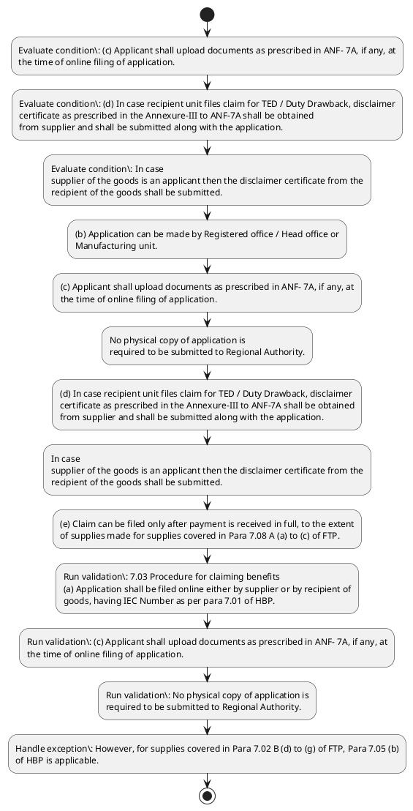

# Chapter 7 / Section 7.03: Procedure for claiming benefits

**Chapter Title:** Deemed Exports

**Pages:** 3, 4

**Purpose:** 7.03 Procedure for claiming benefits
(a) Application shall be filed online either by supplier or by recipient of
goods, having IEC Number as per para 7.01 of HBP.

**Purpose Thanglish:** Indha Procedure for claiming benefits section-la, 7.03 Procedure for claiming benefits
(a) application kandippa be filed online either by supplier or by recipient of
goods, having IEC Number as per para 7.01 of HBP.

**Summary:** 7.03 Procedure for claiming benefits
(a) Application shall be filed online either by supplier or by recipient of
goods, having IEC Number as per para 7.01 of HBP. (b) Application can be made by Registered office / Head office or
Manufacturing unit. (c) Applicant shall upload documents as prescribed in ANF- 7A, if any, at
the time of online filing of application.

**Business Meaning:** Procedure for claiming benefits governs how DGFT business controls should be applied, validated, and enforced.

**Business Explanation:** Procedure for claiming benefits explains the operating rule set that DEKAI should enforce. Key control points include 7.03 Procedure for claiming benefits
(a) Application shall be filed online either by supplier or by recipient of
goods, having IEC Number as per para 7.01 of HBP. The section also drives actions such as (b) Application can be made by Registered office / Head office or
Manufacturing unit..

**Business Explanation Thanglish:** Indha Procedure for claiming benefits section-la, Procedure for claiming benefits explains the operating rule set that DEKAI should enforce. Key control points include 7.03 Procedure for claiming benefits
(a) application kandippa be filed online either by supplier or by recipient of
goods, having IEC Number as per para 7.01 of HBP. The section also drives actions such as (b) application can be made by Registered office / Head office or
Manufacturing unit..

## Business Logic
- 7.03 Procedure for claiming benefits
(a) Application shall be filed online either by supplier or by recipient of
goods, having IEC Number as per para 7.01 of HBP.
- (c) Applicant shall upload documents as prescribed in ANF- 7A, if any, at
the time of online filing of application.
- No physical copy of application is
required to be submitted to Regional Authority.
- (d) In case recipient unit files claim for TED / Duty Drawback, disclaimer
certificate as prescribed in the Annexure-III to ANF-7A shall be obtained
from supplier and shall be submitted along with the application.
- In case
supplier of the goods is an applicant then the disclaimer certificate from the
recipient of the goods shall be submitted.
- 159
provided in Chapter 4 of FTP, is not obtained for import of duty free inputs
against such supply, drawback claim for basic custom duty paid on inputs,
used in the resultant product, shall be filed with the DC concerned.
- A DTA
Unit shall claim benefits from the concerned RA.
- (c)
In respect of supply of goods to an EPCG Authorisation holder, against
Invalidation Letter, application for Advance Authorisation / DFIA shall be
made as per procedures given in Chapter 4 of HBP.
- If Advance Authorisation
/ DFIA is not obtained for duty free inputs, Duty drawback shall be allowed
on basic custom duty paid on inputs used in the resultant product.
- TED refund for
projects mentioned in para 7.08(iii)(a) of FTP in respect of eligible items of
supply covered under schedule IV of Central Excise Act, 1944, shall be
available provided there is no exemption.
- 7.03 Procedure for claiming benefits
(a)
Application shall be filed online either by supplier or by recipient of
goods, having IEC Number as per para 7.01 of HBP.
- (c)
Applicant shall upload documents as prescribed in ANF- 7A, if any, at
the time of online filing of application.
- (d)
In case recipient unit files claim for TED / Duty Drawback, disclaimer
certificate as prescribed in the Annexure-III to ANF-7A shall be obtained
from supplier and shall be submitted along with the application.

## Business Rules
- rule_id=CH7-SEC7_03-R001, rule_description=7.03 Procedure for claiming benefits
(a) Application shall be filed online either by supplier or by recipient of
goods, having IEC Number as per para 7.01 of HBP., trigger=Procedure for claiming benefits, condition=any, validation=7.03 Procedure for claiming benefits
(a) Application shall be filed online either by supplier or by recipient of
goods, having IEC Number as per para 7.01 of HBP., action=(b) Application can be made by Registered office / Head office or
Manufacturing unit., exception=However, for supplies covered in Para 7.02 B (d) to (g) of FTP, Para 7.05 (b)
of HBP is applicable., output=DEKAI should produce a compliance decision for 7.03 - Procedure for claiming benefits.
- rule_id=CH7-SEC7_03-R002, rule_description=(c) Applicant shall upload documents as prescribed in ANF- 7A, if any, at
the time of online filing of application., trigger=Procedure for claiming benefits, condition=(d) In case recipient unit files claim for TED / Duty Drawback, disclaimer
certificate as prescribed in the Annexure-III to ANF-7A shall be obtained
from supplier and shall be submitted along with the application., validation=(c) Applicant shall upload documents as prescribed in ANF- 7A, if any, at
the time of online filing of application., action=(c) Applicant shall upload documents as prescribed in ANF- 7A, if any, at
the time of online filing of application., exception=However, if Advance Authorisation / DFIA is not obtained against such
supplies for duty free inputs as provided in Chapter 4 of FTP, claim for duty
drawback for basic custom duty may be filed as per ANF-7A., output=DEKAI should produce a compliance decision for 7.03 - Procedure for claiming benefits.
- rule_id=CH7-SEC7_03-R003, rule_description=No physical copy of application is
required to be submitted to Regional Authority., trigger=Procedure for claiming benefits, condition=In case
supplier of the goods is an applicant then the disclaimer certificate from the
recipient of the goods shall be submitted., validation=No physical copy of application is
required to be submitted to Regional Authority., action=No physical copy of application is
required to be submitted to Regional Authority., exception=TED refund for
projects mentioned in para 7.08(iii)(a) of FTP in respect of eligible items of
supply covered under schedule IV of Central Excise Act, 1944, shall be
available provided there is no exemption., output=DEKAI should produce a compliance decision for 7.03 - Procedure for claiming benefits.
- rule_id=CH7-SEC7_03-R004, rule_description=(d) In case recipient unit files claim for TED / Duty Drawback, disclaimer
certificate as prescribed in the Annexure-III to ANF-7A shall be obtained
from supplier and shall be submitted along with the application., trigger=Procedure for claiming benefits, condition=(e) Claim can be filed only after payment is received in full, to the extent
of supplies made for supplies covered in Para 7.08 A (a) to (c) of FTP., validation=(d) In case recipient unit files claim for TED / Duty Drawback, disclaimer
certificate as prescribed in the Annexure-III to ANF-7A shall be obtained
from supplier and shall be submitted along with the application., action=(d) In case recipient unit files claim for TED / Duty Drawback, disclaimer
certificate as prescribed in the Annexure-III to ANF-7A shall be obtained
from supplier and shall be submitted along with the application., exception=TED refund for
projects mentioned in para 7.08(iii)(a) of FTP in respect of eligible items of
supply covered under schedule IV of Central Excise Act, 1944, shall be
available provided there is no exemption., output=DEKAI should produce a compliance decision for 7.03 - Procedure for claiming benefits.
- rule_id=CH7-SEC7_03-R005, rule_description=In case
supplier of the goods is an applicant then the disclaimer certificate from the
recipient of the goods shall be submitted., trigger=Procedure for claiming benefits, condition=If Advance Authorisation
/ DFIA is not obtained for duty free inputs, Duty drawback shall be allowed
on basic custom duty paid on inputs used in the resultant product., validation=In case
supplier of the goods is an applicant then the disclaimer certificate from the
recipient of the goods shall be submitted., action=In case
supplier of the goods is an applicant then the disclaimer certificate from the
recipient of the goods shall be submitted., exception=TED refund for
projects mentioned in para 7.08(iii)(a) of FTP in respect of eligible items of
supply covered under schedule IV of Central Excise Act, 1944, shall be
available provided there is no exemption., output=DEKAI should produce a compliance decision for 7.03 - Procedure for claiming benefits.
- rule_id=CH7-SEC7_03-R006, rule_description=159
provided in Chapter 4 of FTP, is not obtained for import of duty free inputs
against such supply, drawback claim for basic custom duty paid on inputs,
used in the resultant product, shall be filed with the DC concerned., trigger=Procedure for claiming benefits, condition=(d)
In respect of supply of goods to other categories as listed in the
Paragraph 7.02 (d), (e), (f) & (g) of FTP, Advance Authorisation / DFIA for
import of duty free inputs as provided under Chapter 4 of FTP may be
obtained against Project Authority Certificate as per Appendix-7C., validation=159
provided in Chapter 4 of FTP, is not obtained for import of duty free inputs
against such supply, drawback claim for basic custom duty paid on inputs,
used in the resultant product, shall be filed with the DC concerned., action=(e) Claim can be filed only after payment is received in full, to the extent
of supplies made for supplies covered in Para 7.08 A (a) to (c) of FTP., exception=TED refund for
projects mentioned in para 7.08(iii)(a) of FTP in respect of eligible items of
supply covered under schedule IV of Central Excise Act, 1944, shall be
available provided there is no exemption., output=DEKAI should produce a compliance decision for 7.03 - Procedure for claiming benefits.
- rule_id=CH7-SEC7_03-R007, rule_description=A DTA
Unit shall claim benefits from the concerned RA., trigger=Procedure for claiming benefits, condition=However, if Advance Authorisation / DFIA is not obtained against such
supplies for duty free inputs as provided in Chapter 4 of FTP, claim for duty
drawback for basic custom duty may be filed as per ANF-7A., validation=A DTA
Unit shall claim benefits from the concerned RA., action=159
provided in Chapter 4 of FTP, is not obtained for import of duty free inputs
against such supply, drawback claim for basic custom duty paid on inputs,
used in the resultant product, shall be filed with the DC concerned., exception=TED refund for
projects mentioned in para 7.08(iii)(a) of FTP in respect of eligible items of
supply covered under schedule IV of Central Excise Act, 1944, shall be
available provided there is no exemption., output=DEKAI should produce a compliance decision for 7.03 - Procedure for claiming benefits.
- rule_id=CH7-SEC7_03-R008, rule_description=(c)
In respect of supply of goods to an EPCG Authorisation holder, against
Invalidation Letter, application for Advance Authorisation / DFIA shall be
made as per procedures given in Chapter 4 of HBP., trigger=Procedure for claiming benefits, condition=any, validation=(c)
In respect of supply of goods to an EPCG Authorisation holder, against
Invalidation Letter, application for Advance Authorisation / DFIA shall be
made as per procedures given in Chapter 4 of HBP., action=If Advance Authorisation
/ DFIA is not obtained for duty free inputs, Duty drawback shall be allowed
on basic custom duty paid on inputs used in the resultant product., exception=TED refund for
projects mentioned in para 7.08(iii)(a) of FTP in respect of eligible items of
supply covered under schedule IV of Central Excise Act, 1944, shall be
available provided there is no exemption., output=DEKAI should produce a compliance decision for 7.03 - Procedure for claiming benefits.
- rule_id=CH7-SEC7_03-R009, rule_description=If Advance Authorisation
/ DFIA is not obtained for duty free inputs, Duty drawback shall be allowed
on basic custom duty paid on inputs used in the resultant product., trigger=Procedure for claiming benefits, condition=(d)
In case recipient unit files claim for TED / Duty Drawback, disclaimer
certificate as prescribed in the Annexure-III to ANF-7A shall be obtained
from supplier and shall be submitted along with the application., validation=If Advance Authorisation
/ DFIA is not obtained for duty free inputs, Duty drawback shall be allowed
on basic custom duty paid on inputs used in the resultant product., action=(d)
In respect of supply of goods to other categories as listed in the
Paragraph 7.02 (d), (e), (f) & (g) of FTP, Advance Authorisation / DFIA for
import of duty free inputs as provided under Chapter 4 of FTP may be
obtained against Project Authority Certificate as per Appendix-7C., exception=TED refund for
projects mentioned in para 7.08(iii)(a) of FTP in respect of eligible items of
supply covered under schedule IV of Central Excise Act, 1944, shall be
available provided there is no exemption., output=DEKAI should produce a compliance decision for 7.03 - Procedure for claiming benefits.
- rule_id=CH7-SEC7_03-R010, rule_description=TED refund for
projects mentioned in para 7.08(iii)(a) of FTP in respect of eligible items of
supply covered under schedule IV of Central Excise Act, 1944, shall be
available provided there is no exemption., trigger=Procedure for claiming benefits, condition=(e)
Claim can be filed only after payment is received in full, to the extent
of supplies made for supplies covered in Para 7.08 A (a) to (c) of FTP., validation=TED refund for
projects mentioned in para 7.08(iii)(a) of FTP in respect of eligible items of
supply covered under schedule IV of Central Excise Act, 1944, shall be
available provided there is no exemption., action=However, if Advance Authorisation / DFIA is not obtained against such
supplies for duty free inputs as provided in Chapter 4 of FTP, claim for duty
drawback for basic custom duty may be filed as per ANF-7A., exception=TED refund for
projects mentioned in para 7.08(iii)(a) of FTP in respect of eligible items of
supply covered under schedule IV of Central Excise Act, 1944, shall be
available provided there is no exemption., output=DEKAI should produce a compliance decision for 7.03 - Procedure for claiming benefits.
- rule_id=CH7-SEC7_03-R011, rule_description=7.03 Procedure for claiming benefits
(a)
Application shall be filed online either by supplier or by recipient of
goods, having IEC Number as per para 7.01 of HBP., trigger=Procedure for claiming benefits, condition=In respect of supplies covered under
Paragraph 7.02 (d) to (g) of the FTP, payment certificate issued by Project
Authority, in Appendix-7D, has also to be submitted., validation=7.03 Procedure for claiming benefits
(a)
Application shall be filed online either by supplier or by recipient of
goods, having IEC Number as per para 7.01 of HBP., action=(b)
Application can be made by Registered office / Head office or
Manufacturing unit., exception=TED refund for
projects mentioned in para 7.08(iii)(a) of FTP in respect of eligible items of
supply covered under schedule IV of Central Excise Act, 1944, shall be
available provided there is no exemption., output=DEKAI should produce a compliance decision for 7.03 - Procedure for claiming benefits.
- rule_id=CH7-SEC7_03-R012, rule_description=(c)
Applicant shall upload documents as prescribed in ANF- 7A, if any, at
the time of online filing of application., trigger=Procedure for claiming benefits, condition=(g) Sub-contractor can also file claim provided its name is endorsed in
the Project Authority Certificate / Contract before supply of such goods., validation=(c)
Applicant shall upload documents as prescribed in ANF- 7A, if any, at
the time of online filing of application., action=(c)
Applicant shall upload documents as prescribed in ANF- 7A, if any, at
the time of online filing of application., exception=TED refund for
projects mentioned in para 7.08(iii)(a) of FTP in respect of eligible items of
supply covered under schedule IV of Central Excise Act, 1944, shall be
available provided there is no exemption., output=DEKAI should produce a compliance decision for 7.03 - Procedure for claiming benefits.
- rule_id=CH7-SEC7_03-R013, rule_description=(d)
In case recipient unit files claim for TED / Duty Drawback, disclaimer
certificate as prescribed in the Annexure-III to ANF-7A shall be obtained
from supplier and shall be submitted along with the application., trigger=Procedure for claiming benefits, condition=(g) Sub-contractor can also file claim provided its name is endorsed in
the Project Authority Certificate / Contract before supply of such goods., validation=(d)
In case recipient unit files claim for TED / Duty Drawback, disclaimer
certificate as prescribed in the Annexure-III to ANF-7A shall be obtained
from supplier and shall be submitted along with the application., action=(d)
In case recipient unit files claim for TED / Duty Drawback, disclaimer
certificate as prescribed in the Annexure-III to ANF-7A shall be obtained
from supplier and shall be submitted along with the application., exception=TED refund for
projects mentioned in para 7.08(iii)(a) of FTP in respect of eligible items of
supply covered under schedule IV of Central Excise Act, 1944, shall be
available provided there is no exemption., output=DEKAI should produce a compliance decision for 7.03 - Procedure for claiming benefits.

## Conditions
- (c) Applicant shall upload documents as prescribed in ANF- 7A, if any, at
the time of online filing of application.
- (d) In case recipient unit files claim for TED / Duty Drawback, disclaimer
certificate as prescribed in the Annexure-III to ANF-7A shall be obtained
from supplier and shall be submitted along with the application.
- In case
supplier of the goods is an applicant then the disclaimer certificate from the
recipient of the goods shall be submitted.
- (e) Claim can be filed only after payment is received in full, to the extent
of supplies made for supplies covered in Para 7.08 A (a) to (c) of FTP.
- If Advance Authorisation
/ DFIA is not obtained for duty free inputs, Duty drawback shall be allowed
on basic custom duty paid on inputs used in the resultant product.
- (d)
In respect of supply of goods to other categories as listed in the
Paragraph 7.02 (d), (e), (f) & (g) of FTP, Advance Authorisation / DFIA for
import of duty free inputs as provided under Chapter 4 of FTP may be
obtained against Project Authority Certificate as per Appendix-7C.
- However, if Advance Authorisation / DFIA is not obtained against such
supplies for duty free inputs as provided in Chapter 4 of FTP, claim for duty
drawback for basic custom duty may be filed as per ANF-7A.
- (c)
Applicant shall upload documents as prescribed in ANF- 7A, if any, at
the time of online filing of application.
- (d)
In case recipient unit files claim for TED / Duty Drawback, disclaimer
certificate as prescribed in the Annexure-III to ANF-7A shall be obtained
from supplier and shall be submitted along with the application.
- (e)
Claim can be filed only after payment is received in full, to the extent
of supplies made for supplies covered in Para 7.08 A (a) to (c) of FTP.
- In respect of supplies covered under
Paragraph 7.02 (d) to (g) of the FTP, payment certificate issued by Project
Authority, in Appendix-7D, has also to be submitted.
- (g) Sub-contractor can also file claim provided its name is endorsed in
the Project Authority Certificate / Contract before supply of such goods.

## Condition Logic
- id=7.7.03.1, if=any, then=(b) Application can be made by Registered office / Head office or
Manufacturing unit., source=(c) Applicant shall upload documents as prescribed in ANF- 7A, if any, at
the time of online filing of application.
- id=7.7.03.2, if=(d) In case recipient unit files claim for TED / Duty Drawback, disclaimer
certificate as prescribed in the Annexure-III to ANF-7A shall be obtained
from supplier and shall be submitted along with the application., then=(b) Application can be made by Registered office / Head office or
Manufacturing unit., source=(d) In case recipient unit files claim for TED / Duty Drawback, disclaimer
certificate as prescribed in the Annexure-III to ANF-7A shall be obtained
from supplier and shall be submitted along with the application.
- id=7.7.03.3, if=In case
supplier of the goods is an applicant then the disclaimer certificate from the
recipient of the goods shall be submitted., then=(b) Application can be made by Registered office / Head office or
Manufacturing unit., source=In case
supplier of the goods is an applicant then the disclaimer certificate from the
recipient of the goods shall be submitted.
- id=7.7.03.4, if=(e) Claim can be filed only after payment is received in full, to the extent
of supplies made for supplies covered in Para 7.08 A (a) to (c) of FTP., then=(b) Application can be made by Registered office / Head office or
Manufacturing unit., source=(e) Claim can be filed only after payment is received in full, to the extent
of supplies made for supplies covered in Para 7.08 A (a) to (c) of FTP.
- id=7.7.03.5, if=If Advance Authorisation
/ DFIA is not obtained for duty free inputs, Duty drawback shall be allowed
on basic custom duty paid on inputs used in the resultant product., then=(b) Application can be made by Registered office / Head office or
Manufacturing unit., source=If Advance Authorisation
/ DFIA is not obtained for duty free inputs, Duty drawback shall be allowed
on basic custom duty paid on inputs used in the resultant product.
- id=7.7.03.6, if=(d)
In respect of supply of goods to other categories as listed in the
Paragraph 7.02 (d), (e), (f) & (g) of FTP, Advance Authorisation / DFIA for
import of duty free inputs as provided under Chapter 4 of FTP may be
obtained against Project Authority Certificate as per Appendix-7C., then=(b) Application can be made by Registered office / Head office or
Manufacturing unit., source=(d)
In respect of supply of goods to other categories as listed in the
Paragraph 7.02 (d), (e), (f) & (g) of FTP, Advance Authorisation / DFIA for
import of duty free inputs as provided under Chapter 4 of FTP may be
obtained against Project Authority Certificate as per Appendix-7C.
- id=7.7.03.7, if=However, if Advance Authorisation / DFIA is not obtained against such
supplies for duty free inputs as provided in Chapter 4 of FTP, claim for duty
drawback for basic custom duty may be filed as per ANF-7A., then=(b) Application can be made by Registered office / Head office or
Manufacturing unit., source=However, if Advance Authorisation / DFIA is not obtained against such
supplies for duty free inputs as provided in Chapter 4 of FTP, claim for duty
drawback for basic custom duty may be filed as per ANF-7A.
- id=7.7.03.8, if=any, then=(b) Application can be made by Registered office / Head office or
Manufacturing unit., source=(c)
Applicant shall upload documents as prescribed in ANF- 7A, if any, at
the time of online filing of application.
- id=7.7.03.9, if=(d)
In case recipient unit files claim for TED / Duty Drawback, disclaimer
certificate as prescribed in the Annexure-III to ANF-7A shall be obtained
from supplier and shall be submitted along with the application., then=(b) Application can be made by Registered office / Head office or
Manufacturing unit., source=(d)
In case recipient unit files claim for TED / Duty Drawback, disclaimer
certificate as prescribed in the Annexure-III to ANF-7A shall be obtained
from supplier and shall be submitted along with the application.
- id=7.7.03.10, if=(e)
Claim can be filed only after payment is received in full, to the extent
of supplies made for supplies covered in Para 7.08 A (a) to (c) of FTP., then=(b) Application can be made by Registered office / Head office or
Manufacturing unit., source=(e)
Claim can be filed only after payment is received in full, to the extent
of supplies made for supplies covered in Para 7.08 A (a) to (c) of FTP.
- id=7.7.03.11, if=In respect of supplies covered under
Paragraph 7.02 (d) to (g) of the FTP, payment certificate issued by Project
Authority, in Appendix-7D, has also to be submitted., then=(b) Application can be made by Registered office / Head office or
Manufacturing unit., source=In respect of supplies covered under
Paragraph 7.02 (d) to (g) of the FTP, payment certificate issued by Project
Authority, in Appendix-7D, has also to be submitted.
- id=7.7.03.12, if=(g) Sub-contractor can also file claim provided its name is endorsed in
the Project Authority Certificate / Contract before supply of such goods., then=(b) Application can be made by Registered office / Head office or
Manufacturing unit., source=(g) Sub-contractor can also file claim provided its name is endorsed in
the Project Authority Certificate / Contract before supply of such goods.

## Validations
- 7.03 Procedure for claiming benefits
(a) Application shall be filed online either by supplier or by recipient of
goods, having IEC Number as per para 7.01 of HBP.
- (c) Applicant shall upload documents as prescribed in ANF- 7A, if any, at
the time of online filing of application.
- No physical copy of application is
required to be submitted to Regional Authority.
- (d) In case recipient unit files claim for TED / Duty Drawback, disclaimer
certificate as prescribed in the Annexure-III to ANF-7A shall be obtained
from supplier and shall be submitted along with the application.
- In case
supplier of the goods is an applicant then the disclaimer certificate from the
recipient of the goods shall be submitted.
- 159
provided in Chapter 4 of FTP, is not obtained for import of duty free inputs
against such supply, drawback claim for basic custom duty paid on inputs,
used in the resultant product, shall be filed with the DC concerned.
- A DTA
Unit shall claim benefits from the concerned RA.
- (c)
In respect of supply of goods to an EPCG Authorisation holder, against
Invalidation Letter, application for Advance Authorisation / DFIA shall be
made as per procedures given in Chapter 4 of HBP.
- If Advance Authorisation
/ DFIA is not obtained for duty free inputs, Duty drawback shall be allowed
on basic custom duty paid on inputs used in the resultant product.
- TED refund for
projects mentioned in para 7.08(iii)(a) of FTP in respect of eligible items of
supply covered under schedule IV of Central Excise Act, 1944, shall be
available provided there is no exemption.
- 7.03 Procedure for claiming benefits
(a)
Application shall be filed online either by supplier or by recipient of
goods, having IEC Number as per para 7.01 of HBP.
- (c)
Applicant shall upload documents as prescribed in ANF- 7A, if any, at
the time of online filing of application.
- (d)
In case recipient unit files claim for TED / Duty Drawback, disclaimer
certificate as prescribed in the Annexure-III to ANF-7A shall be obtained
from supplier and shall be submitted along with the application.

## Exceptions
- However, for supplies covered in Para 7.02 B (d) to (g) of FTP, Para 7.05 (b)
of HBP is applicable.
- However, if Advance Authorisation / DFIA is not obtained against such
supplies for duty free inputs as provided in Chapter 4 of FTP, claim for duty
drawback for basic custom duty may be filed as per ANF-7A.
- TED refund for
projects mentioned in para 7.08(iii)(a) of FTP in respect of eligible items of
supply covered under schedule IV of Central Excise Act, 1944, shall be
available provided there is no exemption.

## Dependencies
- 7.01
- 7.08
- 7.02
- 7.05
- 4

## Authorities
- Regional Authority
- RA
- Unit shall claim benefits from the concerned RA
- Project Authority

## Required Documents
- 7.03 Procedure for claiming benefits
(a) Application shall be filed online either by supplier or by recipient of
goods, having IEC Number as per para 7.01 of HBP.
- (b) Application can be made by Registered office / Head office or
Manufacturing unit.
- (c) Applicant shall upload documents as prescribed in ANF- 7A, if any, at
the time of online filing of application.
- No physical copy of application is
required to be submitted to Regional Authority.
- (d) In case recipient unit files claim for TED / Duty Drawback, disclaimer
certificate as prescribed in the Annexure-III to ANF-7A shall be obtained
from supplier and shall be submitted along with the application.
- In case
supplier of the goods is an applicant then the disclaimer certificate from the
recipient of the goods shall be submitted.
- (c)
In respect of supply of goods to an EPCG Authorisation holder, against
Invalidation Letter, application for Advance Authorisation / DFIA shall be
made as per procedures given in Chapter 4 of HBP.
- Project Authority Certificate
- 7.03 Procedure for claiming benefits
(a)
Application shall be filed online either by supplier or by recipient of
goods, having IEC Number as per para 7.01 of HBP.
- (b)
Application can be made by Registered office / Head office or
Manufacturing unit.
- (c)
Applicant shall upload documents as prescribed in ANF- 7A, if any, at
the time of online filing of application.
- (d)
In case recipient unit files claim for TED / Duty Drawback, disclaimer
certificate as prescribed in the Annexure-III to ANF-7A shall be obtained
from supplier and shall be submitted along with the application.
- In other words, supply documents have to be
negotiated through bank only.
- In respect of supplies covered under
Paragraph 7.02 (d) to (g) of the FTP, payment certificate issued by Project
Authority, in Appendix-7D, has also to be submitted.

## Timelines
- (e) Claim can be filed only after payment is received in full, to the extent
of supplies made for supplies covered in Para 7.08 A (a) to (c) of FTP.
- (e)
Claim can be filed only after payment is received in full, to the extent
of supplies made for supplies covered in Para 7.08 A (a) to (c) of FTP.
- (g) Sub-contractor can also file claim provided its name is endorsed in
the Project Authority Certificate / Contract before supply of such goods.

## Actions
- (b) Application can be made by Registered office / Head office or
Manufacturing unit.
- (c) Applicant shall upload documents as prescribed in ANF- 7A, if any, at
the time of online filing of application.
- No physical copy of application is
required to be submitted to Regional Authority.
- (d) In case recipient unit files claim for TED / Duty Drawback, disclaimer
certificate as prescribed in the Annexure-III to ANF-7A shall be obtained
from supplier and shall be submitted along with the application.
- In case
supplier of the goods is an applicant then the disclaimer certificate from the
recipient of the goods shall be submitted.
- (e) Claim can be filed only after payment is received in full, to the extent
of supplies made for supplies covered in Para 7.08 A (a) to (c) of FTP.
- 159
provided in Chapter 4 of FTP, is not obtained for import of duty free inputs
against such supply, drawback claim for basic custom duty paid on inputs,
used in the resultant product, shall be filed with the DC concerned.
- If Advance Authorisation
/ DFIA is not obtained for duty free inputs, Duty drawback shall be allowed
on basic custom duty paid on inputs used in the resultant product.
- (d)
In respect of supply of goods to other categories as listed in the
Paragraph 7.02 (d), (e), (f) & (g) of FTP, Advance Authorisation / DFIA for
import of duty free inputs as provided under Chapter 4 of FTP may be
obtained against Project Authority Certificate as per Appendix-7C.
- However, if Advance Authorisation / DFIA is not obtained against such
supplies for duty free inputs as provided in Chapter 4 of FTP, claim for duty
drawback for basic custom duty may be filed as per ANF-7A.
- (b)
Application can be made by Registered office / Head office or
Manufacturing unit.
- (c)
Applicant shall upload documents as prescribed in ANF- 7A, if any, at
the time of online filing of application.
- (d)
In case recipient unit files claim for TED / Duty Drawback, disclaimer
certificate as prescribed in the Annexure-III to ANF-7A shall be obtained
from supplier and shall be submitted along with the application.
- (e)
Claim can be filed only after payment is received in full, to the extent
of supplies made for supplies covered in Para 7.08 A (a) to (c) of FTP.
- (f) Claim can be filed against payment received through normal banking
channel, as per e-BRC.
- In respect of supplies covered under
Paragraph 7.02 (d) to (g) of the FTP, payment certificate issued by Project
Authority, in Appendix-7D, has also to be submitted.

## Workflow
- Evaluate condition: (c) Applicant shall upload documents as prescribed in ANF- 7A, if any, at
the time of online filing of application.
- Evaluate condition: (d) In case recipient unit files claim for TED / Duty Drawback, disclaimer
certificate as prescribed in the Annexure-III to ANF-7A shall be obtained
from supplier and shall be submitted along with the application.
- Evaluate condition: In case
supplier of the goods is an applicant then the disclaimer certificate from the
recipient of the goods shall be submitted.
- (b) Application can be made by Registered office / Head office or
Manufacturing unit.
- (c) Applicant shall upload documents as prescribed in ANF- 7A, if any, at
the time of online filing of application.
- No physical copy of application is
required to be submitted to Regional Authority.
- (d) In case recipient unit files claim for TED / Duty Drawback, disclaimer
certificate as prescribed in the Annexure-III to ANF-7A shall be obtained
from supplier and shall be submitted along with the application.
- In case
supplier of the goods is an applicant then the disclaimer certificate from the
recipient of the goods shall be submitted.
- (e) Claim can be filed only after payment is received in full, to the extent
of supplies made for supplies covered in Para 7.08 A (a) to (c) of FTP.
- Run validation: 7.03 Procedure for claiming benefits
(a) Application shall be filed online either by supplier or by recipient of
goods, having IEC Number as per para 7.01 of HBP.
- Run validation: (c) Applicant shall upload documents as prescribed in ANF- 7A, if any, at
the time of online filing of application.
- Run validation: No physical copy of application is
required to be submitted to Regional Authority.
- Handle exception: However, for supplies covered in Para 7.02 B (d) to (g) of FTP, Para 7.05 (b)
of HBP is applicable.

## Workflow ASCII
```text
Procedure for claiming benefits
Evaluate condition: (c) Applicant shall upload documents as prescribed in ANF- 7A, if any, at
the time of online filing of application.
   |
   v
Evaluate condition: (d) In case recipient unit files claim for TED / Duty Drawback, disclaimer
certificate as prescribed in the Annexure-III to ANF-7A shall be obtained
from supplier and shall be submitted along with the application.
   |
   v
Evaluate condition: In case
supplier of the goods is an applicant then the disclaimer certificate from the
recipient of the goods shall be submitted.
   |
   v
(b) Application can be made by Registered office / Head office or
Manufacturing unit.
   |
   v
(c) Applicant shall upload documents as prescribed in ANF- 7A, if any, at
the time of online filing of application.
   |
   v
No physical copy of application is
required to be submitted to Regional Authority.
   |
   v
(d) In case recipient unit files claim for TED / Duty Drawback, disclaimer
certificate as prescribed in the Annexure-III to ANF-7A shall be obtained
from supplier and shall be submitted along with the application.
   |
   v
In case
supplier of the goods is an applicant then the disclaimer certificate from the
recipient of the goods shall be submitted.
   |
   v
(e) Claim can be filed only after payment is received in full, to the extent
of supplies made for supplies covered in Para 7.08 A (a) to (c) of FTP.
   |
   v
Run validation: 7.03 Procedure for claiming benefits
(a) Application shall be filed online either by supplier or by recipient of
goods, having IEC Number as per para 7.01 of HBP.
   |
   v
Run validation: (c) Applicant shall upload documents as prescribed in ANF- 7A, if any, at
the time of online filing of application.
   |
   v
Run validation: No physical copy of application is
required to be submitted to Regional Authority.
   |
   v
Handle exception: However, for supplies covered in Para 7.02 B (d) to (g) of FTP, Para 7.05 (b)
of HBP is applicable.
```

## Decision Tree
- IF (c) Applicant shall upload documents as prescribed in ANF- 7A, if any, at
the time of online filing of application. THEN (b) Application can be made by Registered office / Head office or
Manufacturing unit.
- IF (d) In case recipient unit files claim for TED / Duty Drawback, disclaimer
certificate as prescribed in the Annexure-III to ANF-7A shall be obtained
from supplier and shall be submitted along with the application. THEN (b) Application can be made by Registered office / Head office or
Manufacturing unit.
- IF In case
supplier of the goods is an applicant then the disclaimer certificate from the
recipient of the goods shall be submitted. THEN (b) Application can be made by Registered office / Head office or
Manufacturing unit.
- IF (e) Claim can be filed only after payment is received in full, to the extent
of supplies made for supplies covered in Para 7.08 A (a) to (c) of FTP. THEN (b) Application can be made by Registered office / Head office or
Manufacturing unit.
- IF If Advance Authorisation
/ DFIA is not obtained for duty free inputs, Duty drawback shall be allowed
on basic custom duty paid on inputs used in the resultant product. THEN (b) Application can be made by Registered office / Head office or
Manufacturing unit.
- IF exception applies (However, for supplies covered in Para 7.02 B (d) to (g) of FTP, Para 7.05 (b)
of HBP is applicable.) THEN route to manual review
- IF exception applies (However, if Advance Authorisation / DFIA is not obtained against such
supplies for duty free inputs as provided in Chapter 4 of FTP, claim for duty
drawback for basic custom duty may be filed as per ANF-7A.) THEN route to manual review
- IF exception applies (TED refund for
projects mentioned in para 7.08(iii)(a) of FTP in respect of eligible items of
supply covered under schedule IV of Central Excise Act, 1944, shall be
available provided there is no exemption.) THEN route to manual review

## Decision Tree ASCII
```text
Procedure for claiming benefits Decision
IF (c) Applicant shall upload documents as prescribed in ANF- 7A, if any, at
the time of online filing of application. THEN (b) Application can be made by Registered office / Head office or
Manufacturing unit.
   |
   v
IF (d) In case recipient unit files claim for TED / Duty Drawback, disclaimer
certificate as prescribed in the Annexure-III to ANF-7A shall be obtained
from supplier and shall be submitted along with the application. THEN (b) Application can be made by Registered office / Head office or
Manufacturing unit.
   |
   v
IF In case
supplier of the goods is an applicant then the disclaimer certificate from the
recipient of the goods shall be submitted. THEN (b) Application can be made by Registered office / Head office or
Manufacturing unit.
   |
   v
IF (e) Claim can be filed only after payment is received in full, to the extent
of supplies made for supplies covered in Para 7.08 A (a) to (c) of FTP. THEN (b) Application can be made by Registered office / Head office or
Manufacturing unit.
   |
   v
IF If Advance Authorisation
/ DFIA is not obtained for duty free inputs, Duty drawback shall be allowed
on basic custom duty paid on inputs used in the resultant product. THEN (b) Application can be made by Registered office / Head office or
Manufacturing unit.
   |
   v
IF exception applies (However, for supplies covered in Para 7.02 B (d) to (g) of FTP, Para 7.05 (b)
of HBP is applicable.) THEN route to manual review
   |
   v
IF exception applies (However, if Advance Authorisation / DFIA is not obtained against such
supplies for duty free inputs as provided in Chapter 4 of FTP, claim for duty
drawback for basic custom duty may be filed as per ANF-7A.) THEN route to manual review
   |
   v
IF exception applies (TED refund for
projects mentioned in para 7.08(iii)(a) of FTP in respect of eligible items of
supply covered under schedule IV of Central Excise Act, 1944, shall be
available provided there is no exemption.) THEN route to manual review
```

## Examples
- User asks to process Procedure for claiming benefits; the platform checks conditions, validations, and documents before action.

**Real-world Example:** Example: an importer or exporter invokes Procedure for claiming benefits, submits 7.03 Procedure for claiming benefits
(a) Application shall be filed online either by supplier or by recipient of
goods, having IEC Number as per para 7.01 of HBP., (b) Application can be made by Registered office / Head office or
Manufacturing unit., (c) Applicant shall upload documents as prescribed in ANF- 7A, if any, at
the time of online filing of application., and DEKAI uses the extracted rules to (b) application can be made by registered office / head office or
manufacturing unit..

**Real-world Example Thanglish:** Indha Procedure for claiming benefits section-la, Example: an importer or exporter invokes Procedure for claiming benefits, submits 7.03 Procedure for claiming benefits
(a) application kandippa be filed online either by supplier or by recipient of
goods, having IEC Number as per para 7.01 of HBP., (b) application can be made by Registered office / Head office or
Manufacturing unit., (c) Applicant kandippa upload documents as prescribed in ANF- 7A, if any, at
the time of online filing of application., and DEKAI uses the extracted rules to (b) application can be made by registered office / head office or
manufacturing unit..

## AI Rules
- IF detected context matches section rule THEN enforce: 7.03 Procedure for claiming benefits
(a) Application shall be filed online either by supplier or by recipient of
goods, having IEC Number as per para 7.01 of HBP.
- IF detected context matches section rule THEN enforce: (c) Applicant shall upload documents as prescribed in ANF- 7A, if any, at
the time of online filing of application.
- IF detected context matches section rule THEN enforce: No physical copy of application is
required to be submitted to Regional Authority.
- IF detected context matches section rule THEN enforce: (d) In case recipient unit files claim for TED / Duty Drawback, disclaimer
certificate as prescribed in the Annexure-III to ANF-7A shall be obtained
from supplier and shall be submitted along with the application.
- IF detected context matches section rule THEN enforce: In case
supplier of the goods is an applicant then the disclaimer certificate from the
recipient of the goods shall be submitted.
- IF detected context matches section rule THEN enforce: 159
provided in Chapter 4 of FTP, is not obtained for import of duty free inputs
against such supply, drawback claim for basic custom duty paid on inputs,
used in the resultant product, shall be filed with the DC concerned.
- IF validations pass THEN recommend action: (b) Application can be made by Registered office / Head office or
Manufacturing unit.

## Database Fields
- name=section_code, type=string, required=True, source=parsed_section_heading
- name=section_title, type=string, required=True, source=parsed_section_heading
- name=for_flag, type=boolean, required=False, source=keyword:for
- name=iec_flag, type=boolean, required=False, source=keyword:IEC
- name=per_flag, type=boolean, required=False, source=keyword:per
- name=hbp_flag, type=boolean, required=False, source=keyword:HBP
- name=can_flag, type=boolean, required=False, source=keyword:can
- name=anf_flag, type=boolean, required=False, source=keyword:ANF
- name=any_flag, type=boolean, required=False, source=keyword:any
- name=the_flag, type=boolean, required=False, source=keyword:the
- name=document_1_submitted, type=boolean, required=True, source=7.03 Procedure for claiming benefits
(a) Application shall be filed online either by supplier or by recipient of
goods, having IEC Number as per para 7.01 of HBP.
- name=document_2_submitted, type=boolean, required=True, source=(b) Application can be made by Registered office / Head office or
Manufacturing unit.
- name=document_3_submitted, type=boolean, required=True, source=(c) Applicant shall upload documents as prescribed in ANF- 7A, if any, at
the time of online filing of application.
- name=document_4_submitted, type=boolean, required=True, source=No physical copy of application is
required to be submitted to Regional Authority.
- name=document_5_submitted, type=boolean, required=True, source=(d) In case recipient unit files claim for TED / Duty Drawback, disclaimer
certificate as prescribed in the Annexure-III to ANF-7A shall be obtained
from supplier and shall be submitted along with the application.
- name=document_6_submitted, type=boolean, required=True, source=In case
supplier of the goods is an applicant then the disclaimer certificate from the
recipient of the goods shall be submitted.

## API Requirements
- method=GET, path=/api/dgft/sections/7.03, purpose=Retrieve knowledge payload for section 7.03, query_params=['include=workflow,decision_tree,validations'], response_fields=['section', 'title', 'summary', 'conditions', 'validations', 'exceptions', 'workflow', 'decision_tree']
- method=POST, path=/api/dgft/Procedure-for-claiming-benefits/validate, purpose=Validate inputs and documents for Procedure for claiming benefits, request_fields=['section_code', 'section_title', 'document_1_submitted', 'document_2_submitted', 'document_3_submitted', 'document_4_submitted', 'document_5_submitted', 'document_6_submitted'], response_fields=['status', 'errors', 'warnings', 'next_actions']
- method=POST, path=/api/dgft/Procedure-for-claiming-benefits/execute, purpose=Trigger business action for (b) Application can be made by Registered office / Head office or
Manufacturing unit., request_fields=['section_code', 'section_title', 'document_1_submitted', 'document_2_submitted', 'document_3_submitted', 'document_4_submitted', 'document_5_submitted', 'document_6_submitted'], response_fields=['reference_id', 'status', 'authority', 'timeline']

## UI Screens
- screen_id=Procedure_for_claiming_benefits_overview, name=Procedure for claiming benefits Overview, purpose=Show section summary, authority, timeline, and eligibility cues., widgets=['summary_card', 'conditions_table', 'authority_badges', 'timeline_panel']
- screen_id=Procedure_for_claiming_benefits_submission, name=Procedure for claiming benefits Submission, purpose=Capture applicant data and supporting documents., widgets=['dynamic_form', 'document_uploader', 'validation_panel', 'next_action_footer'], fields=['section_code', 'section_title', 'for_flag', 'iec_flag', 'per_flag', 'hbp_flag', 'can_flag', 'anf_flag']
- screen_id=Procedure_for_claiming_benefits_exceptions, name=Procedure for claiming benefits Exception Review, purpose=Explain exception handling and manual review triggers., widgets=['exception_banner', 'decision_tree', 'case_notes']

## Error Messages
- Validation failed because the section requirements were not fully met.

## FAQ
- question_en=What is the purpose of section 7.03?, answer_en=Procedure for claiming benefits explains the operating rule set that DEKAI should enforce. Key control points include 7.03 Procedure for claiming benefits
(a) Application shall be filed online either by supplier or by recipient of
goods, having IEC Number as per para 7.01 of HBP. The section also drives actions such as (b) Application can be made by Registered office / Head office or
Manufacturing unit.., question_thanglish=Indha Procedure for claiming benefits section-la, What is the purpose of section 7.03?, answer_thanglish=Indha Procedure for claiming benefits section-la, Procedure for claiming benefits explains the operating rule set that DEKAI should enforce. Key control points include 7.03 Procedure for claiming benefits
(a) application kandippa be filed online either by supplier or by recipient of
goods, having IEC Number as per para 7.01 of HBP. The section also drives actions such as (b) application can be made by Registered office / Head office or
Manufacturing unit..
- question_en=What documents are required under Procedure for claiming benefits?, answer_en=7.03 Procedure for claiming benefits
(a) Application shall be filed online either by supplier or by recipient of
goods, having IEC Number as per para 7.01 of HBP., (b) Application can be made by Registered office / Head office or
Manufacturing unit., (c) Applicant shall upload documents as prescribed in ANF- 7A, if any, at
the time of online filing of application., No physical copy of application is
required to be submitted to Regional Authority., (d) In case recipient unit files claim for TED / Duty Drawback, disclaimer
certificate as prescribed in the Annexure-III to ANF-7A shall be obtained
from supplier and shall be submitted along with the application., In case
supplier of the goods is an applicant then the disclaimer certificate from the
recipient of the goods shall be submitted., (c)
In respect of supply of goods to an EPCG Authorisation holder, against
Invalidation Letter, application for Advance Authorisation / DFIA shall be
made as per procedures given in Chapter 4 of HBP., Project Authority Certificate, 7.03 Procedure for claiming benefits
(a)
Application shall be filed online either by supplier or by recipient of
goods, having IEC Number as per para 7.01 of HBP., (b)
Application can be made by Registered office / Head office or
Manufacturing unit., (c)
Applicant shall upload documents as prescribed in ANF- 7A, if any, at
the time of online filing of application., (d)
In case recipient unit files claim for TED / Duty Drawback, disclaimer
certificate as prescribed in the Annexure-III to ANF-7A shall be obtained
from supplier and shall be submitted along with the application., In other words, supply documents have to be
negotiated through bank only., In respect of supplies covered under
Paragraph 7.02 (d) to (g) of the FTP, payment certificate issued by Project
Authority, in Appendix-7D, has also to be submitted., question_thanglish=Indha Procedure for claiming benefits section-la, What documents are required under Procedure for claiming benefits?, answer_thanglish=Indha Procedure for claiming benefits section-la, 7.03 Procedure for claiming benefits
(a) application kandippa be filed online either by supplier or by recipient of
goods, having IEC Number as per para 7.01 of HBP., (b) application can be made by Registered office / Head office or
Manufacturing unit., (c) Applicant kandippa upload documents as prescribed in ANF- 7A, if any, at
the time of online filing of application., No physical copy of application is
required to be submitted to Regional authority., (d) In case recipient unit files claim for TED / Duty Drawback, disclaimer
certificate as prescribed in the Annexure-III to ANF-7A kandippa be obtained
from supplier and kandippa be submitted along with the application., In case
supplier of the goods is an applicant then the disclaimer certificate from the
recipient of the goods kandippa be submitted., (c)
In respect of supply of goods to an EPCG Authorisation holder, against
Invalidation Letter, application for Advance Authorisation / DFIA kandippa be
made as per procedures given in Chapter 4 of HBP., Project authority Certificate, 7.03 Procedure for claiming benefits
(a)
application kandippa be filed online either by supplier or by recipient of
goods, having IEC Number as per para 7.01 of HBP., (b)
application can be made by Registered office / Head office or
Manufacturing unit., (c)
Applicant kandippa upload documents as prescribed in ANF- 7A, if any, at
the time of online filing of application., (d)
In case recipient unit files claim for TED / Duty Drawback, disclaimer
certificate as prescribed in the Annexure-III to ANF-7A kandippa be obtained
from supplier and kandippa be submitted along with the application., In other words, supply documents have to be
negotiated through bank only., In respect of supplies covered under
Paragraph 7.02 (d) to (g) of the FTP, payment certificate issued by Project
authority, in Appendix-7D, has also to be submitted.
- question_en=Which authority handles Procedure for claiming benefits?, answer_en=Regional Authority, RA, Unit shall claim benefits from the concerned RA, Project Authority, question_thanglish=Indha Procedure for claiming benefits section-la, Which authority handles Procedure for claiming benefits?, answer_thanglish=Indha Procedure for claiming benefits section-la, Regional authority, RA, Unit kandippa claim benefits from the concerned RA, Project authority

## Questions Users May Ask
- What does Procedure for claiming benefits require?
- Which documents are needed for Procedure for claiming benefits?
- How does DEKAI validate Procedure for claiming benefits requests?
- What action should be taken for Procedure for claiming benefits?

## Expected AI Answers
- Procedure for claiming benefits requires the platform to interpret the section text, apply the extracted business rules, and present the correct next action.
- Required documents are inferred from the section text: 7.03 Procedure for claiming benefits
(a) Application shall be filed online either by supplier or by recipient of
goods, having IEC Number as per para 7.01 of HBP., (b) Application can be made by Registered office / Head office or
Manufacturing unit., (c) Applicant shall upload documents as prescribed in ANF- 7A, if any, at
the time of online filing of application., No physical copy of application is
required to be submitted to Regional Authority., (d) In case recipient unit files claim for TED / Duty Drawback, disclaimer
certificate as prescribed in the Annexure-III to ANF-7A shall be obtained
from supplier and shall be submitted along with the application.
- DEKAI validates Procedure for claiming benefits by checking conditions, required documents, authority references, and exception clauses before recommending an outcome.
- The primary extracted action is: (b) Application can be made by Registered office / Head office or
Manufacturing unit.

## AI Q&A Examples
- question_en=User asks: How do I comply with Procedure for claiming benefits?, answer_en=AI answers: DEKAI should evaluate section 7.03, apply the extracted rules, and guide the user through Evaluate condition: (c) Applicant shall upload documents as prescribed in ANF- 7A, if any, at
the time of online filing of application.., question_thanglish=Indha Procedure for claiming benefits section-la, User asks: How do I comply with Procedure for claiming benefits?, answer_thanglish=Indha Procedure for claiming benefits section-la, AI answers: DEKAI should evaluate section 7.03, apply the extracted rules, and guide the user through Evaluate condition: (c) Applicant kandippa upload documents as prescribed in ANF- 7A, if any, at
the time of online filing of application..
- question_en=User asks: Which validations apply to Procedure for claiming benefits?, answer_en=AI answers: Applicable validations are 7.03 Procedure for claiming benefits
(a) Application shall be filed online either by supplier or by recipient of
goods, having IEC Number as per para 7.01 of HBP., (c) Applicant shall upload documents as prescribed in ANF- 7A, if any, at
the time of online filing of application., No physical copy of application is
required to be submitted to Regional Authority., question_thanglish=Indha Procedure for claiming benefits section-la, User asks: Which validations apply to Procedure for claiming benefits?, answer_thanglish=Indha Procedure for claiming benefits section-la, AI answers: Applicable validations are 7.03 Procedure for claiming benefits
(a) application kandippa be filed online either by supplier or by recipient of
goods, having IEC Number as per para 7.01 of HBP., (c) Applicant kandippa upload documents as prescribed in ANF- 7A, if any, at
the time of online filing of application., No physical copy of application is
required to be submitted to Regional authority.

## DEKAI AI Implementation Notes
- Capture chapter 7, section 7.03, title, and page references as immutable knowledge metadata.
- Bind validations for Procedure for claiming benefits into a rule engine keyed by the rule IDs extracted for this section.
- Expose document upload controls for: 7.03 Procedure for claiming benefits
(a) Application shall be filed online either by supplier or by recipient of
goods, having IEC Number as per para 7.01 of HBP., (b) Application can be made by Registered office / Head office or
Manufacturing unit., (c) Applicant shall upload documents as prescribed in ANF- 7A, if any, at
the time of online filing of application., No physical copy of application is
required to be submitted to Regional Authority., (d) In case recipient unit files claim for TED / Duty Drawback, disclaimer
certificate as prescribed in the Annexure-III to ANF-7A shall be obtained
from supplier and shall be submitted along with the application., In case
supplier of the goods is an applicant then the disclaimer certificate from the
recipient of the goods shall be submitted..
- Route escalations or approvals to: Regional Authority, RA, Unit shall claim benefits from the concerned RA, Project Authority.
- Trigger manual review when exception clauses are detected.
- Show contextual links to related sections: 7.01, 7.02, 7.05, 7.08.

## DEKAI AI Implementation Notes Thanglish
- Indha Procedure for claiming benefits section-la, Capture chapter 7, section 7.03, title, and page references as immutable knowledge metadata.
- Indha Procedure for claiming benefits section-la, Bind validations for Procedure for claiming benefits into a rule engine keyed by the rule IDs extracted for this section.
- Indha Procedure for claiming benefits section-la, Expose document upload controls for: 7.03 Procedure for claiming benefits
(a) application kandippa be filed online either by supplier or by recipient of
goods, having IEC Number as per para 7.01 of HBP., (b) application can be made by Registered office / Head office or
Manufacturing unit., (c) Applicant kandippa upload documents as prescribed in ANF- 7A, if any, at
the time of online filing of application., No physical copy of application is
required to be submitted to Regional authority., (d) In case recipient unit files claim for TED / Duty Drawback, disclaimer
certificate as prescribed in the Annexure-III to ANF-7A kandippa be obtained
from supplier and kandippa be submitted along with the application., In case
supplier of the goods is an applicant then the disclaimer certificate from the
recipient of the goods kandippa be submitted..
- Indha Procedure for claiming benefits section-la, Route escalations or approvals to: Regional authority, RA, Unit kandippa claim benefits from the concerned RA, Project authority.
- Indha Procedure for claiming benefits section-la, Trigger manual review when exception clauses are detected.
- Indha Procedure for claiming benefits section-la, Show contextual links to related sections: 7.01, 7.02, 7.05, 7.08.

## AI Metadata
- Keywords: for, IEC, per, HBP, can, ANF, any, the, TED, and, FTP, not, DTA, may, iii, Act, has, its, para, made
- Search Keywords: for, IEC, per, HBP, can, ANF, any, the, TED, and, FTP, not, DTA, may, iii, Act, has, its, para, made
- Intent: Support Procedure for claiming benefits processing and compliance validation.
- Tags: 7.03, Procedure for claiming benefits, business-rule, document-driven, dgft
- Related Sections: 7.01, 7.02, 7.05, 7.08
- Related Chapters: 
- Related Rules: 7.03 Procedure for claiming benefits
(a) Application shall be filed online either by supplier or by recipient of
goods, having IEC Number as per para 7.01 of HBP., (c) Applicant shall upload documents as prescribed in ANF- 7A, if any, at
the time of online filing of application., No physical copy of application is
required to be submitted to Regional Authority., (d) In case recipient unit files claim for TED / Duty Drawback, disclaimer
certificate as prescribed in the Annexure-III to ANF-7A shall be obtained
from supplier and shall be submitted along with the application., In case
supplier of the goods is an applicant then the disclaimer certificate from the
recipient of the goods shall be submitted.

## Mermaid

```mermaid
flowchart TD
    S1["Evaluate condition: (c) Applicant shall upload documents as prescribed in ANF- 7A, if any, at
the time of online filing of application."]
    S2["Evaluate condition: (d) In case recipient unit files claim for TED / Duty Drawback, disclaimer
certificate as prescribed in the Annexure-III to ANF-7A shall be obtained
from supplier and shall be submitted along with the application."]
    S1 --> S2
    S3["Evaluate condition: In case
supplier of the goods is an applicant then the disclaimer certificate from the
recipient of the goods shall be submitted."]
    S2 --> S3
    S4["(b) Application can be made by Registered office / Head office or
Manufacturing unit."]
    S3 --> S4
    S5["(c) Applicant shall upload documents as prescribed in ANF- 7A, if any, at
the time of online filing of application."]
    S4 --> S5
    S6["No physical copy of application is
required to be submitted to Regional Authority."]
    S5 --> S6
    S7["(d) In case recipient unit files claim for TED / Duty Drawback, disclaimer
certificate as prescribed in the Annexure-III to ANF-7A shall be obtained
from supplier and shall be submitted along with the application."]
    S6 --> S7
    S8["In case
supplier of the goods is an applicant then the disclaimer certificate from the
recipient of the goods shall be submitted."]
    S7 --> S8
    S9["(e) Claim can be filed only after payment is received in full, to the extent
of supplies made for supplies covered in Para 7.08 A (a) to (c) of FTP."]
    S8 --> S9
    S10["Run validation: 7.03 Procedure for claiming benefits
(a) Application shall be filed online either by supplier or by recipient of
goods, having IEC Number as per para 7.01 of HBP."]
    S9 --> S10
    S11["Run validation: (c) Applicant shall upload documents as prescribed in ANF- 7A, if any, at
the time of online filing of application."]
    S10 --> S11
    S12["Run validation: No physical copy of application is
required to be submitted to Regional Authority."]
    S11 --> S12
    S13["Handle exception: However, for supplies covered in Para 7.02 B (d) to (g) of FTP, Para 7.05 (b)
of HBP is applicable."]
    S12 --> S13
```


## PlantUML

