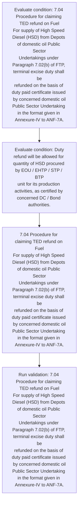
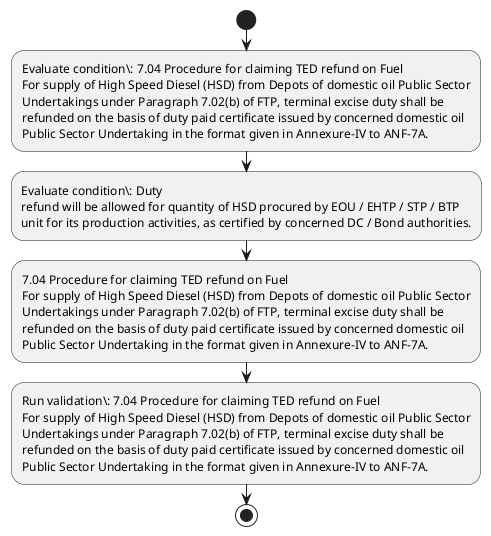

# Chapter 7 / Section 7.04: Procedure for claiming TED refund on Fuel

**Chapter Title:** Deemed Exports

**Pages:** 4

**Purpose:** 7.04 Procedure for claiming TED refund on Fuel
For supply of High Speed Diesel (HSD) from Depots of domestic oil Public Sector
Undertakings under Paragraph 7.02(b) of FTP, terminal excise duty shall be
refunded on the basis of duty paid certificate issued by concerned domestic oil
Public Sector Undertaking in the format given in Annexure-IV to ANF-7A.

**Purpose Thanglish:** Indha Procedure for claiming TED refund on Fuel section-la, 7.04 Procedure for claiming TED refund on Fuel
For supply of High Speed Diesel (HSD) from Depots of domestic oil Public Sector
Undertakings under Paragraph 7.02(b) of FTP, terminal excise duty kandippa be
refunded on the basis of duty paid certificate issued by concerned domestic oil
Public Sector Undertaking in the format given in Annexure-IV to ANF-7A.

**Summary:** 7.04 Procedure for claiming TED refund on Fuel
For supply of High Speed Diesel (HSD) from Depots of domestic oil Public Sector
Undertakings under Paragraph 7.02(b) of FTP, terminal excise duty shall be
refunded on the basis of duty paid certificate issued by concerned domestic oil
Public Sector Undertaking in the format given in Annexure-IV to ANF-7A. Duty
refund will be allowed for quantity of HSD procured by EOU / EHTP / STP / BTP
unit for its production activities, as certified by concerned DC / Bond authorities.

**Business Meaning:** Procedure for claiming TED refund on Fuel governs how DGFT business controls should be applied, validated, and enforced.

**Business Explanation:** Procedure for claiming TED refund on Fuel explains the operating rule set that DEKAI should enforce. Key control points include 7.04 Procedure for claiming TED refund on Fuel
For supply of High Speed Diesel (HSD) from Depots of domestic oil Public Sector
Undertakings under Paragraph 7.02(b) of FTP, terminal excise duty shall be
refunded on the basis of duty paid certificate issued by concerned domestic oil
Public Sector Undertaking in the format given in Annexure-IV to ANF-7A. The section also drives actions such as 7.04 Procedure for claiming TED refund on Fuel
For supply of High Speed Diesel (HSD) from Depots of domestic oil Public Sector
Undertakings under Paragraph 7.02(b) of FTP, terminal excise duty shall be
refunded on the basis of duty paid certificate issued by concerned domestic oil
Public Sector Undertaking in the format given in Annexure-IV to ANF-7A..

**Business Explanation Thanglish:** Indha Procedure for claiming TED refund on Fuel section-la, Procedure for claiming TED refund on Fuel explains the operating rule set that DEKAI should enforce. Key control points include 7.04 Procedure for claiming TED refund on Fuel
For supply of High Speed Diesel (HSD) from Depots of domestic oil Public Sector
Undertakings under Paragraph 7.02(b) of FTP, terminal excise duty kandippa be
refunded on the basis of duty paid certificate issued by concerned domestic oil
Public Sector Undertaking in the format given in Annexure-IV to ANF-7A. The section also drives actions such as 7.04 Procedure for claiming TED refund on Fuel
For supply of High Speed Diesel (HSD) from Depots of domestic oil Public Sector
Undertakings under Paragraph 7.02(b) of FTP, terminal excise duty kandippa be
refunded on the basis of duty paid certificate issued by concerned domestic oil
Public Sector Undertaking in the format given in Annexure-IV to ANF-7A..

## Business Logic
- 7.04 Procedure for claiming TED refund on Fuel
For supply of High Speed Diesel (HSD) from Depots of domestic oil Public Sector
Undertakings under Paragraph 7.02(b) of FTP, terminal excise duty shall be
refunded on the basis of duty paid certificate issued by concerned domestic oil
Public Sector Undertaking in the format given in Annexure-IV to ANF-7A.

## Business Rules
- rule_id=CH7-SEC7_04-R001, rule_description=7.04 Procedure for claiming TED refund on Fuel
For supply of High Speed Diesel (HSD) from Depots of domestic oil Public Sector
Undertakings under Paragraph 7.02(b) of FTP, terminal excise duty shall be
refunded on the basis of duty paid certificate issued by concerned domestic oil
Public Sector Undertaking in the format given in Annexure-IV to ANF-7A., trigger=Procedure for claiming TED refund on Fuel, condition=7.04 Procedure for claiming TED refund on Fuel
For supply of High Speed Diesel (HSD) from Depots of domestic oil Public Sector
Undertakings under Paragraph 7.02(b) of FTP, terminal excise duty shall be
refunded on the basis of duty paid certificate issued by concerned domestic oil
Public Sector Undertaking in the format given in Annexure-IV to ANF-7A., validation=7.04 Procedure for claiming TED refund on Fuel
For supply of High Speed Diesel (HSD) from Depots of domestic oil Public Sector
Undertakings under Paragraph 7.02(b) of FTP, terminal excise duty shall be
refunded on the basis of duty paid certificate issued by concerned domestic oil
Public Sector Undertaking in the format given in Annexure-IV to ANF-7A., action=7.04 Procedure for claiming TED refund on Fuel
For supply of High Speed Diesel (HSD) from Depots of domestic oil Public Sector
Undertakings under Paragraph 7.02(b) of FTP, terminal excise duty shall be
refunded on the basis of duty paid certificate issued by concerned domestic oil
Public Sector Undertaking in the format given in Annexure-IV to ANF-7A., exception=No explicit exception found in uploaded documents., output=DEKAI should produce a compliance decision for 7.04 - Procedure for claiming TED refund on Fuel.

## Conditions
- 7.04 Procedure for claiming TED refund on Fuel
For supply of High Speed Diesel (HSD) from Depots of domestic oil Public Sector
Undertakings under Paragraph 7.02(b) of FTP, terminal excise duty shall be
refunded on the basis of duty paid certificate issued by concerned domestic oil
Public Sector Undertaking in the format given in Annexure-IV to ANF-7A.
- Duty
refund will be allowed for quantity of HSD procured by EOU / EHTP / STP / BTP
unit for its production activities, as certified by concerned DC / Bond authorities.

## Condition Logic
- id=7.7.04.1, if=7.04 Procedure for claiming TED refund on Fuel
For supply of High Speed Diesel (HSD) from Depots of domestic oil Public Sector
Undertakings under Paragraph 7.02(b) of FTP, terminal excise duty shall be
refunded on the basis of duty paid certificate issued by concerned domestic oil
Public Sector Undertaking in the format given in Annexure-IV to ANF-7A., then=7.04 Procedure for claiming TED refund on Fuel
For supply of High Speed Diesel (HSD) from Depots of domestic oil Public Sector
Undertakings under Paragraph 7.02(b) of FTP, terminal excise duty shall be
refunded on the basis of duty paid certificate issued by concerned domestic oil
Public Sector Undertaking in the format given in Annexure-IV to ANF-7A., source=7.04 Procedure for claiming TED refund on Fuel
For supply of High Speed Diesel (HSD) from Depots of domestic oil Public Sector
Undertakings under Paragraph 7.02(b) of FTP, terminal excise duty shall be
refunded on the basis of duty paid certificate issued by concerned domestic oil
Public Sector Undertaking in the format given in Annexure-IV to ANF-7A.
- id=7.7.04.2, if=Duty
refund will be allowed for quantity of HSD procured by EOU / EHTP / STP / BTP
unit for its production activities, as certified by concerned DC / Bond authorities., then=7.04 Procedure for claiming TED refund on Fuel
For supply of High Speed Diesel (HSD) from Depots of domestic oil Public Sector
Undertakings under Paragraph 7.02(b) of FTP, terminal excise duty shall be
refunded on the basis of duty paid certificate issued by concerned domestic oil
Public Sector Undertaking in the format given in Annexure-IV to ANF-7A., source=Duty
refund will be allowed for quantity of HSD procured by EOU / EHTP / STP / BTP
unit for its production activities, as certified by concerned DC / Bond authorities.

## Validations
- 7.04 Procedure for claiming TED refund on Fuel
For supply of High Speed Diesel (HSD) from Depots of domestic oil Public Sector
Undertakings under Paragraph 7.02(b) of FTP, terminal excise duty shall be
refunded on the basis of duty paid certificate issued by concerned domestic oil
Public Sector Undertaking in the format given in Annexure-IV to ANF-7A.

## Exceptions
- None identified

## Dependencies
- 7.02

## Authorities
- None identified

## Required Documents
- Public Sector Undertaking in the format given in Annexure

## Timelines
- None identified

## Actions
- 7.04 Procedure for claiming TED refund on Fuel
For supply of High Speed Diesel (HSD) from Depots of domestic oil Public Sector
Undertakings under Paragraph 7.02(b) of FTP, terminal excise duty shall be
refunded on the basis of duty paid certificate issued by concerned domestic oil
Public Sector Undertaking in the format given in Annexure-IV to ANF-7A.

## Workflow
- Evaluate condition: 7.04 Procedure for claiming TED refund on Fuel
For supply of High Speed Diesel (HSD) from Depots of domestic oil Public Sector
Undertakings under Paragraph 7.02(b) of FTP, terminal excise duty shall be
refunded on the basis of duty paid certificate issued by concerned domestic oil
Public Sector Undertaking in the format given in Annexure-IV to ANF-7A.
- Evaluate condition: Duty
refund will be allowed for quantity of HSD procured by EOU / EHTP / STP / BTP
unit for its production activities, as certified by concerned DC / Bond authorities.
- 7.04 Procedure for claiming TED refund on Fuel
For supply of High Speed Diesel (HSD) from Depots of domestic oil Public Sector
Undertakings under Paragraph 7.02(b) of FTP, terminal excise duty shall be
refunded on the basis of duty paid certificate issued by concerned domestic oil
Public Sector Undertaking in the format given in Annexure-IV to ANF-7A.
- Run validation: 7.04 Procedure for claiming TED refund on Fuel
For supply of High Speed Diesel (HSD) from Depots of domestic oil Public Sector
Undertakings under Paragraph 7.02(b) of FTP, terminal excise duty shall be
refunded on the basis of duty paid certificate issued by concerned domestic oil
Public Sector Undertaking in the format given in Annexure-IV to ANF-7A.

## Workflow ASCII
```text
Procedure for claiming TED refund on Fuel
Evaluate condition: 7.04 Procedure for claiming TED refund on Fuel
For supply of High Speed Diesel (HSD) from Depots of domestic oil Public Sector
Undertakings under Paragraph 7.02(b) of FTP, terminal excise duty shall be
refunded on the basis of duty paid certificate issued by concerned domestic oil
Public Sector Undertaking in the format given in Annexure-IV to ANF-7A.
   |
   v
Evaluate condition: Duty
refund will be allowed for quantity of HSD procured by EOU / EHTP / STP / BTP
unit for its production activities, as certified by concerned DC / Bond authorities.
   |
   v
7.04 Procedure for claiming TED refund on Fuel
For supply of High Speed Diesel (HSD) from Depots of domestic oil Public Sector
Undertakings under Paragraph 7.02(b) of FTP, terminal excise duty shall be
refunded on the basis of duty paid certificate issued by concerned domestic oil
Public Sector Undertaking in the format given in Annexure-IV to ANF-7A.
   |
   v
Run validation: 7.04 Procedure for claiming TED refund on Fuel
For supply of High Speed Diesel (HSD) from Depots of domestic oil Public Sector
Undertakings under Paragraph 7.02(b) of FTP, terminal excise duty shall be
refunded on the basis of duty paid certificate issued by concerned domestic oil
Public Sector Undertaking in the format given in Annexure-IV to ANF-7A.
```

## Decision Tree
- IF 7.04 Procedure for claiming TED refund on Fuel
For supply of High Speed Diesel (HSD) from Depots of domestic oil Public Sector
Undertakings under Paragraph 7.02(b) of FTP, terminal excise duty shall be
refunded on the basis of duty paid certificate issued by concerned domestic oil
Public Sector Undertaking in the format given in Annexure-IV to ANF-7A. THEN 7.04 Procedure for claiming TED refund on Fuel
For supply of High Speed Diesel (HSD) from Depots of domestic oil Public Sector
Undertakings under Paragraph 7.02(b) of FTP, terminal excise duty shall be
refunded on the basis of duty paid certificate issued by concerned domestic oil
Public Sector Undertaking in the format given in Annexure-IV to ANF-7A.
- IF Duty
refund will be allowed for quantity of HSD procured by EOU / EHTP / STP / BTP
unit for its production activities, as certified by concerned DC / Bond authorities. THEN 7.04 Procedure for claiming TED refund on Fuel
For supply of High Speed Diesel (HSD) from Depots of domestic oil Public Sector
Undertakings under Paragraph 7.02(b) of FTP, terminal excise duty shall be
refunded on the basis of duty paid certificate issued by concerned domestic oil
Public Sector Undertaking in the format given in Annexure-IV to ANF-7A.

## Decision Tree ASCII
```text
Procedure for claiming TED refund on Fuel Decision
IF 7.04 Procedure for claiming TED refund on Fuel
For supply of High Speed Diesel (HSD) from Depots of domestic oil Public Sector
Undertakings under Paragraph 7.02(b) of FTP, terminal excise duty shall be
refunded on the basis of duty paid certificate issued by concerned domestic oil
Public Sector Undertaking in the format given in Annexure-IV to ANF-7A. THEN 7.04 Procedure for claiming TED refund on Fuel
For supply of High Speed Diesel (HSD) from Depots of domestic oil Public Sector
Undertakings under Paragraph 7.02(b) of FTP, terminal excise duty shall be
refunded on the basis of duty paid certificate issued by concerned domestic oil
Public Sector Undertaking in the format given in Annexure-IV to ANF-7A.
   |
   v
IF Duty
refund will be allowed for quantity of HSD procured by EOU / EHTP / STP / BTP
unit for its production activities, as certified by concerned DC / Bond authorities. THEN 7.04 Procedure for claiming TED refund on Fuel
For supply of High Speed Diesel (HSD) from Depots of domestic oil Public Sector
Undertakings under Paragraph 7.02(b) of FTP, terminal excise duty shall be
refunded on the basis of duty paid certificate issued by concerned domestic oil
Public Sector Undertaking in the format given in Annexure-IV to ANF-7A.
```

## Examples
- User asks to process Procedure for claiming TED refund on Fuel; the platform checks conditions, validations, and documents before action.

**Real-world Example:** Example: an importer or exporter invokes Procedure for claiming TED refund on Fuel, submits Public Sector Undertaking in the format given in Annexure, and DEKAI uses the extracted rules to 7.04 procedure for claiming ted refund on fuel
for supply of high speed diesel (hsd) from depots of domestic oil public sector
undertakings under paragraph 7.02(b) of ftp, terminal excise duty shall be
refunded on the basis of duty paid certificate issued by concerned domestic oil
public sector undertaking in the format given in annexure-iv to anf-7a..

**Real-world Example Thanglish:** Indha Procedure for claiming TED refund on Fuel section-la, Example: an importer or exporter invokes Procedure for claiming TED refund on Fuel, submits Public Sector Undertaking in the format given in Annexure, and DEKAI uses the extracted rules to 7.04 procedure for claiming ted refund on fuel
for supply of high speed diesel (hsd) from depots of domestic oil public sector
undertakings under paragraph 7.02(b) of ftp, terminal excise duty kandippa be
refunded on the basis of duty paid certificate issued by concerned domestic oil
public sector undertaking in the format given in annexure-iv to anf-7a..

## AI Rules
- IF detected context matches section rule THEN enforce: 7.04 Procedure for claiming TED refund on Fuel
For supply of High Speed Diesel (HSD) from Depots of domestic oil Public Sector
Undertakings under Paragraph 7.02(b) of FTP, terminal excise duty shall be
refunded on the basis of duty paid certificate issued by concerned domestic oil
Public Sector Undertaking in the format given in Annexure-IV to ANF-7A.
- IF validations pass THEN recommend action: 7.04 Procedure for claiming TED refund on Fuel
For supply of High Speed Diesel (HSD) from Depots of domestic oil Public Sector
Undertakings under Paragraph 7.02(b) of FTP, terminal excise duty shall be
refunded on the basis of duty paid certificate issued by concerned domestic oil
Public Sector Undertaking in the format given in Annexure-IV to ANF-7A.

## Database Fields
- name=section_code, type=string, required=True, source=parsed_section_heading
- name=section_title, type=string, required=True, source=parsed_section_heading
- name=for_flag, type=boolean, required=False, source=keyword:for
- name=ted_flag, type=boolean, required=False, source=keyword:TED
- name=hsd_flag, type=boolean, required=False, source=keyword:HSD
- name=oil_flag, type=boolean, required=False, source=keyword:oil
- name=ftp_flag, type=boolean, required=False, source=keyword:FTP
- name=the_flag, type=boolean, required=False, source=keyword:the
- name=eou_flag, type=boolean, required=False, source=keyword:EOU
- name=stp_flag, type=boolean, required=False, source=keyword:STP
- name=document_1_submitted, type=boolean, required=True, source=Public Sector Undertaking in the format given in Annexure

## API Requirements
- method=GET, path=/api/dgft/sections/7.04, purpose=Retrieve knowledge payload for section 7.04, query_params=['include=workflow,decision_tree,validations'], response_fields=['section', 'title', 'summary', 'conditions', 'validations', 'exceptions', 'workflow', 'decision_tree']
- method=POST, path=/api/dgft/Procedure-for-claiming-TED-refund-on-Fuel/validate, purpose=Validate inputs and documents for Procedure for claiming TED refund on Fuel, request_fields=['section_code', 'section_title', 'document_1_submitted'], response_fields=['status', 'errors', 'warnings', 'next_actions']
- method=POST, path=/api/dgft/Procedure-for-claiming-TED-refund-on-Fuel/execute, purpose=Trigger business action for 7.04 Procedure for claiming TED refund on Fuel
For supply of High Speed Diesel (HSD) from Depots of domestic oil Public Sector
Undertakings under Paragraph 7.02(b) of FTP, terminal excise duty shall be
refunded on the basis of duty paid certificate issued by concerned domestic oil
Public Sector Undertaking in the format given in Annexure-IV to ANF-7A., request_fields=['section_code', 'section_title', 'document_1_submitted'], response_fields=['reference_id', 'status', 'authority', 'timeline']

## UI Screens
- screen_id=Procedure_for_claiming_TED_refund_on_Fuel_overview, name=Procedure for claiming TED refund on Fuel Overview, purpose=Show section summary, authority, timeline, and eligibility cues., widgets=['summary_card', 'conditions_table', 'authority_badges', 'timeline_panel']
- screen_id=Procedure_for_claiming_TED_refund_on_Fuel_submission, name=Procedure for claiming TED refund on Fuel Submission, purpose=Capture applicant data and supporting documents., widgets=['dynamic_form', 'document_uploader', 'validation_panel', 'next_action_footer'], fields=['section_code', 'section_title', 'for_flag', 'ted_flag', 'hsd_flag', 'oil_flag', 'ftp_flag', 'the_flag']

## Error Messages
- Validation failed because the section requirements were not fully met.

## FAQ
- question_en=What is the purpose of section 7.04?, answer_en=Procedure for claiming TED refund on Fuel explains the operating rule set that DEKAI should enforce. Key control points include 7.04 Procedure for claiming TED refund on Fuel
For supply of High Speed Diesel (HSD) from Depots of domestic oil Public Sector
Undertakings under Paragraph 7.02(b) of FTP, terminal excise duty shall be
refunded on the basis of duty paid certificate issued by concerned domestic oil
Public Sector Undertaking in the format given in Annexure-IV to ANF-7A. The section also drives actions such as 7.04 Procedure for claiming TED refund on Fuel
For supply of High Speed Diesel (HSD) from Depots of domestic oil Public Sector
Undertakings under Paragraph 7.02(b) of FTP, terminal excise duty shall be
refunded on the basis of duty paid certificate issued by concerned domestic oil
Public Sector Undertaking in the format given in Annexure-IV to ANF-7A.., question_thanglish=Indha Procedure for claiming TED refund on Fuel section-la, What is the purpose of section 7.04?, answer_thanglish=Indha Procedure for claiming TED refund on Fuel section-la, Procedure for claiming TED refund on Fuel explains the operating rule set that DEKAI should enforce. Key control points include 7.04 Procedure for claiming TED refund on Fuel
For supply of High Speed Diesel (HSD) from Depots of domestic oil Public Sector
Undertakings under Paragraph 7.02(b) of FTP, terminal excise duty kandippa be
refunded on the basis of duty paid certificate issued by concerned domestic oil
Public Sector Undertaking in the format given in Annexure-IV to ANF-7A. The section also drives actions such as 7.04 Procedure for claiming TED refund on Fuel
For supply of High Speed Diesel (HSD) from Depots of domestic oil Public Sector
Undertakings under Paragraph 7.02(b) of FTP, terminal excise duty kandippa be
refunded on the basis of duty paid certificate issued by concerned domestic oil
Public Sector Undertaking in the format given in Annexure-IV to ANF-7A..
- question_en=What documents are required under Procedure for claiming TED refund on Fuel?, answer_en=Public Sector Undertaking in the format given in Annexure, question_thanglish=Indha Procedure for claiming TED refund on Fuel section-la, What documents are required under Procedure for claiming TED refund on Fuel?, answer_thanglish=Indha Procedure for claiming TED refund on Fuel section-la, Public Sector Undertaking in the format given in Annexure
- question_en=Which authority handles Procedure for claiming TED refund on Fuel?, answer_en=Not explicitly covered in uploaded documents., question_thanglish=Indha Procedure for claiming TED refund on Fuel section-la, Which authority handles Procedure for claiming TED refund on Fuel?, answer_thanglish=Indha Procedure for claiming TED refund on Fuel section-la, Not explicitly covered in uploaded documents.

## Questions Users May Ask
- What does Procedure for claiming TED refund on Fuel require?
- Which documents are needed for Procedure for claiming TED refund on Fuel?
- How does DEKAI validate Procedure for claiming TED refund on Fuel requests?
- What action should be taken for Procedure for claiming TED refund on Fuel?

## Expected AI Answers
- Procedure for claiming TED refund on Fuel requires the platform to interpret the section text, apply the extracted business rules, and present the correct next action.
- Required documents are inferred from the section text: Public Sector Undertaking in the format given in Annexure
- DEKAI validates Procedure for claiming TED refund on Fuel by checking conditions, required documents, authority references, and exception clauses before recommending an outcome.
- The primary extracted action is: 7.04 Procedure for claiming TED refund on Fuel
For supply of High Speed Diesel (HSD) from Depots of domestic oil Public Sector
Undertakings under Paragraph 7.02(b) of FTP, terminal excise duty shall be
refunded on the basis of duty paid certificate issued by concerned domestic oil
Public Sector Undertaking in the format given in Annexure-IV to ANF-7A.

## AI Q&A Examples
- question_en=User asks: How do I comply with Procedure for claiming TED refund on Fuel?, answer_en=AI answers: DEKAI should evaluate section 7.04, apply the extracted rules, and guide the user through Evaluate condition: 7.04 Procedure for claiming TED refund on Fuel
For supply of High Speed Diesel (HSD) from Depots of domestic oil Public Sector
Undertakings under Paragraph 7.02(b) of FTP, terminal excise duty shall be
refunded on the basis of duty paid certificate issued by concerned domestic oil
Public Sector Undertaking in the format given in Annexure-IV to ANF-7A.., question_thanglish=Indha Procedure for claiming TED refund on Fuel section-la, User asks: How do I comply with Procedure for claiming TED refund on Fuel?, answer_thanglish=Indha Procedure for claiming TED refund on Fuel section-la, AI answers: DEKAI should evaluate section 7.04, apply the extracted rules, and guide the user through Evaluate condition: 7.04 Procedure for claiming TED refund on Fuel
For supply of High Speed Diesel (HSD) from Depots of domestic oil Public Sector
Undertakings under Paragraph 7.02(b) of FTP, terminal excise duty kandippa be
refunded on the basis of duty paid certificate issued by concerned domestic oil
Public Sector Undertaking in the format given in Annexure-IV to ANF-7A..
- question_en=User asks: Which validations apply to Procedure for claiming TED refund on Fuel?, answer_en=AI answers: Applicable validations are 7.04 Procedure for claiming TED refund on Fuel
For supply of High Speed Diesel (HSD) from Depots of domestic oil Public Sector
Undertakings under Paragraph 7.02(b) of FTP, terminal excise duty shall be
refunded on the basis of duty paid certificate issued by concerned domestic oil
Public Sector Undertaking in the format given in Annexure-IV to ANF-7A., question_thanglish=Indha Procedure for claiming TED refund on Fuel section-la, User asks: Which validations apply to Procedure for claiming TED refund on Fuel?, answer_thanglish=Indha Procedure for claiming TED refund on Fuel section-la, AI answers: Applicable validations are 7.04 Procedure for claiming TED refund on Fuel
For supply of High Speed Diesel (HSD) from Depots of domestic oil Public Sector
Undertakings under Paragraph 7.02(b) of FTP, terminal excise duty kandippa be
refunded on the basis of duty paid certificate issued by concerned domestic oil
Public Sector Undertaking in the format given in Annexure-IV to ANF-7A.

## DEKAI AI Implementation Notes
- Capture chapter 7, section 7.04, title, and page references as immutable knowledge metadata.
- Bind validations for Procedure for claiming TED refund on Fuel into a rule engine keyed by the rule IDs extracted for this section.
- Expose document upload controls for: Public Sector Undertaking in the format given in Annexure.
- Show contextual links to related sections: 7.02.

## DEKAI AI Implementation Notes Thanglish
- Indha Procedure for claiming TED refund on Fuel section-la, Capture chapter 7, section 7.04, title, and page references as immutable knowledge metadata.
- Indha Procedure for claiming TED refund on Fuel section-la, Bind validations for Procedure for claiming TED refund on Fuel into a rule engine keyed by the rule IDs extracted for this section.
- Indha Procedure for claiming TED refund on Fuel section-la, Expose document upload controls for: Public Sector Undertaking in the format given in Annexure.
- Indha Procedure for claiming TED refund on Fuel section-la, Show contextual links to related sections: 7.02.

## AI Metadata
- Keywords: for, TED, HSD, oil, FTP, the, EOU, STP, BTP, its, Fuel, High, from, duty, paid, ANF-, will, EHTP, unit, Bond
- Search Keywords: for, TED, HSD, oil, FTP, the, EOU, STP, BTP, its, Fuel, High, from, duty, paid, ANF-, will, EHTP, unit, Bond
- Intent: Support Procedure for claiming TED refund on Fuel processing and compliance validation.
- Tags: 7.04, Procedure for claiming TED refund on Fuel, business-rule, document-driven, dgft
- Related Sections: 7.02
- Related Chapters: 
- Related Rules: 7.04 Procedure for claiming TED refund on Fuel
For supply of High Speed Diesel (HSD) from Depots of domestic oil Public Sector
Undertakings under Paragraph 7.02(b) of FTP, terminal excise duty shall be
refunded on the basis of duty paid certificate issued by concerned domestic oil
Public Sector Undertaking in the format given in Annexure-IV to ANF-7A.

## Mermaid


## PlantUML

