# Chapter 7 / Section 7.05: Frequency of application and time period for claiming TED /

**Chapter Title:** Deemed Exports

**Pages:** 4

**Purpose:** 7.05 Frequency of application and time period for claiming TED /
Drawback
(a) In respect of supplies covered in Paragraphs 7.02 (a) to (c) of FTP,
application for TED refund / drawback (whichever applicable) may be filed
within 12 months from the date of realisation of 100% payment against
such supplies.

**Purpose Thanglish:** Indha Frequency of application and time period for claiming TED / section-la, 7.05 Frequency of application and time period for claiming TED /
Drawback
(a) In respect of supplies covered in Paragraphs 7.02 (a) to (c) of FTP,
application for TED refund / drawback (whichever applicable) may be filed
within 12 months from the date of realisation of 100% payment against
such supplies.

**Summary:** 7.05 Frequency of application and time period for claiming TED /
Drawback
(a) In respect of supplies covered in Paragraphs 7.02 (a) to (c) of FTP,
application for TED refund / drawback (whichever applicable) may be filed
within 12 months from the date of realisation of 100% payment against
such supplies. In cases where payment is received in advance and supply is
made subsequently, in such cases application can be filed within
12 months from the last date of such supplies. Claim can be filed
‘Invalidation Letter / ARO wise’ against individual Authorisation within the
time limit as specified above.

**Business Meaning:** Frequency of application and time period for claiming TED / governs how DGFT business controls should be applied, validated, and enforced.

**Business Explanation:** Frequency of application and time period for claiming TED / explains the operating rule set that DEKAI should enforce. Key control points include Claims should be filed within a period of twelve months
from date of receipt of supplies by project authority or from date of receipt
of the payment by supplier as per the option of applicant, either against a
particular project or all the projects. The section also drives actions such as 7.05 Frequency of application and time period for claiming TED /
Drawback
(a) In respect of supplies covered in Paragraphs 7.02 (a) to (c) of FTP,
application for TED refund / drawback (whichever applicable) may be filed
within 12 months from the date of realisation of 100% payment against
such supplies..

**Business Explanation Thanglish:** Indha Frequency of application and time period for claiming TED / section-la, Frequency of application and time period for claiming TED / explains the operating rule set that DEKAI should enforce. Key control points include Claims should be filed within a period of twelve months
from date of receipt of supplies by project authority or from date of receipt
of the payment by supplier as per the option of applicant, either against a
particular project or all the projects. The section also drives actions such as 7.05 Frequency of application and time period for claiming TED /
Drawback
(a) In respect of supplies covered in Paragraphs 7.02 (a) to (c) of FTP,
application for TED refund / drawback (whichever applicable) may be filed
within 12 months from the date of realisation of 100% payment against
such supplies..

## Business Logic
- Claims should be filed within a period of twelve months
from date of receipt of supplies by project authority or from date of receipt
of the payment by supplier as per the option of applicant, either against a
particular project or all the projects.
- (c) An application under ANF 7A shall pertain to only one category of
supply as specified in Para 7.02 of the FTP.
- (c)
An application under ANF 7A shall pertain to only one category of
supply as specified in Para 7.02 of the FTP.

## Business Rules
- rule_id=CH7-SEC7_05-R001, rule_description=Claims should be filed within a period of twelve months
from date of receipt of supplies by project authority or from date of receipt
of the payment by supplier as per the option of applicant, either against a
particular project or all the projects., trigger=Frequency of application and time period for claiming TED /, condition=In cases where payment is received in advance and supply is
made subsequently, in such cases application can be filed within
12 months from the last date of such supplies., validation=(c) An application under ANF 7A shall pertain to only one category of
supply as specified in Para 7.02 of the FTP., action=7.05 Frequency of application and time period for claiming TED /
Drawback
(a) In respect of supplies covered in Paragraphs 7.02 (a) to (c) of FTP,
application for TED refund / drawback (whichever applicable) may be filed
within 12 months from the date of realisation of 100% payment against
such supplies., exception=However, benefit will be limited to the
extent of payment received., output=DEKAI should produce a compliance decision for 7.05 - Frequency of application and time period for claiming TED /.
- rule_id=CH7-SEC7_05-R002, rule_description=(c) An application under ANF 7A shall pertain to only one category of
supply as specified in Para 7.02 of the FTP., trigger=Frequency of application and time period for claiming TED /, condition=Claim can be filed
‘Invalidation Letter / ARO wise’ against individual Authorisation within the
time limit as specified above., validation=(c)
An application under ANF 7A shall pertain to only one category of
supply as specified in Para 7.02 of the FTP., action=In cases where payment is received in advance and supply is
made subsequently, in such cases application can be filed within
12 months from the last date of such supplies., exception=However, benefit will be limited to the
extent of payment received., output=DEKAI should produce a compliance decision for 7.05 - Frequency of application and time period for claiming TED /.
- rule_id=CH7-SEC7_05-R003, rule_description=(c)
An application under ANF 7A shall pertain to only one category of
supply as specified in Para 7.02 of the FTP., trigger=Frequency of application and time period for claiming TED /, condition=Claims may also be filed where part
payments have been received., validation=(c)
An application under ANF 7A shall pertain to only one category of
supply as specified in Para 7.02 of the FTP., action=(b) In respect of supplies covered in Paragraphs 7.02 (d) to (g) of FTP,
claim may be filed either on the basis of proof of supplies effected or
payment received., exception=However, benefit will be limited to the
extent of payment received., output=DEKAI should produce a compliance decision for 7.05 - Frequency of application and time period for claiming TED /.

## Conditions
- In cases where payment is received in advance and supply is
made subsequently, in such cases application can be filed within
12 months from the last date of such supplies.
- Claim can be filed
‘Invalidation Letter / ARO wise’ against individual Authorisation within the
time limit as specified above.
- Claims may also be filed where part
payments have been received.
- Deemed export benefits may be allowed after
100% supplies have been made.
- (c) An application under ANF 7A shall pertain to only one category of
supply as specified in Para 7.02 of the FTP.
- In respect of supplies covered under
Paragraph 7.02 (d) to (g) of the FTP, payment certificate issued by Project
Authority, in Appendix-7D, has also to be submitted.
- (g)
Sub-contractor can also file claim provided its name is endorsed in
the Project Authority Certificate / Contract before supply of such goods.
- (c)
An application under ANF 7A shall pertain to only one category of
supply as specified in Para 7.02 of the FTP.

## Condition Logic
- id=7.7.05.1, if=In cases where payment is received in advance and supply is
made subsequently, in such cases application can be filed within
12 months from the last date of such supplies., then=7.05 Frequency of application and time period for claiming TED /
Drawback
(a) In respect of supplies covered in Paragraphs 7.02 (a) to (c) of FTP,
application for TED refund / drawback (whichever applicable) may be filed
within 12 months from the date of realisation of 100% payment against
such supplies., source=In cases where payment is received in advance and supply is
made subsequently, in such cases application can be filed within
12 months from the last date of such supplies.
- id=7.7.05.2, if=Claim can be filed
‘Invalidation Letter / ARO wise’ against individual Authorisation within the
time limit as specified above., then=7.05 Frequency of application and time period for claiming TED /
Drawback
(a) In respect of supplies covered in Paragraphs 7.02 (a) to (c) of FTP,
application for TED refund / drawback (whichever applicable) may be filed
within 12 months from the date of realisation of 100% payment against
such supplies., source=Claim can be filed
‘Invalidation Letter / ARO wise’ against individual Authorisation within the
time limit as specified above.
- id=7.7.05.3, if=Claims may also be filed where part
payments have been received., then=7.05 Frequency of application and time period for claiming TED /
Drawback
(a) In respect of supplies covered in Paragraphs 7.02 (a) to (c) of FTP,
application for TED refund / drawback (whichever applicable) may be filed
within 12 months from the date of realisation of 100% payment against
such supplies., source=Claims may also be filed where part
payments have been received.
- id=7.7.05.4, if=Deemed export benefits may be allowed after
100% supplies have been made., then=7.05 Frequency of application and time period for claiming TED /
Drawback
(a) In respect of supplies covered in Paragraphs 7.02 (a) to (c) of FTP,
application for TED refund / drawback (whichever applicable) may be filed
within 12 months from the date of realisation of 100% payment against
such supplies., source=Deemed export benefits may be allowed after
100% supplies have been made.
- id=7.7.05.5, if=(c) An application under ANF 7A shall pertain to only one category of
supply as specified in Para 7.02 of the FTP., then=7.05 Frequency of application and time period for claiming TED /
Drawback
(a) In respect of supplies covered in Paragraphs 7.02 (a) to (c) of FTP,
application for TED refund / drawback (whichever applicable) may be filed
within 12 months from the date of realisation of 100% payment against
such supplies., source=(c) An application under ANF 7A shall pertain to only one category of
supply as specified in Para 7.02 of the FTP.
- id=7.7.05.6, if=In respect of supplies covered under
Paragraph 7.02 (d) to (g) of the FTP, payment certificate issued by Project
Authority, in Appendix-7D, has also to be submitted., then=7.05 Frequency of application and time period for claiming TED /
Drawback
(a) In respect of supplies covered in Paragraphs 7.02 (a) to (c) of FTP,
application for TED refund / drawback (whichever applicable) may be filed
within 12 months from the date of realisation of 100% payment against
such supplies., source=In respect of supplies covered under
Paragraph 7.02 (d) to (g) of the FTP, payment certificate issued by Project
Authority, in Appendix-7D, has also to be submitted.
- id=7.7.05.7, if=(g)
Sub-contractor can also file claim provided its name is endorsed in
the Project Authority Certificate / Contract before supply of such goods., then=7.05 Frequency of application and time period for claiming TED /
Drawback
(a) In respect of supplies covered in Paragraphs 7.02 (a) to (c) of FTP,
application for TED refund / drawback (whichever applicable) may be filed
within 12 months from the date of realisation of 100% payment against
such supplies., source=(g)
Sub-contractor can also file claim provided its name is endorsed in
the Project Authority Certificate / Contract before supply of such goods.
- id=7.7.05.8, if=(c)
An application under ANF 7A shall pertain to only one category of
supply as specified in Para 7.02 of the FTP., then=7.05 Frequency of application and time period for claiming TED /
Drawback
(a) In respect of supplies covered in Paragraphs 7.02 (a) to (c) of FTP,
application for TED refund / drawback (whichever applicable) may be filed
within 12 months from the date of realisation of 100% payment against
such supplies., source=(c)
An application under ANF 7A shall pertain to only one category of
supply as specified in Para 7.02 of the FTP.

## Validations
- (c) An application under ANF 7A shall pertain to only one category of
supply as specified in Para 7.02 of the FTP.
- (c)
An application under ANF 7A shall pertain to only one category of
supply as specified in Para 7.02 of the FTP.

## Exceptions
- However, benefit will be limited to the
extent of payment received.

## Dependencies
- 7.02

## Authorities
- Project Authority

## Required Documents
- 7.05 Frequency of application and time period for claiming TED /
Drawback
(a) In respect of supplies covered in Paragraphs 7.02 (a) to (c) of FTP,
application for TED refund / drawback (whichever applicable) may be filed
within 12 months from the date of realisation of 100% payment against
such supplies.
- In cases where payment is received in advance and supply is
made subsequently, in such cases application can be filed within
12 months from the last date of such supplies.
- (b) In respect of supplies covered in Paragraphs 7.02 (d) to (g) of FTP,
claim may be filed either on the basis of proof of supplies effected or
payment received.
- (c) An application under ANF 7A shall pertain to only one category of
supply as specified in Para 7.02 of the FTP.
- Filing a single application for
multiple categories of supplies under Para 7.02 of FTP is not permissible.
- In other words, supply documents have to be
negotiated through bank only.
- In respect of supplies covered under
Paragraph 7.02 (d) to (g) of the FTP, payment certificate issued by Project
Authority, in Appendix-7D, has also to be submitted.
- Project Authority Certificate
- 7.05 Frequency of application and time period for claiming TED /
Drawback
(a)
In respect of supplies covered in Paragraphs 7.02 (a) to (c) of FTP,
application for TED refund / drawback (whichever applicable) may be filed
within 12 months from the date of realisation of 100% payment against
such supplies.
- (b)
In respect of supplies covered in Paragraphs 7.02 (d) to (g) of FTP,
claim may be filed either on the basis of proof of supplies effected or
payment received.
- (c)
An application under ANF 7A shall pertain to only one category of
supply as specified in Para 7.02 of the FTP.

## Timelines
- 7.05 Frequency of application and time period for claiming TED /
Drawback
(a) In respect of supplies covered in Paragraphs 7.02 (a) to (c) of FTP,
application for TED refund / drawback (whichever applicable) may be filed
within 12 months from the date of realisation of 100% payment against
such supplies.
- In cases where payment is received in advance and supply is
made subsequently, in such cases application can be filed within
12 months from the last date of such supplies.
- Claim can be filed
‘Invalidation Letter / ARO wise’ against individual Authorisation within the
time limit as specified above.
- Claims should be filed within a period of twelve months
from date of receipt of supplies by project authority or from date of receipt
of the payment by supplier as per the option of applicant, either against a
particular project or all the projects.
- Deemed export benefits may be allowed after
100% supplies have been made.
- (g)
Sub-contractor can also file claim provided its name is endorsed in
the Project Authority Certificate / Contract before supply of such goods.
- 7.05 Frequency of application and time period for claiming TED /
Drawback
(a)
In respect of supplies covered in Paragraphs 7.02 (a) to (c) of FTP,
application for TED refund / drawback (whichever applicable) may be filed
within 12 months from the date of realisation of 100% payment against
such supplies.

## Actions
- 7.05 Frequency of application and time period for claiming TED /
Drawback
(a) In respect of supplies covered in Paragraphs 7.02 (a) to (c) of FTP,
application for TED refund / drawback (whichever applicable) may be filed
within 12 months from the date of realisation of 100% payment against
such supplies.
- In cases where payment is received in advance and supply is
made subsequently, in such cases application can be filed within
12 months from the last date of such supplies.
- (b) In respect of supplies covered in Paragraphs 7.02 (d) to (g) of FTP,
claim may be filed either on the basis of proof of supplies effected or
payment received.
- Claims should be filed within a period of twelve months
from date of receipt of supplies by project authority or from date of receipt
of the payment by supplier as per the option of applicant, either against a
particular project or all the projects.
- Claims may also be filed where part
payments have been received.
- However, benefit will be limited to the
extent of payment received.
- 160
(f)
Claim can be filed against payment received through normal banking
channel, as per e-BRC.
- In respect of supplies covered under
Paragraph 7.02 (d) to (g) of the FTP, payment certificate issued by Project
Authority, in Appendix-7D, has also to be submitted.
- 7.05 Frequency of application and time period for claiming TED /
Drawback
(a)
In respect of supplies covered in Paragraphs 7.02 (a) to (c) of FTP,
application for TED refund / drawback (whichever applicable) may be filed
within 12 months from the date of realisation of 100% payment against
such supplies.
- (b)
In respect of supplies covered in Paragraphs 7.02 (d) to (g) of FTP,
claim may be filed either on the basis of proof of supplies effected or
payment received.

## Workflow
- Evaluate condition: In cases where payment is received in advance and supply is
made subsequently, in such cases application can be filed within
12 months from the last date of such supplies.
- Evaluate condition: Claim can be filed
‘Invalidation Letter / ARO wise’ against individual Authorisation within the
time limit as specified above.
- Evaluate condition: Claims may also be filed where part
payments have been received.
- 7.05 Frequency of application and time period for claiming TED /
Drawback
(a) In respect of supplies covered in Paragraphs 7.02 (a) to (c) of FTP,
application for TED refund / drawback (whichever applicable) may be filed
within 12 months from the date of realisation of 100% payment against
such supplies.
- In cases where payment is received in advance and supply is
made subsequently, in such cases application can be filed within
12 months from the last date of such supplies.
- (b) In respect of supplies covered in Paragraphs 7.02 (d) to (g) of FTP,
claim may be filed either on the basis of proof of supplies effected or
payment received.
- Claims should be filed within a period of twelve months
from date of receipt of supplies by project authority or from date of receipt
of the payment by supplier as per the option of applicant, either against a
particular project or all the projects.
- Claims may also be filed where part
payments have been received.
- However, benefit will be limited to the
extent of payment received.
- Run validation: (c) An application under ANF 7A shall pertain to only one category of
supply as specified in Para 7.02 of the FTP.
- Run validation: (c)
An application under ANF 7A shall pertain to only one category of
supply as specified in Para 7.02 of the FTP.
- Handle exception: However, benefit will be limited to the
extent of payment received.

## Workflow ASCII
```text
Frequency of application and time period for claiming TED /
Evaluate condition: In cases where payment is received in advance and supply is
made subsequently, in such cases application can be filed within
12 months from the last date of such supplies.
   |
   v
Evaluate condition: Claim can be filed
‘Invalidation Letter / ARO wise’ against individual Authorisation within the
time limit as specified above.
   |
   v
Evaluate condition: Claims may also be filed where part
payments have been received.
   |
   v
7.05 Frequency of application and time period for claiming TED /
Drawback
(a) In respect of supplies covered in Paragraphs 7.02 (a) to (c) of FTP,
application for TED refund / drawback (whichever applicable) may be filed
within 12 months from the date of realisation of 100% payment against
such supplies.
   |
   v
In cases where payment is received in advance and supply is
made subsequently, in such cases application can be filed within
12 months from the last date of such supplies.
   |
   v
(b) In respect of supplies covered in Paragraphs 7.02 (d) to (g) of FTP,
claim may be filed either on the basis of proof of supplies effected or
payment received.
   |
   v
Claims should be filed within a period of twelve months
from date of receipt of supplies by project authority or from date of receipt
of the payment by supplier as per the option of applicant, either against a
particular project or all the projects.
   |
   v
Claims may also be filed where part
payments have been received.
   |
   v
However, benefit will be limited to the
extent of payment received.
   |
   v
Run validation: (c) An application under ANF 7A shall pertain to only one category of
supply as specified in Para 7.02 of the FTP.
   |
   v
Run validation: (c)
An application under ANF 7A shall pertain to only one category of
supply as specified in Para 7.02 of the FTP.
   |
   v
Handle exception: However, benefit will be limited to the
extent of payment received.
```

## Decision Tree
- IF In cases where payment is received in advance and supply is
made subsequently, in such cases application can be filed within
12 months from the last date of such supplies. THEN 7.05 Frequency of application and time period for claiming TED /
Drawback
(a) In respect of supplies covered in Paragraphs 7.02 (a) to (c) of FTP,
application for TED refund / drawback (whichever applicable) may be filed
within 12 months from the date of realisation of 100% payment against
such supplies.
- IF Claim can be filed
‘Invalidation Letter / ARO wise’ against individual Authorisation within the
time limit as specified above. THEN 7.05 Frequency of application and time period for claiming TED /
Drawback
(a) In respect of supplies covered in Paragraphs 7.02 (a) to (c) of FTP,
application for TED refund / drawback (whichever applicable) may be filed
within 12 months from the date of realisation of 100% payment against
such supplies.
- IF Claims may also be filed where part
payments have been received. THEN 7.05 Frequency of application and time period for claiming TED /
Drawback
(a) In respect of supplies covered in Paragraphs 7.02 (a) to (c) of FTP,
application for TED refund / drawback (whichever applicable) may be filed
within 12 months from the date of realisation of 100% payment against
such supplies.
- IF Deemed export benefits may be allowed after
100% supplies have been made. THEN 7.05 Frequency of application and time period for claiming TED /
Drawback
(a) In respect of supplies covered in Paragraphs 7.02 (a) to (c) of FTP,
application for TED refund / drawback (whichever applicable) may be filed
within 12 months from the date of realisation of 100% payment against
such supplies.
- IF (c) An application under ANF 7A shall pertain to only one category of
supply as specified in Para 7.02 of the FTP. THEN 7.05 Frequency of application and time period for claiming TED /
Drawback
(a) In respect of supplies covered in Paragraphs 7.02 (a) to (c) of FTP,
application for TED refund / drawback (whichever applicable) may be filed
within 12 months from the date of realisation of 100% payment against
such supplies.
- IF exception applies (However, benefit will be limited to the
extent of payment received.) THEN route to manual review

## Decision Tree ASCII
```text
Frequency of application and time period for claiming TED / Decision
IF In cases where payment is received in advance and supply is
made subsequently, in such cases application can be filed within
12 months from the last date of such supplies. THEN 7.05 Frequency of application and time period for claiming TED /
Drawback
(a) In respect of supplies covered in Paragraphs 7.02 (a) to (c) of FTP,
application for TED refund / drawback (whichever applicable) may be filed
within 12 months from the date of realisation of 100% payment against
such supplies.
   |
   v
IF Claim can be filed
‘Invalidation Letter / ARO wise’ against individual Authorisation within the
time limit as specified above. THEN 7.05 Frequency of application and time period for claiming TED /
Drawback
(a) In respect of supplies covered in Paragraphs 7.02 (a) to (c) of FTP,
application for TED refund / drawback (whichever applicable) may be filed
within 12 months from the date of realisation of 100% payment against
such supplies.
   |
   v
IF Claims may also be filed where part
payments have been received. THEN 7.05 Frequency of application and time period for claiming TED /
Drawback
(a) In respect of supplies covered in Paragraphs 7.02 (a) to (c) of FTP,
application for TED refund / drawback (whichever applicable) may be filed
within 12 months from the date of realisation of 100% payment against
such supplies.
   |
   v
IF Deemed export benefits may be allowed after
100% supplies have been made. THEN 7.05 Frequency of application and time period for claiming TED /
Drawback
(a) In respect of supplies covered in Paragraphs 7.02 (a) to (c) of FTP,
application for TED refund / drawback (whichever applicable) may be filed
within 12 months from the date of realisation of 100% payment against
such supplies.
   |
   v
IF (c) An application under ANF 7A shall pertain to only one category of
supply as specified in Para 7.02 of the FTP. THEN 7.05 Frequency of application and time period for claiming TED /
Drawback
(a) In respect of supplies covered in Paragraphs 7.02 (a) to (c) of FTP,
application for TED refund / drawback (whichever applicable) may be filed
within 12 months from the date of realisation of 100% payment against
such supplies.
   |
   v
IF exception applies (However, benefit will be limited to the
extent of payment received.) THEN route to manual review
```

## Examples
- User asks to process Frequency of application and time period for claiming TED /; the platform checks conditions, validations, and documents before action.

**Real-world Example:** Example: an importer or exporter invokes Frequency of application and time period for claiming TED /, submits 7.05 Frequency of application and time period for claiming TED /
Drawback
(a) In respect of supplies covered in Paragraphs 7.02 (a) to (c) of FTP,
application for TED refund / drawback (whichever applicable) may be filed
within 12 months from the date of realisation of 100% payment against
such supplies., In cases where payment is received in advance and supply is
made subsequently, in such cases application can be filed within
12 months from the last date of such supplies., (b) In respect of supplies covered in Paragraphs 7.02 (d) to (g) of FTP,
claim may be filed either on the basis of proof of supplies effected or
payment received., and DEKAI uses the extracted rules to 7.05 frequency of application and time period for claiming ted /
drawback
(a) in respect of supplies covered in paragraphs 7.02 (a) to (c) of ftp,
application for ted refund / drawback (whichever applicable) may be filed
within 12 months from the date of realisation of 100% payment against
such supplies..

**Real-world Example Thanglish:** Indha Frequency of application and time period for claiming TED / section-la, Example: an importer or exporter invokes Frequency of application and time period for claiming TED /, submits 7.05 Frequency of application and time period for claiming TED /
Drawback
(a) In respect of supplies covered in Paragraphs 7.02 (a) to (c) of FTP,
application for TED refund / drawback (whichever applicable) may be filed
within 12 months from the date of realisation of 100% payment against
such supplies., In cases where payment is received in advance and supply is
made subsequently, in such cases application can be filed within
12 months from the last date of such supplies., (b) In respect of supplies covered in Paragraphs 7.02 (d) to (g) of FTP,
claim may be filed either on the basis of proof of supplies effected or
payment received., and DEKAI uses the extracted rules to 7.05 frequency of application and time period for claiming ted /
drawback
(a) in respect of supplies covered in paragraphs 7.02 (a) to (c) of ftp,
application for ted refund / drawback (whichever applicable) may be filed
within 12 months from the date of realisation of 100% payment against
such supplies..

## AI Rules
- IF detected context matches section rule THEN enforce: Claims should be filed within a period of twelve months
from date of receipt of supplies by project authority or from date of receipt
of the payment by supplier as per the option of applicant, either against a
particular project or all the projects.
- IF detected context matches section rule THEN enforce: (c) An application under ANF 7A shall pertain to only one category of
supply as specified in Para 7.02 of the FTP.
- IF detected context matches section rule THEN enforce: (c)
An application under ANF 7A shall pertain to only one category of
supply as specified in Para 7.02 of the FTP.
- IF validations pass THEN recommend action: 7.05 Frequency of application and time period for claiming TED /
Drawback
(a) In respect of supplies covered in Paragraphs 7.02 (a) to (c) of FTP,
application for TED refund / drawback (whichever applicable) may be filed
within 12 months from the date of realisation of 100% payment against
such supplies.

## Database Fields
- name=section_code, type=string, required=True, source=parsed_section_heading
- name=section_title, type=string, required=True, source=parsed_section_heading
- name=and_flag, type=boolean, required=False, source=keyword:and
- name=for_flag, type=boolean, required=False, source=keyword:for
- name=ted_flag, type=boolean, required=False, source=keyword:TED
- name=ftp_flag, type=boolean, required=False, source=keyword:FTP
- name=may_flag, type=boolean, required=False, source=keyword:may
- name=the_flag, type=boolean, required=False, source=keyword:the
- name=can_flag, type=boolean, required=False, source=keyword:can
- name=aro_flag, type=boolean, required=False, source=keyword:ARO
- name=document_1_submitted, type=boolean, required=True, source=7.05 Frequency of application and time period for claiming TED /
Drawback
(a) In respect of supplies covered in Paragraphs 7.02 (a) to (c) of FTP,
application for TED refund / drawback (whichever applicable) may be filed
within 12 months from the date of realisation of 100% payment against
such supplies.
- name=document_2_submitted, type=boolean, required=True, source=In cases where payment is received in advance and supply is
made subsequently, in such cases application can be filed within
12 months from the last date of such supplies.
- name=document_3_submitted, type=boolean, required=True, source=(b) In respect of supplies covered in Paragraphs 7.02 (d) to (g) of FTP,
claim may be filed either on the basis of proof of supplies effected or
payment received.
- name=document_4_submitted, type=boolean, required=True, source=(c) An application under ANF 7A shall pertain to only one category of
supply as specified in Para 7.02 of the FTP.
- name=document_5_submitted, type=boolean, required=True, source=Filing a single application for
multiple categories of supplies under Para 7.02 of FTP is not permissible.
- name=document_6_submitted, type=boolean, required=True, source=In other words, supply documents have to be
negotiated through bank only.

## API Requirements
- method=GET, path=/api/dgft/sections/7.05, purpose=Retrieve knowledge payload for section 7.05, query_params=['include=workflow,decision_tree,validations'], response_fields=['section', 'title', 'summary', 'conditions', 'validations', 'exceptions', 'workflow', 'decision_tree']
- method=POST, path=/api/dgft/Frequency-of-application-and-time-period-for-claiming-TED/validate, purpose=Validate inputs and documents for Frequency of application and time period for claiming TED /, request_fields=['section_code', 'section_title', 'document_1_submitted', 'document_2_submitted', 'document_3_submitted', 'document_4_submitted', 'document_5_submitted', 'document_6_submitted'], response_fields=['status', 'errors', 'warnings', 'next_actions']
- method=POST, path=/api/dgft/Frequency-of-application-and-time-period-for-claiming-TED/execute, purpose=Trigger business action for 7.05 Frequency of application and time period for claiming TED /
Drawback
(a) In respect of supplies covered in Paragraphs 7.02 (a) to (c) of FTP,
application for TED refund / drawback (whichever applicable) may be filed
within 12 months from the date of realisation of 100% payment against
such supplies., request_fields=['section_code', 'section_title', 'document_1_submitted', 'document_2_submitted', 'document_3_submitted', 'document_4_submitted', 'document_5_submitted', 'document_6_submitted'], response_fields=['reference_id', 'status', 'authority', 'timeline']

## UI Screens
- screen_id=Frequency_of_application_and_time_period_for_claiming_TED_overview, name=Frequency of application and time period for claiming TED / Overview, purpose=Show section summary, authority, timeline, and eligibility cues., widgets=['summary_card', 'conditions_table', 'authority_badges', 'timeline_panel']
- screen_id=Frequency_of_application_and_time_period_for_claiming_TED_submission, name=Frequency of application and time period for claiming TED / Submission, purpose=Capture applicant data and supporting documents., widgets=['dynamic_form', 'document_uploader', 'validation_panel', 'next_action_footer'], fields=['section_code', 'section_title', 'and_flag', 'for_flag', 'ted_flag', 'ftp_flag', 'may_flag', 'the_flag']
- screen_id=Frequency_of_application_and_time_period_for_claiming_TED_exceptions, name=Frequency of application and time period for claiming TED / Exception Review, purpose=Explain exception handling and manual review triggers., widgets=['exception_banner', 'decision_tree', 'case_notes']

## Error Messages
- Validation failed because the section requirements were not fully met.

## FAQ
- question_en=What is the purpose of section 7.05?, answer_en=Frequency of application and time period for claiming TED / explains the operating rule set that DEKAI should enforce. Key control points include Claims should be filed within a period of twelve months
from date of receipt of supplies by project authority or from date of receipt
of the payment by supplier as per the option of applicant, either against a
particular project or all the projects. The section also drives actions such as 7.05 Frequency of application and time period for claiming TED /
Drawback
(a) In respect of supplies covered in Paragraphs 7.02 (a) to (c) of FTP,
application for TED refund / drawback (whichever applicable) may be filed
within 12 months from the date of realisation of 100% payment against
such supplies.., question_thanglish=Indha Frequency of application and time period for claiming TED / section-la, What is the purpose of section 7.05?, answer_thanglish=Indha Frequency of application and time period for claiming TED / section-la, Frequency of application and time period for claiming TED / explains the operating rule set that DEKAI should enforce. Key control points include Claims should be filed within a period of twelve months
from date of receipt of supplies by project authority or from date of receipt
of the payment by supplier as per the option of applicant, either against a
particular project or all the projects. The section also drives actions such as 7.05 Frequency of application and time period for claiming TED /
Drawback
(a) In respect of supplies covered in Paragraphs 7.02 (a) to (c) of FTP,
application for TED refund / drawback (whichever applicable) may be filed
within 12 months from the date of realisation of 100% payment against
such supplies..
- question_en=What documents are required under Frequency of application and time period for claiming TED /?, answer_en=7.05 Frequency of application and time period for claiming TED /
Drawback
(a) In respect of supplies covered in Paragraphs 7.02 (a) to (c) of FTP,
application for TED refund / drawback (whichever applicable) may be filed
within 12 months from the date of realisation of 100% payment against
such supplies., In cases where payment is received in advance and supply is
made subsequently, in such cases application can be filed within
12 months from the last date of such supplies., (b) In respect of supplies covered in Paragraphs 7.02 (d) to (g) of FTP,
claim may be filed either on the basis of proof of supplies effected or
payment received., (c) An application under ANF 7A shall pertain to only one category of
supply as specified in Para 7.02 of the FTP., Filing a single application for
multiple categories of supplies under Para 7.02 of FTP is not permissible., In other words, supply documents have to be
negotiated through bank only., In respect of supplies covered under
Paragraph 7.02 (d) to (g) of the FTP, payment certificate issued by Project
Authority, in Appendix-7D, has also to be submitted., Project Authority Certificate, 7.05 Frequency of application and time period for claiming TED /
Drawback
(a)
In respect of supplies covered in Paragraphs 7.02 (a) to (c) of FTP,
application for TED refund / drawback (whichever applicable) may be filed
within 12 months from the date of realisation of 100% payment against
such supplies., (b)
In respect of supplies covered in Paragraphs 7.02 (d) to (g) of FTP,
claim may be filed either on the basis of proof of supplies effected or
payment received., (c)
An application under ANF 7A shall pertain to only one category of
supply as specified in Para 7.02 of the FTP., question_thanglish=Indha Frequency of application and time period for claiming TED / section-la, What documents are required under Frequency of application and time period for claiming TED /?, answer_thanglish=Indha Frequency of application and time period for claiming TED / section-la, 7.05 Frequency of application and time period for claiming TED /
Drawback
(a) In respect of supplies covered in Paragraphs 7.02 (a) to (c) of FTP,
application for TED refund / drawback (whichever applicable) may be filed
within 12 months from the date of realisation of 100% payment against
such supplies., In cases where payment is received in advance and supply is
made subsequently, in such cases application can be filed within
12 months from the last date of such supplies., (b) In respect of supplies covered in Paragraphs 7.02 (d) to (g) of FTP,
claim may be filed either on the basis of proof of supplies effected or
payment received., (c) An application under ANF 7A kandippa pertain to only one category of
supply as specified in Para 7.02 of the FTP., Filing a single application for
multiple categories of supplies under Para 7.02 of FTP is not permissible., In other words, supply documents have to be
negotiated through bank only., In respect of supplies covered under
Paragraph 7.02 (d) to (g) of the FTP, payment certificate issued by Project
authority, in Appendix-7D, has also to be submitted., Project authority Certificate, 7.05 Frequency of application and time period for claiming TED /
Drawback
(a)
In respect of supplies covered in Paragraphs 7.02 (a) to (c) of FTP,
application for TED refund / drawback (whichever applicable) may be filed
within 12 months from the date of realisation of 100% payment against
such supplies., (b)
In respect of supplies covered in Paragraphs 7.02 (d) to (g) of FTP,
claim may be filed either on the basis of proof of supplies effected or
payment received., (c)
An application under ANF 7A kandippa pertain to only one category of
supply as specified in Para 7.02 of the FTP.
- question_en=Which authority handles Frequency of application and time period for claiming TED /?, answer_en=Project Authority, question_thanglish=Indha Frequency of application and time period for claiming TED / section-la, Which authority handles Frequency of application and time period for claiming TED /?, answer_thanglish=Indha Frequency of application and time period for claiming TED / section-la, Project authority

## Questions Users May Ask
- What does Frequency of application and time period for claiming TED / require?
- Which documents are needed for Frequency of application and time period for claiming TED /?
- How does DEKAI validate Frequency of application and time period for claiming TED / requests?
- What action should be taken for Frequency of application and time period for claiming TED /?

## Expected AI Answers
- Frequency of application and time period for claiming TED / requires the platform to interpret the section text, apply the extracted business rules, and present the correct next action.
- Required documents are inferred from the section text: 7.05 Frequency of application and time period for claiming TED /
Drawback
(a) In respect of supplies covered in Paragraphs 7.02 (a) to (c) of FTP,
application for TED refund / drawback (whichever applicable) may be filed
within 12 months from the date of realisation of 100% payment against
such supplies., In cases where payment is received in advance and supply is
made subsequently, in such cases application can be filed within
12 months from the last date of such supplies., (b) In respect of supplies covered in Paragraphs 7.02 (d) to (g) of FTP,
claim may be filed either on the basis of proof of supplies effected or
payment received., (c) An application under ANF 7A shall pertain to only one category of
supply as specified in Para 7.02 of the FTP., Filing a single application for
multiple categories of supplies under Para 7.02 of FTP is not permissible.
- DEKAI validates Frequency of application and time period for claiming TED / by checking conditions, required documents, authority references, and exception clauses before recommending an outcome.
- The primary extracted action is: 7.05 Frequency of application and time period for claiming TED /
Drawback
(a) In respect of supplies covered in Paragraphs 7.02 (a) to (c) of FTP,
application for TED refund / drawback (whichever applicable) may be filed
within 12 months from the date of realisation of 100% payment against
such supplies.

## AI Q&A Examples
- question_en=User asks: How do I comply with Frequency of application and time period for claiming TED /?, answer_en=AI answers: DEKAI should evaluate section 7.05, apply the extracted rules, and guide the user through Evaluate condition: In cases where payment is received in advance and supply is
made subsequently, in such cases application can be filed within
12 months from the last date of such supplies.., question_thanglish=Indha Frequency of application and time period for claiming TED / section-la, User asks: How do I comply with Frequency of application and time period for claiming TED /?, answer_thanglish=Indha Frequency of application and time period for claiming TED / section-la, AI answers: DEKAI should evaluate section 7.05, apply the extracted rules, and guide the user through Evaluate condition: In cases where payment is received in advance and supply is
made subsequently, in such cases application can be filed within
12 months from the last date of such supplies..
- question_en=User asks: Which validations apply to Frequency of application and time period for claiming TED /?, answer_en=AI answers: Applicable validations are (c) An application under ANF 7A shall pertain to only one category of
supply as specified in Para 7.02 of the FTP., (c)
An application under ANF 7A shall pertain to only one category of
supply as specified in Para 7.02 of the FTP., question_thanglish=Indha Frequency of application and time period for claiming TED / section-la, User asks: Which validations apply to Frequency of application and time period for claiming TED /?, answer_thanglish=Indha Frequency of application and time period for claiming TED / section-la, AI answers: Applicable validations are (c) An application under ANF 7A kandippa pertain to only one category of
supply as specified in Para 7.02 of the FTP., (c)
An application under ANF 7A kandippa pertain to only one category of
supply as specified in Para 7.02 of the FTP.

## DEKAI AI Implementation Notes
- Capture chapter 7, section 7.05, title, and page references as immutable knowledge metadata.
- Bind validations for Frequency of application and time period for claiming TED / into a rule engine keyed by the rule IDs extracted for this section.
- Expose document upload controls for: 7.05 Frequency of application and time period for claiming TED /
Drawback
(a) In respect of supplies covered in Paragraphs 7.02 (a) to (c) of FTP,
application for TED refund / drawback (whichever applicable) may be filed
within 12 months from the date of realisation of 100% payment against
such supplies., In cases where payment is received in advance and supply is
made subsequently, in such cases application can be filed within
12 months from the last date of such supplies., (b) In respect of supplies covered in Paragraphs 7.02 (d) to (g) of FTP,
claim may be filed either on the basis of proof of supplies effected or
payment received., (c) An application under ANF 7A shall pertain to only one category of
supply as specified in Para 7.02 of the FTP., Filing a single application for
multiple categories of supplies under Para 7.02 of FTP is not permissible., In other words, supply documents have to be
negotiated through bank only..
- Route escalations or approvals to: Project Authority.
- Trigger manual review when exception clauses are detected.
- Show contextual links to related sections: 7.02.

## DEKAI AI Implementation Notes Thanglish
- Indha Frequency of application and time period for claiming TED / section-la, Capture chapter 7, section 7.05, title, and page references as immutable knowledge metadata.
- Indha Frequency of application and time period for claiming TED / section-la, Bind validations for Frequency of application and time period for claiming TED / into a rule engine keyed by the rule IDs extracted for this section.
- Indha Frequency of application and time period for claiming TED / section-la, Expose document upload controls for: 7.05 Frequency of application and time period for claiming TED /
Drawback
(a) In respect of supplies covered in Paragraphs 7.02 (a) to (c) of FTP,
application for TED refund / drawback (whichever applicable) may be filed
within 12 months from the date of realisation of 100% payment against
such supplies., In cases where payment is received in advance and supply is
made subsequently, in such cases application can be filed within
12 months from the last date of such supplies., (b) In respect of supplies covered in Paragraphs 7.02 (d) to (g) of FTP,
claim may be filed either on the basis of proof of supplies effected or
payment received., (c) An application under ANF 7A kandippa pertain to only one category of
supply as specified in Para 7.02 of the FTP., Filing a single application for
multiple categories of supplies under Para 7.02 of FTP is not permissible., In other words, supply documents have to be
negotiated through bank only..
- Indha Frequency of application and time period for claiming TED / section-la, Route escalations or approvals to: Project authority.
- Indha Frequency of application and time period for claiming TED / section-la, Trigger manual review when exception clauses are detected.
- Indha Frequency of application and time period for claiming TED / section-la, Show contextual links to related sections: 7.02.

## AI Metadata
- Keywords: and, for, TED, FTP, may, the, can, ARO, per, all, ANF, one, not, has, its, time, from, date, such, made
- Search Keywords: and, for, TED, FTP, may, the, can, ARO, per, all, ANF, one, not, has, its, time, from, date, such, made
- Intent: Support Frequency of application and time period for claiming TED / processing and compliance validation.
- Tags: 7.05, Frequency of application and time period for claiming TED /, business-rule, document-driven, dgft
- Related Sections: 7.02
- Related Chapters: 
- Related Rules: Claims should be filed within a period of twelve months
from date of receipt of supplies by project authority or from date of receipt
of the payment by supplier as per the option of applicant, either against a
particular project or all the projects., (c) An application under ANF 7A shall pertain to only one category of
supply as specified in Para 7.02 of the FTP., (c)
An application under ANF 7A shall pertain to only one category of
supply as specified in Para 7.02 of the FTP.

## Mermaid

```mermaid
flowchart TD
    S1["Evaluate condition: In cases where payment is received in advance and supply is
made subsequently, in such cases application can be filed within
12 months from the last date of such supplies."]
    S2["Evaluate condition: Claim can be filed
‘Invalidation Letter / ARO wise’ against individual Authorisation within the
time limit as specified above."]
    S1 --> S2
    S3["Evaluate condition: Claims may also be filed where part
payments have been received."]
    S2 --> S3
    S4["7.05 Frequency of application and time period for claiming TED /
Drawback
(a) In respect of supplies covered in Paragraphs 7.02 (a) to (c) of FTP,
application for TED refund / drawback (whichever applicable) may be filed
within 12 months from the date of realisation of 100% payment against
such supplies."]
    S3 --> S4
    S5["In cases where payment is received in advance and supply is
made subsequently, in such cases application can be filed within
12 months from the last date of such supplies."]
    S4 --> S5
    S6["(b) In respect of supplies covered in Paragraphs 7.02 (d) to (g) of FTP,
claim may be filed either on the basis of proof of supplies effected or
payment received."]
    S5 --> S6
    S7["Claims should be filed within a period of twelve months
from date of receipt of supplies by project authority or from date of receipt
of the payment by supplier as per the option of applicant, either against a
particular project or all the projects."]
    S6 --> S7
    S8["Claims may also be filed where part
payments have been received."]
    S7 --> S8
    S9["However, benefit will be limited to the
extent of payment received."]
    S8 --> S9
    S10["Run validation: (c) An application under ANF 7A shall pertain to only one category of
supply as specified in Para 7.02 of the FTP."]
    S9 --> S10
    S11["Run validation: (c)
An application under ANF 7A shall pertain to only one category of
supply as specified in Para 7.02 of the FTP."]
    S10 --> S11
    S12["Handle exception: However, benefit will be limited to the
extent of payment received."]
    S11 --> S12
```


## PlantUML
```plantuml
@startuml
start
:Evaluate condition\: In cases where payment is received in advance and supply is
made subsequently, in such cases application can be filed within
12 months from the last date of such supplies.;
:Evaluate condition\: Claim can be filed
‘Invalidation Letter / ARO wise’ against individual Authorisation within the
time limit as specified above.;
:Evaluate condition\: Claims may also be filed where part
payments have been received.;
:7.05 Frequency of application and time period for claiming TED /
Drawback
(a) In respect of supplies covered in Paragraphs 7.02 (a) to (c) of FTP,
application for TED refund / drawback (whichever applicable) may be filed
within 12 months from the date of realisation of 100% payment against
such supplies.;
:In cases where payment is received in advance and supply is
made subsequently, in such cases application can be filed within
12 months from the last date of such supplies.;
:(b) In respect of supplies covered in Paragraphs 7.02 (d) to (g) of FTP,
claim may be filed either on the basis of proof of supplies effected or
payment received.;
:Claims should be filed within a period of twelve months
from date of receipt of supplies by project authority or from date of receipt
of the payment by supplier as per the option of applicant, either against a
particular project or all the projects.;
:Claims may also be filed where part
payments have been received.;
:However, benefit will be limited to the
extent of payment received.;
:Run validation\: (c) An application under ANF 7A shall pertain to only one category of
supply as specified in Para 7.02 of the FTP.;
:Run validation\: (c)
An application under ANF 7A shall pertain to only one category of
supply as specified in Para 7.02 of the FTP.;
:Handle exception\: However, benefit will be limited to the
extent of payment received.;
stop
@enduml
```
