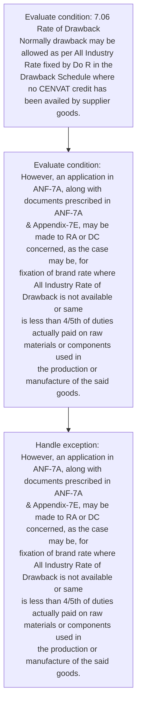
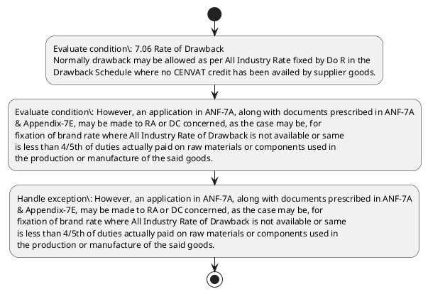

# Chapter 7 / Section 7.06: Rate of Drawback

**Chapter Title:** Deemed Exports

**Pages:** 5

**Purpose:** However, an application in ANF-7A, along with documents prescribed in ANF-7A
& Appendix-7E, may be made to RA or DC concerned, as the case may be, for
fixation of brand rate where All Industry Rate of Drawback is not available or same
is less than 4/5th of duties actually paid on raw materials or components used in
the production or manufacture of the said goods.

**Purpose Thanglish:** Indha Rate of Drawback section-la, However, an application in ANF-7A, along with documents prescribed in ANF-7A
& Appendix-7E, may be made to RA or DC concerned, as the case may be, for
fixation of brand rate where All Industry Rate of Drawback is not available or same
is less than 4/5th of duties actually paid on raw materials or components used in
the production or manufacture of the said goods.

**Summary:** 7.06 Rate of Drawback
Normally drawback may be allowed as per All Industry Rate fixed by Do R in the
Drawback Schedule where no CENVAT credit has been availed by supplier goods. However, an application in ANF-7A, along with documents prescribed in ANF-7A
& Appendix-7E, may be made to RA or DC concerned, as the case may be, for
fixation of brand rate where All Industry Rate of Drawback is not available or same
is less than 4/5th of duties actually paid on raw materials or components used in
the production or manufacture of the said goods.

**Business Meaning:** 7.06 Rate of Drawback
Normally drawback may be allowed as per All Industry Rate fixed by Do R in the
Drawback Schedule where no CENVAT credit has been availed by supplier goods.

**Business Explanation:** 7.06 Rate of Drawback
Normally drawback may be allowed as per All Industry Rate fixed by Do R in the
Drawback Schedule where no CENVAT credit has been availed by supplier goods. However, an application in ANF-7A, along with documents prescribed in ANF-7A
& Appendix-7E, may be made to RA or DC concerned, as the case may be, for
fixation of brand rate where All Industry Rate of Drawback is not available or same
is less than 4/5th of duties actually paid on raw materials or components used in
the production or manufacture of the said goods.

**Business Explanation Thanglish:** Indha Rate of Drawback section-la, 7.06 Rate of Drawback
Normally drawback may be allowed as per All Industry Rate fixed by Do R in the
Drawback Schedule where no CENVAT credit has been availed by supplier goods. However, an application in ANF-7A, along with documents prescribed in ANF-7A
& Appendix-7E, may be made to RA or DC concerned, as the case may be, for
fixation of brand rate where All Industry Rate of Drawback is not available or same
is less than 4/5th of duties actually paid on raw materials or components used in
the production or manufacture of the said goods.

## Business Logic
- None identified

## Business Rules
- rule_id=CH7-SEC7_06-R001, rule_description=7.06 Rate of Drawback
Normally drawback may be allowed as per All Industry Rate fixed by Do R in the
Drawback Schedule where no CENVAT credit has been availed by supplier goods. However, an application in ANF-7A, along with documents prescribed in ANF-7A
& Appendix-7E, may be made to RA or DC concerned, as the case may be, for
fixation of brand rate where All Industry Rate of Drawback is not available or same
is less than 4/5th of duties actually paid on raw materials or components used in
the production or manufacture of the said goods., trigger=Rate of Drawback, condition=7.06 Rate of Drawback
Normally drawback may be allowed as per All Industry Rate fixed by Do R in the
Drawback Schedule where no CENVAT credit has been availed by supplier goods., validation=Not explicitly covered in uploaded documents., action=Manual review required., exception=However, an application in ANF-7A, along with documents prescribed in ANF-7A
& Appendix-7E, may be made to RA or DC concerned, as the case may be, for
fixation of brand rate where All Industry Rate of Drawback is not available or same
is less than 4/5th of duties actually paid on raw materials or components used in
the production or manufacture of the said goods., output=DEKAI should produce a compliance decision for 7.06 - Rate of Drawback.

## Conditions
- 7.06 Rate of Drawback
Normally drawback may be allowed as per All Industry Rate fixed by Do R in the
Drawback Schedule where no CENVAT credit has been availed by supplier goods.
- However, an application in ANF-7A, along with documents prescribed in ANF-7A
& Appendix-7E, may be made to RA or DC concerned, as the case may be, for
fixation of brand rate where All Industry Rate of Drawback is not available or same
is less than 4/5th of duties actually paid on raw materials or components used in
the production or manufacture of the said goods.

## Condition Logic
- id=7.7.06.1, if=7.06 Rate of Drawback
Normally drawback may be allowed as per All Industry Rate fixed by Do R in the
Drawback Schedule where no CENVAT credit has been availed by supplier goods., then=Route for review, source=7.06 Rate of Drawback
Normally drawback may be allowed as per All Industry Rate fixed by Do R in the
Drawback Schedule where no CENVAT credit has been availed by supplier goods.
- id=7.7.06.2, if=However, an application in ANF-7A, along with documents prescribed in ANF-7A
& Appendix-7E, may be made to RA or DC concerned, as the case may be, for
fixation of brand rate where All Industry Rate of Drawback is not available or same
is less than 4/5th of duties actually paid on raw materials or components used in
the production or manufacture of the said goods., then=Route for review, source=However, an application in ANF-7A, along with documents prescribed in ANF-7A
& Appendix-7E, may be made to RA or DC concerned, as the case may be, for
fixation of brand rate where All Industry Rate of Drawback is not available or same
is less than 4/5th of duties actually paid on raw materials or components used in
the production or manufacture of the said goods.

## Validations
- None identified

## Exceptions
- However, an application in ANF-7A, along with documents prescribed in ANF-7A
& Appendix-7E, may be made to RA or DC concerned, as the case may be, for
fixation of brand rate where All Industry Rate of Drawback is not available or same
is less than 4/5th of duties actually paid on raw materials or components used in
the production or manufacture of the said goods.

## Dependencies
- None identified

## Authorities
- RA

## Required Documents
- However, an application in ANF-7A, along with documents prescribed in ANF-7A
& Appendix-7E, may be made to RA or DC concerned, as the case may be, for
fixation of brand rate where All Industry Rate of Drawback is not available or same
is less than 4/5th of duties actually paid on raw materials or components used in
the production or manufacture of the said goods.

## Timelines
- None identified

## Actions
- None identified

## Workflow
- Evaluate condition: 7.06 Rate of Drawback
Normally drawback may be allowed as per All Industry Rate fixed by Do R in the
Drawback Schedule where no CENVAT credit has been availed by supplier goods.
- Evaluate condition: However, an application in ANF-7A, along with documents prescribed in ANF-7A
& Appendix-7E, may be made to RA or DC concerned, as the case may be, for
fixation of brand rate where All Industry Rate of Drawback is not available or same
is less than 4/5th of duties actually paid on raw materials or components used in
the production or manufacture of the said goods.
- Handle exception: However, an application in ANF-7A, along with documents prescribed in ANF-7A
& Appendix-7E, may be made to RA or DC concerned, as the case may be, for
fixation of brand rate where All Industry Rate of Drawback is not available or same
is less than 4/5th of duties actually paid on raw materials or components used in
the production or manufacture of the said goods.

## Workflow ASCII
```text
Rate of Drawback
Evaluate condition: 7.06 Rate of Drawback
Normally drawback may be allowed as per All Industry Rate fixed by Do R in the
Drawback Schedule where no CENVAT credit has been availed by supplier goods.
   |
   v
Evaluate condition: However, an application in ANF-7A, along with documents prescribed in ANF-7A
& Appendix-7E, may be made to RA or DC concerned, as the case may be, for
fixation of brand rate where All Industry Rate of Drawback is not available or same
is less than 4/5th of duties actually paid on raw materials or components used in
the production or manufacture of the said goods.
   |
   v
Handle exception: However, an application in ANF-7A, along with documents prescribed in ANF-7A
& Appendix-7E, may be made to RA or DC concerned, as the case may be, for
fixation of brand rate where All Industry Rate of Drawback is not available or same
is less than 4/5th of duties actually paid on raw materials or components used in
the production or manufacture of the said goods.
```

## Decision Tree
- IF exception applies (However, an application in ANF-7A, along with documents prescribed in ANF-7A
& Appendix-7E, may be made to RA or DC concerned, as the case may be, for
fixation of brand rate where All Industry Rate of Drawback is not available or same
is less than 4/5th of duties actually paid on raw materials or components used in
the production or manufacture of the said goods.) THEN route to manual review

## Decision Tree ASCII
```text
Rate of Drawback Decision
IF exception applies (However, an application in ANF-7A, along with documents prescribed in ANF-7A
& Appendix-7E, may be made to RA or DC concerned, as the case may be, for
fixation of brand rate where All Industry Rate of Drawback is not available or same
is less than 4/5th of duties actually paid on raw materials or components used in
the production or manufacture of the said goods.) THEN route to manual review
```

## Examples
- User asks to process Rate of Drawback; the platform checks conditions, validations, and documents before action.

**Real-world Example:** Example: an importer or exporter invokes Rate of Drawback, submits However, an application in ANF-7A, along with documents prescribed in ANF-7A
& Appendix-7E, may be made to RA or DC concerned, as the case may be, for
fixation of brand rate where All Industry Rate of Drawback is not available or same
is less than 4/5th of duties actually paid on raw materials or components used in
the production or manufacture of the said goods., and DEKAI uses the extracted rules to follow the rate of drawback process.

**Real-world Example Thanglish:** Indha Rate of Drawback section-la, Example: an importer or exporter invokes Rate of Drawback, submits However, an application in ANF-7A, along with documents prescribed in ANF-7A
& Appendix-7E, may be made to RA or DC concerned, as the case may be, for
fixation of brand rate where All Industry Rate of Drawback is not available or same
is less than 4/5th of duties actually paid on raw materials or components used in
the production or manufacture of the said goods., and DEKAI uses the extracted rules to follow the rate of drawback process.

## AI Rules
- None identified

## Database Fields
- name=section_code, type=string, required=True, source=parsed_section_heading
- name=section_title, type=string, required=True, source=parsed_section_heading
- name=may_flag, type=boolean, required=False, source=keyword:may
- name=per_flag, type=boolean, required=False, source=keyword:per
- name=all_flag, type=boolean, required=False, source=keyword:All
- name=the_flag, type=boolean, required=False, source=keyword:the
- name=has_flag, type=boolean, required=False, source=keyword:has
- name=for_flag, type=boolean, required=False, source=keyword:for
- name=not_flag, type=boolean, required=False, source=keyword:not
- name=raw_flag, type=boolean, required=False, source=keyword:raw
- name=document_1_submitted, type=boolean, required=True, source=However, an application in ANF-7A, along with documents prescribed in ANF-7A
& Appendix-7E, may be made to RA or DC concerned, as the case may be, for
fixation of brand rate where All Industry Rate of Drawback is not available or same
is less than 4/5th of duties actually paid on raw materials or components used in
the production or manufacture of the said goods.

## API Requirements
- method=GET, path=/api/dgft/sections/7.06, purpose=Retrieve knowledge payload for section 7.06, query_params=['include=workflow,decision_tree,validations'], response_fields=['section', 'title', 'summary', 'conditions', 'validations', 'exceptions', 'workflow', 'decision_tree']
- method=POST, path=/api/dgft/Rate-of-Drawback/validate, purpose=Validate inputs and documents for Rate of Drawback, request_fields=['section_code', 'section_title', 'document_1_submitted'], response_fields=['status', 'errors', 'warnings', 'next_actions']

## UI Screens
- screen_id=Rate_of_Drawback_overview, name=Rate of Drawback Overview, purpose=Show section summary, authority, timeline, and eligibility cues., widgets=['summary_card', 'conditions_table', 'authority_badges', 'timeline_panel']
- screen_id=Rate_of_Drawback_submission, name=Rate of Drawback Submission, purpose=Capture applicant data and supporting documents., widgets=['dynamic_form', 'document_uploader', 'validation_panel', 'next_action_footer'], fields=['section_code', 'section_title', 'may_flag', 'per_flag', 'all_flag', 'the_flag', 'has_flag', 'for_flag']
- screen_id=Rate_of_Drawback_exceptions, name=Rate of Drawback Exception Review, purpose=Explain exception handling and manual review triggers., widgets=['exception_banner', 'decision_tree', 'case_notes']

## Error Messages
- Validation failed because the section requirements were not fully met.

## FAQ
- question_en=What is the purpose of section 7.06?, answer_en=7.06 Rate of Drawback
Normally drawback may be allowed as per All Industry Rate fixed by Do R in the
Drawback Schedule where no CENVAT credit has been availed by supplier goods. However, an application in ANF-7A, along with documents prescribed in ANF-7A
& Appendix-7E, may be made to RA or DC concerned, as the case may be, for
fixation of brand rate where All Industry Rate of Drawback is not available or same
is less than 4/5th of duties actually paid on raw materials or components used in
the production or manufacture of the said goods., question_thanglish=Indha Rate of Drawback section-la, What is the purpose of section 7.06?, answer_thanglish=Indha Rate of Drawback section-la, 7.06 Rate of Drawback
Normally drawback may be allowed as per All Industry Rate fixed by Do R in the
Drawback Schedule where no CENVAT credit has been availed by supplier goods. However, an application in ANF-7A, along with documents prescribed in ANF-7A
& Appendix-7E, may be made to RA or DC concerned, as the case may be, for
fixation of brand rate where All Industry Rate of Drawback is not available or same
is less than 4/5th of duties actually paid on raw materials or components used in
the production or manufacture of the said goods.
- question_en=What documents are required under Rate of Drawback?, answer_en=However, an application in ANF-7A, along with documents prescribed in ANF-7A
& Appendix-7E, may be made to RA or DC concerned, as the case may be, for
fixation of brand rate where All Industry Rate of Drawback is not available or same
is less than 4/5th of duties actually paid on raw materials or components used in
the production or manufacture of the said goods., question_thanglish=Indha Rate of Drawback section-la, What documents are required under Rate of Drawback?, answer_thanglish=Indha Rate of Drawback section-la, However, an application in ANF-7A, along with documents prescribed in ANF-7A
& Appendix-7E, may be made to RA or DC concerned, as the case may be, for
fixation of brand rate where All Industry Rate of Drawback is not available or same
is less than 4/5th of duties actually paid on raw materials or components used in
the production or manufacture of the said goods.
- question_en=Which authority handles Rate of Drawback?, answer_en=RA, question_thanglish=Indha Rate of Drawback section-la, Which authority handles Rate of Drawback?, answer_thanglish=Indha Rate of Drawback section-la, RA

## Questions Users May Ask
- What does Rate of Drawback require?
- Which documents are needed for Rate of Drawback?
- How does DEKAI validate Rate of Drawback requests?

## Expected AI Answers
- Rate of Drawback requires the platform to interpret the section text, apply the extracted business rules, and present the correct next action.
- Required documents are inferred from the section text: However, an application in ANF-7A, along with documents prescribed in ANF-7A
& Appendix-7E, may be made to RA or DC concerned, as the case may be, for
fixation of brand rate where All Industry Rate of Drawback is not available or same
is less than 4/5th of duties actually paid on raw materials or components used in
the production or manufacture of the said goods.
- DEKAI validates Rate of Drawback by checking conditions, required documents, authority references, and exception clauses before recommending an outcome.

## AI Q&A Examples
- question_en=User asks: How do I comply with Rate of Drawback?, answer_en=AI answers: DEKAI should evaluate section 7.06, apply the extracted rules, and guide the user through Evaluate condition: 7.06 Rate of Drawback
Normally drawback may be allowed as per All Industry Rate fixed by Do R in the
Drawback Schedule where no CENVAT credit has been availed by supplier goods.., question_thanglish=Indha Rate of Drawback section-la, User asks: How do I comply with Rate of Drawback?, answer_thanglish=Indha Rate of Drawback section-la, AI answers: DEKAI should evaluate section 7.06, apply the extracted rules, and guide the user through Evaluate condition: 7.06 Rate of Drawback
Normally drawback may be allowed as per All Industry Rate fixed by Do R in the
Drawback Schedule where no CENVAT credit has been availed by supplier goods..
- question_en=User asks: Which validations apply to Rate of Drawback?, answer_en=AI answers: Applicable validations are not explicitly covered in the uploaded documents., question_thanglish=Indha Rate of Drawback section-la, User asks: Which validations apply to Rate of Drawback?, answer_thanglish=Indha Rate of Drawback section-la, AI answers: Applicable validations are not explicitly covered in the uploaded documents.

## DEKAI AI Implementation Notes
- Capture chapter 7, section 7.06, title, and page references as immutable knowledge metadata.
- Bind validations for Rate of Drawback into a rule engine keyed by the rule IDs extracted for this section.
- Expose document upload controls for: However, an application in ANF-7A, along with documents prescribed in ANF-7A
& Appendix-7E, may be made to RA or DC concerned, as the case may be, for
fixation of brand rate where All Industry Rate of Drawback is not available or same
is less than 4/5th of duties actually paid on raw materials or components used in
the production or manufacture of the said goods..
- Route escalations or approvals to: RA.
- Trigger manual review when exception clauses are detected.

## DEKAI AI Implementation Notes Thanglish
- Indha Rate of Drawback section-la, Capture chapter 7, section 7.06, title, and page references as immutable knowledge metadata.
- Indha Rate of Drawback section-la, Bind validations for Rate of Drawback into a rule engine keyed by the rule IDs extracted for this section.
- Indha Rate of Drawback section-la, Expose document upload controls for: However, an application in ANF-7A, along with documents prescribed in ANF-7A
& Appendix-7E, may be made to RA or DC concerned, as the case may be, for
fixation of brand rate where All Industry Rate of Drawback is not available or same
is less than 4/5th of duties actually paid on raw materials or components used in
the production or manufacture of the said goods..
- Indha Rate of Drawback section-la, Route escalations or approvals to: RA.
- Indha Rate of Drawback section-la, Trigger manual review when exception clauses are detected.

## AI Metadata
- Keywords: may, per, All, the, has, for, not, raw, Rate, been, ANF-, with, made, case, same, less, than, paid, used, said
- Search Keywords: may, per, All, the, has, for, not, raw, Rate, been, ANF-, with, made, case, same, less, than, paid, used, said
- Intent: Provide knowledge guidance for Rate of Drawback.
- Tags: 7.06, Rate of Drawback, document-driven, dgft
- Related Sections: 
- Related Chapters: 
- Related Rules: 

## Mermaid


## PlantUML

