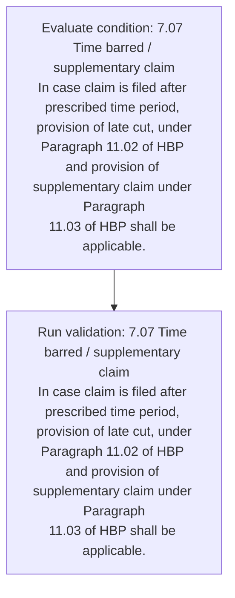
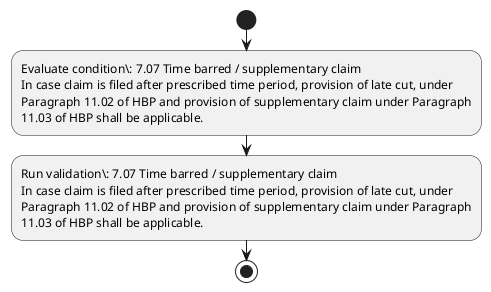

# Chapter 7 / Section 7.07: Time barred / supplementary claim

**Chapter Title:** Deemed Exports

**Pages:** 5

**Purpose:** 7.07 Time barred / supplementary claim
In case claim is filed after prescribed time period, provision of late cut, under
Paragraph 11.02 of HBP and provision of supplementary claim under Paragraph
11.03 of HBP shall be applicable.

**Purpose Thanglish:** Indha Time barred / supplementary claim section-la, 7.07 Time barred / supplementary claim
In case claim is filed after prescribed time period, provision of late cut, under
Paragraph 11.02 of HBP and provision of supplementary claim under Paragraph
11.03 of HBP kandippa be applicable.

**Summary:** 7.07 Time barred / supplementary claim
In case claim is filed after prescribed time period, provision of late cut, under
Paragraph 11.02 of HBP and provision of supplementary claim under Paragraph
11.03 of HBP shall be applicable.

**Business Meaning:** Time barred / supplementary claim governs how DGFT business controls should be applied, validated, and enforced.

**Business Explanation:** Time barred / supplementary claim explains the operating rule set that DEKAI should enforce. Key control points include 7.07 Time barred / supplementary claim
In case claim is filed after prescribed time period, provision of late cut, under
Paragraph 11.02 of HBP and provision of supplementary claim under Paragraph
11.03 of HBP shall be applicable.

**Business Explanation Thanglish:** Indha Time barred / supplementary claim section-la, Time barred / supplementary claim explains the operating rule set that DEKAI should enforce. Key control points include 7.07 Time barred / supplementary claim
In case claim is filed after prescribed time period, provision of late cut, under
Paragraph 11.02 of HBP and provision of supplementary claim under Paragraph
11.03 of HBP kandippa be applicable.

## Business Logic
- 7.07 Time barred / supplementary claim
In case claim is filed after prescribed time period, provision of late cut, under
Paragraph 11.02 of HBP and provision of supplementary claim under Paragraph
11.03 of HBP shall be applicable.

## Business Rules
- rule_id=CH7-SEC7_07-R001, rule_description=7.07 Time barred / supplementary claim
In case claim is filed after prescribed time period, provision of late cut, under
Paragraph 11.02 of HBP and provision of supplementary claim under Paragraph
11.03 of HBP shall be applicable., trigger=Time barred / supplementary claim, condition=7.07 Time barred / supplementary claim
In case claim is filed after prescribed time period, provision of late cut, under
Paragraph 11.02 of HBP and provision of supplementary claim under Paragraph
11.03 of HBP shall be applicable., validation=7.07 Time barred / supplementary claim
In case claim is filed after prescribed time period, provision of late cut, under
Paragraph 11.02 of HBP and provision of supplementary claim under Paragraph
11.03 of HBP shall be applicable., action=Manual review required., exception=No explicit exception found in uploaded documents., output=DEKAI should produce a compliance decision for 7.07 - Time barred / supplementary claim.

## Conditions
- 7.07 Time barred / supplementary claim
In case claim is filed after prescribed time period, provision of late cut, under
Paragraph 11.02 of HBP and provision of supplementary claim under Paragraph
11.03 of HBP shall be applicable.

## Condition Logic
- id=7.7.07.1, if=7.07 Time barred / supplementary claim
In case claim is filed after prescribed time period, provision of late cut, under
Paragraph 11.02 of HBP and provision of supplementary claim under Paragraph
11.03 of HBP shall be applicable., then=Route for review, source=7.07 Time barred / supplementary claim
In case claim is filed after prescribed time period, provision of late cut, under
Paragraph 11.02 of HBP and provision of supplementary claim under Paragraph
11.03 of HBP shall be applicable.

## Validations
- 7.07 Time barred / supplementary claim
In case claim is filed after prescribed time period, provision of late cut, under
Paragraph 11.02 of HBP and provision of supplementary claim under Paragraph
11.03 of HBP shall be applicable.

## Exceptions
- None identified

## Dependencies
- 11.02
- 11.03

## Authorities
- None identified

## Required Documents
- None identified

## Timelines
- 7.07 Time barred / supplementary claim
In case claim is filed after prescribed time period, provision of late cut, under
Paragraph 11.02 of HBP and provision of supplementary claim under Paragraph
11.03 of HBP shall be applicable.

## Actions
- None identified

## Workflow
- Evaluate condition: 7.07 Time barred / supplementary claim
In case claim is filed after prescribed time period, provision of late cut, under
Paragraph 11.02 of HBP and provision of supplementary claim under Paragraph
11.03 of HBP shall be applicable.
- Run validation: 7.07 Time barred / supplementary claim
In case claim is filed after prescribed time period, provision of late cut, under
Paragraph 11.02 of HBP and provision of supplementary claim under Paragraph
11.03 of HBP shall be applicable.

## Workflow ASCII
```text
Time barred / supplementary claim
Evaluate condition: 7.07 Time barred / supplementary claim
In case claim is filed after prescribed time period, provision of late cut, under
Paragraph 11.02 of HBP and provision of supplementary claim under Paragraph
11.03 of HBP shall be applicable.
   |
   v
Run validation: 7.07 Time barred / supplementary claim
In case claim is filed after prescribed time period, provision of late cut, under
Paragraph 11.02 of HBP and provision of supplementary claim under Paragraph
11.03 of HBP shall be applicable.
```

## Decision Tree
- IF section 7.07 applies THEN proceed with standard DGFT workflow

## Decision Tree ASCII
```text
Time barred / supplementary claim Decision
IF section 7.07 applies THEN proceed with standard DGFT workflow
```

## Examples
- User asks to process Time barred / supplementary claim; the platform checks conditions, validations, and documents before action.

**Real-world Example:** Example: an importer or exporter invokes Time barred / supplementary claim, submits the prescribed DGFT records, and DEKAI uses the extracted rules to follow the time barred / supplementary claim process.

**Real-world Example Thanglish:** Indha Time barred / supplementary claim section-la, Example: an importer or exporter invokes Time barred / supplementary claim, submits the prescribed DGFT records, and DEKAI uses the extracted rules to follow the time barred / supplementary claim process.

## AI Rules
- IF detected context matches section rule THEN enforce: 7.07 Time barred / supplementary claim
In case claim is filed after prescribed time period, provision of late cut, under
Paragraph 11.02 of HBP and provision of supplementary claim under Paragraph
11.03 of HBP shall be applicable.

## Database Fields
- name=section_code, type=string, required=True, source=parsed_section_heading
- name=section_title, type=string, required=True, source=parsed_section_heading
- name=cut_flag, type=boolean, required=False, source=keyword:cut
- name=hbp_flag, type=boolean, required=False, source=keyword:HBP
- name=and_flag, type=boolean, required=False, source=keyword:and
- name=time_flag, type=boolean, required=False, source=keyword:Time
- name=case_flag, type=boolean, required=False, source=keyword:case
- name=late_flag, type=boolean, required=False, source=keyword:late
- name=claim_flag, type=boolean, required=False, source=keyword:claim
- name=filed_flag, type=boolean, required=False, source=keyword:filed

## API Requirements
- method=GET, path=/api/dgft/sections/7.07, purpose=Retrieve knowledge payload for section 7.07, query_params=['include=workflow,decision_tree,validations'], response_fields=['section', 'title', 'summary', 'conditions', 'validations', 'exceptions', 'workflow', 'decision_tree']
- method=POST, path=/api/dgft/Time-barred-supplementary-claim/validate, purpose=Validate inputs and documents for Time barred / supplementary claim, request_fields=['section_code', 'section_title'], response_fields=['status', 'errors', 'warnings', 'next_actions']

## UI Screens
- screen_id=Time_barred_supplementary_claim_overview, name=Time barred / supplementary claim Overview, purpose=Show section summary, authority, timeline, and eligibility cues., widgets=['summary_card', 'conditions_table', 'authority_badges', 'timeline_panel']
- screen_id=Time_barred_supplementary_claim_submission, name=Time barred / supplementary claim Submission, purpose=Capture applicant data and supporting documents., widgets=['dynamic_form', 'document_uploader', 'validation_panel', 'next_action_footer'], fields=['section_code', 'section_title', 'cut_flag', 'hbp_flag', 'and_flag', 'time_flag', 'case_flag', 'late_flag']

## Error Messages
- Validation failed because the section requirements were not fully met.

## FAQ
- question_en=What is the purpose of section 7.07?, answer_en=Time barred / supplementary claim explains the operating rule set that DEKAI should enforce. Key control points include 7.07 Time barred / supplementary claim
In case claim is filed after prescribed time period, provision of late cut, under
Paragraph 11.02 of HBP and provision of supplementary claim under Paragraph
11.03 of HBP shall be applicable., question_thanglish=Indha Time barred / supplementary claim section-la, What is the purpose of section 7.07?, answer_thanglish=Indha Time barred / supplementary claim section-la, Time barred / supplementary claim explains the operating rule set that DEKAI should enforce. Key control points include 7.07 Time barred / supplementary claim
In case claim is filed after prescribed time period, provision of late cut, under
Paragraph 11.02 of HBP and provision of supplementary claim under Paragraph
11.03 of HBP kandippa be applicable.
- question_en=What documents are required under Time barred / supplementary claim?, answer_en=Not explicitly covered in uploaded documents., question_thanglish=Indha Time barred / supplementary claim section-la, What documents are required under Time barred / supplementary claim?, answer_thanglish=Indha Time barred / supplementary claim section-la, Not explicitly covered in uploaded documents.
- question_en=Which authority handles Time barred / supplementary claim?, answer_en=Not explicitly covered in uploaded documents., question_thanglish=Indha Time barred / supplementary claim section-la, Which authority handles Time barred / supplementary claim?, answer_thanglish=Indha Time barred / supplementary claim section-la, Not explicitly covered in uploaded documents.

## Questions Users May Ask
- What does Time barred / supplementary claim require?
- Which documents are needed for Time barred / supplementary claim?
- How does DEKAI validate Time barred / supplementary claim requests?

## Expected AI Answers
- Time barred / supplementary claim requires the platform to interpret the section text, apply the extracted business rules, and present the correct next action.
- Required documents are inferred from the section text: no explicit documents were detected.
- DEKAI validates Time barred / supplementary claim by checking conditions, required documents, authority references, and exception clauses before recommending an outcome.

## AI Q&A Examples
- question_en=User asks: How do I comply with Time barred / supplementary claim?, answer_en=AI answers: DEKAI should evaluate section 7.07, apply the extracted rules, and guide the user through Evaluate condition: 7.07 Time barred / supplementary claim
In case claim is filed after prescribed time period, provision of late cut, under
Paragraph 11.02 of HBP and provision of supplementary claim under Paragraph
11.03 of HBP shall be applicable.., question_thanglish=Indha Time barred / supplementary claim section-la, User asks: How do I comply with Time barred / supplementary claim?, answer_thanglish=Indha Time barred / supplementary claim section-la, AI answers: DEKAI should evaluate section 7.07, apply the extracted rules, and guide the user through Evaluate condition: 7.07 Time barred / supplementary claim
In case claim is filed after prescribed time period, provision of late cut, under
Paragraph 11.02 of HBP and provision of supplementary claim under Paragraph
11.03 of HBP kandippa be applicable..
- question_en=User asks: Which validations apply to Time barred / supplementary claim?, answer_en=AI answers: Applicable validations are 7.07 Time barred / supplementary claim
In case claim is filed after prescribed time period, provision of late cut, under
Paragraph 11.02 of HBP and provision of supplementary claim under Paragraph
11.03 of HBP shall be applicable., question_thanglish=Indha Time barred / supplementary claim section-la, User asks: Which validations apply to Time barred / supplementary claim?, answer_thanglish=Indha Time barred / supplementary claim section-la, AI answers: Applicable validations are 7.07 Time barred / supplementary claim
In case claim is filed after prescribed time period, provision of late cut, under
Paragraph 11.02 of HBP and provision of supplementary claim under Paragraph
11.03 of HBP kandippa be applicable.

## DEKAI AI Implementation Notes
- Capture chapter 7, section 7.07, title, and page references as immutable knowledge metadata.
- Bind validations for Time barred / supplementary claim into a rule engine keyed by the rule IDs extracted for this section.

## DEKAI AI Implementation Notes Thanglish
- Indha Time barred / supplementary claim section-la, Capture chapter 7, section 7.07, title, and page references as immutable knowledge metadata.
- Indha Time barred / supplementary claim section-la, Bind validations for Time barred / supplementary claim into a rule engine keyed by the rule IDs extracted for this section.

## AI Metadata
- Keywords: cut, HBP, and, Time, case, late, claim, filed, after, under, shall, barred, period, provision, Paragraph, prescribed, applicable, supplementary
- Search Keywords: cut, HBP, and, Time, case, late, claim, filed, after, under, shall, barred, period, provision, Paragraph, prescribed, applicable, supplementary
- Intent: Provide knowledge guidance for Time barred / supplementary claim.
- Tags: 7.07, Time barred / supplementary claim, business-rule, dgft
- Related Sections: 
- Related Chapters: 
- Related Rules: 7.07 Time barred / supplementary claim
In case claim is filed after prescribed time period, provision of late cut, under
Paragraph 11.02 of HBP and provision of supplementary claim under Paragraph
11.03 of HBP shall be applicable.

## Mermaid


## PlantUML

