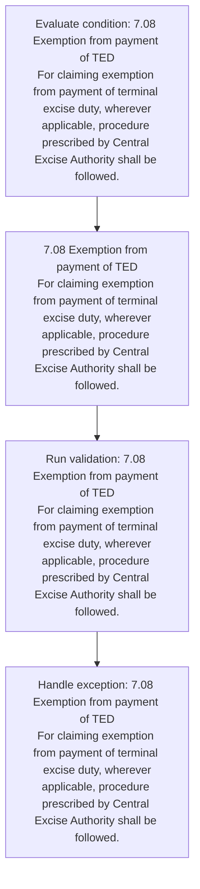
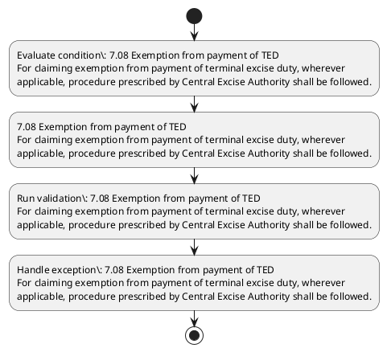

# Chapter 7 / Section 7.08: Exemption from payment of TED

**Chapter Title:** Deemed Exports

**Pages:** 5

**Purpose:** 7.08 Exemption from payment of TED
For claiming exemption from payment of terminal excise duty, wherever
applicable, procedure prescribed by Central Excise Authority shall be followed.

**Purpose Thanglish:** Indha Exemption from payment of TED section-la, 7.08 Exemption from payment of TED
For claiming exemption from payment of terminal excise duty, wherever
applicable, procedure prescribed by Central Excise authority kandippa be followed.

**Summary:** 7.08 Exemption from payment of TED
For claiming exemption from payment of terminal excise duty, wherever
applicable, procedure prescribed by Central Excise Authority shall be followed.

**Business Meaning:** Exemption from payment of TED governs how DGFT business controls should be applied, validated, and enforced.

**Business Explanation:** Exemption from payment of TED explains the operating rule set that DEKAI should enforce. Key control points include 7.08 Exemption from payment of TED
For claiming exemption from payment of terminal excise duty, wherever
applicable, procedure prescribed by Central Excise Authority shall be followed. The section also drives actions such as 7.08 Exemption from payment of TED
For claiming exemption from payment of terminal excise duty, wherever
applicable, procedure prescribed by Central Excise Authority shall be followed..

**Business Explanation Thanglish:** Indha Exemption from payment of TED section-la, Exemption from payment of TED explains the operating rule set that DEKAI should enforce. Key control points include 7.08 Exemption from payment of TED
For claiming exemption from payment of terminal excise duty, wherever
applicable, procedure prescribed by Central Excise authority kandippa be followed. The section also drives actions such as 7.08 Exemption from payment of TED
For claiming exemption from payment of terminal excise duty, wherever
applicable, procedure prescribed by Central Excise authority kandippa be followed..

## Business Logic
- 7.08 Exemption from payment of TED
For claiming exemption from payment of terminal excise duty, wherever
applicable, procedure prescribed by Central Excise Authority shall be followed.

## Business Rules
- rule_id=CH7-SEC7_08-R001, rule_description=7.08 Exemption from payment of TED
For claiming exemption from payment of terminal excise duty, wherever
applicable, procedure prescribed by Central Excise Authority shall be followed., trigger=Exemption from payment of TED, condition=7.08 Exemption from payment of TED
For claiming exemption from payment of terminal excise duty, wherever
applicable, procedure prescribed by Central Excise Authority shall be followed., validation=7.08 Exemption from payment of TED
For claiming exemption from payment of terminal excise duty, wherever
applicable, procedure prescribed by Central Excise Authority shall be followed., action=7.08 Exemption from payment of TED
For claiming exemption from payment of terminal excise duty, wherever
applicable, procedure prescribed by Central Excise Authority shall be followed., exception=7.08 Exemption from payment of TED
For claiming exemption from payment of terminal excise duty, wherever
applicable, procedure prescribed by Central Excise Authority shall be followed., output=DEKAI should produce a compliance decision for 7.08 - Exemption from payment of TED.

## Conditions
- 7.08 Exemption from payment of TED
For claiming exemption from payment of terminal excise duty, wherever
applicable, procedure prescribed by Central Excise Authority shall be followed.

## Condition Logic
- id=7.7.08.1, if=7.08 Exemption from payment of TED
For claiming exemption from payment of terminal excise duty, wherever
applicable, procedure prescribed by Central Excise Authority shall be followed., then=7.08 Exemption from payment of TED
For claiming exemption from payment of terminal excise duty, wherever
applicable, procedure prescribed by Central Excise Authority shall be followed., source=7.08 Exemption from payment of TED
For claiming exemption from payment of terminal excise duty, wherever
applicable, procedure prescribed by Central Excise Authority shall be followed.

## Validations
- 7.08 Exemption from payment of TED
For claiming exemption from payment of terminal excise duty, wherever
applicable, procedure prescribed by Central Excise Authority shall be followed.

## Exceptions
- 7.08 Exemption from payment of TED
For claiming exemption from payment of terminal excise duty, wherever
applicable, procedure prescribed by Central Excise Authority shall be followed.

## Dependencies
- None identified

## Authorities
- Central Excise Authority

## Required Documents
- None identified

## Timelines
- None identified

## Actions
- 7.08 Exemption from payment of TED
For claiming exemption from payment of terminal excise duty, wherever
applicable, procedure prescribed by Central Excise Authority shall be followed.

## Workflow
- Evaluate condition: 7.08 Exemption from payment of TED
For claiming exemption from payment of terminal excise duty, wherever
applicable, procedure prescribed by Central Excise Authority shall be followed.
- 7.08 Exemption from payment of TED
For claiming exemption from payment of terminal excise duty, wherever
applicable, procedure prescribed by Central Excise Authority shall be followed.
- Run validation: 7.08 Exemption from payment of TED
For claiming exemption from payment of terminal excise duty, wherever
applicable, procedure prescribed by Central Excise Authority shall be followed.
- Handle exception: 7.08 Exemption from payment of TED
For claiming exemption from payment of terminal excise duty, wherever
applicable, procedure prescribed by Central Excise Authority shall be followed.

## Workflow ASCII
```text
Exemption from payment of TED
Evaluate condition: 7.08 Exemption from payment of TED
For claiming exemption from payment of terminal excise duty, wherever
applicable, procedure prescribed by Central Excise Authority shall be followed.
   |
   v
7.08 Exemption from payment of TED
For claiming exemption from payment of terminal excise duty, wherever
applicable, procedure prescribed by Central Excise Authority shall be followed.
   |
   v
Run validation: 7.08 Exemption from payment of TED
For claiming exemption from payment of terminal excise duty, wherever
applicable, procedure prescribed by Central Excise Authority shall be followed.
   |
   v
Handle exception: 7.08 Exemption from payment of TED
For claiming exemption from payment of terminal excise duty, wherever
applicable, procedure prescribed by Central Excise Authority shall be followed.
```

## Decision Tree
- IF 7.08 Exemption from payment of TED
For claiming exemption from payment of terminal excise duty, wherever
applicable, procedure prescribed by Central Excise Authority shall be followed. THEN 7.08 Exemption from payment of TED
For claiming exemption from payment of terminal excise duty, wherever
applicable, procedure prescribed by Central Excise Authority shall be followed.
- IF exception applies (7.08 Exemption from payment of TED
For claiming exemption from payment of terminal excise duty, wherever
applicable, procedure prescribed by Central Excise Authority shall be followed.) THEN route to manual review

## Decision Tree ASCII
```text
Exemption from payment of TED Decision
IF 7.08 Exemption from payment of TED
For claiming exemption from payment of terminal excise duty, wherever
applicable, procedure prescribed by Central Excise Authority shall be followed. THEN 7.08 Exemption from payment of TED
For claiming exemption from payment of terminal excise duty, wherever
applicable, procedure prescribed by Central Excise Authority shall be followed.
   |
   v
IF exception applies (7.08 Exemption from payment of TED
For claiming exemption from payment of terminal excise duty, wherever
applicable, procedure prescribed by Central Excise Authority shall be followed.) THEN route to manual review
```

## Examples
- User asks to process Exemption from payment of TED; the platform checks conditions, validations, and documents before action.

**Real-world Example:** Example: an importer or exporter invokes Exemption from payment of TED, submits the prescribed DGFT records, and DEKAI uses the extracted rules to 7.08 exemption from payment of ted
for claiming exemption from payment of terminal excise duty, wherever
applicable, procedure prescribed by central excise authority shall be followed..

**Real-world Example Thanglish:** Indha Exemption from payment of TED section-la, Example: an importer or exporter invokes Exemption from payment of TED, submits the prescribed DGFT records, and DEKAI uses the extracted rules to 7.08 exemption from payment of ted
for claiming exemption from payment of terminal excise duty, wherever
applicable, procedure prescribed by central excise authority kandippa be followed..

## AI Rules
- IF detected context matches section rule THEN enforce: 7.08 Exemption from payment of TED
For claiming exemption from payment of terminal excise duty, wherever
applicable, procedure prescribed by Central Excise Authority shall be followed.
- IF validations pass THEN recommend action: 7.08 Exemption from payment of TED
For claiming exemption from payment of terminal excise duty, wherever
applicable, procedure prescribed by Central Excise Authority shall be followed.

## Database Fields
- name=section_code, type=string, required=True, source=parsed_section_heading
- name=section_title, type=string, required=True, source=parsed_section_heading
- name=ted_flag, type=boolean, required=False, source=keyword:TED
- name=for_flag, type=boolean, required=False, source=keyword:For
- name=from_flag, type=boolean, required=False, source=keyword:from
- name=duty_flag, type=boolean, required=False, source=keyword:duty
- name=shall_flag, type=boolean, required=False, source=keyword:shall
- name=excise_flag, type=boolean, required=False, source=keyword:excise
- name=payment_flag, type=boolean, required=False, source=keyword:payment
- name=central_flag, type=boolean, required=False, source=keyword:Central

## API Requirements
- method=GET, path=/api/dgft/sections/7.08, purpose=Retrieve knowledge payload for section 7.08, query_params=['include=workflow,decision_tree,validations'], response_fields=['section', 'title', 'summary', 'conditions', 'validations', 'exceptions', 'workflow', 'decision_tree']
- method=POST, path=/api/dgft/Exemption-from-payment-of-TED/validate, purpose=Validate inputs and documents for Exemption from payment of TED, request_fields=['section_code', 'section_title'], response_fields=['status', 'errors', 'warnings', 'next_actions']
- method=POST, path=/api/dgft/Exemption-from-payment-of-TED/execute, purpose=Trigger business action for 7.08 Exemption from payment of TED
For claiming exemption from payment of terminal excise duty, wherever
applicable, procedure prescribed by Central Excise Authority shall be followed., request_fields=['section_code', 'section_title'], response_fields=['reference_id', 'status', 'authority', 'timeline']

## UI Screens
- screen_id=Exemption_from_payment_of_TED_overview, name=Exemption from payment of TED Overview, purpose=Show section summary, authority, timeline, and eligibility cues., widgets=['summary_card', 'conditions_table', 'authority_badges', 'timeline_panel']
- screen_id=Exemption_from_payment_of_TED_submission, name=Exemption from payment of TED Submission, purpose=Capture applicant data and supporting documents., widgets=['dynamic_form', 'document_uploader', 'validation_panel', 'next_action_footer'], fields=['section_code', 'section_title', 'ted_flag', 'for_flag', 'from_flag', 'duty_flag', 'shall_flag', 'excise_flag']
- screen_id=Exemption_from_payment_of_TED_exceptions, name=Exemption from payment of TED Exception Review, purpose=Explain exception handling and manual review triggers., widgets=['exception_banner', 'decision_tree', 'case_notes']

## Error Messages
- Validation failed because the section requirements were not fully met.

## FAQ
- question_en=What is the purpose of section 7.08?, answer_en=Exemption from payment of TED explains the operating rule set that DEKAI should enforce. Key control points include 7.08 Exemption from payment of TED
For claiming exemption from payment of terminal excise duty, wherever
applicable, procedure prescribed by Central Excise Authority shall be followed. The section also drives actions such as 7.08 Exemption from payment of TED
For claiming exemption from payment of terminal excise duty, wherever
applicable, procedure prescribed by Central Excise Authority shall be followed.., question_thanglish=Indha Exemption from payment of TED section-la, What is the purpose of section 7.08?, answer_thanglish=Indha Exemption from payment of TED section-la, Exemption from payment of TED explains the operating rule set that DEKAI should enforce. Key control points include 7.08 Exemption from payment of TED
For claiming exemption from payment of terminal excise duty, wherever
applicable, procedure prescribed by Central Excise authority kandippa be followed. The section also drives actions such as 7.08 Exemption from payment of TED
For claiming exemption from payment of terminal excise duty, wherever
applicable, procedure prescribed by Central Excise authority kandippa be followed..
- question_en=What documents are required under Exemption from payment of TED?, answer_en=Not explicitly covered in uploaded documents., question_thanglish=Indha Exemption from payment of TED section-la, What documents are required under Exemption from payment of TED?, answer_thanglish=Indha Exemption from payment of TED section-la, Not explicitly covered in uploaded documents.
- question_en=Which authority handles Exemption from payment of TED?, answer_en=Central Excise Authority, question_thanglish=Indha Exemption from payment of TED section-la, Which authority handles Exemption from payment of TED?, answer_thanglish=Indha Exemption from payment of TED section-la, Central Excise authority

## Questions Users May Ask
- What does Exemption from payment of TED require?
- Which documents are needed for Exemption from payment of TED?
- How does DEKAI validate Exemption from payment of TED requests?
- What action should be taken for Exemption from payment of TED?

## Expected AI Answers
- Exemption from payment of TED requires the platform to interpret the section text, apply the extracted business rules, and present the correct next action.
- Required documents are inferred from the section text: no explicit documents were detected.
- DEKAI validates Exemption from payment of TED by checking conditions, required documents, authority references, and exception clauses before recommending an outcome.
- The primary extracted action is: 7.08 Exemption from payment of TED
For claiming exemption from payment of terminal excise duty, wherever
applicable, procedure prescribed by Central Excise Authority shall be followed.

## AI Q&A Examples
- question_en=User asks: How do I comply with Exemption from payment of TED?, answer_en=AI answers: DEKAI should evaluate section 7.08, apply the extracted rules, and guide the user through Evaluate condition: 7.08 Exemption from payment of TED
For claiming exemption from payment of terminal excise duty, wherever
applicable, procedure prescribed by Central Excise Authority shall be followed.., question_thanglish=Indha Exemption from payment of TED section-la, User asks: How do I comply with Exemption from payment of TED?, answer_thanglish=Indha Exemption from payment of TED section-la, AI answers: DEKAI should evaluate section 7.08, apply the extracted rules, and guide the user through Evaluate condition: 7.08 Exemption from payment of TED
For claiming exemption from payment of terminal excise duty, wherever
applicable, procedure prescribed by Central Excise authority kandippa be followed..
- question_en=User asks: Which validations apply to Exemption from payment of TED?, answer_en=AI answers: Applicable validations are 7.08 Exemption from payment of TED
For claiming exemption from payment of terminal excise duty, wherever
applicable, procedure prescribed by Central Excise Authority shall be followed., question_thanglish=Indha Exemption from payment of TED section-la, User asks: Which validations apply to Exemption from payment of TED?, answer_thanglish=Indha Exemption from payment of TED section-la, AI answers: Applicable validations are 7.08 Exemption from payment of TED
For claiming exemption from payment of terminal excise duty, wherever
applicable, procedure prescribed by Central Excise authority kandippa be followed.

## DEKAI AI Implementation Notes
- Capture chapter 7, section 7.08, title, and page references as immutable knowledge metadata.
- Bind validations for Exemption from payment of TED into a rule engine keyed by the rule IDs extracted for this section.
- Route escalations or approvals to: Central Excise Authority.
- Trigger manual review when exception clauses are detected.

## DEKAI AI Implementation Notes Thanglish
- Indha Exemption from payment of TED section-la, Capture chapter 7, section 7.08, title, and page references as immutable knowledge metadata.
- Indha Exemption from payment of TED section-la, Bind validations for Exemption from payment of TED into a rule engine keyed by the rule IDs extracted for this section.
- Indha Exemption from payment of TED section-la, Route escalations or approvals to: Central Excise authority.
- Indha Exemption from payment of TED section-la, Trigger manual review when exception clauses are detected.

## AI Metadata
- Keywords: TED, For, from, duty, shall, excise, payment, Central, claiming, terminal, wherever, followed, Exemption, procedure, Authority, applicable, prescribed
- Search Keywords: TED, For, from, duty, shall, excise, payment, Central, claiming, terminal, wherever, followed, Exemption, procedure, Authority, applicable, prescribed
- Intent: Support Exemption from payment of TED processing and compliance validation.
- Tags: 7.08, Exemption from payment of TED, business-rule, dgft
- Related Sections: 
- Related Chapters: 
- Related Rules: 7.08 Exemption from payment of TED
For claiming exemption from payment of terminal excise duty, wherever
applicable, procedure prescribed by Central Excise Authority shall be followed.

## Mermaid


## PlantUML

