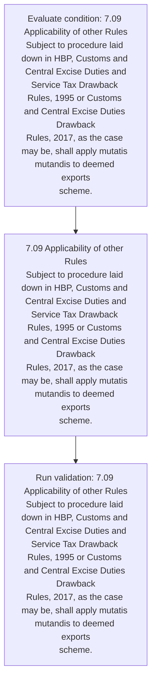
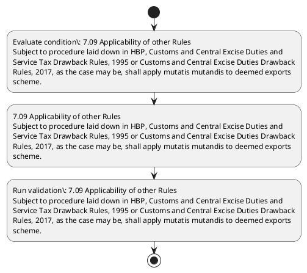

# Chapter 7 / Section 7.09: Applicability of other Rules

**Chapter Title:** Deemed Exports

**Pages:** 5

**Purpose:** 7.09 Applicability of other Rules
Subject to procedure laid down in HBP, Customs and Central Excise Duties and
Service Tax Drawback Rules, 1995 or Customs and Central Excise Duties Drawback
Rules, 2017, as the case may be, shall apply mutatis mutandis to deemed exports
scheme.

**Purpose Thanglish:** Indha Applicability of other Rules section-la, 7.09 Applicability of other Rules
Subject to procedure laid down in HBP, Customs and Central Excise Duties and
Service Tax Drawback Rules, 1995 or Customs and Central Excise Duties Drawback
Rules, 2017, as the case may be, kandippa apply mutatis mutandis to deemed exports
scheme.

**Summary:** 7.09 Applicability of other Rules
Subject to procedure laid down in HBP, Customs and Central Excise Duties and
Service Tax Drawback Rules, 1995 or Customs and Central Excise Duties Drawback
Rules, 2017, as the case may be, shall apply mutatis mutandis to deemed exports
scheme.

**Business Meaning:** Applicability of other Rules governs how DGFT business controls should be applied, validated, and enforced.

**Business Explanation:** Applicability of other Rules explains the operating rule set that DEKAI should enforce. Key control points include 7.09 Applicability of other Rules
Subject to procedure laid down in HBP, Customs and Central Excise Duties and
Service Tax Drawback Rules, 1995 or Customs and Central Excise Duties Drawback
Rules, 2017, as the case may be, shall apply mutatis mutandis to deemed exports
scheme. The section also drives actions such as 7.09 Applicability of other Rules
Subject to procedure laid down in HBP, Customs and Central Excise Duties and
Service Tax Drawback Rules, 1995 or Customs and Central Excise Duties Drawback
Rules, 2017, as the case may be, shall apply mutatis mutandis to deemed exports
scheme..

**Business Explanation Thanglish:** Indha Applicability of other Rules section-la, Applicability of other Rules explains the operating rule set that DEKAI should enforce. Key control points include 7.09 Applicability of other Rules
Subject to procedure laid down in HBP, Customs and Central Excise Duties and
Service Tax Drawback Rules, 1995 or Customs and Central Excise Duties Drawback
Rules, 2017, as the case may be, kandippa apply mutatis mutandis to deemed exports
scheme. The section also drives actions such as 7.09 Applicability of other Rules
Subject to procedure laid down in HBP, Customs and Central Excise Duties and
Service Tax Drawback Rules, 1995 or Customs and Central Excise Duties Drawback
Rules, 2017, as the case may be, kandippa apply mutatis mutandis to deemed exports
scheme..

## Business Logic
- 7.09 Applicability of other Rules
Subject to procedure laid down in HBP, Customs and Central Excise Duties and
Service Tax Drawback Rules, 1995 or Customs and Central Excise Duties Drawback
Rules, 2017, as the case may be, shall apply mutatis mutandis to deemed exports
scheme.

## Business Rules
- rule_id=CH7-SEC7_09-R001, rule_description=7.09 Applicability of other Rules
Subject to procedure laid down in HBP, Customs and Central Excise Duties and
Service Tax Drawback Rules, 1995 or Customs and Central Excise Duties Drawback
Rules, 2017, as the case may be, shall apply mutatis mutandis to deemed exports
scheme., trigger=Applicability of other Rules, condition=7.09 Applicability of other Rules
Subject to procedure laid down in HBP, Customs and Central Excise Duties and
Service Tax Drawback Rules, 1995 or Customs and Central Excise Duties Drawback
Rules, 2017, as the case may be, shall apply mutatis mutandis to deemed exports
scheme., validation=7.09 Applicability of other Rules
Subject to procedure laid down in HBP, Customs and Central Excise Duties and
Service Tax Drawback Rules, 1995 or Customs and Central Excise Duties Drawback
Rules, 2017, as the case may be, shall apply mutatis mutandis to deemed exports
scheme., action=7.09 Applicability of other Rules
Subject to procedure laid down in HBP, Customs and Central Excise Duties and
Service Tax Drawback Rules, 1995 or Customs and Central Excise Duties Drawback
Rules, 2017, as the case may be, shall apply mutatis mutandis to deemed exports
scheme., exception=No explicit exception found in uploaded documents., output=DEKAI should produce a compliance decision for 7.09 - Applicability of other Rules.

## Conditions
- 7.09 Applicability of other Rules
Subject to procedure laid down in HBP, Customs and Central Excise Duties and
Service Tax Drawback Rules, 1995 or Customs and Central Excise Duties Drawback
Rules, 2017, as the case may be, shall apply mutatis mutandis to deemed exports
scheme.

## Condition Logic
- id=7.7.09.1, if=7.09 Applicability of other Rules
Subject to procedure laid down in HBP, Customs and Central Excise Duties and
Service Tax Drawback Rules, 1995 or Customs and Central Excise Duties Drawback
Rules, 2017, as the case may be, shall apply mutatis mutandis to deemed exports
scheme., then=7.09 Applicability of other Rules
Subject to procedure laid down in HBP, Customs and Central Excise Duties and
Service Tax Drawback Rules, 1995 or Customs and Central Excise Duties Drawback
Rules, 2017, as the case may be, shall apply mutatis mutandis to deemed exports
scheme., source=7.09 Applicability of other Rules
Subject to procedure laid down in HBP, Customs and Central Excise Duties and
Service Tax Drawback Rules, 1995 or Customs and Central Excise Duties Drawback
Rules, 2017, as the case may be, shall apply mutatis mutandis to deemed exports
scheme.

## Validations
- 7.09 Applicability of other Rules
Subject to procedure laid down in HBP, Customs and Central Excise Duties and
Service Tax Drawback Rules, 1995 or Customs and Central Excise Duties Drawback
Rules, 2017, as the case may be, shall apply mutatis mutandis to deemed exports
scheme.

## Exceptions
- None identified

## Dependencies
- None identified

## Authorities
- Customs

## Required Documents
- None identified

## Timelines
- None identified

## Actions
- 7.09 Applicability of other Rules
Subject to procedure laid down in HBP, Customs and Central Excise Duties and
Service Tax Drawback Rules, 1995 or Customs and Central Excise Duties Drawback
Rules, 2017, as the case may be, shall apply mutatis mutandis to deemed exports
scheme.

## Workflow
- Evaluate condition: 7.09 Applicability of other Rules
Subject to procedure laid down in HBP, Customs and Central Excise Duties and
Service Tax Drawback Rules, 1995 or Customs and Central Excise Duties Drawback
Rules, 2017, as the case may be, shall apply mutatis mutandis to deemed exports
scheme.
- 7.09 Applicability of other Rules
Subject to procedure laid down in HBP, Customs and Central Excise Duties and
Service Tax Drawback Rules, 1995 or Customs and Central Excise Duties Drawback
Rules, 2017, as the case may be, shall apply mutatis mutandis to deemed exports
scheme.
- Run validation: 7.09 Applicability of other Rules
Subject to procedure laid down in HBP, Customs and Central Excise Duties and
Service Tax Drawback Rules, 1995 or Customs and Central Excise Duties Drawback
Rules, 2017, as the case may be, shall apply mutatis mutandis to deemed exports
scheme.

## Workflow ASCII
```text
Applicability of other Rules
Evaluate condition: 7.09 Applicability of other Rules
Subject to procedure laid down in HBP, Customs and Central Excise Duties and
Service Tax Drawback Rules, 1995 or Customs and Central Excise Duties Drawback
Rules, 2017, as the case may be, shall apply mutatis mutandis to deemed exports
scheme.
   |
   v
7.09 Applicability of other Rules
Subject to procedure laid down in HBP, Customs and Central Excise Duties and
Service Tax Drawback Rules, 1995 or Customs and Central Excise Duties Drawback
Rules, 2017, as the case may be, shall apply mutatis mutandis to deemed exports
scheme.
   |
   v
Run validation: 7.09 Applicability of other Rules
Subject to procedure laid down in HBP, Customs and Central Excise Duties and
Service Tax Drawback Rules, 1995 or Customs and Central Excise Duties Drawback
Rules, 2017, as the case may be, shall apply mutatis mutandis to deemed exports
scheme.
```

## Decision Tree
- IF 7.09 Applicability of other Rules
Subject to procedure laid down in HBP, Customs and Central Excise Duties and
Service Tax Drawback Rules, 1995 or Customs and Central Excise Duties Drawback
Rules, 2017, as the case may be, shall apply mutatis mutandis to deemed exports
scheme. THEN 7.09 Applicability of other Rules
Subject to procedure laid down in HBP, Customs and Central Excise Duties and
Service Tax Drawback Rules, 1995 or Customs and Central Excise Duties Drawback
Rules, 2017, as the case may be, shall apply mutatis mutandis to deemed exports
scheme.

## Decision Tree ASCII
```text
Applicability of other Rules Decision
IF 7.09 Applicability of other Rules
Subject to procedure laid down in HBP, Customs and Central Excise Duties and
Service Tax Drawback Rules, 1995 or Customs and Central Excise Duties Drawback
Rules, 2017, as the case may be, shall apply mutatis mutandis to deemed exports
scheme. THEN 7.09 Applicability of other Rules
Subject to procedure laid down in HBP, Customs and Central Excise Duties and
Service Tax Drawback Rules, 1995 or Customs and Central Excise Duties Drawback
Rules, 2017, as the case may be, shall apply mutatis mutandis to deemed exports
scheme.
```

## Examples
- User asks to process Applicability of other Rules; the platform checks conditions, validations, and documents before action.

**Real-world Example:** Example: an importer or exporter invokes Applicability of other Rules, submits the prescribed DGFT records, and DEKAI uses the extracted rules to 7.09 applicability of other rules
subject to procedure laid down in hbp, customs and central excise duties and
service tax drawback rules, 1995 or customs and central excise duties drawback
rules, 2017, as the case may be, shall apply mutatis mutandis to deemed exports
scheme..

**Real-world Example Thanglish:** Indha Applicability of other Rules section-la, Example: an importer or exporter invokes Applicability of other Rules, submits the prescribed DGFT records, and DEKAI uses the extracted rules to 7.09 applicability of other rules
subject to procedure laid down in hbp, customs and central excise duties and
service tax drawback rules, 1995 or customs and central excise duties drawback
rules, 2017, as the case may be, kandippa apply mutatis mutandis to deemed exports
scheme..

## AI Rules
- IF detected context matches section rule THEN enforce: 7.09 Applicability of other Rules
Subject to procedure laid down in HBP, Customs and Central Excise Duties and
Service Tax Drawback Rules, 1995 or Customs and Central Excise Duties Drawback
Rules, 2017, as the case may be, shall apply mutatis mutandis to deemed exports
scheme.
- IF validations pass THEN recommend action: 7.09 Applicability of other Rules
Subject to procedure laid down in HBP, Customs and Central Excise Duties and
Service Tax Drawback Rules, 1995 or Customs and Central Excise Duties Drawback
Rules, 2017, as the case may be, shall apply mutatis mutandis to deemed exports
scheme.

## Database Fields
- name=section_code, type=string, required=True, source=parsed_section_heading
- name=section_title, type=string, required=True, source=parsed_section_heading
- name=hbp_flag, type=boolean, required=False, source=keyword:HBP
- name=and_flag, type=boolean, required=False, source=keyword:and
- name=tax_flag, type=boolean, required=False, source=keyword:Tax
- name=the_flag, type=boolean, required=False, source=keyword:the
- name=may_flag, type=boolean, required=False, source=keyword:may
- name=laid_flag, type=boolean, required=False, source=keyword:laid
- name=down_flag, type=boolean, required=False, source=keyword:down
- name=case_flag, type=boolean, required=False, source=keyword:case

## API Requirements
- method=GET, path=/api/dgft/sections/7.09, purpose=Retrieve knowledge payload for section 7.09, query_params=['include=workflow,decision_tree,validations'], response_fields=['section', 'title', 'summary', 'conditions', 'validations', 'exceptions', 'workflow', 'decision_tree']
- method=POST, path=/api/dgft/Applicability-of-other-Rules/validate, purpose=Validate inputs and documents for Applicability of other Rules, request_fields=['section_code', 'section_title'], response_fields=['status', 'errors', 'warnings', 'next_actions']
- method=POST, path=/api/dgft/Applicability-of-other-Rules/execute, purpose=Trigger business action for 7.09 Applicability of other Rules
Subject to procedure laid down in HBP, Customs and Central Excise Duties and
Service Tax Drawback Rules, 1995 or Customs and Central Excise Duties Drawback
Rules, 2017, as the case may be, shall apply mutatis mutandis to deemed exports
scheme., request_fields=['section_code', 'section_title'], response_fields=['reference_id', 'status', 'authority', 'timeline']

## UI Screens
- screen_id=Applicability_of_other_Rules_overview, name=Applicability of other Rules Overview, purpose=Show section summary, authority, timeline, and eligibility cues., widgets=['summary_card', 'conditions_table', 'authority_badges', 'timeline_panel']
- screen_id=Applicability_of_other_Rules_submission, name=Applicability of other Rules Submission, purpose=Capture applicant data and supporting documents., widgets=['dynamic_form', 'document_uploader', 'validation_panel', 'next_action_footer'], fields=['section_code', 'section_title', 'hbp_flag', 'and_flag', 'tax_flag', 'the_flag', 'may_flag', 'laid_flag']

## Error Messages
- Validation failed because the section requirements were not fully met.

## FAQ
- question_en=What is the purpose of section 7.09?, answer_en=Applicability of other Rules explains the operating rule set that DEKAI should enforce. Key control points include 7.09 Applicability of other Rules
Subject to procedure laid down in HBP, Customs and Central Excise Duties and
Service Tax Drawback Rules, 1995 or Customs and Central Excise Duties Drawback
Rules, 2017, as the case may be, shall apply mutatis mutandis to deemed exports
scheme. The section also drives actions such as 7.09 Applicability of other Rules
Subject to procedure laid down in HBP, Customs and Central Excise Duties and
Service Tax Drawback Rules, 1995 or Customs and Central Excise Duties Drawback
Rules, 2017, as the case may be, shall apply mutatis mutandis to deemed exports
scheme.., question_thanglish=Indha Applicability of other Rules section-la, What is the purpose of section 7.09?, answer_thanglish=Indha Applicability of other Rules section-la, Applicability of other Rules explains the operating rule set that DEKAI should enforce. Key control points include 7.09 Applicability of other Rules
Subject to procedure laid down in HBP, Customs and Central Excise Duties and
Service Tax Drawback Rules, 1995 or Customs and Central Excise Duties Drawback
Rules, 2017, as the case may be, kandippa apply mutatis mutandis to deemed exports
scheme. The section also drives actions such as 7.09 Applicability of other Rules
Subject to procedure laid down in HBP, Customs and Central Excise Duties and
Service Tax Drawback Rules, 1995 or Customs and Central Excise Duties Drawback
Rules, 2017, as the case may be, kandippa apply mutatis mutandis to deemed exports
scheme..
- question_en=What documents are required under Applicability of other Rules?, answer_en=Not explicitly covered in uploaded documents., question_thanglish=Indha Applicability of other Rules section-la, What documents are required under Applicability of other Rules?, answer_thanglish=Indha Applicability of other Rules section-la, Not explicitly covered in uploaded documents.
- question_en=Which authority handles Applicability of other Rules?, answer_en=Customs, question_thanglish=Indha Applicability of other Rules section-la, Which authority handles Applicability of other Rules?, answer_thanglish=Indha Applicability of other Rules section-la, Customs

## Questions Users May Ask
- What does Applicability of other Rules require?
- Which documents are needed for Applicability of other Rules?
- How does DEKAI validate Applicability of other Rules requests?
- What action should be taken for Applicability of other Rules?

## Expected AI Answers
- Applicability of other Rules requires the platform to interpret the section text, apply the extracted business rules, and present the correct next action.
- Required documents are inferred from the section text: no explicit documents were detected.
- DEKAI validates Applicability of other Rules by checking conditions, required documents, authority references, and exception clauses before recommending an outcome.
- The primary extracted action is: 7.09 Applicability of other Rules
Subject to procedure laid down in HBP, Customs and Central Excise Duties and
Service Tax Drawback Rules, 1995 or Customs and Central Excise Duties Drawback
Rules, 2017, as the case may be, shall apply mutatis mutandis to deemed exports
scheme.

## AI Q&A Examples
- question_en=User asks: How do I comply with Applicability of other Rules?, answer_en=AI answers: DEKAI should evaluate section 7.09, apply the extracted rules, and guide the user through Evaluate condition: 7.09 Applicability of other Rules
Subject to procedure laid down in HBP, Customs and Central Excise Duties and
Service Tax Drawback Rules, 1995 or Customs and Central Excise Duties Drawback
Rules, 2017, as the case may be, shall apply mutatis mutandis to deemed exports
scheme.., question_thanglish=Indha Applicability of other Rules section-la, User asks: How do I comply with Applicability of other Rules?, answer_thanglish=Indha Applicability of other Rules section-la, AI answers: DEKAI should evaluate section 7.09, apply the extracted rules, and guide the user through Evaluate condition: 7.09 Applicability of other Rules
Subject to procedure laid down in HBP, Customs and Central Excise Duties and
Service Tax Drawback Rules, 1995 or Customs and Central Excise Duties Drawback
Rules, 2017, as the case may be, kandippa apply mutatis mutandis to deemed exports
scheme..
- question_en=User asks: Which validations apply to Applicability of other Rules?, answer_en=AI answers: Applicable validations are 7.09 Applicability of other Rules
Subject to procedure laid down in HBP, Customs and Central Excise Duties and
Service Tax Drawback Rules, 1995 or Customs and Central Excise Duties Drawback
Rules, 2017, as the case may be, shall apply mutatis mutandis to deemed exports
scheme., question_thanglish=Indha Applicability of other Rules section-la, User asks: Which validations apply to Applicability of other Rules?, answer_thanglish=Indha Applicability of other Rules section-la, AI answers: Applicable validations are 7.09 Applicability of other Rules
Subject to procedure laid down in HBP, Customs and Central Excise Duties and
Service Tax Drawback Rules, 1995 or Customs and Central Excise Duties Drawback
Rules, 2017, as the case may be, kandippa apply mutatis mutandis to deemed exports
scheme.

## DEKAI AI Implementation Notes
- Capture chapter 7, section 7.09, title, and page references as immutable knowledge metadata.
- Bind validations for Applicability of other Rules into a rule engine keyed by the rule IDs extracted for this section.
- Route escalations or approvals to: Customs.

## DEKAI AI Implementation Notes Thanglish
- Indha Applicability of other Rules section-la, Capture chapter 7, section 7.09, title, and page references as immutable knowledge metadata.
- Indha Applicability of other Rules section-la, Bind validations for Applicability of other Rules into a rule engine keyed by the rule IDs extracted for this section.
- Indha Applicability of other Rules section-la, Route escalations or approvals to: Customs.

## AI Metadata
- Keywords: HBP, and, Tax, the, may, laid, down, case, other, Rules, shall, apply, Excise, Duties, deemed, scheme, Subject, Customs, Central, Service
- Search Keywords: HBP, and, Tax, the, may, laid, down, case, other, Rules, shall, apply, Excise, Duties, deemed, scheme, Subject, Customs, Central, Service
- Intent: Support Applicability of other Rules processing and compliance validation.
- Tags: 7.09, Applicability of other Rules, business-rule, dgft
- Related Sections: 
- Related Chapters: 
- Related Rules: 7.09 Applicability of other Rules
Subject to procedure laid down in HBP, Customs and Central Excise Duties and
Service Tax Drawback Rules, 1995 or Customs and Central Excise Duties Drawback
Rules, 2017, as the case may be, shall apply mutatis mutandis to deemed exports
scheme.

## Mermaid


## PlantUML

