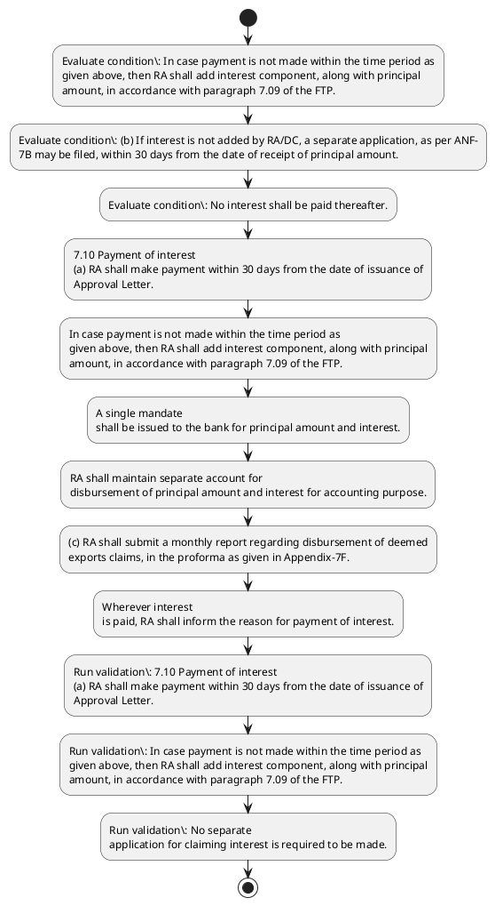

# Chapter 7 / Section 7.10: Payment of interest

**Chapter Title:** Deemed Exports

**Pages:** 5

**Purpose:** 7.10 Payment of interest
(a) RA shall make payment within 30 days from the date of issuance of
Approval Letter.

**Purpose Thanglish:** Indha Payment of interest section-la, 7.10 Payment of interest
(a) RA kandippa make payment within 30 days from the date of issuance of
Approval Letter.

**Summary:** 7.10 Payment of interest
(a) RA shall make payment within 30 days from the date of issuance of
Approval Letter. In case payment is not made within the time period as
given above, then RA shall add interest component, along with principal
amount, in accordance with paragraph 7.09 of the FTP. No separate
application for claiming interest is required to be made.

**Business Meaning:** Payment of interest governs how DGFT business controls should be applied, validated, and enforced.

**Business Explanation:** Payment of interest explains the operating rule set that DEKAI should enforce. Key control points include 7.10 Payment of interest
(a) RA shall make payment within 30 days from the date of issuance of
Approval Letter. The section also drives actions such as 7.10 Payment of interest
(a) RA shall make payment within 30 days from the date of issuance of
Approval Letter..

**Business Explanation Thanglish:** Indha Payment of interest section-la, Payment of interest explains the operating rule set that DEKAI should enforce. Key control points include 7.10 Payment of interest
(a) RA kandippa make payment within 30 days from the date of issuance of
Approval Letter. The section also drives actions such as 7.10 Payment of interest
(a) RA kandippa make payment within 30 days from the date of issuance of
Approval Letter..

## Business Logic
- 7.10 Payment of interest
(a) RA shall make payment within 30 days from the date of issuance of
Approval Letter.
- In case payment is not made within the time period as
given above, then RA shall add interest component, along with principal
amount, in accordance with paragraph 7.09 of the FTP.
- No separate
application for claiming interest is required to be made.
- A single mandate
shall be issued to the bank for principal amount and interest.
- No interest shall be paid thereafter.
- RA shall maintain separate account for
disbursement of principal amount and interest for accounting purpose.
- (c) RA shall submit a monthly report regarding disbursement of deemed
exports claims, in the proforma as given in Appendix-7F.
- Wherever interest
is paid, RA shall inform the reason for payment of interest.
- 161
7.10 Payment of interest
(a)
RA shall make payment within 30 days from the date of issuance of
Approval Letter.
- (c)
RA shall submit a monthly report regarding disbursement of deemed
exports claims, in the proforma as given in Appendix-7F.

## Business Rules
- rule_id=CH7-SEC7_10-R001, rule_description=7.10 Payment of interest
(a) RA shall make payment within 30 days from the date of issuance of
Approval Letter., trigger=Payment of interest, condition=In case payment is not made within the time period as
given above, then RA shall add interest component, along with principal
amount, in accordance with paragraph 7.09 of the FTP., validation=7.10 Payment of interest
(a) RA shall make payment within 30 days from the date of issuance of
Approval Letter., action=7.10 Payment of interest
(a) RA shall make payment within 30 days from the date of issuance of
Approval Letter., exception=No explicit exception found in uploaded documents., output=DEKAI should produce a compliance decision for 7.10 - Payment of interest.
- rule_id=CH7-SEC7_10-R002, rule_description=In case payment is not made within the time period as
given above, then RA shall add interest component, along with principal
amount, in accordance with paragraph 7.09 of the FTP., trigger=Payment of interest, condition=interest is not added by RA/DC, validation=In case payment is not made within the time period as
given above, then RA shall add interest component, along with principal
amount, in accordance with paragraph 7.09 of the FTP., action=In case payment is not made within the time period as
given above, then RA shall add interest component, along with principal
amount, in accordance with paragraph 7.09 of the FTP., exception=No explicit exception found in uploaded documents., output=DEKAI should produce a compliance decision for 7.10 - Payment of interest.
- rule_id=CH7-SEC7_10-R003, rule_description=No separate
application for claiming interest is required to be made., trigger=Payment of interest, condition=No interest shall be paid thereafter., validation=No separate
application for claiming interest is required to be made., action=A single mandate
shall be issued to the bank for principal amount and interest., exception=No explicit exception found in uploaded documents., output=DEKAI should produce a compliance decision for 7.10 - Payment of interest.
- rule_id=CH7-SEC7_10-R004, rule_description=A single mandate
shall be issued to the bank for principal amount and interest., trigger=Payment of interest, condition=Wherever interest
is paid, RA shall inform the reason for payment of interest., validation=A single mandate
shall be issued to the bank for principal amount and interest., action=RA shall maintain separate account for
disbursement of principal amount and interest for accounting purpose., exception=No explicit exception found in uploaded documents., output=DEKAI should produce a compliance decision for 7.10 - Payment of interest.
- rule_id=CH7-SEC7_10-R005, rule_description=No interest shall be paid thereafter., trigger=Payment of interest, condition=interest is not added by RA/DC, validation=No interest shall be paid thereafter., action=(c) RA shall submit a monthly report regarding disbursement of deemed
exports claims, in the proforma as given in Appendix-7F., exception=No explicit exception found in uploaded documents., output=DEKAI should produce a compliance decision for 7.10 - Payment of interest.
- rule_id=CH7-SEC7_10-R006, rule_description=RA shall maintain separate account for
disbursement of principal amount and interest for accounting purpose., trigger=Payment of interest, condition=interest is not added by RA/DC, validation=RA shall maintain separate account for
disbursement of principal amount and interest for accounting purpose., action=Wherever interest
is paid, RA shall inform the reason for payment of interest., exception=No explicit exception found in uploaded documents., output=DEKAI should produce a compliance decision for 7.10 - Payment of interest.
- rule_id=CH7-SEC7_10-R007, rule_description=(c) RA shall submit a monthly report regarding disbursement of deemed
exports claims, in the proforma as given in Appendix-7F., trigger=Payment of interest, condition=interest is not added by RA/DC, validation=(c) RA shall submit a monthly report regarding disbursement of deemed
exports claims, in the proforma as given in Appendix-7F., action=161
7.10 Payment of interest
(a)
RA shall make payment within 30 days from the date of issuance of
Approval Letter., exception=No explicit exception found in uploaded documents., output=DEKAI should produce a compliance decision for 7.10 - Payment of interest.
- rule_id=CH7-SEC7_10-R008, rule_description=Wherever interest
is paid, RA shall inform the reason for payment of interest., trigger=Payment of interest, condition=interest is not added by RA/DC, validation=Wherever interest
is paid, RA shall inform the reason for payment of interest., action=(c)
RA shall submit a monthly report regarding disbursement of deemed
exports claims, in the proforma as given in Appendix-7F., exception=No explicit exception found in uploaded documents., output=DEKAI should produce a compliance decision for 7.10 - Payment of interest.
- rule_id=CH7-SEC7_10-R009, rule_description=161
7.10 Payment of interest
(a)
RA shall make payment within 30 days from the date of issuance of
Approval Letter., trigger=Payment of interest, condition=interest is not added by RA/DC, validation=161
7.10 Payment of interest
(a)
RA shall make payment within 30 days from the date of issuance of
Approval Letter., action=(c)
RA shall submit a monthly report regarding disbursement of deemed
exports claims, in the proforma as given in Appendix-7F., exception=No explicit exception found in uploaded documents., output=DEKAI should produce a compliance decision for 7.10 - Payment of interest.
- rule_id=CH7-SEC7_10-R010, rule_description=(c)
RA shall submit a monthly report regarding disbursement of deemed
exports claims, in the proforma as given in Appendix-7F., trigger=Payment of interest, condition=interest is not added by RA/DC, validation=(c)
RA shall submit a monthly report regarding disbursement of deemed
exports claims, in the proforma as given in Appendix-7F., action=(c)
RA shall submit a monthly report regarding disbursement of deemed
exports claims, in the proforma as given in Appendix-7F., exception=No explicit exception found in uploaded documents., output=DEKAI should produce a compliance decision for 7.10 - Payment of interest.

## Conditions
- In case payment is not made within the time period as
given above, then RA shall add interest component, along with principal
amount, in accordance with paragraph 7.09 of the FTP.
- (b) If interest is not added by RA/DC, a separate application, as per ANF-
7B may be filed, within 30 days from the date of receipt of principal amount.
- No interest shall be paid thereafter.
- Wherever interest
is paid, RA shall inform the reason for payment of interest.
- (b)
If interest is not added by RA/DC, a separate application, as per ANF-
7B may be filed, within 30 days from the date of receipt of principal amount.

## Condition Logic
- id=7.7.10.1, if=In case payment is not made within the time period as
given above, then RA shall add interest component, along with principal
amount, in accordance with paragraph 7.09 of the FTP., then=7.10 Payment of interest
(a) RA shall make payment within 30 days from the date of issuance of
Approval Letter., source=In case payment is not made within the time period as
given above, then RA shall add interest component, along with principal
amount, in accordance with paragraph 7.09 of the FTP.
- id=7.7.10.2, if=interest is not added by RA/DC, then=7.10 Payment of interest
(a) RA shall make payment within 30 days from the date of issuance of
Approval Letter., source=(b) If interest is not added by RA/DC, a separate application, as per ANF-
7B may be filed, within 30 days from the date of receipt of principal amount.
- id=7.7.10.3, if=No interest shall be paid thereafter., then=7.10 Payment of interest
(a) RA shall make payment within 30 days from the date of issuance of
Approval Letter., source=No interest shall be paid thereafter.
- id=7.7.10.4, if=Wherever interest
is paid, RA shall inform the reason for payment of interest., then=7.10 Payment of interest
(a) RA shall make payment within 30 days from the date of issuance of
Approval Letter., source=Wherever interest
is paid, RA shall inform the reason for payment of interest.
- id=7.7.10.5, if=interest is not added by RA/DC, then=7.10 Payment of interest
(a) RA shall make payment within 30 days from the date of issuance of
Approval Letter., source=(b)
If interest is not added by RA/DC, a separate application, as per ANF-
7B may be filed, within 30 days from the date of receipt of principal amount.

## Validations
- 7.10 Payment of interest
(a) RA shall make payment within 30 days from the date of issuance of
Approval Letter.
- In case payment is not made within the time period as
given above, then RA shall add interest component, along with principal
amount, in accordance with paragraph 7.09 of the FTP.
- No separate
application for claiming interest is required to be made.
- A single mandate
shall be issued to the bank for principal amount and interest.
- No interest shall be paid thereafter.
- RA shall maintain separate account for
disbursement of principal amount and interest for accounting purpose.
- (c) RA shall submit a monthly report regarding disbursement of deemed
exports claims, in the proforma as given in Appendix-7F.
- Wherever interest
is paid, RA shall inform the reason for payment of interest.
- 161
7.10 Payment of interest
(a)
RA shall make payment within 30 days from the date of issuance of
Approval Letter.
- (c)
RA shall submit a monthly report regarding disbursement of deemed
exports claims, in the proforma as given in Appendix-7F.

## Exceptions
- None identified

## Dependencies
- 7.09

## Authorities
- RA
- If interest is not added by RA

## Required Documents
- No separate
application for claiming interest is required to be made.
- (b) If interest is not added by RA/DC, a separate application, as per ANF-
7B may be filed, within 30 days from the date of receipt of principal amount.
- (b)
If interest is not added by RA/DC, a separate application, as per ANF-
7B may be filed, within 30 days from the date of receipt of principal amount.

## Timelines
- 7.10 Payment of interest
(a) RA shall make payment within 30 days from the date of issuance of
Approval Letter.
- In case payment is not made within the time period as
given above, then RA shall add interest component, along with principal
amount, in accordance with paragraph 7.09 of the FTP.
- (b) If interest is not added by RA/DC, a separate application, as per ANF-
7B may be filed, within 30 days from the date of receipt of principal amount.
- No interest shall be paid thereafter.
- 161
7.10 Payment of interest
(a)
RA shall make payment within 30 days from the date of issuance of
Approval Letter.
- (b)
If interest is not added by RA/DC, a separate application, as per ANF-
7B may be filed, within 30 days from the date of receipt of principal amount.

## Actions
- 7.10 Payment of interest
(a) RA shall make payment within 30 days from the date of issuance of
Approval Letter.
- In case payment is not made within the time period as
given above, then RA shall add interest component, along with principal
amount, in accordance with paragraph 7.09 of the FTP.
- A single mandate
shall be issued to the bank for principal amount and interest.
- RA shall maintain separate account for
disbursement of principal amount and interest for accounting purpose.
- (c) RA shall submit a monthly report regarding disbursement of deemed
exports claims, in the proforma as given in Appendix-7F.
- Wherever interest
is paid, RA shall inform the reason for payment of interest.
- 161
7.10 Payment of interest
(a)
RA shall make payment within 30 days from the date of issuance of
Approval Letter.
- (c)
RA shall submit a monthly report regarding disbursement of deemed
exports claims, in the proforma as given in Appendix-7F.

## Workflow
- Evaluate condition: In case payment is not made within the time period as
given above, then RA shall add interest component, along with principal
amount, in accordance with paragraph 7.09 of the FTP.
- Evaluate condition: (b) If interest is not added by RA/DC, a separate application, as per ANF-
7B may be filed, within 30 days from the date of receipt of principal amount.
- Evaluate condition: No interest shall be paid thereafter.
- 7.10 Payment of interest
(a) RA shall make payment within 30 days from the date of issuance of
Approval Letter.
- In case payment is not made within the time period as
given above, then RA shall add interest component, along with principal
amount, in accordance with paragraph 7.09 of the FTP.
- A single mandate
shall be issued to the bank for principal amount and interest.
- RA shall maintain separate account for
disbursement of principal amount and interest for accounting purpose.
- (c) RA shall submit a monthly report regarding disbursement of deemed
exports claims, in the proforma as given in Appendix-7F.
- Wherever interest
is paid, RA shall inform the reason for payment of interest.
- Run validation: 7.10 Payment of interest
(a) RA shall make payment within 30 days from the date of issuance of
Approval Letter.
- Run validation: In case payment is not made within the time period as
given above, then RA shall add interest component, along with principal
amount, in accordance with paragraph 7.09 of the FTP.
- Run validation: No separate
application for claiming interest is required to be made.

## Workflow ASCII
```text
Payment of interest
Evaluate condition: In case payment is not made within the time period as
given above, then RA shall add interest component, along with principal
amount, in accordance with paragraph 7.09 of the FTP.
   |
   v
Evaluate condition: (b) If interest is not added by RA/DC, a separate application, as per ANF-
7B may be filed, within 30 days from the date of receipt of principal amount.
   |
   v
Evaluate condition: No interest shall be paid thereafter.
   |
   v
7.10 Payment of interest
(a) RA shall make payment within 30 days from the date of issuance of
Approval Letter.
   |
   v
In case payment is not made within the time period as
given above, then RA shall add interest component, along with principal
amount, in accordance with paragraph 7.09 of the FTP.
   |
   v
A single mandate
shall be issued to the bank for principal amount and interest.
   |
   v
RA shall maintain separate account for
disbursement of principal amount and interest for accounting purpose.
   |
   v
(c) RA shall submit a monthly report regarding disbursement of deemed
exports claims, in the proforma as given in Appendix-7F.
   |
   v
Wherever interest
is paid, RA shall inform the reason for payment of interest.
   |
   v
Run validation: 7.10 Payment of interest
(a) RA shall make payment within 30 days from the date of issuance of
Approval Letter.
   |
   v
Run validation: In case payment is not made within the time period as
given above, then RA shall add interest component, along with principal
amount, in accordance with paragraph 7.09 of the FTP.
   |
   v
Run validation: No separate
application for claiming interest is required to be made.
```

## Decision Tree
- IF In case payment is not made within the time period as
given above, then RA shall add interest component, along with principal
amount, in accordance with paragraph 7.09 of the FTP. THEN 7.10 Payment of interest
(a) RA shall make payment within 30 days from the date of issuance of
Approval Letter.
- IF (b) If interest is not added by RA/DC, a separate application, as per ANF-
7B may be filed, within 30 days from the date of receipt of principal amount. THEN 7.10 Payment of interest
(a) RA shall make payment within 30 days from the date of issuance of
Approval Letter.
- IF No interest shall be paid thereafter. THEN 7.10 Payment of interest
(a) RA shall make payment within 30 days from the date of issuance of
Approval Letter.
- IF Wherever interest
is paid, RA shall inform the reason for payment of interest. THEN 7.10 Payment of interest
(a) RA shall make payment within 30 days from the date of issuance of
Approval Letter.
- IF (b)
If interest is not added by RA/DC, a separate application, as per ANF-
7B may be filed, within 30 days from the date of receipt of principal amount. THEN 7.10 Payment of interest
(a) RA shall make payment within 30 days from the date of issuance of
Approval Letter.

## Decision Tree ASCII
```text
Payment of interest Decision
IF In case payment is not made within the time period as
given above, then RA shall add interest component, along with principal
amount, in accordance with paragraph 7.09 of the FTP. THEN 7.10 Payment of interest
(a) RA shall make payment within 30 days from the date of issuance of
Approval Letter.
   |
   v
IF (b) If interest is not added by RA/DC, a separate application, as per ANF-
7B may be filed, within 30 days from the date of receipt of principal amount. THEN 7.10 Payment of interest
(a) RA shall make payment within 30 days from the date of issuance of
Approval Letter.
   |
   v
IF No interest shall be paid thereafter. THEN 7.10 Payment of interest
(a) RA shall make payment within 30 days from the date of issuance of
Approval Letter.
   |
   v
IF Wherever interest
is paid, RA shall inform the reason for payment of interest. THEN 7.10 Payment of interest
(a) RA shall make payment within 30 days from the date of issuance of
Approval Letter.
   |
   v
IF (b)
If interest is not added by RA/DC, a separate application, as per ANF-
7B may be filed, within 30 days from the date of receipt of principal amount. THEN 7.10 Payment of interest
(a) RA shall make payment within 30 days from the date of issuance of
Approval Letter.
```

## Examples
- User asks to process Payment of interest; the platform checks conditions, validations, and documents before action.

**Real-world Example:** Example: an importer or exporter invokes Payment of interest, submits No separate
application for claiming interest is required to be made., (b) If interest is not added by RA/DC, a separate application, as per ANF-
7B may be filed, within 30 days from the date of receipt of principal amount., (b)
If interest is not added by RA/DC, a separate application, as per ANF-
7B may be filed, within 30 days from the date of receipt of principal amount., and DEKAI uses the extracted rules to 7.10 payment of interest
(a) ra shall make payment within 30 days from the date of issuance of
approval letter..

**Real-world Example Thanglish:** Indha Payment of interest section-la, Example: an importer or exporter invokes Payment of interest, submits No separate
application for claiming interest is required to be made., (b) If interest is not added by RA/DC, a separate application, as per ANF-
7B may be filed, within 30 days from the date of receipt of principal amount., (b)
If interest is not added by RA/DC, a separate application, as per ANF-
7B may be filed, within 30 days from the date of receipt of principal amount., and DEKAI uses the extracted rules to 7.10 payment of interest
(a) ra kandippa make payment within 30 days from the date of issuance of
approval letter..

## AI Rules
- IF detected context matches section rule THEN enforce: 7.10 Payment of interest
(a) RA shall make payment within 30 days from the date of issuance of
Approval Letter.
- IF detected context matches section rule THEN enforce: In case payment is not made within the time period as
given above, then RA shall add interest component, along with principal
amount, in accordance with paragraph 7.09 of the FTP.
- IF detected context matches section rule THEN enforce: No separate
application for claiming interest is required to be made.
- IF detected context matches section rule THEN enforce: A single mandate
shall be issued to the bank for principal amount and interest.
- IF detected context matches section rule THEN enforce: No interest shall be paid thereafter.
- IF detected context matches section rule THEN enforce: RA shall maintain separate account for
disbursement of principal amount and interest for accounting purpose.
- IF validations pass THEN recommend action: 7.10 Payment of interest
(a) RA shall make payment within 30 days from the date of issuance of
Approval Letter.

## Database Fields
- name=section_code, type=string, required=True, source=parsed_section_heading
- name=section_title, type=string, required=True, source=parsed_section_heading
- name=the_flag, type=boolean, required=False, source=keyword:the
- name=not_flag, type=boolean, required=False, source=keyword:not
- name=add_flag, type=boolean, required=False, source=keyword:add
- name=ftp_flag, type=boolean, required=False, source=keyword:FTP
- name=for_flag, type=boolean, required=False, source=keyword:for
- name=and_flag, type=boolean, required=False, source=keyword:and
- name=per_flag, type=boolean, required=False, source=keyword:per
- name=anf_flag, type=boolean, required=False, source=keyword:ANF
- name=document_1_submitted, type=boolean, required=True, source=No separate
application for claiming interest is required to be made.
- name=document_2_submitted, type=boolean, required=True, source=(b) If interest is not added by RA/DC, a separate application, as per ANF-
7B may be filed, within 30 days from the date of receipt of principal amount.
- name=document_3_submitted, type=boolean, required=True, source=(b)
If interest is not added by RA/DC, a separate application, as per ANF-
7B may be filed, within 30 days from the date of receipt of principal amount.

## API Requirements
- method=GET, path=/api/dgft/sections/7.10, purpose=Retrieve knowledge payload for section 7.10, query_params=['include=workflow,decision_tree,validations'], response_fields=['section', 'title', 'summary', 'conditions', 'validations', 'exceptions', 'workflow', 'decision_tree']
- method=POST, path=/api/dgft/Payment-of-interest/validate, purpose=Validate inputs and documents for Payment of interest, request_fields=['section_code', 'section_title', 'document_1_submitted', 'document_2_submitted', 'document_3_submitted'], response_fields=['status', 'errors', 'warnings', 'next_actions']
- method=POST, path=/api/dgft/Payment-of-interest/execute, purpose=Trigger business action for 7.10 Payment of interest
(a) RA shall make payment within 30 days from the date of issuance of
Approval Letter., request_fields=['section_code', 'section_title', 'document_1_submitted', 'document_2_submitted', 'document_3_submitted'], response_fields=['reference_id', 'status', 'authority', 'timeline']

## UI Screens
- screen_id=Payment_of_interest_overview, name=Payment of interest Overview, purpose=Show section summary, authority, timeline, and eligibility cues., widgets=['summary_card', 'conditions_table', 'authority_badges', 'timeline_panel']
- screen_id=Payment_of_interest_submission, name=Payment of interest Submission, purpose=Capture applicant data and supporting documents., widgets=['dynamic_form', 'document_uploader', 'validation_panel', 'next_action_footer'], fields=['section_code', 'section_title', 'the_flag', 'not_flag', 'add_flag', 'ftp_flag', 'for_flag', 'and_flag']

## Error Messages
- Validation failed because the section requirements were not fully met.

## FAQ
- question_en=What is the purpose of section 7.10?, answer_en=Payment of interest explains the operating rule set that DEKAI should enforce. Key control points include 7.10 Payment of interest
(a) RA shall make payment within 30 days from the date of issuance of
Approval Letter. The section also drives actions such as 7.10 Payment of interest
(a) RA shall make payment within 30 days from the date of issuance of
Approval Letter.., question_thanglish=Indha Payment of interest section-la, What is the purpose of section 7.10?, answer_thanglish=Indha Payment of interest section-la, Payment of interest explains the operating rule set that DEKAI should enforce. Key control points include 7.10 Payment of interest
(a) RA kandippa make payment within 30 days from the date of issuance of
Approval Letter. The section also drives actions such as 7.10 Payment of interest
(a) RA kandippa make payment within 30 days from the date of issuance of
Approval Letter..
- question_en=What documents are required under Payment of interest?, answer_en=No separate
application for claiming interest is required to be made., (b) If interest is not added by RA/DC, a separate application, as per ANF-
7B may be filed, within 30 days from the date of receipt of principal amount., (b)
If interest is not added by RA/DC, a separate application, as per ANF-
7B may be filed, within 30 days from the date of receipt of principal amount., question_thanglish=Indha Payment of interest section-la, What documents are required under Payment of interest?, answer_thanglish=Indha Payment of interest section-la, No separate
application for claiming interest is required to be made., (b) If interest is not added by RA/DC, a separate application, as per ANF-
7B may be filed, within 30 days from the date of receipt of principal amount., (b)
If interest is not added by RA/DC, a separate application, as per ANF-
7B may be filed, within 30 days from the date of receipt of principal amount.
- question_en=Which authority handles Payment of interest?, answer_en=RA, If interest is not added by RA, question_thanglish=Indha Payment of interest section-la, Which authority handles Payment of interest?, answer_thanglish=Indha Payment of interest section-la, RA, If interest is not added by RA

## Questions Users May Ask
- What does Payment of interest require?
- Which documents are needed for Payment of interest?
- How does DEKAI validate Payment of interest requests?
- What action should be taken for Payment of interest?

## Expected AI Answers
- Payment of interest requires the platform to interpret the section text, apply the extracted business rules, and present the correct next action.
- Required documents are inferred from the section text: No separate
application for claiming interest is required to be made., (b) If interest is not added by RA/DC, a separate application, as per ANF-
7B may be filed, within 30 days from the date of receipt of principal amount., (b)
If interest is not added by RA/DC, a separate application, as per ANF-
7B may be filed, within 30 days from the date of receipt of principal amount.
- DEKAI validates Payment of interest by checking conditions, required documents, authority references, and exception clauses before recommending an outcome.
- The primary extracted action is: 7.10 Payment of interest
(a) RA shall make payment within 30 days from the date of issuance of
Approval Letter.

## AI Q&A Examples
- question_en=User asks: How do I comply with Payment of interest?, answer_en=AI answers: DEKAI should evaluate section 7.10, apply the extracted rules, and guide the user through Evaluate condition: In case payment is not made within the time period as
given above, then RA shall add interest component, along with principal
amount, in accordance with paragraph 7.09 of the FTP.., question_thanglish=Indha Payment of interest section-la, User asks: How do I comply with Payment of interest?, answer_thanglish=Indha Payment of interest section-la, AI answers: DEKAI should evaluate section 7.10, apply the extracted rules, and guide the user through Evaluate condition: In case payment is not made within the time period as
given above, then RA kandippa add interest component, along with principal
amount, in accordance with paragraph 7.09 of the FTP..
- question_en=User asks: Which validations apply to Payment of interest?, answer_en=AI answers: Applicable validations are 7.10 Payment of interest
(a) RA shall make payment within 30 days from the date of issuance of
Approval Letter., In case payment is not made within the time period as
given above, then RA shall add interest component, along with principal
amount, in accordance with paragraph 7.09 of the FTP., No separate
application for claiming interest is required to be made., question_thanglish=Indha Payment of interest section-la, User asks: Which validations apply to Payment of interest?, answer_thanglish=Indha Payment of interest section-la, AI answers: Applicable validations are 7.10 Payment of interest
(a) RA kandippa make payment within 30 days from the date of issuance of
Approval Letter., In case payment is not made within the time period as
given above, then RA kandippa add interest component, along with principal
amount, in accordance with paragraph 7.09 of the FTP., No separate
application for claiming interest is required to be made.

## DEKAI AI Implementation Notes
- Capture chapter 7, section 7.10, title, and page references as immutable knowledge metadata.
- Bind validations for Payment of interest into a rule engine keyed by the rule IDs extracted for this section.
- Expose document upload controls for: No separate
application for claiming interest is required to be made., (b) If interest is not added by RA/DC, a separate application, as per ANF-
7B may be filed, within 30 days from the date of receipt of principal amount., (b)
If interest is not added by RA/DC, a separate application, as per ANF-
7B may be filed, within 30 days from the date of receipt of principal amount..
- Route escalations or approvals to: RA, If interest is not added by RA.
- Show contextual links to related sections: 7.09.

## DEKAI AI Implementation Notes Thanglish
- Indha Payment of interest section-la, Capture chapter 7, section 7.10, title, and page references as immutable knowledge metadata.
- Indha Payment of interest section-la, Bind validations for Payment of interest into a rule engine keyed by the rule IDs extracted for this section.
- Indha Payment of interest section-la, Expose document upload controls for: No separate
application for claiming interest is required to be made., (b) If interest is not added by RA/DC, a separate application, as per ANF-
7B may be filed, within 30 days from the date of receipt of principal amount., (b)
If interest is not added by RA/DC, a separate application, as per ANF-
7B may be filed, within 30 days from the date of receipt of principal amount..
- Indha Payment of interest section-la, Route escalations or approvals to: RA, If interest is not added by RA.
- Indha Payment of interest section-la, Show contextual links to related sections: 7.09.

## AI Metadata
- Keywords: the, not, add, FTP, for, and, per, ANF, may, make, days, from, date, case, made, time, then, with, bank, paid
- Search Keywords: the, not, add, FTP, for, and, per, ANF, may, make, days, from, date, case, made, time, then, with, bank, paid
- Intent: Support Payment of interest processing and compliance validation.
- Tags: 7.10, Payment of interest, business-rule, document-driven, dgft
- Related Sections: 7.09
- Related Chapters: 
- Related Rules: 7.10 Payment of interest
(a) RA shall make payment within 30 days from the date of issuance of
Approval Letter., In case payment is not made within the time period as
given above, then RA shall add interest component, along with principal
amount, in accordance with paragraph 7.09 of the FTP., No separate
application for claiming interest is required to be made., A single mandate
shall be issued to the bank for principal amount and interest., No interest shall be paid thereafter.

## Mermaid

```mermaid
flowchart TD
    S1["Evaluate condition: In case payment is not made within the time period as
given above, then RA shall add interest component, along with principal
amount, in accordance with paragraph 7.09 of the FTP."]
    S2["Evaluate condition: (b) If interest is not added by RA/DC, a separate application, as per ANF-
7B may be filed, within 30 days from the date of receipt of principal amount."]
    S1 --> S2
    S3["Evaluate condition: No interest shall be paid thereafter."]
    S2 --> S3
    S4["7.10 Payment of interest
(a) RA shall make payment within 30 days from the date of issuance of
Approval Letter."]
    S3 --> S4
    S5["In case payment is not made within the time period as
given above, then RA shall add interest component, along with principal
amount, in accordance with paragraph 7.09 of the FTP."]
    S4 --> S5
    S6["A single mandate
shall be issued to the bank for principal amount and interest."]
    S5 --> S6
    S7["RA shall maintain separate account for
disbursement of principal amount and interest for accounting purpose."]
    S6 --> S7
    S8["(c) RA shall submit a monthly report regarding disbursement of deemed
exports claims, in the proforma as given in Appendix-7F."]
    S7 --> S8
    S9["Wherever interest
is paid, RA shall inform the reason for payment of interest."]
    S8 --> S9
    S10["Run validation: 7.10 Payment of interest
(a) RA shall make payment within 30 days from the date of issuance of
Approval Letter."]
    S9 --> S10
    S11["Run validation: In case payment is not made within the time period as
given above, then RA shall add interest component, along with principal
amount, in accordance with paragraph 7.09 of the FTP."]
    S10 --> S11
    S12["Run validation: No separate
application for claiming interest is required to be made."]
    S11 --> S12
```


## PlantUML

