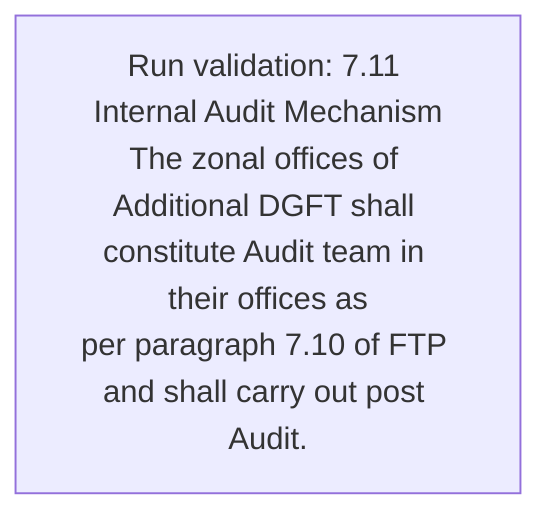
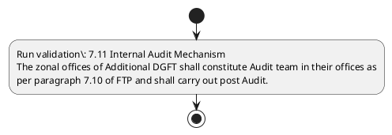

# Chapter 7 / Section 7.11: Internal Audit Mechanism

**Chapter Title:** Deemed Exports

**Pages:** 6

**Purpose:** 7.11 Internal Audit Mechanism
The zonal offices of Additional DGFT shall constitute Audit team in their offices as
per paragraph 7.10 of FTP and shall carry out post Audit.

**Purpose Thanglish:** Indha Internal Audit Mechanism section-la, 7.11 Internal Audit Mechanism
The zonal offices of Additional DGFT kandippa constitute Audit team in their offices as
per paragraph 7.10 of FTP and kandippa carry out post Audit.

**Summary:** 7.11 Internal Audit Mechanism
The zonal offices of Additional DGFT shall constitute Audit team in their offices as
per paragraph 7.10 of FTP and shall carry out post Audit. pg. 162
pg.

**Business Meaning:** Internal Audit Mechanism governs how DGFT business controls should be applied, validated, and enforced.

**Business Explanation:** Internal Audit Mechanism explains the operating rule set that DEKAI should enforce. Key control points include 7.11 Internal Audit Mechanism
The zonal offices of Additional DGFT shall constitute Audit team in their offices as
per paragraph 7.10 of FTP and shall carry out post Audit.

**Business Explanation Thanglish:** Indha Internal Audit Mechanism section-la, Internal Audit Mechanism explains the operating rule set that DEKAI should enforce. Key control points include 7.11 Internal Audit Mechanism
The zonal offices of Additional DGFT kandippa constitute Audit team in their offices as
per paragraph 7.10 of FTP and kandippa carry out post Audit.

## Business Logic
- 7.11 Internal Audit Mechanism
The zonal offices of Additional DGFT shall constitute Audit team in their offices as
per paragraph 7.10 of FTP and shall carry out post Audit.

## Business Rules
- rule_id=CH7-SEC7_11-R001, rule_description=7.11 Internal Audit Mechanism
The zonal offices of Additional DGFT shall constitute Audit team in their offices as
per paragraph 7.10 of FTP and shall carry out post Audit., trigger=Internal Audit Mechanism, condition=Not explicitly covered in uploaded documents., validation=7.11 Internal Audit Mechanism
The zonal offices of Additional DGFT shall constitute Audit team in their offices as
per paragraph 7.10 of FTP and shall carry out post Audit., action=Manual review required., exception=No explicit exception found in uploaded documents., output=DEKAI should produce a compliance decision for 7.11 - Internal Audit Mechanism.

## Conditions
- None identified

## Condition Logic
- None identified

## Validations
- 7.11 Internal Audit Mechanism
The zonal offices of Additional DGFT shall constitute Audit team in their offices as
per paragraph 7.10 of FTP and shall carry out post Audit.

## Exceptions
- None identified

## Dependencies
- 7.10

## Authorities
- DGFT
- The zonal offices of Additional DGFT

## Required Documents
- None identified

## Timelines
- None identified

## Actions
- None identified

## Workflow
- Run validation: 7.11 Internal Audit Mechanism
The zonal offices of Additional DGFT shall constitute Audit team in their offices as
per paragraph 7.10 of FTP and shall carry out post Audit.

## Workflow ASCII
```text
Internal Audit Mechanism
Run validation: 7.11 Internal Audit Mechanism
The zonal offices of Additional DGFT shall constitute Audit team in their offices as
per paragraph 7.10 of FTP and shall carry out post Audit.
```

## Decision Tree
- IF section 7.11 applies THEN proceed with standard DGFT workflow

## Decision Tree ASCII
```text
Internal Audit Mechanism Decision
IF section 7.11 applies THEN proceed with standard DGFT workflow
```

## Examples
- User asks to process Internal Audit Mechanism; the platform checks conditions, validations, and documents before action.

**Real-world Example:** Example: an importer or exporter invokes Internal Audit Mechanism, submits the prescribed DGFT records, and DEKAI uses the extracted rules to follow the internal audit mechanism process.

**Real-world Example Thanglish:** Indha Internal Audit Mechanism section-la, Example: an importer or exporter invokes Internal Audit Mechanism, submits the prescribed DGFT records, and DEKAI uses the extracted rules to follow the internal audit mechanism process.

## AI Rules
- IF detected context matches section rule THEN enforce: 7.11 Internal Audit Mechanism
The zonal offices of Additional DGFT shall constitute Audit team in their offices as
per paragraph 7.10 of FTP and shall carry out post Audit.

## Database Fields
- name=section_code, type=string, required=True, source=parsed_section_heading
- name=section_title, type=string, required=True, source=parsed_section_heading
- name=the_flag, type=boolean, required=False, source=keyword:The
- name=per_flag, type=boolean, required=False, source=keyword:per
- name=ftp_flag, type=boolean, required=False, source=keyword:FTP
- name=and_flag, type=boolean, required=False, source=keyword:and
- name=out_flag, type=boolean, required=False, source=keyword:out
- name=dgft_flag, type=boolean, required=False, source=keyword:DGFT
- name=team_flag, type=boolean, required=False, source=keyword:team
- name=post_flag, type=boolean, required=False, source=keyword:post

## API Requirements
- method=GET, path=/api/dgft/sections/7.11, purpose=Retrieve knowledge payload for section 7.11, query_params=['include=workflow,decision_tree,validations'], response_fields=['section', 'title', 'summary', 'conditions', 'validations', 'exceptions', 'workflow', 'decision_tree']
- method=POST, path=/api/dgft/Internal-Audit-Mechanism/validate, purpose=Validate inputs and documents for Internal Audit Mechanism, request_fields=['section_code', 'section_title'], response_fields=['status', 'errors', 'warnings', 'next_actions']

## UI Screens
- screen_id=Internal_Audit_Mechanism_overview, name=Internal Audit Mechanism Overview, purpose=Show section summary, authority, timeline, and eligibility cues., widgets=['summary_card', 'conditions_table', 'authority_badges', 'timeline_panel']
- screen_id=Internal_Audit_Mechanism_submission, name=Internal Audit Mechanism Submission, purpose=Capture applicant data and supporting documents., widgets=['dynamic_form', 'document_uploader', 'validation_panel', 'next_action_footer'], fields=['section_code', 'section_title', 'the_flag', 'per_flag', 'ftp_flag', 'and_flag', 'out_flag', 'dgft_flag']

## Error Messages
- Validation failed because the section requirements were not fully met.

## FAQ
- question_en=What is the purpose of section 7.11?, answer_en=Internal Audit Mechanism explains the operating rule set that DEKAI should enforce. Key control points include 7.11 Internal Audit Mechanism
The zonal offices of Additional DGFT shall constitute Audit team in their offices as
per paragraph 7.10 of FTP and shall carry out post Audit., question_thanglish=Indha Internal Audit Mechanism section-la, What is the purpose of section 7.11?, answer_thanglish=Indha Internal Audit Mechanism section-la, Internal Audit Mechanism explains the operating rule set that DEKAI should enforce. Key control points include 7.11 Internal Audit Mechanism
The zonal offices of Additional DGFT kandippa constitute Audit team in their offices as
per paragraph 7.10 of FTP and kandippa carry out post Audit.
- question_en=What documents are required under Internal Audit Mechanism?, answer_en=Not explicitly covered in uploaded documents., question_thanglish=Indha Internal Audit Mechanism section-la, What documents are required under Internal Audit Mechanism?, answer_thanglish=Indha Internal Audit Mechanism section-la, Not explicitly covered in uploaded documents.
- question_en=Which authority handles Internal Audit Mechanism?, answer_en=DGFT, The zonal offices of Additional DGFT, question_thanglish=Indha Internal Audit Mechanism section-la, Which authority handles Internal Audit Mechanism?, answer_thanglish=Indha Internal Audit Mechanism section-la, DGFT, The zonal offices of Additional DGFT

## Questions Users May Ask
- What does Internal Audit Mechanism require?
- Which documents are needed for Internal Audit Mechanism?
- How does DEKAI validate Internal Audit Mechanism requests?

## Expected AI Answers
- Internal Audit Mechanism requires the platform to interpret the section text, apply the extracted business rules, and present the correct next action.
- Required documents are inferred from the section text: no explicit documents were detected.
- DEKAI validates Internal Audit Mechanism by checking conditions, required documents, authority references, and exception clauses before recommending an outcome.

## AI Q&A Examples
- question_en=User asks: How do I comply with Internal Audit Mechanism?, answer_en=AI answers: DEKAI should evaluate section 7.11, apply the extracted rules, and guide the user through Run validation: 7.11 Internal Audit Mechanism
The zonal offices of Additional DGFT shall constitute Audit team in their offices as
per paragraph 7.10 of FTP and shall carry out post Audit.., question_thanglish=Indha Internal Audit Mechanism section-la, User asks: How do I comply with Internal Audit Mechanism?, answer_thanglish=Indha Internal Audit Mechanism section-la, AI answers: DEKAI should evaluate section 7.11, apply the extracted rules, and guide the user through Run validation: 7.11 Internal Audit Mechanism
The zonal offices of Additional DGFT kandippa constitute Audit team in their offices as
per paragraph 7.10 of FTP and kandippa carry out post Audit..
- question_en=User asks: Which validations apply to Internal Audit Mechanism?, answer_en=AI answers: Applicable validations are 7.11 Internal Audit Mechanism
The zonal offices of Additional DGFT shall constitute Audit team in their offices as
per paragraph 7.10 of FTP and shall carry out post Audit., question_thanglish=Indha Internal Audit Mechanism section-la, User asks: Which validations apply to Internal Audit Mechanism?, answer_thanglish=Indha Internal Audit Mechanism section-la, AI answers: Applicable validations are 7.11 Internal Audit Mechanism
The zonal offices of Additional DGFT kandippa constitute Audit team in their offices as
per paragraph 7.10 of FTP and kandippa carry out post Audit.

## DEKAI AI Implementation Notes
- Capture chapter 7, section 7.11, title, and page references as immutable knowledge metadata.
- Bind validations for Internal Audit Mechanism into a rule engine keyed by the rule IDs extracted for this section.
- Route escalations or approvals to: DGFT, The zonal offices of Additional DGFT.
- Show contextual links to related sections: 7.10.

## DEKAI AI Implementation Notes Thanglish
- Indha Internal Audit Mechanism section-la, Capture chapter 7, section 7.11, title, and page references as immutable knowledge metadata.
- Indha Internal Audit Mechanism section-la, Bind validations for Internal Audit Mechanism into a rule engine keyed by the rule IDs extracted for this section.
- Indha Internal Audit Mechanism section-la, Route escalations or approvals to: DGFT, The zonal offices of Additional DGFT.
- Indha Internal Audit Mechanism section-la, Show contextual links to related sections: 7.10.

## AI Metadata
- Keywords: The, per, FTP, and, out, DGFT, team, post, Audit, zonal, shall, their, carry, offices, Internal, Mechanism, paragraph, Additional, constitute
- Search Keywords: The, per, FTP, and, out, DGFT, team, post, Audit, zonal, shall, their, carry, offices, Internal, Mechanism, paragraph, Additional, constitute
- Intent: Provide knowledge guidance for Internal Audit Mechanism.
- Tags: 7.11, Internal Audit Mechanism, business-rule, dgft
- Related Sections: 7.10
- Related Chapters: 
- Related Rules: 7.11 Internal Audit Mechanism
The zonal offices of Additional DGFT shall constitute Audit team in their offices as
per paragraph 7.10 of FTP and shall carry out post Audit.

## Mermaid


## PlantUML

