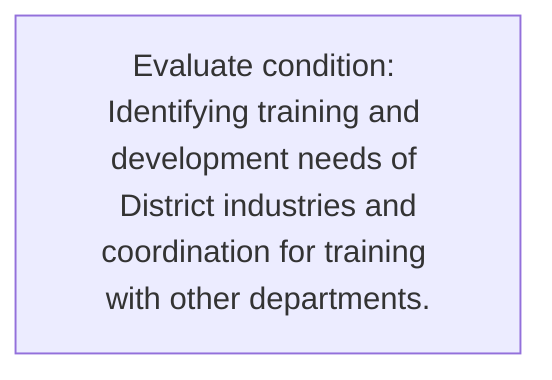
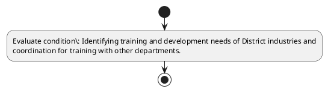

# Chapter 3 / Section 7: Identifying training and development needs of District industries and

**Chapter Title:** Developing Districts as Export Hubs

**Pages:** 4

**Purpose:** Identifying training and development needs of District industries and
coordination for training with other departments.

**Purpose Thanglish:** Indha Identifying training and development needs of District industries and section-la, Identifying training and development needs of District industries and
coordination for training with other departments.

**Summary:** 7. Identifying training and development needs of District industries and
coordination for training with other departments.

**Business Meaning:** 7.

**Business Explanation:** 7. Identifying training and development needs of District industries and
coordination for training with other departments.

**Business Explanation Thanglish:** Indha Identifying training and development needs of District industries and section-la, 7. Identifying training and development needs of District industries and
coordination for training with other departments.

## Business Logic
- None identified

## Business Rules
- rule_id=CH3-SEC7-R001, rule_description=7. Identifying training and development needs of District industries and
coordination for training with other departments., trigger=Identifying training and development needs of District industries and, condition=Identifying training and development needs of District industries and
coordination for training with other departments., validation=Not explicitly covered in uploaded documents., action=Manual review required., exception=No explicit exception found in uploaded documents., output=DEKAI should produce a compliance decision for 7 - Identifying training and development needs of District industries and.

## Conditions
- Identifying training and development needs of District industries and
coordination for training with other departments.

## Condition Logic
- id=3.7.1, if=Identifying training and development needs of District industries and
coordination for training with other departments., then=Route for review, source=Identifying training and development needs of District industries and
coordination for training with other departments.

## Validations
- None identified

## Exceptions
- None identified

## Dependencies
- None identified

## Authorities
- None identified

## Required Documents
- None identified

## Timelines
- None identified

## Actions
- None identified

## Workflow
- Evaluate condition: Identifying training and development needs of District industries and
coordination for training with other departments.

## Workflow ASCII
```text
Identifying training and development needs of District industries and
Evaluate condition: Identifying training and development needs of District industries and
coordination for training with other departments.
```

## Decision Tree
- IF section 7 applies THEN proceed with standard DGFT workflow

## Decision Tree ASCII
```text
Identifying training and development needs of District industries and Decision
IF section 7 applies THEN proceed with standard DGFT workflow
```

## Examples
- User asks to process Identifying training and development needs of District industries and; the platform checks conditions, validations, and documents before action.

**Real-world Example:** Example: an importer or exporter invokes Identifying training and development needs of District industries and, submits the prescribed DGFT records, and DEKAI uses the extracted rules to follow the identifying training and development needs of district industries and process.

**Real-world Example Thanglish:** Indha Identifying training and development needs of District industries and section-la, Example: an importer or exporter invokes Identifying training and development needs of District industries and, submits the prescribed DGFT records, and DEKAI uses the extracted rules to follow the identifying training and development needs of district industries and process.

## AI Rules
- None identified

## Database Fields
- name=section_code, type=string, required=True, source=parsed_section_heading
- name=section_title, type=string, required=True, source=parsed_section_heading
- name=and_flag, type=boolean, required=False, source=keyword:and
- name=for_flag, type=boolean, required=False, source=keyword:for
- name=with_flag, type=boolean, required=False, source=keyword:with
- name=needs_flag, type=boolean, required=False, source=keyword:needs
- name=other_flag, type=boolean, required=False, source=keyword:other
- name=training_flag, type=boolean, required=False, source=keyword:training
- name=district_flag, type=boolean, required=False, source=keyword:District
- name=industries_flag, type=boolean, required=False, source=keyword:industries

## API Requirements
- method=GET, path=/api/dgft/sections/7, purpose=Retrieve knowledge payload for section 7, query_params=['include=workflow,decision_tree,validations'], response_fields=['section', 'title', 'summary', 'conditions', 'validations', 'exceptions', 'workflow', 'decision_tree']
- method=POST, path=/api/dgft/Identifying-training-and-development-needs-of-District-industries-and/validate, purpose=Validate inputs and documents for Identifying training and development needs of District industries and, request_fields=['section_code', 'section_title'], response_fields=['status', 'errors', 'warnings', 'next_actions']

## UI Screens
- screen_id=Identifying_training_and_development_needs_of_District_industries_and_overview, name=Identifying training and development needs of District industries and Overview, purpose=Show section summary, authority, timeline, and eligibility cues., widgets=['summary_card', 'conditions_table', 'authority_badges', 'timeline_panel']
- screen_id=Identifying_training_and_development_needs_of_District_industries_and_submission, name=Identifying training and development needs of District industries and Submission, purpose=Capture applicant data and supporting documents., widgets=['dynamic_form', 'document_uploader', 'validation_panel', 'next_action_footer'], fields=['section_code', 'section_title', 'and_flag', 'for_flag', 'with_flag', 'needs_flag', 'other_flag', 'training_flag']

## Error Messages
- Validation failed because the section requirements were not fully met.

## FAQ
- question_en=What is the purpose of section 7?, answer_en=7. Identifying training and development needs of District industries and
coordination for training with other departments., question_thanglish=Indha Identifying training and development needs of District industries and section-la, What is the purpose of section 7?, answer_thanglish=Indha Identifying training and development needs of District industries and section-la, 7. Identifying training and development needs of District industries and
coordination for training with other departments.
- question_en=What documents are required under Identifying training and development needs of District industries and?, answer_en=Not explicitly covered in uploaded documents., question_thanglish=Indha Identifying training and development needs of District industries and section-la, What documents are required under Identifying training and development needs of District industries and?, answer_thanglish=Indha Identifying training and development needs of District industries and section-la, Not explicitly covered in uploaded documents.
- question_en=Which authority handles Identifying training and development needs of District industries and?, answer_en=Not explicitly covered in uploaded documents., question_thanglish=Indha Identifying training and development needs of District industries and section-la, Which authority handles Identifying training and development needs of District industries and?, answer_thanglish=Indha Identifying training and development needs of District industries and section-la, Not explicitly covered in uploaded documents.

## Questions Users May Ask
- What does Identifying training and development needs of District industries and require?
- Which documents are needed for Identifying training and development needs of District industries and?
- How does DEKAI validate Identifying training and development needs of District industries and requests?

## Expected AI Answers
- Identifying training and development needs of District industries and requires the platform to interpret the section text, apply the extracted business rules, and present the correct next action.
- Required documents are inferred from the section text: no explicit documents were detected.
- DEKAI validates Identifying training and development needs of District industries and by checking conditions, required documents, authority references, and exception clauses before recommending an outcome.

## AI Q&A Examples
- question_en=User asks: How do I comply with Identifying training and development needs of District industries and?, answer_en=AI answers: DEKAI should evaluate section 7, apply the extracted rules, and guide the user through Evaluate condition: Identifying training and development needs of District industries and
coordination for training with other departments.., question_thanglish=Indha Identifying training and development needs of District industries and section-la, User asks: How do I comply with Identifying training and development needs of District industries and?, answer_thanglish=Indha Identifying training and development needs of District industries and section-la, AI answers: DEKAI should evaluate section 7, apply the extracted rules, and guide the user through Evaluate condition: Identifying training and development needs of District industries and
coordination for training with other departments..
- question_en=User asks: Which validations apply to Identifying training and development needs of District industries and?, answer_en=AI answers: Applicable validations are not explicitly covered in the uploaded documents., question_thanglish=Indha Identifying training and development needs of District industries and section-la, User asks: Which validations apply to Identifying training and development needs of District industries and?, answer_thanglish=Indha Identifying training and development needs of District industries and section-la, AI answers: Applicable validations are not explicitly covered in the uploaded documents.

## DEKAI AI Implementation Notes
- Capture chapter 3, section 7, title, and page references as immutable knowledge metadata.
- Bind validations for Identifying training and development needs of District industries and into a rule engine keyed by the rule IDs extracted for this section.

## DEKAI AI Implementation Notes Thanglish
- Indha Identifying training and development needs of District industries and section-la, Capture chapter 3, section 7, title, and page references as immutable knowledge metadata.
- Indha Identifying training and development needs of District industries and section-la, Bind validations for Identifying training and development needs of District industries and into a rule engine keyed by the rule IDs extracted for this section.

## AI Metadata
- Keywords: and, for, with, needs, other, training, District, industries, Identifying, development, departments, coordination
- Search Keywords: and, for, with, needs, other, training, District, industries, Identifying, development, departments, coordination
- Intent: Provide knowledge guidance for Identifying training and development needs of District industries and.
- Tags: 7, Identifying training and development needs of District industries and, dgft
- Related Sections: 
- Related Chapters: 
- Related Rules: 

## Mermaid


## PlantUML

