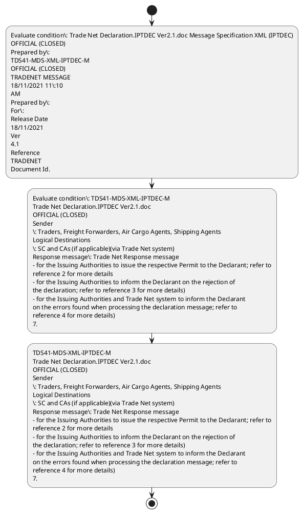

# Chapter  / Section 7: MESSAGE DEFINITION

**Chapter Title:** TradeNetDeclaration.IPTDEC Ver2.1 (2)

**Pages:** 8, 9

**Purpose:** MESSAGE DEFINITION
Refer to reference 1, chapter 4, Message Definition.

**Purpose Thanglish:** Indha MESSAGE DEFINITION section-la, MESSAGE DEFINITION
Refer to reference 1, chapter 4, Message Definition.

**Summary:** 7. MESSAGE DEFINITION
Refer to reference 1, chapter 4, Message Definition. Trade Net Declaration.IPTDEC Ver2.1.doc Message Specification XML (IPTDEC)
OFFICIAL (CLOSED)
Prepared by:
TDS41-MDS-XML-IPTDEC-M
OFFICIAL (CLOSED)
TRADENET MESSAGE
18/11/2021 11:10
AM
Prepared by:
For:
Release Date
18/11/2021
Ver
4.1
Reference
TRADENET
Document Id.

**Business Meaning:** 7.

**Business Explanation:** 7. MESSAGE DEFINITION
Refer to reference 1, chapter 4, Message Definition. Trade Net Declaration.IPTDEC Ver2.1.doc Message Specification XML (IPTDEC)
OFFICIAL (CLOSED)
Prepared by:
TDS41-MDS-XML-IPTDEC-M
OFFICIAL (CLOSED)
TRADENET MESSAGE
18/11/2021 11:10
AM
Prepared by:
For:
Release Date
18/11/2021
Ver
4.1
Reference
TRADENET
Document Id.

**Business Explanation Thanglish:** Indha MESSAGE DEFINITION section-la, 7. MESSAGE DEFINITION
Refer to reference 1, chapter 4, Message Definition. Trade Net Declaration.IPTDEC Ver2.1.doc Message Specification XML (IPTDEC)
OFFICIAL (CLOSED)
Prepared by:
TDS41-MDS-XML-IPTDEC-M
OFFICIAL (CLOSED)
TRADENET MESSAGE
18/11/2021 11:10
AM
Prepared by:
For:
Release Date
18/11/2021
Ver
4.1
Reference
TRADENET
Document Id.

## Business Logic
- None identified

## Business Rules
- rule_id=CH-SEC7-R001, rule_description=IF validations pass THEN recommend action: TDS41-MDS-XML-IPTDEC-M
Trade Net Declaration.IPTDEC Ver2.1.doc
OFFICIAL (CLOSED)
Sender
: Traders, Freight Forwarders, Air Cargo Agents, Shipping Agents
Logical Destinations
: SC and CAs (if applicable)(via Trade Net system)
Response message: Trade Net Response message
- for the Issuing Authorities to issue the respective Permit to the Declarant; refer to
reference 2 for more details
- for the Issuing Authorities to inform the Declarant on the rejection of
the declaration; refer to reference 3 for more details)
- for the Issuing Authorities and Trade Net system to inform the Declarant
on the errors found when processing the declaration message; refer to
reference 4 for more details)
7., trigger=MESSAGE DEFINITION, condition=Trade Net Declaration.IPTDEC Ver2.1.doc Message Specification XML (IPTDEC)
OFFICIAL (CLOSED)
Prepared by:
TDS41-MDS-XML-IPTDEC-M
OFFICIAL (CLOSED)
TRADENET MESSAGE
18/11/2021 11:10
AM
Prepared by:
For:
Release Date
18/11/2021
Ver
4.1
Reference
TRADENET
Document Id., validation=Not explicitly covered in uploaded documents., action=TDS41-MDS-XML-IPTDEC-M
Trade Net Declaration.IPTDEC Ver2.1.doc
OFFICIAL (CLOSED)
Sender
: Traders, Freight Forwarders, Air Cargo Agents, Shipping Agents
Logical Destinations
: SC and CAs (if applicable)(via Trade Net system)
Response message: Trade Net Response message
- for the Issuing Authorities to issue the respective Permit to the Declarant; refer to
reference 2 for more details
- for the Issuing Authorities to inform the Declarant on the rejection of
the declaration; refer to reference 3 for more details)
- for the Issuing Authorities and Trade Net system to inform the Declarant
on the errors found when processing the declaration message; refer to
reference 4 for more details)
7., exception=No explicit exception found in uploaded documents., output=DEKAI should produce a compliance decision for 7 - MESSAGE DEFINITION.

## Conditions
- Trade Net Declaration.IPTDEC Ver2.1.doc Message Specification XML (IPTDEC)
OFFICIAL (CLOSED)
Prepared by:
TDS41-MDS-XML-IPTDEC-M
OFFICIAL (CLOSED)
TRADENET MESSAGE
18/11/2021 11:10
AM
Prepared by:
For:
Release Date
18/11/2021
Ver
4.1
Reference
TRADENET
Document Id.
- TDS41-MDS-XML-IPTDEC-M
Trade Net Declaration.IPTDEC Ver2.1.doc
OFFICIAL (CLOSED)
Sender
: Traders, Freight Forwarders, Air Cargo Agents, Shipping Agents
Logical Destinations
: SC and CAs (if applicable)(via Trade Net system)
Response message: Trade Net Response message
- for the Issuing Authorities to issue the respective Permit to the Declarant; refer to
reference 2 for more details
- for the Issuing Authorities to inform the Declarant on the rejection of
the declaration; refer to reference 3 for more details)
- for the Issuing Authorities and Trade Net system to inform the Declarant
on the errors found when processing the declaration message; refer to
reference 4 for more details)
7.

## Condition Logic
- id=.7.1, if=Trade Net Declaration.IPTDEC Ver2.1.doc Message Specification XML (IPTDEC)
OFFICIAL (CLOSED)
Prepared by:
TDS41-MDS-XML-IPTDEC-M
OFFICIAL (CLOSED)
TRADENET MESSAGE
18/11/2021 11:10
AM
Prepared by:
For:
Release Date
18/11/2021
Ver
4.1
Reference
TRADENET
Document Id., then=TDS41-MDS-XML-IPTDEC-M
Trade Net Declaration.IPTDEC Ver2.1.doc
OFFICIAL (CLOSED)
Sender
: Traders, Freight Forwarders, Air Cargo Agents, Shipping Agents
Logical Destinations
: SC and CAs (if applicable)(via Trade Net system)
Response message: Trade Net Response message
- for the Issuing Authorities to issue the respective Permit to the Declarant; refer to
reference 2 for more details
- for the Issuing Authorities to inform the Declarant on the rejection of
the declaration; refer to reference 3 for more details)
- for the Issuing Authorities and Trade Net system to inform the Declarant
on the errors found when processing the declaration message; refer to
reference 4 for more details)
7., source=Trade Net Declaration.IPTDEC Ver2.1.doc Message Specification XML (IPTDEC)
OFFICIAL (CLOSED)
Prepared by:
TDS41-MDS-XML-IPTDEC-M
OFFICIAL (CLOSED)
TRADENET MESSAGE
18/11/2021 11:10
AM
Prepared by:
For:
Release Date
18/11/2021
Ver
4.1
Reference
TRADENET
Document Id.
- id=.7.2, if=TDS41-MDS-XML-IPTDEC-M
Trade Net Declaration.IPTDEC Ver2.1.doc
OFFICIAL (CLOSED)
Sender
: Traders, Freight Forwarders, Air Cargo Agents, Shipping Agents
Logical Destinations
: SC and CAs (if applicable)(via Trade Net system)
Response message: Trade Net Response message
- for the Issuing Authorities to issue the respective Permit to the Declarant; refer to
reference 2 for more details
- for the Issuing Authorities to inform the Declarant on the rejection of
the declaration; refer to reference 3 for more details)
- for the Issuing Authorities and Trade Net system to inform the Declarant
on the errors found when processing the declaration message; refer to
reference 4 for more details)
7., then=TDS41-MDS-XML-IPTDEC-M
Trade Net Declaration.IPTDEC Ver2.1.doc
OFFICIAL (CLOSED)
Sender
: Traders, Freight Forwarders, Air Cargo Agents, Shipping Agents
Logical Destinations
: SC and CAs (if applicable)(via Trade Net system)
Response message: Trade Net Response message
- for the Issuing Authorities to issue the respective Permit to the Declarant; refer to
reference 2 for more details
- for the Issuing Authorities to inform the Declarant on the rejection of
the declaration; refer to reference 3 for more details)
- for the Issuing Authorities and Trade Net system to inform the Declarant
on the errors found when processing the declaration message; refer to
reference 4 for more details)
7., source=TDS41-MDS-XML-IPTDEC-M
Trade Net Declaration.IPTDEC Ver2.1.doc
OFFICIAL (CLOSED)
Sender
: Traders, Freight Forwarders, Air Cargo Agents, Shipping Agents
Logical Destinations
: SC and CAs (if applicable)(via Trade Net system)
Response message: Trade Net Response message
- for the Issuing Authorities to issue the respective Permit to the Declarant; refer to
reference 2 for more details
- for the Issuing Authorities to inform the Declarant on the rejection of
the declaration; refer to reference 3 for more details)
- for the Issuing Authorities and Trade Net system to inform the Declarant
on the errors found when processing the declaration message; refer to
reference 4 for more details)
7.

## Validations
- None identified

## Exceptions
- None identified

## Dependencies
- 4
- 1
- 2
- 3
- 8

## Authorities
- Issuing Authorities

## Required Documents
- Trade Net Declaration

## Timelines
- None identified

## Actions
- TDS41-MDS-XML-IPTDEC-M
Trade Net Declaration.IPTDEC Ver2.1.doc
OFFICIAL (CLOSED)
Sender
: Traders, Freight Forwarders, Air Cargo Agents, Shipping Agents
Logical Destinations
: SC and CAs (if applicable)(via Trade Net system)
Response message: Trade Net Response message
- for the Issuing Authorities to issue the respective Permit to the Declarant; refer to
reference 2 for more details
- for the Issuing Authorities to inform the Declarant on the rejection of
the declaration; refer to reference 3 for more details)
- for the Issuing Authorities and Trade Net system to inform the Declarant
on the errors found when processing the declaration message; refer to
reference 4 for more details)
7.

## Workflow
- Evaluate condition: Trade Net Declaration.IPTDEC Ver2.1.doc Message Specification XML (IPTDEC)
OFFICIAL (CLOSED)
Prepared by:
TDS41-MDS-XML-IPTDEC-M
OFFICIAL (CLOSED)
TRADENET MESSAGE
18/11/2021 11:10
AM
Prepared by:
For:
Release Date
18/11/2021
Ver
4.1
Reference
TRADENET
Document Id.
- Evaluate condition: TDS41-MDS-XML-IPTDEC-M
Trade Net Declaration.IPTDEC Ver2.1.doc
OFFICIAL (CLOSED)
Sender
: Traders, Freight Forwarders, Air Cargo Agents, Shipping Agents
Logical Destinations
: SC and CAs (if applicable)(via Trade Net system)
Response message: Trade Net Response message
- for the Issuing Authorities to issue the respective Permit to the Declarant; refer to
reference 2 for more details
- for the Issuing Authorities to inform the Declarant on the rejection of
the declaration; refer to reference 3 for more details)
- for the Issuing Authorities and Trade Net system to inform the Declarant
on the errors found when processing the declaration message; refer to
reference 4 for more details)
7.
- TDS41-MDS-XML-IPTDEC-M
Trade Net Declaration.IPTDEC Ver2.1.doc
OFFICIAL (CLOSED)
Sender
: Traders, Freight Forwarders, Air Cargo Agents, Shipping Agents
Logical Destinations
: SC and CAs (if applicable)(via Trade Net system)
Response message: Trade Net Response message
- for the Issuing Authorities to issue the respective Permit to the Declarant; refer to
reference 2 for more details
- for the Issuing Authorities to inform the Declarant on the rejection of
the declaration; refer to reference 3 for more details)
- for the Issuing Authorities and Trade Net system to inform the Declarant
on the errors found when processing the declaration message; refer to
reference 4 for more details)
7.

## Workflow ASCII
```text
MESSAGE DEFINITION
Evaluate condition: Trade Net Declaration.IPTDEC Ver2.1.doc Message Specification XML (IPTDEC)
OFFICIAL (CLOSED)
Prepared by:
TDS41-MDS-XML-IPTDEC-M
OFFICIAL (CLOSED)
TRADENET MESSAGE
18/11/2021 11:10
AM
Prepared by:
For:
Release Date
18/11/2021
Ver
4.1
Reference
TRADENET
Document Id.
   |
   v
Evaluate condition: TDS41-MDS-XML-IPTDEC-M
Trade Net Declaration.IPTDEC Ver2.1.doc
OFFICIAL (CLOSED)
Sender
: Traders, Freight Forwarders, Air Cargo Agents, Shipping Agents
Logical Destinations
: SC and CAs (if applicable)(via Trade Net system)
Response message: Trade Net Response message
- for the Issuing Authorities to issue the respective Permit to the Declarant; refer to
reference 2 for more details
- for the Issuing Authorities to inform the Declarant on the rejection of
the declaration; refer to reference 3 for more details)
- for the Issuing Authorities and Trade Net system to inform the Declarant
on the errors found when processing the declaration message; refer to
reference 4 for more details)
7.
   |
   v
TDS41-MDS-XML-IPTDEC-M
Trade Net Declaration.IPTDEC Ver2.1.doc
OFFICIAL (CLOSED)
Sender
: Traders, Freight Forwarders, Air Cargo Agents, Shipping Agents
Logical Destinations
: SC and CAs (if applicable)(via Trade Net system)
Response message: Trade Net Response message
- for the Issuing Authorities to issue the respective Permit to the Declarant; refer to
reference 2 for more details
- for the Issuing Authorities to inform the Declarant on the rejection of
the declaration; refer to reference 3 for more details)
- for the Issuing Authorities and Trade Net system to inform the Declarant
on the errors found when processing the declaration message; refer to
reference 4 for more details)
7.
```

## Decision Tree
- IF Trade Net Declaration.IPTDEC Ver2.1.doc Message Specification XML (IPTDEC)
OFFICIAL (CLOSED)
Prepared by:
TDS41-MDS-XML-IPTDEC-M
OFFICIAL (CLOSED)
TRADENET MESSAGE
18/11/2021 11:10
AM
Prepared by:
For:
Release Date
18/11/2021
Ver
4.1
Reference
TRADENET
Document Id. THEN TDS41-MDS-XML-IPTDEC-M
Trade Net Declaration.IPTDEC Ver2.1.doc
OFFICIAL (CLOSED)
Sender
: Traders, Freight Forwarders, Air Cargo Agents, Shipping Agents
Logical Destinations
: SC and CAs (if applicable)(via Trade Net system)
Response message: Trade Net Response message
- for the Issuing Authorities to issue the respective Permit to the Declarant; refer to
reference 2 for more details
- for the Issuing Authorities to inform the Declarant on the rejection of
the declaration; refer to reference 3 for more details)
- for the Issuing Authorities and Trade Net system to inform the Declarant
on the errors found when processing the declaration message; refer to
reference 4 for more details)
7.
- IF TDS41-MDS-XML-IPTDEC-M
Trade Net Declaration.IPTDEC Ver2.1.doc
OFFICIAL (CLOSED)
Sender
: Traders, Freight Forwarders, Air Cargo Agents, Shipping Agents
Logical Destinations
: SC and CAs (if applicable)(via Trade Net system)
Response message: Trade Net Response message
- for the Issuing Authorities to issue the respective Permit to the Declarant; refer to
reference 2 for more details
- for the Issuing Authorities to inform the Declarant on the rejection of
the declaration; refer to reference 3 for more details)
- for the Issuing Authorities and Trade Net system to inform the Declarant
on the errors found when processing the declaration message; refer to
reference 4 for more details)
7. THEN TDS41-MDS-XML-IPTDEC-M
Trade Net Declaration.IPTDEC Ver2.1.doc
OFFICIAL (CLOSED)
Sender
: Traders, Freight Forwarders, Air Cargo Agents, Shipping Agents
Logical Destinations
: SC and CAs (if applicable)(via Trade Net system)
Response message: Trade Net Response message
- for the Issuing Authorities to issue the respective Permit to the Declarant; refer to
reference 2 for more details
- for the Issuing Authorities to inform the Declarant on the rejection of
the declaration; refer to reference 3 for more details)
- for the Issuing Authorities and Trade Net system to inform the Declarant
on the errors found when processing the declaration message; refer to
reference 4 for more details)
7.

## Decision Tree ASCII
```text
MESSAGE DEFINITION Decision
IF Trade Net Declaration.IPTDEC Ver2.1.doc Message Specification XML (IPTDEC)
OFFICIAL (CLOSED)
Prepared by:
TDS41-MDS-XML-IPTDEC-M
OFFICIAL (CLOSED)
TRADENET MESSAGE
18/11/2021 11:10
AM
Prepared by:
For:
Release Date
18/11/2021
Ver
4.1
Reference
TRADENET
Document Id. THEN TDS41-MDS-XML-IPTDEC-M
Trade Net Declaration.IPTDEC Ver2.1.doc
OFFICIAL (CLOSED)
Sender
: Traders, Freight Forwarders, Air Cargo Agents, Shipping Agents
Logical Destinations
: SC and CAs (if applicable)(via Trade Net system)
Response message: Trade Net Response message
- for the Issuing Authorities to issue the respective Permit to the Declarant; refer to
reference 2 for more details
- for the Issuing Authorities to inform the Declarant on the rejection of
the declaration; refer to reference 3 for more details)
- for the Issuing Authorities and Trade Net system to inform the Declarant
on the errors found when processing the declaration message; refer to
reference 4 for more details)
7.
   |
   v
IF TDS41-MDS-XML-IPTDEC-M
Trade Net Declaration.IPTDEC Ver2.1.doc
OFFICIAL (CLOSED)
Sender
: Traders, Freight Forwarders, Air Cargo Agents, Shipping Agents
Logical Destinations
: SC and CAs (if applicable)(via Trade Net system)
Response message: Trade Net Response message
- for the Issuing Authorities to issue the respective Permit to the Declarant; refer to
reference 2 for more details
- for the Issuing Authorities to inform the Declarant on the rejection of
the declaration; refer to reference 3 for more details)
- for the Issuing Authorities and Trade Net system to inform the Declarant
on the errors found when processing the declaration message; refer to
reference 4 for more details)
7. THEN TDS41-MDS-XML-IPTDEC-M
Trade Net Declaration.IPTDEC Ver2.1.doc
OFFICIAL (CLOSED)
Sender
: Traders, Freight Forwarders, Air Cargo Agents, Shipping Agents
Logical Destinations
: SC and CAs (if applicable)(via Trade Net system)
Response message: Trade Net Response message
- for the Issuing Authorities to issue the respective Permit to the Declarant; refer to
reference 2 for more details
- for the Issuing Authorities to inform the Declarant on the rejection of
the declaration; refer to reference 3 for more details)
- for the Issuing Authorities and Trade Net system to inform the Declarant
on the errors found when processing the declaration message; refer to
reference 4 for more details)
7.
```

## Examples
- User asks to process MESSAGE DEFINITION; the platform checks conditions, validations, and documents before action.

**Real-world Example:** Example: an importer or exporter invokes MESSAGE DEFINITION, submits Trade Net Declaration, and DEKAI uses the extracted rules to tds41-mds-xml-iptdec-m
trade net declaration.iptdec ver2.1.doc
official (closed)
sender
: traders, freight forwarders, air cargo agents, shipping agents
logical destinations
: sc and cas (if applicable)(via trade net system)
response message: trade net response message
- for the issuing authorities to issue the respective permit to the declarant; refer to
reference 2 for more details
- for the issuing authorities to inform the declarant on the rejection of
the declaration; refer to reference 3 for more details)
- for the issuing authorities and trade net system to inform the declarant
on the errors found when processing the declaration message; refer to
reference 4 for more details)
7..

**Real-world Example Thanglish:** Indha MESSAGE DEFINITION section-la, Example: an importer or exporter invokes MESSAGE DEFINITION, submits Trade Net Declaration, and DEKAI uses the extracted rules to tds41-mds-xml-iptdec-m
trade net declaration.iptdec ver2.1.doc
official (closed)
sender
: traders, freight forwarders, air cargo agents, shipping agents
logical destinations
: sc and cas (if applicable)(via trade net system)
response message: trade net response message
- for the issuing authorities to issue the respective permit to the declarant; refer to
reference 2 for more details
- for the issuing authorities to inform the declarant on the rejection of
the declaration; refer to reference 3 for more details)
- for the issuing authorities and trade net system to inform the declarant
on the errors found when processing the declaration message; refer to
reference 4 for more details)
7..

## AI Rules
- IF validations pass THEN recommend action: TDS41-MDS-XML-IPTDEC-M
Trade Net Declaration.IPTDEC Ver2.1.doc
OFFICIAL (CLOSED)
Sender
: Traders, Freight Forwarders, Air Cargo Agents, Shipping Agents
Logical Destinations
: SC and CAs (if applicable)(via Trade Net system)
Response message: Trade Net Response message
- for the Issuing Authorities to issue the respective Permit to the Declarant; refer to
reference 2 for more details
- for the Issuing Authorities to inform the Declarant on the rejection of
the declaration; refer to reference 3 for more details)
- for the Issuing Authorities and Trade Net system to inform the Declarant
on the errors found when processing the declaration message; refer to
reference 4 for more details)
7.

## Database Fields
- name=section_code, type=string, required=True, source=parsed_section_heading
- name=section_title, type=string, required=True, source=parsed_section_heading
- name=net_flag, type=boolean, required=False, source=keyword:Net
- name=doc_flag, type=boolean, required=False, source=keyword:doc
- name=xml_flag, type=boolean, required=False, source=keyword:XML
- name=for_flag, type=boolean, required=False, source=keyword:For
- name=ver_flag, type=boolean, required=False, source=keyword:Ver
- name=air_flag, type=boolean, required=False, source=keyword:Air
- name=and_flag, type=boolean, required=False, source=keyword:and
- name=cas_flag, type=boolean, required=False, source=keyword:CAs
- name=document_1_submitted, type=boolean, required=True, source=Trade Net Declaration

## API Requirements
- method=GET, path=/api/dgft/sections/7, purpose=Retrieve knowledge payload for section 7, query_params=['include=workflow,decision_tree,validations'], response_fields=['section', 'title', 'summary', 'conditions', 'validations', 'exceptions', 'workflow', 'decision_tree']
- method=POST, path=/api/dgft/MESSAGE-DEFINITION/validate, purpose=Validate inputs and documents for MESSAGE DEFINITION, request_fields=['section_code', 'section_title', 'document_1_submitted'], response_fields=['status', 'errors', 'warnings', 'next_actions']
- method=POST, path=/api/dgft/MESSAGE-DEFINITION/execute, purpose=Trigger business action for TDS41-MDS-XML-IPTDEC-M
Trade Net Declaration.IPTDEC Ver2.1.doc
OFFICIAL (CLOSED)
Sender
: Traders, Freight Forwarders, Air Cargo Agents, Shipping Agents
Logical Destinations
: SC and CAs (if applicable)(via Trade Net system)
Response message: Trade Net Response message
- for the Issuing Authorities to issue the respective Permit to the Declarant; refer to
reference 2 for more details
- for the Issuing Authorities to inform the Declarant on the rejection of
the declaration; refer to reference 3 for more details)
- for the Issuing Authorities and Trade Net system to inform the Declarant
on the errors found when processing the declaration message; refer to
reference 4 for more details)
7., request_fields=['section_code', 'section_title', 'document_1_submitted'], response_fields=['reference_id', 'status', 'authority', 'timeline']

## UI Screens
- screen_id=MESSAGE_DEFINITION_overview, name=MESSAGE DEFINITION Overview, purpose=Show section summary, authority, timeline, and eligibility cues., widgets=['summary_card', 'conditions_table', 'authority_badges', 'timeline_panel']
- screen_id=MESSAGE_DEFINITION_submission, name=MESSAGE DEFINITION Submission, purpose=Capture applicant data and supporting documents., widgets=['dynamic_form', 'document_uploader', 'validation_panel', 'next_action_footer'], fields=['section_code', 'section_title', 'net_flag', 'doc_flag', 'xml_flag', 'for_flag', 'ver_flag', 'air_flag']

## Error Messages
- Validation failed because the section requirements were not fully met.

## FAQ
- question_en=What is the purpose of section 7?, answer_en=7. MESSAGE DEFINITION
Refer to reference 1, chapter 4, Message Definition. Trade Net Declaration.IPTDEC Ver2.1.doc Message Specification XML (IPTDEC)
OFFICIAL (CLOSED)
Prepared by:
TDS41-MDS-XML-IPTDEC-M
OFFICIAL (CLOSED)
TRADENET MESSAGE
18/11/2021 11:10
AM
Prepared by:
For:
Release Date
18/11/2021
Ver
4.1
Reference
TRADENET
Document Id., question_thanglish=Indha MESSAGE DEFINITION section-la, What is the purpose of section 7?, answer_thanglish=Indha MESSAGE DEFINITION section-la, 7. MESSAGE DEFINITION
Refer to reference 1, chapter 4, Message Definition. Trade Net Declaration.IPTDEC Ver2.1.doc Message Specification XML (IPTDEC)
OFFICIAL (CLOSED)
Prepared by:
TDS41-MDS-XML-IPTDEC-M
OFFICIAL (CLOSED)
TRADENET MESSAGE
18/11/2021 11:10
AM
Prepared by:
For:
Release Date
18/11/2021
Ver
4.1
Reference
TRADENET
Document Id.
- question_en=What documents are required under MESSAGE DEFINITION?, answer_en=Trade Net Declaration, question_thanglish=Indha MESSAGE DEFINITION section-la, What documents are required under MESSAGE DEFINITION?, answer_thanglish=Indha MESSAGE DEFINITION section-la, Trade Net Declaration
- question_en=Which authority handles MESSAGE DEFINITION?, answer_en=Issuing Authorities, question_thanglish=Indha MESSAGE DEFINITION section-la, Which authority handles MESSAGE DEFINITION?, answer_thanglish=Indha MESSAGE DEFINITION section-la, Issuing Authorities

## Questions Users May Ask
- What does MESSAGE DEFINITION require?
- Which documents are needed for MESSAGE DEFINITION?
- How does DEKAI validate MESSAGE DEFINITION requests?
- What action should be taken for MESSAGE DEFINITION?

## Expected AI Answers
- MESSAGE DEFINITION requires the platform to interpret the section text, apply the extracted business rules, and present the correct next action.
- Required documents are inferred from the section text: Trade Net Declaration
- DEKAI validates MESSAGE DEFINITION by checking conditions, required documents, authority references, and exception clauses before recommending an outcome.
- The primary extracted action is: TDS41-MDS-XML-IPTDEC-M
Trade Net Declaration.IPTDEC Ver2.1.doc
OFFICIAL (CLOSED)
Sender
: Traders, Freight Forwarders, Air Cargo Agents, Shipping Agents
Logical Destinations
: SC and CAs (if applicable)(via Trade Net system)
Response message: Trade Net Response message
- for the Issuing Authorities to issue the respective Permit to the Declarant; refer to
reference 2 for more details
- for the Issuing Authorities to inform the Declarant on the rejection of
the declaration; refer to reference 3 for more details)
- for the Issuing Authorities and Trade Net system to inform the Declarant
on the errors found when processing the declaration message; refer to
reference 4 for more details)
7.

## AI Q&A Examples
- question_en=User asks: How do I comply with MESSAGE DEFINITION?, answer_en=AI answers: DEKAI should evaluate section 7, apply the extracted rules, and guide the user through Evaluate condition: Trade Net Declaration.IPTDEC Ver2.1.doc Message Specification XML (IPTDEC)
OFFICIAL (CLOSED)
Prepared by:
TDS41-MDS-XML-IPTDEC-M
OFFICIAL (CLOSED)
TRADENET MESSAGE
18/11/2021 11:10
AM
Prepared by:
For:
Release Date
18/11/2021
Ver
4.1
Reference
TRADENET
Document Id.., question_thanglish=Indha MESSAGE DEFINITION section-la, User asks: How do I comply with MESSAGE DEFINITION?, answer_thanglish=Indha MESSAGE DEFINITION section-la, AI answers: DEKAI should evaluate section 7, apply the extracted rules, and guide the user through Evaluate condition: Trade Net Declaration.IPTDEC Ver2.1.doc Message Specification XML (IPTDEC)
OFFICIAL (CLOSED)
Prepared by:
TDS41-MDS-XML-IPTDEC-M
OFFICIAL (CLOSED)
TRADENET MESSAGE
18/11/2021 11:10
AM
Prepared by:
For:
Release Date
18/11/2021
Ver
4.1
Reference
TRADENET
Document Id..
- question_en=User asks: Which validations apply to MESSAGE DEFINITION?, answer_en=AI answers: Applicable validations are not explicitly covered in the uploaded documents., question_thanglish=Indha MESSAGE DEFINITION section-la, User asks: Which validations apply to MESSAGE DEFINITION?, answer_thanglish=Indha MESSAGE DEFINITION section-la, AI answers: Applicable validations are not explicitly covered in the uploaded documents.

## DEKAI AI Implementation Notes
- Capture chapter , section 7, title, and page references as immutable knowledge metadata.
- Bind validations for MESSAGE DEFINITION into a rule engine keyed by the rule IDs extracted for this section.
- Expose document upload controls for: Trade Net Declaration.
- Route escalations or approvals to: Issuing Authorities.
- Show contextual links to related sections: 1, 2, 3, 4, 8.

## DEKAI AI Implementation Notes Thanglish
- Indha MESSAGE DEFINITION section-la, Capture chapter , section 7, title, and page references as immutable knowledge metadata.
- Indha MESSAGE DEFINITION section-la, Bind validations for MESSAGE DEFINITION into a rule engine keyed by the rule IDs extracted for this section.
- Indha MESSAGE DEFINITION section-la, Expose document upload controls for: Trade Net Declaration.
- Indha MESSAGE DEFINITION section-la, Route escalations or approvals to: Issuing Authorities.
- Indha MESSAGE DEFINITION section-la, Show contextual links to related sections: 1, 2, 3, 4, 8.

## AI Metadata
- Keywords: Net, doc, XML, For, Ver, Air, and, CAs, via, the, Date, more, when, Refer, Trade, Cargo, issue, found, IPTDEC, CLOSED
- Search Keywords: Net, doc, XML, For, Ver, Air, and, CAs, via, the, Date, more, when, Refer, Trade, Cargo, issue, found, IPTDEC, CLOSED
- Intent: Support MESSAGE DEFINITION processing and compliance validation.
- Tags: 7, MESSAGE DEFINITION, document-driven, dgft
- Related Sections: 1, 2, 3, 4, 8
- Related Chapters: 
- Related Rules: 

## Mermaid

```mermaid
flowchart TD
    S1["Evaluate condition: Trade Net Declaration.IPTDEC Ver2.1.doc Message Specification XML (IPTDEC)
OFFICIAL (CLOSED)
Prepared by:
TDS41-MDS-XML-IPTDEC-M
OFFICIAL (CLOSED)
TRADENET MESSAGE
18/11/2021 11:10
AM
Prepared by:
For:
Release Date
18/11/2021
Ver
4.1
Reference
TRADENET
Document Id."]
    S2["Evaluate condition: TDS41-MDS-XML-IPTDEC-M
Trade Net Declaration.IPTDEC Ver2.1.doc
OFFICIAL (CLOSED)
Sender
: Traders, Freight Forwarders, Air Cargo Agents, Shipping Agents
Logical Destinations
: SC and CAs (if applicable)(via Trade Net system)
Response message: Trade Net Response message
- for the Issuing Authorities to issue the respective Permit to the Declarant; refer to
reference 2 for more details
- for the Issuing Authorities to inform the Declarant on the rejection of
the declaration; refer to reference 3 for more details)
- for the Issuing Authorities and Trade Net system to inform the Declarant
on the errors found when processing the declaration message; refer to
reference 4 for more details)
7."]
    S1 --> S2
    S3["TDS41-MDS-XML-IPTDEC-M
Trade Net Declaration.IPTDEC Ver2.1.doc
OFFICIAL (CLOSED)
Sender
: Traders, Freight Forwarders, Air Cargo Agents, Shipping Agents
Logical Destinations
: SC and CAs (if applicable)(via Trade Net system)
Response message: Trade Net Response message
- for the Issuing Authorities to issue the respective Permit to the Declarant; refer to
reference 2 for more details
- for the Issuing Authorities to inform the Declarant on the rejection of
the declaration; refer to reference 3 for more details)
- for the Issuing Authorities and Trade Net system to inform the Declarant
on the errors found when processing the declaration message; refer to
reference 4 for more details)
7."]
    S2 --> S3
```


## PlantUML

