# Chapter  / Section 7: Pipeline

**Chapter Title:** TradeNetDeclaration.IPTDEC Ver2.1 (2)

**Pages:** 11, 12, 13, 14, 15, 16, 17, 18, 19, 20

**Purpose:** B076 cbc:Conveyance Reference Number C 1 an..17 For transport mode = 1, specify inward voyage number.

**Purpose Thanglish:** Indha Pipeline section-la, B076 cbc:Conveyance Reference Number C 1 an..17 For transport mode = 1, specify inward voyage number.

**Summary:** 7: Pipeline
B082 cbc:Mode Code M 1 n1 Specify Inward Transport Mode. B076 cbc:Conveyance Reference Number C 1 an..17 For transport mode = 1, specify inward voyage number. Specify ‘NA’
if there is no inward voyage number.

**Business Meaning:** Pipeline governs how DGFT business controls should be applied, validated, and enforced.

**Business Explanation:** Pipeline explains the operating rule set that DEKAI should enforce. Key control points include /cac:Party Name
/cac:Freight Forwarder Party
A040 cac:Inward Carrier Agent Party C 1 a) Specify Inward Carrier Agent, must be registered with Customs. The section also drives actions such as ipt:Transport
C
1
Notes:
For all Declaration Types, specify for inward transport, except for
the following:
(i)
Goods released from licensed premises such as Licensed
Warehouse, Excise Factory, Zero-GST Warehouse, Bonded
Warehouse
(ii)
short payment where place of receipt = SPSTK, SPNOSTK
(iii)
declaration type = BKT (Blanket)
(iv)
recovery payment where place of receipt = RCNOSTK
(v)
payment for goods previously exempted from duties/taxes (e.g..

**Business Explanation Thanglish:** Indha Pipeline section-la, Pipeline explains the operating rule set that DEKAI should enforce. Key control points include /cac:Party Name
/cac:Freight Forwarder Party
A040 cac:Inward Carrier Agent Party C 1 a) Specify Inward Carrier Agent, must be registered with Customs. The section also drives actions such as ipt:Transport
C
1
Notes:
For all Declaration Types, specify for inward transport, except for
the following:
(i)
Goods released from licensed premises such as Licensed
Warehouse, Excise Factory, Zero-GST Warehouse, Bonded
Warehouse
(ii)
short payment where place of receipt = SPSTK, SPNOSTK
(iii)
declaration type = BKT (Blanket)
(iv)
recovery payment where place of receipt = RCNOSTK
(v)
payment for goods previously exempted from duties/taxes (e.g..

## Business Logic
- /cac:Party Name
/cac:Freight Forwarder Party
A040 cac:Inward Carrier Agent Party C 1 a) Specify Inward Carrier Agent, must be registered with Customs.
- /cac:Party Name
/cac:Freight Forwarder Party
A040
cac:Inward Carrier Agent Party
C
1
a) Specify Inward Carrier Agent, must be registered with Customs.
- B058 cbc:Harmonized System Quantity M 1 n..16 For all Declaration Types, specify HS code quantity and the measure
unit specifier must match the measurement unit in the Singapore
Trade Classification.Specify quantity and unit according to invoice
if the measurement unit in Singapore Trade Classification = ‘-’
unit Code (attribute) M 1 an..3 (value).
- B058
cbc:Harmonized System Quantity
unit Code (attribute)
M
M
1 n..16
1 an..3
For all Declaration Types, specify HS code quantity and the measure
unit specifier must match the measurement unit in the Singapore
Trade Classification.Specify quantity and unit according to invoice
if the measurement unit in Singapore Trade Classification = ‘-’
(value).
- A023 cac:Goods And Services Tax C 1 Specify the item GST:
a) For Declaration Type = GST, the declared item GST payable amount
must be equal to (CIF/LSP x GST rate).
- b) For other Declaration Types, the declared item GST payable
amount must equal to (CIF/LSP + Customs Duty + Excise Duty +
Other tax) X GST rate, where applicable
B060 cbc:Goods And Services Tax Percent M 1 n..2 Specify percentage for GST rate.
- /cac:Goods And Services Tax
A016 cac:Excise Duty C 1 For dutiable goods subject to Excise Duty:
B024 cbc:Duty Rate M 1 n..8 Specify item Excise Duty rate for dutiable goods subject to Excise
Duty.
- /cac:Excise Duty
A016 cac:Customs Duty C 1 For dutiable goods subject to Customs Duty, if any:
B024 cbc:Duty Rate M 1 n..8 Specify item Customs Duty rate for dutiable goods subject to Customs
Duty, if any.
- A023
cac:Goods And Services Tax
C
1
Specify the item GST:
a)
For Declaration Type = GST, the declared item GST payable amount
must be equal to (CIF/LSP x GST rate).
- b)
For other Declaration Types, the declared item GST payable
amount must equal to (CIF/LSP + Customs Duty + Excise Duty +
Other tax) X GST rate, where applicable
B060
cbc:Goods And Services Tax Percent
M
1 n..2
Specify percentage for GST rate.
- /cac:Goods And Services Tax
A016
cac:Excise Duty
C
1
For dutiable goods subject to Excise Duty:
B024
cbc:Duty Rate
M
1 n..8
Specify item Excise Duty rate for dutiable goods subject to Excise
Duty.
- /cac:Excise Duty
A016
cac:Customs Duty
C
1
For dutiable goods subject to Customs Duty, if any:
B024
cbc:Duty Rate
M
1 n..8
Specify item Customs Duty rate for dutiable goods subject to Customs
Duty, if any.
- i) For transport mode = 1, the unit code must be set to TNE.
- ii) For transport mode = 4, the unit code must be set to KGM.

## Business Rules
- rule_id=CH-SEC7-R001, rule_description=/cac:Party Name
/cac:Freight Forwarder Party
A040 cac:Inward Carrier Agent Party C 1 a) Specify Inward Carrier Agent, must be registered with Customs., trigger=Pipeline, condition=7: Pipeline
B082 cbc:Mode Code M 1 n1 Specify Inward Transport Mode., validation=a) For Declaration Type = GST and BKT, specify party type:
- (Declarant)
- (Claimant, if required)
- (Declaring Agent, if declared by Agent)
- (Inward Carrier Agent; optional)
- (Importer)
- (Freight Forwarder; mandatory for consol consignment)
b) For others, specify Party Type:
- (Declarant)
- (Declaring Agent, if declared by Agent)
- (Inward Carrier Agent; optional for transport mode = 2, 3, 5 or
7)
- (Importer)
- (Freight Forwarder; mandatory for consol consignment)
A014 cac:Declarant Party M 1 Specify the identity of the Declarant., action=ipt:Transport
C
1
Notes:
For all Declaration Types, specify for inward transport, except for
the following:
(i)
Goods released from licensed premises such as Licensed
Warehouse, Excise Factory, Zero-GST Warehouse, Bonded
Warehouse
(ii)
short payment where place of receipt = SPSTK, SPNOSTK
(iii)
declaration type = BKT (Blanket)
(iv)
recovery payment where place of receipt = RCNOSTK
(v)
payment for goods previously exempted from duties/taxes (e.g., exception=ipt:Transport
C
1
Notes:
For all Declaration Types, specify for inward transport, except for
the following:
(i)
Goods released from licensed premises such as Licensed
Warehouse, Excise Factory, Zero-GST Warehouse, Bonded
Warehouse
(ii)
short payment where place of receipt = SPSTK, SPNOSTK
(iii)
declaration type = BKT (Blanket)
(iv)
recovery payment where place of receipt = RCNOSTK
(v)
payment for goods previously exempted from duties/taxes (e.g., output=DEKAI should produce a compliance decision for 7 - Pipeline.
- rule_id=CH-SEC7-R002, rule_description=/cac:Party Name
/cac:Freight Forwarder Party
A040
cac:Inward Carrier Agent Party
C
1
a) Specify Inward Carrier Agent, must be registered with Customs., trigger=Pipeline, condition=B076 cbc:Conveyance Reference Number C 1 an..17 For transport mode = 1, specify inward voyage number., validation=a) For Declaration Type = GST and BKT, specify party type:
- (Declarant)
- (Claimant, if required)
- (Declaring Agent, if declared by Agent)
- (Inward Carrier Agent; optional)
- (Importer)
- (Freight Forwarder; mandatory for consol consignment)
b) For others, specify Party Type:
- (Declarant)
- (Declaring Agent, if declared by Agent)
- (Inward Carrier Agent; optional for transport mode = 2, 3, 5 or
7)
- (Importer)
- (Freight Forwarder; mandatory for consol consignment)
A014
cac:Declarant Party
M
1
Specify the identity of the Declarant., action=/cac:Party Name
/cac:Freight Forwarder Party
A040 cac:Inward Carrier Agent Party C 1 a) Specify Inward Carrier Agent, must be registered with Customs., exception=place of release = EM, EXEMPT)
(vi)
Supplementary declaration for schemes under AISS, IGDS such as
Place of Receipt = AISSLOC, SPIGDS
A026
cac:Inward Transport
M
1
Mandatory to specify Inward transport., output=DEKAI should produce a compliance decision for 7 - Pipeline.
- rule_id=CH-SEC7-R003, rule_description=B058 cbc:Harmonized System Quantity M 1 n..16 For all Declaration Types, specify HS code quantity and the measure
unit specifier must match the measurement unit in the Singapore
Trade Classification.Specify quantity and unit according to invoice
if the measurement unit in Singapore Trade Classification = ‘-’
unit Code (attribute) M 1 an..3 (value)., trigger=Pipeline, condition=Specify ‘NA’
if there is no inward voyage number., validation=/cac:Party Name
/cac:Freight Forwarder Party
A040 cac:Inward Carrier Agent Party C 1 a) Specify Inward Carrier Agent, must be registered with Customs., action=/cac:Party Name
/cac:Freight Forwarder Party
A040
cac:Inward Carrier Agent Party
C
1
a) Specify Inward Carrier Agent, must be registered with Customs., exception=B064 cbc:Invoice Number C 1 an..35 Mandatory to specify invoice number and invoice date for all cases
except for the following:
(i) short payment where place of receipt = SPSTK, SPNOSTK, SPIGDS
(ii) declaration type = BKT (Blanket)
(iii) recovery payment where place of receipt = RCNOSTK
(iv) payment for goods previously exempted from duties/taxes (e.g., output=DEKAI should produce a compliance decision for 7 - Pipeline.
- rule_id=CH-SEC7-R004, rule_description=B058
cbc:Harmonized System Quantity
unit Code (attribute)
M
M
1 n..16
1 an..3
For all Declaration Types, specify HS code quantity and the measure
unit specifier must match the measurement unit in the Singapore
Trade Classification.Specify quantity and unit according to invoice
if the measurement unit in Singapore Trade Classification = ‘-’
(value)., trigger=Pipeline, condition=For transport mode = 4, specify inward flight number., validation=/cac:Party Name
/cac:Freight Forwarder Party
A040
cac:Inward Carrier Agent Party
C
1
a) Specify Inward Carrier Agent, must be registered with Customs., action=B064 cbc:Invoice Number C 1 an..35 Mandatory to specify invoice number and invoice date for all cases
except for the following:
(i) short payment where place of receipt = SPSTK, SPNOSTK, SPIGDS
(ii) declaration type = BKT (Blanket)
(iii) recovery payment where place of receipt = RCNOSTK
(iv) payment for goods previously exempted from duties/taxes (e.g., exception=place of release = EM, EXEMPT)
(v) supplementary declaration for schemes under AISS, IGDS such
Trade Net Declaration.IPTDEC Ver2.1.doc Message Specification XML (IPTDEC)
OFFICIAL (CLOSED)
Prepared by:
TDS41-MDS-XML-IPTDEC-M
| cac:Licence |
B064 cbc:Reference ID
/cac:Licence | |
cac:Supporting Document Reference | |
B023 cbc:Document ID
B033 cbc:Filename
/cac:Supporting Document Reference
INVOICE SECTION | |
| cac:Invoice |
OFFICIAL (CLOSED)
TRADENET MESSAGE
18/11/2021 11:10
AM
Prepared by:
For:
Release Date
18/11/2021
Ver
4.1
Reference
TRADENET
Document Id., output=DEKAI should produce a compliance decision for 7 - Pipeline.
- rule_id=CH-SEC7-R005, rule_description=A023 cac:Goods And Services Tax C 1 Specify the item GST:
a) For Declaration Type = GST, the declared item GST payable amount
must be equal to (CIF/LSP x GST rate)., trigger=Pipeline, condition=Specify ‘NA’
if there is no inward flight number., validation=B058 cbc:Harmonized System Quantity M 1 n..16 For all Declaration Types, specify HS code quantity and the measure
unit specifier must match the measurement unit in the Singapore
Trade Classification.Specify quantity and unit according to invoice
if the measurement unit in Singapore Trade Classification = ‘-’
unit Code (attribute) M 1 an..3 (value)., action=B064
cbc:Invoice Number
C
1 an..35
Mandatory to specify invoice number and invoice date for all cases
except for the following:
(i) short payment where place of receipt = SPSTK, SPNOSTK, SPIGDS
(ii) declaration type = BKT (Blanket)
(iii) recovery payment where place of receipt = RCNOSTK
(iv) payment for goods previously exempted from duties/taxes (e.g., exception=B064
cbc:Invoice Number
C
1 an..35
Mandatory to specify invoice number and invoice date for all cases
except for the following:
(i) short payment where place of receipt = SPSTK, SPNOSTK, SPIGDS
(ii) declaration type = BKT (Blanket)
(iii) recovery payment where place of receipt = RCNOSTK
(iv) payment for goods previously exempted from duties/taxes (e.g., output=DEKAI should produce a compliance decision for 7 - Pipeline.
- rule_id=CH-SEC7-R006, rule_description=b) For other Declaration Types, the declared item GST payable
amount must equal to (CIF/LSP + Customs Duty + Excise Duty +
Other tax) X GST rate, where applicable
B060 cbc:Goods And Services Tax Percent M 1 n..2 Specify percentage for GST rate., trigger=Pipeline, condition=B049 cbc:Transport Identifier C 1 an..35 For transport mode = 1, specify inward vessel name., validation=B058
cbc:Harmonized System Quantity
unit Code (attribute)
M
M
1 n..16
1 an..3
For all Declaration Types, specify HS code quantity and the measure
unit specifier must match the measurement unit in the Singapore
Trade Classification.Specify quantity and unit according to invoice
if the measurement unit in Singapore Trade Classification = ‘-’
(value)., action=place of release = EM, EXEMPT)
(v) supplementary declaration for schemes under AISS, IGDS such
OFFICIAL (CLOSED)
AM
as place of receipt = AISSLOC, SPIGDS
B020 cbc:Invoice Date C 1 n8 Format: CCYYMMDD
A043 cac:Supplier Manufacturer Party C 1 a) Specify the supplier/ manufacturer name except for the following:
(i) short payment where place of receipt = SPSTK, SPNOSTK, SPIGDS
(ii) declaration type = BKT (Blanket)
(iii) recovery payment where place of receipt = RCNOSTK
(iv) payment for goods previously exempted from duties/taxes (e.g., exception=place of release = EM, EXEMPT)
(v) supplementary declaration for schemes under AISS, IGDS such
OFFICIAL (CLOSED)
AM
as place of receipt = AISSLOC, SPIGDS
B020 cbc:Invoice Date C 1 n8 Format: CCYYMMDD
A043 cac:Supplier Manufacturer Party C 1 a) Specify the supplier/ manufacturer name except for the following:
(i) short payment where place of receipt = SPSTK, SPNOSTK, SPIGDS
(ii) declaration type = BKT (Blanket)
(iii) recovery payment where place of receipt = RCNOSTK
(iv) payment for goods previously exempted from duties/taxes (e.g., output=DEKAI should produce a compliance decision for 7 - Pipeline.
- rule_id=CH-SEC7-R007, rule_description=/cac:Goods And Services Tax
A016 cac:Excise Duty C 1 For dutiable goods subject to Excise Duty:
B024 cbc:Duty Rate M 1 n..8 Specify item Excise Duty rate for dutiable goods subject to Excise
Duty., trigger=Pipeline, condition=For transport mode = 3, specify Vehicle Licence/Registration Number,
Trade Net Declaration.IPTDEC Ver2.1.doc Message Specification XML (IPTDEC)
OFFICIAL (CLOSED)
Prepared by:
TDS41-MDS-XML-IPTDEC-M
OFFICIAL (CLOSED)
TRADENET MESSAGE
18/11/2021 11:10
AM
Prepared by:
For:
Release Date
18/11/2021
Ver
4.1
Reference
TRADENET
Document Id., validation=A023 cac:Goods And Services Tax C 1 Specify the item GST:
a) For Declaration Type = GST, the declared item GST payable amount
must be equal to (CIF/LSP x GST rate)., action=TDS41-MDS-XML-IPTDEC-M
Trade Net Declaration.IPTDEC Ver2.1.doc
OFFICIAL (CLOSED)
as place of receipt = AISSLOC, SPIGDS
B020
cbc:Invoice Date
C
1 n8
Format: CCYYMMDD
A043
cac:Supplier Manufacturer Party
C
1
a) Specify the supplier/ manufacturer name except for the following:
(i) short payment where place of receipt = SPSTK, SPNOSTK, SPIGDS
(ii) declaration type = BKT (Blanket)
(iii) recovery payment where place of receipt = RCNOSTK
(iv) payment for goods previously exempted from duties/taxes (e.g., exception=place of release = EM, EXEMPT)
(v) supplementary declaration for schemes under AISS, IGDS such
as place of receipt = AISSLOC, SPIGDS
b) Specify Supplier code if the Supplier and Importer are related., output=DEKAI should produce a compliance decision for 7 - Pipeline.
- rule_id=CH-SEC7-R008, rule_description=/cac:Excise Duty
A016 cac:Customs Duty C 1 For dutiable goods subject to Customs Duty, if any:
B024 cbc:Duty Rate M 1 n..8 Specify item Customs Duty rate for dutiable goods subject to Customs
Duty, if any., trigger=Pipeline, condition=TDS41-MDS-XML-IPTDEC-M
Trade Net Declaration.IPTDEC Ver2.1.doc
OFFICIAL (CLOSED)
/cac:Transport Equipment
B037
cbc:Supply Indicator
C
1 boolean
Specify Supply Indicator for:
a) all dutiable goods of Singapore origin released from Licensed
Warehouse, if there is a supply., validation=b) For other Declaration Types, the declared item GST payable
amount must equal to (CIF/LSP + Customs Duty + Excise Duty +
Other tax) X GST rate, where applicable
B060 cbc:Goods And Services Tax Percent M 1 n..2 Specify percentage for GST rate., action=B064 cbc:Item Invoice Number C 1 an..35 Mandatory to specify Invoice number except for
i) Used motor vehicle already registered in Singapore under duty
exemption., exception=currency ID (attribute) M 1 a3 Specify the currency code (refer to UN/ECE Recommendation No., output=DEKAI should produce a compliance decision for 7 - Pipeline.
- rule_id=CH-SEC7-R009, rule_description=A023
cac:Goods And Services Tax
C
1
Specify the item GST:
a)
For Declaration Type = GST, the declared item GST payable amount
must be equal to (CIF/LSP x GST rate)., trigger=Pipeline, condition=b) all imported goods where there is a supply prior to its release
from Customs' control., validation=A023
cac:Goods And Services Tax
C
1
Specify the item GST:
a)
For Declaration Type = GST, the declared item GST payable amount
must be equal to (CIF/LSP x GST rate)., action=B064
cbc:Item Invoice Number
C
1 an..35
Mandatory to specify Invoice number except for
i) Used motor vehicle already registered in Singapore under duty
exemption., exception=TDS41-MDS-XML-IPTDEC-M
Trade Net Declaration.IPTDEC Ver2.1.doc
OFFICIAL (CLOSED)
as place of receipt = AISSLOC, SPIGDS
B020
cbc:Invoice Date
C
1 n8
Format: CCYYMMDD
A043
cac:Supplier Manufacturer Party
C
1
a) Specify the supplier/ manufacturer name except for the following:
(i) short payment where place of receipt = SPSTK, SPNOSTK, SPIGDS
(ii) declaration type = BKT (Blanket)
(iii) recovery payment where place of receipt = RCNOSTK
(iv) payment for goods previously exempted from duties/taxes (e.g., output=DEKAI should produce a compliance decision for 7 - Pipeline.
- rule_id=CH-SEC7-R010, rule_description=b)
For other Declaration Types, the declared item GST payable
amount must equal to (CIF/LSP + Customs Duty + Excise Duty +
Other tax) X GST rate, where applicable
B060
cbc:Goods And Services Tax Percent
M
1 n..2
Specify percentage for GST rate., trigger=Pipeline, condition=B020
cbc:Blanket Start Date
C
1 n8
Format: CCYYMMDD
For blanket imports, specify Start Date of Blanket., validation=b)
For other Declaration Types, the declared item GST payable
amount must equal to (CIF/LSP + Customs Duty + Excise Duty +
Other tax) X GST rate, where applicable
B060
cbc:Goods And Services Tax Percent
M
1 n..2
Specify percentage for GST rate., action=A023 cac:Goods And Services Tax C 1 Specify the item GST:
a) For Declaration Type = GST, the declared item GST payable amount
must be equal to (CIF/LSP x GST rate)., exception=B004
cbc:Amount
currency ID (attribute)
M
M
1 n..16
1 a3
Specify total invoice value., output=DEKAI should produce a compliance decision for 7 - Pipeline.
- rule_id=CH-SEC7-R011, rule_description=/cac:Goods And Services Tax
A016
cac:Excise Duty
C
1
For dutiable goods subject to Excise Duty:
B024
cbc:Duty Rate
M
1 n..8
Specify item Excise Duty rate for dutiable goods subject to Excise
Duty., trigger=Pipeline, condition=ipt:Transport
C
1
Notes:
For all Declaration Types, specify for inward transport, except for
the following:
(i)
Goods released from licensed premises such as Licensed
Warehouse, Excise Factory, Zero-GST Warehouse, Bonded
Warehouse
(ii)
short payment where place of receipt = SPSTK, SPNOSTK
(iii)
declaration type = BKT (Blanket)
(iv)
recovery payment where place of receipt = RCNOSTK
(v)
payment for goods previously exempted from duties/taxes (e.g., validation=i) For transport mode = 1, the unit code must be set to TNE., action=b) For other Declaration Types, the declared item GST payable
amount must equal to (CIF/LSP + Customs Duty + Excise Duty +
Other tax) X GST rate, where applicable
B060 cbc:Goods And Services Tax Percent M 1 n..2 Specify percentage for GST rate., exception=B004
cbc:Amount
currency ID (attribute)
M
M
1 n..16
1 a3
Specify freight charge amount., output=DEKAI should produce a compliance decision for 7 - Pipeline.
- rule_id=CH-SEC7-R012, rule_description=/cac:Excise Duty
A016
cac:Customs Duty
C
1
For dutiable goods subject to Customs Duty, if any:
B024
cbc:Duty Rate
M
1 n..8
Specify item Customs Duty rate for dutiable goods subject to Customs
Duty, if any., trigger=Pipeline, condition=place of release = EM, EXEMPT)
(vi)
Supplementary declaration for schemes under AISS, IGDS such as
Place of Receipt = AISSLOC, SPIGDS
A026
cac:Inward Transport
M
1
Mandatory to specify Inward transport., validation=ii) For transport mode = 4, the unit code must be set to KGM., action=B003 cbc:Goods And Services Tax Amount M 1 n..16 Specify item GST payable amount., exception=B004
cbc:Amount
currency ID (attribute)
M
M
1 n..16
1 a3
Specify insurance charge amount., output=DEKAI should produce a compliance decision for 7 - Pipeline.
- rule_id=CH-SEC7-R013, rule_description=i) For transport mode = 1, the unit code must be set to TNE., trigger=Pipeline, condition=A060
cac:Transport Means
C
1
Specify inward transport mode., validation=ii) For transport mode = 4, the unit code must be set to KGM., action=A023
cac:Goods And Services Tax
C
1
Specify the item GST:
a)
For Declaration Type = GST, the declared item GST payable amount
must be equal to (CIF/LSP x GST rate)., exception=B058 cbc:Harmonized System Quantity M 1 n..16 For all Declaration Types, specify HS code quantity and the measure
unit specifier must match the measurement unit in the Singapore
Trade Classification.Specify quantity and unit according to invoice
if the measurement unit in Singapore Trade Classification = ‘-’
unit Code (attribute) M 1 an..3 (value)., output=DEKAI should produce a compliance decision for 7 - Pipeline.
- rule_id=CH-SEC7-R014, rule_description=ii) For transport mode = 4, the unit code must be set to KGM., trigger=Pipeline, condition=19) are:
7: Pipeline
B082
cbc:Mode Code
M
1 n1
Specify Inward Transport Mode., validation=ii) For transport mode = 4, the unit code must be set to KGM., action=b)
For other Declaration Types, the declared item GST payable
amount must equal to (CIF/LSP + Customs Duty + Excise Duty +
Other tax) X GST rate, where applicable
B060
cbc:Goods And Services Tax Percent
M
1 n..2
Specify percentage for GST rate., exception=unit Code (attribute) M 1 an..3 Specify unit (refer to STDID code list)., output=DEKAI should produce a compliance decision for 7 - Pipeline.

## Conditions
- 7: Pipeline
B082 cbc:Mode Code M 1 n1 Specify Inward Transport Mode.
- B076 cbc:Conveyance Reference Number C 1 an..17 For transport mode = 1, specify inward voyage number.
- Specify ‘NA’
if there is no inward voyage number.
- For transport mode = 4, specify inward flight number.
- Specify ‘NA’
if there is no inward flight number.
- B049 cbc:Transport Identifier C 1 an..35 For transport mode = 1, specify inward vessel name.
- For transport mode = 3, specify Vehicle Licence/Registration Number,
Trade Net Declaration.IPTDEC Ver2.1.doc Message Specification XML (IPTDEC)
OFFICIAL (CLOSED)
Prepared by:
TDS41-MDS-XML-IPTDEC-M
OFFICIAL (CLOSED)
TRADENET MESSAGE
18/11/2021 11:10
AM
Prepared by:
For:
Release Date
18/11/2021
Ver
4.1
Reference
TRADENET
Document Id.
- TDS41-MDS-XML-IPTDEC-M
Trade Net Declaration.IPTDEC Ver2.1.doc
OFFICIAL (CLOSED)
/cac:Transport Equipment
B037
cbc:Supply Indicator
C
1 boolean
Specify Supply Indicator for:
a) all dutiable goods of Singapore origin released from Licensed
Warehouse, if there is a supply.
- b) all imported goods where there is a supply prior to its release
from Customs' control.
- B020
cbc:Blanket Start Date
C
1 n8
Format: CCYYMMDD
For blanket imports, specify Start Date of Blanket.
- ipt:Transport
C
1
Notes:
For all Declaration Types, specify for inward transport, except for
the following:
(i)
Goods released from licensed premises such as Licensed
Warehouse, Excise Factory, Zero-GST Warehouse, Bonded
Warehouse
(ii)
short payment where place of receipt = SPSTK, SPNOSTK
(iii)
declaration type = BKT (Blanket)
(iv)
recovery payment where place of receipt = RCNOSTK
(v)
payment for goods previously exempted from duties/taxes (e.g.
- place of release = EM, EXEMPT)
(vi)
Supplementary declaration for schemes under AISS, IGDS such as
Place of Receipt = AISSLOC, SPIGDS
A026
cac:Inward Transport
M
1
Mandatory to specify Inward transport.
- A060
cac:Transport Means
C
1
Specify inward transport mode.
- 19) are:
7: Pipeline
B082
cbc:Mode Code
M
1 n1
Specify Inward Transport Mode.
- B076
cbc:Conveyance Reference Number
C
1 an..17
For transport mode = 1, specify inward voyage number.
- B049
cbc:Transport Identifier
C
1 an..35
For transport mode = 1, specify inward vessel name.
- For transport mode = 3, specify Vehicle Licence/Registration Number,
OFFICIAL (CLOSED)
AM
if any.
- For transport mode = 4, specify inward Aircraft Registration Number
for chartered flights, if any.
- /cac:Transport Mode
B064 cbc:MAWBOUCROBLNumber C 1 an..35 For transport mode = 1, to specify inward OUCR/ Ocean Bill of Lading
Number.
- For transport mode = 4, specify inward Master Air Waybill.
- /cac:Transport Means
B020 cbc:Arrival Date M 1 n8 Format: CCYYMMDD
For inward transport, specify Date of Arrival.
- B055 cbc:Loading Port C 1 an..5 For inward transport, Specify Place/Port of Loading.
- Specify the port code
(refer to UN/ECE Recommendation No.
- /cac:Inward Transport
ipt:Party M 1 Specify party details.
- a) For Declaration Type = GST and BKT, specify party type:
- (Declarant)
- (Claimant, if required)
- (Declaring Agent, if declared by Agent)
- (Inward Carrier Agent; optional)
- (Importer)
- (Freight Forwarder; mandatory for consol consignment)
b) For others, specify Party Type:
- (Declarant)
- (Declaring Agent, if declared by Agent)
- (Inward Carrier Agent; optional for transport mode = 2, 3, 5 or
7)
- (Importer)
- (Freight Forwarder; mandatory for consol consignment)
A014 cac:Declarant Party M 1 Specify the identity of the Declarant.
- A043 cac:Person Information M 1 Specify Declarant Person Information.
- B012 cbc:Code Value M 1 an..17 Specify Declarant Code.
- B093 cbc:Name M 1 an..100 Specify Declarant name.
- /cac:Person Information
B071 cbc:Telephone M 1 an..25 Mandatory to specify Declarant contact number.
- /cac:Declarant Party
A040 cac:Declaring Agent Party C 1 Specify Declaring Agent.
- A038 cac:Party Identification M 1 Specify Declaring Agent Party Identification.
- Trade Net Declaration.IPTDEC Ver2.1.doc Message Specification XML (IPTDEC)
OFFICIAL (CLOSED)
Prepared by:
TDS41-MDS-XML-IPTDEC-M
OFFICIAL (CLOSED)
TRADENET MESSAGE
18/11/2021 11:10
AM
Prepared by:
For:
Release Date
18/11/2021
Ver
4.1
Reference
TRADENET
Document Id.
- TDS41-MDS-XML-IPTDEC-M
Trade Net Declaration.IPTDEC Ver2.1.doc
OFFICIAL (CLOSED)
if any.
- /cac:Transport Mode
B064
cbc:MAWBOUCROBLNumber
C
1 an..35
For transport mode = 1, to specify inward OUCR/ Ocean Bill of Lading
Number.
- /cac:Transport Means
B020
cbc:Arrival Date
M
1 n8
Format: CCYYMMDD
For inward transport, specify Date of Arrival.
- B055
cbc:Loading Port
C
1 an..5
For inward transport, Specify Place/Port of Loading.
- /cac:Inward Transport
ipt:Party
M
1
Specify party details.
- a) For Declaration Type = GST and BKT, specify party type:
- (Declarant)
- (Claimant, if required)
- (Declaring Agent, if declared by Agent)
- (Inward Carrier Agent; optional)
- (Importer)
- (Freight Forwarder; mandatory for consol consignment)
b) For others, specify Party Type:
- (Declarant)
- (Declaring Agent, if declared by Agent)
- (Inward Carrier Agent; optional for transport mode = 2, 3, 5 or
7)
- (Importer)
- (Freight Forwarder; mandatory for consol consignment)
A014
cac:Declarant Party
M
1
Specify the identity of the Declarant.
- A043
cac:Person Information
M
1
Specify Declarant Person Information.
- B012
cbc:Code Value
M
1 an..17
Specify Declarant Code.
- B093
cbc:Name
M
1 an..100
Specify Declarant name.
- /cac:Person Information
B071
cbc:Telephone
M
1 an..25
Mandatory to specify Declarant contact number.
- /cac:Declarant Party
A040
cac:Declaring Agent Party
C
1
Specify Declaring Agent.
- A038
cac:Party Identification
M
1
Specify Declaring Agent Party Identification.
- OFFICIAL (CLOSED)
AM
B036 cbc:ID M 1 an..17 Specify Declaring Agent Entity Identifier.
- /cac:Party Identification
A039 cac:Party Name M 1 Specify Declaring Agent Party Name.
- B093 cbc:Name M 2 an..50 Specify Declaring Agent name.
- /cac:Party Name
/cac:Declaring Agent Party
A040 cac:Freight Forwarder Party C 1 Mandatory to specify Freight Forwarder/NVOCC/Cargo
Agent/Consolidator for consol consignment.
- A038 cac:Party Identification M 1 Specify Freight Forwarder Party Identification.
- B036 cbc:ID M 1 an..17 Specify Freight Forwarder/NVOCC/Cargo Agent/Consolidator Entity
Identifier.
- /cac:Party Identification
A039 cac:Party Name M 1 Specify Freight Forwarder Party Name.
- B093 cbc:Name M 2 an..50 Specify Freight Forwarder/NVOCC/Cargo Agent/Consolidator name.
- /cac:Party Name
/cac:Freight Forwarder Party
A040 cac:Inward Carrier Agent Party C 1 a) Specify Inward Carrier Agent, must be registered with Customs.
- b) Mandatory to specify inward carrier agent if inward transport
mode = 1 or 4 (optional for inward transport mode = 2, 3, 5 or 7;
optional for declaration type = BKT).
- A038 cac:Party Identification M 1 Specify Inward Carrier Agent Party Identification.
- B036 cbc:ID M 1 an..17 Specify Inward Carrier Agent Entity Identifier.
- /cac:Party Identification
A039 cac:Party Name M 1 Specify Inward Carrier Agent Party Name.
- B093 cbc:Name M 2 an..50 Specify Inward Carrier Agent name.
- /cac:Party Name
/cac:Inward Carrier Agent Party
A040 cac:Importer Party M 1 Specify Importer details.
- A038 cac:Party Identification M 1 Specify Importer Party Identification.
- B036 cbc:ID M 1 an..17 Specify Importer Entity Identifier.
- /cac:Party Identification
A039 cac:Party Name M 1 Specify Importer Party Name.
- B093 cbc:Name M 2 an..35 Specify Importer name.
- /cac:Party Name
/cac:Importer Party
A011 cac:Claimant Party C 1 Specify Claimant information for Declaration Type = GST and BKT
only.
- (not applicable for others)
A040 cac:Party Detail M 1 Specify Claimant Party details.
- A038 cac:Party Identification M 1 Specify Claimant Party Identification.
- B036 cbc:ID M 1 an..17 Specify Claimant company Entity Identifier.
- /cac:Party Identification
A039 cac:Party Name M 1 Specify Claimant Party Name.
- B093 cbc:Name M 2 an..50 Specify Claimant company name.
- /cac:Party Name
/cac:Party Detail
Trade Net Declaration.IPTDEC Ver2.1.doc Message Specification XML (IPTDEC)
OFFICIAL (CLOSED)
Prepared by:
TDS41-MDS-XML-IPTDEC-M
OFFICIAL (CLOSED)
TRADENET MESSAGE
18/11/2021 11:10
AM
Prepared by:
For:
Release Date
18/11/2021
Ver
4.1
Reference
TRADENET
Document Id.
- TDS41-MDS-XML-IPTDEC-M
Trade Net Declaration.IPTDEC Ver2.1.doc
OFFICIAL (CLOSED)
B036
cbc:ID
M
1 an..17
Specify Declaring Agent Entity Identifier.
- /cac:Party Identification
A039
cac:Party Name
M
1
Specify Declaring Agent Party Name.
- B093
cbc:Name
M
2 an..50
Specify Declaring Agent name.
- /cac:Party Name
/cac:Declaring Agent Party
A040
cac:Freight Forwarder Party
C
1
Mandatory to specify Freight Forwarder/NVOCC/Cargo
Agent/Consolidator for consol consignment.
- A038
cac:Party Identification
M
1
Specify Freight Forwarder Party Identification.
- B036
cbc:ID
M
1 an..17
Specify Freight Forwarder/NVOCC/Cargo Agent/Consolidator Entity
Identifier.
- /cac:Party Identification
A039
cac:Party Name
M
1
Specify Freight Forwarder Party Name.
- B093
cbc:Name
M
2 an..50
Specify Freight Forwarder/NVOCC/Cargo Agent/Consolidator name.
- /cac:Party Name
/cac:Freight Forwarder Party
A040
cac:Inward Carrier Agent Party
C
1
a) Specify Inward Carrier Agent, must be registered with Customs.
- A038
cac:Party Identification
M
1
Specify Inward Carrier Agent Party Identification.
- B036
cbc:ID
M
1 an..17
Specify Inward Carrier Agent Entity Identifier.
- /cac:Party Identification
A039
cac:Party Name
M
1
Specify Inward Carrier Agent Party Name.
- B093
cbc:Name
M
2 an..50
Specify Inward Carrier Agent name.
- /cac:Party Name
/cac:Inward Carrier Agent Party
A040
cac:Importer Party
M
1
Specify Importer details.
- A038
cac:Party Identification
M
1
Specify Importer Party Identification.
- B036
cbc:ID
M
1 an..17
Specify Importer Entity Identifier.
- /cac:Party Identification
A039
cac:Party Name
M
1
Specify Importer Party Name.
- B093
cbc:Name
M
2 an..35
Specify Importer name.
- /cac:Party Name
/cac:Importer Party
A011
cac:Claimant Party
C
1
Specify Claimant information for Declaration Type = GST and BKT
only.
- (not applicable for others)
A040
cac:Party Detail
M
1
Specify Claimant Party details.
- A038
cac:Party Identification
M
1
Specify Claimant Party Identification.
- B036
cbc:ID
M
1 an..17
Specify Claimant company Entity Identifier.
- /cac:Party Identification
A039
cac:Party Name
M
1
Specify Claimant Party Name.
- B093
cbc:Name
M
2 an..50
Specify Claimant company name.
- /cac:Party Name
/cac:Party Detail
OFFICIAL (CLOSED)
AM
A043 cac:Claimant Information M 1 Specify Claimant Information.
- B012 cbc:Code Value M 1 an..17 Specify Claimant Code.
- B093 cbc:Name M 1 an..100 Specify Claimant name.
- /cac:Claimant Information
/cac:Claimant Party
cac:Licence C 5 Specify licences or other documents.
- B064 cbc:Reference ID M 1 an..35 Specify licences or other documents.
- /cac:Licence
cac:Supporting Document Reference C 10 Repeat at most 10 times, specify supporting documents attached to
the declaration if applicable.
- Only the following file formats are allowed:
1) MS Word
2) Adobe PDF
3) MS Excel
4) Image Files
a) Bitmap
b) JPEG
c) GIF Image
d) EMF Image
e) PNG Image
f) TIF Image
B023 cbc:Document ID M 1 an..3 Specify Document type code.
- B033 cbc:Filename M 1 an..70 Specify Filename of the document.
- B064 cbc:Invoice Number C 1 an..35 Mandatory to specify invoice number and invoice date for all cases
except for the following:
(i) short payment where place of receipt = SPSTK, SPNOSTK, SPIGDS
(ii) declaration type = BKT (Blanket)
(iii) recovery payment where place of receipt = RCNOSTK
(iv) payment for goods previously exempted from duties/taxes (e.g.
- place of release = EM, EXEMPT)
(v) supplementary declaration for schemes under AISS, IGDS such
Trade Net Declaration.IPTDEC Ver2.1.doc Message Specification XML (IPTDEC)
OFFICIAL (CLOSED)
Prepared by:
TDS41-MDS-XML-IPTDEC-M
| cac:Licence |
B064 cbc:Reference ID
/cac:Licence | |
cac:Supporting Document Reference | |
B023 cbc:Document ID
B033 cbc:Filename
/cac:Supporting Document Reference
INVOICE SECTION | |
| cac:Invoice |
OFFICIAL (CLOSED)
TRADENET MESSAGE
18/11/2021 11:10
AM
Prepared by:
For:
Release Date
18/11/2021
Ver
4.1
Reference
TRADENET
Document Id.
- TDS41-MDS-XML-IPTDEC-M
Trade Net Declaration.IPTDEC Ver2.1.doc
OFFICIAL (CLOSED)
A043
cac:Claimant Information
M
1
Specify Claimant Information.
- B012
cbc:Code Value
M
1 an..17
Specify Claimant Code.
- B093
cbc:Name
M
1 an..100
Specify Claimant name.
- /cac:Claimant Information
/cac:Claimant Party
cac:Licence
C
5
Specify licences or other documents.
- B064
cbc:Reference ID
M
1 an..35
Specify licences or other documents.
- /cac:Licence
cac:Supporting Document Reference
C
10
Repeat at most 10 times, specify supporting documents attached to
the declaration if applicable.
- Only the following file formats are allowed:
1) MS Word
2) Adobe PDF
3) MS Excel
4) Image Files
a) Bitmap
b) JPEG
c) GIF Image
d) EMF Image
e) PNG Image
f) TIF Image
B023
cbc:Document ID
M
1 an..3
Specify Document type code.
- B033
cbc:Filename
M
1 an..70
Specify Filename of the document.
- B064
cbc:Invoice Number
C
1 an..35
Mandatory to specify invoice number and invoice date for all cases
except for the following:
(i) short payment where place of receipt = SPSTK, SPNOSTK, SPIGDS
(ii) declaration type = BKT (Blanket)
(iii) recovery payment where place of receipt = RCNOSTK
(iv) payment for goods previously exempted from duties/taxes (e.g.
- place of release = EM, EXEMPT)
(v) supplementary declaration for schemes under AISS, IGDS such
OFFICIAL (CLOSED)
AM
as place of receipt = AISSLOC, SPIGDS
B020 cbc:Invoice Date C 1 n8 Format: CCYYMMDD
A043 cac:Supplier Manufacturer Party C 1 a) Specify the supplier/ manufacturer name except for the following:
(i) short payment where place of receipt = SPSTK, SPNOSTK, SPIGDS
(ii) declaration type = BKT (Blanket)
(iii) recovery payment where place of receipt = RCNOSTK
(iv) payment for goods previously exempted from duties/taxes (e.g.
- place of release = EM, EXEMPT)
(v) supplementary declaration for schemes under AISS, IGDS such
as place of receipt = AISSLOC, SPIGDS
b) Specify Supplier code if the Supplier and Importer are related.
- B012 cbc:Code Value C 1 an..17 Specify Supplier/Manufacturer code.
- B093 cbc:Name C 2 an..50 Specify Supplier/Manufacturer name.
- /cac:Supplier Manufacturer Party
B072 cbc:Unit Price Term Type C 1 a3 Specify Unit Price Term Type of the unit price (refer to STDID Code
Lists).
- A022 cac:Total Invoice Value C 1 Specify Total Invoice value (excluding other charges listed
separately).
- B004 cbc:Amount M 1 n..16 Specify total invoice value.
- currency ID (attribute) M 1 a3 Specify the currency code (refer to UN/ECE Recommendation No.
- 9)
B031 cbc:Exchange Rate C 1 n..11 Specify rate of exchange if currency code is not in SGD.
- /cac:Total Invoice Value
A010 cac:Freight Charge C 1 Specify
a) freight charges to derive at CNF value.
- b) percentage of freight charge component, if any.
- B004 cbc:Amount M 1 n..16 Specify freight charge amount.
- B052 cbc:Charge Percent C 1 n..7 Specify percentage of freight charge, if any.
- /cac:Freight Charge
A010 cac:Insurance Charge C 1 Specify
a) insurance charges to derive at CIF value, if any.
- b) percentage of insurance, if any.
- B004 cbc:Amount M 1 n..16 Specify insurance charge amount.
- B052 cbc:Charge Percent C 1 n..7 Specify percentage of insurance charges, if any.
- /cac:Insurance Charge
A010 cac:Other Taxable Charge C 1 Specify
a) other taxable charges (commission, discount, etc), if any.
- TDS41-MDS-XML-IPTDEC-M
Trade Net Declaration.IPTDEC Ver2.1.doc
OFFICIAL (CLOSED)
as place of receipt = AISSLOC, SPIGDS
B020
cbc:Invoice Date
C
1 n8
Format: CCYYMMDD
A043
cac:Supplier Manufacturer Party
C
1
a) Specify the supplier/ manufacturer name except for the following:
(i) short payment where place of receipt = SPSTK, SPNOSTK, SPIGDS
(ii) declaration type = BKT (Blanket)
(iii) recovery payment where place of receipt = RCNOSTK
(iv) payment for goods previously exempted from duties/taxes (e.g.
- B012
cbc:Code Value
C
1 an..17
Specify Supplier/Manufacturer code.
- B093
cbc:Name
C
2 an..50
Specify Supplier/Manufacturer name.
- /cac:Supplier Manufacturer Party
B072
cbc:Unit Price Term Type
C
1 a3
Specify Unit Price Term Type of the unit price (refer to STDID Code
Lists).
- A022
cac:Total Invoice Value
C
1
Specify Total Invoice value (excluding other charges listed
separately).
- B004
cbc:Amount
currency ID (attribute)
M
M
1 n..16
1 a3
Specify total invoice value.
- Specify the currency code (refer to UN/ECE Recommendation No.
- 9)
B031
cbc:Exchange Rate
C
1 n..11
Specify rate of exchange if currency code is not in SGD.
- /cac:Total Invoice Value
A010
cac:Freight Charge
C
1
Specify
a) freight charges to derive at CNF value.
- B004
cbc:Amount
currency ID (attribute)
M
M
1 n..16
1 a3
Specify freight charge amount.
- B052
cbc:Charge Percent
C
1 n..7
Specify percentage of freight charge, if any.
- /cac:Freight Charge
A010
cac:Insurance Charge
C
1
Specify
a) insurance charges to derive at CIF value, if any.
- B004
cbc:Amount
currency ID (attribute)
M
M
1 n..16
1 a3
Specify insurance charge amount.
- B052
cbc:Charge Percent
C
1 n..7
Specify percentage of insurance charges, if any.
- /cac:Insurance Charge
A010
cac:Other Taxable Charge
C
1
Specify
a) other taxable charges (commission, discount, etc), if any.
- OFFICIAL (CLOSED)
AM
b) percentage of other taxable charges, if any.
- B004 cbc:Amount M 1 n..16 Specify other taxable charge amount.
- B052 cbc:Charge Percent C 1 n..7 Specify percentage of other taxable charge, if any.
- B068 cbc:Item Sequence Numeric M 1 n..5 Specify item Sequence Number.
- B035 cbc:Item Harmonized System Code M 1 an..10 Specify Item Harmonized System code.
- B034 cbc:Goods Description M 1 an..512 Specify description of the item.
- A030 cac:Item Quantity M 1 Specify the following for both dutiable and non-dutiable cargo.
- B058 cbc:Harmonized System Quantity M 1 n..16 For all Declaration Types, specify HS code quantity and the measure
unit specifier must match the measurement unit in the Singapore
Trade Classification.Specify quantity and unit according to invoice
if the measurement unit in Singapore Trade Classification = ‘-’
unit Code (attribute) M 1 an..3 (value).
- Specify unit (refer to STDID code list).
- B058 cbc:Total Dutiable Quantity C 1 n..16 For goods to be bonded into or released from licensed premises such
as Licensed Warehouse, Excise Factory, Zero-GST Warehouse, Bonded
Warehouse: specify Total dutiable quantity/weight/volume
i) for products based on specific rates, specify either weight or
volume according to duty rate unit specifier
ii) for others, specify dutiable quantity according to unit price
measurement.
- unit Code (attribute) M 1 an..3 Specify unit (refer to STDID code list).
- B058 cbc:Dutiable Quantity C 1 n..16 For dutiable cargo based on specific rates in accordance with duty
rate unit specifier:
i) Dutiable quantity/weight/volume.
- B052 cbc:Alcohol Percent C 1 n..7 Specify percentage of alcohol by volume for liquor attracting duty
based on alcoholic strength.
- /cac:Item Quantity
B016 cbc:Origin Country M 1 a2 Specify Country of Origin of goods.
- A057 cac:Transaction Value M 1 Specify item CIF/FOB, LSP, Unit price and optional item charge
amount.
- B003 cbc:Item CIFFOBValue M 1 n..16 Mandatory for all Declaration Types to specify item CIF/FOB value in
SGD.
- B003 cbc:Last Selling Price Value C 1 n..16 Specify item LSP value.
- Trade Net Declaration.IPTDEC Ver2.1.doc Message Specification XML (IPTDEC)
OFFICIAL (CLOSED)
Prepared by:
TDS41-MDS-XML-IPTDEC-M
| ipt:Item |
OFFICIAL (CLOSED)
TRADENET MESSAGE
18/11/2021 11:10
AM
Prepared by:
For:
Release Date
18/11/2021
Ver
4.1
Reference
TRADENET
Document Id.
- TDS41-MDS-XML-IPTDEC-M
Trade Net Declaration.IPTDEC Ver2.1.doc
OFFICIAL (CLOSED)
b) percentage of other taxable charges, if any.
- B004
cbc:Amount
currency ID (attribute)
M
M
1 n..16
1 a3
Specify other taxable charge amount.
- B052
cbc:Charge Percent
C
1 n..7
Specify percentage of other taxable charge, if any.
- B068
cbc:Item Sequence Numeric
M
1 n..5
Specify item Sequence Number.
- B035
cbc:Item Harmonized System Code
M
1 an..10
Specify Item Harmonized System code.
- B034
cbc:Goods Description
M
1 an..512
Specify description of the item.
- A030
cac:Item Quantity
M
1
Specify the following for both dutiable and non-dutiable cargo.
- B058
cbc:Harmonized System Quantity
unit Code (attribute)
M
M
1 n..16
1 an..3
For all Declaration Types, specify HS code quantity and the measure
unit specifier must match the measurement unit in the Singapore
Trade Classification.Specify quantity and unit according to invoice
if the measurement unit in Singapore Trade Classification = ‘-’
(value).
- B058
cbc:Total Dutiable Quantity
unit Code (attribute)
C
M
1 n..16
1 an..3
For goods to be bonded into or released from licensed premises such
as Licensed Warehouse, Excise Factory, Zero-GST Warehouse, Bonded
Warehouse: specify Total dutiable quantity/weight/volume
i) for products based on specific rates, specify either weight or
volume according to duty rate unit specifier
ii) for others, specify dutiable quantity according to unit price
measurement.
- B058
cbc:Dutiable Quantity
unit Code (attribute)
C
M
1 n..16
1 an..3
For dutiable cargo based on specific rates in accordance with duty
rate unit specifier:
i) Dutiable quantity/weight/volume.
- B052
cbc:Alcohol Percent
C
1 n..7
Specify percentage of alcohol by volume for liquor attracting duty
based on alcoholic strength.
- /cac:Item Quantity
B016
cbc:Origin Country
M
1 a2
Specify Country of Origin of goods.
- A057
cac:Transaction Value
M
1
Specify item CIF/FOB, LSP, Unit price and optional item charge
amount.
- B003
cbc:Item CIFFOBValue
M
1 n..16
Mandatory for all Declaration Types to specify item CIF/FOB value in
SGD.
- B003
cbc:Last Selling Price Value
C
1 n..16
Specify item LSP value.
- OFFICIAL (CLOSED)
AM
Specify LSP if Supply Indicator = true.
- A022 cac:Unit Price Value C 1 Specify item unit price value.
- B004 cbc:Amount M 1 n..16 Specify item unit price value (amount).
- /cac:Unit Price Value
A022 cac:Optional Item Charge C 1 i) specify optional item charges for motor vehicles (eg Accessories
Charge, not included in unit price of motor vehicle).
- B004 cbc:Amount M 1 n..16 Specify optional item charges amount.
- /cac:Optional Item Charge
/cac:Transaction Value
A008 cac:CASCProduct C 5 Repeat at most 5 times, specify CA/SC product details.
- B057 cbc:CASCProduct Code C 1 an..17 Specify CA/SC product code such as:
(1) Dutiable Motor Vehicle product code
(2) ICDV No.
- (3) Item code (to be declared for IEF exemption quota)
B058 cbc:CASCProduct Quantity C 1 n..16 Specify quantity and measurement unit of CA/SC product code.
- unit Code (attribute) M 1 an..3 Specify unit (refer to UN/ECE Recommendation No.
- A001 cac:Additional CASCIdentification C 50 Repeat at most 50 times.
- Specify additional product details (ie.
- for motor vehicles when MV product code is
filled.
- B057 cbc:CASCCode Three C 1 an..35 Examples: Vehicle Type when MV product code is filled.
- /cac:Additional CASCIdentification
/cac:CASCProduct
B049 cbc:Brand Name M 1 an..35 Specify brand name.
- B022 cbc:Model Description C 1 an..35 Specify model description (if any).
- B037 cbc:Dangerous Goods Indicator C Boolean Specify DG indicator for dangerous goods.
- A037 cac:Packing Description C 1 Specify packing description for liquor/tobacco products; optional
for others.
- Repeat at most 4 times and specify:
1st time: outer-pack quantity
2nd time: in-pack quantity
3rd time: inner-pack quantity
4th time: inmost-pack quantity
Trade Net Declaration.IPTDEC Ver2.1.doc Message Specification XML (IPTDEC)
OFFICIAL (CLOSED)
Prepared by:
TDS41-MDS-XML-IPTDEC-M
OFFICIAL (CLOSED)
TRADENET MESSAGE
18/11/2021 11:10
AM
Prepared by:
For:
Release Date
18/11/2021
Ver
4.1
Reference
TRADENET
Document Id.
- TDS41-MDS-XML-IPTDEC-M
Trade Net Declaration.IPTDEC Ver2.1.doc
OFFICIAL (CLOSED)
Specify LSP if Supply Indicator = true.
- A022
cac:Unit Price Value
C
1
Specify item unit price value.
- B004
cbc:Amount
currency ID (attribute)
M
M
1 n..16
1 a3
Specify item unit price value (amount).
- /cac:Unit Price Value
A022
cac:Optional Item Charge
C
1
i) specify optional item charges for motor vehicles (eg Accessories
Charge, not included in unit price of motor vehicle).
- B004
cbc:Amount
currency ID (attribute)
M
M
1 n..16
1 a3
Specify optional item charges amount.
- /cac:Optional Item Charge
/cac:Transaction Value
A008
cac:CASCProduct
C
5
Repeat at most 5 times, specify CA/SC product details.
- B057
cbc:CASCProduct Code
C
1 an..17
Specify CA/SC product code such as:
(1) Dutiable Motor Vehicle product code
(2) ICDV No.
- (3) Item code (to be declared for IEF exemption quota)
B058
cbc:CASCProduct Quantity
unit Code (attribute)
C
M
1 n..16
1 an..3
Specify quantity and measurement unit of CA/SC product code.
- Specify unit (refer to UN/ECE Recommendation No.
- A001
cac:Additional CASCIdentification
C
50
Repeat at most 50 times.
- B057
cbc:CASCCode Three
C
1 an..35
Examples: Vehicle Type when MV product code is filled.
- /cac:Additional CASCIdentification
/cac:CASCProduct
B049
cbc:Brand Name
M
1 an..35
Specify brand name.
- B022
cbc:Model Description
C
1 an..35
Specify model description (if any).
- B037
cbc:Dangerous Goods Indicator
C
Boolean
Specify DG indicator for dangerous goods.
- A037
cac:Packing Description
C
1
Specify packing description for liquor/tobacco products; optional
for others.
- Repeat at most 4 times and specify:
1st time: outer-pack quantity
2nd time: in-pack quantity
3rd time: inner-pack quantity
4th time: inmost-pack quantity
OFFICIAL (CLOSED)
AM
B051 cbc:Outer Pack Quantity C 1 n..8 Specify outer-pack quantity.
- B051 cbc:In Pack Quantity C 1 n..8 Specify in-pack quantity.
- B051 cbc:Inner Pack Quantity C 1 n..8 Specify inner-pack quantity.
- B051 cbc:Inmost Pack Quantity C 1 n..8 Specify inmost-pack quantity.
- /cac:Packing Description
B070 cac:Shipping Marks Information C 4 Specify markings on cargo for marks and numbers, if any.
- Repeat at most 4 times and specify:
(1) 1st occurrence: 10 lines x 17 = 170 chars
(2) 2nd occurrence: 10 lines x 17 = 170 chars
(3) 3rd occurrence: 8 lines x 17 = 136 chars
(4) 4th occurrence: 3 lines x 12 = 36 chars
B065 cbc:Shipping Marks M 10 an..17 Specify markings on cargo for marks and numbers.
- /cac:Shipping Marks Information
A033 cac:Lot Identification C 1 For goods received into or released from Licensed Premises such as
Licensed Warehouse, Excise Factory, Zero-GST Warehouse, Bonded
Warehouse, specify current, previous lot number and marking, if
applicable.
- B041 cbc:Current Lot Number C 1 an..30 Specify current lot number, if applicable.
- B041 cbc:Previous Lot Number C 1 an..30 Specify previous lot number, if applicable.
- B043 cbc:Marking C 1 an..2 Specify marking for the goods, if applicable, such as “HW” Health
Warning for tobacco products.
- /cac:Lot Identification
B064 cbc:In HAWBHUCRHBLNumber C 1 an..35 Specify Inward HAWB/HUCR/HBL number for transport mode 1 or 4.
- B064 cbc:Item Invoice Number C 1 an..35 Mandatory to specify Invoice number except for
i) Used motor vehicle already registered in Singapore under duty
exemption.
- B026 cbc:Engine Capacity C 1 n..7 Specify engine capacity/power for dutiable motor vehicles (refer to
Note).
- unit Code (attribute) M 1 an..2 Specify engine capacity (in cubic capacity – cc) or power unit (in
kilo watt - k W).
- B020 cbc:Original Registration Date C n8 Format: CCYYMMDD
Specify date of first registration (for used motor vehicles).
- TDS41-MDS-XML-IPTDEC-M
Trade Net Declaration.IPTDEC Ver2.1.doc
OFFICIAL (CLOSED)
B051
cbc:Outer Pack Quantity
unit Code (attribute)
C
M
1 n..8
1 an..3
Specify outer-pack quantity.
- B051
cbc:In Pack Quantity
unit Code (attribute)
C
M
1 n..8
1 an..3
Specify in-pack quantity.
- B051
cbc:Inner Pack Quantity
unit Code (attribute)
C
M
1 n..8
1 an..3
Specify inner-pack quantity.
- B051
cbc:Inmost Pack Quantity
unit Code (attribute)
C
M
1 n..8
1 an..3
Specify inmost-pack quantity.
- /cac:Packing Description
B070
cac:Shipping Marks Information
C
4
Specify markings on cargo for marks and numbers, if any.
- Repeat at most 4 times and specify:
(1) 1st occurrence: 10 lines x 17 = 170 chars
(2) 2nd occurrence: 10 lines x 17 = 170 chars
(3) 3rd occurrence: 8 lines x 17 = 136 chars
(4) 4th occurrence: 3 lines x 12 = 36 chars
B065
cbc:Shipping Marks
M
10 an..17
Specify markings on cargo for marks and numbers.
- /cac:Shipping Marks Information
A033
cac:Lot Identification
C
1
For goods received into or released from Licensed Premises such as
Licensed Warehouse, Excise Factory, Zero-GST Warehouse, Bonded
Warehouse, specify current, previous lot number and marking, if
applicable.
- B041
cbc:Current Lot Number
C
1 an..30
Specify current lot number, if applicable.
- B041
cbc:Previous Lot Number
C
1 an..30
Specify previous lot number, if applicable.
- B043
cbc:Marking
C
1 an..2
Specify marking for the goods, if applicable, such as “HW” Health
Warning for tobacco products.
- /cac:Lot Identification
B064
cbc:In HAWBHUCRHBLNumber
C
1 an..35
Specify Inward HAWB/HUCR/HBL number for transport mode 1 or 4.
- B064
cbc:Item Invoice Number
C
1 an..35
Mandatory to specify Invoice number except for
i) Used motor vehicle already registered in Singapore under duty
exemption.
- B026
cbc:Engine Capacity
unit Code (attribute)
C
M
1 n..7
1 an..2
Specify engine capacity/power for dutiable motor vehicles (refer to
Note).
- Specify engine capacity (in cubic capacity – cc) or power unit (in
kilo watt - k W).
- B020
cbc:Original Registration Date
C
n8
Format: CCYYMMDD
Specify date of first registration (for used motor vehicles).
- /cac:Motor Vehicle
A054 cac:Tariff C 1 Specify duties and taxes amount
B056 cbc:Preferential Code C 1 an..3 Specify “PRF” if goods are imported under preferential duty rates.
- A023 cac:Goods And Services Tax C 1 Specify the item GST:
a) For Declaration Type = GST, the declared item GST payable amount
must be equal to (CIF/LSP x GST rate).
- b) For other Declaration Types, the declared item GST payable
amount must equal to (CIF/LSP + Customs Duty + Excise Duty +
Other tax) X GST rate, where applicable
B060 cbc:Goods And Services Tax Percent M 1 n..2 Specify percentage for GST rate.
- B003 cbc:Goods And Services Tax Amount M 1 n..16 Specify item GST payable amount.
- /cac:Goods And Services Tax
A016 cac:Excise Duty C 1 For dutiable goods subject to Excise Duty:
B024 cbc:Duty Rate M 1 n..8 Specify item Excise Duty rate for dutiable goods subject to Excise
Duty.
- B025 cbc:Duty Rate Unit M 1 an..3 Specify the unit which the excise duty rate applies to.
- B003 cbc:Duty Amount M 1 n..16 Specify item Excise Duty amount.
- /cac:Excise Duty
A016 cac:Customs Duty C 1 For dutiable goods subject to Customs Duty, if any:
B024 cbc:Duty Rate M 1 n..8 Specify item Customs Duty rate for dutiable goods subject to Customs
Duty, if any.
- B025 cbc:Duty Rate Unit M 1 an..3 Specify the unit which the customs duty rate applies to.
- B003 cbc:Duty Amount M 1 n..16 Specify item Customs Duty amount.
- /cac:Customs Duty
A016 cac:Other Tax C 1 For all Declaration Types, specify Other tax, if applicable.
- B024 cbc:Duty Rate M 1 n..8 Specify item Other tax rate, if any.
- B025 cbc:Duty Rate Unit M 1 an..3 Specify the unit which the other tax rate applies to.
- B003 cbc:Duty Amount M 1 n..16 specify item other tax amount.
- /cac:Other Tax
/cac:Tariff
SUMMARY SECTION
ipt:Summary M 1
B068 cbc:Number Of Items M 1 n..5 Specify total number of items declared.
- B003 cbc:Total CIFFOBValue M 1 n..16 Specify Total CIF/FOB value in SGD based on the sum of CIF/FOB
amount declared at line items.
- B092 cbc:Total Outer Pack M 1 n..8 Specify Total Outer Pack.
- B091 cbc:Total Gross Weight M 1 n..15 Specify Total Gross Weight
Trade Net Declaration.IPTDEC Ver2.1.doc Message Specification XML (IPTDEC)
OFFICIAL (CLOSED)
Prepared by:
TDS41-MDS-XML-IPTDEC-M
| ipt:Summary |
OFFICIAL (CLOSED)
TRADENET MESSAGE
18/11/2021 11:10
AM
Prepared by:
For:
Release Date
18/11/2021
Ver
4.1
Reference
TRADENET
Document Id.
- /cac:Motor Vehicle
A054
cac:Tariff
C
1
Specify duties and taxes amount
B056
cbc:Preferential Code
C
1 an..3
Specify “PRF” if goods are imported under preferential duty rates.
- A023
cac:Goods And Services Tax
C
1
Specify the item GST:
a)
For Declaration Type = GST, the declared item GST payable amount
must be equal to (CIF/LSP x GST rate).
- b)
For other Declaration Types, the declared item GST payable
amount must equal to (CIF/LSP + Customs Duty + Excise Duty +
Other tax) X GST rate, where applicable
B060
cbc:Goods And Services Tax Percent
M
1 n..2
Specify percentage for GST rate.
- B003
cbc:Goods And Services Tax Amount
M
1 n..16
Specify item GST payable amount.
- /cac:Goods And Services Tax
A016
cac:Excise Duty
C
1
For dutiable goods subject to Excise Duty:
B024
cbc:Duty Rate
M
1 n..8
Specify item Excise Duty rate for dutiable goods subject to Excise
Duty.
- B025
cbc:Duty Rate Unit
M
1 an..3
Specify the unit which the excise duty rate applies to.
- B003
cbc:Duty Amount
M
1 n..16
Specify item Excise Duty amount.
- /cac:Excise Duty
A016
cac:Customs Duty
C
1
For dutiable goods subject to Customs Duty, if any:
B024
cbc:Duty Rate
M
1 n..8
Specify item Customs Duty rate for dutiable goods subject to Customs
Duty, if any.
- B025
cbc:Duty Rate Unit
M
1 an..3
Specify the unit which the customs duty rate applies to.
- B003
cbc:Duty Amount
M
1 n..16
Specify item Customs Duty amount.
- /cac:Customs Duty
A016
cac:Other Tax
C
1
For all Declaration Types, specify Other tax, if applicable.
- B024
cbc:Duty Rate
M
1 n..8
Specify item Other tax rate, if any.
- B025
cbc:Duty Rate Unit
M
1 an..3
Specify the unit which the other tax rate applies to.
- B003
cbc:Duty Amount
M
1 n..16
specify item other tax amount.
- /cac:Other Tax
/cac:Tariff
SUMMARY SECTION
ipt:Summary
M
1
B068
cbc:Number Of Items
M
1 n..5
Specify total number of items declared.
- B003
cbc:Total CIFFOBValue
M
1 n..16
Specify Total CIF/FOB value in SGD based on the sum of CIF/FOB
amount declared at line items.
- B092
cbc:Total Outer Pack
unit Code (attribute)
M
M
1 n..8
1 an..3
Specify Total Outer Pack.
- B091
cbc:Total Gross Weight
M
1 n..15
Specify Total Gross Weight
OFFICIAL (CLOSED)
AM
unit Code (attribute) M 1 an..3 Specify unit (refer to weight measurement code in STDID Code List).
- A056 cac:Total Tariff C 1
B003 cbc:Total Goods And Services Tax Amount C 1 n..16 Specify Total GST amount payable based on the sum of GST amount
declared at line items.
- B003 cbc:Total Excise Duty Amount C 1 n..16 Specify Total Excise Duty amount payable based on the sum of excise
duty amount declared at line items.
- B003 cbc:Total Customs Duty Amount C 1 n..16 Specify Total Customs Duty amount payable based on the sum of
customs duty amount declared at line items.
- B003 cbc:Total Other Tax Amount C 1 n..16 Specify Total Other Tax amount payable based on the sum of other tax
amount declared at line items.
- B003 cbc:Total Amount Payable C 1 n..16 Specify Total Amount Payable:
i) if declaration type = GST, total amount payable = total GST
ii) if declaration type = DUT, total amount payable = total
customs duty + total excise duty + total other tax
iii) if declaration type = DNG, total amount payable = total
customs duty + total excise duty + total other tax + total
GST
iv) if declaration type = BKT, total amount payable = total
customs duty + total excise duty + total other tax + total
GST (Total GST is not applicable for dutiable goods of
Singapore origin where supply indicator = blank)
/cac:Total Tariff
End Declaration ---------------------
Trade Net Declaration.IPTDEC Ver2.1.doc Message Specification XML (IPTDEC)
OFFICIAL (CLOSED)
Prepared by:
TDS41-MDS-XML-IPTDEC-M
| End Declaration --------------------- | | | | | | | | | |
OFFICIAL (CLOSED)
TRADENET MESSAGE
18/11/2021 11:10
AM
Prepared by:
For:
Release Date
18/11/2021
Ver
4.1
Reference
TRADENET
Document Id.
- TDS41-MDS-XML-IPTDEC-M
Trade Net Declaration.IPTDEC Ver2.1.doc
OFFICIAL (CLOSED)
unit Code (attribute)
M
1 an..3
Specify unit (refer to weight measurement code in STDID Code List).
- A056
cac:Total Tariff
C
1
B003
cbc:Total Goods And Services Tax Amount
C
1 n..16
Specify Total GST amount payable based on the sum of GST amount
declared at line items.
- B003
cbc:Total Excise Duty Amount
C
1 n..16
Specify Total Excise Duty amount payable based on the sum of excise
duty amount declared at line items.
- B003
cbc:Total Customs Duty Amount
C
1 n..16
Specify Total Customs Duty amount payable based on the sum of
customs duty amount declared at line items.
- B003
cbc:Total Other Tax Amount
C
1 n..16
Specify Total Other Tax amount payable based on the sum of other tax
amount declared at line items.
- B003
cbc:Total Amount Payable
C
1 n..16
Specify Total Amount Payable:
i)
if declaration type = GST, total amount payable = total GST
ii)
if declaration type = DUT, total amount payable = total
customs duty + total excise duty + total other tax
iii) if declaration type = DNG, total amount payable = total
customs duty + total excise duty + total other tax + total
GST
iv)
if declaration type = BKT, total amount payable = total
customs duty + total excise duty + total other tax + total
GST (Total GST is not applicable for dutiable goods of
Singapore origin where supply indicator = blank)
/cac:Total Tariff
End Declaration ---------------------

## Condition Logic
- id=.7.1, if=7: Pipeline
B082 cbc:Mode Code M 1 n1 Specify Inward Transport Mode., then=ipt:Transport
C
1
Notes:
For all Declaration Types, specify for inward transport, except for
the following:
(i)
Goods released from licensed premises such as Licensed
Warehouse, Excise Factory, Zero-GST Warehouse, Bonded
Warehouse
(ii)
short payment where place of receipt = SPSTK, SPNOSTK
(iii)
declaration type = BKT (Blanket)
(iv)
recovery payment where place of receipt = RCNOSTK
(v)
payment for goods previously exempted from duties/taxes (e.g., source=7: Pipeline
B082 cbc:Mode Code M 1 n1 Specify Inward Transport Mode.
- id=.7.2, if=B076 cbc:Conveyance Reference Number C 1 an..17 For transport mode = 1, specify inward voyage number., then=ipt:Transport
C
1
Notes:
For all Declaration Types, specify for inward transport, except for
the following:
(i)
Goods released from licensed premises such as Licensed
Warehouse, Excise Factory, Zero-GST Warehouse, Bonded
Warehouse
(ii)
short payment where place of receipt = SPSTK, SPNOSTK
(iii)
declaration type = BKT (Blanket)
(iv)
recovery payment where place of receipt = RCNOSTK
(v)
payment for goods previously exempted from duties/taxes (e.g., source=B076 cbc:Conveyance Reference Number C 1 an..17 For transport mode = 1, specify inward voyage number.
- id=.7.3, if=Specify ‘NA’
if there is no inward voyage number., then=ipt:Transport
C
1
Notes:
For all Declaration Types, specify for inward transport, except for
the following:
(i)
Goods released from licensed premises such as Licensed
Warehouse, Excise Factory, Zero-GST Warehouse, Bonded
Warehouse
(ii)
short payment where place of receipt = SPSTK, SPNOSTK
(iii)
declaration type = BKT (Blanket)
(iv)
recovery payment where place of receipt = RCNOSTK
(v)
payment for goods previously exempted from duties/taxes (e.g., source=Specify ‘NA’
if there is no inward voyage number.
- id=.7.4, if=For transport mode = 4, specify inward flight number., then=ipt:Transport
C
1
Notes:
For all Declaration Types, specify for inward transport, except for
the following:
(i)
Goods released from licensed premises such as Licensed
Warehouse, Excise Factory, Zero-GST Warehouse, Bonded
Warehouse
(ii)
short payment where place of receipt = SPSTK, SPNOSTK
(iii)
declaration type = BKT (Blanket)
(iv)
recovery payment where place of receipt = RCNOSTK
(v)
payment for goods previously exempted from duties/taxes (e.g., source=For transport mode = 4, specify inward flight number.
- id=.7.5, if=Specify ‘NA’
if there is no inward flight number., then=ipt:Transport
C
1
Notes:
For all Declaration Types, specify for inward transport, except for
the following:
(i)
Goods released from licensed premises such as Licensed
Warehouse, Excise Factory, Zero-GST Warehouse, Bonded
Warehouse
(ii)
short payment where place of receipt = SPSTK, SPNOSTK
(iii)
declaration type = BKT (Blanket)
(iv)
recovery payment where place of receipt = RCNOSTK
(v)
payment for goods previously exempted from duties/taxes (e.g., source=Specify ‘NA’
if there is no inward flight number.
- id=.7.6, if=B049 cbc:Transport Identifier C 1 an..35 For transport mode = 1, specify inward vessel name., then=ipt:Transport
C
1
Notes:
For all Declaration Types, specify for inward transport, except for
the following:
(i)
Goods released from licensed premises such as Licensed
Warehouse, Excise Factory, Zero-GST Warehouse, Bonded
Warehouse
(ii)
short payment where place of receipt = SPSTK, SPNOSTK
(iii)
declaration type = BKT (Blanket)
(iv)
recovery payment where place of receipt = RCNOSTK
(v)
payment for goods previously exempted from duties/taxes (e.g., source=B049 cbc:Transport Identifier C 1 an..35 For transport mode = 1, specify inward vessel name.
- id=.7.7, if=For transport mode = 3, specify Vehicle Licence/Registration Number,
Trade Net Declaration.IPTDEC Ver2.1.doc Message Specification XML (IPTDEC)
OFFICIAL (CLOSED)
Prepared by:
TDS41-MDS-XML-IPTDEC-M
OFFICIAL (CLOSED)
TRADENET MESSAGE
18/11/2021 11:10
AM
Prepared by:
For:
Release Date
18/11/2021
Ver
4.1
Reference
TRADENET
Document Id., then=ipt:Transport
C
1
Notes:
For all Declaration Types, specify for inward transport, except for
the following:
(i)
Goods released from licensed premises such as Licensed
Warehouse, Excise Factory, Zero-GST Warehouse, Bonded
Warehouse
(ii)
short payment where place of receipt = SPSTK, SPNOSTK
(iii)
declaration type = BKT (Blanket)
(iv)
recovery payment where place of receipt = RCNOSTK
(v)
payment for goods previously exempted from duties/taxes (e.g., source=For transport mode = 3, specify Vehicle Licence/Registration Number,
Trade Net Declaration.IPTDEC Ver2.1.doc Message Specification XML (IPTDEC)
OFFICIAL (CLOSED)
Prepared by:
TDS41-MDS-XML-IPTDEC-M
OFFICIAL (CLOSED)
TRADENET MESSAGE
18/11/2021 11:10
AM
Prepared by:
For:
Release Date
18/11/2021
Ver
4.1
Reference
TRADENET
Document Id.
- id=.7.8, if=TDS41-MDS-XML-IPTDEC-M
Trade Net Declaration.IPTDEC Ver2.1.doc
OFFICIAL (CLOSED)
/cac:Transport Equipment
B037
cbc:Supply Indicator
C
1 boolean
Specify Supply Indicator for:
a) all dutiable goods of Singapore origin released from Licensed
Warehouse, if there is a supply., then=ipt:Transport
C
1
Notes:
For all Declaration Types, specify for inward transport, except for
the following:
(i)
Goods released from licensed premises such as Licensed
Warehouse, Excise Factory, Zero-GST Warehouse, Bonded
Warehouse
(ii)
short payment where place of receipt = SPSTK, SPNOSTK
(iii)
declaration type = BKT (Blanket)
(iv)
recovery payment where place of receipt = RCNOSTK
(v)
payment for goods previously exempted from duties/taxes (e.g., source=TDS41-MDS-XML-IPTDEC-M
Trade Net Declaration.IPTDEC Ver2.1.doc
OFFICIAL (CLOSED)
/cac:Transport Equipment
B037
cbc:Supply Indicator
C
1 boolean
Specify Supply Indicator for:
a) all dutiable goods of Singapore origin released from Licensed
Warehouse, if there is a supply.
- id=.7.9, if=b) all imported goods where there is a supply prior to its release
from Customs' control., then=ipt:Transport
C
1
Notes:
For all Declaration Types, specify for inward transport, except for
the following:
(i)
Goods released from licensed premises such as Licensed
Warehouse, Excise Factory, Zero-GST Warehouse, Bonded
Warehouse
(ii)
short payment where place of receipt = SPSTK, SPNOSTK
(iii)
declaration type = BKT (Blanket)
(iv)
recovery payment where place of receipt = RCNOSTK
(v)
payment for goods previously exempted from duties/taxes (e.g., source=b) all imported goods where there is a supply prior to its release
from Customs' control.
- id=.7.10, if=B020
cbc:Blanket Start Date
C
1 n8
Format: CCYYMMDD
For blanket imports, specify Start Date of Blanket., then=ipt:Transport
C
1
Notes:
For all Declaration Types, specify for inward transport, except for
the following:
(i)
Goods released from licensed premises such as Licensed
Warehouse, Excise Factory, Zero-GST Warehouse, Bonded
Warehouse
(ii)
short payment where place of receipt = SPSTK, SPNOSTK
(iii)
declaration type = BKT (Blanket)
(iv)
recovery payment where place of receipt = RCNOSTK
(v)
payment for goods previously exempted from duties/taxes (e.g., source=B020
cbc:Blanket Start Date
C
1 n8
Format: CCYYMMDD
For blanket imports, specify Start Date of Blanket.
- id=.7.11, if=ipt:Transport
C
1
Notes:
For all Declaration Types, specify for inward transport, except for
the following:
(i)
Goods released from licensed premises such as Licensed
Warehouse, Excise Factory, Zero-GST Warehouse, Bonded
Warehouse
(ii)
short payment where place of receipt = SPSTK, SPNOSTK
(iii)
declaration type = BKT (Blanket)
(iv)
recovery payment where place of receipt = RCNOSTK
(v)
payment for goods previously exempted from duties/taxes (e.g., then=ipt:Transport
C
1
Notes:
For all Declaration Types, specify for inward transport, except for
the following:
(i)
Goods released from licensed premises such as Licensed
Warehouse, Excise Factory, Zero-GST Warehouse, Bonded
Warehouse
(ii)
short payment where place of receipt = SPSTK, SPNOSTK
(iii)
declaration type = BKT (Blanket)
(iv)
recovery payment where place of receipt = RCNOSTK
(v)
payment for goods previously exempted from duties/taxes (e.g., source=ipt:Transport
C
1
Notes:
For all Declaration Types, specify for inward transport, except for
the following:
(i)
Goods released from licensed premises such as Licensed
Warehouse, Excise Factory, Zero-GST Warehouse, Bonded
Warehouse
(ii)
short payment where place of receipt = SPSTK, SPNOSTK
(iii)
declaration type = BKT (Blanket)
(iv)
recovery payment where place of receipt = RCNOSTK
(v)
payment for goods previously exempted from duties/taxes (e.g.
- id=.7.12, if=place of release = EM, EXEMPT)
(vi)
Supplementary declaration for schemes under AISS, IGDS such as
Place of Receipt = AISSLOC, SPIGDS
A026
cac:Inward Transport
M
1
Mandatory to specify Inward transport., then=ipt:Transport
C
1
Notes:
For all Declaration Types, specify for inward transport, except for
the following:
(i)
Goods released from licensed premises such as Licensed
Warehouse, Excise Factory, Zero-GST Warehouse, Bonded
Warehouse
(ii)
short payment where place of receipt = SPSTK, SPNOSTK
(iii)
declaration type = BKT (Blanket)
(iv)
recovery payment where place of receipt = RCNOSTK
(v)
payment for goods previously exempted from duties/taxes (e.g., source=place of release = EM, EXEMPT)
(vi)
Supplementary declaration for schemes under AISS, IGDS such as
Place of Receipt = AISSLOC, SPIGDS
A026
cac:Inward Transport
M
1
Mandatory to specify Inward transport.
- id=.7.13, if=A060
cac:Transport Means
C
1
Specify inward transport mode., then=ipt:Transport
C
1
Notes:
For all Declaration Types, specify for inward transport, except for
the following:
(i)
Goods released from licensed premises such as Licensed
Warehouse, Excise Factory, Zero-GST Warehouse, Bonded
Warehouse
(ii)
short payment where place of receipt = SPSTK, SPNOSTK
(iii)
declaration type = BKT (Blanket)
(iv)
recovery payment where place of receipt = RCNOSTK
(v)
payment for goods previously exempted from duties/taxes (e.g., source=A060
cac:Transport Means
C
1
Specify inward transport mode.
- id=.7.14, if=19) are:
7: Pipeline
B082
cbc:Mode Code
M
1 n1
Specify Inward Transport Mode., then=ipt:Transport
C
1
Notes:
For all Declaration Types, specify for inward transport, except for
the following:
(i)
Goods released from licensed premises such as Licensed
Warehouse, Excise Factory, Zero-GST Warehouse, Bonded
Warehouse
(ii)
short payment where place of receipt = SPSTK, SPNOSTK
(iii)
declaration type = BKT (Blanket)
(iv)
recovery payment where place of receipt = RCNOSTK
(v)
payment for goods previously exempted from duties/taxes (e.g., source=19) are:
7: Pipeline
B082
cbc:Mode Code
M
1 n1
Specify Inward Transport Mode.
- id=.7.15, if=B076
cbc:Conveyance Reference Number
C
1 an..17
For transport mode = 1, specify inward voyage number., then=ipt:Transport
C
1
Notes:
For all Declaration Types, specify for inward transport, except for
the following:
(i)
Goods released from licensed premises such as Licensed
Warehouse, Excise Factory, Zero-GST Warehouse, Bonded
Warehouse
(ii)
short payment where place of receipt = SPSTK, SPNOSTK
(iii)
declaration type = BKT (Blanket)
(iv)
recovery payment where place of receipt = RCNOSTK
(v)
payment for goods previously exempted from duties/taxes (e.g., source=B076
cbc:Conveyance Reference Number
C
1 an..17
For transport mode = 1, specify inward voyage number.
- id=.7.16, if=B049
cbc:Transport Identifier
C
1 an..35
For transport mode = 1, specify inward vessel name., then=ipt:Transport
C
1
Notes:
For all Declaration Types, specify for inward transport, except for
the following:
(i)
Goods released from licensed premises such as Licensed
Warehouse, Excise Factory, Zero-GST Warehouse, Bonded
Warehouse
(ii)
short payment where place of receipt = SPSTK, SPNOSTK
(iii)
declaration type = BKT (Blanket)
(iv)
recovery payment where place of receipt = RCNOSTK
(v)
payment for goods previously exempted from duties/taxes (e.g., source=B049
cbc:Transport Identifier
C
1 an..35
For transport mode = 1, specify inward vessel name.
- id=.7.17, if=For transport mode = 3, specify Vehicle Licence/Registration Number,
OFFICIAL (CLOSED)
AM
if any., then=ipt:Transport
C
1
Notes:
For all Declaration Types, specify for inward transport, except for
the following:
(i)
Goods released from licensed premises such as Licensed
Warehouse, Excise Factory, Zero-GST Warehouse, Bonded
Warehouse
(ii)
short payment where place of receipt = SPSTK, SPNOSTK
(iii)
declaration type = BKT (Blanket)
(iv)
recovery payment where place of receipt = RCNOSTK
(v)
payment for goods previously exempted from duties/taxes (e.g., source=For transport mode = 3, specify Vehicle Licence/Registration Number,
OFFICIAL (CLOSED)
AM
if any.
- id=.7.18, if=For transport mode = 4, specify inward Aircraft Registration Number
for chartered flights, if any., then=ipt:Transport
C
1
Notes:
For all Declaration Types, specify for inward transport, except for
the following:
(i)
Goods released from licensed premises such as Licensed
Warehouse, Excise Factory, Zero-GST Warehouse, Bonded
Warehouse
(ii)
short payment where place of receipt = SPSTK, SPNOSTK
(iii)
declaration type = BKT (Blanket)
(iv)
recovery payment where place of receipt = RCNOSTK
(v)
payment for goods previously exempted from duties/taxes (e.g., source=For transport mode = 4, specify inward Aircraft Registration Number
for chartered flights, if any.
- id=.7.19, if=/cac:Transport Mode
B064 cbc:MAWBOUCROBLNumber C 1 an..35 For transport mode = 1, to specify inward OUCR/ Ocean Bill of Lading
Number., then=ipt:Transport
C
1
Notes:
For all Declaration Types, specify for inward transport, except for
the following:
(i)
Goods released from licensed premises such as Licensed
Warehouse, Excise Factory, Zero-GST Warehouse, Bonded
Warehouse
(ii)
short payment where place of receipt = SPSTK, SPNOSTK
(iii)
declaration type = BKT (Blanket)
(iv)
recovery payment where place of receipt = RCNOSTK
(v)
payment for goods previously exempted from duties/taxes (e.g., source=/cac:Transport Mode
B064 cbc:MAWBOUCROBLNumber C 1 an..35 For transport mode = 1, to specify inward OUCR/ Ocean Bill of Lading
Number.
- id=.7.20, if=For transport mode = 4, specify inward Master Air Waybill., then=ipt:Transport
C
1
Notes:
For all Declaration Types, specify for inward transport, except for
the following:
(i)
Goods released from licensed premises such as Licensed
Warehouse, Excise Factory, Zero-GST Warehouse, Bonded
Warehouse
(ii)
short payment where place of receipt = SPSTK, SPNOSTK
(iii)
declaration type = BKT (Blanket)
(iv)
recovery payment where place of receipt = RCNOSTK
(v)
payment for goods previously exempted from duties/taxes (e.g., source=For transport mode = 4, specify inward Master Air Waybill.
- id=.7.21, if=/cac:Transport Means
B020 cbc:Arrival Date M 1 n8 Format: CCYYMMDD
For inward transport, specify Date of Arrival., then=ipt:Transport
C
1
Notes:
For all Declaration Types, specify for inward transport, except for
the following:
(i)
Goods released from licensed premises such as Licensed
Warehouse, Excise Factory, Zero-GST Warehouse, Bonded
Warehouse
(ii)
short payment where place of receipt = SPSTK, SPNOSTK
(iii)
declaration type = BKT (Blanket)
(iv)
recovery payment where place of receipt = RCNOSTK
(v)
payment for goods previously exempted from duties/taxes (e.g., source=/cac:Transport Means
B020 cbc:Arrival Date M 1 n8 Format: CCYYMMDD
For inward transport, specify Date of Arrival.
- id=.7.22, if=B055 cbc:Loading Port C 1 an..5 For inward transport, Specify Place/Port of Loading., then=ipt:Transport
C
1
Notes:
For all Declaration Types, specify for inward transport, except for
the following:
(i)
Goods released from licensed premises such as Licensed
Warehouse, Excise Factory, Zero-GST Warehouse, Bonded
Warehouse
(ii)
short payment where place of receipt = SPSTK, SPNOSTK
(iii)
declaration type = BKT (Blanket)
(iv)
recovery payment where place of receipt = RCNOSTK
(v)
payment for goods previously exempted from duties/taxes (e.g., source=B055 cbc:Loading Port C 1 an..5 For inward transport, Specify Place/Port of Loading.
- id=.7.23, if=Specify the port code
(refer to UN/ECE Recommendation No., then=ipt:Transport
C
1
Notes:
For all Declaration Types, specify for inward transport, except for
the following:
(i)
Goods released from licensed premises such as Licensed
Warehouse, Excise Factory, Zero-GST Warehouse, Bonded
Warehouse
(ii)
short payment where place of receipt = SPSTK, SPNOSTK
(iii)
declaration type = BKT (Blanket)
(iv)
recovery payment where place of receipt = RCNOSTK
(v)
payment for goods previously exempted from duties/taxes (e.g., source=Specify the port code
(refer to UN/ECE Recommendation No.
- id=.7.24, if=/cac:Inward Transport
ipt:Party M 1 Specify party details., then=ipt:Transport
C
1
Notes:
For all Declaration Types, specify for inward transport, except for
the following:
(i)
Goods released from licensed premises such as Licensed
Warehouse, Excise Factory, Zero-GST Warehouse, Bonded
Warehouse
(ii)
short payment where place of receipt = SPSTK, SPNOSTK
(iii)
declaration type = BKT (Blanket)
(iv)
recovery payment where place of receipt = RCNOSTK
(v)
payment for goods previously exempted from duties/taxes (e.g., source=/cac:Inward Transport
ipt:Party M 1 Specify party details.
- id=.7.25, if=a) For Declaration Type = GST and BKT, specify party type:
- (Declarant)
- (Claimant, if required)
- (Declaring Agent, if declared by Agent)
- (Inward Carrier Agent; optional)
- (Importer)
- (Freight Forwarder; mandatory for consol consignment)
b) For others, specify Party Type:
- (Declarant)
- (Declaring Agent, if declared by Agent)
- (Inward Carrier Agent; optional for transport mode = 2, 3, 5 or
7)
- (Importer)
- (Freight Forwarder; mandatory for consol consignment)
A014 cac:Declarant Party M 1 Specify the identity of the Declarant., then=ipt:Transport
C
1
Notes:
For all Declaration Types, specify for inward transport, except for
the following:
(i)
Goods released from licensed premises such as Licensed
Warehouse, Excise Factory, Zero-GST Warehouse, Bonded
Warehouse
(ii)
short payment where place of receipt = SPSTK, SPNOSTK
(iii)
declaration type = BKT (Blanket)
(iv)
recovery payment where place of receipt = RCNOSTK
(v)
payment for goods previously exempted from duties/taxes (e.g., source=a) For Declaration Type = GST and BKT, specify party type:
- (Declarant)
- (Claimant, if required)
- (Declaring Agent, if declared by Agent)
- (Inward Carrier Agent; optional)
- (Importer)
- (Freight Forwarder; mandatory for consol consignment)
b) For others, specify Party Type:
- (Declarant)
- (Declaring Agent, if declared by Agent)
- (Inward Carrier Agent; optional for transport mode = 2, 3, 5 or
7)
- (Importer)
- (Freight Forwarder; mandatory for consol consignment)
A014 cac:Declarant Party M 1 Specify the identity of the Declarant.
- id=.7.26, if=A043 cac:Person Information M 1 Specify Declarant Person Information., then=ipt:Transport
C
1
Notes:
For all Declaration Types, specify for inward transport, except for
the following:
(i)
Goods released from licensed premises such as Licensed
Warehouse, Excise Factory, Zero-GST Warehouse, Bonded
Warehouse
(ii)
short payment where place of receipt = SPSTK, SPNOSTK
(iii)
declaration type = BKT (Blanket)
(iv)
recovery payment where place of receipt = RCNOSTK
(v)
payment for goods previously exempted from duties/taxes (e.g., source=A043 cac:Person Information M 1 Specify Declarant Person Information.
- id=.7.27, if=B012 cbc:Code Value M 1 an..17 Specify Declarant Code., then=ipt:Transport
C
1
Notes:
For all Declaration Types, specify for inward transport, except for
the following:
(i)
Goods released from licensed premises such as Licensed
Warehouse, Excise Factory, Zero-GST Warehouse, Bonded
Warehouse
(ii)
short payment where place of receipt = SPSTK, SPNOSTK
(iii)
declaration type = BKT (Blanket)
(iv)
recovery payment where place of receipt = RCNOSTK
(v)
payment for goods previously exempted from duties/taxes (e.g., source=B012 cbc:Code Value M 1 an..17 Specify Declarant Code.
- id=.7.28, if=B093 cbc:Name M 1 an..100 Specify Declarant name., then=ipt:Transport
C
1
Notes:
For all Declaration Types, specify for inward transport, except for
the following:
(i)
Goods released from licensed premises such as Licensed
Warehouse, Excise Factory, Zero-GST Warehouse, Bonded
Warehouse
(ii)
short payment where place of receipt = SPSTK, SPNOSTK
(iii)
declaration type = BKT (Blanket)
(iv)
recovery payment where place of receipt = RCNOSTK
(v)
payment for goods previously exempted from duties/taxes (e.g., source=B093 cbc:Name M 1 an..100 Specify Declarant name.
- id=.7.29, if=/cac:Person Information
B071 cbc:Telephone M 1 an..25 Mandatory to specify Declarant contact number., then=ipt:Transport
C
1
Notes:
For all Declaration Types, specify for inward transport, except for
the following:
(i)
Goods released from licensed premises such as Licensed
Warehouse, Excise Factory, Zero-GST Warehouse, Bonded
Warehouse
(ii)
short payment where place of receipt = SPSTK, SPNOSTK
(iii)
declaration type = BKT (Blanket)
(iv)
recovery payment where place of receipt = RCNOSTK
(v)
payment for goods previously exempted from duties/taxes (e.g., source=/cac:Person Information
B071 cbc:Telephone M 1 an..25 Mandatory to specify Declarant contact number.
- id=.7.30, if=/cac:Declarant Party
A040 cac:Declaring Agent Party C 1 Specify Declaring Agent., then=ipt:Transport
C
1
Notes:
For all Declaration Types, specify for inward transport, except for
the following:
(i)
Goods released from licensed premises such as Licensed
Warehouse, Excise Factory, Zero-GST Warehouse, Bonded
Warehouse
(ii)
short payment where place of receipt = SPSTK, SPNOSTK
(iii)
declaration type = BKT (Blanket)
(iv)
recovery payment where place of receipt = RCNOSTK
(v)
payment for goods previously exempted from duties/taxes (e.g., source=/cac:Declarant Party
A040 cac:Declaring Agent Party C 1 Specify Declaring Agent.
- id=.7.31, if=A038 cac:Party Identification M 1 Specify Declaring Agent Party Identification., then=ipt:Transport
C
1
Notes:
For all Declaration Types, specify for inward transport, except for
the following:
(i)
Goods released from licensed premises such as Licensed
Warehouse, Excise Factory, Zero-GST Warehouse, Bonded
Warehouse
(ii)
short payment where place of receipt = SPSTK, SPNOSTK
(iii)
declaration type = BKT (Blanket)
(iv)
recovery payment where place of receipt = RCNOSTK
(v)
payment for goods previously exempted from duties/taxes (e.g., source=A038 cac:Party Identification M 1 Specify Declaring Agent Party Identification.
- id=.7.32, if=Trade Net Declaration.IPTDEC Ver2.1.doc Message Specification XML (IPTDEC)
OFFICIAL (CLOSED)
Prepared by:
TDS41-MDS-XML-IPTDEC-M
OFFICIAL (CLOSED)
TRADENET MESSAGE
18/11/2021 11:10
AM
Prepared by:
For:
Release Date
18/11/2021
Ver
4.1
Reference
TRADENET
Document Id., then=ipt:Transport
C
1
Notes:
For all Declaration Types, specify for inward transport, except for
the following:
(i)
Goods released from licensed premises such as Licensed
Warehouse, Excise Factory, Zero-GST Warehouse, Bonded
Warehouse
(ii)
short payment where place of receipt = SPSTK, SPNOSTK
(iii)
declaration type = BKT (Blanket)
(iv)
recovery payment where place of receipt = RCNOSTK
(v)
payment for goods previously exempted from duties/taxes (e.g., source=Trade Net Declaration.IPTDEC Ver2.1.doc Message Specification XML (IPTDEC)
OFFICIAL (CLOSED)
Prepared by:
TDS41-MDS-XML-IPTDEC-M
OFFICIAL (CLOSED)
TRADENET MESSAGE
18/11/2021 11:10
AM
Prepared by:
For:
Release Date
18/11/2021
Ver
4.1
Reference
TRADENET
Document Id.
- id=.7.33, if=TDS41-MDS-XML-IPTDEC-M
Trade Net Declaration.IPTDEC Ver2.1.doc
OFFICIAL (CLOSED)
if any., then=ipt:Transport
C
1
Notes:
For all Declaration Types, specify for inward transport, except for
the following:
(i)
Goods released from licensed premises such as Licensed
Warehouse, Excise Factory, Zero-GST Warehouse, Bonded
Warehouse
(ii)
short payment where place of receipt = SPSTK, SPNOSTK
(iii)
declaration type = BKT (Blanket)
(iv)
recovery payment where place of receipt = RCNOSTK
(v)
payment for goods previously exempted from duties/taxes (e.g., source=TDS41-MDS-XML-IPTDEC-M
Trade Net Declaration.IPTDEC Ver2.1.doc
OFFICIAL (CLOSED)
if any.
- id=.7.34, if=/cac:Transport Mode
B064
cbc:MAWBOUCROBLNumber
C
1 an..35
For transport mode = 1, to specify inward OUCR/ Ocean Bill of Lading
Number., then=ipt:Transport
C
1
Notes:
For all Declaration Types, specify for inward transport, except for
the following:
(i)
Goods released from licensed premises such as Licensed
Warehouse, Excise Factory, Zero-GST Warehouse, Bonded
Warehouse
(ii)
short payment where place of receipt = SPSTK, SPNOSTK
(iii)
declaration type = BKT (Blanket)
(iv)
recovery payment where place of receipt = RCNOSTK
(v)
payment for goods previously exempted from duties/taxes (e.g., source=/cac:Transport Mode
B064
cbc:MAWBOUCROBLNumber
C
1 an..35
For transport mode = 1, to specify inward OUCR/ Ocean Bill of Lading
Number.
- id=.7.35, if=/cac:Transport Means
B020
cbc:Arrival Date
M
1 n8
Format: CCYYMMDD
For inward transport, specify Date of Arrival., then=ipt:Transport
C
1
Notes:
For all Declaration Types, specify for inward transport, except for
the following:
(i)
Goods released from licensed premises such as Licensed
Warehouse, Excise Factory, Zero-GST Warehouse, Bonded
Warehouse
(ii)
short payment where place of receipt = SPSTK, SPNOSTK
(iii)
declaration type = BKT (Blanket)
(iv)
recovery payment where place of receipt = RCNOSTK
(v)
payment for goods previously exempted from duties/taxes (e.g., source=/cac:Transport Means
B020
cbc:Arrival Date
M
1 n8
Format: CCYYMMDD
For inward transport, specify Date of Arrival.
- id=.7.36, if=B055
cbc:Loading Port
C
1 an..5
For inward transport, Specify Place/Port of Loading., then=ipt:Transport
C
1
Notes:
For all Declaration Types, specify for inward transport, except for
the following:
(i)
Goods released from licensed premises such as Licensed
Warehouse, Excise Factory, Zero-GST Warehouse, Bonded
Warehouse
(ii)
short payment where place of receipt = SPSTK, SPNOSTK
(iii)
declaration type = BKT (Blanket)
(iv)
recovery payment where place of receipt = RCNOSTK
(v)
payment for goods previously exempted from duties/taxes (e.g., source=B055
cbc:Loading Port
C
1 an..5
For inward transport, Specify Place/Port of Loading.
- id=.7.37, if=/cac:Inward Transport
ipt:Party
M
1
Specify party details., then=ipt:Transport
C
1
Notes:
For all Declaration Types, specify for inward transport, except for
the following:
(i)
Goods released from licensed premises such as Licensed
Warehouse, Excise Factory, Zero-GST Warehouse, Bonded
Warehouse
(ii)
short payment where place of receipt = SPSTK, SPNOSTK
(iii)
declaration type = BKT (Blanket)
(iv)
recovery payment where place of receipt = RCNOSTK
(v)
payment for goods previously exempted from duties/taxes (e.g., source=/cac:Inward Transport
ipt:Party
M
1
Specify party details.
- id=.7.38, if=a) For Declaration Type = GST and BKT, specify party type:
- (Declarant)
- (Claimant, if required)
- (Declaring Agent, if declared by Agent)
- (Inward Carrier Agent; optional)
- (Importer)
- (Freight Forwarder; mandatory for consol consignment)
b) For others, specify Party Type:
- (Declarant)
- (Declaring Agent, if declared by Agent)
- (Inward Carrier Agent; optional for transport mode = 2, 3, 5 or
7)
- (Importer)
- (Freight Forwarder; mandatory for consol consignment)
A014
cac:Declarant Party
M
1
Specify the identity of the Declarant., then=ipt:Transport
C
1
Notes:
For all Declaration Types, specify for inward transport, except for
the following:
(i)
Goods released from licensed premises such as Licensed
Warehouse, Excise Factory, Zero-GST Warehouse, Bonded
Warehouse
(ii)
short payment where place of receipt = SPSTK, SPNOSTK
(iii)
declaration type = BKT (Blanket)
(iv)
recovery payment where place of receipt = RCNOSTK
(v)
payment for goods previously exempted from duties/taxes (e.g., source=a) For Declaration Type = GST and BKT, specify party type:
- (Declarant)
- (Claimant, if required)
- (Declaring Agent, if declared by Agent)
- (Inward Carrier Agent; optional)
- (Importer)
- (Freight Forwarder; mandatory for consol consignment)
b) For others, specify Party Type:
- (Declarant)
- (Declaring Agent, if declared by Agent)
- (Inward Carrier Agent; optional for transport mode = 2, 3, 5 or
7)
- (Importer)
- (Freight Forwarder; mandatory for consol consignment)
A014
cac:Declarant Party
M
1
Specify the identity of the Declarant.
- id=.7.39, if=A043
cac:Person Information
M
1
Specify Declarant Person Information., then=ipt:Transport
C
1
Notes:
For all Declaration Types, specify for inward transport, except for
the following:
(i)
Goods released from licensed premises such as Licensed
Warehouse, Excise Factory, Zero-GST Warehouse, Bonded
Warehouse
(ii)
short payment where place of receipt = SPSTK, SPNOSTK
(iii)
declaration type = BKT (Blanket)
(iv)
recovery payment where place of receipt = RCNOSTK
(v)
payment for goods previously exempted from duties/taxes (e.g., source=A043
cac:Person Information
M
1
Specify Declarant Person Information.
- id=.7.40, if=B012
cbc:Code Value
M
1 an..17
Specify Declarant Code., then=ipt:Transport
C
1
Notes:
For all Declaration Types, specify for inward transport, except for
the following:
(i)
Goods released from licensed premises such as Licensed
Warehouse, Excise Factory, Zero-GST Warehouse, Bonded
Warehouse
(ii)
short payment where place of receipt = SPSTK, SPNOSTK
(iii)
declaration type = BKT (Blanket)
(iv)
recovery payment where place of receipt = RCNOSTK
(v)
payment for goods previously exempted from duties/taxes (e.g., source=B012
cbc:Code Value
M
1 an..17
Specify Declarant Code.
- id=.7.41, if=B093
cbc:Name
M
1 an..100
Specify Declarant name., then=ipt:Transport
C
1
Notes:
For all Declaration Types, specify for inward transport, except for
the following:
(i)
Goods released from licensed premises such as Licensed
Warehouse, Excise Factory, Zero-GST Warehouse, Bonded
Warehouse
(ii)
short payment where place of receipt = SPSTK, SPNOSTK
(iii)
declaration type = BKT (Blanket)
(iv)
recovery payment where place of receipt = RCNOSTK
(v)
payment for goods previously exempted from duties/taxes (e.g., source=B093
cbc:Name
M
1 an..100
Specify Declarant name.
- id=.7.42, if=/cac:Person Information
B071
cbc:Telephone
M
1 an..25
Mandatory to specify Declarant contact number., then=ipt:Transport
C
1
Notes:
For all Declaration Types, specify for inward transport, except for
the following:
(i)
Goods released from licensed premises such as Licensed
Warehouse, Excise Factory, Zero-GST Warehouse, Bonded
Warehouse
(ii)
short payment where place of receipt = SPSTK, SPNOSTK
(iii)
declaration type = BKT (Blanket)
(iv)
recovery payment where place of receipt = RCNOSTK
(v)
payment for goods previously exempted from duties/taxes (e.g., source=/cac:Person Information
B071
cbc:Telephone
M
1 an..25
Mandatory to specify Declarant contact number.
- id=.7.43, if=/cac:Declarant Party
A040
cac:Declaring Agent Party
C
1
Specify Declaring Agent., then=ipt:Transport
C
1
Notes:
For all Declaration Types, specify for inward transport, except for
the following:
(i)
Goods released from licensed premises such as Licensed
Warehouse, Excise Factory, Zero-GST Warehouse, Bonded
Warehouse
(ii)
short payment where place of receipt = SPSTK, SPNOSTK
(iii)
declaration type = BKT (Blanket)
(iv)
recovery payment where place of receipt = RCNOSTK
(v)
payment for goods previously exempted from duties/taxes (e.g., source=/cac:Declarant Party
A040
cac:Declaring Agent Party
C
1
Specify Declaring Agent.
- id=.7.44, if=A038
cac:Party Identification
M
1
Specify Declaring Agent Party Identification., then=ipt:Transport
C
1
Notes:
For all Declaration Types, specify for inward transport, except for
the following:
(i)
Goods released from licensed premises such as Licensed
Warehouse, Excise Factory, Zero-GST Warehouse, Bonded
Warehouse
(ii)
short payment where place of receipt = SPSTK, SPNOSTK
(iii)
declaration type = BKT (Blanket)
(iv)
recovery payment where place of receipt = RCNOSTK
(v)
payment for goods previously exempted from duties/taxes (e.g., source=A038
cac:Party Identification
M
1
Specify Declaring Agent Party Identification.
- id=.7.45, if=OFFICIAL (CLOSED)
AM
B036 cbc:ID M 1 an..17 Specify Declaring Agent Entity Identifier., then=ipt:Transport
C
1
Notes:
For all Declaration Types, specify for inward transport, except for
the following:
(i)
Goods released from licensed premises such as Licensed
Warehouse, Excise Factory, Zero-GST Warehouse, Bonded
Warehouse
(ii)
short payment where place of receipt = SPSTK, SPNOSTK
(iii)
declaration type = BKT (Blanket)
(iv)
recovery payment where place of receipt = RCNOSTK
(v)
payment for goods previously exempted from duties/taxes (e.g., source=OFFICIAL (CLOSED)
AM
B036 cbc:ID M 1 an..17 Specify Declaring Agent Entity Identifier.
- id=.7.46, if=/cac:Party Identification
A039 cac:Party Name M 1 Specify Declaring Agent Party Name., then=ipt:Transport
C
1
Notes:
For all Declaration Types, specify for inward transport, except for
the following:
(i)
Goods released from licensed premises such as Licensed
Warehouse, Excise Factory, Zero-GST Warehouse, Bonded
Warehouse
(ii)
short payment where place of receipt = SPSTK, SPNOSTK
(iii)
declaration type = BKT (Blanket)
(iv)
recovery payment where place of receipt = RCNOSTK
(v)
payment for goods previously exempted from duties/taxes (e.g., source=/cac:Party Identification
A039 cac:Party Name M 1 Specify Declaring Agent Party Name.
- id=.7.47, if=B093 cbc:Name M 2 an..50 Specify Declaring Agent name., then=ipt:Transport
C
1
Notes:
For all Declaration Types, specify for inward transport, except for
the following:
(i)
Goods released from licensed premises such as Licensed
Warehouse, Excise Factory, Zero-GST Warehouse, Bonded
Warehouse
(ii)
short payment where place of receipt = SPSTK, SPNOSTK
(iii)
declaration type = BKT (Blanket)
(iv)
recovery payment where place of receipt = RCNOSTK
(v)
payment for goods previously exempted from duties/taxes (e.g., source=B093 cbc:Name M 2 an..50 Specify Declaring Agent name.
- id=.7.48, if=/cac:Party Name
/cac:Declaring Agent Party
A040 cac:Freight Forwarder Party C 1 Mandatory to specify Freight Forwarder/NVOCC/Cargo
Agent/Consolidator for consol consignment., then=ipt:Transport
C
1
Notes:
For all Declaration Types, specify for inward transport, except for
the following:
(i)
Goods released from licensed premises such as Licensed
Warehouse, Excise Factory, Zero-GST Warehouse, Bonded
Warehouse
(ii)
short payment where place of receipt = SPSTK, SPNOSTK
(iii)
declaration type = BKT (Blanket)
(iv)
recovery payment where place of receipt = RCNOSTK
(v)
payment for goods previously exempted from duties/taxes (e.g., source=/cac:Party Name
/cac:Declaring Agent Party
A040 cac:Freight Forwarder Party C 1 Mandatory to specify Freight Forwarder/NVOCC/Cargo
Agent/Consolidator for consol consignment.
- id=.7.49, if=A038 cac:Party Identification M 1 Specify Freight Forwarder Party Identification., then=ipt:Transport
C
1
Notes:
For all Declaration Types, specify for inward transport, except for
the following:
(i)
Goods released from licensed premises such as Licensed
Warehouse, Excise Factory, Zero-GST Warehouse, Bonded
Warehouse
(ii)
short payment where place of receipt = SPSTK, SPNOSTK
(iii)
declaration type = BKT (Blanket)
(iv)
recovery payment where place of receipt = RCNOSTK
(v)
payment for goods previously exempted from duties/taxes (e.g., source=A038 cac:Party Identification M 1 Specify Freight Forwarder Party Identification.
- id=.7.50, if=B036 cbc:ID M 1 an..17 Specify Freight Forwarder/NVOCC/Cargo Agent/Consolidator Entity
Identifier., then=ipt:Transport
C
1
Notes:
For all Declaration Types, specify for inward transport, except for
the following:
(i)
Goods released from licensed premises such as Licensed
Warehouse, Excise Factory, Zero-GST Warehouse, Bonded
Warehouse
(ii)
short payment where place of receipt = SPSTK, SPNOSTK
(iii)
declaration type = BKT (Blanket)
(iv)
recovery payment where place of receipt = RCNOSTK
(v)
payment for goods previously exempted from duties/taxes (e.g., source=B036 cbc:ID M 1 an..17 Specify Freight Forwarder/NVOCC/Cargo Agent/Consolidator Entity
Identifier.
- id=.7.51, if=/cac:Party Identification
A039 cac:Party Name M 1 Specify Freight Forwarder Party Name., then=ipt:Transport
C
1
Notes:
For all Declaration Types, specify for inward transport, except for
the following:
(i)
Goods released from licensed premises such as Licensed
Warehouse, Excise Factory, Zero-GST Warehouse, Bonded
Warehouse
(ii)
short payment where place of receipt = SPSTK, SPNOSTK
(iii)
declaration type = BKT (Blanket)
(iv)
recovery payment where place of receipt = RCNOSTK
(v)
payment for goods previously exempted from duties/taxes (e.g., source=/cac:Party Identification
A039 cac:Party Name M 1 Specify Freight Forwarder Party Name.
- id=.7.52, if=B093 cbc:Name M 2 an..50 Specify Freight Forwarder/NVOCC/Cargo Agent/Consolidator name., then=ipt:Transport
C
1
Notes:
For all Declaration Types, specify for inward transport, except for
the following:
(i)
Goods released from licensed premises such as Licensed
Warehouse, Excise Factory, Zero-GST Warehouse, Bonded
Warehouse
(ii)
short payment where place of receipt = SPSTK, SPNOSTK
(iii)
declaration type = BKT (Blanket)
(iv)
recovery payment where place of receipt = RCNOSTK
(v)
payment for goods previously exempted from duties/taxes (e.g., source=B093 cbc:Name M 2 an..50 Specify Freight Forwarder/NVOCC/Cargo Agent/Consolidator name.
- id=.7.53, if=/cac:Party Name
/cac:Freight Forwarder Party
A040 cac:Inward Carrier Agent Party C 1 a) Specify Inward Carrier Agent, must be registered with Customs., then=ipt:Transport
C
1
Notes:
For all Declaration Types, specify for inward transport, except for
the following:
(i)
Goods released from licensed premises such as Licensed
Warehouse, Excise Factory, Zero-GST Warehouse, Bonded
Warehouse
(ii)
short payment where place of receipt = SPSTK, SPNOSTK
(iii)
declaration type = BKT (Blanket)
(iv)
recovery payment where place of receipt = RCNOSTK
(v)
payment for goods previously exempted from duties/taxes (e.g., source=/cac:Party Name
/cac:Freight Forwarder Party
A040 cac:Inward Carrier Agent Party C 1 a) Specify Inward Carrier Agent, must be registered with Customs.
- id=.7.54, if=b) Mandatory to specify inward carrier agent if inward transport
mode = 1 or 4 (optional for inward transport mode = 2, 3, 5 or 7;
optional for declaration type = BKT)., then=ipt:Transport
C
1
Notes:
For all Declaration Types, specify for inward transport, except for
the following:
(i)
Goods released from licensed premises such as Licensed
Warehouse, Excise Factory, Zero-GST Warehouse, Bonded
Warehouse
(ii)
short payment where place of receipt = SPSTK, SPNOSTK
(iii)
declaration type = BKT (Blanket)
(iv)
recovery payment where place of receipt = RCNOSTK
(v)
payment for goods previously exempted from duties/taxes (e.g., source=b) Mandatory to specify inward carrier agent if inward transport
mode = 1 or 4 (optional for inward transport mode = 2, 3, 5 or 7;
optional for declaration type = BKT).
- id=.7.55, if=A038 cac:Party Identification M 1 Specify Inward Carrier Agent Party Identification., then=ipt:Transport
C
1
Notes:
For all Declaration Types, specify for inward transport, except for
the following:
(i)
Goods released from licensed premises such as Licensed
Warehouse, Excise Factory, Zero-GST Warehouse, Bonded
Warehouse
(ii)
short payment where place of receipt = SPSTK, SPNOSTK
(iii)
declaration type = BKT (Blanket)
(iv)
recovery payment where place of receipt = RCNOSTK
(v)
payment for goods previously exempted from duties/taxes (e.g., source=A038 cac:Party Identification M 1 Specify Inward Carrier Agent Party Identification.
- id=.7.56, if=B036 cbc:ID M 1 an..17 Specify Inward Carrier Agent Entity Identifier., then=ipt:Transport
C
1
Notes:
For all Declaration Types, specify for inward transport, except for
the following:
(i)
Goods released from licensed premises such as Licensed
Warehouse, Excise Factory, Zero-GST Warehouse, Bonded
Warehouse
(ii)
short payment where place of receipt = SPSTK, SPNOSTK
(iii)
declaration type = BKT (Blanket)
(iv)
recovery payment where place of receipt = RCNOSTK
(v)
payment for goods previously exempted from duties/taxes (e.g., source=B036 cbc:ID M 1 an..17 Specify Inward Carrier Agent Entity Identifier.
- id=.7.57, if=/cac:Party Identification
A039 cac:Party Name M 1 Specify Inward Carrier Agent Party Name., then=ipt:Transport
C
1
Notes:
For all Declaration Types, specify for inward transport, except for
the following:
(i)
Goods released from licensed premises such as Licensed
Warehouse, Excise Factory, Zero-GST Warehouse, Bonded
Warehouse
(ii)
short payment where place of receipt = SPSTK, SPNOSTK
(iii)
declaration type = BKT (Blanket)
(iv)
recovery payment where place of receipt = RCNOSTK
(v)
payment for goods previously exempted from duties/taxes (e.g., source=/cac:Party Identification
A039 cac:Party Name M 1 Specify Inward Carrier Agent Party Name.
- id=.7.58, if=B093 cbc:Name M 2 an..50 Specify Inward Carrier Agent name., then=ipt:Transport
C
1
Notes:
For all Declaration Types, specify for inward transport, except for
the following:
(i)
Goods released from licensed premises such as Licensed
Warehouse, Excise Factory, Zero-GST Warehouse, Bonded
Warehouse
(ii)
short payment where place of receipt = SPSTK, SPNOSTK
(iii)
declaration type = BKT (Blanket)
(iv)
recovery payment where place of receipt = RCNOSTK
(v)
payment for goods previously exempted from duties/taxes (e.g., source=B093 cbc:Name M 2 an..50 Specify Inward Carrier Agent name.
- id=.7.59, if=/cac:Party Name
/cac:Inward Carrier Agent Party
A040 cac:Importer Party M 1 Specify Importer details., then=ipt:Transport
C
1
Notes:
For all Declaration Types, specify for inward transport, except for
the following:
(i)
Goods released from licensed premises such as Licensed
Warehouse, Excise Factory, Zero-GST Warehouse, Bonded
Warehouse
(ii)
short payment where place of receipt = SPSTK, SPNOSTK
(iii)
declaration type = BKT (Blanket)
(iv)
recovery payment where place of receipt = RCNOSTK
(v)
payment for goods previously exempted from duties/taxes (e.g., source=/cac:Party Name
/cac:Inward Carrier Agent Party
A040 cac:Importer Party M 1 Specify Importer details.
- id=.7.60, if=A038 cac:Party Identification M 1 Specify Importer Party Identification., then=ipt:Transport
C
1
Notes:
For all Declaration Types, specify for inward transport, except for
the following:
(i)
Goods released from licensed premises such as Licensed
Warehouse, Excise Factory, Zero-GST Warehouse, Bonded
Warehouse
(ii)
short payment where place of receipt = SPSTK, SPNOSTK
(iii)
declaration type = BKT (Blanket)
(iv)
recovery payment where place of receipt = RCNOSTK
(v)
payment for goods previously exempted from duties/taxes (e.g., source=A038 cac:Party Identification M 1 Specify Importer Party Identification.
- id=.7.61, if=B036 cbc:ID M 1 an..17 Specify Importer Entity Identifier., then=ipt:Transport
C
1
Notes:
For all Declaration Types, specify for inward transport, except for
the following:
(i)
Goods released from licensed premises such as Licensed
Warehouse, Excise Factory, Zero-GST Warehouse, Bonded
Warehouse
(ii)
short payment where place of receipt = SPSTK, SPNOSTK
(iii)
declaration type = BKT (Blanket)
(iv)
recovery payment where place of receipt = RCNOSTK
(v)
payment for goods previously exempted from duties/taxes (e.g., source=B036 cbc:ID M 1 an..17 Specify Importer Entity Identifier.
- id=.7.62, if=/cac:Party Identification
A039 cac:Party Name M 1 Specify Importer Party Name., then=ipt:Transport
C
1
Notes:
For all Declaration Types, specify for inward transport, except for
the following:
(i)
Goods released from licensed premises such as Licensed
Warehouse, Excise Factory, Zero-GST Warehouse, Bonded
Warehouse
(ii)
short payment where place of receipt = SPSTK, SPNOSTK
(iii)
declaration type = BKT (Blanket)
(iv)
recovery payment where place of receipt = RCNOSTK
(v)
payment for goods previously exempted from duties/taxes (e.g., source=/cac:Party Identification
A039 cac:Party Name M 1 Specify Importer Party Name.
- id=.7.63, if=B093 cbc:Name M 2 an..35 Specify Importer name., then=ipt:Transport
C
1
Notes:
For all Declaration Types, specify for inward transport, except for
the following:
(i)
Goods released from licensed premises such as Licensed
Warehouse, Excise Factory, Zero-GST Warehouse, Bonded
Warehouse
(ii)
short payment where place of receipt = SPSTK, SPNOSTK
(iii)
declaration type = BKT (Blanket)
(iv)
recovery payment where place of receipt = RCNOSTK
(v)
payment for goods previously exempted from duties/taxes (e.g., source=B093 cbc:Name M 2 an..35 Specify Importer name.
- id=.7.64, if=/cac:Party Name
/cac:Importer Party
A011 cac:Claimant Party C 1 Specify Claimant information for Declaration Type = GST and BKT
only., then=ipt:Transport
C
1
Notes:
For all Declaration Types, specify for inward transport, except for
the following:
(i)
Goods released from licensed premises such as Licensed
Warehouse, Excise Factory, Zero-GST Warehouse, Bonded
Warehouse
(ii)
short payment where place of receipt = SPSTK, SPNOSTK
(iii)
declaration type = BKT (Blanket)
(iv)
recovery payment where place of receipt = RCNOSTK
(v)
payment for goods previously exempted from duties/taxes (e.g., source=/cac:Party Name
/cac:Importer Party
A011 cac:Claimant Party C 1 Specify Claimant information for Declaration Type = GST and BKT
only.
- id=.7.65, if=(not applicable for others)
A040 cac:Party Detail M 1 Specify Claimant Party details., then=ipt:Transport
C
1
Notes:
For all Declaration Types, specify for inward transport, except for
the following:
(i)
Goods released from licensed premises such as Licensed
Warehouse, Excise Factory, Zero-GST Warehouse, Bonded
Warehouse
(ii)
short payment where place of receipt = SPSTK, SPNOSTK
(iii)
declaration type = BKT (Blanket)
(iv)
recovery payment where place of receipt = RCNOSTK
(v)
payment for goods previously exempted from duties/taxes (e.g., source=(not applicable for others)
A040 cac:Party Detail M 1 Specify Claimant Party details.
- id=.7.66, if=A038 cac:Party Identification M 1 Specify Claimant Party Identification., then=ipt:Transport
C
1
Notes:
For all Declaration Types, specify for inward transport, except for
the following:
(i)
Goods released from licensed premises such as Licensed
Warehouse, Excise Factory, Zero-GST Warehouse, Bonded
Warehouse
(ii)
short payment where place of receipt = SPSTK, SPNOSTK
(iii)
declaration type = BKT (Blanket)
(iv)
recovery payment where place of receipt = RCNOSTK
(v)
payment for goods previously exempted from duties/taxes (e.g., source=A038 cac:Party Identification M 1 Specify Claimant Party Identification.
- id=.7.67, if=B036 cbc:ID M 1 an..17 Specify Claimant company Entity Identifier., then=ipt:Transport
C
1
Notes:
For all Declaration Types, specify for inward transport, except for
the following:
(i)
Goods released from licensed premises such as Licensed
Warehouse, Excise Factory, Zero-GST Warehouse, Bonded
Warehouse
(ii)
short payment where place of receipt = SPSTK, SPNOSTK
(iii)
declaration type = BKT (Blanket)
(iv)
recovery payment where place of receipt = RCNOSTK
(v)
payment for goods previously exempted from duties/taxes (e.g., source=B036 cbc:ID M 1 an..17 Specify Claimant company Entity Identifier.
- id=.7.68, if=/cac:Party Identification
A039 cac:Party Name M 1 Specify Claimant Party Name., then=ipt:Transport
C
1
Notes:
For all Declaration Types, specify for inward transport, except for
the following:
(i)
Goods released from licensed premises such as Licensed
Warehouse, Excise Factory, Zero-GST Warehouse, Bonded
Warehouse
(ii)
short payment where place of receipt = SPSTK, SPNOSTK
(iii)
declaration type = BKT (Blanket)
(iv)
recovery payment where place of receipt = RCNOSTK
(v)
payment for goods previously exempted from duties/taxes (e.g., source=/cac:Party Identification
A039 cac:Party Name M 1 Specify Claimant Party Name.
- id=.7.69, if=B093 cbc:Name M 2 an..50 Specify Claimant company name., then=ipt:Transport
C
1
Notes:
For all Declaration Types, specify for inward transport, except for
the following:
(i)
Goods released from licensed premises such as Licensed
Warehouse, Excise Factory, Zero-GST Warehouse, Bonded
Warehouse
(ii)
short payment where place of receipt = SPSTK, SPNOSTK
(iii)
declaration type = BKT (Blanket)
(iv)
recovery payment where place of receipt = RCNOSTK
(v)
payment for goods previously exempted from duties/taxes (e.g., source=B093 cbc:Name M 2 an..50 Specify Claimant company name.
- id=.7.70, if=/cac:Party Name
/cac:Party Detail
Trade Net Declaration.IPTDEC Ver2.1.doc Message Specification XML (IPTDEC)
OFFICIAL (CLOSED)
Prepared by:
TDS41-MDS-XML-IPTDEC-M
OFFICIAL (CLOSED)
TRADENET MESSAGE
18/11/2021 11:10
AM
Prepared by:
For:
Release Date
18/11/2021
Ver
4.1
Reference
TRADENET
Document Id., then=ipt:Transport
C
1
Notes:
For all Declaration Types, specify for inward transport, except for
the following:
(i)
Goods released from licensed premises such as Licensed
Warehouse, Excise Factory, Zero-GST Warehouse, Bonded
Warehouse
(ii)
short payment where place of receipt = SPSTK, SPNOSTK
(iii)
declaration type = BKT (Blanket)
(iv)
recovery payment where place of receipt = RCNOSTK
(v)
payment for goods previously exempted from duties/taxes (e.g., source=/cac:Party Name
/cac:Party Detail
Trade Net Declaration.IPTDEC Ver2.1.doc Message Specification XML (IPTDEC)
OFFICIAL (CLOSED)
Prepared by:
TDS41-MDS-XML-IPTDEC-M
OFFICIAL (CLOSED)
TRADENET MESSAGE
18/11/2021 11:10
AM
Prepared by:
For:
Release Date
18/11/2021
Ver
4.1
Reference
TRADENET
Document Id.
- id=.7.71, if=TDS41-MDS-XML-IPTDEC-M
Trade Net Declaration.IPTDEC Ver2.1.doc
OFFICIAL (CLOSED)
B036
cbc:ID
M
1 an..17
Specify Declaring Agent Entity Identifier., then=ipt:Transport
C
1
Notes:
For all Declaration Types, specify for inward transport, except for
the following:
(i)
Goods released from licensed premises such as Licensed
Warehouse, Excise Factory, Zero-GST Warehouse, Bonded
Warehouse
(ii)
short payment where place of receipt = SPSTK, SPNOSTK
(iii)
declaration type = BKT (Blanket)
(iv)
recovery payment where place of receipt = RCNOSTK
(v)
payment for goods previously exempted from duties/taxes (e.g., source=TDS41-MDS-XML-IPTDEC-M
Trade Net Declaration.IPTDEC Ver2.1.doc
OFFICIAL (CLOSED)
B036
cbc:ID
M
1 an..17
Specify Declaring Agent Entity Identifier.
- id=.7.72, if=/cac:Party Identification
A039
cac:Party Name
M
1
Specify Declaring Agent Party Name., then=ipt:Transport
C
1
Notes:
For all Declaration Types, specify for inward transport, except for
the following:
(i)
Goods released from licensed premises such as Licensed
Warehouse, Excise Factory, Zero-GST Warehouse, Bonded
Warehouse
(ii)
short payment where place of receipt = SPSTK, SPNOSTK
(iii)
declaration type = BKT (Blanket)
(iv)
recovery payment where place of receipt = RCNOSTK
(v)
payment for goods previously exempted from duties/taxes (e.g., source=/cac:Party Identification
A039
cac:Party Name
M
1
Specify Declaring Agent Party Name.
- id=.7.73, if=B093
cbc:Name
M
2 an..50
Specify Declaring Agent name., then=ipt:Transport
C
1
Notes:
For all Declaration Types, specify for inward transport, except for
the following:
(i)
Goods released from licensed premises such as Licensed
Warehouse, Excise Factory, Zero-GST Warehouse, Bonded
Warehouse
(ii)
short payment where place of receipt = SPSTK, SPNOSTK
(iii)
declaration type = BKT (Blanket)
(iv)
recovery payment where place of receipt = RCNOSTK
(v)
payment for goods previously exempted from duties/taxes (e.g., source=B093
cbc:Name
M
2 an..50
Specify Declaring Agent name.
- id=.7.74, if=/cac:Party Name
/cac:Declaring Agent Party
A040
cac:Freight Forwarder Party
C
1
Mandatory to specify Freight Forwarder/NVOCC/Cargo
Agent/Consolidator for consol consignment., then=ipt:Transport
C
1
Notes:
For all Declaration Types, specify for inward transport, except for
the following:
(i)
Goods released from licensed premises such as Licensed
Warehouse, Excise Factory, Zero-GST Warehouse, Bonded
Warehouse
(ii)
short payment where place of receipt = SPSTK, SPNOSTK
(iii)
declaration type = BKT (Blanket)
(iv)
recovery payment where place of receipt = RCNOSTK
(v)
payment for goods previously exempted from duties/taxes (e.g., source=/cac:Party Name
/cac:Declaring Agent Party
A040
cac:Freight Forwarder Party
C
1
Mandatory to specify Freight Forwarder/NVOCC/Cargo
Agent/Consolidator for consol consignment.
- id=.7.75, if=A038
cac:Party Identification
M
1
Specify Freight Forwarder Party Identification., then=ipt:Transport
C
1
Notes:
For all Declaration Types, specify for inward transport, except for
the following:
(i)
Goods released from licensed premises such as Licensed
Warehouse, Excise Factory, Zero-GST Warehouse, Bonded
Warehouse
(ii)
short payment where place of receipt = SPSTK, SPNOSTK
(iii)
declaration type = BKT (Blanket)
(iv)
recovery payment where place of receipt = RCNOSTK
(v)
payment for goods previously exempted from duties/taxes (e.g., source=A038
cac:Party Identification
M
1
Specify Freight Forwarder Party Identification.
- id=.7.76, if=B036
cbc:ID
M
1 an..17
Specify Freight Forwarder/NVOCC/Cargo Agent/Consolidator Entity
Identifier., then=ipt:Transport
C
1
Notes:
For all Declaration Types, specify for inward transport, except for
the following:
(i)
Goods released from licensed premises such as Licensed
Warehouse, Excise Factory, Zero-GST Warehouse, Bonded
Warehouse
(ii)
short payment where place of receipt = SPSTK, SPNOSTK
(iii)
declaration type = BKT (Blanket)
(iv)
recovery payment where place of receipt = RCNOSTK
(v)
payment for goods previously exempted from duties/taxes (e.g., source=B036
cbc:ID
M
1 an..17
Specify Freight Forwarder/NVOCC/Cargo Agent/Consolidator Entity
Identifier.
- id=.7.77, if=/cac:Party Identification
A039
cac:Party Name
M
1
Specify Freight Forwarder Party Name., then=ipt:Transport
C
1
Notes:
For all Declaration Types, specify for inward transport, except for
the following:
(i)
Goods released from licensed premises such as Licensed
Warehouse, Excise Factory, Zero-GST Warehouse, Bonded
Warehouse
(ii)
short payment where place of receipt = SPSTK, SPNOSTK
(iii)
declaration type = BKT (Blanket)
(iv)
recovery payment where place of receipt = RCNOSTK
(v)
payment for goods previously exempted from duties/taxes (e.g., source=/cac:Party Identification
A039
cac:Party Name
M
1
Specify Freight Forwarder Party Name.
- id=.7.78, if=B093
cbc:Name
M
2 an..50
Specify Freight Forwarder/NVOCC/Cargo Agent/Consolidator name., then=ipt:Transport
C
1
Notes:
For all Declaration Types, specify for inward transport, except for
the following:
(i)
Goods released from licensed premises such as Licensed
Warehouse, Excise Factory, Zero-GST Warehouse, Bonded
Warehouse
(ii)
short payment where place of receipt = SPSTK, SPNOSTK
(iii)
declaration type = BKT (Blanket)
(iv)
recovery payment where place of receipt = RCNOSTK
(v)
payment for goods previously exempted from duties/taxes (e.g., source=B093
cbc:Name
M
2 an..50
Specify Freight Forwarder/NVOCC/Cargo Agent/Consolidator name.
- id=.7.79, if=/cac:Party Name
/cac:Freight Forwarder Party
A040
cac:Inward Carrier Agent Party
C
1
a) Specify Inward Carrier Agent, must be registered with Customs., then=ipt:Transport
C
1
Notes:
For all Declaration Types, specify for inward transport, except for
the following:
(i)
Goods released from licensed premises such as Licensed
Warehouse, Excise Factory, Zero-GST Warehouse, Bonded
Warehouse
(ii)
short payment where place of receipt = SPSTK, SPNOSTK
(iii)
declaration type = BKT (Blanket)
(iv)
recovery payment where place of receipt = RCNOSTK
(v)
payment for goods previously exempted from duties/taxes (e.g., source=/cac:Party Name
/cac:Freight Forwarder Party
A040
cac:Inward Carrier Agent Party
C
1
a) Specify Inward Carrier Agent, must be registered with Customs.
- id=.7.80, if=A038
cac:Party Identification
M
1
Specify Inward Carrier Agent Party Identification., then=ipt:Transport
C
1
Notes:
For all Declaration Types, specify for inward transport, except for
the following:
(i)
Goods released from licensed premises such as Licensed
Warehouse, Excise Factory, Zero-GST Warehouse, Bonded
Warehouse
(ii)
short payment where place of receipt = SPSTK, SPNOSTK
(iii)
declaration type = BKT (Blanket)
(iv)
recovery payment where place of receipt = RCNOSTK
(v)
payment for goods previously exempted from duties/taxes (e.g., source=A038
cac:Party Identification
M
1
Specify Inward Carrier Agent Party Identification.
- id=.7.81, if=B036
cbc:ID
M
1 an..17
Specify Inward Carrier Agent Entity Identifier., then=ipt:Transport
C
1
Notes:
For all Declaration Types, specify for inward transport, except for
the following:
(i)
Goods released from licensed premises such as Licensed
Warehouse, Excise Factory, Zero-GST Warehouse, Bonded
Warehouse
(ii)
short payment where place of receipt = SPSTK, SPNOSTK
(iii)
declaration type = BKT (Blanket)
(iv)
recovery payment where place of receipt = RCNOSTK
(v)
payment for goods previously exempted from duties/taxes (e.g., source=B036
cbc:ID
M
1 an..17
Specify Inward Carrier Agent Entity Identifier.
- id=.7.82, if=/cac:Party Identification
A039
cac:Party Name
M
1
Specify Inward Carrier Agent Party Name., then=ipt:Transport
C
1
Notes:
For all Declaration Types, specify for inward transport, except for
the following:
(i)
Goods released from licensed premises such as Licensed
Warehouse, Excise Factory, Zero-GST Warehouse, Bonded
Warehouse
(ii)
short payment where place of receipt = SPSTK, SPNOSTK
(iii)
declaration type = BKT (Blanket)
(iv)
recovery payment where place of receipt = RCNOSTK
(v)
payment for goods previously exempted from duties/taxes (e.g., source=/cac:Party Identification
A039
cac:Party Name
M
1
Specify Inward Carrier Agent Party Name.
- id=.7.83, if=B093
cbc:Name
M
2 an..50
Specify Inward Carrier Agent name., then=ipt:Transport
C
1
Notes:
For all Declaration Types, specify for inward transport, except for
the following:
(i)
Goods released from licensed premises such as Licensed
Warehouse, Excise Factory, Zero-GST Warehouse, Bonded
Warehouse
(ii)
short payment where place of receipt = SPSTK, SPNOSTK
(iii)
declaration type = BKT (Blanket)
(iv)
recovery payment where place of receipt = RCNOSTK
(v)
payment for goods previously exempted from duties/taxes (e.g., source=B093
cbc:Name
M
2 an..50
Specify Inward Carrier Agent name.
- id=.7.84, if=/cac:Party Name
/cac:Inward Carrier Agent Party
A040
cac:Importer Party
M
1
Specify Importer details., then=ipt:Transport
C
1
Notes:
For all Declaration Types, specify for inward transport, except for
the following:
(i)
Goods released from licensed premises such as Licensed
Warehouse, Excise Factory, Zero-GST Warehouse, Bonded
Warehouse
(ii)
short payment where place of receipt = SPSTK, SPNOSTK
(iii)
declaration type = BKT (Blanket)
(iv)
recovery payment where place of receipt = RCNOSTK
(v)
payment for goods previously exempted from duties/taxes (e.g., source=/cac:Party Name
/cac:Inward Carrier Agent Party
A040
cac:Importer Party
M
1
Specify Importer details.
- id=.7.85, if=A038
cac:Party Identification
M
1
Specify Importer Party Identification., then=ipt:Transport
C
1
Notes:
For all Declaration Types, specify for inward transport, except for
the following:
(i)
Goods released from licensed premises such as Licensed
Warehouse, Excise Factory, Zero-GST Warehouse, Bonded
Warehouse
(ii)
short payment where place of receipt = SPSTK, SPNOSTK
(iii)
declaration type = BKT (Blanket)
(iv)
recovery payment where place of receipt = RCNOSTK
(v)
payment for goods previously exempted from duties/taxes (e.g., source=A038
cac:Party Identification
M
1
Specify Importer Party Identification.
- id=.7.86, if=B036
cbc:ID
M
1 an..17
Specify Importer Entity Identifier., then=ipt:Transport
C
1
Notes:
For all Declaration Types, specify for inward transport, except for
the following:
(i)
Goods released from licensed premises such as Licensed
Warehouse, Excise Factory, Zero-GST Warehouse, Bonded
Warehouse
(ii)
short payment where place of receipt = SPSTK, SPNOSTK
(iii)
declaration type = BKT (Blanket)
(iv)
recovery payment where place of receipt = RCNOSTK
(v)
payment for goods previously exempted from duties/taxes (e.g., source=B036
cbc:ID
M
1 an..17
Specify Importer Entity Identifier.
- id=.7.87, if=/cac:Party Identification
A039
cac:Party Name
M
1
Specify Importer Party Name., then=ipt:Transport
C
1
Notes:
For all Declaration Types, specify for inward transport, except for
the following:
(i)
Goods released from licensed premises such as Licensed
Warehouse, Excise Factory, Zero-GST Warehouse, Bonded
Warehouse
(ii)
short payment where place of receipt = SPSTK, SPNOSTK
(iii)
declaration type = BKT (Blanket)
(iv)
recovery payment where place of receipt = RCNOSTK
(v)
payment for goods previously exempted from duties/taxes (e.g., source=/cac:Party Identification
A039
cac:Party Name
M
1
Specify Importer Party Name.
- id=.7.88, if=B093
cbc:Name
M
2 an..35
Specify Importer name., then=ipt:Transport
C
1
Notes:
For all Declaration Types, specify for inward transport, except for
the following:
(i)
Goods released from licensed premises such as Licensed
Warehouse, Excise Factory, Zero-GST Warehouse, Bonded
Warehouse
(ii)
short payment where place of receipt = SPSTK, SPNOSTK
(iii)
declaration type = BKT (Blanket)
(iv)
recovery payment where place of receipt = RCNOSTK
(v)
payment for goods previously exempted from duties/taxes (e.g., source=B093
cbc:Name
M
2 an..35
Specify Importer name.
- id=.7.89, if=/cac:Party Name
/cac:Importer Party
A011
cac:Claimant Party
C
1
Specify Claimant information for Declaration Type = GST and BKT
only., then=ipt:Transport
C
1
Notes:
For all Declaration Types, specify for inward transport, except for
the following:
(i)
Goods released from licensed premises such as Licensed
Warehouse, Excise Factory, Zero-GST Warehouse, Bonded
Warehouse
(ii)
short payment where place of receipt = SPSTK, SPNOSTK
(iii)
declaration type = BKT (Blanket)
(iv)
recovery payment where place of receipt = RCNOSTK
(v)
payment for goods previously exempted from duties/taxes (e.g., source=/cac:Party Name
/cac:Importer Party
A011
cac:Claimant Party
C
1
Specify Claimant information for Declaration Type = GST and BKT
only.
- id=.7.90, if=(not applicable for others)
A040
cac:Party Detail
M
1
Specify Claimant Party details., then=ipt:Transport
C
1
Notes:
For all Declaration Types, specify for inward transport, except for
the following:
(i)
Goods released from licensed premises such as Licensed
Warehouse, Excise Factory, Zero-GST Warehouse, Bonded
Warehouse
(ii)
short payment where place of receipt = SPSTK, SPNOSTK
(iii)
declaration type = BKT (Blanket)
(iv)
recovery payment where place of receipt = RCNOSTK
(v)
payment for goods previously exempted from duties/taxes (e.g., source=(not applicable for others)
A040
cac:Party Detail
M
1
Specify Claimant Party details.
- id=.7.91, if=A038
cac:Party Identification
M
1
Specify Claimant Party Identification., then=ipt:Transport
C
1
Notes:
For all Declaration Types, specify for inward transport, except for
the following:
(i)
Goods released from licensed premises such as Licensed
Warehouse, Excise Factory, Zero-GST Warehouse, Bonded
Warehouse
(ii)
short payment where place of receipt = SPSTK, SPNOSTK
(iii)
declaration type = BKT (Blanket)
(iv)
recovery payment where place of receipt = RCNOSTK
(v)
payment for goods previously exempted from duties/taxes (e.g., source=A038
cac:Party Identification
M
1
Specify Claimant Party Identification.
- id=.7.92, if=B036
cbc:ID
M
1 an..17
Specify Claimant company Entity Identifier., then=ipt:Transport
C
1
Notes:
For all Declaration Types, specify for inward transport, except for
the following:
(i)
Goods released from licensed premises such as Licensed
Warehouse, Excise Factory, Zero-GST Warehouse, Bonded
Warehouse
(ii)
short payment where place of receipt = SPSTK, SPNOSTK
(iii)
declaration type = BKT (Blanket)
(iv)
recovery payment where place of receipt = RCNOSTK
(v)
payment for goods previously exempted from duties/taxes (e.g., source=B036
cbc:ID
M
1 an..17
Specify Claimant company Entity Identifier.
- id=.7.93, if=/cac:Party Identification
A039
cac:Party Name
M
1
Specify Claimant Party Name., then=ipt:Transport
C
1
Notes:
For all Declaration Types, specify for inward transport, except for
the following:
(i)
Goods released from licensed premises such as Licensed
Warehouse, Excise Factory, Zero-GST Warehouse, Bonded
Warehouse
(ii)
short payment where place of receipt = SPSTK, SPNOSTK
(iii)
declaration type = BKT (Blanket)
(iv)
recovery payment where place of receipt = RCNOSTK
(v)
payment for goods previously exempted from duties/taxes (e.g., source=/cac:Party Identification
A039
cac:Party Name
M
1
Specify Claimant Party Name.
- id=.7.94, if=B093
cbc:Name
M
2 an..50
Specify Claimant company name., then=ipt:Transport
C
1
Notes:
For all Declaration Types, specify for inward transport, except for
the following:
(i)
Goods released from licensed premises such as Licensed
Warehouse, Excise Factory, Zero-GST Warehouse, Bonded
Warehouse
(ii)
short payment where place of receipt = SPSTK, SPNOSTK
(iii)
declaration type = BKT (Blanket)
(iv)
recovery payment where place of receipt = RCNOSTK
(v)
payment for goods previously exempted from duties/taxes (e.g., source=B093
cbc:Name
M
2 an..50
Specify Claimant company name.
- id=.7.95, if=/cac:Party Name
/cac:Party Detail
OFFICIAL (CLOSED)
AM
A043 cac:Claimant Information M 1 Specify Claimant Information., then=ipt:Transport
C
1
Notes:
For all Declaration Types, specify for inward transport, except for
the following:
(i)
Goods released from licensed premises such as Licensed
Warehouse, Excise Factory, Zero-GST Warehouse, Bonded
Warehouse
(ii)
short payment where place of receipt = SPSTK, SPNOSTK
(iii)
declaration type = BKT (Blanket)
(iv)
recovery payment where place of receipt = RCNOSTK
(v)
payment for goods previously exempted from duties/taxes (e.g., source=/cac:Party Name
/cac:Party Detail
OFFICIAL (CLOSED)
AM
A043 cac:Claimant Information M 1 Specify Claimant Information.
- id=.7.96, if=B012 cbc:Code Value M 1 an..17 Specify Claimant Code., then=ipt:Transport
C
1
Notes:
For all Declaration Types, specify for inward transport, except for
the following:
(i)
Goods released from licensed premises such as Licensed
Warehouse, Excise Factory, Zero-GST Warehouse, Bonded
Warehouse
(ii)
short payment where place of receipt = SPSTK, SPNOSTK
(iii)
declaration type = BKT (Blanket)
(iv)
recovery payment where place of receipt = RCNOSTK
(v)
payment for goods previously exempted from duties/taxes (e.g., source=B012 cbc:Code Value M 1 an..17 Specify Claimant Code.
- id=.7.97, if=B093 cbc:Name M 1 an..100 Specify Claimant name., then=ipt:Transport
C
1
Notes:
For all Declaration Types, specify for inward transport, except for
the following:
(i)
Goods released from licensed premises such as Licensed
Warehouse, Excise Factory, Zero-GST Warehouse, Bonded
Warehouse
(ii)
short payment where place of receipt = SPSTK, SPNOSTK
(iii)
declaration type = BKT (Blanket)
(iv)
recovery payment where place of receipt = RCNOSTK
(v)
payment for goods previously exempted from duties/taxes (e.g., source=B093 cbc:Name M 1 an..100 Specify Claimant name.
- id=.7.98, if=/cac:Claimant Information
/cac:Claimant Party
cac:Licence C 5 Specify licences or other documents., then=ipt:Transport
C
1
Notes:
For all Declaration Types, specify for inward transport, except for
the following:
(i)
Goods released from licensed premises such as Licensed
Warehouse, Excise Factory, Zero-GST Warehouse, Bonded
Warehouse
(ii)
short payment where place of receipt = SPSTK, SPNOSTK
(iii)
declaration type = BKT (Blanket)
(iv)
recovery payment where place of receipt = RCNOSTK
(v)
payment for goods previously exempted from duties/taxes (e.g., source=/cac:Claimant Information
/cac:Claimant Party
cac:Licence C 5 Specify licences or other documents.
- id=.7.99, if=B064 cbc:Reference ID M 1 an..35 Specify licences or other documents., then=ipt:Transport
C
1
Notes:
For all Declaration Types, specify for inward transport, except for
the following:
(i)
Goods released from licensed premises such as Licensed
Warehouse, Excise Factory, Zero-GST Warehouse, Bonded
Warehouse
(ii)
short payment where place of receipt = SPSTK, SPNOSTK
(iii)
declaration type = BKT (Blanket)
(iv)
recovery payment where place of receipt = RCNOSTK
(v)
payment for goods previously exempted from duties/taxes (e.g., source=B064 cbc:Reference ID M 1 an..35 Specify licences or other documents.
- id=.7.100, if=/cac:Licence
cac:Supporting Document Reference C 10 Repeat at most 10 times, specify supporting documents attached to
the declaration if applicable., then=ipt:Transport
C
1
Notes:
For all Declaration Types, specify for inward transport, except for
the following:
(i)
Goods released from licensed premises such as Licensed
Warehouse, Excise Factory, Zero-GST Warehouse, Bonded
Warehouse
(ii)
short payment where place of receipt = SPSTK, SPNOSTK
(iii)
declaration type = BKT (Blanket)
(iv)
recovery payment where place of receipt = RCNOSTK
(v)
payment for goods previously exempted from duties/taxes (e.g., source=/cac:Licence
cac:Supporting Document Reference C 10 Repeat at most 10 times, specify supporting documents attached to
the declaration if applicable.
- id=.7.101, if=Only the following file formats are allowed:
1) MS Word
2) Adobe PDF
3) MS Excel
4) Image Files
a) Bitmap
b) JPEG
c) GIF Image
d) EMF Image
e) PNG Image
f) TIF Image
B023 cbc:Document ID M 1 an..3 Specify Document type code., then=ipt:Transport
C
1
Notes:
For all Declaration Types, specify for inward transport, except for
the following:
(i)
Goods released from licensed premises such as Licensed
Warehouse, Excise Factory, Zero-GST Warehouse, Bonded
Warehouse
(ii)
short payment where place of receipt = SPSTK, SPNOSTK
(iii)
declaration type = BKT (Blanket)
(iv)
recovery payment where place of receipt = RCNOSTK
(v)
payment for goods previously exempted from duties/taxes (e.g., source=Only the following file formats are allowed:
1) MS Word
2) Adobe PDF
3) MS Excel
4) Image Files
a) Bitmap
b) JPEG
c) GIF Image
d) EMF Image
e) PNG Image
f) TIF Image
B023 cbc:Document ID M 1 an..3 Specify Document type code.
- id=.7.102, if=B033 cbc:Filename M 1 an..70 Specify Filename of the document., then=ipt:Transport
C
1
Notes:
For all Declaration Types, specify for inward transport, except for
the following:
(i)
Goods released from licensed premises such as Licensed
Warehouse, Excise Factory, Zero-GST Warehouse, Bonded
Warehouse
(ii)
short payment where place of receipt = SPSTK, SPNOSTK
(iii)
declaration type = BKT (Blanket)
(iv)
recovery payment where place of receipt = RCNOSTK
(v)
payment for goods previously exempted from duties/taxes (e.g., source=B033 cbc:Filename M 1 an..70 Specify Filename of the document.
- id=.7.103, if=B064 cbc:Invoice Number C 1 an..35 Mandatory to specify invoice number and invoice date for all cases
except for the following:
(i) short payment where place of receipt = SPSTK, SPNOSTK, SPIGDS
(ii) declaration type = BKT (Blanket)
(iii) recovery payment where place of receipt = RCNOSTK
(iv) payment for goods previously exempted from duties/taxes (e.g., then=ipt:Transport
C
1
Notes:
For all Declaration Types, specify for inward transport, except for
the following:
(i)
Goods released from licensed premises such as Licensed
Warehouse, Excise Factory, Zero-GST Warehouse, Bonded
Warehouse
(ii)
short payment where place of receipt = SPSTK, SPNOSTK
(iii)
declaration type = BKT (Blanket)
(iv)
recovery payment where place of receipt = RCNOSTK
(v)
payment for goods previously exempted from duties/taxes (e.g., source=B064 cbc:Invoice Number C 1 an..35 Mandatory to specify invoice number and invoice date for all cases
except for the following:
(i) short payment where place of receipt = SPSTK, SPNOSTK, SPIGDS
(ii) declaration type = BKT (Blanket)
(iii) recovery payment where place of receipt = RCNOSTK
(iv) payment for goods previously exempted from duties/taxes (e.g.
- id=.7.104, if=place of release = EM, EXEMPT)
(v) supplementary declaration for schemes under AISS, IGDS such
Trade Net Declaration.IPTDEC Ver2.1.doc Message Specification XML (IPTDEC)
OFFICIAL (CLOSED)
Prepared by:
TDS41-MDS-XML-IPTDEC-M
| cac:Licence |
B064 cbc:Reference ID
/cac:Licence | |
cac:Supporting Document Reference | |
B023 cbc:Document ID
B033 cbc:Filename
/cac:Supporting Document Reference
INVOICE SECTION | |
| cac:Invoice |
OFFICIAL (CLOSED)
TRADENET MESSAGE
18/11/2021 11:10
AM
Prepared by:
For:
Release Date
18/11/2021
Ver
4.1
Reference
TRADENET
Document Id., then=ipt:Transport
C
1
Notes:
For all Declaration Types, specify for inward transport, except for
the following:
(i)
Goods released from licensed premises such as Licensed
Warehouse, Excise Factory, Zero-GST Warehouse, Bonded
Warehouse
(ii)
short payment where place of receipt = SPSTK, SPNOSTK
(iii)
declaration type = BKT (Blanket)
(iv)
recovery payment where place of receipt = RCNOSTK
(v)
payment for goods previously exempted from duties/taxes (e.g., source=place of release = EM, EXEMPT)
(v) supplementary declaration for schemes under AISS, IGDS such
Trade Net Declaration.IPTDEC Ver2.1.doc Message Specification XML (IPTDEC)
OFFICIAL (CLOSED)
Prepared by:
TDS41-MDS-XML-IPTDEC-M
| cac:Licence |
B064 cbc:Reference ID
/cac:Licence | |
cac:Supporting Document Reference | |
B023 cbc:Document ID
B033 cbc:Filename
/cac:Supporting Document Reference
INVOICE SECTION | |
| cac:Invoice |
OFFICIAL (CLOSED)
TRADENET MESSAGE
18/11/2021 11:10
AM
Prepared by:
For:
Release Date
18/11/2021
Ver
4.1
Reference
TRADENET
Document Id.
- id=.7.105, if=TDS41-MDS-XML-IPTDEC-M
Trade Net Declaration.IPTDEC Ver2.1.doc
OFFICIAL (CLOSED)
A043
cac:Claimant Information
M
1
Specify Claimant Information., then=ipt:Transport
C
1
Notes:
For all Declaration Types, specify for inward transport, except for
the following:
(i)
Goods released from licensed premises such as Licensed
Warehouse, Excise Factory, Zero-GST Warehouse, Bonded
Warehouse
(ii)
short payment where place of receipt = SPSTK, SPNOSTK
(iii)
declaration type = BKT (Blanket)
(iv)
recovery payment where place of receipt = RCNOSTK
(v)
payment for goods previously exempted from duties/taxes (e.g., source=TDS41-MDS-XML-IPTDEC-M
Trade Net Declaration.IPTDEC Ver2.1.doc
OFFICIAL (CLOSED)
A043
cac:Claimant Information
M
1
Specify Claimant Information.
- id=.7.106, if=B012
cbc:Code Value
M
1 an..17
Specify Claimant Code., then=ipt:Transport
C
1
Notes:
For all Declaration Types, specify for inward transport, except for
the following:
(i)
Goods released from licensed premises such as Licensed
Warehouse, Excise Factory, Zero-GST Warehouse, Bonded
Warehouse
(ii)
short payment where place of receipt = SPSTK, SPNOSTK
(iii)
declaration type = BKT (Blanket)
(iv)
recovery payment where place of receipt = RCNOSTK
(v)
payment for goods previously exempted from duties/taxes (e.g., source=B012
cbc:Code Value
M
1 an..17
Specify Claimant Code.
- id=.7.107, if=B093
cbc:Name
M
1 an..100
Specify Claimant name., then=ipt:Transport
C
1
Notes:
For all Declaration Types, specify for inward transport, except for
the following:
(i)
Goods released from licensed premises such as Licensed
Warehouse, Excise Factory, Zero-GST Warehouse, Bonded
Warehouse
(ii)
short payment where place of receipt = SPSTK, SPNOSTK
(iii)
declaration type = BKT (Blanket)
(iv)
recovery payment where place of receipt = RCNOSTK
(v)
payment for goods previously exempted from duties/taxes (e.g., source=B093
cbc:Name
M
1 an..100
Specify Claimant name.
- id=.7.108, if=/cac:Claimant Information
/cac:Claimant Party
cac:Licence
C
5
Specify licences or other documents., then=ipt:Transport
C
1
Notes:
For all Declaration Types, specify for inward transport, except for
the following:
(i)
Goods released from licensed premises such as Licensed
Warehouse, Excise Factory, Zero-GST Warehouse, Bonded
Warehouse
(ii)
short payment where place of receipt = SPSTK, SPNOSTK
(iii)
declaration type = BKT (Blanket)
(iv)
recovery payment where place of receipt = RCNOSTK
(v)
payment for goods previously exempted from duties/taxes (e.g., source=/cac:Claimant Information
/cac:Claimant Party
cac:Licence
C
5
Specify licences or other documents.
- id=.7.109, if=B064
cbc:Reference ID
M
1 an..35
Specify licences or other documents., then=ipt:Transport
C
1
Notes:
For all Declaration Types, specify for inward transport, except for
the following:
(i)
Goods released from licensed premises such as Licensed
Warehouse, Excise Factory, Zero-GST Warehouse, Bonded
Warehouse
(ii)
short payment where place of receipt = SPSTK, SPNOSTK
(iii)
declaration type = BKT (Blanket)
(iv)
recovery payment where place of receipt = RCNOSTK
(v)
payment for goods previously exempted from duties/taxes (e.g., source=B064
cbc:Reference ID
M
1 an..35
Specify licences or other documents.
- id=.7.110, if=/cac:Licence
cac:Supporting Document Reference
C
10
Repeat at most 10 times, specify supporting documents attached to
the declaration if applicable., then=ipt:Transport
C
1
Notes:
For all Declaration Types, specify for inward transport, except for
the following:
(i)
Goods released from licensed premises such as Licensed
Warehouse, Excise Factory, Zero-GST Warehouse, Bonded
Warehouse
(ii)
short payment where place of receipt = SPSTK, SPNOSTK
(iii)
declaration type = BKT (Blanket)
(iv)
recovery payment where place of receipt = RCNOSTK
(v)
payment for goods previously exempted from duties/taxes (e.g., source=/cac:Licence
cac:Supporting Document Reference
C
10
Repeat at most 10 times, specify supporting documents attached to
the declaration if applicable.
- id=.7.111, if=Only the following file formats are allowed:
1) MS Word
2) Adobe PDF
3) MS Excel
4) Image Files
a) Bitmap
b) JPEG
c) GIF Image
d) EMF Image
e) PNG Image
f) TIF Image
B023
cbc:Document ID
M
1 an..3
Specify Document type code., then=ipt:Transport
C
1
Notes:
For all Declaration Types, specify for inward transport, except for
the following:
(i)
Goods released from licensed premises such as Licensed
Warehouse, Excise Factory, Zero-GST Warehouse, Bonded
Warehouse
(ii)
short payment where place of receipt = SPSTK, SPNOSTK
(iii)
declaration type = BKT (Blanket)
(iv)
recovery payment where place of receipt = RCNOSTK
(v)
payment for goods previously exempted from duties/taxes (e.g., source=Only the following file formats are allowed:
1) MS Word
2) Adobe PDF
3) MS Excel
4) Image Files
a) Bitmap
b) JPEG
c) GIF Image
d) EMF Image
e) PNG Image
f) TIF Image
B023
cbc:Document ID
M
1 an..3
Specify Document type code.
- id=.7.112, if=B033
cbc:Filename
M
1 an..70
Specify Filename of the document., then=ipt:Transport
C
1
Notes:
For all Declaration Types, specify for inward transport, except for
the following:
(i)
Goods released from licensed premises such as Licensed
Warehouse, Excise Factory, Zero-GST Warehouse, Bonded
Warehouse
(ii)
short payment where place of receipt = SPSTK, SPNOSTK
(iii)
declaration type = BKT (Blanket)
(iv)
recovery payment where place of receipt = RCNOSTK
(v)
payment for goods previously exempted from duties/taxes (e.g., source=B033
cbc:Filename
M
1 an..70
Specify Filename of the document.
- id=.7.113, if=B064
cbc:Invoice Number
C
1 an..35
Mandatory to specify invoice number and invoice date for all cases
except for the following:
(i) short payment where place of receipt = SPSTK, SPNOSTK, SPIGDS
(ii) declaration type = BKT (Blanket)
(iii) recovery payment where place of receipt = RCNOSTK
(iv) payment for goods previously exempted from duties/taxes (e.g., then=ipt:Transport
C
1
Notes:
For all Declaration Types, specify for inward transport, except for
the following:
(i)
Goods released from licensed premises such as Licensed
Warehouse, Excise Factory, Zero-GST Warehouse, Bonded
Warehouse
(ii)
short payment where place of receipt = SPSTK, SPNOSTK
(iii)
declaration type = BKT (Blanket)
(iv)
recovery payment where place of receipt = RCNOSTK
(v)
payment for goods previously exempted from duties/taxes (e.g., source=B064
cbc:Invoice Number
C
1 an..35
Mandatory to specify invoice number and invoice date for all cases
except for the following:
(i) short payment where place of receipt = SPSTK, SPNOSTK, SPIGDS
(ii) declaration type = BKT (Blanket)
(iii) recovery payment where place of receipt = RCNOSTK
(iv) payment for goods previously exempted from duties/taxes (e.g.
- id=.7.114, if=place of release = EM, EXEMPT)
(v) supplementary declaration for schemes under AISS, IGDS such
OFFICIAL (CLOSED)
AM
as place of receipt = AISSLOC, SPIGDS
B020 cbc:Invoice Date C 1 n8 Format: CCYYMMDD
A043 cac:Supplier Manufacturer Party C 1 a) Specify the supplier/ manufacturer name except for the following:
(i) short payment where place of receipt = SPSTK, SPNOSTK, SPIGDS
(ii) declaration type = BKT (Blanket)
(iii) recovery payment where place of receipt = RCNOSTK
(iv) payment for goods previously exempted from duties/taxes (e.g., then=ipt:Transport
C
1
Notes:
For all Declaration Types, specify for inward transport, except for
the following:
(i)
Goods released from licensed premises such as Licensed
Warehouse, Excise Factory, Zero-GST Warehouse, Bonded
Warehouse
(ii)
short payment where place of receipt = SPSTK, SPNOSTK
(iii)
declaration type = BKT (Blanket)
(iv)
recovery payment where place of receipt = RCNOSTK
(v)
payment for goods previously exempted from duties/taxes (e.g., source=place of release = EM, EXEMPT)
(v) supplementary declaration for schemes under AISS, IGDS such
OFFICIAL (CLOSED)
AM
as place of receipt = AISSLOC, SPIGDS
B020 cbc:Invoice Date C 1 n8 Format: CCYYMMDD
A043 cac:Supplier Manufacturer Party C 1 a) Specify the supplier/ manufacturer name except for the following:
(i) short payment where place of receipt = SPSTK, SPNOSTK, SPIGDS
(ii) declaration type = BKT (Blanket)
(iii) recovery payment where place of receipt = RCNOSTK
(iv) payment for goods previously exempted from duties/taxes (e.g.
- id=.7.115, if=place of release = EM, EXEMPT)
(v) supplementary declaration for schemes under AISS, IGDS such
as place of receipt = AISSLOC, SPIGDS
b) Specify Supplier code if the Supplier and Importer are related., then=ipt:Transport
C
1
Notes:
For all Declaration Types, specify for inward transport, except for
the following:
(i)
Goods released from licensed premises such as Licensed
Warehouse, Excise Factory, Zero-GST Warehouse, Bonded
Warehouse
(ii)
short payment where place of receipt = SPSTK, SPNOSTK
(iii)
declaration type = BKT (Blanket)
(iv)
recovery payment where place of receipt = RCNOSTK
(v)
payment for goods previously exempted from duties/taxes (e.g., source=place of release = EM, EXEMPT)
(v) supplementary declaration for schemes under AISS, IGDS such
as place of receipt = AISSLOC, SPIGDS
b) Specify Supplier code if the Supplier and Importer are related.
- id=.7.116, if=B012 cbc:Code Value C 1 an..17 Specify Supplier/Manufacturer code., then=ipt:Transport
C
1
Notes:
For all Declaration Types, specify for inward transport, except for
the following:
(i)
Goods released from licensed premises such as Licensed
Warehouse, Excise Factory, Zero-GST Warehouse, Bonded
Warehouse
(ii)
short payment where place of receipt = SPSTK, SPNOSTK
(iii)
declaration type = BKT (Blanket)
(iv)
recovery payment where place of receipt = RCNOSTK
(v)
payment for goods previously exempted from duties/taxes (e.g., source=B012 cbc:Code Value C 1 an..17 Specify Supplier/Manufacturer code.
- id=.7.117, if=B093 cbc:Name C 2 an..50 Specify Supplier/Manufacturer name., then=ipt:Transport
C
1
Notes:
For all Declaration Types, specify for inward transport, except for
the following:
(i)
Goods released from licensed premises such as Licensed
Warehouse, Excise Factory, Zero-GST Warehouse, Bonded
Warehouse
(ii)
short payment where place of receipt = SPSTK, SPNOSTK
(iii)
declaration type = BKT (Blanket)
(iv)
recovery payment where place of receipt = RCNOSTK
(v)
payment for goods previously exempted from duties/taxes (e.g., source=B093 cbc:Name C 2 an..50 Specify Supplier/Manufacturer name.
- id=.7.118, if=/cac:Supplier Manufacturer Party
B072 cbc:Unit Price Term Type C 1 a3 Specify Unit Price Term Type of the unit price (refer to STDID Code
Lists)., then=ipt:Transport
C
1
Notes:
For all Declaration Types, specify for inward transport, except for
the following:
(i)
Goods released from licensed premises such as Licensed
Warehouse, Excise Factory, Zero-GST Warehouse, Bonded
Warehouse
(ii)
short payment where place of receipt = SPSTK, SPNOSTK
(iii)
declaration type = BKT (Blanket)
(iv)
recovery payment where place of receipt = RCNOSTK
(v)
payment for goods previously exempted from duties/taxes (e.g., source=/cac:Supplier Manufacturer Party
B072 cbc:Unit Price Term Type C 1 a3 Specify Unit Price Term Type of the unit price (refer to STDID Code
Lists).
- id=.7.119, if=A022 cac:Total Invoice Value C 1 Specify Total Invoice value (excluding other charges listed
separately)., then=ipt:Transport
C
1
Notes:
For all Declaration Types, specify for inward transport, except for
the following:
(i)
Goods released from licensed premises such as Licensed
Warehouse, Excise Factory, Zero-GST Warehouse, Bonded
Warehouse
(ii)
short payment where place of receipt = SPSTK, SPNOSTK
(iii)
declaration type = BKT (Blanket)
(iv)
recovery payment where place of receipt = RCNOSTK
(v)
payment for goods previously exempted from duties/taxes (e.g., source=A022 cac:Total Invoice Value C 1 Specify Total Invoice value (excluding other charges listed
separately).
- id=.7.120, if=B004 cbc:Amount M 1 n..16 Specify total invoice value., then=ipt:Transport
C
1
Notes:
For all Declaration Types, specify for inward transport, except for
the following:
(i)
Goods released from licensed premises such as Licensed
Warehouse, Excise Factory, Zero-GST Warehouse, Bonded
Warehouse
(ii)
short payment where place of receipt = SPSTK, SPNOSTK
(iii)
declaration type = BKT (Blanket)
(iv)
recovery payment where place of receipt = RCNOSTK
(v)
payment for goods previously exempted from duties/taxes (e.g., source=B004 cbc:Amount M 1 n..16 Specify total invoice value.
- id=.7.121, if=currency ID (attribute) M 1 a3 Specify the currency code (refer to UN/ECE Recommendation No., then=ipt:Transport
C
1
Notes:
For all Declaration Types, specify for inward transport, except for
the following:
(i)
Goods released from licensed premises such as Licensed
Warehouse, Excise Factory, Zero-GST Warehouse, Bonded
Warehouse
(ii)
short payment where place of receipt = SPSTK, SPNOSTK
(iii)
declaration type = BKT (Blanket)
(iv)
recovery payment where place of receipt = RCNOSTK
(v)
payment for goods previously exempted from duties/taxes (e.g., source=currency ID (attribute) M 1 a3 Specify the currency code (refer to UN/ECE Recommendation No.
- id=.7.122, if=9)
B031 cbc:Exchange Rate C 1 n..11 Specify rate of exchange if currency code is not in SGD., then=ipt:Transport
C
1
Notes:
For all Declaration Types, specify for inward transport, except for
the following:
(i)
Goods released from licensed premises such as Licensed
Warehouse, Excise Factory, Zero-GST Warehouse, Bonded
Warehouse
(ii)
short payment where place of receipt = SPSTK, SPNOSTK
(iii)
declaration type = BKT (Blanket)
(iv)
recovery payment where place of receipt = RCNOSTK
(v)
payment for goods previously exempted from duties/taxes (e.g., source=9)
B031 cbc:Exchange Rate C 1 n..11 Specify rate of exchange if currency code is not in SGD.
- id=.7.123, if=/cac:Total Invoice Value
A010 cac:Freight Charge C 1 Specify
a) freight charges to derive at CNF value., then=ipt:Transport
C
1
Notes:
For all Declaration Types, specify for inward transport, except for
the following:
(i)
Goods released from licensed premises such as Licensed
Warehouse, Excise Factory, Zero-GST Warehouse, Bonded
Warehouse
(ii)
short payment where place of receipt = SPSTK, SPNOSTK
(iii)
declaration type = BKT (Blanket)
(iv)
recovery payment where place of receipt = RCNOSTK
(v)
payment for goods previously exempted from duties/taxes (e.g., source=/cac:Total Invoice Value
A010 cac:Freight Charge C 1 Specify
a) freight charges to derive at CNF value.
- id=.7.124, if=b) percentage of freight charge component, if any., then=ipt:Transport
C
1
Notes:
For all Declaration Types, specify for inward transport, except for
the following:
(i)
Goods released from licensed premises such as Licensed
Warehouse, Excise Factory, Zero-GST Warehouse, Bonded
Warehouse
(ii)
short payment where place of receipt = SPSTK, SPNOSTK
(iii)
declaration type = BKT (Blanket)
(iv)
recovery payment where place of receipt = RCNOSTK
(v)
payment for goods previously exempted from duties/taxes (e.g., source=b) percentage of freight charge component, if any.
- id=.7.125, if=B004 cbc:Amount M 1 n..16 Specify freight charge amount., then=ipt:Transport
C
1
Notes:
For all Declaration Types, specify for inward transport, except for
the following:
(i)
Goods released from licensed premises such as Licensed
Warehouse, Excise Factory, Zero-GST Warehouse, Bonded
Warehouse
(ii)
short payment where place of receipt = SPSTK, SPNOSTK
(iii)
declaration type = BKT (Blanket)
(iv)
recovery payment where place of receipt = RCNOSTK
(v)
payment for goods previously exempted from duties/taxes (e.g., source=B004 cbc:Amount M 1 n..16 Specify freight charge amount.
- id=.7.126, if=B052 cbc:Charge Percent C 1 n..7 Specify percentage of freight charge, if any., then=ipt:Transport
C
1
Notes:
For all Declaration Types, specify for inward transport, except for
the following:
(i)
Goods released from licensed premises such as Licensed
Warehouse, Excise Factory, Zero-GST Warehouse, Bonded
Warehouse
(ii)
short payment where place of receipt = SPSTK, SPNOSTK
(iii)
declaration type = BKT (Blanket)
(iv)
recovery payment where place of receipt = RCNOSTK
(v)
payment for goods previously exempted from duties/taxes (e.g., source=B052 cbc:Charge Percent C 1 n..7 Specify percentage of freight charge, if any.
- id=.7.127, if=/cac:Freight Charge
A010 cac:Insurance Charge C 1 Specify
a) insurance charges to derive at CIF value, if any., then=ipt:Transport
C
1
Notes:
For all Declaration Types, specify for inward transport, except for
the following:
(i)
Goods released from licensed premises such as Licensed
Warehouse, Excise Factory, Zero-GST Warehouse, Bonded
Warehouse
(ii)
short payment where place of receipt = SPSTK, SPNOSTK
(iii)
declaration type = BKT (Blanket)
(iv)
recovery payment where place of receipt = RCNOSTK
(v)
payment for goods previously exempted from duties/taxes (e.g., source=/cac:Freight Charge
A010 cac:Insurance Charge C 1 Specify
a) insurance charges to derive at CIF value, if any.
- id=.7.128, if=b) percentage of insurance, if any., then=ipt:Transport
C
1
Notes:
For all Declaration Types, specify for inward transport, except for
the following:
(i)
Goods released from licensed premises such as Licensed
Warehouse, Excise Factory, Zero-GST Warehouse, Bonded
Warehouse
(ii)
short payment where place of receipt = SPSTK, SPNOSTK
(iii)
declaration type = BKT (Blanket)
(iv)
recovery payment where place of receipt = RCNOSTK
(v)
payment for goods previously exempted from duties/taxes (e.g., source=b) percentage of insurance, if any.
- id=.7.129, if=B004 cbc:Amount M 1 n..16 Specify insurance charge amount., then=ipt:Transport
C
1
Notes:
For all Declaration Types, specify for inward transport, except for
the following:
(i)
Goods released from licensed premises such as Licensed
Warehouse, Excise Factory, Zero-GST Warehouse, Bonded
Warehouse
(ii)
short payment where place of receipt = SPSTK, SPNOSTK
(iii)
declaration type = BKT (Blanket)
(iv)
recovery payment where place of receipt = RCNOSTK
(v)
payment for goods previously exempted from duties/taxes (e.g., source=B004 cbc:Amount M 1 n..16 Specify insurance charge amount.
- id=.7.130, if=B052 cbc:Charge Percent C 1 n..7 Specify percentage of insurance charges, if any., then=ipt:Transport
C
1
Notes:
For all Declaration Types, specify for inward transport, except for
the following:
(i)
Goods released from licensed premises such as Licensed
Warehouse, Excise Factory, Zero-GST Warehouse, Bonded
Warehouse
(ii)
short payment where place of receipt = SPSTK, SPNOSTK
(iii)
declaration type = BKT (Blanket)
(iv)
recovery payment where place of receipt = RCNOSTK
(v)
payment for goods previously exempted from duties/taxes (e.g., source=B052 cbc:Charge Percent C 1 n..7 Specify percentage of insurance charges, if any.
- id=.7.131, if=/cac:Insurance Charge
A010 cac:Other Taxable Charge C 1 Specify
a) other taxable charges (commission, discount, etc), if any., then=ipt:Transport
C
1
Notes:
For all Declaration Types, specify for inward transport, except for
the following:
(i)
Goods released from licensed premises such as Licensed
Warehouse, Excise Factory, Zero-GST Warehouse, Bonded
Warehouse
(ii)
short payment where place of receipt = SPSTK, SPNOSTK
(iii)
declaration type = BKT (Blanket)
(iv)
recovery payment where place of receipt = RCNOSTK
(v)
payment for goods previously exempted from duties/taxes (e.g., source=/cac:Insurance Charge
A010 cac:Other Taxable Charge C 1 Specify
a) other taxable charges (commission, discount, etc), if any.
- id=.7.132, if=TDS41-MDS-XML-IPTDEC-M
Trade Net Declaration.IPTDEC Ver2.1.doc
OFFICIAL (CLOSED)
as place of receipt = AISSLOC, SPIGDS
B020
cbc:Invoice Date
C
1 n8
Format: CCYYMMDD
A043
cac:Supplier Manufacturer Party
C
1
a) Specify the supplier/ manufacturer name except for the following:
(i) short payment where place of receipt = SPSTK, SPNOSTK, SPIGDS
(ii) declaration type = BKT (Blanket)
(iii) recovery payment where place of receipt = RCNOSTK
(iv) payment for goods previously exempted from duties/taxes (e.g., then=ipt:Transport
C
1
Notes:
For all Declaration Types, specify for inward transport, except for
the following:
(i)
Goods released from licensed premises such as Licensed
Warehouse, Excise Factory, Zero-GST Warehouse, Bonded
Warehouse
(ii)
short payment where place of receipt = SPSTK, SPNOSTK
(iii)
declaration type = BKT (Blanket)
(iv)
recovery payment where place of receipt = RCNOSTK
(v)
payment for goods previously exempted from duties/taxes (e.g., source=TDS41-MDS-XML-IPTDEC-M
Trade Net Declaration.IPTDEC Ver2.1.doc
OFFICIAL (CLOSED)
as place of receipt = AISSLOC, SPIGDS
B020
cbc:Invoice Date
C
1 n8
Format: CCYYMMDD
A043
cac:Supplier Manufacturer Party
C
1
a) Specify the supplier/ manufacturer name except for the following:
(i) short payment where place of receipt = SPSTK, SPNOSTK, SPIGDS
(ii) declaration type = BKT (Blanket)
(iii) recovery payment where place of receipt = RCNOSTK
(iv) payment for goods previously exempted from duties/taxes (e.g.
- id=.7.133, if=B012
cbc:Code Value
C
1 an..17
Specify Supplier/Manufacturer code., then=ipt:Transport
C
1
Notes:
For all Declaration Types, specify for inward transport, except for
the following:
(i)
Goods released from licensed premises such as Licensed
Warehouse, Excise Factory, Zero-GST Warehouse, Bonded
Warehouse
(ii)
short payment where place of receipt = SPSTK, SPNOSTK
(iii)
declaration type = BKT (Blanket)
(iv)
recovery payment where place of receipt = RCNOSTK
(v)
payment for goods previously exempted from duties/taxes (e.g., source=B012
cbc:Code Value
C
1 an..17
Specify Supplier/Manufacturer code.
- id=.7.134, if=B093
cbc:Name
C
2 an..50
Specify Supplier/Manufacturer name., then=ipt:Transport
C
1
Notes:
For all Declaration Types, specify for inward transport, except for
the following:
(i)
Goods released from licensed premises such as Licensed
Warehouse, Excise Factory, Zero-GST Warehouse, Bonded
Warehouse
(ii)
short payment where place of receipt = SPSTK, SPNOSTK
(iii)
declaration type = BKT (Blanket)
(iv)
recovery payment where place of receipt = RCNOSTK
(v)
payment for goods previously exempted from duties/taxes (e.g., source=B093
cbc:Name
C
2 an..50
Specify Supplier/Manufacturer name.
- id=.7.135, if=/cac:Supplier Manufacturer Party
B072
cbc:Unit Price Term Type
C
1 a3
Specify Unit Price Term Type of the unit price (refer to STDID Code
Lists)., then=ipt:Transport
C
1
Notes:
For all Declaration Types, specify for inward transport, except for
the following:
(i)
Goods released from licensed premises such as Licensed
Warehouse, Excise Factory, Zero-GST Warehouse, Bonded
Warehouse
(ii)
short payment where place of receipt = SPSTK, SPNOSTK
(iii)
declaration type = BKT (Blanket)
(iv)
recovery payment where place of receipt = RCNOSTK
(v)
payment for goods previously exempted from duties/taxes (e.g., source=/cac:Supplier Manufacturer Party
B072
cbc:Unit Price Term Type
C
1 a3
Specify Unit Price Term Type of the unit price (refer to STDID Code
Lists).
- id=.7.136, if=A022
cac:Total Invoice Value
C
1
Specify Total Invoice value (excluding other charges listed
separately)., then=ipt:Transport
C
1
Notes:
For all Declaration Types, specify for inward transport, except for
the following:
(i)
Goods released from licensed premises such as Licensed
Warehouse, Excise Factory, Zero-GST Warehouse, Bonded
Warehouse
(ii)
short payment where place of receipt = SPSTK, SPNOSTK
(iii)
declaration type = BKT (Blanket)
(iv)
recovery payment where place of receipt = RCNOSTK
(v)
payment for goods previously exempted from duties/taxes (e.g., source=A022
cac:Total Invoice Value
C
1
Specify Total Invoice value (excluding other charges listed
separately).
- id=.7.137, if=B004
cbc:Amount
currency ID (attribute)
M
M
1 n..16
1 a3
Specify total invoice value., then=ipt:Transport
C
1
Notes:
For all Declaration Types, specify for inward transport, except for
the following:
(i)
Goods released from licensed premises such as Licensed
Warehouse, Excise Factory, Zero-GST Warehouse, Bonded
Warehouse
(ii)
short payment where place of receipt = SPSTK, SPNOSTK
(iii)
declaration type = BKT (Blanket)
(iv)
recovery payment where place of receipt = RCNOSTK
(v)
payment for goods previously exempted from duties/taxes (e.g., source=B004
cbc:Amount
currency ID (attribute)
M
M
1 n..16
1 a3
Specify total invoice value.
- id=.7.138, if=Specify the currency code (refer to UN/ECE Recommendation No., then=ipt:Transport
C
1
Notes:
For all Declaration Types, specify for inward transport, except for
the following:
(i)
Goods released from licensed premises such as Licensed
Warehouse, Excise Factory, Zero-GST Warehouse, Bonded
Warehouse
(ii)
short payment where place of receipt = SPSTK, SPNOSTK
(iii)
declaration type = BKT (Blanket)
(iv)
recovery payment where place of receipt = RCNOSTK
(v)
payment for goods previously exempted from duties/taxes (e.g., source=Specify the currency code (refer to UN/ECE Recommendation No.
- id=.7.139, if=9)
B031
cbc:Exchange Rate
C
1 n..11
Specify rate of exchange if currency code is not in SGD., then=ipt:Transport
C
1
Notes:
For all Declaration Types, specify for inward transport, except for
the following:
(i)
Goods released from licensed premises such as Licensed
Warehouse, Excise Factory, Zero-GST Warehouse, Bonded
Warehouse
(ii)
short payment where place of receipt = SPSTK, SPNOSTK
(iii)
declaration type = BKT (Blanket)
(iv)
recovery payment where place of receipt = RCNOSTK
(v)
payment for goods previously exempted from duties/taxes (e.g., source=9)
B031
cbc:Exchange Rate
C
1 n..11
Specify rate of exchange if currency code is not in SGD.
- id=.7.140, if=/cac:Total Invoice Value
A010
cac:Freight Charge
C
1
Specify
a) freight charges to derive at CNF value., then=ipt:Transport
C
1
Notes:
For all Declaration Types, specify for inward transport, except for
the following:
(i)
Goods released from licensed premises such as Licensed
Warehouse, Excise Factory, Zero-GST Warehouse, Bonded
Warehouse
(ii)
short payment where place of receipt = SPSTK, SPNOSTK
(iii)
declaration type = BKT (Blanket)
(iv)
recovery payment where place of receipt = RCNOSTK
(v)
payment for goods previously exempted from duties/taxes (e.g., source=/cac:Total Invoice Value
A010
cac:Freight Charge
C
1
Specify
a) freight charges to derive at CNF value.
- id=.7.141, if=B004
cbc:Amount
currency ID (attribute)
M
M
1 n..16
1 a3
Specify freight charge amount., then=ipt:Transport
C
1
Notes:
For all Declaration Types, specify for inward transport, except for
the following:
(i)
Goods released from licensed premises such as Licensed
Warehouse, Excise Factory, Zero-GST Warehouse, Bonded
Warehouse
(ii)
short payment where place of receipt = SPSTK, SPNOSTK
(iii)
declaration type = BKT (Blanket)
(iv)
recovery payment where place of receipt = RCNOSTK
(v)
payment for goods previously exempted from duties/taxes (e.g., source=B004
cbc:Amount
currency ID (attribute)
M
M
1 n..16
1 a3
Specify freight charge amount.
- id=.7.142, if=B052
cbc:Charge Percent
C
1 n..7
Specify percentage of freight charge, if any., then=ipt:Transport
C
1
Notes:
For all Declaration Types, specify for inward transport, except for
the following:
(i)
Goods released from licensed premises such as Licensed
Warehouse, Excise Factory, Zero-GST Warehouse, Bonded
Warehouse
(ii)
short payment where place of receipt = SPSTK, SPNOSTK
(iii)
declaration type = BKT (Blanket)
(iv)
recovery payment where place of receipt = RCNOSTK
(v)
payment for goods previously exempted from duties/taxes (e.g., source=B052
cbc:Charge Percent
C
1 n..7
Specify percentage of freight charge, if any.
- id=.7.143, if=/cac:Freight Charge
A010
cac:Insurance Charge
C
1
Specify
a) insurance charges to derive at CIF value, if any., then=ipt:Transport
C
1
Notes:
For all Declaration Types, specify for inward transport, except for
the following:
(i)
Goods released from licensed premises such as Licensed
Warehouse, Excise Factory, Zero-GST Warehouse, Bonded
Warehouse
(ii)
short payment where place of receipt = SPSTK, SPNOSTK
(iii)
declaration type = BKT (Blanket)
(iv)
recovery payment where place of receipt = RCNOSTK
(v)
payment for goods previously exempted from duties/taxes (e.g., source=/cac:Freight Charge
A010
cac:Insurance Charge
C
1
Specify
a) insurance charges to derive at CIF value, if any.
- id=.7.144, if=B004
cbc:Amount
currency ID (attribute)
M
M
1 n..16
1 a3
Specify insurance charge amount., then=ipt:Transport
C
1
Notes:
For all Declaration Types, specify for inward transport, except for
the following:
(i)
Goods released from licensed premises such as Licensed
Warehouse, Excise Factory, Zero-GST Warehouse, Bonded
Warehouse
(ii)
short payment where place of receipt = SPSTK, SPNOSTK
(iii)
declaration type = BKT (Blanket)
(iv)
recovery payment where place of receipt = RCNOSTK
(v)
payment for goods previously exempted from duties/taxes (e.g., source=B004
cbc:Amount
currency ID (attribute)
M
M
1 n..16
1 a3
Specify insurance charge amount.
- id=.7.145, if=B052
cbc:Charge Percent
C
1 n..7
Specify percentage of insurance charges, if any., then=ipt:Transport
C
1
Notes:
For all Declaration Types, specify for inward transport, except for
the following:
(i)
Goods released from licensed premises such as Licensed
Warehouse, Excise Factory, Zero-GST Warehouse, Bonded
Warehouse
(ii)
short payment where place of receipt = SPSTK, SPNOSTK
(iii)
declaration type = BKT (Blanket)
(iv)
recovery payment where place of receipt = RCNOSTK
(v)
payment for goods previously exempted from duties/taxes (e.g., source=B052
cbc:Charge Percent
C
1 n..7
Specify percentage of insurance charges, if any.
- id=.7.146, if=/cac:Insurance Charge
A010
cac:Other Taxable Charge
C
1
Specify
a) other taxable charges (commission, discount, etc), if any., then=ipt:Transport
C
1
Notes:
For all Declaration Types, specify for inward transport, except for
the following:
(i)
Goods released from licensed premises such as Licensed
Warehouse, Excise Factory, Zero-GST Warehouse, Bonded
Warehouse
(ii)
short payment where place of receipt = SPSTK, SPNOSTK
(iii)
declaration type = BKT (Blanket)
(iv)
recovery payment where place of receipt = RCNOSTK
(v)
payment for goods previously exempted from duties/taxes (e.g., source=/cac:Insurance Charge
A010
cac:Other Taxable Charge
C
1
Specify
a) other taxable charges (commission, discount, etc), if any.
- id=.7.147, if=OFFICIAL (CLOSED)
AM
b) percentage of other taxable charges, if any., then=ipt:Transport
C
1
Notes:
For all Declaration Types, specify for inward transport, except for
the following:
(i)
Goods released from licensed premises such as Licensed
Warehouse, Excise Factory, Zero-GST Warehouse, Bonded
Warehouse
(ii)
short payment where place of receipt = SPSTK, SPNOSTK
(iii)
declaration type = BKT (Blanket)
(iv)
recovery payment where place of receipt = RCNOSTK
(v)
payment for goods previously exempted from duties/taxes (e.g., source=OFFICIAL (CLOSED)
AM
b) percentage of other taxable charges, if any.
- id=.7.148, if=B004 cbc:Amount M 1 n..16 Specify other taxable charge amount., then=ipt:Transport
C
1
Notes:
For all Declaration Types, specify for inward transport, except for
the following:
(i)
Goods released from licensed premises such as Licensed
Warehouse, Excise Factory, Zero-GST Warehouse, Bonded
Warehouse
(ii)
short payment where place of receipt = SPSTK, SPNOSTK
(iii)
declaration type = BKT (Blanket)
(iv)
recovery payment where place of receipt = RCNOSTK
(v)
payment for goods previously exempted from duties/taxes (e.g., source=B004 cbc:Amount M 1 n..16 Specify other taxable charge amount.
- id=.7.149, if=B052 cbc:Charge Percent C 1 n..7 Specify percentage of other taxable charge, if any., then=ipt:Transport
C
1
Notes:
For all Declaration Types, specify for inward transport, except for
the following:
(i)
Goods released from licensed premises such as Licensed
Warehouse, Excise Factory, Zero-GST Warehouse, Bonded
Warehouse
(ii)
short payment where place of receipt = SPSTK, SPNOSTK
(iii)
declaration type = BKT (Blanket)
(iv)
recovery payment where place of receipt = RCNOSTK
(v)
payment for goods previously exempted from duties/taxes (e.g., source=B052 cbc:Charge Percent C 1 n..7 Specify percentage of other taxable charge, if any.
- id=.7.150, if=B068 cbc:Item Sequence Numeric M 1 n..5 Specify item Sequence Number., then=ipt:Transport
C
1
Notes:
For all Declaration Types, specify for inward transport, except for
the following:
(i)
Goods released from licensed premises such as Licensed
Warehouse, Excise Factory, Zero-GST Warehouse, Bonded
Warehouse
(ii)
short payment where place of receipt = SPSTK, SPNOSTK
(iii)
declaration type = BKT (Blanket)
(iv)
recovery payment where place of receipt = RCNOSTK
(v)
payment for goods previously exempted from duties/taxes (e.g., source=B068 cbc:Item Sequence Numeric M 1 n..5 Specify item Sequence Number.
- id=.7.151, if=B035 cbc:Item Harmonized System Code M 1 an..10 Specify Item Harmonized System code., then=ipt:Transport
C
1
Notes:
For all Declaration Types, specify for inward transport, except for
the following:
(i)
Goods released from licensed premises such as Licensed
Warehouse, Excise Factory, Zero-GST Warehouse, Bonded
Warehouse
(ii)
short payment where place of receipt = SPSTK, SPNOSTK
(iii)
declaration type = BKT (Blanket)
(iv)
recovery payment where place of receipt = RCNOSTK
(v)
payment for goods previously exempted from duties/taxes (e.g., source=B035 cbc:Item Harmonized System Code M 1 an..10 Specify Item Harmonized System code.
- id=.7.152, if=B034 cbc:Goods Description M 1 an..512 Specify description of the item., then=ipt:Transport
C
1
Notes:
For all Declaration Types, specify for inward transport, except for
the following:
(i)
Goods released from licensed premises such as Licensed
Warehouse, Excise Factory, Zero-GST Warehouse, Bonded
Warehouse
(ii)
short payment where place of receipt = SPSTK, SPNOSTK
(iii)
declaration type = BKT (Blanket)
(iv)
recovery payment where place of receipt = RCNOSTK
(v)
payment for goods previously exempted from duties/taxes (e.g., source=B034 cbc:Goods Description M 1 an..512 Specify description of the item.
- id=.7.153, if=A030 cac:Item Quantity M 1 Specify the following for both dutiable and non-dutiable cargo., then=ipt:Transport
C
1
Notes:
For all Declaration Types, specify for inward transport, except for
the following:
(i)
Goods released from licensed premises such as Licensed
Warehouse, Excise Factory, Zero-GST Warehouse, Bonded
Warehouse
(ii)
short payment where place of receipt = SPSTK, SPNOSTK
(iii)
declaration type = BKT (Blanket)
(iv)
recovery payment where place of receipt = RCNOSTK
(v)
payment for goods previously exempted from duties/taxes (e.g., source=A030 cac:Item Quantity M 1 Specify the following for both dutiable and non-dutiable cargo.
- id=.7.154, if=B058 cbc:Harmonized System Quantity M 1 n..16 For all Declaration Types, specify HS code quantity and the measure
unit specifier must match the measurement unit in the Singapore
Trade Classification.Specify quantity and unit according to invoice
if the measurement unit in Singapore Trade Classification = ‘-’
unit Code (attribute) M 1 an..3 (value)., then=ipt:Transport
C
1
Notes:
For all Declaration Types, specify for inward transport, except for
the following:
(i)
Goods released from licensed premises such as Licensed
Warehouse, Excise Factory, Zero-GST Warehouse, Bonded
Warehouse
(ii)
short payment where place of receipt = SPSTK, SPNOSTK
(iii)
declaration type = BKT (Blanket)
(iv)
recovery payment where place of receipt = RCNOSTK
(v)
payment for goods previously exempted from duties/taxes (e.g., source=B058 cbc:Harmonized System Quantity M 1 n..16 For all Declaration Types, specify HS code quantity and the measure
unit specifier must match the measurement unit in the Singapore
Trade Classification.Specify quantity and unit according to invoice
if the measurement unit in Singapore Trade Classification = ‘-’
unit Code (attribute) M 1 an..3 (value).
- id=.7.155, if=Specify unit (refer to STDID code list)., then=ipt:Transport
C
1
Notes:
For all Declaration Types, specify for inward transport, except for
the following:
(i)
Goods released from licensed premises such as Licensed
Warehouse, Excise Factory, Zero-GST Warehouse, Bonded
Warehouse
(ii)
short payment where place of receipt = SPSTK, SPNOSTK
(iii)
declaration type = BKT (Blanket)
(iv)
recovery payment where place of receipt = RCNOSTK
(v)
payment for goods previously exempted from duties/taxes (e.g., source=Specify unit (refer to STDID code list).
- id=.7.156, if=B058 cbc:Total Dutiable Quantity C 1 n..16 For goods to be bonded into or released from licensed premises such
as Licensed Warehouse, Excise Factory, Zero-GST Warehouse, Bonded
Warehouse: specify Total dutiable quantity/weight/volume
i) for products based on specific rates, specify either weight or
volume according to duty rate unit specifier
ii) for others, specify dutiable quantity according to unit price
measurement., then=ipt:Transport
C
1
Notes:
For all Declaration Types, specify for inward transport, except for
the following:
(i)
Goods released from licensed premises such as Licensed
Warehouse, Excise Factory, Zero-GST Warehouse, Bonded
Warehouse
(ii)
short payment where place of receipt = SPSTK, SPNOSTK
(iii)
declaration type = BKT (Blanket)
(iv)
recovery payment where place of receipt = RCNOSTK
(v)
payment for goods previously exempted from duties/taxes (e.g., source=B058 cbc:Total Dutiable Quantity C 1 n..16 For goods to be bonded into or released from licensed premises such
as Licensed Warehouse, Excise Factory, Zero-GST Warehouse, Bonded
Warehouse: specify Total dutiable quantity/weight/volume
i) for products based on specific rates, specify either weight or
volume according to duty rate unit specifier
ii) for others, specify dutiable quantity according to unit price
measurement.
- id=.7.157, if=unit Code (attribute) M 1 an..3 Specify unit (refer to STDID code list)., then=ipt:Transport
C
1
Notes:
For all Declaration Types, specify for inward transport, except for
the following:
(i)
Goods released from licensed premises such as Licensed
Warehouse, Excise Factory, Zero-GST Warehouse, Bonded
Warehouse
(ii)
short payment where place of receipt = SPSTK, SPNOSTK
(iii)
declaration type = BKT (Blanket)
(iv)
recovery payment where place of receipt = RCNOSTK
(v)
payment for goods previously exempted from duties/taxes (e.g., source=unit Code (attribute) M 1 an..3 Specify unit (refer to STDID code list).
- id=.7.158, if=B058 cbc:Dutiable Quantity C 1 n..16 For dutiable cargo based on specific rates in accordance with duty
rate unit specifier:
i) Dutiable quantity/weight/volume., then=ipt:Transport
C
1
Notes:
For all Declaration Types, specify for inward transport, except for
the following:
(i)
Goods released from licensed premises such as Licensed
Warehouse, Excise Factory, Zero-GST Warehouse, Bonded
Warehouse
(ii)
short payment where place of receipt = SPSTK, SPNOSTK
(iii)
declaration type = BKT (Blanket)
(iv)
recovery payment where place of receipt = RCNOSTK
(v)
payment for goods previously exempted from duties/taxes (e.g., source=B058 cbc:Dutiable Quantity C 1 n..16 For dutiable cargo based on specific rates in accordance with duty
rate unit specifier:
i) Dutiable quantity/weight/volume.
- id=.7.159, if=B052 cbc:Alcohol Percent C 1 n..7 Specify percentage of alcohol by volume for liquor attracting duty
based on alcoholic strength., then=ipt:Transport
C
1
Notes:
For all Declaration Types, specify for inward transport, except for
the following:
(i)
Goods released from licensed premises such as Licensed
Warehouse, Excise Factory, Zero-GST Warehouse, Bonded
Warehouse
(ii)
short payment where place of receipt = SPSTK, SPNOSTK
(iii)
declaration type = BKT (Blanket)
(iv)
recovery payment where place of receipt = RCNOSTK
(v)
payment for goods previously exempted from duties/taxes (e.g., source=B052 cbc:Alcohol Percent C 1 n..7 Specify percentage of alcohol by volume for liquor attracting duty
based on alcoholic strength.
- id=.7.160, if=/cac:Item Quantity
B016 cbc:Origin Country M 1 a2 Specify Country of Origin of goods., then=ipt:Transport
C
1
Notes:
For all Declaration Types, specify for inward transport, except for
the following:
(i)
Goods released from licensed premises such as Licensed
Warehouse, Excise Factory, Zero-GST Warehouse, Bonded
Warehouse
(ii)
short payment where place of receipt = SPSTK, SPNOSTK
(iii)
declaration type = BKT (Blanket)
(iv)
recovery payment where place of receipt = RCNOSTK
(v)
payment for goods previously exempted from duties/taxes (e.g., source=/cac:Item Quantity
B016 cbc:Origin Country M 1 a2 Specify Country of Origin of goods.
- id=.7.161, if=A057 cac:Transaction Value M 1 Specify item CIF/FOB, LSP, Unit price and optional item charge
amount., then=ipt:Transport
C
1
Notes:
For all Declaration Types, specify for inward transport, except for
the following:
(i)
Goods released from licensed premises such as Licensed
Warehouse, Excise Factory, Zero-GST Warehouse, Bonded
Warehouse
(ii)
short payment where place of receipt = SPSTK, SPNOSTK
(iii)
declaration type = BKT (Blanket)
(iv)
recovery payment where place of receipt = RCNOSTK
(v)
payment for goods previously exempted from duties/taxes (e.g., source=A057 cac:Transaction Value M 1 Specify item CIF/FOB, LSP, Unit price and optional item charge
amount.
- id=.7.162, if=B003 cbc:Item CIFFOBValue M 1 n..16 Mandatory for all Declaration Types to specify item CIF/FOB value in
SGD., then=ipt:Transport
C
1
Notes:
For all Declaration Types, specify for inward transport, except for
the following:
(i)
Goods released from licensed premises such as Licensed
Warehouse, Excise Factory, Zero-GST Warehouse, Bonded
Warehouse
(ii)
short payment where place of receipt = SPSTK, SPNOSTK
(iii)
declaration type = BKT (Blanket)
(iv)
recovery payment where place of receipt = RCNOSTK
(v)
payment for goods previously exempted from duties/taxes (e.g., source=B003 cbc:Item CIFFOBValue M 1 n..16 Mandatory for all Declaration Types to specify item CIF/FOB value in
SGD.
- id=.7.163, if=B003 cbc:Last Selling Price Value C 1 n..16 Specify item LSP value., then=ipt:Transport
C
1
Notes:
For all Declaration Types, specify for inward transport, except for
the following:
(i)
Goods released from licensed premises such as Licensed
Warehouse, Excise Factory, Zero-GST Warehouse, Bonded
Warehouse
(ii)
short payment where place of receipt = SPSTK, SPNOSTK
(iii)
declaration type = BKT (Blanket)
(iv)
recovery payment where place of receipt = RCNOSTK
(v)
payment for goods previously exempted from duties/taxes (e.g., source=B003 cbc:Last Selling Price Value C 1 n..16 Specify item LSP value.
- id=.7.164, if=Trade Net Declaration.IPTDEC Ver2.1.doc Message Specification XML (IPTDEC)
OFFICIAL (CLOSED)
Prepared by:
TDS41-MDS-XML-IPTDEC-M
| ipt:Item |
OFFICIAL (CLOSED)
TRADENET MESSAGE
18/11/2021 11:10
AM
Prepared by:
For:
Release Date
18/11/2021
Ver
4.1
Reference
TRADENET
Document Id., then=ipt:Transport
C
1
Notes:
For all Declaration Types, specify for inward transport, except for
the following:
(i)
Goods released from licensed premises such as Licensed
Warehouse, Excise Factory, Zero-GST Warehouse, Bonded
Warehouse
(ii)
short payment where place of receipt = SPSTK, SPNOSTK
(iii)
declaration type = BKT (Blanket)
(iv)
recovery payment where place of receipt = RCNOSTK
(v)
payment for goods previously exempted from duties/taxes (e.g., source=Trade Net Declaration.IPTDEC Ver2.1.doc Message Specification XML (IPTDEC)
OFFICIAL (CLOSED)
Prepared by:
TDS41-MDS-XML-IPTDEC-M
| ipt:Item |
OFFICIAL (CLOSED)
TRADENET MESSAGE
18/11/2021 11:10
AM
Prepared by:
For:
Release Date
18/11/2021
Ver
4.1
Reference
TRADENET
Document Id.
- id=.7.165, if=TDS41-MDS-XML-IPTDEC-M
Trade Net Declaration.IPTDEC Ver2.1.doc
OFFICIAL (CLOSED)
b) percentage of other taxable charges, if any., then=ipt:Transport
C
1
Notes:
For all Declaration Types, specify for inward transport, except for
the following:
(i)
Goods released from licensed premises such as Licensed
Warehouse, Excise Factory, Zero-GST Warehouse, Bonded
Warehouse
(ii)
short payment where place of receipt = SPSTK, SPNOSTK
(iii)
declaration type = BKT (Blanket)
(iv)
recovery payment where place of receipt = RCNOSTK
(v)
payment for goods previously exempted from duties/taxes (e.g., source=TDS41-MDS-XML-IPTDEC-M
Trade Net Declaration.IPTDEC Ver2.1.doc
OFFICIAL (CLOSED)
b) percentage of other taxable charges, if any.
- id=.7.166, if=B004
cbc:Amount
currency ID (attribute)
M
M
1 n..16
1 a3
Specify other taxable charge amount., then=ipt:Transport
C
1
Notes:
For all Declaration Types, specify for inward transport, except for
the following:
(i)
Goods released from licensed premises such as Licensed
Warehouse, Excise Factory, Zero-GST Warehouse, Bonded
Warehouse
(ii)
short payment where place of receipt = SPSTK, SPNOSTK
(iii)
declaration type = BKT (Blanket)
(iv)
recovery payment where place of receipt = RCNOSTK
(v)
payment for goods previously exempted from duties/taxes (e.g., source=B004
cbc:Amount
currency ID (attribute)
M
M
1 n..16
1 a3
Specify other taxable charge amount.
- id=.7.167, if=B052
cbc:Charge Percent
C
1 n..7
Specify percentage of other taxable charge, if any., then=ipt:Transport
C
1
Notes:
For all Declaration Types, specify for inward transport, except for
the following:
(i)
Goods released from licensed premises such as Licensed
Warehouse, Excise Factory, Zero-GST Warehouse, Bonded
Warehouse
(ii)
short payment where place of receipt = SPSTK, SPNOSTK
(iii)
declaration type = BKT (Blanket)
(iv)
recovery payment where place of receipt = RCNOSTK
(v)
payment for goods previously exempted from duties/taxes (e.g., source=B052
cbc:Charge Percent
C
1 n..7
Specify percentage of other taxable charge, if any.
- id=.7.168, if=B068
cbc:Item Sequence Numeric
M
1 n..5
Specify item Sequence Number., then=ipt:Transport
C
1
Notes:
For all Declaration Types, specify for inward transport, except for
the following:
(i)
Goods released from licensed premises such as Licensed
Warehouse, Excise Factory, Zero-GST Warehouse, Bonded
Warehouse
(ii)
short payment where place of receipt = SPSTK, SPNOSTK
(iii)
declaration type = BKT (Blanket)
(iv)
recovery payment where place of receipt = RCNOSTK
(v)
payment for goods previously exempted from duties/taxes (e.g., source=B068
cbc:Item Sequence Numeric
M
1 n..5
Specify item Sequence Number.
- id=.7.169, if=B035
cbc:Item Harmonized System Code
M
1 an..10
Specify Item Harmonized System code., then=ipt:Transport
C
1
Notes:
For all Declaration Types, specify for inward transport, except for
the following:
(i)
Goods released from licensed premises such as Licensed
Warehouse, Excise Factory, Zero-GST Warehouse, Bonded
Warehouse
(ii)
short payment where place of receipt = SPSTK, SPNOSTK
(iii)
declaration type = BKT (Blanket)
(iv)
recovery payment where place of receipt = RCNOSTK
(v)
payment for goods previously exempted from duties/taxes (e.g., source=B035
cbc:Item Harmonized System Code
M
1 an..10
Specify Item Harmonized System code.
- id=.7.170, if=B034
cbc:Goods Description
M
1 an..512
Specify description of the item., then=ipt:Transport
C
1
Notes:
For all Declaration Types, specify for inward transport, except for
the following:
(i)
Goods released from licensed premises such as Licensed
Warehouse, Excise Factory, Zero-GST Warehouse, Bonded
Warehouse
(ii)
short payment where place of receipt = SPSTK, SPNOSTK
(iii)
declaration type = BKT (Blanket)
(iv)
recovery payment where place of receipt = RCNOSTK
(v)
payment for goods previously exempted from duties/taxes (e.g., source=B034
cbc:Goods Description
M
1 an..512
Specify description of the item.
- id=.7.171, if=A030
cac:Item Quantity
M
1
Specify the following for both dutiable and non-dutiable cargo., then=ipt:Transport
C
1
Notes:
For all Declaration Types, specify for inward transport, except for
the following:
(i)
Goods released from licensed premises such as Licensed
Warehouse, Excise Factory, Zero-GST Warehouse, Bonded
Warehouse
(ii)
short payment where place of receipt = SPSTK, SPNOSTK
(iii)
declaration type = BKT (Blanket)
(iv)
recovery payment where place of receipt = RCNOSTK
(v)
payment for goods previously exempted from duties/taxes (e.g., source=A030
cac:Item Quantity
M
1
Specify the following for both dutiable and non-dutiable cargo.
- id=.7.172, if=B058
cbc:Harmonized System Quantity
unit Code (attribute)
M
M
1 n..16
1 an..3
For all Declaration Types, specify HS code quantity and the measure
unit specifier must match the measurement unit in the Singapore
Trade Classification.Specify quantity and unit according to invoice
if the measurement unit in Singapore Trade Classification = ‘-’
(value)., then=ipt:Transport
C
1
Notes:
For all Declaration Types, specify for inward transport, except for
the following:
(i)
Goods released from licensed premises such as Licensed
Warehouse, Excise Factory, Zero-GST Warehouse, Bonded
Warehouse
(ii)
short payment where place of receipt = SPSTK, SPNOSTK
(iii)
declaration type = BKT (Blanket)
(iv)
recovery payment where place of receipt = RCNOSTK
(v)
payment for goods previously exempted from duties/taxes (e.g., source=B058
cbc:Harmonized System Quantity
unit Code (attribute)
M
M
1 n..16
1 an..3
For all Declaration Types, specify HS code quantity and the measure
unit specifier must match the measurement unit in the Singapore
Trade Classification.Specify quantity and unit according to invoice
if the measurement unit in Singapore Trade Classification = ‘-’
(value).
- id=.7.173, if=B058
cbc:Total Dutiable Quantity
unit Code (attribute)
C
M
1 n..16
1 an..3
For goods to be bonded into or released from licensed premises such
as Licensed Warehouse, Excise Factory, Zero-GST Warehouse, Bonded
Warehouse: specify Total dutiable quantity/weight/volume
i) for products based on specific rates, specify either weight or
volume according to duty rate unit specifier
ii) for others, specify dutiable quantity according to unit price
measurement., then=ipt:Transport
C
1
Notes:
For all Declaration Types, specify for inward transport, except for
the following:
(i)
Goods released from licensed premises such as Licensed
Warehouse, Excise Factory, Zero-GST Warehouse, Bonded
Warehouse
(ii)
short payment where place of receipt = SPSTK, SPNOSTK
(iii)
declaration type = BKT (Blanket)
(iv)
recovery payment where place of receipt = RCNOSTK
(v)
payment for goods previously exempted from duties/taxes (e.g., source=B058
cbc:Total Dutiable Quantity
unit Code (attribute)
C
M
1 n..16
1 an..3
For goods to be bonded into or released from licensed premises such
as Licensed Warehouse, Excise Factory, Zero-GST Warehouse, Bonded
Warehouse: specify Total dutiable quantity/weight/volume
i) for products based on specific rates, specify either weight or
volume according to duty rate unit specifier
ii) for others, specify dutiable quantity according to unit price
measurement.
- id=.7.174, if=B058
cbc:Dutiable Quantity
unit Code (attribute)
C
M
1 n..16
1 an..3
For dutiable cargo based on specific rates in accordance with duty
rate unit specifier:
i) Dutiable quantity/weight/volume., then=ipt:Transport
C
1
Notes:
For all Declaration Types, specify for inward transport, except for
the following:
(i)
Goods released from licensed premises such as Licensed
Warehouse, Excise Factory, Zero-GST Warehouse, Bonded
Warehouse
(ii)
short payment where place of receipt = SPSTK, SPNOSTK
(iii)
declaration type = BKT (Blanket)
(iv)
recovery payment where place of receipt = RCNOSTK
(v)
payment for goods previously exempted from duties/taxes (e.g., source=B058
cbc:Dutiable Quantity
unit Code (attribute)
C
M
1 n..16
1 an..3
For dutiable cargo based on specific rates in accordance with duty
rate unit specifier:
i) Dutiable quantity/weight/volume.
- id=.7.175, if=B052
cbc:Alcohol Percent
C
1 n..7
Specify percentage of alcohol by volume for liquor attracting duty
based on alcoholic strength., then=ipt:Transport
C
1
Notes:
For all Declaration Types, specify for inward transport, except for
the following:
(i)
Goods released from licensed premises such as Licensed
Warehouse, Excise Factory, Zero-GST Warehouse, Bonded
Warehouse
(ii)
short payment where place of receipt = SPSTK, SPNOSTK
(iii)
declaration type = BKT (Blanket)
(iv)
recovery payment where place of receipt = RCNOSTK
(v)
payment for goods previously exempted from duties/taxes (e.g., source=B052
cbc:Alcohol Percent
C
1 n..7
Specify percentage of alcohol by volume for liquor attracting duty
based on alcoholic strength.
- id=.7.176, if=/cac:Item Quantity
B016
cbc:Origin Country
M
1 a2
Specify Country of Origin of goods., then=ipt:Transport
C
1
Notes:
For all Declaration Types, specify for inward transport, except for
the following:
(i)
Goods released from licensed premises such as Licensed
Warehouse, Excise Factory, Zero-GST Warehouse, Bonded
Warehouse
(ii)
short payment where place of receipt = SPSTK, SPNOSTK
(iii)
declaration type = BKT (Blanket)
(iv)
recovery payment where place of receipt = RCNOSTK
(v)
payment for goods previously exempted from duties/taxes (e.g., source=/cac:Item Quantity
B016
cbc:Origin Country
M
1 a2
Specify Country of Origin of goods.
- id=.7.177, if=A057
cac:Transaction Value
M
1
Specify item CIF/FOB, LSP, Unit price and optional item charge
amount., then=ipt:Transport
C
1
Notes:
For all Declaration Types, specify for inward transport, except for
the following:
(i)
Goods released from licensed premises such as Licensed
Warehouse, Excise Factory, Zero-GST Warehouse, Bonded
Warehouse
(ii)
short payment where place of receipt = SPSTK, SPNOSTK
(iii)
declaration type = BKT (Blanket)
(iv)
recovery payment where place of receipt = RCNOSTK
(v)
payment for goods previously exempted from duties/taxes (e.g., source=A057
cac:Transaction Value
M
1
Specify item CIF/FOB, LSP, Unit price and optional item charge
amount.
- id=.7.178, if=B003
cbc:Item CIFFOBValue
M
1 n..16
Mandatory for all Declaration Types to specify item CIF/FOB value in
SGD., then=ipt:Transport
C
1
Notes:
For all Declaration Types, specify for inward transport, except for
the following:
(i)
Goods released from licensed premises such as Licensed
Warehouse, Excise Factory, Zero-GST Warehouse, Bonded
Warehouse
(ii)
short payment where place of receipt = SPSTK, SPNOSTK
(iii)
declaration type = BKT (Blanket)
(iv)
recovery payment where place of receipt = RCNOSTK
(v)
payment for goods previously exempted from duties/taxes (e.g., source=B003
cbc:Item CIFFOBValue
M
1 n..16
Mandatory for all Declaration Types to specify item CIF/FOB value in
SGD.
- id=.7.179, if=B003
cbc:Last Selling Price Value
C
1 n..16
Specify item LSP value., then=ipt:Transport
C
1
Notes:
For all Declaration Types, specify for inward transport, except for
the following:
(i)
Goods released from licensed premises such as Licensed
Warehouse, Excise Factory, Zero-GST Warehouse, Bonded
Warehouse
(ii)
short payment where place of receipt = SPSTK, SPNOSTK
(iii)
declaration type = BKT (Blanket)
(iv)
recovery payment where place of receipt = RCNOSTK
(v)
payment for goods previously exempted from duties/taxes (e.g., source=B003
cbc:Last Selling Price Value
C
1 n..16
Specify item LSP value.
- id=.7.180, if=OFFICIAL (CLOSED)
AM
Specify LSP if Supply Indicator = true., then=ipt:Transport
C
1
Notes:
For all Declaration Types, specify for inward transport, except for
the following:
(i)
Goods released from licensed premises such as Licensed
Warehouse, Excise Factory, Zero-GST Warehouse, Bonded
Warehouse
(ii)
short payment where place of receipt = SPSTK, SPNOSTK
(iii)
declaration type = BKT (Blanket)
(iv)
recovery payment where place of receipt = RCNOSTK
(v)
payment for goods previously exempted from duties/taxes (e.g., source=OFFICIAL (CLOSED)
AM
Specify LSP if Supply Indicator = true.
- id=.7.181, if=A022 cac:Unit Price Value C 1 Specify item unit price value., then=ipt:Transport
C
1
Notes:
For all Declaration Types, specify for inward transport, except for
the following:
(i)
Goods released from licensed premises such as Licensed
Warehouse, Excise Factory, Zero-GST Warehouse, Bonded
Warehouse
(ii)
short payment where place of receipt = SPSTK, SPNOSTK
(iii)
declaration type = BKT (Blanket)
(iv)
recovery payment where place of receipt = RCNOSTK
(v)
payment for goods previously exempted from duties/taxes (e.g., source=A022 cac:Unit Price Value C 1 Specify item unit price value.
- id=.7.182, if=B004 cbc:Amount M 1 n..16 Specify item unit price value (amount)., then=ipt:Transport
C
1
Notes:
For all Declaration Types, specify for inward transport, except for
the following:
(i)
Goods released from licensed premises such as Licensed
Warehouse, Excise Factory, Zero-GST Warehouse, Bonded
Warehouse
(ii)
short payment where place of receipt = SPSTK, SPNOSTK
(iii)
declaration type = BKT (Blanket)
(iv)
recovery payment where place of receipt = RCNOSTK
(v)
payment for goods previously exempted from duties/taxes (e.g., source=B004 cbc:Amount M 1 n..16 Specify item unit price value (amount).
- id=.7.183, if=/cac:Unit Price Value
A022 cac:Optional Item Charge C 1 i) specify optional item charges for motor vehicles (eg Accessories
Charge, not included in unit price of motor vehicle)., then=ipt:Transport
C
1
Notes:
For all Declaration Types, specify for inward transport, except for
the following:
(i)
Goods released from licensed premises such as Licensed
Warehouse, Excise Factory, Zero-GST Warehouse, Bonded
Warehouse
(ii)
short payment where place of receipt = SPSTK, SPNOSTK
(iii)
declaration type = BKT (Blanket)
(iv)
recovery payment where place of receipt = RCNOSTK
(v)
payment for goods previously exempted from duties/taxes (e.g., source=/cac:Unit Price Value
A022 cac:Optional Item Charge C 1 i) specify optional item charges for motor vehicles (eg Accessories
Charge, not included in unit price of motor vehicle).
- id=.7.184, if=B004 cbc:Amount M 1 n..16 Specify optional item charges amount., then=ipt:Transport
C
1
Notes:
For all Declaration Types, specify for inward transport, except for
the following:
(i)
Goods released from licensed premises such as Licensed
Warehouse, Excise Factory, Zero-GST Warehouse, Bonded
Warehouse
(ii)
short payment where place of receipt = SPSTK, SPNOSTK
(iii)
declaration type = BKT (Blanket)
(iv)
recovery payment where place of receipt = RCNOSTK
(v)
payment for goods previously exempted from duties/taxes (e.g., source=B004 cbc:Amount M 1 n..16 Specify optional item charges amount.
- id=.7.185, if=/cac:Optional Item Charge
/cac:Transaction Value
A008 cac:CASCProduct C 5 Repeat at most 5 times, specify CA/SC product details., then=ipt:Transport
C
1
Notes:
For all Declaration Types, specify for inward transport, except for
the following:
(i)
Goods released from licensed premises such as Licensed
Warehouse, Excise Factory, Zero-GST Warehouse, Bonded
Warehouse
(ii)
short payment where place of receipt = SPSTK, SPNOSTK
(iii)
declaration type = BKT (Blanket)
(iv)
recovery payment where place of receipt = RCNOSTK
(v)
payment for goods previously exempted from duties/taxes (e.g., source=/cac:Optional Item Charge
/cac:Transaction Value
A008 cac:CASCProduct C 5 Repeat at most 5 times, specify CA/SC product details.
- id=.7.186, if=B057 cbc:CASCProduct Code C 1 an..17 Specify CA/SC product code such as:
(1) Dutiable Motor Vehicle product code
(2) ICDV No., then=ipt:Transport
C
1
Notes:
For all Declaration Types, specify for inward transport, except for
the following:
(i)
Goods released from licensed premises such as Licensed
Warehouse, Excise Factory, Zero-GST Warehouse, Bonded
Warehouse
(ii)
short payment where place of receipt = SPSTK, SPNOSTK
(iii)
declaration type = BKT (Blanket)
(iv)
recovery payment where place of receipt = RCNOSTK
(v)
payment for goods previously exempted from duties/taxes (e.g., source=B057 cbc:CASCProduct Code C 1 an..17 Specify CA/SC product code such as:
(1) Dutiable Motor Vehicle product code
(2) ICDV No.
- id=.7.187, if=(3) Item code (to be declared for IEF exemption quota)
B058 cbc:CASCProduct Quantity C 1 n..16 Specify quantity and measurement unit of CA/SC product code., then=ipt:Transport
C
1
Notes:
For all Declaration Types, specify for inward transport, except for
the following:
(i)
Goods released from licensed premises such as Licensed
Warehouse, Excise Factory, Zero-GST Warehouse, Bonded
Warehouse
(ii)
short payment where place of receipt = SPSTK, SPNOSTK
(iii)
declaration type = BKT (Blanket)
(iv)
recovery payment where place of receipt = RCNOSTK
(v)
payment for goods previously exempted from duties/taxes (e.g., source=(3) Item code (to be declared for IEF exemption quota)
B058 cbc:CASCProduct Quantity C 1 n..16 Specify quantity and measurement unit of CA/SC product code.
- id=.7.188, if=unit Code (attribute) M 1 an..3 Specify unit (refer to UN/ECE Recommendation No., then=ipt:Transport
C
1
Notes:
For all Declaration Types, specify for inward transport, except for
the following:
(i)
Goods released from licensed premises such as Licensed
Warehouse, Excise Factory, Zero-GST Warehouse, Bonded
Warehouse
(ii)
short payment where place of receipt = SPSTK, SPNOSTK
(iii)
declaration type = BKT (Blanket)
(iv)
recovery payment where place of receipt = RCNOSTK
(v)
payment for goods previously exempted from duties/taxes (e.g., source=unit Code (attribute) M 1 an..3 Specify unit (refer to UN/ECE Recommendation No.
- id=.7.189, if=A001 cac:Additional CASCIdentification C 50 Repeat at most 50 times., then=ipt:Transport
C
1
Notes:
For all Declaration Types, specify for inward transport, except for
the following:
(i)
Goods released from licensed premises such as Licensed
Warehouse, Excise Factory, Zero-GST Warehouse, Bonded
Warehouse
(ii)
short payment where place of receipt = SPSTK, SPNOSTK
(iii)
declaration type = BKT (Blanket)
(iv)
recovery payment where place of receipt = RCNOSTK
(v)
payment for goods previously exempted from duties/taxes (e.g., source=A001 cac:Additional CASCIdentification C 50 Repeat at most 50 times.
- id=.7.190, if=Specify additional product details (ie., then=ipt:Transport
C
1
Notes:
For all Declaration Types, specify for inward transport, except for
the following:
(i)
Goods released from licensed premises such as Licensed
Warehouse, Excise Factory, Zero-GST Warehouse, Bonded
Warehouse
(ii)
short payment where place of receipt = SPSTK, SPNOSTK
(iii)
declaration type = BKT (Blanket)
(iv)
recovery payment where place of receipt = RCNOSTK
(v)
payment for goods previously exempted from duties/taxes (e.g., source=Specify additional product details (ie.
- id=.7.191, if=for motor vehicles when MV product code is
filled., then=ipt:Transport
C
1
Notes:
For all Declaration Types, specify for inward transport, except for
the following:
(i)
Goods released from licensed premises such as Licensed
Warehouse, Excise Factory, Zero-GST Warehouse, Bonded
Warehouse
(ii)
short payment where place of receipt = SPSTK, SPNOSTK
(iii)
declaration type = BKT (Blanket)
(iv)
recovery payment where place of receipt = RCNOSTK
(v)
payment for goods previously exempted from duties/taxes (e.g., source=for motor vehicles when MV product code is
filled.
- id=.7.192, if=B057 cbc:CASCCode Three C 1 an..35 Examples: Vehicle Type when MV product code is filled., then=ipt:Transport
C
1
Notes:
For all Declaration Types, specify for inward transport, except for
the following:
(i)
Goods released from licensed premises such as Licensed
Warehouse, Excise Factory, Zero-GST Warehouse, Bonded
Warehouse
(ii)
short payment where place of receipt = SPSTK, SPNOSTK
(iii)
declaration type = BKT (Blanket)
(iv)
recovery payment where place of receipt = RCNOSTK
(v)
payment for goods previously exempted from duties/taxes (e.g., source=B057 cbc:CASCCode Three C 1 an..35 Examples: Vehicle Type when MV product code is filled.
- id=.7.193, if=/cac:Additional CASCIdentification
/cac:CASCProduct
B049 cbc:Brand Name M 1 an..35 Specify brand name., then=ipt:Transport
C
1
Notes:
For all Declaration Types, specify for inward transport, except for
the following:
(i)
Goods released from licensed premises such as Licensed
Warehouse, Excise Factory, Zero-GST Warehouse, Bonded
Warehouse
(ii)
short payment where place of receipt = SPSTK, SPNOSTK
(iii)
declaration type = BKT (Blanket)
(iv)
recovery payment where place of receipt = RCNOSTK
(v)
payment for goods previously exempted from duties/taxes (e.g., source=/cac:Additional CASCIdentification
/cac:CASCProduct
B049 cbc:Brand Name M 1 an..35 Specify brand name.
- id=.7.194, if=B022 cbc:Model Description C 1 an..35 Specify model description (if any)., then=ipt:Transport
C
1
Notes:
For all Declaration Types, specify for inward transport, except for
the following:
(i)
Goods released from licensed premises such as Licensed
Warehouse, Excise Factory, Zero-GST Warehouse, Bonded
Warehouse
(ii)
short payment where place of receipt = SPSTK, SPNOSTK
(iii)
declaration type = BKT (Blanket)
(iv)
recovery payment where place of receipt = RCNOSTK
(v)
payment for goods previously exempted from duties/taxes (e.g., source=B022 cbc:Model Description C 1 an..35 Specify model description (if any).
- id=.7.195, if=B037 cbc:Dangerous Goods Indicator C Boolean Specify DG indicator for dangerous goods., then=ipt:Transport
C
1
Notes:
For all Declaration Types, specify for inward transport, except for
the following:
(i)
Goods released from licensed premises such as Licensed
Warehouse, Excise Factory, Zero-GST Warehouse, Bonded
Warehouse
(ii)
short payment where place of receipt = SPSTK, SPNOSTK
(iii)
declaration type = BKT (Blanket)
(iv)
recovery payment where place of receipt = RCNOSTK
(v)
payment for goods previously exempted from duties/taxes (e.g., source=B037 cbc:Dangerous Goods Indicator C Boolean Specify DG indicator for dangerous goods.
- id=.7.196, if=A037 cac:Packing Description C 1 Specify packing description for liquor/tobacco products; optional
for others., then=ipt:Transport
C
1
Notes:
For all Declaration Types, specify for inward transport, except for
the following:
(i)
Goods released from licensed premises such as Licensed
Warehouse, Excise Factory, Zero-GST Warehouse, Bonded
Warehouse
(ii)
short payment where place of receipt = SPSTK, SPNOSTK
(iii)
declaration type = BKT (Blanket)
(iv)
recovery payment where place of receipt = RCNOSTK
(v)
payment for goods previously exempted from duties/taxes (e.g., source=A037 cac:Packing Description C 1 Specify packing description for liquor/tobacco products; optional
for others.
- id=.7.197, if=Repeat at most 4 times and specify:
1st time: outer-pack quantity
2nd time: in-pack quantity
3rd time: inner-pack quantity
4th time: inmost-pack quantity
Trade Net Declaration.IPTDEC Ver2.1.doc Message Specification XML (IPTDEC)
OFFICIAL (CLOSED)
Prepared by:
TDS41-MDS-XML-IPTDEC-M
OFFICIAL (CLOSED)
TRADENET MESSAGE
18/11/2021 11:10
AM
Prepared by:
For:
Release Date
18/11/2021
Ver
4.1
Reference
TRADENET
Document Id., then=ipt:Transport
C
1
Notes:
For all Declaration Types, specify for inward transport, except for
the following:
(i)
Goods released from licensed premises such as Licensed
Warehouse, Excise Factory, Zero-GST Warehouse, Bonded
Warehouse
(ii)
short payment where place of receipt = SPSTK, SPNOSTK
(iii)
declaration type = BKT (Blanket)
(iv)
recovery payment where place of receipt = RCNOSTK
(v)
payment for goods previously exempted from duties/taxes (e.g., source=Repeat at most 4 times and specify:
1st time: outer-pack quantity
2nd time: in-pack quantity
3rd time: inner-pack quantity
4th time: inmost-pack quantity
Trade Net Declaration.IPTDEC Ver2.1.doc Message Specification XML (IPTDEC)
OFFICIAL (CLOSED)
Prepared by:
TDS41-MDS-XML-IPTDEC-M
OFFICIAL (CLOSED)
TRADENET MESSAGE
18/11/2021 11:10
AM
Prepared by:
For:
Release Date
18/11/2021
Ver
4.1
Reference
TRADENET
Document Id.
- id=.7.198, if=TDS41-MDS-XML-IPTDEC-M
Trade Net Declaration.IPTDEC Ver2.1.doc
OFFICIAL (CLOSED)
Specify LSP if Supply Indicator = true., then=ipt:Transport
C
1
Notes:
For all Declaration Types, specify for inward transport, except for
the following:
(i)
Goods released from licensed premises such as Licensed
Warehouse, Excise Factory, Zero-GST Warehouse, Bonded
Warehouse
(ii)
short payment where place of receipt = SPSTK, SPNOSTK
(iii)
declaration type = BKT (Blanket)
(iv)
recovery payment where place of receipt = RCNOSTK
(v)
payment for goods previously exempted from duties/taxes (e.g., source=TDS41-MDS-XML-IPTDEC-M
Trade Net Declaration.IPTDEC Ver2.1.doc
OFFICIAL (CLOSED)
Specify LSP if Supply Indicator = true.
- id=.7.199, if=A022
cac:Unit Price Value
C
1
Specify item unit price value., then=ipt:Transport
C
1
Notes:
For all Declaration Types, specify for inward transport, except for
the following:
(i)
Goods released from licensed premises such as Licensed
Warehouse, Excise Factory, Zero-GST Warehouse, Bonded
Warehouse
(ii)
short payment where place of receipt = SPSTK, SPNOSTK
(iii)
declaration type = BKT (Blanket)
(iv)
recovery payment where place of receipt = RCNOSTK
(v)
payment for goods previously exempted from duties/taxes (e.g., source=A022
cac:Unit Price Value
C
1
Specify item unit price value.
- id=.7.200, if=B004
cbc:Amount
currency ID (attribute)
M
M
1 n..16
1 a3
Specify item unit price value (amount)., then=ipt:Transport
C
1
Notes:
For all Declaration Types, specify for inward transport, except for
the following:
(i)
Goods released from licensed premises such as Licensed
Warehouse, Excise Factory, Zero-GST Warehouse, Bonded
Warehouse
(ii)
short payment where place of receipt = SPSTK, SPNOSTK
(iii)
declaration type = BKT (Blanket)
(iv)
recovery payment where place of receipt = RCNOSTK
(v)
payment for goods previously exempted from duties/taxes (e.g., source=B004
cbc:Amount
currency ID (attribute)
M
M
1 n..16
1 a3
Specify item unit price value (amount).
- id=.7.201, if=/cac:Unit Price Value
A022
cac:Optional Item Charge
C
1
i) specify optional item charges for motor vehicles (eg Accessories
Charge, not included in unit price of motor vehicle)., then=ipt:Transport
C
1
Notes:
For all Declaration Types, specify for inward transport, except for
the following:
(i)
Goods released from licensed premises such as Licensed
Warehouse, Excise Factory, Zero-GST Warehouse, Bonded
Warehouse
(ii)
short payment where place of receipt = SPSTK, SPNOSTK
(iii)
declaration type = BKT (Blanket)
(iv)
recovery payment where place of receipt = RCNOSTK
(v)
payment for goods previously exempted from duties/taxes (e.g., source=/cac:Unit Price Value
A022
cac:Optional Item Charge
C
1
i) specify optional item charges for motor vehicles (eg Accessories
Charge, not included in unit price of motor vehicle).
- id=.7.202, if=B004
cbc:Amount
currency ID (attribute)
M
M
1 n..16
1 a3
Specify optional item charges amount., then=ipt:Transport
C
1
Notes:
For all Declaration Types, specify for inward transport, except for
the following:
(i)
Goods released from licensed premises such as Licensed
Warehouse, Excise Factory, Zero-GST Warehouse, Bonded
Warehouse
(ii)
short payment where place of receipt = SPSTK, SPNOSTK
(iii)
declaration type = BKT (Blanket)
(iv)
recovery payment where place of receipt = RCNOSTK
(v)
payment for goods previously exempted from duties/taxes (e.g., source=B004
cbc:Amount
currency ID (attribute)
M
M
1 n..16
1 a3
Specify optional item charges amount.
- id=.7.203, if=/cac:Optional Item Charge
/cac:Transaction Value
A008
cac:CASCProduct
C
5
Repeat at most 5 times, specify CA/SC product details., then=ipt:Transport
C
1
Notes:
For all Declaration Types, specify for inward transport, except for
the following:
(i)
Goods released from licensed premises such as Licensed
Warehouse, Excise Factory, Zero-GST Warehouse, Bonded
Warehouse
(ii)
short payment where place of receipt = SPSTK, SPNOSTK
(iii)
declaration type = BKT (Blanket)
(iv)
recovery payment where place of receipt = RCNOSTK
(v)
payment for goods previously exempted from duties/taxes (e.g., source=/cac:Optional Item Charge
/cac:Transaction Value
A008
cac:CASCProduct
C
5
Repeat at most 5 times, specify CA/SC product details.
- id=.7.204, if=B057
cbc:CASCProduct Code
C
1 an..17
Specify CA/SC product code such as:
(1) Dutiable Motor Vehicle product code
(2) ICDV No., then=ipt:Transport
C
1
Notes:
For all Declaration Types, specify for inward transport, except for
the following:
(i)
Goods released from licensed premises such as Licensed
Warehouse, Excise Factory, Zero-GST Warehouse, Bonded
Warehouse
(ii)
short payment where place of receipt = SPSTK, SPNOSTK
(iii)
declaration type = BKT (Blanket)
(iv)
recovery payment where place of receipt = RCNOSTK
(v)
payment for goods previously exempted from duties/taxes (e.g., source=B057
cbc:CASCProduct Code
C
1 an..17
Specify CA/SC product code such as:
(1) Dutiable Motor Vehicle product code
(2) ICDV No.
- id=.7.205, if=(3) Item code (to be declared for IEF exemption quota)
B058
cbc:CASCProduct Quantity
unit Code (attribute)
C
M
1 n..16
1 an..3
Specify quantity and measurement unit of CA/SC product code., then=ipt:Transport
C
1
Notes:
For all Declaration Types, specify for inward transport, except for
the following:
(i)
Goods released from licensed premises such as Licensed
Warehouse, Excise Factory, Zero-GST Warehouse, Bonded
Warehouse
(ii)
short payment where place of receipt = SPSTK, SPNOSTK
(iii)
declaration type = BKT (Blanket)
(iv)
recovery payment where place of receipt = RCNOSTK
(v)
payment for goods previously exempted from duties/taxes (e.g., source=(3) Item code (to be declared for IEF exemption quota)
B058
cbc:CASCProduct Quantity
unit Code (attribute)
C
M
1 n..16
1 an..3
Specify quantity and measurement unit of CA/SC product code.
- id=.7.206, if=Specify unit (refer to UN/ECE Recommendation No., then=ipt:Transport
C
1
Notes:
For all Declaration Types, specify for inward transport, except for
the following:
(i)
Goods released from licensed premises such as Licensed
Warehouse, Excise Factory, Zero-GST Warehouse, Bonded
Warehouse
(ii)
short payment where place of receipt = SPSTK, SPNOSTK
(iii)
declaration type = BKT (Blanket)
(iv)
recovery payment where place of receipt = RCNOSTK
(v)
payment for goods previously exempted from duties/taxes (e.g., source=Specify unit (refer to UN/ECE Recommendation No.
- id=.7.207, if=A001
cac:Additional CASCIdentification
C
50
Repeat at most 50 times., then=ipt:Transport
C
1
Notes:
For all Declaration Types, specify for inward transport, except for
the following:
(i)
Goods released from licensed premises such as Licensed
Warehouse, Excise Factory, Zero-GST Warehouse, Bonded
Warehouse
(ii)
short payment where place of receipt = SPSTK, SPNOSTK
(iii)
declaration type = BKT (Blanket)
(iv)
recovery payment where place of receipt = RCNOSTK
(v)
payment for goods previously exempted from duties/taxes (e.g., source=A001
cac:Additional CASCIdentification
C
50
Repeat at most 50 times.
- id=.7.208, if=B057
cbc:CASCCode Three
C
1 an..35
Examples: Vehicle Type when MV product code is filled., then=ipt:Transport
C
1
Notes:
For all Declaration Types, specify for inward transport, except for
the following:
(i)
Goods released from licensed premises such as Licensed
Warehouse, Excise Factory, Zero-GST Warehouse, Bonded
Warehouse
(ii)
short payment where place of receipt = SPSTK, SPNOSTK
(iii)
declaration type = BKT (Blanket)
(iv)
recovery payment where place of receipt = RCNOSTK
(v)
payment for goods previously exempted from duties/taxes (e.g., source=B057
cbc:CASCCode Three
C
1 an..35
Examples: Vehicle Type when MV product code is filled.
- id=.7.209, if=/cac:Additional CASCIdentification
/cac:CASCProduct
B049
cbc:Brand Name
M
1 an..35
Specify brand name., then=ipt:Transport
C
1
Notes:
For all Declaration Types, specify for inward transport, except for
the following:
(i)
Goods released from licensed premises such as Licensed
Warehouse, Excise Factory, Zero-GST Warehouse, Bonded
Warehouse
(ii)
short payment where place of receipt = SPSTK, SPNOSTK
(iii)
declaration type = BKT (Blanket)
(iv)
recovery payment where place of receipt = RCNOSTK
(v)
payment for goods previously exempted from duties/taxes (e.g., source=/cac:Additional CASCIdentification
/cac:CASCProduct
B049
cbc:Brand Name
M
1 an..35
Specify brand name.
- id=.7.210, if=B022
cbc:Model Description
C
1 an..35
Specify model description (if any)., then=ipt:Transport
C
1
Notes:
For all Declaration Types, specify for inward transport, except for
the following:
(i)
Goods released from licensed premises such as Licensed
Warehouse, Excise Factory, Zero-GST Warehouse, Bonded
Warehouse
(ii)
short payment where place of receipt = SPSTK, SPNOSTK
(iii)
declaration type = BKT (Blanket)
(iv)
recovery payment where place of receipt = RCNOSTK
(v)
payment for goods previously exempted from duties/taxes (e.g., source=B022
cbc:Model Description
C
1 an..35
Specify model description (if any).
- id=.7.211, if=B037
cbc:Dangerous Goods Indicator
C
Boolean
Specify DG indicator for dangerous goods., then=ipt:Transport
C
1
Notes:
For all Declaration Types, specify for inward transport, except for
the following:
(i)
Goods released from licensed premises such as Licensed
Warehouse, Excise Factory, Zero-GST Warehouse, Bonded
Warehouse
(ii)
short payment where place of receipt = SPSTK, SPNOSTK
(iii)
declaration type = BKT (Blanket)
(iv)
recovery payment where place of receipt = RCNOSTK
(v)
payment for goods previously exempted from duties/taxes (e.g., source=B037
cbc:Dangerous Goods Indicator
C
Boolean
Specify DG indicator for dangerous goods.
- id=.7.212, if=A037
cac:Packing Description
C
1
Specify packing description for liquor/tobacco products; optional
for others., then=ipt:Transport
C
1
Notes:
For all Declaration Types, specify for inward transport, except for
the following:
(i)
Goods released from licensed premises such as Licensed
Warehouse, Excise Factory, Zero-GST Warehouse, Bonded
Warehouse
(ii)
short payment where place of receipt = SPSTK, SPNOSTK
(iii)
declaration type = BKT (Blanket)
(iv)
recovery payment where place of receipt = RCNOSTK
(v)
payment for goods previously exempted from duties/taxes (e.g., source=A037
cac:Packing Description
C
1
Specify packing description for liquor/tobacco products; optional
for others.
- id=.7.213, if=Repeat at most 4 times and specify:
1st time: outer-pack quantity
2nd time: in-pack quantity
3rd time: inner-pack quantity
4th time: inmost-pack quantity
OFFICIAL (CLOSED)
AM
B051 cbc:Outer Pack Quantity C 1 n..8 Specify outer-pack quantity., then=ipt:Transport
C
1
Notes:
For all Declaration Types, specify for inward transport, except for
the following:
(i)
Goods released from licensed premises such as Licensed
Warehouse, Excise Factory, Zero-GST Warehouse, Bonded
Warehouse
(ii)
short payment where place of receipt = SPSTK, SPNOSTK
(iii)
declaration type = BKT (Blanket)
(iv)
recovery payment where place of receipt = RCNOSTK
(v)
payment for goods previously exempted from duties/taxes (e.g., source=Repeat at most 4 times and specify:
1st time: outer-pack quantity
2nd time: in-pack quantity
3rd time: inner-pack quantity
4th time: inmost-pack quantity
OFFICIAL (CLOSED)
AM
B051 cbc:Outer Pack Quantity C 1 n..8 Specify outer-pack quantity.
- id=.7.214, if=B051 cbc:In Pack Quantity C 1 n..8 Specify in-pack quantity., then=ipt:Transport
C
1
Notes:
For all Declaration Types, specify for inward transport, except for
the following:
(i)
Goods released from licensed premises such as Licensed
Warehouse, Excise Factory, Zero-GST Warehouse, Bonded
Warehouse
(ii)
short payment where place of receipt = SPSTK, SPNOSTK
(iii)
declaration type = BKT (Blanket)
(iv)
recovery payment where place of receipt = RCNOSTK
(v)
payment for goods previously exempted from duties/taxes (e.g., source=B051 cbc:In Pack Quantity C 1 n..8 Specify in-pack quantity.
- id=.7.215, if=B051 cbc:Inner Pack Quantity C 1 n..8 Specify inner-pack quantity., then=ipt:Transport
C
1
Notes:
For all Declaration Types, specify for inward transport, except for
the following:
(i)
Goods released from licensed premises such as Licensed
Warehouse, Excise Factory, Zero-GST Warehouse, Bonded
Warehouse
(ii)
short payment where place of receipt = SPSTK, SPNOSTK
(iii)
declaration type = BKT (Blanket)
(iv)
recovery payment where place of receipt = RCNOSTK
(v)
payment for goods previously exempted from duties/taxes (e.g., source=B051 cbc:Inner Pack Quantity C 1 n..8 Specify inner-pack quantity.
- id=.7.216, if=B051 cbc:Inmost Pack Quantity C 1 n..8 Specify inmost-pack quantity., then=ipt:Transport
C
1
Notes:
For all Declaration Types, specify for inward transport, except for
the following:
(i)
Goods released from licensed premises such as Licensed
Warehouse, Excise Factory, Zero-GST Warehouse, Bonded
Warehouse
(ii)
short payment where place of receipt = SPSTK, SPNOSTK
(iii)
declaration type = BKT (Blanket)
(iv)
recovery payment where place of receipt = RCNOSTK
(v)
payment for goods previously exempted from duties/taxes (e.g., source=B051 cbc:Inmost Pack Quantity C 1 n..8 Specify inmost-pack quantity.
- id=.7.217, if=/cac:Packing Description
B070 cac:Shipping Marks Information C 4 Specify markings on cargo for marks and numbers, if any., then=ipt:Transport
C
1
Notes:
For all Declaration Types, specify for inward transport, except for
the following:
(i)
Goods released from licensed premises such as Licensed
Warehouse, Excise Factory, Zero-GST Warehouse, Bonded
Warehouse
(ii)
short payment where place of receipt = SPSTK, SPNOSTK
(iii)
declaration type = BKT (Blanket)
(iv)
recovery payment where place of receipt = RCNOSTK
(v)
payment for goods previously exempted from duties/taxes (e.g., source=/cac:Packing Description
B070 cac:Shipping Marks Information C 4 Specify markings on cargo for marks and numbers, if any.
- id=.7.218, if=Repeat at most 4 times and specify:
(1) 1st occurrence: 10 lines x 17 = 170 chars
(2) 2nd occurrence: 10 lines x 17 = 170 chars
(3) 3rd occurrence: 8 lines x 17 = 136 chars
(4) 4th occurrence: 3 lines x 12 = 36 chars
B065 cbc:Shipping Marks M 10 an..17 Specify markings on cargo for marks and numbers., then=ipt:Transport
C
1
Notes:
For all Declaration Types, specify for inward transport, except for
the following:
(i)
Goods released from licensed premises such as Licensed
Warehouse, Excise Factory, Zero-GST Warehouse, Bonded
Warehouse
(ii)
short payment where place of receipt = SPSTK, SPNOSTK
(iii)
declaration type = BKT (Blanket)
(iv)
recovery payment where place of receipt = RCNOSTK
(v)
payment for goods previously exempted from duties/taxes (e.g., source=Repeat at most 4 times and specify:
(1) 1st occurrence: 10 lines x 17 = 170 chars
(2) 2nd occurrence: 10 lines x 17 = 170 chars
(3) 3rd occurrence: 8 lines x 17 = 136 chars
(4) 4th occurrence: 3 lines x 12 = 36 chars
B065 cbc:Shipping Marks M 10 an..17 Specify markings on cargo for marks and numbers.
- id=.7.219, if=/cac:Shipping Marks Information
A033 cac:Lot Identification C 1 For goods received into or released from Licensed Premises such as
Licensed Warehouse, Excise Factory, Zero-GST Warehouse, Bonded
Warehouse, specify current, previous lot number and marking, if
applicable., then=ipt:Transport
C
1
Notes:
For all Declaration Types, specify for inward transport, except for
the following:
(i)
Goods released from licensed premises such as Licensed
Warehouse, Excise Factory, Zero-GST Warehouse, Bonded
Warehouse
(ii)
short payment where place of receipt = SPSTK, SPNOSTK
(iii)
declaration type = BKT (Blanket)
(iv)
recovery payment where place of receipt = RCNOSTK
(v)
payment for goods previously exempted from duties/taxes (e.g., source=/cac:Shipping Marks Information
A033 cac:Lot Identification C 1 For goods received into or released from Licensed Premises such as
Licensed Warehouse, Excise Factory, Zero-GST Warehouse, Bonded
Warehouse, specify current, previous lot number and marking, if
applicable.
- id=.7.220, if=B041 cbc:Current Lot Number C 1 an..30 Specify current lot number, if applicable., then=ipt:Transport
C
1
Notes:
For all Declaration Types, specify for inward transport, except for
the following:
(i)
Goods released from licensed premises such as Licensed
Warehouse, Excise Factory, Zero-GST Warehouse, Bonded
Warehouse
(ii)
short payment where place of receipt = SPSTK, SPNOSTK
(iii)
declaration type = BKT (Blanket)
(iv)
recovery payment where place of receipt = RCNOSTK
(v)
payment for goods previously exempted from duties/taxes (e.g., source=B041 cbc:Current Lot Number C 1 an..30 Specify current lot number, if applicable.
- id=.7.221, if=B041 cbc:Previous Lot Number C 1 an..30 Specify previous lot number, if applicable., then=ipt:Transport
C
1
Notes:
For all Declaration Types, specify for inward transport, except for
the following:
(i)
Goods released from licensed premises such as Licensed
Warehouse, Excise Factory, Zero-GST Warehouse, Bonded
Warehouse
(ii)
short payment where place of receipt = SPSTK, SPNOSTK
(iii)
declaration type = BKT (Blanket)
(iv)
recovery payment where place of receipt = RCNOSTK
(v)
payment for goods previously exempted from duties/taxes (e.g., source=B041 cbc:Previous Lot Number C 1 an..30 Specify previous lot number, if applicable.
- id=.7.222, if=applicable, then=ipt:Transport
C
1
Notes:
For all Declaration Types, specify for inward transport, except for
the following:
(i)
Goods released from licensed premises such as Licensed
Warehouse, Excise Factory, Zero-GST Warehouse, Bonded
Warehouse
(ii)
short payment where place of receipt = SPSTK, SPNOSTK
(iii)
declaration type = BKT (Blanket)
(iv)
recovery payment where place of receipt = RCNOSTK
(v)
payment for goods previously exempted from duties/taxes (e.g., source=B043 cbc:Marking C 1 an..2 Specify marking for the goods, if applicable, such as “HW” Health
Warning for tobacco products.
- id=.7.223, if=/cac:Lot Identification
B064 cbc:In HAWBHUCRHBLNumber C 1 an..35 Specify Inward HAWB/HUCR/HBL number for transport mode 1 or 4., then=ipt:Transport
C
1
Notes:
For all Declaration Types, specify for inward transport, except for
the following:
(i)
Goods released from licensed premises such as Licensed
Warehouse, Excise Factory, Zero-GST Warehouse, Bonded
Warehouse
(ii)
short payment where place of receipt = SPSTK, SPNOSTK
(iii)
declaration type = BKT (Blanket)
(iv)
recovery payment where place of receipt = RCNOSTK
(v)
payment for goods previously exempted from duties/taxes (e.g., source=/cac:Lot Identification
B064 cbc:In HAWBHUCRHBLNumber C 1 an..35 Specify Inward HAWB/HUCR/HBL number for transport mode 1 or 4.
- id=.7.224, if=B064 cbc:Item Invoice Number C 1 an..35 Mandatory to specify Invoice number except for
i) Used motor vehicle already registered in Singapore under duty
exemption., then=ipt:Transport
C
1
Notes:
For all Declaration Types, specify for inward transport, except for
the following:
(i)
Goods released from licensed premises such as Licensed
Warehouse, Excise Factory, Zero-GST Warehouse, Bonded
Warehouse
(ii)
short payment where place of receipt = SPSTK, SPNOSTK
(iii)
declaration type = BKT (Blanket)
(iv)
recovery payment where place of receipt = RCNOSTK
(v)
payment for goods previously exempted from duties/taxes (e.g., source=B064 cbc:Item Invoice Number C 1 an..35 Mandatory to specify Invoice number except for
i) Used motor vehicle already registered in Singapore under duty
exemption.
- id=.7.225, if=B026 cbc:Engine Capacity C 1 n..7 Specify engine capacity/power for dutiable motor vehicles (refer to
Note)., then=ipt:Transport
C
1
Notes:
For all Declaration Types, specify for inward transport, except for
the following:
(i)
Goods released from licensed premises such as Licensed
Warehouse, Excise Factory, Zero-GST Warehouse, Bonded
Warehouse
(ii)
short payment where place of receipt = SPSTK, SPNOSTK
(iii)
declaration type = BKT (Blanket)
(iv)
recovery payment where place of receipt = RCNOSTK
(v)
payment for goods previously exempted from duties/taxes (e.g., source=B026 cbc:Engine Capacity C 1 n..7 Specify engine capacity/power for dutiable motor vehicles (refer to
Note).
- id=.7.226, if=unit Code (attribute) M 1 an..2 Specify engine capacity (in cubic capacity – cc) or power unit (in
kilo watt - k W)., then=ipt:Transport
C
1
Notes:
For all Declaration Types, specify for inward transport, except for
the following:
(i)
Goods released from licensed premises such as Licensed
Warehouse, Excise Factory, Zero-GST Warehouse, Bonded
Warehouse
(ii)
short payment where place of receipt = SPSTK, SPNOSTK
(iii)
declaration type = BKT (Blanket)
(iv)
recovery payment where place of receipt = RCNOSTK
(v)
payment for goods previously exempted from duties/taxes (e.g., source=unit Code (attribute) M 1 an..2 Specify engine capacity (in cubic capacity – cc) or power unit (in
kilo watt - k W).
- id=.7.227, if=B020 cbc:Original Registration Date C n8 Format: CCYYMMDD
Specify date of first registration (for used motor vehicles)., then=ipt:Transport
C
1
Notes:
For all Declaration Types, specify for inward transport, except for
the following:
(i)
Goods released from licensed premises such as Licensed
Warehouse, Excise Factory, Zero-GST Warehouse, Bonded
Warehouse
(ii)
short payment where place of receipt = SPSTK, SPNOSTK
(iii)
declaration type = BKT (Blanket)
(iv)
recovery payment where place of receipt = RCNOSTK
(v)
payment for goods previously exempted from duties/taxes (e.g., source=B020 cbc:Original Registration Date C n8 Format: CCYYMMDD
Specify date of first registration (for used motor vehicles).
- id=.7.228, if=TDS41-MDS-XML-IPTDEC-M
Trade Net Declaration.IPTDEC Ver2.1.doc
OFFICIAL (CLOSED)
B051
cbc:Outer Pack Quantity
unit Code (attribute)
C
M
1 n..8
1 an..3
Specify outer-pack quantity., then=ipt:Transport
C
1
Notes:
For all Declaration Types, specify for inward transport, except for
the following:
(i)
Goods released from licensed premises such as Licensed
Warehouse, Excise Factory, Zero-GST Warehouse, Bonded
Warehouse
(ii)
short payment where place of receipt = SPSTK, SPNOSTK
(iii)
declaration type = BKT (Blanket)
(iv)
recovery payment where place of receipt = RCNOSTK
(v)
payment for goods previously exempted from duties/taxes (e.g., source=TDS41-MDS-XML-IPTDEC-M
Trade Net Declaration.IPTDEC Ver2.1.doc
OFFICIAL (CLOSED)
B051
cbc:Outer Pack Quantity
unit Code (attribute)
C
M
1 n..8
1 an..3
Specify outer-pack quantity.
- id=.7.229, if=B051
cbc:In Pack Quantity
unit Code (attribute)
C
M
1 n..8
1 an..3
Specify in-pack quantity., then=ipt:Transport
C
1
Notes:
For all Declaration Types, specify for inward transport, except for
the following:
(i)
Goods released from licensed premises such as Licensed
Warehouse, Excise Factory, Zero-GST Warehouse, Bonded
Warehouse
(ii)
short payment where place of receipt = SPSTK, SPNOSTK
(iii)
declaration type = BKT (Blanket)
(iv)
recovery payment where place of receipt = RCNOSTK
(v)
payment for goods previously exempted from duties/taxes (e.g., source=B051
cbc:In Pack Quantity
unit Code (attribute)
C
M
1 n..8
1 an..3
Specify in-pack quantity.
- id=.7.230, if=B051
cbc:Inner Pack Quantity
unit Code (attribute)
C
M
1 n..8
1 an..3
Specify inner-pack quantity., then=ipt:Transport
C
1
Notes:
For all Declaration Types, specify for inward transport, except for
the following:
(i)
Goods released from licensed premises such as Licensed
Warehouse, Excise Factory, Zero-GST Warehouse, Bonded
Warehouse
(ii)
short payment where place of receipt = SPSTK, SPNOSTK
(iii)
declaration type = BKT (Blanket)
(iv)
recovery payment where place of receipt = RCNOSTK
(v)
payment for goods previously exempted from duties/taxes (e.g., source=B051
cbc:Inner Pack Quantity
unit Code (attribute)
C
M
1 n..8
1 an..3
Specify inner-pack quantity.
- id=.7.231, if=B051
cbc:Inmost Pack Quantity
unit Code (attribute)
C
M
1 n..8
1 an..3
Specify inmost-pack quantity., then=ipt:Transport
C
1
Notes:
For all Declaration Types, specify for inward transport, except for
the following:
(i)
Goods released from licensed premises such as Licensed
Warehouse, Excise Factory, Zero-GST Warehouse, Bonded
Warehouse
(ii)
short payment where place of receipt = SPSTK, SPNOSTK
(iii)
declaration type = BKT (Blanket)
(iv)
recovery payment where place of receipt = RCNOSTK
(v)
payment for goods previously exempted from duties/taxes (e.g., source=B051
cbc:Inmost Pack Quantity
unit Code (attribute)
C
M
1 n..8
1 an..3
Specify inmost-pack quantity.
- id=.7.232, if=/cac:Packing Description
B070
cac:Shipping Marks Information
C
4
Specify markings on cargo for marks and numbers, if any., then=ipt:Transport
C
1
Notes:
For all Declaration Types, specify for inward transport, except for
the following:
(i)
Goods released from licensed premises such as Licensed
Warehouse, Excise Factory, Zero-GST Warehouse, Bonded
Warehouse
(ii)
short payment where place of receipt = SPSTK, SPNOSTK
(iii)
declaration type = BKT (Blanket)
(iv)
recovery payment where place of receipt = RCNOSTK
(v)
payment for goods previously exempted from duties/taxes (e.g., source=/cac:Packing Description
B070
cac:Shipping Marks Information
C
4
Specify markings on cargo for marks and numbers, if any.
- id=.7.233, if=Repeat at most 4 times and specify:
(1) 1st occurrence: 10 lines x 17 = 170 chars
(2) 2nd occurrence: 10 lines x 17 = 170 chars
(3) 3rd occurrence: 8 lines x 17 = 136 chars
(4) 4th occurrence: 3 lines x 12 = 36 chars
B065
cbc:Shipping Marks
M
10 an..17
Specify markings on cargo for marks and numbers., then=ipt:Transport
C
1
Notes:
For all Declaration Types, specify for inward transport, except for
the following:
(i)
Goods released from licensed premises such as Licensed
Warehouse, Excise Factory, Zero-GST Warehouse, Bonded
Warehouse
(ii)
short payment where place of receipt = SPSTK, SPNOSTK
(iii)
declaration type = BKT (Blanket)
(iv)
recovery payment where place of receipt = RCNOSTK
(v)
payment for goods previously exempted from duties/taxes (e.g., source=Repeat at most 4 times and specify:
(1) 1st occurrence: 10 lines x 17 = 170 chars
(2) 2nd occurrence: 10 lines x 17 = 170 chars
(3) 3rd occurrence: 8 lines x 17 = 136 chars
(4) 4th occurrence: 3 lines x 12 = 36 chars
B065
cbc:Shipping Marks
M
10 an..17
Specify markings on cargo for marks and numbers.
- id=.7.234, if=/cac:Shipping Marks Information
A033
cac:Lot Identification
C
1
For goods received into or released from Licensed Premises such as
Licensed Warehouse, Excise Factory, Zero-GST Warehouse, Bonded
Warehouse, specify current, previous lot number and marking, if
applicable., then=ipt:Transport
C
1
Notes:
For all Declaration Types, specify for inward transport, except for
the following:
(i)
Goods released from licensed premises such as Licensed
Warehouse, Excise Factory, Zero-GST Warehouse, Bonded
Warehouse
(ii)
short payment where place of receipt = SPSTK, SPNOSTK
(iii)
declaration type = BKT (Blanket)
(iv)
recovery payment where place of receipt = RCNOSTK
(v)
payment for goods previously exempted from duties/taxes (e.g., source=/cac:Shipping Marks Information
A033
cac:Lot Identification
C
1
For goods received into or released from Licensed Premises such as
Licensed Warehouse, Excise Factory, Zero-GST Warehouse, Bonded
Warehouse, specify current, previous lot number and marking, if
applicable.
- id=.7.235, if=B041
cbc:Current Lot Number
C
1 an..30
Specify current lot number, if applicable., then=ipt:Transport
C
1
Notes:
For all Declaration Types, specify for inward transport, except for
the following:
(i)
Goods released from licensed premises such as Licensed
Warehouse, Excise Factory, Zero-GST Warehouse, Bonded
Warehouse
(ii)
short payment where place of receipt = SPSTK, SPNOSTK
(iii)
declaration type = BKT (Blanket)
(iv)
recovery payment where place of receipt = RCNOSTK
(v)
payment for goods previously exempted from duties/taxes (e.g., source=B041
cbc:Current Lot Number
C
1 an..30
Specify current lot number, if applicable.
- id=.7.236, if=B041
cbc:Previous Lot Number
C
1 an..30
Specify previous lot number, if applicable., then=ipt:Transport
C
1
Notes:
For all Declaration Types, specify for inward transport, except for
the following:
(i)
Goods released from licensed premises such as Licensed
Warehouse, Excise Factory, Zero-GST Warehouse, Bonded
Warehouse
(ii)
short payment where place of receipt = SPSTK, SPNOSTK
(iii)
declaration type = BKT (Blanket)
(iv)
recovery payment where place of receipt = RCNOSTK
(v)
payment for goods previously exempted from duties/taxes (e.g., source=B041
cbc:Previous Lot Number
C
1 an..30
Specify previous lot number, if applicable.
- id=.7.237, if=applicable, then=ipt:Transport
C
1
Notes:
For all Declaration Types, specify for inward transport, except for
the following:
(i)
Goods released from licensed premises such as Licensed
Warehouse, Excise Factory, Zero-GST Warehouse, Bonded
Warehouse
(ii)
short payment where place of receipt = SPSTK, SPNOSTK
(iii)
declaration type = BKT (Blanket)
(iv)
recovery payment where place of receipt = RCNOSTK
(v)
payment for goods previously exempted from duties/taxes (e.g., source=B043
cbc:Marking
C
1 an..2
Specify marking for the goods, if applicable, such as “HW” Health
Warning for tobacco products.
- id=.7.238, if=/cac:Lot Identification
B064
cbc:In HAWBHUCRHBLNumber
C
1 an..35
Specify Inward HAWB/HUCR/HBL number for transport mode 1 or 4., then=ipt:Transport
C
1
Notes:
For all Declaration Types, specify for inward transport, except for
the following:
(i)
Goods released from licensed premises such as Licensed
Warehouse, Excise Factory, Zero-GST Warehouse, Bonded
Warehouse
(ii)
short payment where place of receipt = SPSTK, SPNOSTK
(iii)
declaration type = BKT (Blanket)
(iv)
recovery payment where place of receipt = RCNOSTK
(v)
payment for goods previously exempted from duties/taxes (e.g., source=/cac:Lot Identification
B064
cbc:In HAWBHUCRHBLNumber
C
1 an..35
Specify Inward HAWB/HUCR/HBL number for transport mode 1 or 4.
- id=.7.239, if=B064
cbc:Item Invoice Number
C
1 an..35
Mandatory to specify Invoice number except for
i) Used motor vehicle already registered in Singapore under duty
exemption., then=ipt:Transport
C
1
Notes:
For all Declaration Types, specify for inward transport, except for
the following:
(i)
Goods released from licensed premises such as Licensed
Warehouse, Excise Factory, Zero-GST Warehouse, Bonded
Warehouse
(ii)
short payment where place of receipt = SPSTK, SPNOSTK
(iii)
declaration type = BKT (Blanket)
(iv)
recovery payment where place of receipt = RCNOSTK
(v)
payment for goods previously exempted from duties/taxes (e.g., source=B064
cbc:Item Invoice Number
C
1 an..35
Mandatory to specify Invoice number except for
i) Used motor vehicle already registered in Singapore under duty
exemption.
- id=.7.240, if=B026
cbc:Engine Capacity
unit Code (attribute)
C
M
1 n..7
1 an..2
Specify engine capacity/power for dutiable motor vehicles (refer to
Note)., then=ipt:Transport
C
1
Notes:
For all Declaration Types, specify for inward transport, except for
the following:
(i)
Goods released from licensed premises such as Licensed
Warehouse, Excise Factory, Zero-GST Warehouse, Bonded
Warehouse
(ii)
short payment where place of receipt = SPSTK, SPNOSTK
(iii)
declaration type = BKT (Blanket)
(iv)
recovery payment where place of receipt = RCNOSTK
(v)
payment for goods previously exempted from duties/taxes (e.g., source=B026
cbc:Engine Capacity
unit Code (attribute)
C
M
1 n..7
1 an..2
Specify engine capacity/power for dutiable motor vehicles (refer to
Note).
- id=.7.241, if=Specify engine capacity (in cubic capacity – cc) or power unit (in
kilo watt - k W)., then=ipt:Transport
C
1
Notes:
For all Declaration Types, specify for inward transport, except for
the following:
(i)
Goods released from licensed premises such as Licensed
Warehouse, Excise Factory, Zero-GST Warehouse, Bonded
Warehouse
(ii)
short payment where place of receipt = SPSTK, SPNOSTK
(iii)
declaration type = BKT (Blanket)
(iv)
recovery payment where place of receipt = RCNOSTK
(v)
payment for goods previously exempted from duties/taxes (e.g., source=Specify engine capacity (in cubic capacity – cc) or power unit (in
kilo watt - k W).
- id=.7.242, if=B020
cbc:Original Registration Date
C
n8
Format: CCYYMMDD
Specify date of first registration (for used motor vehicles)., then=ipt:Transport
C
1
Notes:
For all Declaration Types, specify for inward transport, except for
the following:
(i)
Goods released from licensed premises such as Licensed
Warehouse, Excise Factory, Zero-GST Warehouse, Bonded
Warehouse
(ii)
short payment where place of receipt = SPSTK, SPNOSTK
(iii)
declaration type = BKT (Blanket)
(iv)
recovery payment where place of receipt = RCNOSTK
(v)
payment for goods previously exempted from duties/taxes (e.g., source=B020
cbc:Original Registration Date
C
n8
Format: CCYYMMDD
Specify date of first registration (for used motor vehicles).
- id=.7.243, if=/cac:Motor Vehicle
A054 cac:Tariff C 1 Specify duties and taxes amount
B056 cbc:Preferential Code C 1 an..3 Specify “PRF” if goods are imported under preferential duty rates., then=ipt:Transport
C
1
Notes:
For all Declaration Types, specify for inward transport, except for
the following:
(i)
Goods released from licensed premises such as Licensed
Warehouse, Excise Factory, Zero-GST Warehouse, Bonded
Warehouse
(ii)
short payment where place of receipt = SPSTK, SPNOSTK
(iii)
declaration type = BKT (Blanket)
(iv)
recovery payment where place of receipt = RCNOSTK
(v)
payment for goods previously exempted from duties/taxes (e.g., source=/cac:Motor Vehicle
A054 cac:Tariff C 1 Specify duties and taxes amount
B056 cbc:Preferential Code C 1 an..3 Specify “PRF” if goods are imported under preferential duty rates.
- id=.7.244, if=A023 cac:Goods And Services Tax C 1 Specify the item GST:
a) For Declaration Type = GST, the declared item GST payable amount
must be equal to (CIF/LSP x GST rate)., then=ipt:Transport
C
1
Notes:
For all Declaration Types, specify for inward transport, except for
the following:
(i)
Goods released from licensed premises such as Licensed
Warehouse, Excise Factory, Zero-GST Warehouse, Bonded
Warehouse
(ii)
short payment where place of receipt = SPSTK, SPNOSTK
(iii)
declaration type = BKT (Blanket)
(iv)
recovery payment where place of receipt = RCNOSTK
(v)
payment for goods previously exempted from duties/taxes (e.g., source=A023 cac:Goods And Services Tax C 1 Specify the item GST:
a) For Declaration Type = GST, the declared item GST payable amount
must be equal to (CIF/LSP x GST rate).
- id=.7.245, if=b) For other Declaration Types, the declared item GST payable
amount must equal to (CIF/LSP + Customs Duty + Excise Duty +
Other tax) X GST rate, where applicable
B060 cbc:Goods And Services Tax Percent M 1 n..2 Specify percentage for GST rate., then=ipt:Transport
C
1
Notes:
For all Declaration Types, specify for inward transport, except for
the following:
(i)
Goods released from licensed premises such as Licensed
Warehouse, Excise Factory, Zero-GST Warehouse, Bonded
Warehouse
(ii)
short payment where place of receipt = SPSTK, SPNOSTK
(iii)
declaration type = BKT (Blanket)
(iv)
recovery payment where place of receipt = RCNOSTK
(v)
payment for goods previously exempted from duties/taxes (e.g., source=b) For other Declaration Types, the declared item GST payable
amount must equal to (CIF/LSP + Customs Duty + Excise Duty +
Other tax) X GST rate, where applicable
B060 cbc:Goods And Services Tax Percent M 1 n..2 Specify percentage for GST rate.
- id=.7.246, if=B003 cbc:Goods And Services Tax Amount M 1 n..16 Specify item GST payable amount., then=ipt:Transport
C
1
Notes:
For all Declaration Types, specify for inward transport, except for
the following:
(i)
Goods released from licensed premises such as Licensed
Warehouse, Excise Factory, Zero-GST Warehouse, Bonded
Warehouse
(ii)
short payment where place of receipt = SPSTK, SPNOSTK
(iii)
declaration type = BKT (Blanket)
(iv)
recovery payment where place of receipt = RCNOSTK
(v)
payment for goods previously exempted from duties/taxes (e.g., source=B003 cbc:Goods And Services Tax Amount M 1 n..16 Specify item GST payable amount.
- id=.7.247, if=/cac:Goods And Services Tax
A016 cac:Excise Duty C 1 For dutiable goods subject to Excise Duty:
B024 cbc:Duty Rate M 1 n..8 Specify item Excise Duty rate for dutiable goods subject to Excise
Duty., then=ipt:Transport
C
1
Notes:
For all Declaration Types, specify for inward transport, except for
the following:
(i)
Goods released from licensed premises such as Licensed
Warehouse, Excise Factory, Zero-GST Warehouse, Bonded
Warehouse
(ii)
short payment where place of receipt = SPSTK, SPNOSTK
(iii)
declaration type = BKT (Blanket)
(iv)
recovery payment where place of receipt = RCNOSTK
(v)
payment for goods previously exempted from duties/taxes (e.g., source=/cac:Goods And Services Tax
A016 cac:Excise Duty C 1 For dutiable goods subject to Excise Duty:
B024 cbc:Duty Rate M 1 n..8 Specify item Excise Duty rate for dutiable goods subject to Excise
Duty.
- id=.7.248, if=B025 cbc:Duty Rate Unit M 1 an..3 Specify the unit which the excise duty rate applies to., then=ipt:Transport
C
1
Notes:
For all Declaration Types, specify for inward transport, except for
the following:
(i)
Goods released from licensed premises such as Licensed
Warehouse, Excise Factory, Zero-GST Warehouse, Bonded
Warehouse
(ii)
short payment where place of receipt = SPSTK, SPNOSTK
(iii)
declaration type = BKT (Blanket)
(iv)
recovery payment where place of receipt = RCNOSTK
(v)
payment for goods previously exempted from duties/taxes (e.g., source=B025 cbc:Duty Rate Unit M 1 an..3 Specify the unit which the excise duty rate applies to.
- id=.7.249, if=B003 cbc:Duty Amount M 1 n..16 Specify item Excise Duty amount., then=ipt:Transport
C
1
Notes:
For all Declaration Types, specify for inward transport, except for
the following:
(i)
Goods released from licensed premises such as Licensed
Warehouse, Excise Factory, Zero-GST Warehouse, Bonded
Warehouse
(ii)
short payment where place of receipt = SPSTK, SPNOSTK
(iii)
declaration type = BKT (Blanket)
(iv)
recovery payment where place of receipt = RCNOSTK
(v)
payment for goods previously exempted from duties/taxes (e.g., source=B003 cbc:Duty Amount M 1 n..16 Specify item Excise Duty amount.
- id=.7.250, if=/cac:Excise Duty
A016 cac:Customs Duty C 1 For dutiable goods subject to Customs Duty, if any:
B024 cbc:Duty Rate M 1 n..8 Specify item Customs Duty rate for dutiable goods subject to Customs
Duty, if any., then=ipt:Transport
C
1
Notes:
For all Declaration Types, specify for inward transport, except for
the following:
(i)
Goods released from licensed premises such as Licensed
Warehouse, Excise Factory, Zero-GST Warehouse, Bonded
Warehouse
(ii)
short payment where place of receipt = SPSTK, SPNOSTK
(iii)
declaration type = BKT (Blanket)
(iv)
recovery payment where place of receipt = RCNOSTK
(v)
payment for goods previously exempted from duties/taxes (e.g., source=/cac:Excise Duty
A016 cac:Customs Duty C 1 For dutiable goods subject to Customs Duty, if any:
B024 cbc:Duty Rate M 1 n..8 Specify item Customs Duty rate for dutiable goods subject to Customs
Duty, if any.
- id=.7.251, if=B025 cbc:Duty Rate Unit M 1 an..3 Specify the unit which the customs duty rate applies to., then=ipt:Transport
C
1
Notes:
For all Declaration Types, specify for inward transport, except for
the following:
(i)
Goods released from licensed premises such as Licensed
Warehouse, Excise Factory, Zero-GST Warehouse, Bonded
Warehouse
(ii)
short payment where place of receipt = SPSTK, SPNOSTK
(iii)
declaration type = BKT (Blanket)
(iv)
recovery payment where place of receipt = RCNOSTK
(v)
payment for goods previously exempted from duties/taxes (e.g., source=B025 cbc:Duty Rate Unit M 1 an..3 Specify the unit which the customs duty rate applies to.
- id=.7.252, if=B003 cbc:Duty Amount M 1 n..16 Specify item Customs Duty amount., then=ipt:Transport
C
1
Notes:
For all Declaration Types, specify for inward transport, except for
the following:
(i)
Goods released from licensed premises such as Licensed
Warehouse, Excise Factory, Zero-GST Warehouse, Bonded
Warehouse
(ii)
short payment where place of receipt = SPSTK, SPNOSTK
(iii)
declaration type = BKT (Blanket)
(iv)
recovery payment where place of receipt = RCNOSTK
(v)
payment for goods previously exempted from duties/taxes (e.g., source=B003 cbc:Duty Amount M 1 n..16 Specify item Customs Duty amount.
- id=.7.253, if=/cac:Customs Duty
A016 cac:Other Tax C 1 For all Declaration Types, specify Other tax, if applicable., then=ipt:Transport
C
1
Notes:
For all Declaration Types, specify for inward transport, except for
the following:
(i)
Goods released from licensed premises such as Licensed
Warehouse, Excise Factory, Zero-GST Warehouse, Bonded
Warehouse
(ii)
short payment where place of receipt = SPSTK, SPNOSTK
(iii)
declaration type = BKT (Blanket)
(iv)
recovery payment where place of receipt = RCNOSTK
(v)
payment for goods previously exempted from duties/taxes (e.g., source=/cac:Customs Duty
A016 cac:Other Tax C 1 For all Declaration Types, specify Other tax, if applicable.
- id=.7.254, if=B024 cbc:Duty Rate M 1 n..8 Specify item Other tax rate, if any., then=ipt:Transport
C
1
Notes:
For all Declaration Types, specify for inward transport, except for
the following:
(i)
Goods released from licensed premises such as Licensed
Warehouse, Excise Factory, Zero-GST Warehouse, Bonded
Warehouse
(ii)
short payment where place of receipt = SPSTK, SPNOSTK
(iii)
declaration type = BKT (Blanket)
(iv)
recovery payment where place of receipt = RCNOSTK
(v)
payment for goods previously exempted from duties/taxes (e.g., source=B024 cbc:Duty Rate M 1 n..8 Specify item Other tax rate, if any.
- id=.7.255, if=B025 cbc:Duty Rate Unit M 1 an..3 Specify the unit which the other tax rate applies to., then=ipt:Transport
C
1
Notes:
For all Declaration Types, specify for inward transport, except for
the following:
(i)
Goods released from licensed premises such as Licensed
Warehouse, Excise Factory, Zero-GST Warehouse, Bonded
Warehouse
(ii)
short payment where place of receipt = SPSTK, SPNOSTK
(iii)
declaration type = BKT (Blanket)
(iv)
recovery payment where place of receipt = RCNOSTK
(v)
payment for goods previously exempted from duties/taxes (e.g., source=B025 cbc:Duty Rate Unit M 1 an..3 Specify the unit which the other tax rate applies to.
- id=.7.256, if=B003 cbc:Duty Amount M 1 n..16 specify item other tax amount., then=ipt:Transport
C
1
Notes:
For all Declaration Types, specify for inward transport, except for
the following:
(i)
Goods released from licensed premises such as Licensed
Warehouse, Excise Factory, Zero-GST Warehouse, Bonded
Warehouse
(ii)
short payment where place of receipt = SPSTK, SPNOSTK
(iii)
declaration type = BKT (Blanket)
(iv)
recovery payment where place of receipt = RCNOSTK
(v)
payment for goods previously exempted from duties/taxes (e.g., source=B003 cbc:Duty Amount M 1 n..16 specify item other tax amount.
- id=.7.257, if=/cac:Other Tax
/cac:Tariff
SUMMARY SECTION
ipt:Summary M 1
B068 cbc:Number Of Items M 1 n..5 Specify total number of items declared., then=ipt:Transport
C
1
Notes:
For all Declaration Types, specify for inward transport, except for
the following:
(i)
Goods released from licensed premises such as Licensed
Warehouse, Excise Factory, Zero-GST Warehouse, Bonded
Warehouse
(ii)
short payment where place of receipt = SPSTK, SPNOSTK
(iii)
declaration type = BKT (Blanket)
(iv)
recovery payment where place of receipt = RCNOSTK
(v)
payment for goods previously exempted from duties/taxes (e.g., source=/cac:Other Tax
/cac:Tariff
SUMMARY SECTION
ipt:Summary M 1
B068 cbc:Number Of Items M 1 n..5 Specify total number of items declared.
- id=.7.258, if=B003 cbc:Total CIFFOBValue M 1 n..16 Specify Total CIF/FOB value in SGD based on the sum of CIF/FOB
amount declared at line items., then=ipt:Transport
C
1
Notes:
For all Declaration Types, specify for inward transport, except for
the following:
(i)
Goods released from licensed premises such as Licensed
Warehouse, Excise Factory, Zero-GST Warehouse, Bonded
Warehouse
(ii)
short payment where place of receipt = SPSTK, SPNOSTK
(iii)
declaration type = BKT (Blanket)
(iv)
recovery payment where place of receipt = RCNOSTK
(v)
payment for goods previously exempted from duties/taxes (e.g., source=B003 cbc:Total CIFFOBValue M 1 n..16 Specify Total CIF/FOB value in SGD based on the sum of CIF/FOB
amount declared at line items.
- id=.7.259, if=B092 cbc:Total Outer Pack M 1 n..8 Specify Total Outer Pack., then=ipt:Transport
C
1
Notes:
For all Declaration Types, specify for inward transport, except for
the following:
(i)
Goods released from licensed premises such as Licensed
Warehouse, Excise Factory, Zero-GST Warehouse, Bonded
Warehouse
(ii)
short payment where place of receipt = SPSTK, SPNOSTK
(iii)
declaration type = BKT (Blanket)
(iv)
recovery payment where place of receipt = RCNOSTK
(v)
payment for goods previously exempted from duties/taxes (e.g., source=B092 cbc:Total Outer Pack M 1 n..8 Specify Total Outer Pack.
- id=.7.260, if=B091 cbc:Total Gross Weight M 1 n..15 Specify Total Gross Weight
Trade Net Declaration.IPTDEC Ver2.1.doc Message Specification XML (IPTDEC)
OFFICIAL (CLOSED)
Prepared by:
TDS41-MDS-XML-IPTDEC-M
| ipt:Summary |
OFFICIAL (CLOSED)
TRADENET MESSAGE
18/11/2021 11:10
AM
Prepared by:
For:
Release Date
18/11/2021
Ver
4.1
Reference
TRADENET
Document Id., then=ipt:Transport
C
1
Notes:
For all Declaration Types, specify for inward transport, except for
the following:
(i)
Goods released from licensed premises such as Licensed
Warehouse, Excise Factory, Zero-GST Warehouse, Bonded
Warehouse
(ii)
short payment where place of receipt = SPSTK, SPNOSTK
(iii)
declaration type = BKT (Blanket)
(iv)
recovery payment where place of receipt = RCNOSTK
(v)
payment for goods previously exempted from duties/taxes (e.g., source=B091 cbc:Total Gross Weight M 1 n..15 Specify Total Gross Weight
Trade Net Declaration.IPTDEC Ver2.1.doc Message Specification XML (IPTDEC)
OFFICIAL (CLOSED)
Prepared by:
TDS41-MDS-XML-IPTDEC-M
| ipt:Summary |
OFFICIAL (CLOSED)
TRADENET MESSAGE
18/11/2021 11:10
AM
Prepared by:
For:
Release Date
18/11/2021
Ver
4.1
Reference
TRADENET
Document Id.
- id=.7.261, if=/cac:Motor Vehicle
A054
cac:Tariff
C
1
Specify duties and taxes amount
B056
cbc:Preferential Code
C
1 an..3
Specify “PRF” if goods are imported under preferential duty rates., then=ipt:Transport
C
1
Notes:
For all Declaration Types, specify for inward transport, except for
the following:
(i)
Goods released from licensed premises such as Licensed
Warehouse, Excise Factory, Zero-GST Warehouse, Bonded
Warehouse
(ii)
short payment where place of receipt = SPSTK, SPNOSTK
(iii)
declaration type = BKT (Blanket)
(iv)
recovery payment where place of receipt = RCNOSTK
(v)
payment for goods previously exempted from duties/taxes (e.g., source=/cac:Motor Vehicle
A054
cac:Tariff
C
1
Specify duties and taxes amount
B056
cbc:Preferential Code
C
1 an..3
Specify “PRF” if goods are imported under preferential duty rates.
- id=.7.262, if=A023
cac:Goods And Services Tax
C
1
Specify the item GST:
a)
For Declaration Type = GST, the declared item GST payable amount
must be equal to (CIF/LSP x GST rate)., then=ipt:Transport
C
1
Notes:
For all Declaration Types, specify for inward transport, except for
the following:
(i)
Goods released from licensed premises such as Licensed
Warehouse, Excise Factory, Zero-GST Warehouse, Bonded
Warehouse
(ii)
short payment where place of receipt = SPSTK, SPNOSTK
(iii)
declaration type = BKT (Blanket)
(iv)
recovery payment where place of receipt = RCNOSTK
(v)
payment for goods previously exempted from duties/taxes (e.g., source=A023
cac:Goods And Services Tax
C
1
Specify the item GST:
a)
For Declaration Type = GST, the declared item GST payable amount
must be equal to (CIF/LSP x GST rate).
- id=.7.263, if=b)
For other Declaration Types, the declared item GST payable
amount must equal to (CIF/LSP + Customs Duty + Excise Duty +
Other tax) X GST rate, where applicable
B060
cbc:Goods And Services Tax Percent
M
1 n..2
Specify percentage for GST rate., then=ipt:Transport
C
1
Notes:
For all Declaration Types, specify for inward transport, except for
the following:
(i)
Goods released from licensed premises such as Licensed
Warehouse, Excise Factory, Zero-GST Warehouse, Bonded
Warehouse
(ii)
short payment where place of receipt = SPSTK, SPNOSTK
(iii)
declaration type = BKT (Blanket)
(iv)
recovery payment where place of receipt = RCNOSTK
(v)
payment for goods previously exempted from duties/taxes (e.g., source=b)
For other Declaration Types, the declared item GST payable
amount must equal to (CIF/LSP + Customs Duty + Excise Duty +
Other tax) X GST rate, where applicable
B060
cbc:Goods And Services Tax Percent
M
1 n..2
Specify percentage for GST rate.
- id=.7.264, if=B003
cbc:Goods And Services Tax Amount
M
1 n..16
Specify item GST payable amount., then=ipt:Transport
C
1
Notes:
For all Declaration Types, specify for inward transport, except for
the following:
(i)
Goods released from licensed premises such as Licensed
Warehouse, Excise Factory, Zero-GST Warehouse, Bonded
Warehouse
(ii)
short payment where place of receipt = SPSTK, SPNOSTK
(iii)
declaration type = BKT (Blanket)
(iv)
recovery payment where place of receipt = RCNOSTK
(v)
payment for goods previously exempted from duties/taxes (e.g., source=B003
cbc:Goods And Services Tax Amount
M
1 n..16
Specify item GST payable amount.
- id=.7.265, if=/cac:Goods And Services Tax
A016
cac:Excise Duty
C
1
For dutiable goods subject to Excise Duty:
B024
cbc:Duty Rate
M
1 n..8
Specify item Excise Duty rate for dutiable goods subject to Excise
Duty., then=ipt:Transport
C
1
Notes:
For all Declaration Types, specify for inward transport, except for
the following:
(i)
Goods released from licensed premises such as Licensed
Warehouse, Excise Factory, Zero-GST Warehouse, Bonded
Warehouse
(ii)
short payment where place of receipt = SPSTK, SPNOSTK
(iii)
declaration type = BKT (Blanket)
(iv)
recovery payment where place of receipt = RCNOSTK
(v)
payment for goods previously exempted from duties/taxes (e.g., source=/cac:Goods And Services Tax
A016
cac:Excise Duty
C
1
For dutiable goods subject to Excise Duty:
B024
cbc:Duty Rate
M
1 n..8
Specify item Excise Duty rate for dutiable goods subject to Excise
Duty.
- id=.7.266, if=B025
cbc:Duty Rate Unit
M
1 an..3
Specify the unit which the excise duty rate applies to., then=ipt:Transport
C
1
Notes:
For all Declaration Types, specify for inward transport, except for
the following:
(i)
Goods released from licensed premises such as Licensed
Warehouse, Excise Factory, Zero-GST Warehouse, Bonded
Warehouse
(ii)
short payment where place of receipt = SPSTK, SPNOSTK
(iii)
declaration type = BKT (Blanket)
(iv)
recovery payment where place of receipt = RCNOSTK
(v)
payment for goods previously exempted from duties/taxes (e.g., source=B025
cbc:Duty Rate Unit
M
1 an..3
Specify the unit which the excise duty rate applies to.
- id=.7.267, if=B003
cbc:Duty Amount
M
1 n..16
Specify item Excise Duty amount., then=ipt:Transport
C
1
Notes:
For all Declaration Types, specify for inward transport, except for
the following:
(i)
Goods released from licensed premises such as Licensed
Warehouse, Excise Factory, Zero-GST Warehouse, Bonded
Warehouse
(ii)
short payment where place of receipt = SPSTK, SPNOSTK
(iii)
declaration type = BKT (Blanket)
(iv)
recovery payment where place of receipt = RCNOSTK
(v)
payment for goods previously exempted from duties/taxes (e.g., source=B003
cbc:Duty Amount
M
1 n..16
Specify item Excise Duty amount.
- id=.7.268, if=/cac:Excise Duty
A016
cac:Customs Duty
C
1
For dutiable goods subject to Customs Duty, if any:
B024
cbc:Duty Rate
M
1 n..8
Specify item Customs Duty rate for dutiable goods subject to Customs
Duty, if any., then=ipt:Transport
C
1
Notes:
For all Declaration Types, specify for inward transport, except for
the following:
(i)
Goods released from licensed premises such as Licensed
Warehouse, Excise Factory, Zero-GST Warehouse, Bonded
Warehouse
(ii)
short payment where place of receipt = SPSTK, SPNOSTK
(iii)
declaration type = BKT (Blanket)
(iv)
recovery payment where place of receipt = RCNOSTK
(v)
payment for goods previously exempted from duties/taxes (e.g., source=/cac:Excise Duty
A016
cac:Customs Duty
C
1
For dutiable goods subject to Customs Duty, if any:
B024
cbc:Duty Rate
M
1 n..8
Specify item Customs Duty rate for dutiable goods subject to Customs
Duty, if any.
- id=.7.269, if=B025
cbc:Duty Rate Unit
M
1 an..3
Specify the unit which the customs duty rate applies to., then=ipt:Transport
C
1
Notes:
For all Declaration Types, specify for inward transport, except for
the following:
(i)
Goods released from licensed premises such as Licensed
Warehouse, Excise Factory, Zero-GST Warehouse, Bonded
Warehouse
(ii)
short payment where place of receipt = SPSTK, SPNOSTK
(iii)
declaration type = BKT (Blanket)
(iv)
recovery payment where place of receipt = RCNOSTK
(v)
payment for goods previously exempted from duties/taxes (e.g., source=B025
cbc:Duty Rate Unit
M
1 an..3
Specify the unit which the customs duty rate applies to.
- id=.7.270, if=B003
cbc:Duty Amount
M
1 n..16
Specify item Customs Duty amount., then=ipt:Transport
C
1
Notes:
For all Declaration Types, specify for inward transport, except for
the following:
(i)
Goods released from licensed premises such as Licensed
Warehouse, Excise Factory, Zero-GST Warehouse, Bonded
Warehouse
(ii)
short payment where place of receipt = SPSTK, SPNOSTK
(iii)
declaration type = BKT (Blanket)
(iv)
recovery payment where place of receipt = RCNOSTK
(v)
payment for goods previously exempted from duties/taxes (e.g., source=B003
cbc:Duty Amount
M
1 n..16
Specify item Customs Duty amount.
- id=.7.271, if=/cac:Customs Duty
A016
cac:Other Tax
C
1
For all Declaration Types, specify Other tax, if applicable., then=ipt:Transport
C
1
Notes:
For all Declaration Types, specify for inward transport, except for
the following:
(i)
Goods released from licensed premises such as Licensed
Warehouse, Excise Factory, Zero-GST Warehouse, Bonded
Warehouse
(ii)
short payment where place of receipt = SPSTK, SPNOSTK
(iii)
declaration type = BKT (Blanket)
(iv)
recovery payment where place of receipt = RCNOSTK
(v)
payment for goods previously exempted from duties/taxes (e.g., source=/cac:Customs Duty
A016
cac:Other Tax
C
1
For all Declaration Types, specify Other tax, if applicable.
- id=.7.272, if=B024
cbc:Duty Rate
M
1 n..8
Specify item Other tax rate, if any., then=ipt:Transport
C
1
Notes:
For all Declaration Types, specify for inward transport, except for
the following:
(i)
Goods released from licensed premises such as Licensed
Warehouse, Excise Factory, Zero-GST Warehouse, Bonded
Warehouse
(ii)
short payment where place of receipt = SPSTK, SPNOSTK
(iii)
declaration type = BKT (Blanket)
(iv)
recovery payment where place of receipt = RCNOSTK
(v)
payment for goods previously exempted from duties/taxes (e.g., source=B024
cbc:Duty Rate
M
1 n..8
Specify item Other tax rate, if any.
- id=.7.273, if=B025
cbc:Duty Rate Unit
M
1 an..3
Specify the unit which the other tax rate applies to., then=ipt:Transport
C
1
Notes:
For all Declaration Types, specify for inward transport, except for
the following:
(i)
Goods released from licensed premises such as Licensed
Warehouse, Excise Factory, Zero-GST Warehouse, Bonded
Warehouse
(ii)
short payment where place of receipt = SPSTK, SPNOSTK
(iii)
declaration type = BKT (Blanket)
(iv)
recovery payment where place of receipt = RCNOSTK
(v)
payment for goods previously exempted from duties/taxes (e.g., source=B025
cbc:Duty Rate Unit
M
1 an..3
Specify the unit which the other tax rate applies to.
- id=.7.274, if=B003
cbc:Duty Amount
M
1 n..16
specify item other tax amount., then=ipt:Transport
C
1
Notes:
For all Declaration Types, specify for inward transport, except for
the following:
(i)
Goods released from licensed premises such as Licensed
Warehouse, Excise Factory, Zero-GST Warehouse, Bonded
Warehouse
(ii)
short payment where place of receipt = SPSTK, SPNOSTK
(iii)
declaration type = BKT (Blanket)
(iv)
recovery payment where place of receipt = RCNOSTK
(v)
payment for goods previously exempted from duties/taxes (e.g., source=B003
cbc:Duty Amount
M
1 n..16
specify item other tax amount.
- id=.7.275, if=/cac:Other Tax
/cac:Tariff
SUMMARY SECTION
ipt:Summary
M
1
B068
cbc:Number Of Items
M
1 n..5
Specify total number of items declared., then=ipt:Transport
C
1
Notes:
For all Declaration Types, specify for inward transport, except for
the following:
(i)
Goods released from licensed premises such as Licensed
Warehouse, Excise Factory, Zero-GST Warehouse, Bonded
Warehouse
(ii)
short payment where place of receipt = SPSTK, SPNOSTK
(iii)
declaration type = BKT (Blanket)
(iv)
recovery payment where place of receipt = RCNOSTK
(v)
payment for goods previously exempted from duties/taxes (e.g., source=/cac:Other Tax
/cac:Tariff
SUMMARY SECTION
ipt:Summary
M
1
B068
cbc:Number Of Items
M
1 n..5
Specify total number of items declared.
- id=.7.276, if=B003
cbc:Total CIFFOBValue
M
1 n..16
Specify Total CIF/FOB value in SGD based on the sum of CIF/FOB
amount declared at line items., then=ipt:Transport
C
1
Notes:
For all Declaration Types, specify for inward transport, except for
the following:
(i)
Goods released from licensed premises such as Licensed
Warehouse, Excise Factory, Zero-GST Warehouse, Bonded
Warehouse
(ii)
short payment where place of receipt = SPSTK, SPNOSTK
(iii)
declaration type = BKT (Blanket)
(iv)
recovery payment where place of receipt = RCNOSTK
(v)
payment for goods previously exempted from duties/taxes (e.g., source=B003
cbc:Total CIFFOBValue
M
1 n..16
Specify Total CIF/FOB value in SGD based on the sum of CIF/FOB
amount declared at line items.
- id=.7.277, if=B092
cbc:Total Outer Pack
unit Code (attribute)
M
M
1 n..8
1 an..3
Specify Total Outer Pack., then=ipt:Transport
C
1
Notes:
For all Declaration Types, specify for inward transport, except for
the following:
(i)
Goods released from licensed premises such as Licensed
Warehouse, Excise Factory, Zero-GST Warehouse, Bonded
Warehouse
(ii)
short payment where place of receipt = SPSTK, SPNOSTK
(iii)
declaration type = BKT (Blanket)
(iv)
recovery payment where place of receipt = RCNOSTK
(v)
payment for goods previously exempted from duties/taxes (e.g., source=B092
cbc:Total Outer Pack
unit Code (attribute)
M
M
1 n..8
1 an..3
Specify Total Outer Pack.
- id=.7.278, if=B091
cbc:Total Gross Weight
M
1 n..15
Specify Total Gross Weight
OFFICIAL (CLOSED)
AM
unit Code (attribute) M 1 an..3 Specify unit (refer to weight measurement code in STDID Code List)., then=ipt:Transport
C
1
Notes:
For all Declaration Types, specify for inward transport, except for
the following:
(i)
Goods released from licensed premises such as Licensed
Warehouse, Excise Factory, Zero-GST Warehouse, Bonded
Warehouse
(ii)
short payment where place of receipt = SPSTK, SPNOSTK
(iii)
declaration type = BKT (Blanket)
(iv)
recovery payment where place of receipt = RCNOSTK
(v)
payment for goods previously exempted from duties/taxes (e.g., source=B091
cbc:Total Gross Weight
M
1 n..15
Specify Total Gross Weight
OFFICIAL (CLOSED)
AM
unit Code (attribute) M 1 an..3 Specify unit (refer to weight measurement code in STDID Code List).
- id=.7.279, if=A056 cac:Total Tariff C 1
B003 cbc:Total Goods And Services Tax Amount C 1 n..16 Specify Total GST amount payable based on the sum of GST amount
declared at line items., then=ipt:Transport
C
1
Notes:
For all Declaration Types, specify for inward transport, except for
the following:
(i)
Goods released from licensed premises such as Licensed
Warehouse, Excise Factory, Zero-GST Warehouse, Bonded
Warehouse
(ii)
short payment where place of receipt = SPSTK, SPNOSTK
(iii)
declaration type = BKT (Blanket)
(iv)
recovery payment where place of receipt = RCNOSTK
(v)
payment for goods previously exempted from duties/taxes (e.g., source=A056 cac:Total Tariff C 1
B003 cbc:Total Goods And Services Tax Amount C 1 n..16 Specify Total GST amount payable based on the sum of GST amount
declared at line items.
- id=.7.280, if=B003 cbc:Total Excise Duty Amount C 1 n..16 Specify Total Excise Duty amount payable based on the sum of excise
duty amount declared at line items., then=ipt:Transport
C
1
Notes:
For all Declaration Types, specify for inward transport, except for
the following:
(i)
Goods released from licensed premises such as Licensed
Warehouse, Excise Factory, Zero-GST Warehouse, Bonded
Warehouse
(ii)
short payment where place of receipt = SPSTK, SPNOSTK
(iii)
declaration type = BKT (Blanket)
(iv)
recovery payment where place of receipt = RCNOSTK
(v)
payment for goods previously exempted from duties/taxes (e.g., source=B003 cbc:Total Excise Duty Amount C 1 n..16 Specify Total Excise Duty amount payable based on the sum of excise
duty amount declared at line items.
- id=.7.281, if=B003 cbc:Total Customs Duty Amount C 1 n..16 Specify Total Customs Duty amount payable based on the sum of
customs duty amount declared at line items., then=ipt:Transport
C
1
Notes:
For all Declaration Types, specify for inward transport, except for
the following:
(i)
Goods released from licensed premises such as Licensed
Warehouse, Excise Factory, Zero-GST Warehouse, Bonded
Warehouse
(ii)
short payment where place of receipt = SPSTK, SPNOSTK
(iii)
declaration type = BKT (Blanket)
(iv)
recovery payment where place of receipt = RCNOSTK
(v)
payment for goods previously exempted from duties/taxes (e.g., source=B003 cbc:Total Customs Duty Amount C 1 n..16 Specify Total Customs Duty amount payable based on the sum of
customs duty amount declared at line items.
- id=.7.282, if=B003 cbc:Total Other Tax Amount C 1 n..16 Specify Total Other Tax amount payable based on the sum of other tax
amount declared at line items., then=ipt:Transport
C
1
Notes:
For all Declaration Types, specify for inward transport, except for
the following:
(i)
Goods released from licensed premises such as Licensed
Warehouse, Excise Factory, Zero-GST Warehouse, Bonded
Warehouse
(ii)
short payment where place of receipt = SPSTK, SPNOSTK
(iii)
declaration type = BKT (Blanket)
(iv)
recovery payment where place of receipt = RCNOSTK
(v)
payment for goods previously exempted from duties/taxes (e.g., source=B003 cbc:Total Other Tax Amount C 1 n..16 Specify Total Other Tax amount payable based on the sum of other tax
amount declared at line items.
- id=.7.283, if=declaration type = GST, then=ipt:Transport
C
1
Notes:
For all Declaration Types, specify for inward transport, except for
the following:
(i)
Goods released from licensed premises such as Licensed
Warehouse, Excise Factory, Zero-GST Warehouse, Bonded
Warehouse
(ii)
short payment where place of receipt = SPSTK, SPNOSTK
(iii)
declaration type = BKT (Blanket)
(iv)
recovery payment where place of receipt = RCNOSTK
(v)
payment for goods previously exempted from duties/taxes (e.g., source=B003 cbc:Total Amount Payable C 1 n..16 Specify Total Amount Payable:
i) if declaration type = GST, total amount payable = total GST
ii) if declaration type = DUT, total amount payable = total
customs duty + total excise duty + total other tax
iii) if declaration type = DNG, total amount payable = total
customs duty + total excise duty + total other tax + total
GST
iv) if declaration type = BKT, total amount payable = total
customs duty + total excise duty + total other tax + total
GST (Total GST is not applicable for dutiable goods of
Singapore origin where supply indicator = blank)
/cac:Total Tariff
End Declaration ---------------------
Trade Net Declaration.IPTDEC Ver2.1.doc Message Specification XML (IPTDEC)
OFFICIAL (CLOSED)
Prepared by:
TDS41-MDS-XML-IPTDEC-M
| End Declaration --------------------- | | | | | | | | | |
OFFICIAL (CLOSED)
TRADENET MESSAGE
18/11/2021 11:10
AM
Prepared by:
For:
Release Date
18/11/2021
Ver
4.1
Reference
TRADENET
Document Id.
- id=.7.284, if=TDS41-MDS-XML-IPTDEC-M
Trade Net Declaration.IPTDEC Ver2.1.doc
OFFICIAL (CLOSED)
unit Code (attribute)
M
1 an..3
Specify unit (refer to weight measurement code in STDID Code List)., then=ipt:Transport
C
1
Notes:
For all Declaration Types, specify for inward transport, except for
the following:
(i)
Goods released from licensed premises such as Licensed
Warehouse, Excise Factory, Zero-GST Warehouse, Bonded
Warehouse
(ii)
short payment where place of receipt = SPSTK, SPNOSTK
(iii)
declaration type = BKT (Blanket)
(iv)
recovery payment where place of receipt = RCNOSTK
(v)
payment for goods previously exempted from duties/taxes (e.g., source=TDS41-MDS-XML-IPTDEC-M
Trade Net Declaration.IPTDEC Ver2.1.doc
OFFICIAL (CLOSED)
unit Code (attribute)
M
1 an..3
Specify unit (refer to weight measurement code in STDID Code List).
- id=.7.285, if=A056
cac:Total Tariff
C
1
B003
cbc:Total Goods And Services Tax Amount
C
1 n..16
Specify Total GST amount payable based on the sum of GST amount
declared at line items., then=ipt:Transport
C
1
Notes:
For all Declaration Types, specify for inward transport, except for
the following:
(i)
Goods released from licensed premises such as Licensed
Warehouse, Excise Factory, Zero-GST Warehouse, Bonded
Warehouse
(ii)
short payment where place of receipt = SPSTK, SPNOSTK
(iii)
declaration type = BKT (Blanket)
(iv)
recovery payment where place of receipt = RCNOSTK
(v)
payment for goods previously exempted from duties/taxes (e.g., source=A056
cac:Total Tariff
C
1
B003
cbc:Total Goods And Services Tax Amount
C
1 n..16
Specify Total GST amount payable based on the sum of GST amount
declared at line items.
- id=.7.286, if=B003
cbc:Total Excise Duty Amount
C
1 n..16
Specify Total Excise Duty amount payable based on the sum of excise
duty amount declared at line items., then=ipt:Transport
C
1
Notes:
For all Declaration Types, specify for inward transport, except for
the following:
(i)
Goods released from licensed premises such as Licensed
Warehouse, Excise Factory, Zero-GST Warehouse, Bonded
Warehouse
(ii)
short payment where place of receipt = SPSTK, SPNOSTK
(iii)
declaration type = BKT (Blanket)
(iv)
recovery payment where place of receipt = RCNOSTK
(v)
payment for goods previously exempted from duties/taxes (e.g., source=B003
cbc:Total Excise Duty Amount
C
1 n..16
Specify Total Excise Duty amount payable based on the sum of excise
duty amount declared at line items.
- id=.7.287, if=B003
cbc:Total Customs Duty Amount
C
1 n..16
Specify Total Customs Duty amount payable based on the sum of
customs duty amount declared at line items., then=ipt:Transport
C
1
Notes:
For all Declaration Types, specify for inward transport, except for
the following:
(i)
Goods released from licensed premises such as Licensed
Warehouse, Excise Factory, Zero-GST Warehouse, Bonded
Warehouse
(ii)
short payment where place of receipt = SPSTK, SPNOSTK
(iii)
declaration type = BKT (Blanket)
(iv)
recovery payment where place of receipt = RCNOSTK
(v)
payment for goods previously exempted from duties/taxes (e.g., source=B003
cbc:Total Customs Duty Amount
C
1 n..16
Specify Total Customs Duty amount payable based on the sum of
customs duty amount declared at line items.
- id=.7.288, if=B003
cbc:Total Other Tax Amount
C
1 n..16
Specify Total Other Tax amount payable based on the sum of other tax
amount declared at line items., then=ipt:Transport
C
1
Notes:
For all Declaration Types, specify for inward transport, except for
the following:
(i)
Goods released from licensed premises such as Licensed
Warehouse, Excise Factory, Zero-GST Warehouse, Bonded
Warehouse
(ii)
short payment where place of receipt = SPSTK, SPNOSTK
(iii)
declaration type = BKT (Blanket)
(iv)
recovery payment where place of receipt = RCNOSTK
(v)
payment for goods previously exempted from duties/taxes (e.g., source=B003
cbc:Total Other Tax Amount
C
1 n..16
Specify Total Other Tax amount payable based on the sum of other tax
amount declared at line items.
- id=.7.289, if=declaration type = GST, then=ipt:Transport
C
1
Notes:
For all Declaration Types, specify for inward transport, except for
the following:
(i)
Goods released from licensed premises such as Licensed
Warehouse, Excise Factory, Zero-GST Warehouse, Bonded
Warehouse
(ii)
short payment where place of receipt = SPSTK, SPNOSTK
(iii)
declaration type = BKT (Blanket)
(iv)
recovery payment where place of receipt = RCNOSTK
(v)
payment for goods previously exempted from duties/taxes (e.g., source=B003
cbc:Total Amount Payable
C
1 n..16
Specify Total Amount Payable:
i)
if declaration type = GST, total amount payable = total GST
ii)
if declaration type = DUT, total amount payable = total
customs duty + total excise duty + total other tax
iii) if declaration type = DNG, total amount payable = total
customs duty + total excise duty + total other tax + total
GST
iv)
if declaration type = BKT, total amount payable = total
customs duty + total excise duty + total other tax + total
GST (Total GST is not applicable for dutiable goods of
Singapore origin where supply indicator = blank)
/cac:Total Tariff
End Declaration ---------------------

## Validations
- a) For Declaration Type = GST and BKT, specify party type:
- (Declarant)
- (Claimant, if required)
- (Declaring Agent, if declared by Agent)
- (Inward Carrier Agent; optional)
- (Importer)
- (Freight Forwarder; mandatory for consol consignment)
b) For others, specify Party Type:
- (Declarant)
- (Declaring Agent, if declared by Agent)
- (Inward Carrier Agent; optional for transport mode = 2, 3, 5 or
7)
- (Importer)
- (Freight Forwarder; mandatory for consol consignment)
A014 cac:Declarant Party M 1 Specify the identity of the Declarant.
- a) For Declaration Type = GST and BKT, specify party type:
- (Declarant)
- (Claimant, if required)
- (Declaring Agent, if declared by Agent)
- (Inward Carrier Agent; optional)
- (Importer)
- (Freight Forwarder; mandatory for consol consignment)
b) For others, specify Party Type:
- (Declarant)
- (Declaring Agent, if declared by Agent)
- (Inward Carrier Agent; optional for transport mode = 2, 3, 5 or
7)
- (Importer)
- (Freight Forwarder; mandatory for consol consignment)
A014
cac:Declarant Party
M
1
Specify the identity of the Declarant.
- /cac:Party Name
/cac:Freight Forwarder Party
A040 cac:Inward Carrier Agent Party C 1 a) Specify Inward Carrier Agent, must be registered with Customs.
- /cac:Party Name
/cac:Freight Forwarder Party
A040
cac:Inward Carrier Agent Party
C
1
a) Specify Inward Carrier Agent, must be registered with Customs.
- B058 cbc:Harmonized System Quantity M 1 n..16 For all Declaration Types, specify HS code quantity and the measure
unit specifier must match the measurement unit in the Singapore
Trade Classification.Specify quantity and unit according to invoice
if the measurement unit in Singapore Trade Classification = ‘-’
unit Code (attribute) M 1 an..3 (value).
- B058
cbc:Harmonized System Quantity
unit Code (attribute)
M
M
1 n..16
1 an..3
For all Declaration Types, specify HS code quantity and the measure
unit specifier must match the measurement unit in the Singapore
Trade Classification.Specify quantity and unit according to invoice
if the measurement unit in Singapore Trade Classification = ‘-’
(value).
- A023 cac:Goods And Services Tax C 1 Specify the item GST:
a) For Declaration Type = GST, the declared item GST payable amount
must be equal to (CIF/LSP x GST rate).
- b) For other Declaration Types, the declared item GST payable
amount must equal to (CIF/LSP + Customs Duty + Excise Duty +
Other tax) X GST rate, where applicable
B060 cbc:Goods And Services Tax Percent M 1 n..2 Specify percentage for GST rate.
- A023
cac:Goods And Services Tax
C
1
Specify the item GST:
a)
For Declaration Type = GST, the declared item GST payable amount
must be equal to (CIF/LSP x GST rate).
- b)
For other Declaration Types, the declared item GST payable
amount must equal to (CIF/LSP + Customs Duty + Excise Duty +
Other tax) X GST rate, where applicable
B060
cbc:Goods And Services Tax Percent
M
1 n..2
Specify percentage for GST rate.
- i) For transport mode = 1, the unit code must be set to TNE.
- ii) For transport mode = 4, the unit code must be set to KGM.

## Exceptions
- ipt:Transport
C
1
Notes:
For all Declaration Types, specify for inward transport, except for
the following:
(i)
Goods released from licensed premises such as Licensed
Warehouse, Excise Factory, Zero-GST Warehouse, Bonded
Warehouse
(ii)
short payment where place of receipt = SPSTK, SPNOSTK
(iii)
declaration type = BKT (Blanket)
(iv)
recovery payment where place of receipt = RCNOSTK
(v)
payment for goods previously exempted from duties/taxes (e.g.
- place of release = EM, EXEMPT)
(vi)
Supplementary declaration for schemes under AISS, IGDS such as
Place of Receipt = AISSLOC, SPIGDS
A026
cac:Inward Transport
M
1
Mandatory to specify Inward transport.
- B064 cbc:Invoice Number C 1 an..35 Mandatory to specify invoice number and invoice date for all cases
except for the following:
(i) short payment where place of receipt = SPSTK, SPNOSTK, SPIGDS
(ii) declaration type = BKT (Blanket)
(iii) recovery payment where place of receipt = RCNOSTK
(iv) payment for goods previously exempted from duties/taxes (e.g.
- place of release = EM, EXEMPT)
(v) supplementary declaration for schemes under AISS, IGDS such
Trade Net Declaration.IPTDEC Ver2.1.doc Message Specification XML (IPTDEC)
OFFICIAL (CLOSED)
Prepared by:
TDS41-MDS-XML-IPTDEC-M
| cac:Licence |
B064 cbc:Reference ID
/cac:Licence | |
cac:Supporting Document Reference | |
B023 cbc:Document ID
B033 cbc:Filename
/cac:Supporting Document Reference
INVOICE SECTION | |
| cac:Invoice |
OFFICIAL (CLOSED)
TRADENET MESSAGE
18/11/2021 11:10
AM
Prepared by:
For:
Release Date
18/11/2021
Ver
4.1
Reference
TRADENET
Document Id.
- B064
cbc:Invoice Number
C
1 an..35
Mandatory to specify invoice number and invoice date for all cases
except for the following:
(i) short payment where place of receipt = SPSTK, SPNOSTK, SPIGDS
(ii) declaration type = BKT (Blanket)
(iii) recovery payment where place of receipt = RCNOSTK
(iv) payment for goods previously exempted from duties/taxes (e.g.
- place of release = EM, EXEMPT)
(v) supplementary declaration for schemes under AISS, IGDS such
OFFICIAL (CLOSED)
AM
as place of receipt = AISSLOC, SPIGDS
B020 cbc:Invoice Date C 1 n8 Format: CCYYMMDD
A043 cac:Supplier Manufacturer Party C 1 a) Specify the supplier/ manufacturer name except for the following:
(i) short payment where place of receipt = SPSTK, SPNOSTK, SPIGDS
(ii) declaration type = BKT (Blanket)
(iii) recovery payment where place of receipt = RCNOSTK
(iv) payment for goods previously exempted from duties/taxes (e.g.
- place of release = EM, EXEMPT)
(v) supplementary declaration for schemes under AISS, IGDS such
as place of receipt = AISSLOC, SPIGDS
b) Specify Supplier code if the Supplier and Importer are related.
- currency ID (attribute) M 1 a3 Specify the currency code (refer to UN/ECE Recommendation No.
- TDS41-MDS-XML-IPTDEC-M
Trade Net Declaration.IPTDEC Ver2.1.doc
OFFICIAL (CLOSED)
as place of receipt = AISSLOC, SPIGDS
B020
cbc:Invoice Date
C
1 n8
Format: CCYYMMDD
A043
cac:Supplier Manufacturer Party
C
1
a) Specify the supplier/ manufacturer name except for the following:
(i) short payment where place of receipt = SPSTK, SPNOSTK, SPIGDS
(ii) declaration type = BKT (Blanket)
(iii) recovery payment where place of receipt = RCNOSTK
(iv) payment for goods previously exempted from duties/taxes (e.g.
- B004
cbc:Amount
currency ID (attribute)
M
M
1 n..16
1 a3
Specify total invoice value.
- B004
cbc:Amount
currency ID (attribute)
M
M
1 n..16
1 a3
Specify freight charge amount.
- B004
cbc:Amount
currency ID (attribute)
M
M
1 n..16
1 a3
Specify insurance charge amount.
- B058 cbc:Harmonized System Quantity M 1 n..16 For all Declaration Types, specify HS code quantity and the measure
unit specifier must match the measurement unit in the Singapore
Trade Classification.Specify quantity and unit according to invoice
if the measurement unit in Singapore Trade Classification = ‘-’
unit Code (attribute) M 1 an..3 (value).
- unit Code (attribute) M 1 an..3 Specify unit (refer to STDID code list).
- B004
cbc:Amount
currency ID (attribute)
M
M
1 n..16
1 a3
Specify other taxable charge amount.
- B058
cbc:Harmonized System Quantity
unit Code (attribute)
M
M
1 n..16
1 an..3
For all Declaration Types, specify HS code quantity and the measure
unit specifier must match the measurement unit in the Singapore
Trade Classification.Specify quantity and unit according to invoice
if the measurement unit in Singapore Trade Classification = ‘-’
(value).
- B058
cbc:Total Dutiable Quantity
unit Code (attribute)
C
M
1 n..16
1 an..3
For goods to be bonded into or released from licensed premises such
as Licensed Warehouse, Excise Factory, Zero-GST Warehouse, Bonded
Warehouse: specify Total dutiable quantity/weight/volume
i) for products based on specific rates, specify either weight or
volume according to duty rate unit specifier
ii) for others, specify dutiable quantity according to unit price
measurement.
- B058
cbc:Dutiable Quantity
unit Code (attribute)
C
M
1 n..16
1 an..3
For dutiable cargo based on specific rates in accordance with duty
rate unit specifier:
i) Dutiable quantity/weight/volume.
- (3) Item code (to be declared for IEF exemption quota)
B058 cbc:CASCProduct Quantity C 1 n..16 Specify quantity and measurement unit of CA/SC product code.
- unit Code (attribute) M 1 an..3 Specify unit (refer to UN/ECE Recommendation No.
- B004
cbc:Amount
currency ID (attribute)
M
M
1 n..16
1 a3
Specify item unit price value (amount).
- B004
cbc:Amount
currency ID (attribute)
M
M
1 n..16
1 a3
Specify optional item charges amount.
- (3) Item code (to be declared for IEF exemption quota)
B058
cbc:CASCProduct Quantity
unit Code (attribute)
C
M
1 n..16
1 an..3
Specify quantity and measurement unit of CA/SC product code.
- unit Code (attribute) M 1 an..3 For Packing unit type (refer to STDID Code Lists).
- B064 cbc:Item Invoice Number C 1 an..35 Mandatory to specify Invoice number except for
i) Used motor vehicle already registered in Singapore under duty
exemption.
- A035 cac:Motor Vehicle C 1 Note:
Mandatory for vehicle products, except for Place of Receipt =
SPNOSTK, SPSTK.
- unit Code (attribute) M 1 an..2 Specify engine capacity (in cubic capacity – cc) or power unit (in
kilo watt - k W).
- TDS41-MDS-XML-IPTDEC-M
Trade Net Declaration.IPTDEC Ver2.1.doc
OFFICIAL (CLOSED)
B051
cbc:Outer Pack Quantity
unit Code (attribute)
C
M
1 n..8
1 an..3
Specify outer-pack quantity.
- B051
cbc:In Pack Quantity
unit Code (attribute)
C
M
1 n..8
1 an..3
Specify in-pack quantity.
- B051
cbc:Inner Pack Quantity
unit Code (attribute)
C
M
1 n..8
1 an..3
Specify inner-pack quantity.
- B051
cbc:Inmost Pack Quantity
unit Code (attribute)
C
M
1 n..8
1 an..3
Specify inmost-pack quantity.
- B064
cbc:Item Invoice Number
C
1 an..35
Mandatory to specify Invoice number except for
i) Used motor vehicle already registered in Singapore under duty
exemption.
- A035
cac:Motor Vehicle
C
1
Note:
Mandatory for vehicle products, except for Place of Receipt =
SPNOSTK, SPSTK.
- B026
cbc:Engine Capacity
unit Code (attribute)
C
M
1 n..7
1 an..2
Specify engine capacity/power for dutiable motor vehicles (refer to
Note).
- B092
cbc:Total Outer Pack
unit Code (attribute)
M
M
1 n..8
1 an..3
Specify Total Outer Pack.
- B091
cbc:Total Gross Weight
M
1 n..15
Specify Total Gross Weight
OFFICIAL (CLOSED)
AM
unit Code (attribute) M 1 an..3 Specify unit (refer to weight measurement code in STDID Code List).
- TDS41-MDS-XML-IPTDEC-M
Trade Net Declaration.IPTDEC Ver2.1.doc
OFFICIAL (CLOSED)
unit Code (attribute)
M
1 an..3
Specify unit (refer to weight measurement code in STDID Code List).

## Dependencies
- 1
- 2
- 3
- 4
- 5
- 6
- 8

## Authorities
- Customs
- For dutiable goods subject to Customs
- Specify item Customs Duty rate for dutiable goods subject to Customs
- Specify item Customs
- Total Customs
- Specify Total Customs

## Required Documents
- Vehicle Licence
- Trade Net Declaration
- For all Declaration
- place of release = EM, EXEMPT)
(vi)
Supplementary declaration for schemes under AISS, IGDS such as
Place of Receipt = AISSLOC, SPIGDS
A026
cac:Inward Transport
M
1
Mandatory to specify Inward transport.
- OUCR/ Ocean Bill
- For transport mode = 4, specify inward Master Air Waybill.
- For Declaration
- b) Mandatory to specify inward carrier agent if inward transport
mode = 1 or 4 (optional for inward transport mode = 2, 3, 5 or 7;
optional for declaration type = BKT).
- Claimant Party C 1 Specify Claimant information for Declaration
- Specify Claimant information for Declaration
- /cac:Claimant Information
/cac:Claimant Party
cac:Licence C 5 Specify licences or other documents.
- B064 cbc:Reference ID M 1 an..35 Specify licences or other documents.
- Supporting Document
- Specify Document
- B033 cbc:Filename M 1 an..70 Specify Filename of the document.
- B064 cbc:Invoice Number C 1 an..35 Mandatory to specify invoice number and invoice date for all cases
except for the following:
(i) short payment where place of receipt = SPSTK, SPNOSTK, SPIGDS
(ii) declaration type = BKT (Blanket)
(iii) recovery payment where place of receipt = RCNOSTK
(iv) payment for goods previously exempted from duties/taxes (e.g.
- /cac:Claimant Information
/cac:Claimant Party
cac:Licence
C
5
Specify licences or other documents.
- B064
cbc:Reference ID
M
1 an..35
Specify licences or other documents.
- B033
cbc:Filename
M
1 an..70
Specify Filename of the document.
- B064
cbc:Invoice Number
C
1 an..35
Mandatory to specify invoice number and invoice date for all cases
except for the following:
(i) short payment where place of receipt = SPSTK, SPNOSTK, SPIGDS
(ii) declaration type = BKT (Blanket)
(iii) recovery payment where place of receipt = RCNOSTK
(iv) payment for goods previously exempted from duties/taxes (e.g.
- place of release = EM, EXEMPT)
(v) supplementary declaration for schemes under AISS, IGDS such
OFFICIAL (CLOSED)
AM
as place of receipt = AISSLOC, SPIGDS
B020 cbc:Invoice Date C 1 n8 Format: CCYYMMDD
A043 cac:Supplier Manufacturer Party C 1 a) Specify the supplier/ manufacturer name except for the following:
(i) short payment where place of receipt = SPSTK, SPNOSTK, SPIGDS
(ii) declaration type = BKT (Blanket)
(iii) recovery payment where place of receipt = RCNOSTK
(iv) payment for goods previously exempted from duties/taxes (e.g.
- place of release = EM, EXEMPT)
(v) supplementary declaration for schemes under AISS, IGDS such
as place of receipt = AISSLOC, SPIGDS
b) Specify Supplier code if the Supplier and Importer are related.
- Total Invoice Value C 1 Specify Total Invoice
- B004 cbc:Amount M 1 n..16 Specify total invoice value.
- Total Invoice
- Specify Total Invoice
- B004
cbc:Amount
currency ID (attribute)
M
M
1 n..16
1 a3
Specify total invoice value.
- /cac:Other Taxable Charge
/cac:Invoice
ITEM SECTION
ipt:Item M 50 Repeat at most 50 times.
- B058 cbc:Total Dutiable Quantity C 1 n..16 For goods to be bonded into or released from licensed premises such
as Licensed Warehouse, Excise Factory, Zero-GST Warehouse, Bonded
Warehouse: specify Total dutiable quantity/weight/volume
i) for products based on specific rates, specify either weight or
volume according to duty rate unit specifier
ii) for others, specify dutiable quantity according to unit price
measurement.
- Mandatory for all Declaration
- /cac:Other Taxable Charge
/cac:Invoice
ITEM SECTION
ipt:Item
M
50
Repeat at most 50 times.
- B058
cbc:Total Dutiable Quantity
unit Code (attribute)
C
M
1 n..16
1 an..3
For goods to be bonded into or released from licensed premises such
as Licensed Warehouse, Excise Factory, Zero-GST Warehouse, Bonded
Warehouse: specify Total dutiable quantity/weight/volume
i) for products based on specific rates, specify either weight or
volume according to duty rate unit specifier
ii) for others, specify dutiable quantity according to unit price
measurement.
- /cac:Shipping Marks Information
A033 cac:Lot Identification C 1 For goods received into or released from Licensed Premises such as
Licensed Warehouse, Excise Factory, Zero-GST Warehouse, Bonded
Warehouse, specify current, previous lot number and marking, if
applicable.
- Item Invoice
- Mandatory to specify Invoice
- ii) Goods under single invoice.
- /cac:Shipping Marks Information
A033
cac:Lot Identification
C
1
For goods received into or released from Licensed Premises such as
Licensed Warehouse, Excise Factory, Zero-GST Warehouse, Bonded
Warehouse, specify current, previous lot number and marking, if
applicable.
- For other Declaration
- Other Tax C 1 For all Declaration
- End Declaration

## Timelines
- None identified

## Actions
- ipt:Transport
C
1
Notes:
For all Declaration Types, specify for inward transport, except for
the following:
(i)
Goods released from licensed premises such as Licensed
Warehouse, Excise Factory, Zero-GST Warehouse, Bonded
Warehouse
(ii)
short payment where place of receipt = SPSTK, SPNOSTK
(iii)
declaration type = BKT (Blanket)
(iv)
recovery payment where place of receipt = RCNOSTK
(v)
payment for goods previously exempted from duties/taxes (e.g.
- /cac:Party Name
/cac:Freight Forwarder Party
A040 cac:Inward Carrier Agent Party C 1 a) Specify Inward Carrier Agent, must be registered with Customs.
- /cac:Party Name
/cac:Freight Forwarder Party
A040
cac:Inward Carrier Agent Party
C
1
a) Specify Inward Carrier Agent, must be registered with Customs.
- B064 cbc:Invoice Number C 1 an..35 Mandatory to specify invoice number and invoice date for all cases
except for the following:
(i) short payment where place of receipt = SPSTK, SPNOSTK, SPIGDS
(ii) declaration type = BKT (Blanket)
(iii) recovery payment where place of receipt = RCNOSTK
(iv) payment for goods previously exempted from duties/taxes (e.g.
- B064
cbc:Invoice Number
C
1 an..35
Mandatory to specify invoice number and invoice date for all cases
except for the following:
(i) short payment where place of receipt = SPSTK, SPNOSTK, SPIGDS
(ii) declaration type = BKT (Blanket)
(iii) recovery payment where place of receipt = RCNOSTK
(iv) payment for goods previously exempted from duties/taxes (e.g.
- place of release = EM, EXEMPT)
(v) supplementary declaration for schemes under AISS, IGDS such
OFFICIAL (CLOSED)
AM
as place of receipt = AISSLOC, SPIGDS
B020 cbc:Invoice Date C 1 n8 Format: CCYYMMDD
A043 cac:Supplier Manufacturer Party C 1 a) Specify the supplier/ manufacturer name except for the following:
(i) short payment where place of receipt = SPSTK, SPNOSTK, SPIGDS
(ii) declaration type = BKT (Blanket)
(iii) recovery payment where place of receipt = RCNOSTK
(iv) payment for goods previously exempted from duties/taxes (e.g.
- TDS41-MDS-XML-IPTDEC-M
Trade Net Declaration.IPTDEC Ver2.1.doc
OFFICIAL (CLOSED)
as place of receipt = AISSLOC, SPIGDS
B020
cbc:Invoice Date
C
1 n8
Format: CCYYMMDD
A043
cac:Supplier Manufacturer Party
C
1
a) Specify the supplier/ manufacturer name except for the following:
(i) short payment where place of receipt = SPSTK, SPNOSTK, SPIGDS
(ii) declaration type = BKT (Blanket)
(iii) recovery payment where place of receipt = RCNOSTK
(iv) payment for goods previously exempted from duties/taxes (e.g.
- B064 cbc:Item Invoice Number C 1 an..35 Mandatory to specify Invoice number except for
i) Used motor vehicle already registered in Singapore under duty
exemption.
- B064
cbc:Item Invoice Number
C
1 an..35
Mandatory to specify Invoice number except for
i) Used motor vehicle already registered in Singapore under duty
exemption.
- A023 cac:Goods And Services Tax C 1 Specify the item GST:
a) For Declaration Type = GST, the declared item GST payable amount
must be equal to (CIF/LSP x GST rate).
- b) For other Declaration Types, the declared item GST payable
amount must equal to (CIF/LSP + Customs Duty + Excise Duty +
Other tax) X GST rate, where applicable
B060 cbc:Goods And Services Tax Percent M 1 n..2 Specify percentage for GST rate.
- B003 cbc:Goods And Services Tax Amount M 1 n..16 Specify item GST payable amount.
- A023
cac:Goods And Services Tax
C
1
Specify the item GST:
a)
For Declaration Type = GST, the declared item GST payable amount
must be equal to (CIF/LSP x GST rate).
- b)
For other Declaration Types, the declared item GST payable
amount must equal to (CIF/LSP + Customs Duty + Excise Duty +
Other tax) X GST rate, where applicable
B060
cbc:Goods And Services Tax Percent
M
1 n..2
Specify percentage for GST rate.
- B003
cbc:Goods And Services Tax Amount
M
1 n..16
Specify item GST payable amount.
- A056 cac:Total Tariff C 1
B003 cbc:Total Goods And Services Tax Amount C 1 n..16 Specify Total GST amount payable based on the sum of GST amount
declared at line items.
- B003 cbc:Total Excise Duty Amount C 1 n..16 Specify Total Excise Duty amount payable based on the sum of excise
duty amount declared at line items.
- B003 cbc:Total Customs Duty Amount C 1 n..16 Specify Total Customs Duty amount payable based on the sum of
customs duty amount declared at line items.
- B003 cbc:Total Other Tax Amount C 1 n..16 Specify Total Other Tax amount payable based on the sum of other tax
amount declared at line items.
- B003 cbc:Total Amount Payable C 1 n..16 Specify Total Amount Payable:
i) if declaration type = GST, total amount payable = total GST
ii) if declaration type = DUT, total amount payable = total
customs duty + total excise duty + total other tax
iii) if declaration type = DNG, total amount payable = total
customs duty + total excise duty + total other tax + total
GST
iv) if declaration type = BKT, total amount payable = total
customs duty + total excise duty + total other tax + total
GST (Total GST is not applicable for dutiable goods of
Singapore origin where supply indicator = blank)
/cac:Total Tariff
End Declaration ---------------------
Trade Net Declaration.IPTDEC Ver2.1.doc Message Specification XML (IPTDEC)
OFFICIAL (CLOSED)
Prepared by:
TDS41-MDS-XML-IPTDEC-M
| End Declaration --------------------- | | | | | | | | | |
OFFICIAL (CLOSED)
TRADENET MESSAGE
18/11/2021 11:10
AM
Prepared by:
For:
Release Date
18/11/2021
Ver
4.1
Reference
TRADENET
Document Id.
- A056
cac:Total Tariff
C
1
B003
cbc:Total Goods And Services Tax Amount
C
1 n..16
Specify Total GST amount payable based on the sum of GST amount
declared at line items.
- B003
cbc:Total Excise Duty Amount
C
1 n..16
Specify Total Excise Duty amount payable based on the sum of excise
duty amount declared at line items.
- B003
cbc:Total Customs Duty Amount
C
1 n..16
Specify Total Customs Duty amount payable based on the sum of
customs duty amount declared at line items.
- B003
cbc:Total Other Tax Amount
C
1 n..16
Specify Total Other Tax amount payable based on the sum of other tax
amount declared at line items.
- B003
cbc:Total Amount Payable
C
1 n..16
Specify Total Amount Payable:
i)
if declaration type = GST, total amount payable = total GST
ii)
if declaration type = DUT, total amount payable = total
customs duty + total excise duty + total other tax
iii) if declaration type = DNG, total amount payable = total
customs duty + total excise duty + total other tax + total
GST
iv)
if declaration type = BKT, total amount payable = total
customs duty + total excise duty + total other tax + total
GST (Total GST is not applicable for dutiable goods of
Singapore origin where supply indicator = blank)
/cac:Total Tariff
End Declaration ---------------------

## Workflow
- Evaluate condition: 7: Pipeline
B082 cbc:Mode Code M 1 n1 Specify Inward Transport Mode.
- Evaluate condition: B076 cbc:Conveyance Reference Number C 1 an..17 For transport mode = 1, specify inward voyage number.
- Evaluate condition: Specify ‘NA’
if there is no inward voyage number.
- ipt:Transport
C
1
Notes:
For all Declaration Types, specify for inward transport, except for
the following:
(i)
Goods released from licensed premises such as Licensed
Warehouse, Excise Factory, Zero-GST Warehouse, Bonded
Warehouse
(ii)
short payment where place of receipt = SPSTK, SPNOSTK
(iii)
declaration type = BKT (Blanket)
(iv)
recovery payment where place of receipt = RCNOSTK
(v)
payment for goods previously exempted from duties/taxes (e.g.
- /cac:Party Name
/cac:Freight Forwarder Party
A040 cac:Inward Carrier Agent Party C 1 a) Specify Inward Carrier Agent, must be registered with Customs.
- /cac:Party Name
/cac:Freight Forwarder Party
A040
cac:Inward Carrier Agent Party
C
1
a) Specify Inward Carrier Agent, must be registered with Customs.
- B064 cbc:Invoice Number C 1 an..35 Mandatory to specify invoice number and invoice date for all cases
except for the following:
(i) short payment where place of receipt = SPSTK, SPNOSTK, SPIGDS
(ii) declaration type = BKT (Blanket)
(iii) recovery payment where place of receipt = RCNOSTK
(iv) payment for goods previously exempted from duties/taxes (e.g.
- B064
cbc:Invoice Number
C
1 an..35
Mandatory to specify invoice number and invoice date for all cases
except for the following:
(i) short payment where place of receipt = SPSTK, SPNOSTK, SPIGDS
(ii) declaration type = BKT (Blanket)
(iii) recovery payment where place of receipt = RCNOSTK
(iv) payment for goods previously exempted from duties/taxes (e.g.
- place of release = EM, EXEMPT)
(v) supplementary declaration for schemes under AISS, IGDS such
OFFICIAL (CLOSED)
AM
as place of receipt = AISSLOC, SPIGDS
B020 cbc:Invoice Date C 1 n8 Format: CCYYMMDD
A043 cac:Supplier Manufacturer Party C 1 a) Specify the supplier/ manufacturer name except for the following:
(i) short payment where place of receipt = SPSTK, SPNOSTK, SPIGDS
(ii) declaration type = BKT (Blanket)
(iii) recovery payment where place of receipt = RCNOSTK
(iv) payment for goods previously exempted from duties/taxes (e.g.
- Run validation: a) For Declaration Type = GST and BKT, specify party type:
- (Declarant)
- (Claimant, if required)
- (Declaring Agent, if declared by Agent)
- (Inward Carrier Agent; optional)
- (Importer)
- (Freight Forwarder; mandatory for consol consignment)
b) For others, specify Party Type:
- (Declarant)
- (Declaring Agent, if declared by Agent)
- (Inward Carrier Agent; optional for transport mode = 2, 3, 5 or
7)
- (Importer)
- (Freight Forwarder; mandatory for consol consignment)
A014 cac:Declarant Party M 1 Specify the identity of the Declarant.
- Run validation: a) For Declaration Type = GST and BKT, specify party type:
- (Declarant)
- (Claimant, if required)
- (Declaring Agent, if declared by Agent)
- (Inward Carrier Agent; optional)
- (Importer)
- (Freight Forwarder; mandatory for consol consignment)
b) For others, specify Party Type:
- (Declarant)
- (Declaring Agent, if declared by Agent)
- (Inward Carrier Agent; optional for transport mode = 2, 3, 5 or
7)
- (Importer)
- (Freight Forwarder; mandatory for consol consignment)
A014
cac:Declarant Party
M
1
Specify the identity of the Declarant.
- Run validation: /cac:Party Name
/cac:Freight Forwarder Party
A040 cac:Inward Carrier Agent Party C 1 a) Specify Inward Carrier Agent, must be registered with Customs.
- Handle exception: ipt:Transport
C
1
Notes:
For all Declaration Types, specify for inward transport, except for
the following:
(i)
Goods released from licensed premises such as Licensed
Warehouse, Excise Factory, Zero-GST Warehouse, Bonded
Warehouse
(ii)
short payment where place of receipt = SPSTK, SPNOSTK
(iii)
declaration type = BKT (Blanket)
(iv)
recovery payment where place of receipt = RCNOSTK
(v)
payment for goods previously exempted from duties/taxes (e.g.

## Workflow ASCII
```text
Pipeline
Evaluate condition: 7: Pipeline
B082 cbc:Mode Code M 1 n1 Specify Inward Transport Mode.
   |
   v
Evaluate condition: B076 cbc:Conveyance Reference Number C 1 an..17 For transport mode = 1, specify inward voyage number.
   |
   v
Evaluate condition: Specify ‘NA’
if there is no inward voyage number.
   |
   v
ipt:Transport
C
1
Notes:
For all Declaration Types, specify for inward transport, except for
the following:
(i)
Goods released from licensed premises such as Licensed
Warehouse, Excise Factory, Zero-GST Warehouse, Bonded
Warehouse
(ii)
short payment where place of receipt = SPSTK, SPNOSTK
(iii)
declaration type = BKT (Blanket)
(iv)
recovery payment where place of receipt = RCNOSTK
(v)
payment for goods previously exempted from duties/taxes (e.g.
   |
   v
/cac:Party Name
/cac:Freight Forwarder Party
A040 cac:Inward Carrier Agent Party C 1 a) Specify Inward Carrier Agent, must be registered with Customs.
   |
   v
/cac:Party Name
/cac:Freight Forwarder Party
A040
cac:Inward Carrier Agent Party
C
1
a) Specify Inward Carrier Agent, must be registered with Customs.
   |
   v
B064 cbc:Invoice Number C 1 an..35 Mandatory to specify invoice number and invoice date for all cases
except for the following:
(i) short payment where place of receipt = SPSTK, SPNOSTK, SPIGDS
(ii) declaration type = BKT (Blanket)
(iii) recovery payment where place of receipt = RCNOSTK
(iv) payment for goods previously exempted from duties/taxes (e.g.
   |
   v
B064
cbc:Invoice Number
C
1 an..35
Mandatory to specify invoice number and invoice date for all cases
except for the following:
(i) short payment where place of receipt = SPSTK, SPNOSTK, SPIGDS
(ii) declaration type = BKT (Blanket)
(iii) recovery payment where place of receipt = RCNOSTK
(iv) payment for goods previously exempted from duties/taxes (e.g.
   |
   v
place of release = EM, EXEMPT)
(v) supplementary declaration for schemes under AISS, IGDS such
OFFICIAL (CLOSED)
AM
as place of receipt = AISSLOC, SPIGDS
B020 cbc:Invoice Date C 1 n8 Format: CCYYMMDD
A043 cac:Supplier Manufacturer Party C 1 a) Specify the supplier/ manufacturer name except for the following:
(i) short payment where place of receipt = SPSTK, SPNOSTK, SPIGDS
(ii) declaration type = BKT (Blanket)
(iii) recovery payment where place of receipt = RCNOSTK
(iv) payment for goods previously exempted from duties/taxes (e.g.
   |
   v
Run validation: a) For Declaration Type = GST and BKT, specify party type:
- (Declarant)
- (Claimant, if required)
- (Declaring Agent, if declared by Agent)
- (Inward Carrier Agent; optional)
- (Importer)
- (Freight Forwarder; mandatory for consol consignment)
b) For others, specify Party Type:
- (Declarant)
- (Declaring Agent, if declared by Agent)
- (Inward Carrier Agent; optional for transport mode = 2, 3, 5 or
7)
- (Importer)
- (Freight Forwarder; mandatory for consol consignment)
A014 cac:Declarant Party M 1 Specify the identity of the Declarant.
   |
   v
Run validation: a) For Declaration Type = GST and BKT, specify party type:
- (Declarant)
- (Claimant, if required)
- (Declaring Agent, if declared by Agent)
- (Inward Carrier Agent; optional)
- (Importer)
- (Freight Forwarder; mandatory for consol consignment)
b) For others, specify Party Type:
- (Declarant)
- (Declaring Agent, if declared by Agent)
- (Inward Carrier Agent; optional for transport mode = 2, 3, 5 or
7)
- (Importer)
- (Freight Forwarder; mandatory for consol consignment)
A014
cac:Declarant Party
M
1
Specify the identity of the Declarant.
   |
   v
Run validation: /cac:Party Name
/cac:Freight Forwarder Party
A040 cac:Inward Carrier Agent Party C 1 a) Specify Inward Carrier Agent, must be registered with Customs.
   |
   v
Handle exception: ipt:Transport
C
1
Notes:
For all Declaration Types, specify for inward transport, except for
the following:
(i)
Goods released from licensed premises such as Licensed
Warehouse, Excise Factory, Zero-GST Warehouse, Bonded
Warehouse
(ii)
short payment where place of receipt = SPSTK, SPNOSTK
(iii)
declaration type = BKT (Blanket)
(iv)
recovery payment where place of receipt = RCNOSTK
(v)
payment for goods previously exempted from duties/taxes (e.g.
```

## Decision Tree
- IF 7: Pipeline
B082 cbc:Mode Code M 1 n1 Specify Inward Transport Mode. THEN ipt:Transport
C
1
Notes:
For all Declaration Types, specify for inward transport, except for
the following:
(i)
Goods released from licensed premises such as Licensed
Warehouse, Excise Factory, Zero-GST Warehouse, Bonded
Warehouse
(ii)
short payment where place of receipt = SPSTK, SPNOSTK
(iii)
declaration type = BKT (Blanket)
(iv)
recovery payment where place of receipt = RCNOSTK
(v)
payment for goods previously exempted from duties/taxes (e.g.
- IF B076 cbc:Conveyance Reference Number C 1 an..17 For transport mode = 1, specify inward voyage number. THEN ipt:Transport
C
1
Notes:
For all Declaration Types, specify for inward transport, except for
the following:
(i)
Goods released from licensed premises such as Licensed
Warehouse, Excise Factory, Zero-GST Warehouse, Bonded
Warehouse
(ii)
short payment where place of receipt = SPSTK, SPNOSTK
(iii)
declaration type = BKT (Blanket)
(iv)
recovery payment where place of receipt = RCNOSTK
(v)
payment for goods previously exempted from duties/taxes (e.g.
- IF Specify ‘NA’
if there is no inward voyage number. THEN ipt:Transport
C
1
Notes:
For all Declaration Types, specify for inward transport, except for
the following:
(i)
Goods released from licensed premises such as Licensed
Warehouse, Excise Factory, Zero-GST Warehouse, Bonded
Warehouse
(ii)
short payment where place of receipt = SPSTK, SPNOSTK
(iii)
declaration type = BKT (Blanket)
(iv)
recovery payment where place of receipt = RCNOSTK
(v)
payment for goods previously exempted from duties/taxes (e.g.
- IF For transport mode = 4, specify inward flight number. THEN ipt:Transport
C
1
Notes:
For all Declaration Types, specify for inward transport, except for
the following:
(i)
Goods released from licensed premises such as Licensed
Warehouse, Excise Factory, Zero-GST Warehouse, Bonded
Warehouse
(ii)
short payment where place of receipt = SPSTK, SPNOSTK
(iii)
declaration type = BKT (Blanket)
(iv)
recovery payment where place of receipt = RCNOSTK
(v)
payment for goods previously exempted from duties/taxes (e.g.
- IF Specify ‘NA’
if there is no inward flight number. THEN ipt:Transport
C
1
Notes:
For all Declaration Types, specify for inward transport, except for
the following:
(i)
Goods released from licensed premises such as Licensed
Warehouse, Excise Factory, Zero-GST Warehouse, Bonded
Warehouse
(ii)
short payment where place of receipt = SPSTK, SPNOSTK
(iii)
declaration type = BKT (Blanket)
(iv)
recovery payment where place of receipt = RCNOSTK
(v)
payment for goods previously exempted from duties/taxes (e.g.
- IF exception applies (ipt:Transport
C
1
Notes:
For all Declaration Types, specify for inward transport, except for
the following:
(i)
Goods released from licensed premises such as Licensed
Warehouse, Excise Factory, Zero-GST Warehouse, Bonded
Warehouse
(ii)
short payment where place of receipt = SPSTK, SPNOSTK
(iii)
declaration type = BKT (Blanket)
(iv)
recovery payment where place of receipt = RCNOSTK
(v)
payment for goods previously exempted from duties/taxes (e.g.) THEN route to manual review
- IF exception applies (place of release = EM, EXEMPT)
(vi)
Supplementary declaration for schemes under AISS, IGDS such as
Place of Receipt = AISSLOC, SPIGDS
A026
cac:Inward Transport
M
1
Mandatory to specify Inward transport.) THEN route to manual review
- IF exception applies (B064 cbc:Invoice Number C 1 an..35 Mandatory to specify invoice number and invoice date for all cases
except for the following:
(i) short payment where place of receipt = SPSTK, SPNOSTK, SPIGDS
(ii) declaration type = BKT (Blanket)
(iii) recovery payment where place of receipt = RCNOSTK
(iv) payment for goods previously exempted from duties/taxes (e.g.) THEN route to manual review

## Decision Tree ASCII
```text
Pipeline Decision
IF 7: Pipeline
B082 cbc:Mode Code M 1 n1 Specify Inward Transport Mode. THEN ipt:Transport
C
1
Notes:
For all Declaration Types, specify for inward transport, except for
the following:
(i)
Goods released from licensed premises such as Licensed
Warehouse, Excise Factory, Zero-GST Warehouse, Bonded
Warehouse
(ii)
short payment where place of receipt = SPSTK, SPNOSTK
(iii)
declaration type = BKT (Blanket)
(iv)
recovery payment where place of receipt = RCNOSTK
(v)
payment for goods previously exempted from duties/taxes (e.g.
   |
   v
IF B076 cbc:Conveyance Reference Number C 1 an..17 For transport mode = 1, specify inward voyage number. THEN ipt:Transport
C
1
Notes:
For all Declaration Types, specify for inward transport, except for
the following:
(i)
Goods released from licensed premises such as Licensed
Warehouse, Excise Factory, Zero-GST Warehouse, Bonded
Warehouse
(ii)
short payment where place of receipt = SPSTK, SPNOSTK
(iii)
declaration type = BKT (Blanket)
(iv)
recovery payment where place of receipt = RCNOSTK
(v)
payment for goods previously exempted from duties/taxes (e.g.
   |
   v
IF Specify ‘NA’
if there is no inward voyage number. THEN ipt:Transport
C
1
Notes:
For all Declaration Types, specify for inward transport, except for
the following:
(i)
Goods released from licensed premises such as Licensed
Warehouse, Excise Factory, Zero-GST Warehouse, Bonded
Warehouse
(ii)
short payment where place of receipt = SPSTK, SPNOSTK
(iii)
declaration type = BKT (Blanket)
(iv)
recovery payment where place of receipt = RCNOSTK
(v)
payment for goods previously exempted from duties/taxes (e.g.
   |
   v
IF For transport mode = 4, specify inward flight number. THEN ipt:Transport
C
1
Notes:
For all Declaration Types, specify for inward transport, except for
the following:
(i)
Goods released from licensed premises such as Licensed
Warehouse, Excise Factory, Zero-GST Warehouse, Bonded
Warehouse
(ii)
short payment where place of receipt = SPSTK, SPNOSTK
(iii)
declaration type = BKT (Blanket)
(iv)
recovery payment where place of receipt = RCNOSTK
(v)
payment for goods previously exempted from duties/taxes (e.g.
   |
   v
IF Specify ‘NA’
if there is no inward flight number. THEN ipt:Transport
C
1
Notes:
For all Declaration Types, specify for inward transport, except for
the following:
(i)
Goods released from licensed premises such as Licensed
Warehouse, Excise Factory, Zero-GST Warehouse, Bonded
Warehouse
(ii)
short payment where place of receipt = SPSTK, SPNOSTK
(iii)
declaration type = BKT (Blanket)
(iv)
recovery payment where place of receipt = RCNOSTK
(v)
payment for goods previously exempted from duties/taxes (e.g.
   |
   v
IF exception applies (ipt:Transport
C
1
Notes:
For all Declaration Types, specify for inward transport, except for
the following:
(i)
Goods released from licensed premises such as Licensed
Warehouse, Excise Factory, Zero-GST Warehouse, Bonded
Warehouse
(ii)
short payment where place of receipt = SPSTK, SPNOSTK
(iii)
declaration type = BKT (Blanket)
(iv)
recovery payment where place of receipt = RCNOSTK
(v)
payment for goods previously exempted from duties/taxes (e.g.) THEN route to manual review
   |
   v
IF exception applies (place of release = EM, EXEMPT)
(vi)
Supplementary declaration for schemes under AISS, IGDS such as
Place of Receipt = AISSLOC, SPIGDS
A026
cac:Inward Transport
M
1
Mandatory to specify Inward transport.) THEN route to manual review
   |
   v
IF exception applies (B064 cbc:Invoice Number C 1 an..35 Mandatory to specify invoice number and invoice date for all cases
except for the following:
(i) short payment where place of receipt = SPSTK, SPNOSTK, SPIGDS
(ii) declaration type = BKT (Blanket)
(iii) recovery payment where place of receipt = RCNOSTK
(iv) payment for goods previously exempted from duties/taxes (e.g.) THEN route to manual review
```

## Examples
- ipt:Transport
C
1
Notes:
For all Declaration Types, specify for inward transport, except for
the following:
(i)
Goods released from licensed premises such as Licensed
Warehouse, Excise Factory, Zero-GST Warehouse, Bonded
Warehouse
(ii)
short payment where place of receipt = SPSTK, SPNOSTK
(iii)
declaration type = BKT (Blanket)
(iv)
recovery payment where place of receipt = RCNOSTK
(v)
payment for goods previously exempted from duties/taxes (e.g.
- place of release = EM, EXEMPT)
(vi)
Supplementary declaration for schemes under AISS, IGDS such as
Place of Receipt = AISSLOC, SPIGDS
A026
cac:Inward Transport
M
1
Mandatory to specify Inward transport.
- B057 cbc:CASCProduct Code C 1 an..17 Specify CA/SC product code such as:
(1) Dutiable Motor Vehicle product code
(2) ICDV No.
- B057
cbc:CASCProduct Code
C
1 an..17
Specify CA/SC product code such as:
(1) Dutiable Motor Vehicle product code
(2) ICDV No.
- /cac:Shipping Marks Information
A033 cac:Lot Identification C 1 For goods received into or released from Licensed Premises such as
Licensed Warehouse, Excise Factory, Zero-GST Warehouse, Bonded
Warehouse, specify current, previous lot number and marking, if
applicable.
- B043 cbc:Marking C 1 an..2 Specify marking for the goods, if applicable, such as “HW” Health
Warning for tobacco products.
- /cac:Shipping Marks Information
A033
cac:Lot Identification
C
1
For goods received into or released from Licensed Premises such as
Licensed Warehouse, Excise Factory, Zero-GST Warehouse, Bonded
Warehouse, specify current, previous lot number and marking, if
applicable.
- B043
cbc:Marking
C
1 an..2
Specify marking for the goods, if applicable, such as “HW” Health
Warning for tobacco products.

**Real-world Example:** Example: an importer or exporter invokes Pipeline, submits Vehicle Licence, Trade Net Declaration, For all Declaration, and DEKAI uses the extracted rules to ipt:transport
c
1
notes:
for all declaration types, specify for inward transport, except for
the following:
(i)
goods released from licensed premises such as licensed
warehouse, excise factory, zero-gst warehouse, bonded
warehouse
(ii)
short payment where place of receipt = spstk, spnostk
(iii)
declaration type = bkt (blanket)
(iv)
recovery payment where place of receipt = rcnostk
(v)
payment for goods previously exempted from duties/taxes (e.g..

**Real-world Example Thanglish:** Indha Pipeline section-la, Example: an importer or exporter invokes Pipeline, submits Vehicle licence, Trade Net Declaration, For all Declaration, and DEKAI uses the extracted rules to ipt:transport
c
1
notes:
for all declaration types, specify for inward transport, except for
the following:
(i)
goods released from licensed premises such as licensed
warehouse, excise factory, zero-gst warehouse, bonded
warehouse
(ii)
short payment where place of receipt = spstk, spnostk
(iii)
declaration type = bkt (blanket)
(iv)
recovery payment where place of receipt = rcnostk
(v)
payment for goods previously exempted from duties/taxes (e.g..

## AI Rules
- IF detected context matches section rule THEN enforce: /cac:Party Name
/cac:Freight Forwarder Party
A040 cac:Inward Carrier Agent Party C 1 a) Specify Inward Carrier Agent, must be registered with Customs.
- IF detected context matches section rule THEN enforce: /cac:Party Name
/cac:Freight Forwarder Party
A040
cac:Inward Carrier Agent Party
C
1
a) Specify Inward Carrier Agent, must be registered with Customs.
- IF detected context matches section rule THEN enforce: B058 cbc:Harmonized System Quantity M 1 n..16 For all Declaration Types, specify HS code quantity and the measure
unit specifier must match the measurement unit in the Singapore
Trade Classification.Specify quantity and unit according to invoice
if the measurement unit in Singapore Trade Classification = ‘-’
unit Code (attribute) M 1 an..3 (value).
- IF detected context matches section rule THEN enforce: B058
cbc:Harmonized System Quantity
unit Code (attribute)
M
M
1 n..16
1 an..3
For all Declaration Types, specify HS code quantity and the measure
unit specifier must match the measurement unit in the Singapore
Trade Classification.Specify quantity and unit according to invoice
if the measurement unit in Singapore Trade Classification = ‘-’
(value).
- IF detected context matches section rule THEN enforce: A023 cac:Goods And Services Tax C 1 Specify the item GST:
a) For Declaration Type = GST, the declared item GST payable amount
must be equal to (CIF/LSP x GST rate).
- IF detected context matches section rule THEN enforce: b) For other Declaration Types, the declared item GST payable
amount must equal to (CIF/LSP + Customs Duty + Excise Duty +
Other tax) X GST rate, where applicable
B060 cbc:Goods And Services Tax Percent M 1 n..2 Specify percentage for GST rate.
- IF validations pass THEN recommend action: ipt:Transport
C
1
Notes:
For all Declaration Types, specify for inward transport, except for
the following:
(i)
Goods released from licensed premises such as Licensed
Warehouse, Excise Factory, Zero-GST Warehouse, Bonded
Warehouse
(ii)
short payment where place of receipt = SPSTK, SPNOSTK
(iii)
declaration type = BKT (Blanket)
(iv)
recovery payment where place of receipt = RCNOSTK
(v)
payment for goods previously exempted from duties/taxes (e.g.

## Database Fields
- name=section_code, type=string, required=True, source=parsed_section_heading
- name=section_title, type=string, required=True, source=parsed_section_heading
- name=cbc_flag, type=boolean, required=False, source=keyword:cbc
- name=for_flag, type=boolean, required=False, source=keyword:For
- name=net_flag, type=boolean, required=False, source=keyword:Net
- name=doc_flag, type=boolean, required=False, source=keyword:doc
- name=xml_flag, type=boolean, required=False, source=keyword:XML
- name=ver_flag, type=boolean, required=False, source=keyword:Ver
- name=cac_flag, type=boolean, required=False, source=keyword:cac
- name=all_flag, type=boolean, required=False, source=keyword:all
- name=document_1_submitted, type=boolean, required=True, source=Vehicle Licence
- name=document_2_submitted, type=boolean, required=True, source=Trade Net Declaration
- name=document_3_submitted, type=boolean, required=True, source=For all Declaration
- name=document_4_submitted, type=boolean, required=True, source=place of release = EM, EXEMPT)
(vi)
Supplementary declaration for schemes under AISS, IGDS such as
Place of Receipt = AISSLOC, SPIGDS
A026
cac:Inward Transport
M
1
Mandatory to specify Inward transport.
- name=document_5_submitted, type=boolean, required=True, source=OUCR/ Ocean Bill
- name=document_6_submitted, type=boolean, required=True, source=For transport mode = 4, specify inward Master Air Waybill.

## API Requirements
- method=GET, path=/api/dgft/sections/7, purpose=Retrieve knowledge payload for section 7, query_params=['include=workflow,decision_tree,validations'], response_fields=['section', 'title', 'summary', 'conditions', 'validations', 'exceptions', 'workflow', 'decision_tree']
- method=POST, path=/api/dgft/Pipeline/validate, purpose=Validate inputs and documents for Pipeline, request_fields=['section_code', 'section_title', 'document_1_submitted', 'document_2_submitted', 'document_3_submitted', 'document_4_submitted', 'document_5_submitted', 'document_6_submitted'], response_fields=['status', 'errors', 'warnings', 'next_actions']
- method=POST, path=/api/dgft/Pipeline/execute, purpose=Trigger business action for ipt:Transport
C
1
Notes:
For all Declaration Types, specify for inward transport, except for
the following:
(i)
Goods released from licensed premises such as Licensed
Warehouse, Excise Factory, Zero-GST Warehouse, Bonded
Warehouse
(ii)
short payment where place of receipt = SPSTK, SPNOSTK
(iii)
declaration type = BKT (Blanket)
(iv)
recovery payment where place of receipt = RCNOSTK
(v)
payment for goods previously exempted from duties/taxes (e.g., request_fields=['section_code', 'section_title', 'document_1_submitted', 'document_2_submitted', 'document_3_submitted', 'document_4_submitted', 'document_5_submitted', 'document_6_submitted'], response_fields=['reference_id', 'status', 'authority', 'timeline']

## UI Screens
- screen_id=Pipeline_overview, name=Pipeline Overview, purpose=Show section summary, authority, timeline, and eligibility cues., widgets=['summary_card', 'conditions_table', 'authority_badges', 'timeline_panel']
- screen_id=Pipeline_submission, name=Pipeline Submission, purpose=Capture applicant data and supporting documents., widgets=['dynamic_form', 'document_uploader', 'validation_panel', 'next_action_footer'], fields=['section_code', 'section_title', 'cbc_flag', 'for_flag', 'net_flag', 'doc_flag', 'xml_flag', 'ver_flag']
- screen_id=Pipeline_exceptions, name=Pipeline Exception Review, purpose=Explain exception handling and manual review triggers., widgets=['exception_banner', 'decision_tree', 'case_notes']

## Error Messages
- Validation failed because the section requirements were not fully met.

## FAQ
- question_en=What is the purpose of section 7?, answer_en=Pipeline explains the operating rule set that DEKAI should enforce. Key control points include /cac:Party Name
/cac:Freight Forwarder Party
A040 cac:Inward Carrier Agent Party C 1 a) Specify Inward Carrier Agent, must be registered with Customs. The section also drives actions such as ipt:Transport
C
1
Notes:
For all Declaration Types, specify for inward transport, except for
the following:
(i)
Goods released from licensed premises such as Licensed
Warehouse, Excise Factory, Zero-GST Warehouse, Bonded
Warehouse
(ii)
short payment where place of receipt = SPSTK, SPNOSTK
(iii)
declaration type = BKT (Blanket)
(iv)
recovery payment where place of receipt = RCNOSTK
(v)
payment for goods previously exempted from duties/taxes (e.g.., question_thanglish=Indha Pipeline section-la, What is the purpose of section 7?, answer_thanglish=Indha Pipeline section-la, Pipeline explains the operating rule set that DEKAI should enforce. Key control points include /cac:Party Name
/cac:Freight Forwarder Party
A040 cac:Inward Carrier Agent Party C 1 a) Specify Inward Carrier Agent, must be registered with Customs. The section also drives actions such as ipt:Transport
C
1
Notes:
For all Declaration Types, specify for inward transport, except for
the following:
(i)
Goods released from licensed premises such as Licensed
Warehouse, Excise Factory, Zero-GST Warehouse, Bonded
Warehouse
(ii)
short payment where place of receipt = SPSTK, SPNOSTK
(iii)
declaration type = BKT (Blanket)
(iv)
recovery payment where place of receipt = RCNOSTK
(v)
payment for goods previously exempted from duties/taxes (e.g..
- question_en=What documents are required under Pipeline?, answer_en=Vehicle Licence, Trade Net Declaration, For all Declaration, place of release = EM, EXEMPT)
(vi)
Supplementary declaration for schemes under AISS, IGDS such as
Place of Receipt = AISSLOC, SPIGDS
A026
cac:Inward Transport
M
1
Mandatory to specify Inward transport., OUCR/ Ocean Bill, For transport mode = 4, specify inward Master Air Waybill., For Declaration, b) Mandatory to specify inward carrier agent if inward transport
mode = 1 or 4 (optional for inward transport mode = 2, 3, 5 or 7;
optional for declaration type = BKT)., Claimant Party C 1 Specify Claimant information for Declaration, Specify Claimant information for Declaration, /cac:Claimant Information
/cac:Claimant Party
cac:Licence C 5 Specify licences or other documents., B064 cbc:Reference ID M 1 an..35 Specify licences or other documents., Supporting Document, Specify Document, B033 cbc:Filename M 1 an..70 Specify Filename of the document., B064 cbc:Invoice Number C 1 an..35 Mandatory to specify invoice number and invoice date for all cases
except for the following:
(i) short payment where place of receipt = SPSTK, SPNOSTK, SPIGDS
(ii) declaration type = BKT (Blanket)
(iii) recovery payment where place of receipt = RCNOSTK
(iv) payment for goods previously exempted from duties/taxes (e.g., /cac:Claimant Information
/cac:Claimant Party
cac:Licence
C
5
Specify licences or other documents., B064
cbc:Reference ID
M
1 an..35
Specify licences or other documents., B033
cbc:Filename
M
1 an..70
Specify Filename of the document., B064
cbc:Invoice Number
C
1 an..35
Mandatory to specify invoice number and invoice date for all cases
except for the following:
(i) short payment where place of receipt = SPSTK, SPNOSTK, SPIGDS
(ii) declaration type = BKT (Blanket)
(iii) recovery payment where place of receipt = RCNOSTK
(iv) payment for goods previously exempted from duties/taxes (e.g., place of release = EM, EXEMPT)
(v) supplementary declaration for schemes under AISS, IGDS such
OFFICIAL (CLOSED)
AM
as place of receipt = AISSLOC, SPIGDS
B020 cbc:Invoice Date C 1 n8 Format: CCYYMMDD
A043 cac:Supplier Manufacturer Party C 1 a) Specify the supplier/ manufacturer name except for the following:
(i) short payment where place of receipt = SPSTK, SPNOSTK, SPIGDS
(ii) declaration type = BKT (Blanket)
(iii) recovery payment where place of receipt = RCNOSTK
(iv) payment for goods previously exempted from duties/taxes (e.g., place of release = EM, EXEMPT)
(v) supplementary declaration for schemes under AISS, IGDS such
as place of receipt = AISSLOC, SPIGDS
b) Specify Supplier code if the Supplier and Importer are related., Total Invoice Value C 1 Specify Total Invoice, B004 cbc:Amount M 1 n..16 Specify total invoice value., Total Invoice, Specify Total Invoice, B004
cbc:Amount
currency ID (attribute)
M
M
1 n..16
1 a3
Specify total invoice value., /cac:Other Taxable Charge
/cac:Invoice
ITEM SECTION
ipt:Item M 50 Repeat at most 50 times., B058 cbc:Total Dutiable Quantity C 1 n..16 For goods to be bonded into or released from licensed premises such
as Licensed Warehouse, Excise Factory, Zero-GST Warehouse, Bonded
Warehouse: specify Total dutiable quantity/weight/volume
i) for products based on specific rates, specify either weight or
volume according to duty rate unit specifier
ii) for others, specify dutiable quantity according to unit price
measurement., Mandatory for all Declaration, /cac:Other Taxable Charge
/cac:Invoice
ITEM SECTION
ipt:Item
M
50
Repeat at most 50 times., B058
cbc:Total Dutiable Quantity
unit Code (attribute)
C
M
1 n..16
1 an..3
For goods to be bonded into or released from licensed premises such
as Licensed Warehouse, Excise Factory, Zero-GST Warehouse, Bonded
Warehouse: specify Total dutiable quantity/weight/volume
i) for products based on specific rates, specify either weight or
volume according to duty rate unit specifier
ii) for others, specify dutiable quantity according to unit price
measurement., /cac:Shipping Marks Information
A033 cac:Lot Identification C 1 For goods received into or released from Licensed Premises such as
Licensed Warehouse, Excise Factory, Zero-GST Warehouse, Bonded
Warehouse, specify current, previous lot number and marking, if
applicable., Item Invoice, Mandatory to specify Invoice, ii) Goods under single invoice., /cac:Shipping Marks Information
A033
cac:Lot Identification
C
1
For goods received into or released from Licensed Premises such as
Licensed Warehouse, Excise Factory, Zero-GST Warehouse, Bonded
Warehouse, specify current, previous lot number and marking, if
applicable., For other Declaration, Other Tax C 1 For all Declaration, End Declaration, question_thanglish=Indha Pipeline section-la, What documents are required under Pipeline?, answer_thanglish=Indha Pipeline section-la, Vehicle licence, Trade Net Declaration, For all Declaration, place of release = EM, EXEMPT)
(vi)
Supplementary declaration for schemes under AISS, IGDS such as
Place of Receipt = AISSLOC, SPIGDS
A026
cac:Inward Transport
M
1
Mandatory to specify Inward transport., OUCR/ Ocean Bill, For transport mode = 4, specify inward Master Air Waybill., For Declaration, b) Mandatory to specify inward carrier agent if inward transport
mode = 1 or 4 (optional for inward transport mode = 2, 3, 5 or 7;
optional for declaration type = BKT)., Claimant Party C 1 Specify Claimant information for Declaration, Specify Claimant information for Declaration, /cac:Claimant Information
/cac:Claimant Party
cac:licence C 5 Specify licences or other documents., B064 cbc:Reference ID M 1 an..35 Specify licences or other documents., Supporting Document, Specify Document, B033 cbc:Filename M 1 an..70 Specify Filename of the document., B064 cbc:Invoice Number C 1 an..35 Mandatory to specify invoice number and invoice date for all cases
except for the following:
(i) short payment where place of receipt = SPSTK, SPNOSTK, SPIGDS
(ii) declaration type = BKT (Blanket)
(iii) recovery payment where place of receipt = RCNOSTK
(iv) payment for goods previously exempted from duties/taxes (e.g., /cac:Claimant Information
/cac:Claimant Party
cac:licence
C
5
Specify licences or other documents., B064
cbc:Reference ID
M
1 an..35
Specify licences or other documents., B033
cbc:Filename
M
1 an..70
Specify Filename of the document., B064
cbc:Invoice Number
C
1 an..35
Mandatory to specify invoice number and invoice date for all cases
except for the following:
(i) short payment where place of receipt = SPSTK, SPNOSTK, SPIGDS
(ii) declaration type = BKT (Blanket)
(iii) recovery payment where place of receipt = RCNOSTK
(iv) payment for goods previously exempted from duties/taxes (e.g., place of release = EM, EXEMPT)
(v) supplementary declaration for schemes under AISS, IGDS such
OFFICIAL (CLOSED)
AM
as place of receipt = AISSLOC, SPIGDS
B020 cbc:Invoice Date C 1 n8 Format: CCYYMMDD
A043 cac:Supplier Manufacturer Party C 1 a) Specify the supplier/ manufacturer name except for the following:
(i) short payment where place of receipt = SPSTK, SPNOSTK, SPIGDS
(ii) declaration type = BKT (Blanket)
(iii) recovery payment where place of receipt = RCNOSTK
(iv) payment for goods previously exempted from duties/taxes (e.g., place of release = EM, EXEMPT)
(v) supplementary declaration for schemes under AISS, IGDS such
as place of receipt = AISSLOC, SPIGDS
b) Specify Supplier code if the Supplier and Importer are related., Total Invoice Value C 1 Specify Total Invoice, B004 cbc:Amount M 1 n..16 Specify total invoice value., Total Invoice, Specify Total Invoice, B004
cbc:Amount
currency ID (attribute)
M
M
1 n..16
1 a3
Specify total invoice value., /cac:Other Taxable Charge
/cac:Invoice
ITEM SECTION
ipt:Item M 50 Repeat at most 50 times., B058 cbc:Total Dutiable Quantity C 1 n..16 For goods to be bonded into or released from licensed premises such
as Licensed Warehouse, Excise Factory, Zero-GST Warehouse, Bonded
Warehouse: specify Total dutiable quantity/weight/volume
i) for products based on specific rates, specify either weight or
volume according to duty rate unit specifier
ii) for others, specify dutiable quantity according to unit price
measurement., Mandatory for all Declaration, /cac:Other Taxable Charge
/cac:Invoice
ITEM SECTION
ipt:Item
M
50
Repeat at most 50 times., B058
cbc:Total Dutiable Quantity
unit Code (attribute)
C
M
1 n..16
1 an..3
For goods to be bonded into or released from licensed premises such
as Licensed Warehouse, Excise Factory, Zero-GST Warehouse, Bonded
Warehouse: specify Total dutiable quantity/weight/volume
i) for products based on specific rates, specify either weight or
volume according to duty rate unit specifier
ii) for others, specify dutiable quantity according to unit price
measurement., /cac:Shipping Marks Information
A033 cac:Lot Identification C 1 For goods received into or released from Licensed Premises such as
Licensed Warehouse, Excise Factory, Zero-GST Warehouse, Bonded
Warehouse, specify current, previous lot number and marking, if
applicable., Item Invoice, Mandatory to specify Invoice, ii) Goods under single invoice., /cac:Shipping Marks Information
A033
cac:Lot Identification
C
1
For goods received into or released from Licensed Premises such as
Licensed Warehouse, Excise Factory, Zero-GST Warehouse, Bonded
Warehouse, specify current, previous lot number and marking, if
applicable., For other Declaration, Other Tax C 1 For all Declaration, End Declaration
- question_en=Which authority handles Pipeline?, answer_en=Customs, For dutiable goods subject to Customs, Specify item Customs Duty rate for dutiable goods subject to Customs, Specify item Customs, Total Customs, Specify Total Customs, question_thanglish=Indha Pipeline section-la, Which authority handles Pipeline?, answer_thanglish=Indha Pipeline section-la, Customs, For dutiable goods subject to Customs, Specify item Customs Duty rate for dutiable goods subject to Customs, Specify item Customs, Total Customs, Specify Total Customs

## Questions Users May Ask
- What does Pipeline require?
- Which documents are needed for Pipeline?
- How does DEKAI validate Pipeline requests?
- What action should be taken for Pipeline?

## Expected AI Answers
- Pipeline requires the platform to interpret the section text, apply the extracted business rules, and present the correct next action.
- Required documents are inferred from the section text: Vehicle Licence, Trade Net Declaration, For all Declaration, place of release = EM, EXEMPT)
(vi)
Supplementary declaration for schemes under AISS, IGDS such as
Place of Receipt = AISSLOC, SPIGDS
A026
cac:Inward Transport
M
1
Mandatory to specify Inward transport., OUCR/ Ocean Bill
- DEKAI validates Pipeline by checking conditions, required documents, authority references, and exception clauses before recommending an outcome.
- The primary extracted action is: ipt:Transport
C
1
Notes:
For all Declaration Types, specify for inward transport, except for
the following:
(i)
Goods released from licensed premises such as Licensed
Warehouse, Excise Factory, Zero-GST Warehouse, Bonded
Warehouse
(ii)
short payment where place of receipt = SPSTK, SPNOSTK
(iii)
declaration type = BKT (Blanket)
(iv)
recovery payment where place of receipt = RCNOSTK
(v)
payment for goods previously exempted from duties/taxes (e.g.

## AI Q&A Examples
- question_en=User asks: How do I comply with Pipeline?, answer_en=AI answers: DEKAI should evaluate section 7, apply the extracted rules, and guide the user through Evaluate condition: 7: Pipeline
B082 cbc:Mode Code M 1 n1 Specify Inward Transport Mode.., question_thanglish=Indha Pipeline section-la, User asks: How do I comply with Pipeline?, answer_thanglish=Indha Pipeline section-la, AI answers: DEKAI should evaluate section 7, apply the extracted rules, and guide the user through Evaluate condition: 7: Pipeline
B082 cbc:Mode Code M 1 n1 Specify Inward Transport Mode..
- question_en=User asks: Which validations apply to Pipeline?, answer_en=AI answers: Applicable validations are a) For Declaration Type = GST and BKT, specify party type:
- (Declarant)
- (Claimant, if required)
- (Declaring Agent, if declared by Agent)
- (Inward Carrier Agent; optional)
- (Importer)
- (Freight Forwarder; mandatory for consol consignment)
b) For others, specify Party Type:
- (Declarant)
- (Declaring Agent, if declared by Agent)
- (Inward Carrier Agent; optional for transport mode = 2, 3, 5 or
7)
- (Importer)
- (Freight Forwarder; mandatory for consol consignment)
A014 cac:Declarant Party M 1 Specify the identity of the Declarant., a) For Declaration Type = GST and BKT, specify party type:
- (Declarant)
- (Claimant, if required)
- (Declaring Agent, if declared by Agent)
- (Inward Carrier Agent; optional)
- (Importer)
- (Freight Forwarder; mandatory for consol consignment)
b) For others, specify Party Type:
- (Declarant)
- (Declaring Agent, if declared by Agent)
- (Inward Carrier Agent; optional for transport mode = 2, 3, 5 or
7)
- (Importer)
- (Freight Forwarder; mandatory for consol consignment)
A014
cac:Declarant Party
M
1
Specify the identity of the Declarant., /cac:Party Name
/cac:Freight Forwarder Party
A040 cac:Inward Carrier Agent Party C 1 a) Specify Inward Carrier Agent, must be registered with Customs., question_thanglish=Indha Pipeline section-la, User asks: Which validations apply to Pipeline?, answer_thanglish=Indha Pipeline section-la, AI answers: Applicable validations are a) For Declaration Type = GST and BKT, specify party type:
- (Declarant)
- (Claimant, if required)
- (Declaring Agent, if declared by Agent)
- (Inward Carrier Agent; optional)
- (Importer)
- (Freight Forwarder; mandatory for consol consignment)
b) For others, specify Party Type:
- (Declarant)
- (Declaring Agent, if declared by Agent)
- (Inward Carrier Agent; optional for transport mode = 2, 3, 5 or
7)
- (Importer)
- (Freight Forwarder; mandatory for consol consignment)
A014 cac:Declarant Party M 1 Specify the identity of the Declarant., a) For Declaration Type = GST and BKT, specify party type:
- (Declarant)
- (Claimant, if required)
- (Declaring Agent, if declared by Agent)
- (Inward Carrier Agent; optional)
- (Importer)
- (Freight Forwarder; mandatory for consol consignment)
b) For others, specify Party Type:
- (Declarant)
- (Declaring Agent, if declared by Agent)
- (Inward Carrier Agent; optional for transport mode = 2, 3, 5 or
7)
- (Importer)
- (Freight Forwarder; mandatory for consol consignment)
A014
cac:Declarant Party
M
1
Specify the identity of the Declarant., /cac:Party Name
/cac:Freight Forwarder Party
A040 cac:Inward Carrier Agent Party C 1 a) Specify Inward Carrier Agent, must be registered with Customs.

## DEKAI AI Implementation Notes
- Capture chapter , section 7, title, and page references as immutable knowledge metadata.
- Bind validations for Pipeline into a rule engine keyed by the rule IDs extracted for this section.
- Expose document upload controls for: Vehicle Licence, Trade Net Declaration, For all Declaration, place of release = EM, EXEMPT)
(vi)
Supplementary declaration for schemes under AISS, IGDS such as
Place of Receipt = AISSLOC, SPIGDS
A026
cac:Inward Transport
M
1
Mandatory to specify Inward transport., OUCR/ Ocean Bill, For transport mode = 4, specify inward Master Air Waybill..
- Route escalations or approvals to: Customs, For dutiable goods subject to Customs, Specify item Customs Duty rate for dutiable goods subject to Customs, Specify item Customs.
- Trigger manual review when exception clauses are detected.
- Show contextual links to related sections: 1, 2, 3, 4, 5, 6, 8.

## DEKAI AI Implementation Notes Thanglish
- Indha Pipeline section-la, Capture chapter , section 7, title, and page references as immutable knowledge metadata.
- Indha Pipeline section-la, Bind validations for Pipeline into a rule engine keyed by the rule IDs extracted for this section.
- Indha Pipeline section-la, Expose document upload controls for: Vehicle licence, Trade Net Declaration, For all Declaration, place of release = EM, EXEMPT)
(vi)
Supplementary declaration for schemes under AISS, IGDS such as
Place of Receipt = AISSLOC, SPIGDS
A026
cac:Inward Transport
M
1
Mandatory to specify Inward transport., OUCR/ Ocean Bill, For transport mode = 4, specify inward Master Air Waybill..
- Indha Pipeline section-la, Route escalations or approvals to: Customs, For dutiable goods subject to Customs, Specify item Customs Duty rate for dutiable goods subject to Customs, Specify item Customs.
- Indha Pipeline section-la, Trigger manual review when exception clauses are detected.
- Indha Pipeline section-la, Show contextual links to related sections: 1, 2, 3, 4, 5, 6, 8.

## AI Metadata
- Keywords: cbc, For, Net, doc, XML, Ver, cac, all, its, ipt, the, iii, BKT, are, any, Air, GST, and, not, PDF
- Search Keywords: cbc, For, Net, doc, XML, Ver, cac, all, its, ipt, the, iii, BKT, are, any, Air, GST, and, not, PDF
- Intent: Support Pipeline processing and compliance validation.
- Tags: 7, Pipeline, business-rule, document-driven, dgft
- Related Sections: 1, 2, 3, 4, 5, 6, 8
- Related Chapters: 
- Related Rules: /cac:Party Name
/cac:Freight Forwarder Party
A040 cac:Inward Carrier Agent Party C 1 a) Specify Inward Carrier Agent, must be registered with Customs., /cac:Party Name
/cac:Freight Forwarder Party
A040
cac:Inward Carrier Agent Party
C
1
a) Specify Inward Carrier Agent, must be registered with Customs., B058 cbc:Harmonized System Quantity M 1 n..16 For all Declaration Types, specify HS code quantity and the measure
unit specifier must match the measurement unit in the Singapore
Trade Classification.Specify quantity and unit according to invoice
if the measurement unit in Singapore Trade Classification = ‘-’
unit Code (attribute) M 1 an..3 (value)., B058
cbc:Harmonized System Quantity
unit Code (attribute)
M
M
1 n..16
1 an..3
For all Declaration Types, specify HS code quantity and the measure
unit specifier must match the measurement unit in the Singapore
Trade Classification.Specify quantity and unit according to invoice
if the measurement unit in Singapore Trade Classification = ‘-’
(value)., A023 cac:Goods And Services Tax C 1 Specify the item GST:
a) For Declaration Type = GST, the declared item GST payable amount
must be equal to (CIF/LSP x GST rate).

## Mermaid

```mermaid
flowchart TD
    S1["Evaluate condition: 7: Pipeline
B082 cbc:Mode Code M 1 n1 Specify Inward Transport Mode."]
    S2["Evaluate condition: B076 cbc:Conveyance Reference Number C 1 an..17 For transport mode = 1, specify inward voyage number."]
    S1 --> S2
    S3["Evaluate condition: Specify ‘NA’
if there is no inward voyage number."]
    S2 --> S3
    S4["ipt:Transport
C
1
Notes:
For all Declaration Types, specify for inward transport, except for
the following:
(i)
Goods released from licensed premises such as Licensed
Warehouse, Excise Factory, Zero-GST Warehouse, Bonded
Warehouse
(ii)
short payment where place of receipt = SPSTK, SPNOSTK
(iii)
declaration type = BKT (Blanket)
(iv)
recovery payment where place of receipt = RCNOSTK
(v)
payment for goods previously exempted from duties/taxes (e.g."]
    S3 --> S4
    S5["/cac:Party Name
/cac:Freight Forwarder Party
A040 cac:Inward Carrier Agent Party C 1 a) Specify Inward Carrier Agent, must be registered with Customs."]
    S4 --> S5
    S6["/cac:Party Name
/cac:Freight Forwarder Party
A040
cac:Inward Carrier Agent Party
C
1
a) Specify Inward Carrier Agent, must be registered with Customs."]
    S5 --> S6
    S7["B064 cbc:Invoice Number C 1 an..35 Mandatory to specify invoice number and invoice date for all cases
except for the following:
(i) short payment where place of receipt = SPSTK, SPNOSTK, SPIGDS
(ii) declaration type = BKT (Blanket)
(iii) recovery payment where place of receipt = RCNOSTK
(iv) payment for goods previously exempted from duties/taxes (e.g."]
    S6 --> S7
    S8["B064
cbc:Invoice Number
C
1 an..35
Mandatory to specify invoice number and invoice date for all cases
except for the following:
(i) short payment where place of receipt = SPSTK, SPNOSTK, SPIGDS
(ii) declaration type = BKT (Blanket)
(iii) recovery payment where place of receipt = RCNOSTK
(iv) payment for goods previously exempted from duties/taxes (e.g."]
    S7 --> S8
    S9["place of release = EM, EXEMPT)
(v) supplementary declaration for schemes under AISS, IGDS such
OFFICIAL (CLOSED)
AM
as place of receipt = AISSLOC, SPIGDS
B020 cbc:Invoice Date C 1 n8 Format: CCYYMMDD
A043 cac:Supplier Manufacturer Party C 1 a) Specify the supplier/ manufacturer name except for the following:
(i) short payment where place of receipt = SPSTK, SPNOSTK, SPIGDS
(ii) declaration type = BKT (Blanket)
(iii) recovery payment where place of receipt = RCNOSTK
(iv) payment for goods previously exempted from duties/taxes (e.g."]
    S8 --> S9
    S10["Run validation: a) For Declaration Type = GST and BKT, specify party type:
- (Declarant)
- (Claimant, if required)
- (Declaring Agent, if declared by Agent)
- (Inward Carrier Agent; optional)
- (Importer)
- (Freight Forwarder; mandatory for consol consignment)
b) For others, specify Party Type:
- (Declarant)
- (Declaring Agent, if declared by Agent)
- (Inward Carrier Agent; optional for transport mode = 2, 3, 5 or
7)
- (Importer)
- (Freight Forwarder; mandatory for consol consignment)
A014 cac:Declarant Party M 1 Specify the identity of the Declarant."]
    S9 --> S10
    S11["Run validation: a) For Declaration Type = GST and BKT, specify party type:
- (Declarant)
- (Claimant, if required)
- (Declaring Agent, if declared by Agent)
- (Inward Carrier Agent; optional)
- (Importer)
- (Freight Forwarder; mandatory for consol consignment)
b) For others, specify Party Type:
- (Declarant)
- (Declaring Agent, if declared by Agent)
- (Inward Carrier Agent; optional for transport mode = 2, 3, 5 or
7)
- (Importer)
- (Freight Forwarder; mandatory for consol consignment)
A014
cac:Declarant Party
M
1
Specify the identity of the Declarant."]
    S10 --> S11
    S12["Run validation: /cac:Party Name
/cac:Freight Forwarder Party
A040 cac:Inward Carrier Agent Party C 1 a) Specify Inward Carrier Agent, must be registered with Customs."]
    S11 --> S12
    S13["Handle exception: ipt:Transport
C
1
Notes:
For all Declaration Types, specify for inward transport, except for
the following:
(i)
Goods released from licensed premises such as Licensed
Warehouse, Excise Factory, Zero-GST Warehouse, Bonded
Warehouse
(ii)
short payment where place of receipt = SPSTK, SPNOSTK
(iii)
declaration type = BKT (Blanket)
(iv)
recovery payment where place of receipt = RCNOSTK
(v)
payment for goods previously exempted from duties/taxes (e.g."]
    S12 --> S13
```


## PlantUML

```plantuml
@startuml
start
:Evaluate condition\: 7\: Pipeline
B082 cbc\:Mode Code M 1 n1 Specify Inward Transport Mode.;
:Evaluate condition\: B076 cbc\:Conveyance Reference Number C 1 an..17 For transport mode = 1, specify inward voyage number.;
:Evaluate condition\: Specify ‘NA’
if there is no inward voyage number.;
:ipt\:Transport
C
1
Notes\:
For all Declaration Types, specify for inward transport, except for
the following\:
(i)
Goods released from licensed premises such as Licensed
Warehouse, Excise Factory, Zero-GST Warehouse, Bonded
Warehouse
(ii)
short payment where place of receipt = SPSTK, SPNOSTK
(iii)
declaration type = BKT (Blanket)
(iv)
recovery payment where place of receipt = RCNOSTK
(v)
payment for goods previously exempted from duties/taxes (e.g.;
:/cac\:Party Name
/cac\:Freight Forwarder Party
A040 cac\:Inward Carrier Agent Party C 1 a) Specify Inward Carrier Agent, must be registered with Customs.;
:/cac\:Party Name
/cac\:Freight Forwarder Party
A040
cac\:Inward Carrier Agent Party
C
1
a) Specify Inward Carrier Agent, must be registered with Customs.;
:B064 cbc\:Invoice Number C 1 an..35 Mandatory to specify invoice number and invoice date for all cases
except for the following\:
(i) short payment where place of receipt = SPSTK, SPNOSTK, SPIGDS
(ii) declaration type = BKT (Blanket)
(iii) recovery payment where place of receipt = RCNOSTK
(iv) payment for goods previously exempted from duties/taxes (e.g.;
:B064
cbc\:Invoice Number
C
1 an..35
Mandatory to specify invoice number and invoice date for all cases
except for the following\:
(i) short payment where place of receipt = SPSTK, SPNOSTK, SPIGDS
(ii) declaration type = BKT (Blanket)
(iii) recovery payment where place of receipt = RCNOSTK
(iv) payment for goods previously exempted from duties/taxes (e.g.;
:place of release = EM, EXEMPT)
(v) supplementary declaration for schemes under AISS, IGDS such
OFFICIAL (CLOSED)
AM
as place of receipt = AISSLOC, SPIGDS
B020 cbc\:Invoice Date C 1 n8 Format\: CCYYMMDD
A043 cac\:Supplier Manufacturer Party C 1 a) Specify the supplier/ manufacturer name except for the following\:
(i) short payment where place of receipt = SPSTK, SPNOSTK, SPIGDS
(ii) declaration type = BKT (Blanket)
(iii) recovery payment where place of receipt = RCNOSTK
(iv) payment for goods previously exempted from duties/taxes (e.g.;
:Run validation\: a) For Declaration Type = GST and BKT, specify party type\:
- (Declarant)
- (Claimant, if required)
- (Declaring Agent, if declared by Agent)
- (Inward Carrier Agent; optional)
- (Importer)
- (Freight Forwarder; mandatory for consol consignment)
b) For others, specify Party Type\:
- (Declarant)
- (Declaring Agent, if declared by Agent)
- (Inward Carrier Agent; optional for transport mode = 2, 3, 5 or
7)
- (Importer)
- (Freight Forwarder; mandatory for consol consignment)
A014 cac\:Declarant Party M 1 Specify the identity of the Declarant.;
:Run validation\: a) For Declaration Type = GST and BKT, specify party type\:
- (Declarant)
- (Claimant, if required)
- (Declaring Agent, if declared by Agent)
- (Inward Carrier Agent; optional)
- (Importer)
- (Freight Forwarder; mandatory for consol consignment)
b) For others, specify Party Type\:
- (Declarant)
- (Declaring Agent, if declared by Agent)
- (Inward Carrier Agent; optional for transport mode = 2, 3, 5 or
7)
- (Importer)
- (Freight Forwarder; mandatory for consol consignment)
A014
cac\:Declarant Party
M
1
Specify the identity of the Declarant.;
:Run validation\: /cac\:Party Name
/cac\:Freight Forwarder Party
A040 cac\:Inward Carrier Agent Party C 1 a) Specify Inward Carrier Agent, must be registered with Customs.;
:Handle exception\: ipt\:Transport
C
1
Notes\:
For all Declaration Types, specify for inward transport, except for
the following\:
(i)
Goods released from licensed premises such as Licensed
Warehouse, Excise Factory, Zero-GST Warehouse, Bonded
Warehouse
(ii)
short payment where place of receipt = SPSTK, SPNOSTK
(iii)
declaration type = BKT (Blanket)
(iv)
recovery payment where place of receipt = RCNOSTK
(v)
payment for goods previously exempted from duties/taxes (e.g.;
stop
@enduml
```

