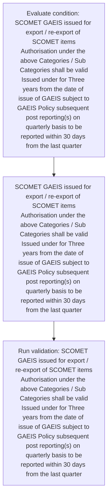
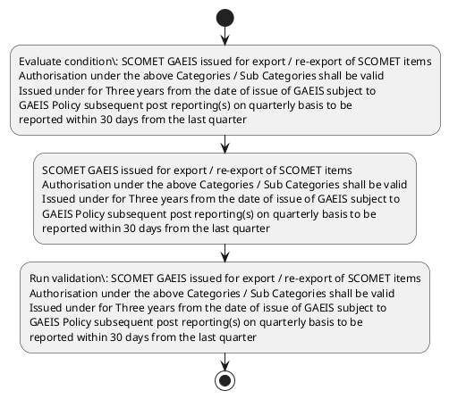

# Chapter 10 / Section 7: SCOMET GAEIS issued for export / re-export of SCOMET items

**Chapter Title:** SCOMET: Special Chemicals, Organisms, Materials, Equipment and Technologies

**Pages:** 43

**Purpose:** SCOMET GAEIS issued for export / re-export of SCOMET items
Authorisation under the above Categories / Sub Categories shall be valid
Issued under for Three years from the date of issue of GAEIS subject to
GAEIS Policy subsequent post reporting(s) on quarterly basis to be
reported within 30 days from the last quarter

**Purpose Thanglish:** Indha SCOMET GAEIS issued for export / re-export of SCOMET items section-la, SCOMET GAEIS issued for export / re-export of SCOMET items
Authorisation under the above Categories / Sub Categories kandippa be valid
Issued under for Three years from the date of issue of GAEIS subject to
GAEIS Policy subsequent post reporting(s) on quarterly basis to be
reported within 30 days from the last quarter

**Summary:** 7. SCOMET GAEIS issued for export / re-export of SCOMET items
Authorisation under the above Categories / Sub Categories shall be valid
Issued under for Three years from the date of issue of GAEIS subject to
GAEIS Policy subsequent post reporting(s) on quarterly basis to be
reported within 30 days from the last quarter

**Business Meaning:** SCOMET GAEIS issued for export / re-export of SCOMET items governs how DGFT business controls should be applied, validated, and enforced.

**Business Explanation:** SCOMET GAEIS issued for export / re-export of SCOMET items explains the operating rule set that DEKAI should enforce. Key control points include SCOMET GAEIS issued for export / re-export of SCOMET items
Authorisation under the above Categories / Sub Categories shall be valid
Issued under for Three years from the date of issue of GAEIS subject to
GAEIS Policy subsequent post reporting(s) on quarterly basis to be
reported within 30 days from the last quarter The section also drives actions such as SCOMET GAEIS issued for export / re-export of SCOMET items
Authorisation under the above Categories / Sub Categories shall be valid
Issued under for Three years from the date of issue of GAEIS subject to
GAEIS Policy subsequent post reporting(s) on quarterly basis to be
reported within 30 days from the last quarter.

**Business Explanation Thanglish:** Indha SCOMET GAEIS issued for export / re-export of SCOMET items section-la, SCOMET GAEIS issued for export / re-export of SCOMET items explains the operating rule set that DEKAI should enforce. Key control points include SCOMET GAEIS issued for export / re-export of SCOMET items
Authorisation under the above Categories / Sub Categories kandippa be valid
Issued under for Three years from the date of issue of GAEIS subject to
GAEIS Policy subsequent post reporting(s) on quarterly basis to be
reported within 30 days from the last quarter The section also drives actions such as SCOMET GAEIS issued for export / re-export of SCOMET items
Authorisation under the above Categories / Sub Categories kandippa be valid
Issued under for Three years from the date of issue of GAEIS subject to
GAEIS Policy subsequent post reporting(s) on quarterly basis to be
reported within 30 days from the last quarter.

## Business Logic
- SCOMET GAEIS issued for export / re-export of SCOMET items
Authorisation under the above Categories / Sub Categories shall be valid
Issued under for Three years from the date of issue of GAEIS subject to
GAEIS Policy subsequent post reporting(s) on quarterly basis to be
reported within 30 days from the last quarter

## Business Rules
- rule_id=CH10-SEC7-R001, rule_description=SCOMET GAEIS issued for export / re-export of SCOMET items
Authorisation under the above Categories / Sub Categories shall be valid
Issued under for Three years from the date of issue of GAEIS subject to
GAEIS Policy subsequent post reporting(s) on quarterly basis to be
reported within 30 days from the last quarter, trigger=SCOMET GAEIS issued for export / re-export of SCOMET items, condition=SCOMET GAEIS issued for export / re-export of SCOMET items
Authorisation under the above Categories / Sub Categories shall be valid
Issued under for Three years from the date of issue of GAEIS subject to
GAEIS Policy subsequent post reporting(s) on quarterly basis to be
reported within 30 days from the last quarter, validation=SCOMET GAEIS issued for export / re-export of SCOMET items
Authorisation under the above Categories / Sub Categories shall be valid
Issued under for Three years from the date of issue of GAEIS subject to
GAEIS Policy subsequent post reporting(s) on quarterly basis to be
reported within 30 days from the last quarter, action=SCOMET GAEIS issued for export / re-export of SCOMET items
Authorisation under the above Categories / Sub Categories shall be valid
Issued under for Three years from the date of issue of GAEIS subject to
GAEIS Policy subsequent post reporting(s) on quarterly basis to be
reported within 30 days from the last quarter, exception=No explicit exception found in uploaded documents., output=DEKAI should produce a compliance decision for 7 - SCOMET GAEIS issued for export / re-export of SCOMET items.

## Conditions
- SCOMET GAEIS issued for export / re-export of SCOMET items
Authorisation under the above Categories / Sub Categories shall be valid
Issued under for Three years from the date of issue of GAEIS subject to
GAEIS Policy subsequent post reporting(s) on quarterly basis to be
reported within 30 days from the last quarter

## Condition Logic
- id=10.7.1, if=SCOMET GAEIS issued for export / re-export of SCOMET items
Authorisation under the above Categories / Sub Categories shall be valid
Issued under for Three years from the date of issue of GAEIS subject to
GAEIS Policy subsequent post reporting(s) on quarterly basis to be
reported within 30 days from the last quarter, then=SCOMET GAEIS issued for export / re-export of SCOMET items
Authorisation under the above Categories / Sub Categories shall be valid
Issued under for Three years from the date of issue of GAEIS subject to
GAEIS Policy subsequent post reporting(s) on quarterly basis to be
reported within 30 days from the last quarter, source=SCOMET GAEIS issued for export / re-export of SCOMET items
Authorisation under the above Categories / Sub Categories shall be valid
Issued under for Three years from the date of issue of GAEIS subject to
GAEIS Policy subsequent post reporting(s) on quarterly basis to be
reported within 30 days from the last quarter

## Validations
- SCOMET GAEIS issued for export / re-export of SCOMET items
Authorisation under the above Categories / Sub Categories shall be valid
Issued under for Three years from the date of issue of GAEIS subject to
GAEIS Policy subsequent post reporting(s) on quarterly basis to be
reported within 30 days from the last quarter

## Exceptions
- None identified

## Dependencies
- 3

## Authorities
- None identified

## Required Documents
- None identified

## Timelines
- SCOMET GAEIS issued for export / re-export of SCOMET items
Authorisation under the above Categories / Sub Categories shall be valid
Issued under for Three years from the date of issue of GAEIS subject to
GAEIS Policy subsequent post reporting(s) on quarterly basis to be
reported within 30 days from the last quarter

## Actions
- SCOMET GAEIS issued for export / re-export of SCOMET items
Authorisation under the above Categories / Sub Categories shall be valid
Issued under for Three years from the date of issue of GAEIS subject to
GAEIS Policy subsequent post reporting(s) on quarterly basis to be
reported within 30 days from the last quarter

## Workflow
- Evaluate condition: SCOMET GAEIS issued for export / re-export of SCOMET items
Authorisation under the above Categories / Sub Categories shall be valid
Issued under for Three years from the date of issue of GAEIS subject to
GAEIS Policy subsequent post reporting(s) on quarterly basis to be
reported within 30 days from the last quarter
- SCOMET GAEIS issued for export / re-export of SCOMET items
Authorisation under the above Categories / Sub Categories shall be valid
Issued under for Three years from the date of issue of GAEIS subject to
GAEIS Policy subsequent post reporting(s) on quarterly basis to be
reported within 30 days from the last quarter
- Run validation: SCOMET GAEIS issued for export / re-export of SCOMET items
Authorisation under the above Categories / Sub Categories shall be valid
Issued under for Three years from the date of issue of GAEIS subject to
GAEIS Policy subsequent post reporting(s) on quarterly basis to be
reported within 30 days from the last quarter

## Workflow ASCII
```text
SCOMET GAEIS issued for export / re-export of SCOMET items
Evaluate condition: SCOMET GAEIS issued for export / re-export of SCOMET items
Authorisation under the above Categories / Sub Categories shall be valid
Issued under for Three years from the date of issue of GAEIS subject to
GAEIS Policy subsequent post reporting(s) on quarterly basis to be
reported within 30 days from the last quarter
   |
   v
SCOMET GAEIS issued for export / re-export of SCOMET items
Authorisation under the above Categories / Sub Categories shall be valid
Issued under for Three years from the date of issue of GAEIS subject to
GAEIS Policy subsequent post reporting(s) on quarterly basis to be
reported within 30 days from the last quarter
   |
   v
Run validation: SCOMET GAEIS issued for export / re-export of SCOMET items
Authorisation under the above Categories / Sub Categories shall be valid
Issued under for Three years from the date of issue of GAEIS subject to
GAEIS Policy subsequent post reporting(s) on quarterly basis to be
reported within 30 days from the last quarter
```

## Decision Tree
- IF SCOMET GAEIS issued for export / re-export of SCOMET items
Authorisation under the above Categories / Sub Categories shall be valid
Issued under for Three years from the date of issue of GAEIS subject to
GAEIS Policy subsequent post reporting(s) on quarterly basis to be
reported within 30 days from the last quarter THEN SCOMET GAEIS issued for export / re-export of SCOMET items
Authorisation under the above Categories / Sub Categories shall be valid
Issued under for Three years from the date of issue of GAEIS subject to
GAEIS Policy subsequent post reporting(s) on quarterly basis to be
reported within 30 days from the last quarter

## Decision Tree ASCII
```text
SCOMET GAEIS issued for export / re-export of SCOMET items Decision
IF SCOMET GAEIS issued for export / re-export of SCOMET items
Authorisation under the above Categories / Sub Categories shall be valid
Issued under for Three years from the date of issue of GAEIS subject to
GAEIS Policy subsequent post reporting(s) on quarterly basis to be
reported within 30 days from the last quarter THEN SCOMET GAEIS issued for export / re-export of SCOMET items
Authorisation under the above Categories / Sub Categories shall be valid
Issued under for Three years from the date of issue of GAEIS subject to
GAEIS Policy subsequent post reporting(s) on quarterly basis to be
reported within 30 days from the last quarter
```

## Examples
- User asks to process SCOMET GAEIS issued for export / re-export of SCOMET items; the platform checks conditions, validations, and documents before action.

**Real-world Example:** Example: an importer or exporter invokes SCOMET GAEIS issued for export / re-export of SCOMET items, submits the prescribed DGFT records, and DEKAI uses the extracted rules to scomet gaeis issued for export / re-export of scomet items
authorisation under the above categories / sub categories shall be valid
issued under for three years from the date of issue of gaeis subject to
gaeis policy subsequent post reporting(s) on quarterly basis to be
reported within 30 days from the last quarter.

**Real-world Example Thanglish:** Indha SCOMET GAEIS issued for export / re-export of SCOMET items section-la, Example: an importer or exporter invokes SCOMET GAEIS issued for export / re-export of SCOMET items, submits the prescribed DGFT records, and DEKAI uses the extracted rules to scomet gaeis issued for export / re-export of scomet items
authorisation under the above categories / sub categories kandippa be valid
issued under for three years from the date of issue of gaeis subject to
gaeis policy subsequent post reporting(s) on quarterly basis to be
reported within 30 days from the last quarter.

## AI Rules
- IF detected context matches section rule THEN enforce: SCOMET GAEIS issued for export / re-export of SCOMET items
Authorisation under the above Categories / Sub Categories shall be valid
Issued under for Three years from the date of issue of GAEIS subject to
GAEIS Policy subsequent post reporting(s) on quarterly basis to be
reported within 30 days from the last quarter
- IF validations pass THEN recommend action: SCOMET GAEIS issued for export / re-export of SCOMET items
Authorisation under the above Categories / Sub Categories shall be valid
Issued under for Three years from the date of issue of GAEIS subject to
GAEIS Policy subsequent post reporting(s) on quarterly basis to be
reported within 30 days from the last quarter

## Database Fields
- name=section_code, type=string, required=True, source=parsed_section_heading
- name=section_title, type=string, required=True, source=parsed_section_heading
- name=for_flag, type=boolean, required=False, source=keyword:for
- name=the_flag, type=boolean, required=False, source=keyword:the
- name=sub_flag, type=boolean, required=False, source=keyword:Sub
- name=from_flag, type=boolean, required=False, source=keyword:from
- name=date_flag, type=boolean, required=False, source=keyword:date
- name=post_flag, type=boolean, required=False, source=keyword:post
- name=days_flag, type=boolean, required=False, source=keyword:days
- name=last_flag, type=boolean, required=False, source=keyword:last

## API Requirements
- method=GET, path=/api/dgft/sections/7, purpose=Retrieve knowledge payload for section 7, query_params=['include=workflow,decision_tree,validations'], response_fields=['section', 'title', 'summary', 'conditions', 'validations', 'exceptions', 'workflow', 'decision_tree']
- method=POST, path=/api/dgft/SCOMET-GAEIS-issued-for-export-re-export-of-SCOMET-items/validate, purpose=Validate inputs and documents for SCOMET GAEIS issued for export / re-export of SCOMET items, request_fields=['section_code', 'section_title'], response_fields=['status', 'errors', 'warnings', 'next_actions']
- method=POST, path=/api/dgft/SCOMET-GAEIS-issued-for-export-re-export-of-SCOMET-items/execute, purpose=Trigger business action for SCOMET GAEIS issued for export / re-export of SCOMET items
Authorisation under the above Categories / Sub Categories shall be valid
Issued under for Three years from the date of issue of GAEIS subject to
GAEIS Policy subsequent post reporting(s) on quarterly basis to be
reported within 30 days from the last quarter, request_fields=['section_code', 'section_title'], response_fields=['reference_id', 'status', 'authority', 'timeline']

## UI Screens
- screen_id=SCOMET_GAEIS_issued_for_export_re_export_of_SCOMET_items_overview, name=SCOMET GAEIS issued for export / re-export of SCOMET items Overview, purpose=Show section summary, authority, timeline, and eligibility cues., widgets=['summary_card', 'conditions_table', 'authority_badges', 'timeline_panel']
- screen_id=SCOMET_GAEIS_issued_for_export_re_export_of_SCOMET_items_submission, name=SCOMET GAEIS issued for export / re-export of SCOMET items Submission, purpose=Capture applicant data and supporting documents., widgets=['dynamic_form', 'document_uploader', 'validation_panel', 'next_action_footer'], fields=['section_code', 'section_title', 'for_flag', 'the_flag', 'sub_flag', 'from_flag', 'date_flag', 'post_flag']

## Error Messages
- Validation failed because the section requirements were not fully met.

## FAQ
- question_en=What is the purpose of section 7?, answer_en=SCOMET GAEIS issued for export / re-export of SCOMET items explains the operating rule set that DEKAI should enforce. Key control points include SCOMET GAEIS issued for export / re-export of SCOMET items
Authorisation under the above Categories / Sub Categories shall be valid
Issued under for Three years from the date of issue of GAEIS subject to
GAEIS Policy subsequent post reporting(s) on quarterly basis to be
reported within 30 days from the last quarter The section also drives actions such as SCOMET GAEIS issued for export / re-export of SCOMET items
Authorisation under the above Categories / Sub Categories shall be valid
Issued under for Three years from the date of issue of GAEIS subject to
GAEIS Policy subsequent post reporting(s) on quarterly basis to be
reported within 30 days from the last quarter., question_thanglish=Indha SCOMET GAEIS issued for export / re-export of SCOMET items section-la, What is the purpose of section 7?, answer_thanglish=Indha SCOMET GAEIS issued for export / re-export of SCOMET items section-la, SCOMET GAEIS issued for export / re-export of SCOMET items explains the operating rule set that DEKAI should enforce. Key control points include SCOMET GAEIS issued for export / re-export of SCOMET items
Authorisation under the above Categories / Sub Categories kandippa be valid
Issued under for Three years from the date of issue of GAEIS subject to
GAEIS Policy subsequent post reporting(s) on quarterly basis to be
reported within 30 days from the last quarter The section also drives actions such as SCOMET GAEIS issued for export / re-export of SCOMET items
Authorisation under the above Categories / Sub Categories kandippa be valid
Issued under for Three years from the date of issue of GAEIS subject to
GAEIS Policy subsequent post reporting(s) on quarterly basis to be
reported within 30 days from the last quarter.
- question_en=What documents are required under SCOMET GAEIS issued for export / re-export of SCOMET items?, answer_en=Not explicitly covered in uploaded documents., question_thanglish=Indha SCOMET GAEIS issued for export / re-export of SCOMET items section-la, What documents are required under SCOMET GAEIS issued for export / re-export of SCOMET items?, answer_thanglish=Indha SCOMET GAEIS issued for export / re-export of SCOMET items section-la, Not explicitly covered in uploaded documents.
- question_en=Which authority handles SCOMET GAEIS issued for export / re-export of SCOMET items?, answer_en=Not explicitly covered in uploaded documents., question_thanglish=Indha SCOMET GAEIS issued for export / re-export of SCOMET items section-la, Which authority handles SCOMET GAEIS issued for export / re-export of SCOMET items?, answer_thanglish=Indha SCOMET GAEIS issued for export / re-export of SCOMET items section-la, Not explicitly covered in uploaded documents.

## Questions Users May Ask
- What does SCOMET GAEIS issued for export / re-export of SCOMET items require?
- Which documents are needed for SCOMET GAEIS issued for export / re-export of SCOMET items?
- How does DEKAI validate SCOMET GAEIS issued for export / re-export of SCOMET items requests?
- What action should be taken for SCOMET GAEIS issued for export / re-export of SCOMET items?

## Expected AI Answers
- SCOMET GAEIS issued for export / re-export of SCOMET items requires the platform to interpret the section text, apply the extracted business rules, and present the correct next action.
- Required documents are inferred from the section text: no explicit documents were detected.
- DEKAI validates SCOMET GAEIS issued for export / re-export of SCOMET items by checking conditions, required documents, authority references, and exception clauses before recommending an outcome.
- The primary extracted action is: SCOMET GAEIS issued for export / re-export of SCOMET items
Authorisation under the above Categories / Sub Categories shall be valid
Issued under for Three years from the date of issue of GAEIS subject to
GAEIS Policy subsequent post reporting(s) on quarterly basis to be
reported within 30 days from the last quarter

## AI Q&A Examples
- question_en=User asks: How do I comply with SCOMET GAEIS issued for export / re-export of SCOMET items?, answer_en=AI answers: DEKAI should evaluate section 7, apply the extracted rules, and guide the user through Evaluate condition: SCOMET GAEIS issued for export / re-export of SCOMET items
Authorisation under the above Categories / Sub Categories shall be valid
Issued under for Three years from the date of issue of GAEIS subject to
GAEIS Policy subsequent post reporting(s) on quarterly basis to be
reported within 30 days from the last quarter., question_thanglish=Indha SCOMET GAEIS issued for export / re-export of SCOMET items section-la, User asks: How do I comply with SCOMET GAEIS issued for export / re-export of SCOMET items?, answer_thanglish=Indha SCOMET GAEIS issued for export / re-export of SCOMET items section-la, AI answers: DEKAI should evaluate section 7, apply the extracted rules, and guide the user through Evaluate condition: SCOMET GAEIS issued for export / re-export of SCOMET items
Authorisation under the above Categories / Sub Categories kandippa be valid
Issued under for Three years from the date of issue of GAEIS subject to
GAEIS Policy subsequent post reporting(s) on quarterly basis to be
reported within 30 days from the last quarter.
- question_en=User asks: Which validations apply to SCOMET GAEIS issued for export / re-export of SCOMET items?, answer_en=AI answers: Applicable validations are SCOMET GAEIS issued for export / re-export of SCOMET items
Authorisation under the above Categories / Sub Categories shall be valid
Issued under for Three years from the date of issue of GAEIS subject to
GAEIS Policy subsequent post reporting(s) on quarterly basis to be
reported within 30 days from the last quarter, question_thanglish=Indha SCOMET GAEIS issued for export / re-export of SCOMET items section-la, User asks: Which validations apply to SCOMET GAEIS issued for export / re-export of SCOMET items?, answer_thanglish=Indha SCOMET GAEIS issued for export / re-export of SCOMET items section-la, AI answers: Applicable validations are SCOMET GAEIS issued for export / re-export of SCOMET items
Authorisation under the above Categories / Sub Categories kandippa be valid
Issued under for Three years from the date of issue of GAEIS subject to
GAEIS Policy subsequent post reporting(s) on quarterly basis to be
reported within 30 days from the last quarter

## DEKAI AI Implementation Notes
- Capture chapter 10, section 7, title, and page references as immutable knowledge metadata.
- Bind validations for SCOMET GAEIS issued for export / re-export of SCOMET items into a rule engine keyed by the rule IDs extracted for this section.
- Show contextual links to related sections: 3.

## DEKAI AI Implementation Notes Thanglish
- Indha SCOMET GAEIS issued for export / re-export of SCOMET items section-la, Capture chapter 10, section 7, title, and page references as immutable knowledge metadata.
- Indha SCOMET GAEIS issued for export / re-export of SCOMET items section-la, Bind validations for SCOMET GAEIS issued for export / re-export of SCOMET items into a rule engine keyed by the rule IDs extracted for this section.
- Indha SCOMET GAEIS issued for export / re-export of SCOMET items section-la, Show contextual links to related sections: 3.

## AI Metadata
- Keywords: for, the, Sub, from, date, post, days, last, GAEIS, items, under, above, shall, valid, Three, years, issue, basis, SCOMET, issued
- Search Keywords: for, the, Sub, from, date, post, days, last, GAEIS, items, under, above, shall, valid, Three, years, issue, basis, SCOMET, issued
- Intent: Support SCOMET GAEIS issued for export / re-export of SCOMET items processing and compliance validation.
- Tags: 7, SCOMET GAEIS issued for export / re-export of SCOMET items, business-rule, dgft
- Related Sections: 3
- Related Chapters: 
- Related Rules: SCOMET GAEIS issued for export / re-export of SCOMET items
Authorisation under the above Categories / Sub Categories shall be valid
Issued under for Three years from the date of issue of GAEIS subject to
GAEIS Policy subsequent post reporting(s) on quarterly basis to be
reported within 30 days from the last quarter

## Mermaid


## PlantUML

