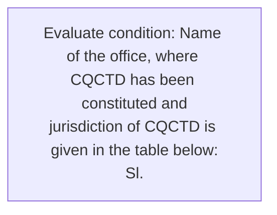
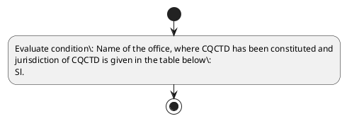

# Chapter 8 / Section 8.01: Committee on Quality Complaint & Trade Dispute (CQCTD)

**Chapter Title:** Quality Complaints and Trade Disputes

**Pages:** 2, 3

**Purpose:** 8.01 Committee on Quality Complaint & Trade Dispute (CQCTD)
For effective dealing of quality complaints and trade disputes, a Committee on
Quality Complaint & Trade Dispute (CQCTD) is constituted in the 20 offices of
the DGFT.

**Purpose Thanglish:** Indha Committee on Quality Complaint & Trade Dispute (CQCTD) section-la, 8.01 Committee on Quality Complaint & Trade Dispute (CQCTD)
For effective dealing of quality complaints and trade disputes, a Committee on
Quality Complaint & Trade Dispute (CQCTD) is constituted in the 20 offices of
the DGFT.

**Summary:** 8.01 Committee on Quality Complaint & Trade Dispute (CQCTD)
For effective dealing of quality complaints and trade disputes, a Committee on
Quality Complaint & Trade Dispute (CQCTD) is constituted in the 20 offices of
the DGFT. Name of the office, where CQCTD has been constituted and
jurisdiction of CQCTD is given in the table below:
Sl. Location of Designation of Jurisdiction of the CQCTD
No.

**Business Meaning:** 8.01 Committee on Quality Complaint & Trade Dispute (CQCTD)
For effective dealing of quality complaints and trade disputes, a Committee on
Quality Complaint & Trade Dispute (CQCTD) is constituted in the 20 offices of
the DGFT.

**Business Explanation:** 8.01 Committee on Quality Complaint & Trade Dispute (CQCTD)
For effective dealing of quality complaints and trade disputes, a Committee on
Quality Complaint & Trade Dispute (CQCTD) is constituted in the 20 offices of
the DGFT. Name of the office, where CQCTD has been constituted and
jurisdiction of CQCTD is given in the table below:
Sl. Location of Designation of Jurisdiction of the CQCTD
No.

**Business Explanation Thanglish:** Indha Committee on Quality Complaint & Trade Dispute (CQCTD) section-la, 8.01 Committee on Quality Complaint & Trade Dispute (CQCTD)
For effective dealing of quality complaints and trade disputes, a Committee on
Quality Complaint & Trade Dispute (CQCTD) is constituted in the 20 offices of
the DGFT. Name of the office, where CQCTD has been constituted and
jurisdiction of CQCTD is given in the table below:
Sl. Location of Designation of Jurisdiction of the CQCTD
No.

## Business Logic
- None identified

## Business Rules
- rule_id=CH8-SEC8_01-R001, rule_description=8.01 Committee on Quality Complaint & Trade Dispute (CQCTD)
For effective dealing of quality complaints and trade disputes, a Committee on
Quality Complaint & Trade Dispute (CQCTD) is constituted in the 20 offices of
the DGFT. Name of the office, where CQCTD has been constituted and
jurisdiction of CQCTD is given in the table below:
Sl. Location of Designation of Jurisdiction of the CQCTD
No., trigger=Committee on Quality Complaint & Trade Dispute (CQCTD), condition=Name of the office, where CQCTD has been constituted and
jurisdiction of CQCTD is given in the table below:
Sl., validation=Not explicitly covered in uploaded documents., action=Manual review required., exception=No explicit exception found in uploaded documents., output=DEKAI should produce a compliance decision for 8.01 - Committee on Quality Complaint & Trade Dispute (CQCTD).

## Conditions
- Name of the office, where CQCTD has been constituted and
jurisdiction of CQCTD is given in the table below:
Sl.

## Condition Logic
- id=8.8.01.1, if=Name of the office, where CQCTD has been constituted and
jurisdiction of CQCTD is given in the table below:
Sl., then=Route for review, source=Name of the office, where CQCTD has been constituted and
jurisdiction of CQCTD is given in the table below:
Sl.

## Validations
- None identified

## Exceptions
- None identified

## Dependencies
- None identified

## Authorities
- DGFT
- Committee on Quality Complaint & Trade Dispute
- CQCTD
- RA
- DGFT RA
- Ludhiana and RA
- Mumbai and RA
- Indore and RA
- Kolkata and RA

## Required Documents
- None identified

## Timelines
- None identified

## Actions
- None identified

## Workflow
- Evaluate condition: Name of the office, where CQCTD has been constituted and
jurisdiction of CQCTD is given in the table below:
Sl.

## Workflow ASCII
```text
Committee on Quality Complaint & Trade Dispute (CQCTD)
Evaluate condition: Name of the office, where CQCTD has been constituted and
jurisdiction of CQCTD is given in the table below:
Sl.
```

## Decision Tree
- IF section 8.01 applies THEN proceed with standard DGFT workflow

## Decision Tree ASCII
```text
Committee on Quality Complaint & Trade Dispute (CQCTD) Decision
IF section 8.01 applies THEN proceed with standard DGFT workflow
```

## Examples
- User asks to process Committee on Quality Complaint & Trade Dispute (CQCTD); the platform checks conditions, validations, and documents before action.

**Real-world Example:** Example: an importer or exporter invokes Committee on Quality Complaint & Trade Dispute (CQCTD), submits the prescribed DGFT records, and DEKAI uses the extracted rules to follow the committee on quality complaint & trade dispute (cqctd) process.

**Real-world Example Thanglish:** Indha Committee on Quality Complaint & Trade Dispute (CQCTD) section-la, Example: an importer or exporter invokes Committee on Quality Complaint & Trade Dispute (CQCTD), submits the prescribed DGFT records, and DEKAI uses the extracted rules to follow the committee on quality complaint & trade dispute (cqctd) process.

## AI Rules
- None identified

## Database Fields
- name=section_code, type=string, required=True, source=parsed_section_heading
- name=section_title, type=string, required=True, source=parsed_section_heading
- name=for_flag, type=boolean, required=False, source=keyword:For
- name=and_flag, type=boolean, required=False, source=keyword:and
- name=the_flag, type=boolean, required=False, source=keyword:the
- name=has_flag, type=boolean, required=False, source=keyword:has
- name=cla_flag, type=boolean, required=False, source=keyword:CLA
- name=new_flag, type=boolean, required=False, source=keyword:New
- name=dgft_flag, type=boolean, required=False, source=keyword:DGFT
- name=name_flag, type=boolean, required=False, source=keyword:Name

## API Requirements
- method=GET, path=/api/dgft/sections/8.01, purpose=Retrieve knowledge payload for section 8.01, query_params=['include=workflow,decision_tree,validations'], response_fields=['section', 'title', 'summary', 'conditions', 'validations', 'exceptions', 'workflow', 'decision_tree']
- method=POST, path=/api/dgft/Committee-on-Quality-Complaint-Trade-Dispute-CQCTD/validate, purpose=Validate inputs and documents for Committee on Quality Complaint & Trade Dispute (CQCTD), request_fields=['section_code', 'section_title'], response_fields=['status', 'errors', 'warnings', 'next_actions']

## UI Screens
- screen_id=Committee_on_Quality_Complaint_Trade_Dispute_CQCTD_overview, name=Committee on Quality Complaint & Trade Dispute (CQCTD) Overview, purpose=Show section summary, authority, timeline, and eligibility cues., widgets=['summary_card', 'conditions_table', 'authority_badges', 'timeline_panel']
- screen_id=Committee_on_Quality_Complaint_Trade_Dispute_CQCTD_submission, name=Committee on Quality Complaint & Trade Dispute (CQCTD) Submission, purpose=Capture applicant data and supporting documents., widgets=['dynamic_form', 'document_uploader', 'validation_panel', 'next_action_footer'], fields=['section_code', 'section_title', 'for_flag', 'and_flag', 'the_flag', 'has_flag', 'cla_flag', 'new_flag']

## Error Messages
- Validation failed because the section requirements were not fully met.

## FAQ
- question_en=What is the purpose of section 8.01?, answer_en=8.01 Committee on Quality Complaint & Trade Dispute (CQCTD)
For effective dealing of quality complaints and trade disputes, a Committee on
Quality Complaint & Trade Dispute (CQCTD) is constituted in the 20 offices of
the DGFT. Name of the office, where CQCTD has been constituted and
jurisdiction of CQCTD is given in the table below:
Sl. Location of Designation of Jurisdiction of the CQCTD
No., question_thanglish=Indha Committee on Quality Complaint & Trade Dispute (CQCTD) section-la, What is the purpose of section 8.01?, answer_thanglish=Indha Committee on Quality Complaint & Trade Dispute (CQCTD) section-la, 8.01 Committee on Quality Complaint & Trade Dispute (CQCTD)
For effective dealing of quality complaints and trade disputes, a Committee on
Quality Complaint & Trade Dispute (CQCTD) is constituted in the 20 offices of
the DGFT. Name of the office, where CQCTD has been constituted and
jurisdiction of CQCTD is given in the table below:
Sl. Location of Designation of Jurisdiction of the CQCTD
No.
- question_en=What documents are required under Committee on Quality Complaint & Trade Dispute (CQCTD)?, answer_en=Not explicitly covered in uploaded documents., question_thanglish=Indha Committee on Quality Complaint & Trade Dispute (CQCTD) section-la, What documents are required under Committee on Quality Complaint & Trade Dispute (CQCTD)?, answer_thanglish=Indha Committee on Quality Complaint & Trade Dispute (CQCTD) section-la, Not explicitly covered in uploaded documents.
- question_en=Which authority handles Committee on Quality Complaint & Trade Dispute (CQCTD)?, answer_en=DGFT, Committee on Quality Complaint & Trade Dispute, CQCTD, RA, DGFT RA, Ludhiana and RA, Mumbai and RA, Indore and RA, Kolkata and RA, question_thanglish=Indha Committee on Quality Complaint & Trade Dispute (CQCTD) section-la, Which authority handles Committee on Quality Complaint & Trade Dispute (CQCTD)?, answer_thanglish=Indha Committee on Quality Complaint & Trade Dispute (CQCTD) section-la, DGFT, Committee on Quality Complaint & Trade Dispute, CQCTD, RA, DGFT RA, Ludhiana and RA, Mumbai and RA, Indore and RA, Kolkata and RA

## Questions Users May Ask
- What does Committee on Quality Complaint & Trade Dispute (CQCTD) require?
- Which documents are needed for Committee on Quality Complaint & Trade Dispute (CQCTD)?
- How does DEKAI validate Committee on Quality Complaint & Trade Dispute (CQCTD) requests?

## Expected AI Answers
- Committee on Quality Complaint & Trade Dispute (CQCTD) requires the platform to interpret the section text, apply the extracted business rules, and present the correct next action.
- Required documents are inferred from the section text: no explicit documents were detected.
- DEKAI validates Committee on Quality Complaint & Trade Dispute (CQCTD) by checking conditions, required documents, authority references, and exception clauses before recommending an outcome.

## AI Q&A Examples
- question_en=User asks: How do I comply with Committee on Quality Complaint & Trade Dispute (CQCTD)?, answer_en=AI answers: DEKAI should evaluate section 8.01, apply the extracted rules, and guide the user through Evaluate condition: Name of the office, where CQCTD has been constituted and
jurisdiction of CQCTD is given in the table below:
Sl.., question_thanglish=Indha Committee on Quality Complaint & Trade Dispute (CQCTD) section-la, User asks: How do I comply with Committee on Quality Complaint & Trade Dispute (CQCTD)?, answer_thanglish=Indha Committee on Quality Complaint & Trade Dispute (CQCTD) section-la, AI answers: DEKAI should evaluate section 8.01, apply the extracted rules, and guide the user through Evaluate condition: Name of the office, where CQCTD has been constituted and
jurisdiction of CQCTD is given in the table below:
Sl..
- question_en=User asks: Which validations apply to Committee on Quality Complaint & Trade Dispute (CQCTD)?, answer_en=AI answers: Applicable validations are not explicitly covered in the uploaded documents., question_thanglish=Indha Committee on Quality Complaint & Trade Dispute (CQCTD) section-la, User asks: Which validations apply to Committee on Quality Complaint & Trade Dispute (CQCTD)?, answer_thanglish=Indha Committee on Quality Complaint & Trade Dispute (CQCTD) section-la, AI answers: Applicable validations are not explicitly covered in the uploaded documents.

## DEKAI AI Implementation Notes
- Capture chapter 8, section 8.01, title, and page references as immutable knowledge metadata.
- Bind validations for Committee on Quality Complaint & Trade Dispute (CQCTD) into a rule engine keyed by the rule IDs extracted for this section.
- Route escalations or approvals to: DGFT, Committee on Quality Complaint & Trade Dispute, CQCTD, RA.

## DEKAI AI Implementation Notes Thanglish
- Indha Committee on Quality Complaint & Trade Dispute (CQCTD) section-la, Capture chapter 8, section 8.01, title, and page references as immutable knowledge metadata.
- Indha Committee on Quality Complaint & Trade Dispute (CQCTD) section-la, Bind validations for Committee on Quality Complaint & Trade Dispute (CQCTD) into a rule engine keyed by the rule IDs extracted for this section.
- Indha Committee on Quality Complaint & Trade Dispute (CQCTD) section-la, Route escalations or approvals to: DGFT, Committee on Quality Complaint & Trade Dispute, CQCTD, RA.

## AI Metadata
- Keywords: For, and, the, has, CLA, New, DGFT, Name, been, Zone, Addl, Pune, Trade, CQCTD, where, given, table, below, Delhi, Jammu
- Search Keywords: For, and, the, has, CLA, New, DGFT, Name, been, Zone, Addl, Pune, Trade, CQCTD, where, given, table, below, Delhi, Jammu
- Intent: Provide knowledge guidance for Committee on Quality Complaint & Trade Dispute (CQCTD).
- Tags: 8.01, Committee on Quality Complaint & Trade Dispute (CQCTD), dgft
- Related Sections: 
- Related Chapters: 
- Related Rules: 

## Mermaid


## PlantUML

