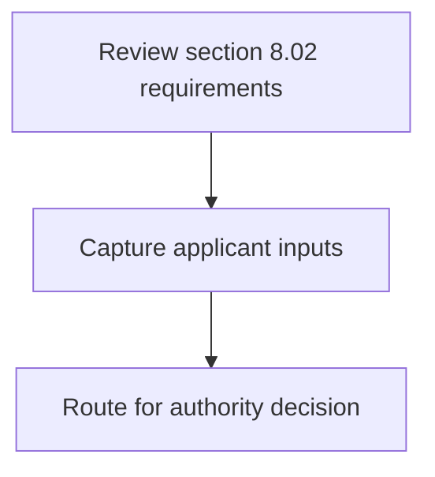
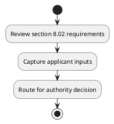

# Chapter 8 / Section 8.02: Composition of the CQCTD

**Chapter Title:** Quality Complaints and Trade Disputes

**Pages:** 3

**Purpose:** Defines the operational requirements for Composition of the CQCTD.

**Purpose Thanglish:** Indha Composition of the CQCTD section-la, Defines the operational requirements for Composition of the CQCTD.

**Summary:** 8.02 Composition of the CQCTD
The CQCTD may comprise the following members:
8.02 Composition of the CQCTD
The CQCTD may comprise the following members:
1. Additional DGFT/Joint DGFT/ (H.O.O):Chairperson
2. Representative of Bureau of India Standard (BIS):Member
3.

**Business Meaning:** 8.02 Composition of the CQCTD
The CQCTD may comprise the following members:
8.02 Composition of the CQCTD
The CQCTD may comprise the following members:
1.

**Business Explanation:** 8.02 Composition of the CQCTD
The CQCTD may comprise the following members:
8.02 Composition of the CQCTD
The CQCTD may comprise the following members:
1. Additional DGFT/Joint DGFT/ (H.O.O):Chairperson
2. Representative of Bureau of India Standard (BIS):Member
3.

**Business Explanation Thanglish:** Indha Composition of the CQCTD section-la, 8.02 Composition of the CQCTD
The CQCTD may comprise the following members:
8.02 Composition of the CQCTD
The CQCTD may comprise the following members:
1. Additional DGFT/Joint DGFT/ (H.O.O):Chairperson
2. Representative of Bureau of India Standard (BIS):Member
3.

## Business Logic
- None identified

## Business Rules
- rule_id=CH8-SEC8_02-R001, rule_description=8.02 Composition of the CQCTD
The CQCTD may comprise the following members:
8.02 Composition of the CQCTD
The CQCTD may comprise the following members:
1. Additional DGFT/Joint DGFT/ (H.O.O):Chairperson
2. Representative of Bureau of India Standard (BIS):Member
3., trigger=Composition of the CQCTD, condition=Not explicitly covered in uploaded documents., validation=Not explicitly covered in uploaded documents., action=Manual review required., exception=No explicit exception found in uploaded documents., output=DEKAI should produce a compliance decision for 8.02 - Composition of the CQCTD.

## Conditions
- None identified

## Condition Logic
- None identified

## Validations
- None identified

## Exceptions
- None identified

## Dependencies
- 1
- 2
- 3
- 4
- 5
- 6
- 7
- 8
- 9
- 10

## Authorities
- CQCTD
- DGFT
- Additional DGFT/Joint DGFT
- Development Authority
- State Government
- Nominee of Director of Industries of State Government
- Development Commissioner
- Nominee of Development Commissioner

## Required Documents
- None identified

## Timelines
- None identified

## Actions
- None identified

## Workflow
- Review section 8.02 requirements
- Capture applicant inputs
- Route for authority decision

## Workflow ASCII
```text
Composition of the CQCTD
Review section 8.02 requirements
   |
   v
Capture applicant inputs
   |
   v
Route for authority decision
```

## Decision Tree
- IF section 8.02 applies THEN proceed with standard DGFT workflow

## Decision Tree ASCII
```text
Composition of the CQCTD Decision
IF section 8.02 applies THEN proceed with standard DGFT workflow
```

## Examples
- User asks to process Composition of the CQCTD; the platform checks conditions, validations, and documents before action.

**Real-world Example:** Example: an importer or exporter invokes Composition of the CQCTD, submits the prescribed DGFT records, and DEKAI uses the extracted rules to follow the composition of the cqctd process.

**Real-world Example Thanglish:** Indha Composition of the CQCTD section-la, Example: an importer or exporter invokes Composition of the CQCTD, submits the prescribed DGFT records, and DEKAI uses the extracted rules to follow the composition of the cqctd process.

## AI Rules
- None identified

## Database Fields
- name=section_code, type=string, required=True, source=parsed_section_heading
- name=section_title, type=string, required=True, source=parsed_section_heading
- name=the_flag, type=boolean, required=False, source=keyword:the
- name=may_flag, type=boolean, required=False, source=keyword:may
- name=bis_flag, type=boolean, required=False, source=keyword:BIS
- name=and_flag, type=boolean, required=False, source=keyword:and
- name=any_flag, type=boolean, required=False, source=keyword:Any
- name=dgft_flag, type=boolean, required=False, source=keyword:DGFT
- name=food_flag, type=boolean, required=False, source=keyword:Food
- name=bank_flag, type=boolean, required=False, source=keyword:Bank

## API Requirements
- method=GET, path=/api/dgft/sections/8.02, purpose=Retrieve knowledge payload for section 8.02, query_params=['include=workflow,decision_tree,validations'], response_fields=['section', 'title', 'summary', 'conditions', 'validations', 'exceptions', 'workflow', 'decision_tree']
- method=POST, path=/api/dgft/Composition-of-the-CQCTD/validate, purpose=Validate inputs and documents for Composition of the CQCTD, request_fields=['section_code', 'section_title'], response_fields=['status', 'errors', 'warnings', 'next_actions']

## UI Screens
- screen_id=Composition_of_the_CQCTD_overview, name=Composition of the CQCTD Overview, purpose=Show section summary, authority, timeline, and eligibility cues., widgets=['summary_card', 'conditions_table', 'authority_badges', 'timeline_panel']
- screen_id=Composition_of_the_CQCTD_submission, name=Composition of the CQCTD Submission, purpose=Capture applicant data and supporting documents., widgets=['dynamic_form', 'document_uploader', 'validation_panel', 'next_action_footer'], fields=['section_code', 'section_title', 'the_flag', 'may_flag', 'bis_flag', 'and_flag', 'any_flag', 'dgft_flag']

## Error Messages
- Validation failed because the section requirements were not fully met.

## FAQ
- question_en=What is the purpose of section 8.02?, answer_en=8.02 Composition of the CQCTD
The CQCTD may comprise the following members:
8.02 Composition of the CQCTD
The CQCTD may comprise the following members:
1. Additional DGFT/Joint DGFT/ (H.O.O):Chairperson
2. Representative of Bureau of India Standard (BIS):Member
3., question_thanglish=Indha Composition of the CQCTD section-la, What is the purpose of section 8.02?, answer_thanglish=Indha Composition of the CQCTD section-la, 8.02 Composition of the CQCTD
The CQCTD may comprise the following members:
8.02 Composition of the CQCTD
The CQCTD may comprise the following members:
1. Additional DGFT/Joint DGFT/ (H.O.O):Chairperson
2. Representative of Bureau of India Standard (BIS):Member
3.
- question_en=What documents are required under Composition of the CQCTD?, answer_en=Not explicitly covered in uploaded documents., question_thanglish=Indha Composition of the CQCTD section-la, What documents are required under Composition of the CQCTD?, answer_thanglish=Indha Composition of the CQCTD section-la, Not explicitly covered in uploaded documents.
- question_en=Which authority handles Composition of the CQCTD?, answer_en=CQCTD, DGFT, Additional DGFT/Joint DGFT, Development Authority, State Government, Nominee of Director of Industries of State Government, Development Commissioner, Nominee of Development Commissioner, question_thanglish=Indha Composition of the CQCTD section-la, Which authority handles Composition of the CQCTD?, answer_thanglish=Indha Composition of the CQCTD section-la, CQCTD, DGFT, Additional DGFT/Joint DGFT, Development authority, State Government, Nominee of Director of Industries of State Government, Development Commissioner, Nominee of Development Commissioner

## Questions Users May Ask
- What does Composition of the CQCTD require?
- Which documents are needed for Composition of the CQCTD?
- How does DEKAI validate Composition of the CQCTD requests?

## Expected AI Answers
- Composition of the CQCTD requires the platform to interpret the section text, apply the extracted business rules, and present the correct next action.
- Required documents are inferred from the section text: no explicit documents were detected.
- DEKAI validates Composition of the CQCTD by checking conditions, required documents, authority references, and exception clauses before recommending an outcome.

## AI Q&A Examples
- question_en=User asks: How do I comply with Composition of the CQCTD?, answer_en=AI answers: DEKAI should evaluate section 8.02, apply the extracted rules, and guide the user through Review section 8.02 requirements., question_thanglish=Indha Composition of the CQCTD section-la, User asks: How do I comply with Composition of the CQCTD?, answer_thanglish=Indha Composition of the CQCTD section-la, AI answers: DEKAI should evaluate section 8.02, apply the extracted rules, and guide the user through Review section 8.02 requirements.
- question_en=User asks: Which validations apply to Composition of the CQCTD?, answer_en=AI answers: Applicable validations are not explicitly covered in the uploaded documents., question_thanglish=Indha Composition of the CQCTD section-la, User asks: Which validations apply to Composition of the CQCTD?, answer_thanglish=Indha Composition of the CQCTD section-la, AI answers: Applicable validations are not explicitly covered in the uploaded documents.

## DEKAI AI Implementation Notes
- Capture chapter 8, section 8.02, title, and page references as immutable knowledge metadata.
- Bind validations for Composition of the CQCTD into a rule engine keyed by the rule IDs extracted for this section.
- Route escalations or approvals to: CQCTD, DGFT, Additional DGFT/Joint DGFT, Development Authority.
- Show contextual links to related sections: 1, 2, 3, 4, 5, 6, 7, 8, 9, 10.

## DEKAI AI Implementation Notes Thanglish
- Indha Composition of the CQCTD section-la, Capture chapter 8, section 8.02, title, and page references as immutable knowledge metadata.
- Indha Composition of the CQCTD section-la, Bind validations for Composition of the CQCTD into a rule engine keyed by the rule IDs extracted for this section.
- Indha Composition of the CQCTD section-la, Route escalations or approvals to: CQCTD, DGFT, Additional DGFT/Joint DGFT, Development authority.
- Indha Composition of the CQCTD section-la, Show contextual links to related sections: 1, 2, 3, 4, 5, 6, 7, 8, 9, 10.

## AI Metadata
- Keywords: the, may, BIS, and, Any, DGFT, Food, Bank, FIEO, MSME, CQCTD, India, APEDA, State, other, Bureau, Member, Export, Branch, Indian
- Search Keywords: the, may, BIS, and, Any, DGFT, Food, Bank, FIEO, MSME, CQCTD, India, APEDA, State, other, Bureau, Member, Export, Branch, Indian
- Intent: Provide knowledge guidance for Composition of the CQCTD.
- Tags: 8.02, Composition of the CQCTD, dgft
- Related Sections: 1, 2, 3, 4, 5, 6, 7, 8, 9, 10
- Related Chapters: 
- Related Rules: 

## Mermaid


## PlantUML

