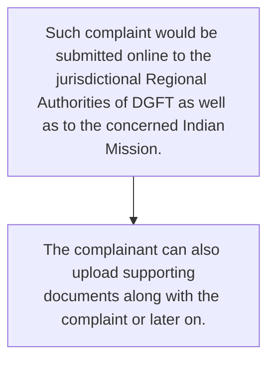
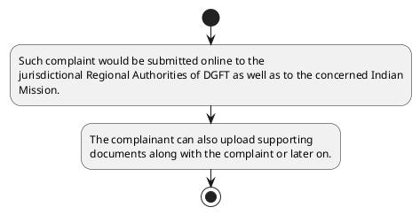

# Chapter 8 / Section 8.03: Online Filing and Tracking of Quality Complaints/Trade

**Chapter Title:** Quality Complaints and Trade Disputes

**Pages:** 3

**Purpose:** 8.03 Online Filing and Tracking of Quality Complaints/Trade
Disputes
A request for investigation and settlement of quality complaint/trade dispute
would be filed online by an Indian/foreign entity at
“www.dgft.gov.in>Services>Quality Complaints & Trade Disputes>fill Online
Application Form”.

**Purpose Thanglish:** Indha Online Filing and Tracking of Quality Complaints/Trade section-la, 8.03 Online Filing and Tracking of Quality Complaints/Trade
Disputes
A request for investigation and settlement of quality complaint/trade dispute
would be filed online by an Indian/foreign entity at
“www.dgft.gov.in>Services>Quality Complaints & Trade Disputes>fill Online
application Form”.

**Summary:** 8.03 Online Filing and Tracking of Quality Complaints/Trade
Disputes
A request for investigation and settlement of quality complaint/trade dispute
would be filed online by an Indian/foreign entity at
“www.dgft.gov.in>Services>Quality Complaints & Trade Disputes>fill Online
Application Form”. Such complaint would be submitted online to the
jurisdictional Regional Authorities of DGFT as well as to the concerned Indian
Mission. On submission, a Unique Reference Number will be generated and sent
to the email id of the complainant.

**Business Meaning:** 8.03 Online Filing and Tracking of Quality Complaints/Trade
Disputes
A request for investigation and settlement of quality complaint/trade dispute
would be filed online by an Indian/foreign entity at
“www.dgft.gov.in>Services>Quality Complaints & Trade Disputes>fill Online
Application Form”.

**Business Explanation:** 8.03 Online Filing and Tracking of Quality Complaints/Trade
Disputes
A request for investigation and settlement of quality complaint/trade dispute
would be filed online by an Indian/foreign entity at
“www.dgft.gov.in>Services>Quality Complaints & Trade Disputes>fill Online
Application Form”. Such complaint would be submitted online to the
jurisdictional Regional Authorities of DGFT as well as to the concerned Indian
Mission. On submission, a Unique Reference Number will be generated and sent
to the email id of the complainant.

**Business Explanation Thanglish:** Indha Online Filing and Tracking of Quality Complaints/Trade section-la, 8.03 Online Filing and Tracking of Quality Complaints/Trade
Disputes
A request for investigation and settlement of quality complaint/trade dispute
would be filed online by an Indian/foreign entity at
“www.dgft.gov.in>Services>Quality Complaints & Trade Disputes>fill Online
application Form”. Such complaint would be submitted online to the
jurisdictional Regional Authorities of DGFT as well as to the concerned Indian
Mission. On submission, a Unique Reference Number will be generated and sent
to the email id of the complainant.

## Business Logic
- None identified

## Business Rules
- rule_id=CH8-SEC8_03-R001, rule_description=IF validations pass THEN recommend action: Such complaint would be submitted online to the
jurisdictional Regional Authorities of DGFT as well as to the concerned Indian
Mission., trigger=Online Filing and Tracking of Quality Complaints/Trade, condition=Section 8.03 is applicable, validation=Not explicitly covered in uploaded documents., action=Such complaint would be submitted online to the
jurisdictional Regional Authorities of DGFT as well as to the concerned Indian
Mission., exception=No explicit exception found in uploaded documents., output=DEKAI should produce a compliance decision for 8.03 - Online Filing and Tracking of Quality Complaints/Trade.

## Conditions
- None identified

## Condition Logic
- id=8.8.03.1, if=Section 8.03 is applicable, then=Such complaint would be submitted online to the
jurisdictional Regional Authorities of DGFT as well as to the concerned Indian
Mission., source=Derived from uploaded documents

## Validations
- None identified

## Exceptions
- None identified

## Dependencies
- 3
- 8

## Authorities
- dgft
- Regional Authorities of DGFT

## Required Documents
- 8.03 Online Filing and Tracking of Quality Complaints/Trade
Disputes
A request for investigation and settlement of quality complaint/trade dispute
would be filed online by an Indian/foreign entity at
“www.dgft.gov.in>Services>Quality Complaints & Trade Disputes>fill Online
Application Form”.
- The complainant can also upload supporting
documents along with the complaint or later on.
- 8.03 Online Filing and Tracking of Quality Complaints/Trade
Disputes
A request for investigation and settlement of quality complaint/trade dispute
would
be
filed
online
by
an
Indian/foreign
entity
at
“www.dgft.gov.in>Services>Quality Complaints & Trade Disputes>fill Online
Application Form”.

## Timelines
- None identified

## Actions
- Such complaint would be submitted online to the
jurisdictional Regional Authorities of DGFT as well as to the concerned Indian
Mission.
- The complainant can also upload supporting
documents along with the complaint or later on.

## Workflow
- Such complaint would be submitted online to the
jurisdictional Regional Authorities of DGFT as well as to the concerned Indian
Mission.
- The complainant can also upload supporting
documents along with the complaint or later on.

## Workflow ASCII
```text
Online Filing and Tracking of Quality Complaints/Trade
Such complaint would be submitted online to the
jurisdictional Regional Authorities of DGFT as well as to the concerned Indian
Mission.
   |
   v
The complainant can also upload supporting
documents along with the complaint or later on.
```

## Decision Tree
- IF section 8.03 applies THEN Such complaint would be submitted online to the
jurisdictional Regional Authorities of DGFT as well as to the concerned Indian
Mission.

## Decision Tree ASCII
```text
Online Filing and Tracking of Quality Complaints/Trade Decision
IF section 8.03 applies THEN Such complaint would be submitted online to the
jurisdictional Regional Authorities of DGFT as well as to the concerned Indian
Mission.
```

## Examples
- User asks to process Online Filing and Tracking of Quality Complaints/Trade; the platform checks conditions, validations, and documents before action.

**Real-world Example:** Example: an importer or exporter invokes Online Filing and Tracking of Quality Complaints/Trade, submits 8.03 Online Filing and Tracking of Quality Complaints/Trade
Disputes
A request for investigation and settlement of quality complaint/trade dispute
would be filed online by an Indian/foreign entity at
“www.dgft.gov.in>Services>Quality Complaints & Trade Disputes>fill Online
Application Form”., The complainant can also upload supporting
documents along with the complaint or later on., 8.03 Online Filing and Tracking of Quality Complaints/Trade
Disputes
A request for investigation and settlement of quality complaint/trade dispute
would
be
filed
online
by
an
Indian/foreign
entity
at
“www.dgft.gov.in>Services>Quality Complaints & Trade Disputes>fill Online
Application Form”., and DEKAI uses the extracted rules to such complaint would be submitted online to the
jurisdictional regional authorities of dgft as well as to the concerned indian
mission..

**Real-world Example Thanglish:** Indha Online Filing and Tracking of Quality Complaints/Trade section-la, Example: an importer or exporter invokes Online Filing and Tracking of Quality Complaints/Trade, submits 8.03 Online Filing and Tracking of Quality Complaints/Trade
Disputes
A request for investigation and settlement of quality complaint/trade dispute
would be filed online by an Indian/foreign entity at
“www.dgft.gov.in>Services>Quality Complaints & Trade Disputes>fill Online
application Form”., The complainant can also upload supporting
documents along with the complaint or later on., 8.03 Online Filing and Tracking of Quality Complaints/Trade
Disputes
A request for investigation and settlement of quality complaint/trade dispute
would
be
filed
online
by
an
Indian/foreign
entity
at
“www.dgft.gov.in>Services>Quality Complaints & Trade Disputes>fill Online
application Form”., and DEKAI uses the extracted rules to such complaint would be submitted online to the
jurisdictional regional authorities of dgft as well as to the concerned indian
mission..

## AI Rules
- IF validations pass THEN recommend action: Such complaint would be submitted online to the
jurisdictional Regional Authorities of DGFT as well as to the concerned Indian
Mission.

## Database Fields
- name=section_code, type=string, required=True, source=parsed_section_heading
- name=section_title, type=string, required=True, source=parsed_section_heading
- name=and_flag, type=boolean, required=False, source=keyword:and
- name=for_flag, type=boolean, required=False, source=keyword:for
- name=www_flag, type=boolean, required=False, source=keyword:www
- name=gov_flag, type=boolean, required=False, source=keyword:gov
- name=the_flag, type=boolean, required=False, source=keyword:the
- name=can_flag, type=boolean, required=False, source=keyword:can
- name=dgft_flag, type=boolean, required=False, source=keyword:dgft
- name=fill_flag, type=boolean, required=False, source=keyword:fill
- name=document_1_submitted, type=boolean, required=True, source=8.03 Online Filing and Tracking of Quality Complaints/Trade
Disputes
A request for investigation and settlement of quality complaint/trade dispute
would be filed online by an Indian/foreign entity at
“www.dgft.gov.in>Services>Quality Complaints & Trade Disputes>fill Online
Application Form”.
- name=document_2_submitted, type=boolean, required=True, source=The complainant can also upload supporting
documents along with the complaint or later on.
- name=document_3_submitted, type=boolean, required=True, source=8.03 Online Filing and Tracking of Quality Complaints/Trade
Disputes
A request for investigation and settlement of quality complaint/trade dispute
would
be
filed
online
by
an
Indian/foreign
entity
at
“www.dgft.gov.in>Services>Quality Complaints & Trade Disputes>fill Online
Application Form”.

## API Requirements
- method=GET, path=/api/dgft/sections/8.03, purpose=Retrieve knowledge payload for section 8.03, query_params=['include=workflow,decision_tree,validations'], response_fields=['section', 'title', 'summary', 'conditions', 'validations', 'exceptions', 'workflow', 'decision_tree']
- method=POST, path=/api/dgft/Online-Filing-and-Tracking-of-Quality-Complaints-Trade/validate, purpose=Validate inputs and documents for Online Filing and Tracking of Quality Complaints/Trade, request_fields=['section_code', 'section_title', 'document_1_submitted', 'document_2_submitted', 'document_3_submitted'], response_fields=['status', 'errors', 'warnings', 'next_actions']
- method=POST, path=/api/dgft/Online-Filing-and-Tracking-of-Quality-Complaints-Trade/execute, purpose=Trigger business action for Such complaint would be submitted online to the
jurisdictional Regional Authorities of DGFT as well as to the concerned Indian
Mission., request_fields=['section_code', 'section_title', 'document_1_submitted', 'document_2_submitted', 'document_3_submitted'], response_fields=['reference_id', 'status', 'authority', 'timeline']

## UI Screens
- screen_id=Online_Filing_and_Tracking_of_Quality_Complaints_Trade_overview, name=Online Filing and Tracking of Quality Complaints/Trade Overview, purpose=Show section summary, authority, timeline, and eligibility cues., widgets=['summary_card', 'conditions_table', 'authority_badges', 'timeline_panel']
- screen_id=Online_Filing_and_Tracking_of_Quality_Complaints_Trade_submission, name=Online Filing and Tracking of Quality Complaints/Trade Submission, purpose=Capture applicant data and supporting documents., widgets=['dynamic_form', 'document_uploader', 'validation_panel', 'next_action_footer'], fields=['section_code', 'section_title', 'and_flag', 'for_flag', 'www_flag', 'gov_flag', 'the_flag', 'can_flag']

## Error Messages
- Validation failed because the section requirements were not fully met.

## FAQ
- question_en=What is the purpose of section 8.03?, answer_en=8.03 Online Filing and Tracking of Quality Complaints/Trade
Disputes
A request for investigation and settlement of quality complaint/trade dispute
would be filed online by an Indian/foreign entity at
“www.dgft.gov.in>Services>Quality Complaints & Trade Disputes>fill Online
Application Form”. Such complaint would be submitted online to the
jurisdictional Regional Authorities of DGFT as well as to the concerned Indian
Mission. On submission, a Unique Reference Number will be generated and sent
to the email id of the complainant., question_thanglish=Indha Online Filing and Tracking of Quality Complaints/Trade section-la, What is the purpose of section 8.03?, answer_thanglish=Indha Online Filing and Tracking of Quality Complaints/Trade section-la, 8.03 Online Filing and Tracking of Quality Complaints/Trade
Disputes
A request for investigation and settlement of quality complaint/trade dispute
would be filed online by an Indian/foreign entity at
“www.dgft.gov.in>Services>Quality Complaints & Trade Disputes>fill Online
application Form”. Such complaint would be submitted online to the
jurisdictional Regional Authorities of DGFT as well as to the concerned Indian
Mission. On submission, a Unique Reference Number will be generated and sent
to the email id of the complainant.
- question_en=What documents are required under Online Filing and Tracking of Quality Complaints/Trade?, answer_en=8.03 Online Filing and Tracking of Quality Complaints/Trade
Disputes
A request for investigation and settlement of quality complaint/trade dispute
would be filed online by an Indian/foreign entity at
“www.dgft.gov.in>Services>Quality Complaints & Trade Disputes>fill Online
Application Form”., The complainant can also upload supporting
documents along with the complaint or later on., 8.03 Online Filing and Tracking of Quality Complaints/Trade
Disputes
A request for investigation and settlement of quality complaint/trade dispute
would
be
filed
online
by
an
Indian/foreign
entity
at
“www.dgft.gov.in>Services>Quality Complaints & Trade Disputes>fill Online
Application Form”., question_thanglish=Indha Online Filing and Tracking of Quality Complaints/Trade section-la, What documents are required under Online Filing and Tracking of Quality Complaints/Trade?, answer_thanglish=Indha Online Filing and Tracking of Quality Complaints/Trade section-la, 8.03 Online Filing and Tracking of Quality Complaints/Trade
Disputes
A request for investigation and settlement of quality complaint/trade dispute
would be filed online by an Indian/foreign entity at
“www.dgft.gov.in>Services>Quality Complaints & Trade Disputes>fill Online
application Form”., The complainant can also upload supporting
documents along with the complaint or later on., 8.03 Online Filing and Tracking of Quality Complaints/Trade
Disputes
A request for investigation and settlement of quality complaint/trade dispute
would
be
filed
online
by
an
Indian/foreign
entity
at
“www.dgft.gov.in>Services>Quality Complaints & Trade Disputes>fill Online
application Form”.
- question_en=Which authority handles Online Filing and Tracking of Quality Complaints/Trade?, answer_en=dgft, Regional Authorities of DGFT, question_thanglish=Indha Online Filing and Tracking of Quality Complaints/Trade section-la, Which authority handles Online Filing and Tracking of Quality Complaints/Trade?, answer_thanglish=Indha Online Filing and Tracking of Quality Complaints/Trade section-la, dgft, Regional Authorities of DGFT

## Questions Users May Ask
- What does Online Filing and Tracking of Quality Complaints/Trade require?
- Which documents are needed for Online Filing and Tracking of Quality Complaints/Trade?
- How does DEKAI validate Online Filing and Tracking of Quality Complaints/Trade requests?
- What action should be taken for Online Filing and Tracking of Quality Complaints/Trade?

## Expected AI Answers
- Online Filing and Tracking of Quality Complaints/Trade requires the platform to interpret the section text, apply the extracted business rules, and present the correct next action.
- Required documents are inferred from the section text: 8.03 Online Filing and Tracking of Quality Complaints/Trade
Disputes
A request for investigation and settlement of quality complaint/trade dispute
would be filed online by an Indian/foreign entity at
“www.dgft.gov.in>Services>Quality Complaints & Trade Disputes>fill Online
Application Form”., The complainant can also upload supporting
documents along with the complaint or later on., 8.03 Online Filing and Tracking of Quality Complaints/Trade
Disputes
A request for investigation and settlement of quality complaint/trade dispute
would
be
filed
online
by
an
Indian/foreign
entity
at
“www.dgft.gov.in>Services>Quality Complaints & Trade Disputes>fill Online
Application Form”.
- DEKAI validates Online Filing and Tracking of Quality Complaints/Trade by checking conditions, required documents, authority references, and exception clauses before recommending an outcome.
- The primary extracted action is: Such complaint would be submitted online to the
jurisdictional Regional Authorities of DGFT as well as to the concerned Indian
Mission.

## AI Q&A Examples
- question_en=User asks: How do I comply with Online Filing and Tracking of Quality Complaints/Trade?, answer_en=AI answers: DEKAI should evaluate section 8.03, apply the extracted rules, and guide the user through Such complaint would be submitted online to the
jurisdictional Regional Authorities of DGFT as well as to the concerned Indian
Mission.., question_thanglish=Indha Online Filing and Tracking of Quality Complaints/Trade section-la, User asks: How do I comply with Online Filing and Tracking of Quality Complaints/Trade?, answer_thanglish=Indha Online Filing and Tracking of Quality Complaints/Trade section-la, AI answers: DEKAI should evaluate section 8.03, apply the extracted rules, and guide the user through Such complaint would be submitted online to the
jurisdictional Regional Authorities of DGFT as well as to the concerned Indian
Mission..
- question_en=User asks: Which validations apply to Online Filing and Tracking of Quality Complaints/Trade?, answer_en=AI answers: Applicable validations are not explicitly covered in the uploaded documents., question_thanglish=Indha Online Filing and Tracking of Quality Complaints/Trade section-la, User asks: Which validations apply to Online Filing and Tracking of Quality Complaints/Trade?, answer_thanglish=Indha Online Filing and Tracking of Quality Complaints/Trade section-la, AI answers: Applicable validations are not explicitly covered in the uploaded documents.

## DEKAI AI Implementation Notes
- Capture chapter 8, section 8.03, title, and page references as immutable knowledge metadata.
- Bind validations for Online Filing and Tracking of Quality Complaints/Trade into a rule engine keyed by the rule IDs extracted for this section.
- Expose document upload controls for: 8.03 Online Filing and Tracking of Quality Complaints/Trade
Disputes
A request for investigation and settlement of quality complaint/trade dispute
would be filed online by an Indian/foreign entity at
“www.dgft.gov.in>Services>Quality Complaints & Trade Disputes>fill Online
Application Form”., The complainant can also upload supporting
documents along with the complaint or later on., 8.03 Online Filing and Tracking of Quality Complaints/Trade
Disputes
A request for investigation and settlement of quality complaint/trade dispute
would
be
filed
online
by
an
Indian/foreign
entity
at
“www.dgft.gov.in>Services>Quality Complaints & Trade Disputes>fill Online
Application Form”..
- Route escalations or approvals to: dgft, Regional Authorities of DGFT.
- Show contextual links to related sections: 3, 8.

## DEKAI AI Implementation Notes Thanglish
- Indha Online Filing and Tracking of Quality Complaints/Trade section-la, Capture chapter 8, section 8.03, title, and page references as immutable knowledge metadata.
- Indha Online Filing and Tracking of Quality Complaints/Trade section-la, Bind validations for Online Filing and Tracking of Quality Complaints/Trade into a rule engine keyed by the rule IDs extracted for this section.
- Indha Online Filing and Tracking of Quality Complaints/Trade section-la, Expose document upload controls for: 8.03 Online Filing and Tracking of Quality Complaints/Trade
Disputes
A request for investigation and settlement of quality complaint/trade dispute
would be filed online by an Indian/foreign entity at
“www.dgft.gov.in>Services>Quality Complaints & Trade Disputes>fill Online
application Form”., The complainant can also upload supporting
documents along with the complaint or later on., 8.03 Online Filing and Tracking of Quality Complaints/Trade
Disputes
A request for investigation and settlement of quality complaint/trade dispute
would
be
filed
online
by
an
Indian/foreign
entity
at
“www.dgft.gov.in>Services>Quality Complaints & Trade Disputes>fill Online
application Form”..
- Indha Online Filing and Tracking of Quality Complaints/Trade section-la, Route escalations or approvals to: dgft, Regional Authorities of DGFT.
- Indha Online Filing and Tracking of Quality Complaints/Trade section-la, Show contextual links to related sections: 3, 8.

## AI Metadata
- Keywords: and, for, www, gov, the, can, dgft, fill, Form, Such, well, will, sent, also, with, would, filed, Trade, email, along
- Search Keywords: and, for, www, gov, the, can, dgft, fill, Form, Such, well, will, sent, also, with, would, filed, Trade, email, along
- Intent: Support Online Filing and Tracking of Quality Complaints/Trade processing and compliance validation.
- Tags: 8.03, Online Filing and Tracking of Quality Complaints/Trade, document-driven, dgft
- Related Sections: 3, 8
- Related Chapters: 
- Related Rules: 

## Mermaid


## PlantUML

