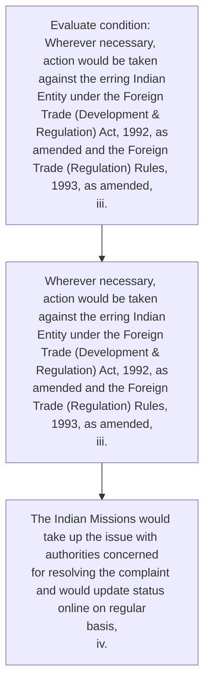
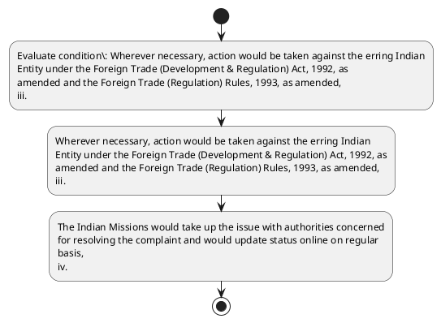

# Chapter 8 / Section 8.04: Mechanism for resolving Quality Complaints/Trade Disputes

**Chapter Title:** Quality Complaints and Trade Disputes

**Pages:** 3, 4

**Purpose:** 8.04 Mechanism for resolving Quality Complaints/Trade Disputes
i.

**Purpose Thanglish:** Indha Mechanism for resolving Quality Complaints/Trade Disputes section-la, 8.04 Mechanism for resolving Quality Complaints/Trade Disputes
i.

**Summary:** 8.04 Mechanism for resolving Quality Complaints/Trade Disputes
i. CQCTD in the Regional Authorities of the DGFT would take up the matter
with the concerned entity or authorities in their jurisdiction for resolving
the complaint and would update status online on a regular basis,
pg. 165
| Hyderabad | |
19 | | Dy.

**Business Meaning:** 8.04 Mechanism for resolving Quality Complaints/Trade Disputes
i.

**Business Explanation:** 8.04 Mechanism for resolving Quality Complaints/Trade Disputes
i. CQCTD in the Regional Authorities of the DGFT would take up the matter
with the concerned entity or authorities in their jurisdiction for resolving
the complaint and would update status online on a regular basis,
pg. 165
| Hyderabad | |
19 | | Dy.

**Business Explanation Thanglish:** Indha Mechanism for resolving Quality Complaints/Trade Disputes section-la, 8.04 Mechanism for resolving Quality Complaints/Trade Disputes
i. CQCTD in the Regional Authorities of the DGFT would take up the matter
with the concerned entity or authorities in their jurisdiction for resolving
the complaint and would update status online on a regular basis,
pg. 165
| Hyderabad | |
19 | | Dy.

## Business Logic
- None identified

## Business Rules
- rule_id=CH8-SEC8_04-R001, rule_description=IF validations pass THEN recommend action: Wherever necessary, action would be taken against the erring Indian
Entity under the Foreign Trade (Development & Regulation) Act, 1992, as
amended and the Foreign Trade (Regulation) Rules, 1993, as amended,
iii., trigger=Mechanism for resolving Quality Complaints/Trade Disputes, condition=Wherever necessary, action would be taken against the erring Indian
Entity under the Foreign Trade (Development & Regulation) Act, 1992, as
amended and the Foreign Trade (Regulation) Rules, 1993, as amended,
iii., validation=Not explicitly covered in uploaded documents., action=Wherever necessary, action would be taken against the erring Indian
Entity under the Foreign Trade (Development & Regulation) Act, 1992, as
amended and the Foreign Trade (Regulation) Rules, 1993, as amended,
iii., exception=No explicit exception found in uploaded documents., output=DEKAI should produce a compliance decision for 8.04 - Mechanism for resolving Quality Complaints/Trade Disputes.

## Conditions
- Wherever necessary, action would be taken against the erring Indian
Entity under the Foreign Trade (Development & Regulation) Act, 1992, as
amended and the Foreign Trade (Regulation) Rules, 1993, as amended,
iii.

## Condition Logic
- id=8.8.04.1, if=Wherever necessary, action would be taken against the erring Indian
Entity under the Foreign Trade (Development & Regulation) Act, 1992, as
amended and the Foreign Trade (Regulation) Rules, 1993, as amended,
iii., then=Wherever necessary, action would be taken against the erring Indian
Entity under the Foreign Trade (Development & Regulation) Act, 1992, as
amended and the Foreign Trade (Regulation) Rules, 1993, as amended,
iii., source=Wherever necessary, action would be taken against the erring Indian
Entity under the Foreign Trade (Development & Regulation) Act, 1992, as
amended and the Foreign Trade (Regulation) Rules, 1993, as amended,
iii.

## Validations
- None identified

## Exceptions
- None identified

## Dependencies
- None identified

## Authorities
- DGFT
- CQCTD
- CQCTD in the Regional Authorities of the DGFT
- RA

## Required Documents
- None identified

## Timelines
- None identified

## Actions
- Wherever necessary, action would be taken against the erring Indian
Entity under the Foreign Trade (Development & Regulation) Act, 1992, as
amended and the Foreign Trade (Regulation) Rules, 1993, as amended,
iii.
- The Indian Missions would take up the issue with authorities concerned
for resolving the complaint and would update status online on regular
basis,
iv.

## Workflow
- Evaluate condition: Wherever necessary, action would be taken against the erring Indian
Entity under the Foreign Trade (Development & Regulation) Act, 1992, as
amended and the Foreign Trade (Regulation) Rules, 1993, as amended,
iii.
- Wherever necessary, action would be taken against the erring Indian
Entity under the Foreign Trade (Development & Regulation) Act, 1992, as
amended and the Foreign Trade (Regulation) Rules, 1993, as amended,
iii.
- The Indian Missions would take up the issue with authorities concerned
for resolving the complaint and would update status online on regular
basis,
iv.

## Workflow ASCII
```text
Mechanism for resolving Quality Complaints/Trade Disputes
Evaluate condition: Wherever necessary, action would be taken against the erring Indian
Entity under the Foreign Trade (Development & Regulation) Act, 1992, as
amended and the Foreign Trade (Regulation) Rules, 1993, as amended,
iii.
   |
   v
Wherever necessary, action would be taken against the erring Indian
Entity under the Foreign Trade (Development & Regulation) Act, 1992, as
amended and the Foreign Trade (Regulation) Rules, 1993, as amended,
iii.
   |
   v
The Indian Missions would take up the issue with authorities concerned
for resolving the complaint and would update status online on regular
basis,
iv.
```

## Decision Tree
- IF Wherever necessary, action would be taken against the erring Indian
Entity under the Foreign Trade (Development & Regulation) Act, 1992, as
amended and the Foreign Trade (Regulation) Rules, 1993, as amended,
iii. THEN Wherever necessary, action would be taken against the erring Indian
Entity under the Foreign Trade (Development & Regulation) Act, 1992, as
amended and the Foreign Trade (Regulation) Rules, 1993, as amended,
iii.

## Decision Tree ASCII
```text
Mechanism for resolving Quality Complaints/Trade Disputes Decision
IF Wherever necessary, action would be taken against the erring Indian
Entity under the Foreign Trade (Development & Regulation) Act, 1992, as
amended and the Foreign Trade (Regulation) Rules, 1993, as amended,
iii. THEN Wherever necessary, action would be taken against the erring Indian
Entity under the Foreign Trade (Development & Regulation) Act, 1992, as
amended and the Foreign Trade (Regulation) Rules, 1993, as amended,
iii.
```

## Examples
- User asks to process Mechanism for resolving Quality Complaints/Trade Disputes; the platform checks conditions, validations, and documents before action.

**Real-world Example:** Example: an importer or exporter invokes Mechanism for resolving Quality Complaints/Trade Disputes, submits the prescribed DGFT records, and DEKAI uses the extracted rules to wherever necessary, action would be taken against the erring indian
entity under the foreign trade (development & regulation) act, 1992, as
amended and the foreign trade (regulation) rules, 1993, as amended,
iii..

**Real-world Example Thanglish:** Indha Mechanism for resolving Quality Complaints/Trade Disputes section-la, Example: an importer or exporter invokes Mechanism for resolving Quality Complaints/Trade Disputes, submits the prescribed DGFT records, and DEKAI uses the extracted rules to wherever necessary, action would be taken against the erring indian
entity under the foreign trade (development & regulation) act, 1992, as
amended and the foreign trade (regulation) rules, 1993, as amended,
iii..

## AI Rules
- IF validations pass THEN recommend action: Wherever necessary, action would be taken against the erring Indian
Entity under the Foreign Trade (Development & Regulation) Act, 1992, as
amended and the Foreign Trade (Regulation) Rules, 1993, as amended,
iii.

## Database Fields
- name=section_code, type=string, required=True, source=parsed_section_heading
- name=section_title, type=string, required=True, source=parsed_section_heading
- name=for_flag, type=boolean, required=False, source=keyword:for
- name=the_flag, type=boolean, required=False, source=keyword:the
- name=and_flag, type=boolean, required=False, source=keyword:and
- name=act_flag, type=boolean, required=False, source=keyword:Act
- name=iii_flag, type=boolean, required=False, source=keyword:iii
- name=has_flag, type=boolean, required=False, source=keyword:has
- name=dgft_flag, type=boolean, required=False, source=keyword:DGFT
- name=take_flag, type=boolean, required=False, source=keyword:take

## API Requirements
- method=GET, path=/api/dgft/sections/8.04, purpose=Retrieve knowledge payload for section 8.04, query_params=['include=workflow,decision_tree,validations'], response_fields=['section', 'title', 'summary', 'conditions', 'validations', 'exceptions', 'workflow', 'decision_tree']
- method=POST, path=/api/dgft/Mechanism-for-resolving-Quality-Complaints-Trade-Disputes/validate, purpose=Validate inputs and documents for Mechanism for resolving Quality Complaints/Trade Disputes, request_fields=['section_code', 'section_title'], response_fields=['status', 'errors', 'warnings', 'next_actions']
- method=POST, path=/api/dgft/Mechanism-for-resolving-Quality-Complaints-Trade-Disputes/execute, purpose=Trigger business action for Wherever necessary, action would be taken against the erring Indian
Entity under the Foreign Trade (Development & Regulation) Act, 1992, as
amended and the Foreign Trade (Regulation) Rules, 1993, as amended,
iii., request_fields=['section_code', 'section_title'], response_fields=['reference_id', 'status', 'authority', 'timeline']

## UI Screens
- screen_id=Mechanism_for_resolving_Quality_Complaints_Trade_Disputes_overview, name=Mechanism for resolving Quality Complaints/Trade Disputes Overview, purpose=Show section summary, authority, timeline, and eligibility cues., widgets=['summary_card', 'conditions_table', 'authority_badges', 'timeline_panel']
- screen_id=Mechanism_for_resolving_Quality_Complaints_Trade_Disputes_submission, name=Mechanism for resolving Quality Complaints/Trade Disputes Submission, purpose=Capture applicant data and supporting documents., widgets=['dynamic_form', 'document_uploader', 'validation_panel', 'next_action_footer'], fields=['section_code', 'section_title', 'for_flag', 'the_flag', 'and_flag', 'act_flag', 'iii_flag', 'has_flag']

## Error Messages
- Validation failed because the section requirements were not fully met.

## FAQ
- question_en=What is the purpose of section 8.04?, answer_en=8.04 Mechanism for resolving Quality Complaints/Trade Disputes
i. CQCTD in the Regional Authorities of the DGFT would take up the matter
with the concerned entity or authorities in their jurisdiction for resolving
the complaint and would update status online on a regular basis,
pg. 165
| Hyderabad | |
19 | | Dy., question_thanglish=Indha Mechanism for resolving Quality Complaints/Trade Disputes section-la, What is the purpose of section 8.04?, answer_thanglish=Indha Mechanism for resolving Quality Complaints/Trade Disputes section-la, 8.04 Mechanism for resolving Quality Complaints/Trade Disputes
i. CQCTD in the Regional Authorities of the DGFT would take up the matter
with the concerned entity or authorities in their jurisdiction for resolving
the complaint and would update status online on a regular basis,
pg. 165
| Hyderabad | |
19 | | Dy.
- question_en=What documents are required under Mechanism for resolving Quality Complaints/Trade Disputes?, answer_en=Not explicitly covered in uploaded documents., question_thanglish=Indha Mechanism for resolving Quality Complaints/Trade Disputes section-la, What documents are required under Mechanism for resolving Quality Complaints/Trade Disputes?, answer_thanglish=Indha Mechanism for resolving Quality Complaints/Trade Disputes section-la, Not explicitly covered in uploaded documents.
- question_en=Which authority handles Mechanism for resolving Quality Complaints/Trade Disputes?, answer_en=DGFT, CQCTD, CQCTD in the Regional Authorities of the DGFT, RA, question_thanglish=Indha Mechanism for resolving Quality Complaints/Trade Disputes section-la, Which authority handles Mechanism for resolving Quality Complaints/Trade Disputes?, answer_thanglish=Indha Mechanism for resolving Quality Complaints/Trade Disputes section-la, DGFT, CQCTD, CQCTD in the Regional Authorities of the DGFT, RA

## Questions Users May Ask
- What does Mechanism for resolving Quality Complaints/Trade Disputes require?
- Which documents are needed for Mechanism for resolving Quality Complaints/Trade Disputes?
- How does DEKAI validate Mechanism for resolving Quality Complaints/Trade Disputes requests?
- What action should be taken for Mechanism for resolving Quality Complaints/Trade Disputes?

## Expected AI Answers
- Mechanism for resolving Quality Complaints/Trade Disputes requires the platform to interpret the section text, apply the extracted business rules, and present the correct next action.
- Required documents are inferred from the section text: no explicit documents were detected.
- DEKAI validates Mechanism for resolving Quality Complaints/Trade Disputes by checking conditions, required documents, authority references, and exception clauses before recommending an outcome.
- The primary extracted action is: Wherever necessary, action would be taken against the erring Indian
Entity under the Foreign Trade (Development & Regulation) Act, 1992, as
amended and the Foreign Trade (Regulation) Rules, 1993, as amended,
iii.

## AI Q&A Examples
- question_en=User asks: How do I comply with Mechanism for resolving Quality Complaints/Trade Disputes?, answer_en=AI answers: DEKAI should evaluate section 8.04, apply the extracted rules, and guide the user through Evaluate condition: Wherever necessary, action would be taken against the erring Indian
Entity under the Foreign Trade (Development & Regulation) Act, 1992, as
amended and the Foreign Trade (Regulation) Rules, 1993, as amended,
iii.., question_thanglish=Indha Mechanism for resolving Quality Complaints/Trade Disputes section-la, User asks: How do I comply with Mechanism for resolving Quality Complaints/Trade Disputes?, answer_thanglish=Indha Mechanism for resolving Quality Complaints/Trade Disputes section-la, AI answers: DEKAI should evaluate section 8.04, apply the extracted rules, and guide the user through Evaluate condition: Wherever necessary, action would be taken against the erring Indian
Entity under the Foreign Trade (Development & Regulation) Act, 1992, as
amended and the Foreign Trade (Regulation) Rules, 1993, as amended,
iii..
- question_en=User asks: Which validations apply to Mechanism for resolving Quality Complaints/Trade Disputes?, answer_en=AI answers: Applicable validations are not explicitly covered in the uploaded documents., question_thanglish=Indha Mechanism for resolving Quality Complaints/Trade Disputes section-la, User asks: Which validations apply to Mechanism for resolving Quality Complaints/Trade Disputes?, answer_thanglish=Indha Mechanism for resolving Quality Complaints/Trade Disputes section-la, AI answers: Applicable validations are not explicitly covered in the uploaded documents.

## DEKAI AI Implementation Notes
- Capture chapter 8, section 8.04, title, and page references as immutable knowledge metadata.
- Bind validations for Mechanism for resolving Quality Complaints/Trade Disputes into a rule engine keyed by the rule IDs extracted for this section.
- Route escalations or approvals to: DGFT, CQCTD, CQCTD in the Regional Authorities of the DGFT, RA.

## DEKAI AI Implementation Notes Thanglish
- Indha Mechanism for resolving Quality Complaints/Trade Disputes section-la, Capture chapter 8, section 8.04, title, and page references as immutable knowledge metadata.
- Indha Mechanism for resolving Quality Complaints/Trade Disputes section-la, Bind validations for Mechanism for resolving Quality Complaints/Trade Disputes into a rule engine keyed by the rule IDs extracted for this section.
- Indha Mechanism for resolving Quality Complaints/Trade Disputes section-la, Route escalations or approvals to: DGFT, CQCTD, CQCTD in the Regional Authorities of the DGFT, RA.

## AI Metadata
- Keywords: for, the, and, Act, iii, has, DGFT, take, with, also, been, CQCTD, would, their, basis, taken, under, Trade, Rules, issue
- Search Keywords: for, the, and, Act, iii, has, DGFT, take, with, also, been, CQCTD, would, their, basis, taken, under, Trade, Rules, issue
- Intent: Support Mechanism for resolving Quality Complaints/Trade Disputes processing and compliance validation.
- Tags: 8.04, Mechanism for resolving Quality Complaints/Trade Disputes, dgft
- Related Sections: 
- Related Chapters: 
- Related Rules: 

## Mermaid


## PlantUML

