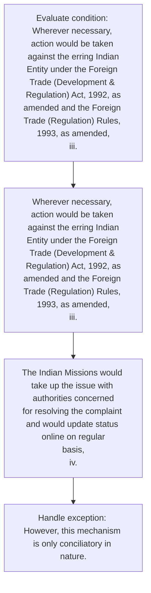
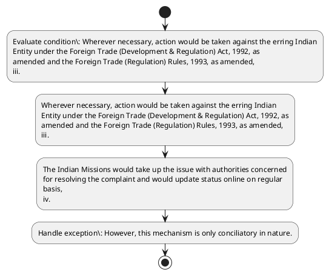

# Chapter 8 / Section 8.05: Choice to pursue other options

**Chapter Title:** Quality Complaints and Trade Disputes

**Pages:** 4

**Purpose:** 8.05 Choice to pursue other options
This mechanism is to provide an additional window for resolution of
complaints/disputes to create confidence in business environment in the
country.

**Purpose Thanglish:** Indha Choice to pursue other options section-la, 8.05 Choice to pursue other options
This mechanism is to provide an additional window for resolution of
complaints/disputes to create confidence in business environment in the
country.

**Summary:** 8.05 Choice to pursue other options
This mechanism is to provide an additional window for resolution of
complaints/disputes to create confidence in business environment in the
country. Efforts would be made to resolve the complaints amicably and
expeditiously. However, this mechanism is only conciliatory in nature.

**Business Meaning:** 8.05 Choice to pursue other options
This mechanism is to provide an additional window for resolution of
complaints/disputes to create confidence in business environment in the
country.

**Business Explanation:** 8.05 Choice to pursue other options
This mechanism is to provide an additional window for resolution of
complaints/disputes to create confidence in business environment in the
country. Efforts would be made to resolve the complaints amicably and
expeditiously. However, this mechanism is only conciliatory in nature.

**Business Explanation Thanglish:** Indha Choice to pursue other options section-la, 8.05 Choice to pursue other options
This mechanism is to provide an additional window for resolution of
complaints/disputes to create confidence in business environment in the
country. Efforts would be made to resolve the complaints amicably and
expeditiously. However, this mechanism is only conciliatory in nature.

## Business Logic
- None identified

## Business Rules
- rule_id=CH8-SEC8_05-R001, rule_description=IF validations pass THEN recommend action: Wherever necessary, action would be taken against the erring Indian
Entity under the Foreign Trade (Development & Regulation) Act, 1992, as
amended and the Foreign Trade (Regulation) Rules, 1993, as amended,
iii., trigger=Choice to pursue other options, condition=Wherever necessary, action would be taken against the erring Indian
Entity under the Foreign Trade (Development & Regulation) Act, 1992, as
amended and the Foreign Trade (Regulation) Rules, 1993, as amended,
iii., validation=Not explicitly covered in uploaded documents., action=Wherever necessary, action would be taken against the erring Indian
Entity under the Foreign Trade (Development & Regulation) Act, 1992, as
amended and the Foreign Trade (Regulation) Rules, 1993, as amended,
iii., exception=However, this mechanism is only conciliatory in nature., output=DEKAI should produce a compliance decision for 8.05 - Choice to pursue other options.

## Conditions
- Wherever necessary, action would be taken against the erring Indian
Entity under the Foreign Trade (Development & Regulation) Act, 1992, as
amended and the Foreign Trade (Regulation) Rules, 1993, as amended,
iii.

## Condition Logic
- id=8.8.05.1, if=Wherever necessary, action would be taken against the erring Indian
Entity under the Foreign Trade (Development & Regulation) Act, 1992, as
amended and the Foreign Trade (Regulation) Rules, 1993, as amended,
iii., then=Wherever necessary, action would be taken against the erring Indian
Entity under the Foreign Trade (Development & Regulation) Act, 1992, as
amended and the Foreign Trade (Regulation) Rules, 1993, as amended,
iii., source=Wherever necessary, action would be taken against the erring Indian
Entity under the Foreign Trade (Development & Regulation) Act, 1992, as
amended and the Foreign Trade (Regulation) Rules, 1993, as amended,
iii.

## Validations
- None identified

## Exceptions
- However, this mechanism is only conciliatory in nature.

## Dependencies
- None identified

## Authorities
- DGFT

## Required Documents
- None identified

## Timelines
- None identified

## Actions
- Wherever necessary, action would be taken against the erring Indian
Entity under the Foreign Trade (Development & Regulation) Act, 1992, as
amended and the Foreign Trade (Regulation) Rules, 1993, as amended,
iii.
- The Indian Missions would take up the issue with authorities concerned
for resolving the complaint and would update status online on regular
basis,
iv.

## Workflow
- Evaluate condition: Wherever necessary, action would be taken against the erring Indian
Entity under the Foreign Trade (Development & Regulation) Act, 1992, as
amended and the Foreign Trade (Regulation) Rules, 1993, as amended,
iii.
- Wherever necessary, action would be taken against the erring Indian
Entity under the Foreign Trade (Development & Regulation) Act, 1992, as
amended and the Foreign Trade (Regulation) Rules, 1993, as amended,
iii.
- The Indian Missions would take up the issue with authorities concerned
for resolving the complaint and would update status online on regular
basis,
iv.
- Handle exception: However, this mechanism is only conciliatory in nature.

## Workflow ASCII
```text
Choice to pursue other options
Evaluate condition: Wherever necessary, action would be taken against the erring Indian
Entity under the Foreign Trade (Development & Regulation) Act, 1992, as
amended and the Foreign Trade (Regulation) Rules, 1993, as amended,
iii.
   |
   v
Wherever necessary, action would be taken against the erring Indian
Entity under the Foreign Trade (Development & Regulation) Act, 1992, as
amended and the Foreign Trade (Regulation) Rules, 1993, as amended,
iii.
   |
   v
The Indian Missions would take up the issue with authorities concerned
for resolving the complaint and would update status online on regular
basis,
iv.
   |
   v
Handle exception: However, this mechanism is only conciliatory in nature.
```

## Decision Tree
- IF Wherever necessary, action would be taken against the erring Indian
Entity under the Foreign Trade (Development & Regulation) Act, 1992, as
amended and the Foreign Trade (Regulation) Rules, 1993, as amended,
iii. THEN Wherever necessary, action would be taken against the erring Indian
Entity under the Foreign Trade (Development & Regulation) Act, 1992, as
amended and the Foreign Trade (Regulation) Rules, 1993, as amended,
iii.
- IF exception applies (However, this mechanism is only conciliatory in nature.) THEN route to manual review

## Decision Tree ASCII
```text
Choice to pursue other options Decision
IF Wherever necessary, action would be taken against the erring Indian
Entity under the Foreign Trade (Development & Regulation) Act, 1992, as
amended and the Foreign Trade (Regulation) Rules, 1993, as amended,
iii. THEN Wherever necessary, action would be taken against the erring Indian
Entity under the Foreign Trade (Development & Regulation) Act, 1992, as
amended and the Foreign Trade (Regulation) Rules, 1993, as amended,
iii.
   |
   v
IF exception applies (However, this mechanism is only conciliatory in nature.) THEN route to manual review
```

## Examples
- User asks to process Choice to pursue other options; the platform checks conditions, validations, and documents before action.

**Real-world Example:** Example: an importer or exporter invokes Choice to pursue other options, submits the prescribed DGFT records, and DEKAI uses the extracted rules to wherever necessary, action would be taken against the erring indian
entity under the foreign trade (development & regulation) act, 1992, as
amended and the foreign trade (regulation) rules, 1993, as amended,
iii..

**Real-world Example Thanglish:** Indha Choice to pursue other options section-la, Example: an importer or exporter invokes Choice to pursue other options, submits the prescribed DGFT records, and DEKAI uses the extracted rules to wherever necessary, action would be taken against the erring indian
entity under the foreign trade (development & regulation) act, 1992, as
amended and the foreign trade (regulation) rules, 1993, as amended,
iii..

## AI Rules
- IF validations pass THEN recommend action: Wherever necessary, action would be taken against the erring Indian
Entity under the Foreign Trade (Development & Regulation) Act, 1992, as
amended and the Foreign Trade (Regulation) Rules, 1993, as amended,
iii.

## Database Fields
- name=section_code, type=string, required=True, source=parsed_section_heading
- name=section_title, type=string, required=True, source=parsed_section_heading
- name=for_flag, type=boolean, required=False, source=keyword:for
- name=the_flag, type=boolean, required=False, source=keyword:the
- name=and_flag, type=boolean, required=False, source=keyword:and
- name=are_flag, type=boolean, required=False, source=keyword:are
- name=any_flag, type=boolean, required=False, source=keyword:any
- name=two_flag, type=boolean, required=False, source=keyword:two
- name=not_flag, type=boolean, required=False, source=keyword:not
- name=act_flag, type=boolean, required=False, source=keyword:Act

## API Requirements
- method=GET, path=/api/dgft/sections/8.05, purpose=Retrieve knowledge payload for section 8.05, query_params=['include=workflow,decision_tree,validations'], response_fields=['section', 'title', 'summary', 'conditions', 'validations', 'exceptions', 'workflow', 'decision_tree']
- method=POST, path=/api/dgft/Choice-to-pursue-other-options/validate, purpose=Validate inputs and documents for Choice to pursue other options, request_fields=['section_code', 'section_title'], response_fields=['status', 'errors', 'warnings', 'next_actions']
- method=POST, path=/api/dgft/Choice-to-pursue-other-options/execute, purpose=Trigger business action for Wherever necessary, action would be taken against the erring Indian
Entity under the Foreign Trade (Development & Regulation) Act, 1992, as
amended and the Foreign Trade (Regulation) Rules, 1993, as amended,
iii., request_fields=['section_code', 'section_title'], response_fields=['reference_id', 'status', 'authority', 'timeline']

## UI Screens
- screen_id=Choice_to_pursue_other_options_overview, name=Choice to pursue other options Overview, purpose=Show section summary, authority, timeline, and eligibility cues., widgets=['summary_card', 'conditions_table', 'authority_badges', 'timeline_panel']
- screen_id=Choice_to_pursue_other_options_submission, name=Choice to pursue other options Submission, purpose=Capture applicant data and supporting documents., widgets=['dynamic_form', 'document_uploader', 'validation_panel', 'next_action_footer'], fields=['section_code', 'section_title', 'for_flag', 'the_flag', 'and_flag', 'are_flag', 'any_flag', 'two_flag']
- screen_id=Choice_to_pursue_other_options_exceptions, name=Choice to pursue other options Exception Review, purpose=Explain exception handling and manual review triggers., widgets=['exception_banner', 'decision_tree', 'case_notes']

## Error Messages
- Validation failed because the section requirements were not fully met.

## FAQ
- question_en=What is the purpose of section 8.05?, answer_en=8.05 Choice to pursue other options
This mechanism is to provide an additional window for resolution of
complaints/disputes to create confidence in business environment in the
country. Efforts would be made to resolve the complaints amicably and
expeditiously. However, this mechanism is only conciliatory in nature., question_thanglish=Indha Choice to pursue other options section-la, What is the purpose of section 8.05?, answer_thanglish=Indha Choice to pursue other options section-la, 8.05 Choice to pursue other options
This mechanism is to provide an additional window for resolution of
complaints/disputes to create confidence in business environment in the
country. Efforts would be made to resolve the complaints amicably and
expeditiously. However, this mechanism is only conciliatory in nature.
- question_en=What documents are required under Choice to pursue other options?, answer_en=Not explicitly covered in uploaded documents., question_thanglish=Indha Choice to pursue other options section-la, What documents are required under Choice to pursue other options?, answer_thanglish=Indha Choice to pursue other options section-la, Not explicitly covered in uploaded documents.
- question_en=Which authority handles Choice to pursue other options?, answer_en=DGFT, question_thanglish=Indha Choice to pursue other options section-la, Which authority handles Choice to pursue other options?, answer_thanglish=Indha Choice to pursue other options section-la, DGFT

## Questions Users May Ask
- What does Choice to pursue other options require?
- Which documents are needed for Choice to pursue other options?
- How does DEKAI validate Choice to pursue other options requests?
- What action should be taken for Choice to pursue other options?

## Expected AI Answers
- Choice to pursue other options requires the platform to interpret the section text, apply the extracted business rules, and present the correct next action.
- Required documents are inferred from the section text: no explicit documents were detected.
- DEKAI validates Choice to pursue other options by checking conditions, required documents, authority references, and exception clauses before recommending an outcome.
- The primary extracted action is: Wherever necessary, action would be taken against the erring Indian
Entity under the Foreign Trade (Development & Regulation) Act, 1992, as
amended and the Foreign Trade (Regulation) Rules, 1993, as amended,
iii.

## AI Q&A Examples
- question_en=User asks: How do I comply with Choice to pursue other options?, answer_en=AI answers: DEKAI should evaluate section 8.05, apply the extracted rules, and guide the user through Evaluate condition: Wherever necessary, action would be taken against the erring Indian
Entity under the Foreign Trade (Development & Regulation) Act, 1992, as
amended and the Foreign Trade (Regulation) Rules, 1993, as amended,
iii.., question_thanglish=Indha Choice to pursue other options section-la, User asks: How do I comply with Choice to pursue other options?, answer_thanglish=Indha Choice to pursue other options section-la, AI answers: DEKAI should evaluate section 8.05, apply the extracted rules, and guide the user through Evaluate condition: Wherever necessary, action would be taken against the erring Indian
Entity under the Foreign Trade (Development & Regulation) Act, 1992, as
amended and the Foreign Trade (Regulation) Rules, 1993, as amended,
iii..
- question_en=User asks: Which validations apply to Choice to pursue other options?, answer_en=AI answers: Applicable validations are not explicitly covered in the uploaded documents., question_thanglish=Indha Choice to pursue other options section-la, User asks: Which validations apply to Choice to pursue other options?, answer_thanglish=Indha Choice to pursue other options section-la, AI answers: Applicable validations are not explicitly covered in the uploaded documents.

## DEKAI AI Implementation Notes
- Capture chapter 8, section 8.05, title, and page references as immutable knowledge metadata.
- Bind validations for Choice to pursue other options into a rule engine keyed by the rule IDs extracted for this section.
- Route escalations or approvals to: DGFT.
- Trigger manual review when exception clauses are detected.

## DEKAI AI Implementation Notes Thanglish
- Indha Choice to pursue other options section-la, Capture chapter 8, section 8.05, title, and page references as immutable knowledge metadata.
- Indha Choice to pursue other options section-la, Bind validations for Choice to pursue other options into a rule engine keyed by the rule IDs extracted for this section.
- Indha Choice to pursue other options section-la, Route escalations or approvals to: DGFT.
- Indha Choice to pursue other options section-la, Trigger manual review when exception clauses are detected.

## AI Metadata
- Keywords: for, the, and, are, any, two, not, Act, iii, has, This, made, only, free, take, with, also, been, DGFT, other
- Search Keywords: for, the, and, are, any, two, not, Act, iii, has, This, made, only, free, take, with, also, been, DGFT, other
- Intent: Support Choice to pursue other options processing and compliance validation.
- Tags: 8.05, Choice to pursue other options, dgft
- Related Sections: 
- Related Chapters: 
- Related Rules: 

## Mermaid


## PlantUML

