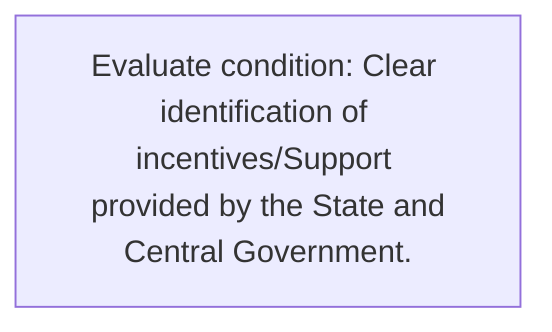
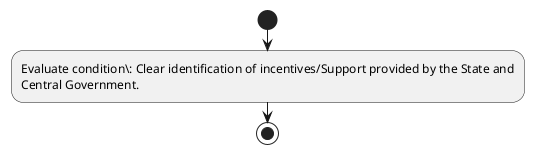

# Chapter 3 / Section 8: Clear identification of incentives/Support provided by the State and

**Chapter Title:** Developing Districts as Export Hubs

**Pages:** 5

**Purpose:** Defines the operational requirements for Clear identification of incentives/Support provided by the State and.

**Purpose Thanglish:** Indha Clear identification of incentives/Support provided by the State and section-la, Defines the operational requirements for Clear identification of incentives/Support provided by the State and.

**Summary:** 8. Clear identification of incentives/Support provided by the State and
Central Government.

**Business Meaning:** 8.

**Business Explanation:** 8. Clear identification of incentives/Support provided by the State and
Central Government.

**Business Explanation Thanglish:** Indha Clear identification of incentives/Support provided by the State and section-la, 8. Clear identification of incentives/Support provided by the State and
Central Government.

## Business Logic
- None identified

## Business Rules
- rule_id=CH3-SEC8-R001, rule_description=8. Clear identification of incentives/Support provided by the State and
Central Government., trigger=Clear identification of incentives/Support provided by the State and, condition=Clear identification of incentives/Support provided by the State and
Central Government., validation=Not explicitly covered in uploaded documents., action=Manual review required., exception=No explicit exception found in uploaded documents., output=DEKAI should produce a compliance decision for 8 - Clear identification of incentives/Support provided by the State and.

## Conditions
- Clear identification of incentives/Support provided by the State and
Central Government.

## Condition Logic
- id=3.8.1, if=Clear identification of incentives/Support provided by the State and
Central Government., then=Route for review, source=Clear identification of incentives/Support provided by the State and
Central Government.

## Validations
- None identified

## Exceptions
- None identified

## Dependencies
- None identified

## Authorities
- Central Government

## Required Documents
- None identified

## Timelines
- None identified

## Actions
- None identified

## Workflow
- Evaluate condition: Clear identification of incentives/Support provided by the State and
Central Government.

## Workflow ASCII
```text
Clear identification of incentives/Support provided by the State and
Evaluate condition: Clear identification of incentives/Support provided by the State and
Central Government.
```

## Decision Tree
- IF section 8 applies THEN proceed with standard DGFT workflow

## Decision Tree ASCII
```text
Clear identification of incentives/Support provided by the State and Decision
IF section 8 applies THEN proceed with standard DGFT workflow
```

## Examples
- User asks to process Clear identification of incentives/Support provided by the State and; the platform checks conditions, validations, and documents before action.

**Real-world Example:** Example: an importer or exporter invokes Clear identification of incentives/Support provided by the State and, submits the prescribed DGFT records, and DEKAI uses the extracted rules to follow the clear identification of incentives/support provided by the state and process.

**Real-world Example Thanglish:** Indha Clear identification of incentives/Support provided by the State and section-la, Example: an importer or exporter invokes Clear identification of incentives/Support provided by the State and, submits the prescribed DGFT records, and DEKAI uses the extracted rules to follow the clear identification of incentives/support provided by the state and process.

## AI Rules
- None identified

## Database Fields
- name=section_code, type=string, required=True, source=parsed_section_heading
- name=section_title, type=string, required=True, source=parsed_section_heading
- name=the_flag, type=boolean, required=False, source=keyword:the
- name=and_flag, type=boolean, required=False, source=keyword:and
- name=clear_flag, type=boolean, required=False, source=keyword:Clear
- name=state_flag, type=boolean, required=False, source=keyword:State
- name=central_flag, type=boolean, required=False, source=keyword:Central
- name=provided_flag, type=boolean, required=False, source=keyword:provided
- name=government_flag, type=boolean, required=False, source=keyword:Government
- name=identification_flag, type=boolean, required=False, source=keyword:identification

## API Requirements
- method=GET, path=/api/dgft/sections/8, purpose=Retrieve knowledge payload for section 8, query_params=['include=workflow,decision_tree,validations'], response_fields=['section', 'title', 'summary', 'conditions', 'validations', 'exceptions', 'workflow', 'decision_tree']
- method=POST, path=/api/dgft/Clear-identification-of-incentives-Support-provided-by-the-State-and/validate, purpose=Validate inputs and documents for Clear identification of incentives/Support provided by the State and, request_fields=['section_code', 'section_title'], response_fields=['status', 'errors', 'warnings', 'next_actions']

## UI Screens
- screen_id=Clear_identification_of_incentives_Support_provided_by_the_State_and_overview, name=Clear identification of incentives/Support provided by the State and Overview, purpose=Show section summary, authority, timeline, and eligibility cues., widgets=['summary_card', 'conditions_table', 'authority_badges', 'timeline_panel']
- screen_id=Clear_identification_of_incentives_Support_provided_by_the_State_and_submission, name=Clear identification of incentives/Support provided by the State and Submission, purpose=Capture applicant data and supporting documents., widgets=['dynamic_form', 'document_uploader', 'validation_panel', 'next_action_footer'], fields=['section_code', 'section_title', 'the_flag', 'and_flag', 'clear_flag', 'state_flag', 'central_flag', 'provided_flag']

## Error Messages
- Validation failed because the section requirements were not fully met.

## FAQ
- question_en=What is the purpose of section 8?, answer_en=8. Clear identification of incentives/Support provided by the State and
Central Government., question_thanglish=Indha Clear identification of incentives/Support provided by the State and section-la, What is the purpose of section 8?, answer_thanglish=Indha Clear identification of incentives/Support provided by the State and section-la, 8. Clear identification of incentives/Support provided by the State and
Central Government.
- question_en=What documents are required under Clear identification of incentives/Support provided by the State and?, answer_en=Not explicitly covered in uploaded documents., question_thanglish=Indha Clear identification of incentives/Support provided by the State and section-la, What documents are required under Clear identification of incentives/Support provided by the State and?, answer_thanglish=Indha Clear identification of incentives/Support provided by the State and section-la, Not explicitly covered in uploaded documents.
- question_en=Which authority handles Clear identification of incentives/Support provided by the State and?, answer_en=Central Government, question_thanglish=Indha Clear identification of incentives/Support provided by the State and section-la, Which authority handles Clear identification of incentives/Support provided by the State and?, answer_thanglish=Indha Clear identification of incentives/Support provided by the State and section-la, Central Government

## Questions Users May Ask
- What does Clear identification of incentives/Support provided by the State and require?
- Which documents are needed for Clear identification of incentives/Support provided by the State and?
- How does DEKAI validate Clear identification of incentives/Support provided by the State and requests?

## Expected AI Answers
- Clear identification of incentives/Support provided by the State and requires the platform to interpret the section text, apply the extracted business rules, and present the correct next action.
- Required documents are inferred from the section text: no explicit documents were detected.
- DEKAI validates Clear identification of incentives/Support provided by the State and by checking conditions, required documents, authority references, and exception clauses before recommending an outcome.

## AI Q&A Examples
- question_en=User asks: How do I comply with Clear identification of incentives/Support provided by the State and?, answer_en=AI answers: DEKAI should evaluate section 8, apply the extracted rules, and guide the user through Evaluate condition: Clear identification of incentives/Support provided by the State and
Central Government.., question_thanglish=Indha Clear identification of incentives/Support provided by the State and section-la, User asks: How do I comply with Clear identification of incentives/Support provided by the State and?, answer_thanglish=Indha Clear identification of incentives/Support provided by the State and section-la, AI answers: DEKAI should evaluate section 8, apply the extracted rules, and guide the user through Evaluate condition: Clear identification of incentives/Support provided by the State and
Central Government..
- question_en=User asks: Which validations apply to Clear identification of incentives/Support provided by the State and?, answer_en=AI answers: Applicable validations are not explicitly covered in the uploaded documents., question_thanglish=Indha Clear identification of incentives/Support provided by the State and section-la, User asks: Which validations apply to Clear identification of incentives/Support provided by the State and?, answer_thanglish=Indha Clear identification of incentives/Support provided by the State and section-la, AI answers: Applicable validations are not explicitly covered in the uploaded documents.

## DEKAI AI Implementation Notes
- Capture chapter 3, section 8, title, and page references as immutable knowledge metadata.
- Bind validations for Clear identification of incentives/Support provided by the State and into a rule engine keyed by the rule IDs extracted for this section.
- Route escalations or approvals to: Central Government.

## DEKAI AI Implementation Notes Thanglish
- Indha Clear identification of incentives/Support provided by the State and section-la, Capture chapter 3, section 8, title, and page references as immutable knowledge metadata.
- Indha Clear identification of incentives/Support provided by the State and section-la, Bind validations for Clear identification of incentives/Support provided by the State and into a rule engine keyed by the rule IDs extracted for this section.
- Indha Clear identification of incentives/Support provided by the State and section-la, Route escalations or approvals to: Central Government.

## AI Metadata
- Keywords: the, and, Clear, State, Central, provided, Government, identification, incentives/Support
- Search Keywords: the, and, Clear, State, Central, provided, Government, identification, incentives/Support
- Intent: Provide knowledge guidance for Clear identification of incentives/Support provided by the State and.
- Tags: 8, Clear identification of incentives/Support provided by the State and, dgft
- Related Sections: 
- Related Chapters: 
- Related Rules: 

## Mermaid


## PlantUML

