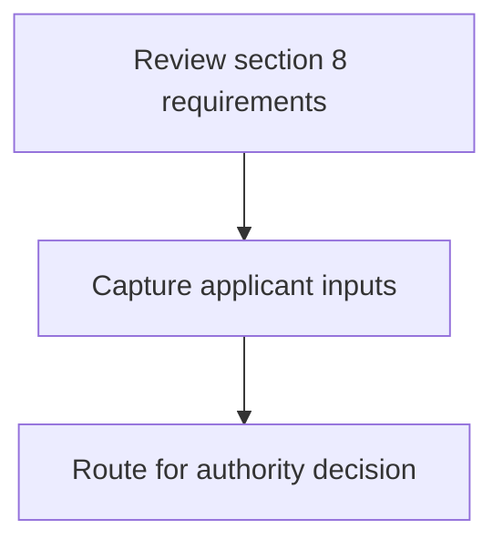
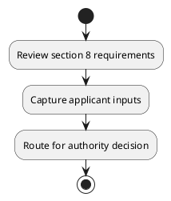

# Chapter 3 / Section 8: Dissemination of information through trainings, seminars, guest lectures,

**Chapter Title:** Developing Districts as Export Hubs

**Pages:** 4

**Purpose:** Defines the operational requirements for Dissemination of information through trainings, seminars, guest lectures,.

**Purpose Thanglish:** Indha Dissemination of information through trainings, seminars, guest lectures, section-la, Defines the operational requirements for Dissemination of information through trainings, seminars, guest lectures,.

**Summary:** 8. Dissemination of information through trainings, seminars, guest lectures,
practical training, and exchange visits with other Districts of excellence.

**Business Meaning:** 8.

**Business Explanation:** 8. Dissemination of information through trainings, seminars, guest lectures,
practical training, and exchange visits with other Districts of excellence.

**Business Explanation Thanglish:** Indha Dissemination of information through trainings, seminars, guest lectures, section-la, 8. Dissemination of information through trainings, seminars, guest lectures,
practical training, and exchange visits with other Districts of excellence.

## Business Logic
- None identified

## Business Rules
- rule_id=CH3-SEC8-R001, rule_description=8. Dissemination of information through trainings, seminars, guest lectures,
practical training, and exchange visits with other Districts of excellence., trigger=Dissemination of information through trainings, seminars, guest lectures,, condition=Not explicitly covered in uploaded documents., validation=Not explicitly covered in uploaded documents., action=Manual review required., exception=No explicit exception found in uploaded documents., output=DEKAI should produce a compliance decision for 8 - Dissemination of information through trainings, seminars, guest lectures,.

## Conditions
- None identified

## Condition Logic
- None identified

## Validations
- None identified

## Exceptions
- None identified

## Dependencies
- None identified

## Authorities
- None identified

## Required Documents
- None identified

## Timelines
- None identified

## Actions
- None identified

## Workflow
- Review section 8 requirements
- Capture applicant inputs
- Route for authority decision

## Workflow ASCII
```text
Dissemination of information through trainings, seminars, guest lectures,
Review section 8 requirements
   |
   v
Capture applicant inputs
   |
   v
Route for authority decision
```

## Decision Tree
- IF section 8 applies THEN proceed with standard DGFT workflow

## Decision Tree ASCII
```text
Dissemination of information through trainings, seminars, guest lectures, Decision
IF section 8 applies THEN proceed with standard DGFT workflow
```

## Examples
- User asks to process Dissemination of information through trainings, seminars, guest lectures,; the platform checks conditions, validations, and documents before action.

**Real-world Example:** Example: an importer or exporter invokes Dissemination of information through trainings, seminars, guest lectures,, submits the prescribed DGFT records, and DEKAI uses the extracted rules to follow the dissemination of information through trainings, seminars, guest lectures, process.

**Real-world Example Thanglish:** Indha Dissemination of information through trainings, seminars, guest lectures, section-la, Example: an importer or exporter invokes Dissemination of information through trainings, seminars, guest lectures,, submits the prescribed DGFT records, and DEKAI uses the extracted rules to follow the dissemination of information through trainings, seminars, guest lectures, process.

## AI Rules
- None identified

## Database Fields
- name=section_code, type=string, required=True, source=parsed_section_heading
- name=section_title, type=string, required=True, source=parsed_section_heading
- name=and_flag, type=boolean, required=False, source=keyword:and
- name=with_flag, type=boolean, required=False, source=keyword:with
- name=guest_flag, type=boolean, required=False, source=keyword:guest
- name=other_flag, type=boolean, required=False, source=keyword:other
- name=visits_flag, type=boolean, required=False, source=keyword:visits
- name=through_flag, type=boolean, required=False, source=keyword:through
- name=seminars_flag, type=boolean, required=False, source=keyword:seminars
- name=lectures_flag, type=boolean, required=False, source=keyword:lectures

## API Requirements
- method=GET, path=/api/dgft/sections/8, purpose=Retrieve knowledge payload for section 8, query_params=['include=workflow,decision_tree,validations'], response_fields=['section', 'title', 'summary', 'conditions', 'validations', 'exceptions', 'workflow', 'decision_tree']
- method=POST, path=/api/dgft/Dissemination-of-information-through-trainings-seminars-guest-lectures/validate, purpose=Validate inputs and documents for Dissemination of information through trainings, seminars, guest lectures,, request_fields=['section_code', 'section_title'], response_fields=['status', 'errors', 'warnings', 'next_actions']

## UI Screens
- screen_id=Dissemination_of_information_through_trainings_seminars_guest_lectures_overview, name=Dissemination of information through trainings, seminars, guest lectures, Overview, purpose=Show section summary, authority, timeline, and eligibility cues., widgets=['summary_card', 'conditions_table', 'authority_badges', 'timeline_panel']
- screen_id=Dissemination_of_information_through_trainings_seminars_guest_lectures_submission, name=Dissemination of information through trainings, seminars, guest lectures, Submission, purpose=Capture applicant data and supporting documents., widgets=['dynamic_form', 'document_uploader', 'validation_panel', 'next_action_footer'], fields=['section_code', 'section_title', 'and_flag', 'with_flag', 'guest_flag', 'other_flag', 'visits_flag', 'through_flag']

## Error Messages
- Validation failed because the section requirements were not fully met.

## FAQ
- question_en=What is the purpose of section 8?, answer_en=8. Dissemination of information through trainings, seminars, guest lectures,
practical training, and exchange visits with other Districts of excellence., question_thanglish=Indha Dissemination of information through trainings, seminars, guest lectures, section-la, What is the purpose of section 8?, answer_thanglish=Indha Dissemination of information through trainings, seminars, guest lectures, section-la, 8. Dissemination of information through trainings, seminars, guest lectures,
practical training, and exchange visits with other Districts of excellence.
- question_en=What documents are required under Dissemination of information through trainings, seminars, guest lectures,?, answer_en=Not explicitly covered in uploaded documents., question_thanglish=Indha Dissemination of information through trainings, seminars, guest lectures, section-la, What documents are required under Dissemination of information through trainings, seminars, guest lectures,?, answer_thanglish=Indha Dissemination of information through trainings, seminars, guest lectures, section-la, Not explicitly covered in uploaded documents.
- question_en=Which authority handles Dissemination of information through trainings, seminars, guest lectures,?, answer_en=Not explicitly covered in uploaded documents., question_thanglish=Indha Dissemination of information through trainings, seminars, guest lectures, section-la, Which authority handles Dissemination of information through trainings, seminars, guest lectures,?, answer_thanglish=Indha Dissemination of information through trainings, seminars, guest lectures, section-la, Not explicitly covered in uploaded documents.

## Questions Users May Ask
- What does Dissemination of information through trainings, seminars, guest lectures, require?
- Which documents are needed for Dissemination of information through trainings, seminars, guest lectures,?
- How does DEKAI validate Dissemination of information through trainings, seminars, guest lectures, requests?

## Expected AI Answers
- Dissemination of information through trainings, seminars, guest lectures, requires the platform to interpret the section text, apply the extracted business rules, and present the correct next action.
- Required documents are inferred from the section text: no explicit documents were detected.
- DEKAI validates Dissemination of information through trainings, seminars, guest lectures, by checking conditions, required documents, authority references, and exception clauses before recommending an outcome.

## AI Q&A Examples
- question_en=User asks: How do I comply with Dissemination of information through trainings, seminars, guest lectures,?, answer_en=AI answers: DEKAI should evaluate section 8, apply the extracted rules, and guide the user through Review section 8 requirements., question_thanglish=Indha Dissemination of information through trainings, seminars, guest lectures, section-la, User asks: How do I comply with Dissemination of information through trainings, seminars, guest lectures,?, answer_thanglish=Indha Dissemination of information through trainings, seminars, guest lectures, section-la, AI answers: DEKAI should evaluate section 8, apply the extracted rules, and guide the user through Review section 8 requirements.
- question_en=User asks: Which validations apply to Dissemination of information through trainings, seminars, guest lectures,?, answer_en=AI answers: Applicable validations are not explicitly covered in the uploaded documents., question_thanglish=Indha Dissemination of information through trainings, seminars, guest lectures, section-la, User asks: Which validations apply to Dissemination of information through trainings, seminars, guest lectures,?, answer_thanglish=Indha Dissemination of information through trainings, seminars, guest lectures, section-la, AI answers: Applicable validations are not explicitly covered in the uploaded documents.

## DEKAI AI Implementation Notes
- Capture chapter 3, section 8, title, and page references as immutable knowledge metadata.
- Bind validations for Dissemination of information through trainings, seminars, guest lectures, into a rule engine keyed by the rule IDs extracted for this section.

## DEKAI AI Implementation Notes Thanglish
- Indha Dissemination of information through trainings, seminars, guest lectures, section-la, Capture chapter 3, section 8, title, and page references as immutable knowledge metadata.
- Indha Dissemination of information through trainings, seminars, guest lectures, section-la, Bind validations for Dissemination of information through trainings, seminars, guest lectures, into a rule engine keyed by the rule IDs extracted for this section.

## AI Metadata
- Keywords: and, with, guest, other, visits, through, seminars, lectures, training, exchange, trainings, practical, Districts, excellence, information, Dissemination
- Search Keywords: and, with, guest, other, visits, through, seminars, lectures, training, exchange, trainings, practical, Districts, excellence, information, Dissemination
- Intent: Provide knowledge guidance for Dissemination of information through trainings, seminars, guest lectures,.
- Tags: 8, Dissemination of information through trainings, seminars, guest lectures,, dgft
- Related Sections: 
- Related Chapters: 
- Related Rules: 

## Mermaid


## PlantUML

