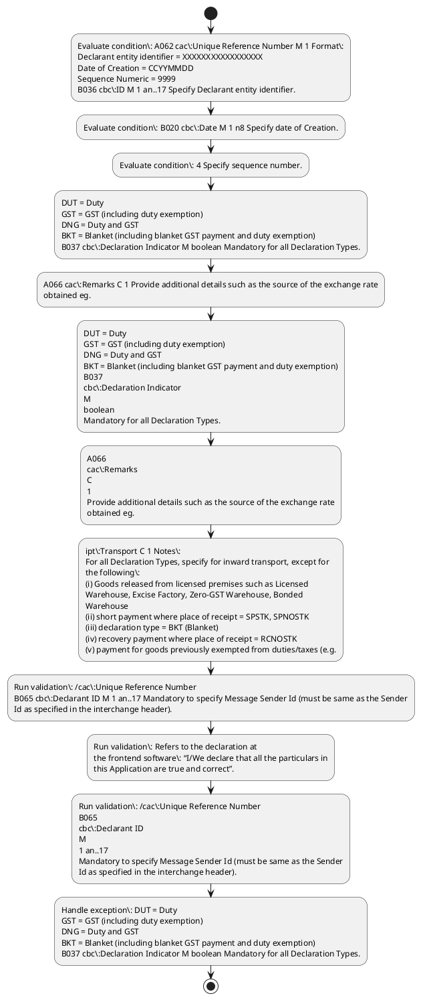

# Chapter  / Section 8: MESSAGE DETAILS

**Chapter Title:** TradeNetDeclaration.IPTDEC Ver2.1 (2)

**Pages:** 9, 10, 11

**Purpose:** Defines the operational requirements for MESSAGE DETAILS.

**Purpose Thanglish:** Indha MESSAGE DETAILS section-la, Defines the operational requirements for MESSAGE DETAILS.

**Summary:** 8. MESSAGE DETAILS
User defined
Ref Tag name S R Repr Remarks
HEADER SECTION
ipt:Header M 1
B045 cbc:Message Reference M 1 an..14 Sender unique message reference. Sequence number of messages in the
interchange (Sender generated).

**Business Meaning:** MESSAGE DETAILS governs how DGFT business controls should be applied, validated, and enforced.

**Business Explanation:** MESSAGE DETAILS explains the operating rule set that DEKAI should enforce. Key control points include /cac:Unique Reference Number
B065 cbc:Declarant ID M 1 an..17 Mandatory to specify Message Sender Id (must be same as the Sender
Id as specified in the interchange header). The section also drives actions such as DUT = Duty
GST = GST (including duty exemption)
DNG = Duty and GST
BKT = Blanket (including blanket GST payment and duty exemption)
B037 cbc:Declaration Indicator M boolean Mandatory for all Declaration Types..

**Business Explanation Thanglish:** Indha MESSAGE DETAILS section-la, MESSAGE DETAILS explains the operating rule set that DEKAI should enforce. Key control points include /cac:Unique Reference Number
B065 cbc:Declarant ID M 1 an..17 Mandatory to specify Message Sender Id (must be same as the Sender
Id as specified in the interchange header). The section also drives actions such as DUT = Duty
GST = GST (including duty exemption)
DNG = Duty and GST
BKT = Blanket (including blanket GST payment and duty exemption)
B037 cbc:Declaration Indicator M boolean Mandatory for all Declaration Types..

## Business Logic
- /cac:Unique Reference Number
B065 cbc:Declarant ID M 1 an..17 Mandatory to specify Message Sender Id (must be same as the Sender
Id as specified in the interchange header).
- /cac:Unique Reference Number
B065
cbc:Declarant ID
M
1 an..17
Mandatory to specify Message Sender Id (must be same as the Sender
Id as specified in the interchange header).

## Business Rules
- rule_id=CH-SEC8-R001, rule_description=/cac:Unique Reference Number
B065 cbc:Declarant ID M 1 an..17 Mandatory to specify Message Sender Id (must be same as the Sender
Id as specified in the interchange header)., trigger=MESSAGE DETAILS, condition=A062 cac:Unique Reference Number M 1 Format:
Declarant entity identifier = XXXXXXXXXXXXXXXXX
Date of Creation = CCYYMMDD
Sequence Numeric = 9999
B036 cbc:ID M 1 an..17 Specify Declarant entity identifier., validation=/cac:Unique Reference Number
B065 cbc:Declarant ID M 1 an..17 Mandatory to specify Message Sender Id (must be same as the Sender
Id as specified in the interchange header)., action=DUT = Duty
GST = GST (including duty exemption)
DNG = Duty and GST
BKT = Blanket (including blanket GST payment and duty exemption)
B037 cbc:Declaration Indicator M boolean Mandatory for all Declaration Types., exception=DUT = Duty
GST = GST (including duty exemption)
DNG = Duty and GST
BKT = Blanket (including blanket GST payment and duty exemption)
B037 cbc:Declaration Indicator M boolean Mandatory for all Declaration Types., output=DEKAI should produce a compliance decision for 8 - MESSAGE DETAILS.
- rule_id=CH-SEC8-R002, rule_description=/cac:Unique Reference Number
B065
cbc:Declarant ID
M
1 an..17
Mandatory to specify Message Sender Id (must be same as the Sender
Id as specified in the interchange header)., trigger=MESSAGE DETAILS, condition=B020 cbc:Date M 1 n8 Specify date of Creation., validation=Refers to the declaration at
the frontend software: “I/We declare that all the particulars in
this Application are true and correct”., action=A066 cac:Remarks C 1 Provide additional details such as the source of the exchange rate
obtained eg., exception=DUT = Duty
GST = GST (including duty exemption)
DNG = Duty and GST
BKT = Blanket (including blanket GST payment and duty exemption)
B037
cbc:Declaration Indicator
M
boolean
Mandatory for all Declaration Types., output=DEKAI should produce a compliance decision for 8 - MESSAGE DETAILS.

## Conditions
- A062 cac:Unique Reference Number M 1 Format:
Declarant entity identifier = XXXXXXXXXXXXXXXXX
Date of Creation = CCYYMMDD
Sequence Numeric = 9999
B036 cbc:ID M 1 an..17 Specify Declarant entity identifier.
- B020 cbc:Date M 1 n8 Specify date of Creation.
- 4 Specify sequence number.
- /cac:Unique Reference Number
B065 cbc:Declarant ID M 1 an..17 Mandatory to specify Message Sender Id (must be same as the Sender
Id as specified in the interchange header).
- B083 cbc:Common Access Reference M 1 an..7 IPTDEC
B021 cbc:Declaration Type M 1 an..7 Specify Declaration Type eg.
- B064 cbc:Previous Permit Number C 1 an..35 Specify previous Permit Number if applicable.
- bank, tel, date, etc if currency code is not on Customs
Exchange Rate List.
- B034 cbc:Free Text M 2 an..512 Specify general/trader’s remarks.
- /cac:Remarks
B065 cbc:Additional Recipient ID C 3 an..17 Repeat at most 3 times for additional Recipient (for the purpose of
Trade Net Declaration.IPTDEC Ver2.1.doc Message Specification XML (IPTDEC)
OFFICIAL (CLOSED)
Prepared by:
TDS41-MDS-XML-IPTDEC-M
Ref Tag name | User defined
S R Repr | Remarks
HEADER SECTION | |
| ipt:Header |
OFFICIAL (CLOSED)
TRADENET MESSAGE
18/11/2021 11:10
AM
Prepared by:
For:
Release Date
18/11/2021
Ver
4.1
Reference
TRADENET
Document Id.
- A062
cac:Unique Reference Number
M
1
Format:
Declarant entity identifier = XXXXXXXXXXXXXXXXX
Date of Creation = CCYYMMDD
Sequence Numeric = 9999
B036
cbc:ID
M
1 an..17
Specify Declarant entity identifier.
- B020
cbc:Date
M
1 n8
Specify date of Creation.
- 4
Specify sequence number.
- /cac:Unique Reference Number
B065
cbc:Declarant ID
M
1 an..17
Mandatory to specify Message Sender Id (must be same as the Sender
Id as specified in the interchange header).
- B083
cbc:Common Access Reference
M
1 an..7
IPTDEC
B021
cbc:Declaration Type
M
1 an..7
Specify Declaration Type eg.
- B064
cbc:Previous Permit Number
C
1 an..35
Specify previous Permit Number if applicable.
- B034
cbc:Free Text
M
2 an..512
Specify general/trader’s remarks.
- B007 cbc:Banker Guarantee Code C 1 an..3 Specify BG indicator (if any).
- B089 cbc:Customs Procedure Code M 1 an..7 Specify Customs Procedure Code (CPC).
- B057 cbc:Processing Code One M 1 an..35 Specify processing code 1.
- B057 cbc:Processing Code Two C 1 an..35 Specify processing code 2.
- B057 cbc:Processing Code Three C 1 an..35 Specify processing code 3.
- /cac:CPCProcessing Code
/cac:Customs Procedure Code Information
ipt:Cargo M 1
B009 cbc:Cargo Packing Type M 1 an..3 Specify Cargo Packing Type (refer to STDID Code List).
- A032 cac:Release Location M 1 Specify Place of Release.
- B039 cbc:Location Code M 1 an..7 Specify location code (refer to STDID Code Lists).
- B040 cbc:Location Name C 1 an..256 Specify name and/address of location if the location code = SY
(shipyard) or SC (sailing club) or O (others).
- /cac:Release Location
A032 cac:Receipt Location M 1 Specify Place of Receipt.
- 5 Specify sequence number.
- B027 cbc:Equipment ID M 1 an..13 Specify container number.
- B069 cbc:Size Type Code M 1 an5 Specify container type and size using the following valid codes:
FCL20
FCL40
FCL45
LCL20
LCL40
LCL45
where:
FCL: Full Container Load
LCL: Less Than Container Load
B028 cbc:Equipment Weight Measure Numeric M 1 n..
- 3 Specify container weight (TNE).
- A058 cac:Transport Equipment Seal M 1 Specify the shipper seal number affixed to the container at the time
of arrival.
- B067 cbc:Seal ID M 1 an..35 Specify shipper seal number.
- /cac:Transport Equipment Seal
Trade Net Declaration.IPTDEC Ver2.1.doc Message Specification XML (IPTDEC)
OFFICIAL (CLOSED)
Prepared by:
TDS41-MDS-XML-IPTDEC-M
| ipt:Cargo |
OFFICIAL (CLOSED)
TRADENET MESSAGE
18/11/2021 11:10
AM
Prepared by:
For:
Release Date
18/11/2021
Ver
4.1
Reference
TRADENET
Document Id.
- B007
cbc:Banker Guarantee Code
C
1 an..3
Specify BG indicator (if any).
- B089
cbc:Customs Procedure Code
M
1 an..7
Specify Customs Procedure Code (CPC).
- B057
cbc:Processing Code One
M
1 an..35
Specify processing code 1.
- B057
cbc:Processing Code Two
C
1 an..35
Specify processing code 2.
- B057
cbc:Processing Code Three
C
1 an..35
Specify processing code 3.
- /cac:CPCProcessing Code
/cac:Customs Procedure Code Information
ipt:Cargo
M
1
B009
cbc:Cargo Packing Type
M
1 an..3
Specify Cargo Packing Type (refer to STDID Code List).
- A032
cac:Release Location
M
1
Specify Place of Release.
- B039
cbc:Location Code
M
1 an..7
Specify location code (refer to STDID Code Lists).
- B040
cbc:Location Name
C
1 an..256
Specify name and/address of location if the location code = SY
(shipyard) or SC (sailing club) or O (others).
- /cac:Release Location
A032
cac:Receipt Location
M
1
Specify Place of Receipt.
- 5
Specify sequence number.
- B027
cbc:Equipment ID
M
1 an..13
Specify container number.
- B069
cbc:Size Type Code
M
1 an5
Specify container type and size using the following valid codes:
FCL20
FCL40
FCL45
LCL20
LCL40
LCL45
where:
FCL: Full Container Load
LCL: Less Than Container Load
B028
cbc:Equipment Weight Measure Numeric
M
1 n..
- 3
Specify container weight (TNE).
- A058
cac:Transport Equipment Seal
M
1
Specify the shipper seal number affixed to the container at the time
of arrival.
- B067
cbc:Seal ID
M
1 an..35
Specify shipper seal number.
- /cac:Transport Equipment Seal
OFFICIAL (CLOSED)
AM
/cac:Transport Equipment
B037 cbc:Supply Indicator C 1 boolean Specify Supply Indicator for:
a) all dutiable goods of Singapore origin released from Licensed
Warehouse, if there is a supply.
- b) all imported goods where there is a supply prior to its release
from Customs' control.
- B020 cbc:Blanket Start Date C 1 n8 Format: CCYYMMDD
For blanket imports, specify Start Date of Blanket.
- ipt:Transport C 1 Notes:
For all Declaration Types, specify for inward transport, except for
the following:
(i) Goods released from licensed premises such as Licensed
Warehouse, Excise Factory, Zero-GST Warehouse, Bonded
Warehouse
(ii) short payment where place of receipt = SPSTK, SPNOSTK
(iii) declaration type = BKT (Blanket)
(iv) recovery payment where place of receipt = RCNOSTK
(v) payment for goods previously exempted from duties/taxes (e.g.
- place of release = EM, EXEMPT)
(vi) Supplementary declaration for schemes under AISS, IGDS such as
Place of Receipt = AISSLOC, SPIGDS
A026 cac:Inward Transport M 1 Mandatory to specify Inward transport.
- A060 cac:Transport Means C 1 Specify inward transport mode.

## Condition Logic
- id=.8.1, if=A062 cac:Unique Reference Number M 1 Format:
Declarant entity identifier = XXXXXXXXXXXXXXXXX
Date of Creation = CCYYMMDD
Sequence Numeric = 9999
B036 cbc:ID M 1 an..17 Specify Declarant entity identifier., then=DUT = Duty
GST = GST (including duty exemption)
DNG = Duty and GST
BKT = Blanket (including blanket GST payment and duty exemption)
B037 cbc:Declaration Indicator M boolean Mandatory for all Declaration Types., source=A062 cac:Unique Reference Number M 1 Format:
Declarant entity identifier = XXXXXXXXXXXXXXXXX
Date of Creation = CCYYMMDD
Sequence Numeric = 9999
B036 cbc:ID M 1 an..17 Specify Declarant entity identifier.
- id=.8.2, if=B020 cbc:Date M 1 n8 Specify date of Creation., then=DUT = Duty
GST = GST (including duty exemption)
DNG = Duty and GST
BKT = Blanket (including blanket GST payment and duty exemption)
B037 cbc:Declaration Indicator M boolean Mandatory for all Declaration Types., source=B020 cbc:Date M 1 n8 Specify date of Creation.
- id=.8.3, if=4 Specify sequence number., then=DUT = Duty
GST = GST (including duty exemption)
DNG = Duty and GST
BKT = Blanket (including blanket GST payment and duty exemption)
B037 cbc:Declaration Indicator M boolean Mandatory for all Declaration Types., source=4 Specify sequence number.
- id=.8.4, if=/cac:Unique Reference Number
B065 cbc:Declarant ID M 1 an..17 Mandatory to specify Message Sender Id (must be same as the Sender
Id as specified in the interchange header)., then=DUT = Duty
GST = GST (including duty exemption)
DNG = Duty and GST
BKT = Blanket (including blanket GST payment and duty exemption)
B037 cbc:Declaration Indicator M boolean Mandatory for all Declaration Types., source=/cac:Unique Reference Number
B065 cbc:Declarant ID M 1 an..17 Mandatory to specify Message Sender Id (must be same as the Sender
Id as specified in the interchange header).
- id=.8.5, if=B083 cbc:Common Access Reference M 1 an..7 IPTDEC
B021 cbc:Declaration Type M 1 an..7 Specify Declaration Type eg., then=DUT = Duty
GST = GST (including duty exemption)
DNG = Duty and GST
BKT = Blanket (including blanket GST payment and duty exemption)
B037 cbc:Declaration Indicator M boolean Mandatory for all Declaration Types., source=B083 cbc:Common Access Reference M 1 an..7 IPTDEC
B021 cbc:Declaration Type M 1 an..7 Specify Declaration Type eg.
- id=.8.6, if=B064 cbc:Previous Permit Number C 1 an..35 Specify previous Permit Number if applicable., then=DUT = Duty
GST = GST (including duty exemption)
DNG = Duty and GST
BKT = Blanket (including blanket GST payment and duty exemption)
B037 cbc:Declaration Indicator M boolean Mandatory for all Declaration Types., source=B064 cbc:Previous Permit Number C 1 an..35 Specify previous Permit Number if applicable.
- id=.8.7, if=bank, tel, date, etc if currency code is not on Customs
Exchange Rate List., then=DUT = Duty
GST = GST (including duty exemption)
DNG = Duty and GST
BKT = Blanket (including blanket GST payment and duty exemption)
B037 cbc:Declaration Indicator M boolean Mandatory for all Declaration Types., source=bank, tel, date, etc if currency code is not on Customs
Exchange Rate List.
- id=.8.8, if=B034 cbc:Free Text M 2 an..512 Specify general/trader’s remarks., then=DUT = Duty
GST = GST (including duty exemption)
DNG = Duty and GST
BKT = Blanket (including blanket GST payment and duty exemption)
B037 cbc:Declaration Indicator M boolean Mandatory for all Declaration Types., source=B034 cbc:Free Text M 2 an..512 Specify general/trader’s remarks.
- id=.8.9, if=/cac:Remarks
B065 cbc:Additional Recipient ID C 3 an..17 Repeat at most 3 times for additional Recipient (for the purpose of
Trade Net Declaration.IPTDEC Ver2.1.doc Message Specification XML (IPTDEC)
OFFICIAL (CLOSED)
Prepared by:
TDS41-MDS-XML-IPTDEC-M
Ref Tag name | User defined
S R Repr | Remarks
HEADER SECTION | |
| ipt:Header |
OFFICIAL (CLOSED)
TRADENET MESSAGE
18/11/2021 11:10
AM
Prepared by:
For:
Release Date
18/11/2021
Ver
4.1
Reference
TRADENET
Document Id., then=DUT = Duty
GST = GST (including duty exemption)
DNG = Duty and GST
BKT = Blanket (including blanket GST payment and duty exemption)
B037 cbc:Declaration Indicator M boolean Mandatory for all Declaration Types., source=/cac:Remarks
B065 cbc:Additional Recipient ID C 3 an..17 Repeat at most 3 times for additional Recipient (for the purpose of
Trade Net Declaration.IPTDEC Ver2.1.doc Message Specification XML (IPTDEC)
OFFICIAL (CLOSED)
Prepared by:
TDS41-MDS-XML-IPTDEC-M
Ref Tag name | User defined
S R Repr | Remarks
HEADER SECTION | |
| ipt:Header |
OFFICIAL (CLOSED)
TRADENET MESSAGE
18/11/2021 11:10
AM
Prepared by:
For:
Release Date
18/11/2021
Ver
4.1
Reference
TRADENET
Document Id.
- id=.8.10, if=A062
cac:Unique Reference Number
M
1
Format:
Declarant entity identifier = XXXXXXXXXXXXXXXXX
Date of Creation = CCYYMMDD
Sequence Numeric = 9999
B036
cbc:ID
M
1 an..17
Specify Declarant entity identifier., then=DUT = Duty
GST = GST (including duty exemption)
DNG = Duty and GST
BKT = Blanket (including blanket GST payment and duty exemption)
B037 cbc:Declaration Indicator M boolean Mandatory for all Declaration Types., source=A062
cac:Unique Reference Number
M
1
Format:
Declarant entity identifier = XXXXXXXXXXXXXXXXX
Date of Creation = CCYYMMDD
Sequence Numeric = 9999
B036
cbc:ID
M
1 an..17
Specify Declarant entity identifier.
- id=.8.11, if=B020
cbc:Date
M
1 n8
Specify date of Creation., then=DUT = Duty
GST = GST (including duty exemption)
DNG = Duty and GST
BKT = Blanket (including blanket GST payment and duty exemption)
B037 cbc:Declaration Indicator M boolean Mandatory for all Declaration Types., source=B020
cbc:Date
M
1 n8
Specify date of Creation.
- id=.8.12, if=4
Specify sequence number., then=DUT = Duty
GST = GST (including duty exemption)
DNG = Duty and GST
BKT = Blanket (including blanket GST payment and duty exemption)
B037 cbc:Declaration Indicator M boolean Mandatory for all Declaration Types., source=4
Specify sequence number.
- id=.8.13, if=/cac:Unique Reference Number
B065
cbc:Declarant ID
M
1 an..17
Mandatory to specify Message Sender Id (must be same as the Sender
Id as specified in the interchange header)., then=DUT = Duty
GST = GST (including duty exemption)
DNG = Duty and GST
BKT = Blanket (including blanket GST payment and duty exemption)
B037 cbc:Declaration Indicator M boolean Mandatory for all Declaration Types., source=/cac:Unique Reference Number
B065
cbc:Declarant ID
M
1 an..17
Mandatory to specify Message Sender Id (must be same as the Sender
Id as specified in the interchange header).
- id=.8.14, if=B083
cbc:Common Access Reference
M
1 an..7
IPTDEC
B021
cbc:Declaration Type
M
1 an..7
Specify Declaration Type eg., then=DUT = Duty
GST = GST (including duty exemption)
DNG = Duty and GST
BKT = Blanket (including blanket GST payment and duty exemption)
B037 cbc:Declaration Indicator M boolean Mandatory for all Declaration Types., source=B083
cbc:Common Access Reference
M
1 an..7
IPTDEC
B021
cbc:Declaration Type
M
1 an..7
Specify Declaration Type eg.
- id=.8.15, if=B064
cbc:Previous Permit Number
C
1 an..35
Specify previous Permit Number if applicable., then=DUT = Duty
GST = GST (including duty exemption)
DNG = Duty and GST
BKT = Blanket (including blanket GST payment and duty exemption)
B037 cbc:Declaration Indicator M boolean Mandatory for all Declaration Types., source=B064
cbc:Previous Permit Number
C
1 an..35
Specify previous Permit Number if applicable.
- id=.8.16, if=B034
cbc:Free Text
M
2 an..512
Specify general/trader’s remarks., then=DUT = Duty
GST = GST (including duty exemption)
DNG = Duty and GST
BKT = Blanket (including blanket GST payment and duty exemption)
B037 cbc:Declaration Indicator M boolean Mandatory for all Declaration Types., source=B034
cbc:Free Text
M
2 an..512
Specify general/trader’s remarks.
- id=.8.17, if=B007 cbc:Banker Guarantee Code C 1 an..3 Specify BG indicator (if any)., then=DUT = Duty
GST = GST (including duty exemption)
DNG = Duty and GST
BKT = Blanket (including blanket GST payment and duty exemption)
B037 cbc:Declaration Indicator M boolean Mandatory for all Declaration Types., source=B007 cbc:Banker Guarantee Code C 1 an..3 Specify BG indicator (if any).
- id=.8.18, if=B089 cbc:Customs Procedure Code M 1 an..7 Specify Customs Procedure Code (CPC)., then=DUT = Duty
GST = GST (including duty exemption)
DNG = Duty and GST
BKT = Blanket (including blanket GST payment and duty exemption)
B037 cbc:Declaration Indicator M boolean Mandatory for all Declaration Types., source=B089 cbc:Customs Procedure Code M 1 an..7 Specify Customs Procedure Code (CPC).
- id=.8.19, if=B057 cbc:Processing Code One M 1 an..35 Specify processing code 1., then=DUT = Duty
GST = GST (including duty exemption)
DNG = Duty and GST
BKT = Blanket (including blanket GST payment and duty exemption)
B037 cbc:Declaration Indicator M boolean Mandatory for all Declaration Types., source=B057 cbc:Processing Code One M 1 an..35 Specify processing code 1.
- id=.8.20, if=B057 cbc:Processing Code Two C 1 an..35 Specify processing code 2., then=DUT = Duty
GST = GST (including duty exemption)
DNG = Duty and GST
BKT = Blanket (including blanket GST payment and duty exemption)
B037 cbc:Declaration Indicator M boolean Mandatory for all Declaration Types., source=B057 cbc:Processing Code Two C 1 an..35 Specify processing code 2.
- id=.8.21, if=B057 cbc:Processing Code Three C 1 an..35 Specify processing code 3., then=DUT = Duty
GST = GST (including duty exemption)
DNG = Duty and GST
BKT = Blanket (including blanket GST payment and duty exemption)
B037 cbc:Declaration Indicator M boolean Mandatory for all Declaration Types., source=B057 cbc:Processing Code Three C 1 an..35 Specify processing code 3.
- id=.8.22, if=/cac:CPCProcessing Code
/cac:Customs Procedure Code Information
ipt:Cargo M 1
B009 cbc:Cargo Packing Type M 1 an..3 Specify Cargo Packing Type (refer to STDID Code List)., then=DUT = Duty
GST = GST (including duty exemption)
DNG = Duty and GST
BKT = Blanket (including blanket GST payment and duty exemption)
B037 cbc:Declaration Indicator M boolean Mandatory for all Declaration Types., source=/cac:CPCProcessing Code
/cac:Customs Procedure Code Information
ipt:Cargo M 1
B009 cbc:Cargo Packing Type M 1 an..3 Specify Cargo Packing Type (refer to STDID Code List).
- id=.8.23, if=A032 cac:Release Location M 1 Specify Place of Release., then=DUT = Duty
GST = GST (including duty exemption)
DNG = Duty and GST
BKT = Blanket (including blanket GST payment and duty exemption)
B037 cbc:Declaration Indicator M boolean Mandatory for all Declaration Types., source=A032 cac:Release Location M 1 Specify Place of Release.
- id=.8.24, if=B039 cbc:Location Code M 1 an..7 Specify location code (refer to STDID Code Lists)., then=DUT = Duty
GST = GST (including duty exemption)
DNG = Duty and GST
BKT = Blanket (including blanket GST payment and duty exemption)
B037 cbc:Declaration Indicator M boolean Mandatory for all Declaration Types., source=B039 cbc:Location Code M 1 an..7 Specify location code (refer to STDID Code Lists).
- id=.8.25, if=B040 cbc:Location Name C 1 an..256 Specify name and/address of location if the location code = SY
(shipyard) or SC (sailing club) or O (others)., then=DUT = Duty
GST = GST (including duty exemption)
DNG = Duty and GST
BKT = Blanket (including blanket GST payment and duty exemption)
B037 cbc:Declaration Indicator M boolean Mandatory for all Declaration Types., source=B040 cbc:Location Name C 1 an..256 Specify name and/address of location if the location code = SY
(shipyard) or SC (sailing club) or O (others).
- id=.8.26, if=/cac:Release Location
A032 cac:Receipt Location M 1 Specify Place of Receipt., then=DUT = Duty
GST = GST (including duty exemption)
DNG = Duty and GST
BKT = Blanket (including blanket GST payment and duty exemption)
B037 cbc:Declaration Indicator M boolean Mandatory for all Declaration Types., source=/cac:Release Location
A032 cac:Receipt Location M 1 Specify Place of Receipt.
- id=.8.27, if=5 Specify sequence number., then=DUT = Duty
GST = GST (including duty exemption)
DNG = Duty and GST
BKT = Blanket (including blanket GST payment and duty exemption)
B037 cbc:Declaration Indicator M boolean Mandatory for all Declaration Types., source=5 Specify sequence number.
- id=.8.28, if=B027 cbc:Equipment ID M 1 an..13 Specify container number., then=DUT = Duty
GST = GST (including duty exemption)
DNG = Duty and GST
BKT = Blanket (including blanket GST payment and duty exemption)
B037 cbc:Declaration Indicator M boolean Mandatory for all Declaration Types., source=B027 cbc:Equipment ID M 1 an..13 Specify container number.
- id=.8.29, if=B069 cbc:Size Type Code M 1 an5 Specify container type and size using the following valid codes:
FCL20
FCL40
FCL45
LCL20
LCL40
LCL45
where:
FCL: Full Container Load
LCL: Less Than Container Load
B028 cbc:Equipment Weight Measure Numeric M 1 n.., then=DUT = Duty
GST = GST (including duty exemption)
DNG = Duty and GST
BKT = Blanket (including blanket GST payment and duty exemption)
B037 cbc:Declaration Indicator M boolean Mandatory for all Declaration Types., source=B069 cbc:Size Type Code M 1 an5 Specify container type and size using the following valid codes:
FCL20
FCL40
FCL45
LCL20
LCL40
LCL45
where:
FCL: Full Container Load
LCL: Less Than Container Load
B028 cbc:Equipment Weight Measure Numeric M 1 n..
- id=.8.30, if=3 Specify container weight (TNE)., then=DUT = Duty
GST = GST (including duty exemption)
DNG = Duty and GST
BKT = Blanket (including blanket GST payment and duty exemption)
B037 cbc:Declaration Indicator M boolean Mandatory for all Declaration Types., source=3 Specify container weight (TNE).
- id=.8.31, if=A058 cac:Transport Equipment Seal M 1 Specify the shipper seal number affixed to the container at the time
of arrival., then=DUT = Duty
GST = GST (including duty exemption)
DNG = Duty and GST
BKT = Blanket (including blanket GST payment and duty exemption)
B037 cbc:Declaration Indicator M boolean Mandatory for all Declaration Types., source=A058 cac:Transport Equipment Seal M 1 Specify the shipper seal number affixed to the container at the time
of arrival.
- id=.8.32, if=B067 cbc:Seal ID M 1 an..35 Specify shipper seal number., then=DUT = Duty
GST = GST (including duty exemption)
DNG = Duty and GST
BKT = Blanket (including blanket GST payment and duty exemption)
B037 cbc:Declaration Indicator M boolean Mandatory for all Declaration Types., source=B067 cbc:Seal ID M 1 an..35 Specify shipper seal number.
- id=.8.33, if=/cac:Transport Equipment Seal
Trade Net Declaration.IPTDEC Ver2.1.doc Message Specification XML (IPTDEC)
OFFICIAL (CLOSED)
Prepared by:
TDS41-MDS-XML-IPTDEC-M
| ipt:Cargo |
OFFICIAL (CLOSED)
TRADENET MESSAGE
18/11/2021 11:10
AM
Prepared by:
For:
Release Date
18/11/2021
Ver
4.1
Reference
TRADENET
Document Id., then=DUT = Duty
GST = GST (including duty exemption)
DNG = Duty and GST
BKT = Blanket (including blanket GST payment and duty exemption)
B037 cbc:Declaration Indicator M boolean Mandatory for all Declaration Types., source=/cac:Transport Equipment Seal
Trade Net Declaration.IPTDEC Ver2.1.doc Message Specification XML (IPTDEC)
OFFICIAL (CLOSED)
Prepared by:
TDS41-MDS-XML-IPTDEC-M
| ipt:Cargo |
OFFICIAL (CLOSED)
TRADENET MESSAGE
18/11/2021 11:10
AM
Prepared by:
For:
Release Date
18/11/2021
Ver
4.1
Reference
TRADENET
Document Id.
- id=.8.34, if=B007
cbc:Banker Guarantee Code
C
1 an..3
Specify BG indicator (if any)., then=DUT = Duty
GST = GST (including duty exemption)
DNG = Duty and GST
BKT = Blanket (including blanket GST payment and duty exemption)
B037 cbc:Declaration Indicator M boolean Mandatory for all Declaration Types., source=B007
cbc:Banker Guarantee Code
C
1 an..3
Specify BG indicator (if any).
- id=.8.35, if=B089
cbc:Customs Procedure Code
M
1 an..7
Specify Customs Procedure Code (CPC)., then=DUT = Duty
GST = GST (including duty exemption)
DNG = Duty and GST
BKT = Blanket (including blanket GST payment and duty exemption)
B037 cbc:Declaration Indicator M boolean Mandatory for all Declaration Types., source=B089
cbc:Customs Procedure Code
M
1 an..7
Specify Customs Procedure Code (CPC).
- id=.8.36, if=B057
cbc:Processing Code One
M
1 an..35
Specify processing code 1., then=DUT = Duty
GST = GST (including duty exemption)
DNG = Duty and GST
BKT = Blanket (including blanket GST payment and duty exemption)
B037 cbc:Declaration Indicator M boolean Mandatory for all Declaration Types., source=B057
cbc:Processing Code One
M
1 an..35
Specify processing code 1.
- id=.8.37, if=B057
cbc:Processing Code Two
C
1 an..35
Specify processing code 2., then=DUT = Duty
GST = GST (including duty exemption)
DNG = Duty and GST
BKT = Blanket (including blanket GST payment and duty exemption)
B037 cbc:Declaration Indicator M boolean Mandatory for all Declaration Types., source=B057
cbc:Processing Code Two
C
1 an..35
Specify processing code 2.
- id=.8.38, if=B057
cbc:Processing Code Three
C
1 an..35
Specify processing code 3., then=DUT = Duty
GST = GST (including duty exemption)
DNG = Duty and GST
BKT = Blanket (including blanket GST payment and duty exemption)
B037 cbc:Declaration Indicator M boolean Mandatory for all Declaration Types., source=B057
cbc:Processing Code Three
C
1 an..35
Specify processing code 3.
- id=.8.39, if=/cac:CPCProcessing Code
/cac:Customs Procedure Code Information
ipt:Cargo
M
1
B009
cbc:Cargo Packing Type
M
1 an..3
Specify Cargo Packing Type (refer to STDID Code List)., then=DUT = Duty
GST = GST (including duty exemption)
DNG = Duty and GST
BKT = Blanket (including blanket GST payment and duty exemption)
B037 cbc:Declaration Indicator M boolean Mandatory for all Declaration Types., source=/cac:CPCProcessing Code
/cac:Customs Procedure Code Information
ipt:Cargo
M
1
B009
cbc:Cargo Packing Type
M
1 an..3
Specify Cargo Packing Type (refer to STDID Code List).
- id=.8.40, if=A032
cac:Release Location
M
1
Specify Place of Release., then=DUT = Duty
GST = GST (including duty exemption)
DNG = Duty and GST
BKT = Blanket (including blanket GST payment and duty exemption)
B037 cbc:Declaration Indicator M boolean Mandatory for all Declaration Types., source=A032
cac:Release Location
M
1
Specify Place of Release.
- id=.8.41, if=B039
cbc:Location Code
M
1 an..7
Specify location code (refer to STDID Code Lists)., then=DUT = Duty
GST = GST (including duty exemption)
DNG = Duty and GST
BKT = Blanket (including blanket GST payment and duty exemption)
B037 cbc:Declaration Indicator M boolean Mandatory for all Declaration Types., source=B039
cbc:Location Code
M
1 an..7
Specify location code (refer to STDID Code Lists).
- id=.8.42, if=B040
cbc:Location Name
C
1 an..256
Specify name and/address of location if the location code = SY
(shipyard) or SC (sailing club) or O (others)., then=DUT = Duty
GST = GST (including duty exemption)
DNG = Duty and GST
BKT = Blanket (including blanket GST payment and duty exemption)
B037 cbc:Declaration Indicator M boolean Mandatory for all Declaration Types., source=B040
cbc:Location Name
C
1 an..256
Specify name and/address of location if the location code = SY
(shipyard) or SC (sailing club) or O (others).
- id=.8.43, if=/cac:Release Location
A032
cac:Receipt Location
M
1
Specify Place of Receipt., then=DUT = Duty
GST = GST (including duty exemption)
DNG = Duty and GST
BKT = Blanket (including blanket GST payment and duty exemption)
B037 cbc:Declaration Indicator M boolean Mandatory for all Declaration Types., source=/cac:Release Location
A032
cac:Receipt Location
M
1
Specify Place of Receipt.
- id=.8.44, if=5
Specify sequence number., then=DUT = Duty
GST = GST (including duty exemption)
DNG = Duty and GST
BKT = Blanket (including blanket GST payment and duty exemption)
B037 cbc:Declaration Indicator M boolean Mandatory for all Declaration Types., source=5
Specify sequence number.
- id=.8.45, if=B027
cbc:Equipment ID
M
1 an..13
Specify container number., then=DUT = Duty
GST = GST (including duty exemption)
DNG = Duty and GST
BKT = Blanket (including blanket GST payment and duty exemption)
B037 cbc:Declaration Indicator M boolean Mandatory for all Declaration Types., source=B027
cbc:Equipment ID
M
1 an..13
Specify container number.
- id=.8.46, if=B069
cbc:Size Type Code
M
1 an5
Specify container type and size using the following valid codes:
FCL20
FCL40
FCL45
LCL20
LCL40
LCL45
where:
FCL: Full Container Load
LCL: Less Than Container Load
B028
cbc:Equipment Weight Measure Numeric
M
1 n.., then=DUT = Duty
GST = GST (including duty exemption)
DNG = Duty and GST
BKT = Blanket (including blanket GST payment and duty exemption)
B037 cbc:Declaration Indicator M boolean Mandatory for all Declaration Types., source=B069
cbc:Size Type Code
M
1 an5
Specify container type and size using the following valid codes:
FCL20
FCL40
FCL45
LCL20
LCL40
LCL45
where:
FCL: Full Container Load
LCL: Less Than Container Load
B028
cbc:Equipment Weight Measure Numeric
M
1 n..
- id=.8.47, if=3
Specify container weight (TNE)., then=DUT = Duty
GST = GST (including duty exemption)
DNG = Duty and GST
BKT = Blanket (including blanket GST payment and duty exemption)
B037 cbc:Declaration Indicator M boolean Mandatory for all Declaration Types., source=3
Specify container weight (TNE).
- id=.8.48, if=A058
cac:Transport Equipment Seal
M
1
Specify the shipper seal number affixed to the container at the time
of arrival., then=DUT = Duty
GST = GST (including duty exemption)
DNG = Duty and GST
BKT = Blanket (including blanket GST payment and duty exemption)
B037 cbc:Declaration Indicator M boolean Mandatory for all Declaration Types., source=A058
cac:Transport Equipment Seal
M
1
Specify the shipper seal number affixed to the container at the time
of arrival.
- id=.8.49, if=B067
cbc:Seal ID
M
1 an..35
Specify shipper seal number., then=DUT = Duty
GST = GST (including duty exemption)
DNG = Duty and GST
BKT = Blanket (including blanket GST payment and duty exemption)
B037 cbc:Declaration Indicator M boolean Mandatory for all Declaration Types., source=B067
cbc:Seal ID
M
1 an..35
Specify shipper seal number.
- id=.8.50, if=/cac:Transport Equipment Seal
OFFICIAL (CLOSED)
AM
/cac:Transport Equipment
B037 cbc:Supply Indicator C 1 boolean Specify Supply Indicator for:
a) all dutiable goods of Singapore origin released from Licensed
Warehouse, if there is a supply., then=DUT = Duty
GST = GST (including duty exemption)
DNG = Duty and GST
BKT = Blanket (including blanket GST payment and duty exemption)
B037 cbc:Declaration Indicator M boolean Mandatory for all Declaration Types., source=/cac:Transport Equipment Seal
OFFICIAL (CLOSED)
AM
/cac:Transport Equipment
B037 cbc:Supply Indicator C 1 boolean Specify Supply Indicator for:
a) all dutiable goods of Singapore origin released from Licensed
Warehouse, if there is a supply.
- id=.8.51, if=b) all imported goods where there is a supply prior to its release
from Customs' control., then=DUT = Duty
GST = GST (including duty exemption)
DNG = Duty and GST
BKT = Blanket (including blanket GST payment and duty exemption)
B037 cbc:Declaration Indicator M boolean Mandatory for all Declaration Types., source=b) all imported goods where there is a supply prior to its release
from Customs' control.
- id=.8.52, if=B020 cbc:Blanket Start Date C 1 n8 Format: CCYYMMDD
For blanket imports, specify Start Date of Blanket., then=DUT = Duty
GST = GST (including duty exemption)
DNG = Duty and GST
BKT = Blanket (including blanket GST payment and duty exemption)
B037 cbc:Declaration Indicator M boolean Mandatory for all Declaration Types., source=B020 cbc:Blanket Start Date C 1 n8 Format: CCYYMMDD
For blanket imports, specify Start Date of Blanket.
- id=.8.53, if=ipt:Transport C 1 Notes:
For all Declaration Types, specify for inward transport, except for
the following:
(i) Goods released from licensed premises such as Licensed
Warehouse, Excise Factory, Zero-GST Warehouse, Bonded
Warehouse
(ii) short payment where place of receipt = SPSTK, SPNOSTK
(iii) declaration type = BKT (Blanket)
(iv) recovery payment where place of receipt = RCNOSTK
(v) payment for goods previously exempted from duties/taxes (e.g., then=DUT = Duty
GST = GST (including duty exemption)
DNG = Duty and GST
BKT = Blanket (including blanket GST payment and duty exemption)
B037 cbc:Declaration Indicator M boolean Mandatory for all Declaration Types., source=ipt:Transport C 1 Notes:
For all Declaration Types, specify for inward transport, except for
the following:
(i) Goods released from licensed premises such as Licensed
Warehouse, Excise Factory, Zero-GST Warehouse, Bonded
Warehouse
(ii) short payment where place of receipt = SPSTK, SPNOSTK
(iii) declaration type = BKT (Blanket)
(iv) recovery payment where place of receipt = RCNOSTK
(v) payment for goods previously exempted from duties/taxes (e.g.
- id=.8.54, if=place of release = EM, EXEMPT)
(vi) Supplementary declaration for schemes under AISS, IGDS such as
Place of Receipt = AISSLOC, SPIGDS
A026 cac:Inward Transport M 1 Mandatory to specify Inward transport., then=DUT = Duty
GST = GST (including duty exemption)
DNG = Duty and GST
BKT = Blanket (including blanket GST payment and duty exemption)
B037 cbc:Declaration Indicator M boolean Mandatory for all Declaration Types., source=place of release = EM, EXEMPT)
(vi) Supplementary declaration for schemes under AISS, IGDS such as
Place of Receipt = AISSLOC, SPIGDS
A026 cac:Inward Transport M 1 Mandatory to specify Inward transport.
- id=.8.55, if=A060 cac:Transport Means C 1 Specify inward transport mode., then=DUT = Duty
GST = GST (including duty exemption)
DNG = Duty and GST
BKT = Blanket (including blanket GST payment and duty exemption)
B037 cbc:Declaration Indicator M boolean Mandatory for all Declaration Types., source=A060 cac:Transport Means C 1 Specify inward transport mode.

## Validations
- /cac:Unique Reference Number
B065 cbc:Declarant ID M 1 an..17 Mandatory to specify Message Sender Id (must be same as the Sender
Id as specified in the interchange header).
- Refers to the declaration at
the frontend software: “I/We declare that all the particulars in
this Application are true and correct”.
- /cac:Unique Reference Number
B065
cbc:Declarant ID
M
1 an..17
Mandatory to specify Message Sender Id (must be same as the Sender
Id as specified in the interchange header).

## Exceptions
- DUT = Duty
GST = GST (including duty exemption)
DNG = Duty and GST
BKT = Blanket (including blanket GST payment and duty exemption)
B037 cbc:Declaration Indicator M boolean Mandatory for all Declaration Types.
- DUT = Duty
GST = GST (including duty exemption)
DNG = Duty and GST
BKT = Blanket (including blanket GST payment and duty exemption)
B037
cbc:Declaration Indicator
M
boolean
Mandatory for all Declaration Types.
- ipt:Transport C 1 Notes:
For all Declaration Types, specify for inward transport, except for
the following:
(i) Goods released from licensed premises such as Licensed
Warehouse, Excise Factory, Zero-GST Warehouse, Bonded
Warehouse
(ii) short payment where place of receipt = SPSTK, SPNOSTK
(iii) declaration type = BKT (Blanket)
(iv) recovery payment where place of receipt = RCNOSTK
(v) payment for goods previously exempted from duties/taxes (e.g.
- place of release = EM, EXEMPT)
(vi) Supplementary declaration for schemes under AISS, IGDS such as
Place of Receipt = AISSLOC, SPIGDS
A026 cac:Inward Transport M 1 Mandatory to specify Inward transport.

## Dependencies
- 1
- 2
- 3
- 4
- 5
- 6
- 7

## Authorities
- Customs
- Specify Customs

## Required Documents
- Specify Declaration
- Declaration Indicator M boolean Mandatory for all Declaration
- Refers to the declaration at
the frontend software: “I/We declare that all the particulars in
this Application are true and correct”.
- Trade Net Declaration
- Mandatory for all Declaration
- /cac:Remarks
B065
cbc:Additional Recipient ID
C
3 an..17
Repeat at most 3 times for additional Recipient (for the purpose of
OFFICIAL (CLOSED)
AM
receiving a copy of the message) ids.
- /cac:Transport Equipment Seal
OFFICIAL (CLOSED)
AM
/cac:Transport Equipment
B037 cbc:Supply Indicator C 1 boolean Specify Supply Indicator for:
a) all dutiable goods of Singapore origin released from Licensed
Warehouse, if there is a supply.
- For all Declaration
- place of release = EM, EXEMPT)
(vi) Supplementary declaration for schemes under AISS, IGDS such as
Place of Receipt = AISSLOC, SPIGDS
A026 cac:Inward Transport M 1 Mandatory to specify Inward transport.
- Transport Mode M 1 For all Declaration

## Timelines
- None identified

## Actions
- DUT = Duty
GST = GST (including duty exemption)
DNG = Duty and GST
BKT = Blanket (including blanket GST payment and duty exemption)
B037 cbc:Declaration Indicator M boolean Mandatory for all Declaration Types.
- A066 cac:Remarks C 1 Provide additional details such as the source of the exchange rate
obtained eg.
- DUT = Duty
GST = GST (including duty exemption)
DNG = Duty and GST
BKT = Blanket (including blanket GST payment and duty exemption)
B037
cbc:Declaration Indicator
M
boolean
Mandatory for all Declaration Types.
- A066
cac:Remarks
C
1
Provide additional details such as the source of the exchange rate
obtained eg.
- ipt:Transport C 1 Notes:
For all Declaration Types, specify for inward transport, except for
the following:
(i) Goods released from licensed premises such as Licensed
Warehouse, Excise Factory, Zero-GST Warehouse, Bonded
Warehouse
(ii) short payment where place of receipt = SPSTK, SPNOSTK
(iii) declaration type = BKT (Blanket)
(iv) recovery payment where place of receipt = RCNOSTK
(v) payment for goods previously exempted from duties/taxes (e.g.

## Workflow
- Evaluate condition: A062 cac:Unique Reference Number M 1 Format:
Declarant entity identifier = XXXXXXXXXXXXXXXXX
Date of Creation = CCYYMMDD
Sequence Numeric = 9999
B036 cbc:ID M 1 an..17 Specify Declarant entity identifier.
- Evaluate condition: B020 cbc:Date M 1 n8 Specify date of Creation.
- Evaluate condition: 4 Specify sequence number.
- DUT = Duty
GST = GST (including duty exemption)
DNG = Duty and GST
BKT = Blanket (including blanket GST payment and duty exemption)
B037 cbc:Declaration Indicator M boolean Mandatory for all Declaration Types.
- A066 cac:Remarks C 1 Provide additional details such as the source of the exchange rate
obtained eg.
- DUT = Duty
GST = GST (including duty exemption)
DNG = Duty and GST
BKT = Blanket (including blanket GST payment and duty exemption)
B037
cbc:Declaration Indicator
M
boolean
Mandatory for all Declaration Types.
- A066
cac:Remarks
C
1
Provide additional details such as the source of the exchange rate
obtained eg.
- ipt:Transport C 1 Notes:
For all Declaration Types, specify for inward transport, except for
the following:
(i) Goods released from licensed premises such as Licensed
Warehouse, Excise Factory, Zero-GST Warehouse, Bonded
Warehouse
(ii) short payment where place of receipt = SPSTK, SPNOSTK
(iii) declaration type = BKT (Blanket)
(iv) recovery payment where place of receipt = RCNOSTK
(v) payment for goods previously exempted from duties/taxes (e.g.
- Run validation: /cac:Unique Reference Number
B065 cbc:Declarant ID M 1 an..17 Mandatory to specify Message Sender Id (must be same as the Sender
Id as specified in the interchange header).
- Run validation: Refers to the declaration at
the frontend software: “I/We declare that all the particulars in
this Application are true and correct”.
- Run validation: /cac:Unique Reference Number
B065
cbc:Declarant ID
M
1 an..17
Mandatory to specify Message Sender Id (must be same as the Sender
Id as specified in the interchange header).
- Handle exception: DUT = Duty
GST = GST (including duty exemption)
DNG = Duty and GST
BKT = Blanket (including blanket GST payment and duty exemption)
B037 cbc:Declaration Indicator M boolean Mandatory for all Declaration Types.

## Workflow ASCII
```text
MESSAGE DETAILS
Evaluate condition: A062 cac:Unique Reference Number M 1 Format:
Declarant entity identifier = XXXXXXXXXXXXXXXXX
Date of Creation = CCYYMMDD
Sequence Numeric = 9999
B036 cbc:ID M 1 an..17 Specify Declarant entity identifier.
   |
   v
Evaluate condition: B020 cbc:Date M 1 n8 Specify date of Creation.
   |
   v
Evaluate condition: 4 Specify sequence number.
   |
   v
DUT = Duty
GST = GST (including duty exemption)
DNG = Duty and GST
BKT = Blanket (including blanket GST payment and duty exemption)
B037 cbc:Declaration Indicator M boolean Mandatory for all Declaration Types.
   |
   v
A066 cac:Remarks C 1 Provide additional details such as the source of the exchange rate
obtained eg.
   |
   v
DUT = Duty
GST = GST (including duty exemption)
DNG = Duty and GST
BKT = Blanket (including blanket GST payment and duty exemption)
B037
cbc:Declaration Indicator
M
boolean
Mandatory for all Declaration Types.
   |
   v
A066
cac:Remarks
C
1
Provide additional details such as the source of the exchange rate
obtained eg.
   |
   v
ipt:Transport C 1 Notes:
For all Declaration Types, specify for inward transport, except for
the following:
(i) Goods released from licensed premises such as Licensed
Warehouse, Excise Factory, Zero-GST Warehouse, Bonded
Warehouse
(ii) short payment where place of receipt = SPSTK, SPNOSTK
(iii) declaration type = BKT (Blanket)
(iv) recovery payment where place of receipt = RCNOSTK
(v) payment for goods previously exempted from duties/taxes (e.g.
   |
   v
Run validation: /cac:Unique Reference Number
B065 cbc:Declarant ID M 1 an..17 Mandatory to specify Message Sender Id (must be same as the Sender
Id as specified in the interchange header).
   |
   v
Run validation: Refers to the declaration at
the frontend software: “I/We declare that all the particulars in
this Application are true and correct”.
   |
   v
Run validation: /cac:Unique Reference Number
B065
cbc:Declarant ID
M
1 an..17
Mandatory to specify Message Sender Id (must be same as the Sender
Id as specified in the interchange header).
   |
   v
Handle exception: DUT = Duty
GST = GST (including duty exemption)
DNG = Duty and GST
BKT = Blanket (including blanket GST payment and duty exemption)
B037 cbc:Declaration Indicator M boolean Mandatory for all Declaration Types.
```

## Decision Tree
- IF A062 cac:Unique Reference Number M 1 Format:
Declarant entity identifier = XXXXXXXXXXXXXXXXX
Date of Creation = CCYYMMDD
Sequence Numeric = 9999
B036 cbc:ID M 1 an..17 Specify Declarant entity identifier. THEN DUT = Duty
GST = GST (including duty exemption)
DNG = Duty and GST
BKT = Blanket (including blanket GST payment and duty exemption)
B037 cbc:Declaration Indicator M boolean Mandatory for all Declaration Types.
- IF B020 cbc:Date M 1 n8 Specify date of Creation. THEN DUT = Duty
GST = GST (including duty exemption)
DNG = Duty and GST
BKT = Blanket (including blanket GST payment and duty exemption)
B037 cbc:Declaration Indicator M boolean Mandatory for all Declaration Types.
- IF 4 Specify sequence number. THEN DUT = Duty
GST = GST (including duty exemption)
DNG = Duty and GST
BKT = Blanket (including blanket GST payment and duty exemption)
B037 cbc:Declaration Indicator M boolean Mandatory for all Declaration Types.
- IF /cac:Unique Reference Number
B065 cbc:Declarant ID M 1 an..17 Mandatory to specify Message Sender Id (must be same as the Sender
Id as specified in the interchange header). THEN DUT = Duty
GST = GST (including duty exemption)
DNG = Duty and GST
BKT = Blanket (including blanket GST payment and duty exemption)
B037 cbc:Declaration Indicator M boolean Mandatory for all Declaration Types.
- IF B083 cbc:Common Access Reference M 1 an..7 IPTDEC
B021 cbc:Declaration Type M 1 an..7 Specify Declaration Type eg. THEN DUT = Duty
GST = GST (including duty exemption)
DNG = Duty and GST
BKT = Blanket (including blanket GST payment and duty exemption)
B037 cbc:Declaration Indicator M boolean Mandatory for all Declaration Types.
- IF exception applies (DUT = Duty
GST = GST (including duty exemption)
DNG = Duty and GST
BKT = Blanket (including blanket GST payment and duty exemption)
B037 cbc:Declaration Indicator M boolean Mandatory for all Declaration Types.) THEN route to manual review
- IF exception applies (DUT = Duty
GST = GST (including duty exemption)
DNG = Duty and GST
BKT = Blanket (including blanket GST payment and duty exemption)
B037
cbc:Declaration Indicator
M
boolean
Mandatory for all Declaration Types.) THEN route to manual review
- IF exception applies (ipt:Transport C 1 Notes:
For all Declaration Types, specify for inward transport, except for
the following:
(i) Goods released from licensed premises such as Licensed
Warehouse, Excise Factory, Zero-GST Warehouse, Bonded
Warehouse
(ii) short payment where place of receipt = SPSTK, SPNOSTK
(iii) declaration type = BKT (Blanket)
(iv) recovery payment where place of receipt = RCNOSTK
(v) payment for goods previously exempted from duties/taxes (e.g.) THEN route to manual review

## Decision Tree ASCII
```text
MESSAGE DETAILS Decision
IF A062 cac:Unique Reference Number M 1 Format:
Declarant entity identifier = XXXXXXXXXXXXXXXXX
Date of Creation = CCYYMMDD
Sequence Numeric = 9999
B036 cbc:ID M 1 an..17 Specify Declarant entity identifier. THEN DUT = Duty
GST = GST (including duty exemption)
DNG = Duty and GST
BKT = Blanket (including blanket GST payment and duty exemption)
B037 cbc:Declaration Indicator M boolean Mandatory for all Declaration Types.
   |
   v
IF B020 cbc:Date M 1 n8 Specify date of Creation. THEN DUT = Duty
GST = GST (including duty exemption)
DNG = Duty and GST
BKT = Blanket (including blanket GST payment and duty exemption)
B037 cbc:Declaration Indicator M boolean Mandatory for all Declaration Types.
   |
   v
IF 4 Specify sequence number. THEN DUT = Duty
GST = GST (including duty exemption)
DNG = Duty and GST
BKT = Blanket (including blanket GST payment and duty exemption)
B037 cbc:Declaration Indicator M boolean Mandatory for all Declaration Types.
   |
   v
IF /cac:Unique Reference Number
B065 cbc:Declarant ID M 1 an..17 Mandatory to specify Message Sender Id (must be same as the Sender
Id as specified in the interchange header). THEN DUT = Duty
GST = GST (including duty exemption)
DNG = Duty and GST
BKT = Blanket (including blanket GST payment and duty exemption)
B037 cbc:Declaration Indicator M boolean Mandatory for all Declaration Types.
   |
   v
IF B083 cbc:Common Access Reference M 1 an..7 IPTDEC
B021 cbc:Declaration Type M 1 an..7 Specify Declaration Type eg. THEN DUT = Duty
GST = GST (including duty exemption)
DNG = Duty and GST
BKT = Blanket (including blanket GST payment and duty exemption)
B037 cbc:Declaration Indicator M boolean Mandatory for all Declaration Types.
   |
   v
IF exception applies (DUT = Duty
GST = GST (including duty exemption)
DNG = Duty and GST
BKT = Blanket (including blanket GST payment and duty exemption)
B037 cbc:Declaration Indicator M boolean Mandatory for all Declaration Types.) THEN route to manual review
   |
   v
IF exception applies (DUT = Duty
GST = GST (including duty exemption)
DNG = Duty and GST
BKT = Blanket (including blanket GST payment and duty exemption)
B037
cbc:Declaration Indicator
M
boolean
Mandatory for all Declaration Types.) THEN route to manual review
   |
   v
IF exception applies (ipt:Transport C 1 Notes:
For all Declaration Types, specify for inward transport, except for
the following:
(i) Goods released from licensed premises such as Licensed
Warehouse, Excise Factory, Zero-GST Warehouse, Bonded
Warehouse
(ii) short payment where place of receipt = SPSTK, SPNOSTK
(iii) declaration type = BKT (Blanket)
(iv) recovery payment where place of receipt = RCNOSTK
(v) payment for goods previously exempted from duties/taxes (e.g.) THEN route to manual review
```

## Examples
- A066 cac:Remarks C 1 Provide additional details such as the source of the exchange rate
obtained eg.
- A066
cac:Remarks
C
1
Provide additional details such as the source of the exchange rate
obtained eg.
- ipt:Transport C 1 Notes:
For all Declaration Types, specify for inward transport, except for
the following:
(i) Goods released from licensed premises such as Licensed
Warehouse, Excise Factory, Zero-GST Warehouse, Bonded
Warehouse
(ii) short payment where place of receipt = SPSTK, SPNOSTK
(iii) declaration type = BKT (Blanket)
(iv) recovery payment where place of receipt = RCNOSTK
(v) payment for goods previously exempted from duties/taxes (e.g.
- place of release = EM, EXEMPT)
(vi) Supplementary declaration for schemes under AISS, IGDS such as
Place of Receipt = AISSLOC, SPIGDS
A026 cac:Inward Transport M 1 Mandatory to specify Inward transport.

**Real-world Example:** Example: an importer or exporter invokes MESSAGE DETAILS, submits Specify Declaration, Declaration Indicator M boolean Mandatory for all Declaration, Refers to the declaration at
the frontend software: “I/We declare that all the particulars in
this Application are true and correct”., and DEKAI uses the extracted rules to dut = duty
gst = gst (including duty exemption)
dng = duty and gst
bkt = blanket (including blanket gst payment and duty exemption)
b037 cbc:declaration indicator m boolean mandatory for all declaration types..

**Real-world Example Thanglish:** Indha MESSAGE DETAILS section-la, Example: an importer or exporter invokes MESSAGE DETAILS, submits Specify Declaration, Declaration Indicator M boolean Mandatory for all Declaration, Refers to the declaration at
the frontend software: “I/We declare that all the particulars in
this application are true and correct”., and DEKAI uses the extracted rules to dut = duty
gst = gst (including duty exemption)
dng = duty and gst
bkt = blanket (including blanket gst payment and duty exemption)
b037 cbc:declaration indicator m boolean mandatory for all declaration types..

## AI Rules
- IF detected context matches section rule THEN enforce: /cac:Unique Reference Number
B065 cbc:Declarant ID M 1 an..17 Mandatory to specify Message Sender Id (must be same as the Sender
Id as specified in the interchange header).
- IF detected context matches section rule THEN enforce: /cac:Unique Reference Number
B065
cbc:Declarant ID
M
1 an..17
Mandatory to specify Message Sender Id (must be same as the Sender
Id as specified in the interchange header).
- IF validations pass THEN recommend action: DUT = Duty
GST = GST (including duty exemption)
DNG = Duty and GST
BKT = Blanket (including blanket GST payment and duty exemption)
B037 cbc:Declaration Indicator M boolean Mandatory for all Declaration Types.

## Database Fields
- name=section_code, type=string, required=True, source=parsed_section_heading
- name=section_title, type=string, required=True, source=parsed_section_heading
- name=ref_flag, type=boolean, required=False, source=keyword:Ref
- name=tag_flag, type=boolean, required=False, source=keyword:Tag
- name=ipt_flag, type=boolean, required=False, source=keyword:ipt
- name=cbc_flag, type=boolean, required=False, source=keyword:cbc
- name=the_flag, type=boolean, required=False, source=keyword:the
- name=cac_flag, type=boolean, required=False, source=keyword:cac
- name=dut_flag, type=boolean, required=False, source=keyword:DUT
- name=gst_flag, type=boolean, required=False, source=keyword:GST
- name=document_1_submitted, type=boolean, required=True, source=Specify Declaration
- name=document_2_submitted, type=boolean, required=True, source=Declaration Indicator M boolean Mandatory for all Declaration
- name=document_3_submitted, type=boolean, required=True, source=Refers to the declaration at
the frontend software: “I/We declare that all the particulars in
this Application are true and correct”.
- name=document_4_submitted, type=boolean, required=True, source=Trade Net Declaration
- name=document_5_submitted, type=boolean, required=True, source=Mandatory for all Declaration
- name=document_6_submitted, type=boolean, required=True, source=/cac:Remarks
B065
cbc:Additional Recipient ID
C
3 an..17
Repeat at most 3 times for additional Recipient (for the purpose of
OFFICIAL (CLOSED)
AM
receiving a copy of the message) ids.

## API Requirements
- method=GET, path=/api/dgft/sections/8, purpose=Retrieve knowledge payload for section 8, query_params=['include=workflow,decision_tree,validations'], response_fields=['section', 'title', 'summary', 'conditions', 'validations', 'exceptions', 'workflow', 'decision_tree']
- method=POST, path=/api/dgft/MESSAGE-DETAILS/validate, purpose=Validate inputs and documents for MESSAGE DETAILS, request_fields=['section_code', 'section_title', 'document_1_submitted', 'document_2_submitted', 'document_3_submitted', 'document_4_submitted', 'document_5_submitted', 'document_6_submitted'], response_fields=['status', 'errors', 'warnings', 'next_actions']
- method=POST, path=/api/dgft/MESSAGE-DETAILS/execute, purpose=Trigger business action for DUT = Duty
GST = GST (including duty exemption)
DNG = Duty and GST
BKT = Blanket (including blanket GST payment and duty exemption)
B037 cbc:Declaration Indicator M boolean Mandatory for all Declaration Types., request_fields=['section_code', 'section_title', 'document_1_submitted', 'document_2_submitted', 'document_3_submitted', 'document_4_submitted', 'document_5_submitted', 'document_6_submitted'], response_fields=['reference_id', 'status', 'authority', 'timeline']

## UI Screens
- screen_id=MESSAGE_DETAILS_overview, name=MESSAGE DETAILS Overview, purpose=Show section summary, authority, timeline, and eligibility cues., widgets=['summary_card', 'conditions_table', 'authority_badges', 'timeline_panel']
- screen_id=MESSAGE_DETAILS_submission, name=MESSAGE DETAILS Submission, purpose=Capture applicant data and supporting documents., widgets=['dynamic_form', 'document_uploader', 'validation_panel', 'next_action_footer'], fields=['section_code', 'section_title', 'ref_flag', 'tag_flag', 'ipt_flag', 'cbc_flag', 'the_flag', 'cac_flag']
- screen_id=MESSAGE_DETAILS_exceptions, name=MESSAGE DETAILS Exception Review, purpose=Explain exception handling and manual review triggers., widgets=['exception_banner', 'decision_tree', 'case_notes']

## Error Messages
- Validation failed because the section requirements were not fully met.

## FAQ
- question_en=What is the purpose of section 8?, answer_en=MESSAGE DETAILS explains the operating rule set that DEKAI should enforce. Key control points include /cac:Unique Reference Number
B065 cbc:Declarant ID M 1 an..17 Mandatory to specify Message Sender Id (must be same as the Sender
Id as specified in the interchange header). The section also drives actions such as DUT = Duty
GST = GST (including duty exemption)
DNG = Duty and GST
BKT = Blanket (including blanket GST payment and duty exemption)
B037 cbc:Declaration Indicator M boolean Mandatory for all Declaration Types.., question_thanglish=Indha MESSAGE DETAILS section-la, What is the purpose of section 8?, answer_thanglish=Indha MESSAGE DETAILS section-la, MESSAGE DETAILS explains the operating rule set that DEKAI should enforce. Key control points include /cac:Unique Reference Number
B065 cbc:Declarant ID M 1 an..17 Mandatory to specify Message Sender Id (must be same as the Sender
Id as specified in the interchange header). The section also drives actions such as DUT = Duty
GST = GST (including duty exemption)
DNG = Duty and GST
BKT = Blanket (including blanket GST payment and duty exemption)
B037 cbc:Declaration Indicator M boolean Mandatory for all Declaration Types..
- question_en=What documents are required under MESSAGE DETAILS?, answer_en=Specify Declaration, Declaration Indicator M boolean Mandatory for all Declaration, Refers to the declaration at
the frontend software: “I/We declare that all the particulars in
this Application are true and correct”., Trade Net Declaration, Mandatory for all Declaration, /cac:Remarks
B065
cbc:Additional Recipient ID
C
3 an..17
Repeat at most 3 times for additional Recipient (for the purpose of
OFFICIAL (CLOSED)
AM
receiving a copy of the message) ids., /cac:Transport Equipment Seal
OFFICIAL (CLOSED)
AM
/cac:Transport Equipment
B037 cbc:Supply Indicator C 1 boolean Specify Supply Indicator for:
a) all dutiable goods of Singapore origin released from Licensed
Warehouse, if there is a supply., For all Declaration, place of release = EM, EXEMPT)
(vi) Supplementary declaration for schemes under AISS, IGDS such as
Place of Receipt = AISSLOC, SPIGDS
A026 cac:Inward Transport M 1 Mandatory to specify Inward transport., Transport Mode M 1 For all Declaration, question_thanglish=Indha MESSAGE DETAILS section-la, What documents are required under MESSAGE DETAILS?, answer_thanglish=Indha MESSAGE DETAILS section-la, Specify Declaration, Declaration Indicator M boolean Mandatory for all Declaration, Refers to the declaration at
the frontend software: “I/We declare that all the particulars in
this application are true and correct”., Trade Net Declaration, Mandatory for all Declaration, /cac:Remarks
B065
cbc:Additional Recipient ID
C
3 an..17
Repeat at most 3 times for additional Recipient (for the purpose of
OFFICIAL (CLOSED)
AM
receiving a copy of the message) ids., /cac:Transport Equipment Seal
OFFICIAL (CLOSED)
AM
/cac:Transport Equipment
B037 cbc:Supply Indicator C 1 boolean Specify Supply Indicator for:
a) all dutiable goods of Singapore origin released from Licensed
Warehouse, if there is a supply., For all Declaration, place of release = EM, EXEMPT)
(vi) Supplementary declaration for schemes under AISS, IGDS such as
Place of Receipt = AISSLOC, SPIGDS
A026 cac:Inward Transport M 1 Mandatory to specify Inward transport., Transport Mode M 1 For all Declaration
- question_en=Which authority handles MESSAGE DETAILS?, answer_en=Customs, Specify Customs, question_thanglish=Indha MESSAGE DETAILS section-la, Which authority handles MESSAGE DETAILS?, answer_thanglish=Indha MESSAGE DETAILS section-la, Customs, Specify Customs

## Questions Users May Ask
- What does MESSAGE DETAILS require?
- Which documents are needed for MESSAGE DETAILS?
- How does DEKAI validate MESSAGE DETAILS requests?
- What action should be taken for MESSAGE DETAILS?

## Expected AI Answers
- MESSAGE DETAILS requires the platform to interpret the section text, apply the extracted business rules, and present the correct next action.
- Required documents are inferred from the section text: Specify Declaration, Declaration Indicator M boolean Mandatory for all Declaration, Refers to the declaration at
the frontend software: “I/We declare that all the particulars in
this Application are true and correct”., Trade Net Declaration, Mandatory for all Declaration
- DEKAI validates MESSAGE DETAILS by checking conditions, required documents, authority references, and exception clauses before recommending an outcome.
- The primary extracted action is: DUT = Duty
GST = GST (including duty exemption)
DNG = Duty and GST
BKT = Blanket (including blanket GST payment and duty exemption)
B037 cbc:Declaration Indicator M boolean Mandatory for all Declaration Types.

## AI Q&A Examples
- question_en=User asks: How do I comply with MESSAGE DETAILS?, answer_en=AI answers: DEKAI should evaluate section 8, apply the extracted rules, and guide the user through Evaluate condition: A062 cac:Unique Reference Number M 1 Format:
Declarant entity identifier = XXXXXXXXXXXXXXXXX
Date of Creation = CCYYMMDD
Sequence Numeric = 9999
B036 cbc:ID M 1 an..17 Specify Declarant entity identifier.., question_thanglish=Indha MESSAGE DETAILS section-la, User asks: How do I comply with MESSAGE DETAILS?, answer_thanglish=Indha MESSAGE DETAILS section-la, AI answers: DEKAI should evaluate section 8, apply the extracted rules, and guide the user through Evaluate condition: A062 cac:Unique Reference Number M 1 Format:
Declarant entity identifier = XXXXXXXXXXXXXXXXX
Date of Creation = CCYYMMDD
Sequence Numeric = 9999
B036 cbc:ID M 1 an..17 Specify Declarant entity identifier..
- question_en=User asks: Which validations apply to MESSAGE DETAILS?, answer_en=AI answers: Applicable validations are /cac:Unique Reference Number
B065 cbc:Declarant ID M 1 an..17 Mandatory to specify Message Sender Id (must be same as the Sender
Id as specified in the interchange header)., Refers to the declaration at
the frontend software: “I/We declare that all the particulars in
this Application are true and correct”., /cac:Unique Reference Number
B065
cbc:Declarant ID
M
1 an..17
Mandatory to specify Message Sender Id (must be same as the Sender
Id as specified in the interchange header)., question_thanglish=Indha MESSAGE DETAILS section-la, User asks: Which validations apply to MESSAGE DETAILS?, answer_thanglish=Indha MESSAGE DETAILS section-la, AI answers: Applicable validations are /cac:Unique Reference Number
B065 cbc:Declarant ID M 1 an..17 Mandatory to specify Message Sender Id (must be same as the Sender
Id as specified in the interchange header)., Refers to the declaration at
the frontend software: “I/We declare that all the particulars in
this application are true and correct”., /cac:Unique Reference Number
B065
cbc:Declarant ID
M
1 an..17
Mandatory to specify Message Sender Id (must be same as the Sender
Id as specified in the interchange header).

## DEKAI AI Implementation Notes
- Capture chapter , section 8, title, and page references as immutable knowledge metadata.
- Bind validations for MESSAGE DETAILS into a rule engine keyed by the rule IDs extracted for this section.
- Expose document upload controls for: Specify Declaration, Declaration Indicator M boolean Mandatory for all Declaration, Refers to the declaration at
the frontend software: “I/We declare that all the particulars in
this Application are true and correct”., Trade Net Declaration, Mandatory for all Declaration, /cac:Remarks
B065
cbc:Additional Recipient ID
C
3 an..17
Repeat at most 3 times for additional Recipient (for the purpose of
OFFICIAL (CLOSED)
AM
receiving a copy of the message) ids..
- Route escalations or approvals to: Customs, Specify Customs.
- Trigger manual review when exception clauses are detected.
- Show contextual links to related sections: 1, 2, 3, 4, 5, 6, 7.

## DEKAI AI Implementation Notes Thanglish
- Indha MESSAGE DETAILS section-la, Capture chapter , section 8, title, and page references as immutable knowledge metadata.
- Indha MESSAGE DETAILS section-la, Bind validations for MESSAGE DETAILS into a rule engine keyed by the rule IDs extracted for this section.
- Indha MESSAGE DETAILS section-la, Expose document upload controls for: Specify Declaration, Declaration Indicator M boolean Mandatory for all Declaration, Refers to the declaration at
the frontend software: “I/We declare that all the particulars in
this application are true and correct”., Trade Net Declaration, Mandatory for all Declaration, /cac:Remarks
B065
cbc:Additional Recipient ID
C
3 an..17
Repeat at most 3 times for additional Recipient (for the purpose of
OFFICIAL (CLOSED)
AM
receiving a copy of the message) ids..
- Indha MESSAGE DETAILS section-la, Route escalations or approvals to: Customs, Specify Customs.
- Indha MESSAGE DETAILS section-la, Trigger manual review when exception clauses are detected.
- Indha MESSAGE DETAILS section-la, Show contextual links to related sections: 1, 2, 3, 4, 5, 6, 7.

## AI Metadata
- Keywords: Ref, Tag, ipt, cbc, the, cac, DUT, GST, DNG, and, BKT, for, all, are, tel, etc, not, Net, doc, XML
- Search Keywords: Ref, Tag, ipt, cbc, the, cac, DUT, GST, DNG, and, BKT, for, all, are, tel, etc, not, Net, doc, XML
- Intent: Support MESSAGE DETAILS processing and compliance validation.
- Tags: 8, MESSAGE DETAILS, business-rule, document-driven, dgft
- Related Sections: 1, 2, 3, 4, 5, 6, 7
- Related Chapters: 
- Related Rules: /cac:Unique Reference Number
B065 cbc:Declarant ID M 1 an..17 Mandatory to specify Message Sender Id (must be same as the Sender
Id as specified in the interchange header)., /cac:Unique Reference Number
B065
cbc:Declarant ID
M
1 an..17
Mandatory to specify Message Sender Id (must be same as the Sender
Id as specified in the interchange header).

## Mermaid

```mermaid
flowchart TD
    S1["Evaluate condition: A062 cac:Unique Reference Number M 1 Format:
Declarant entity identifier = XXXXXXXXXXXXXXXXX
Date of Creation = CCYYMMDD
Sequence Numeric = 9999
B036 cbc:ID M 1 an..17 Specify Declarant entity identifier."]
    S2["Evaluate condition: B020 cbc:Date M 1 n8 Specify date of Creation."]
    S1 --> S2
    S3["Evaluate condition: 4 Specify sequence number."]
    S2 --> S3
    S4["DUT = Duty
GST = GST (including duty exemption)
DNG = Duty and GST
BKT = Blanket (including blanket GST payment and duty exemption)
B037 cbc:Declaration Indicator M boolean Mandatory for all Declaration Types."]
    S3 --> S4
    S5["A066 cac:Remarks C 1 Provide additional details such as the source of the exchange rate
obtained eg."]
    S4 --> S5
    S6["DUT = Duty
GST = GST (including duty exemption)
DNG = Duty and GST
BKT = Blanket (including blanket GST payment and duty exemption)
B037
cbc:Declaration Indicator
M
boolean
Mandatory for all Declaration Types."]
    S5 --> S6
    S7["A066
cac:Remarks
C
1
Provide additional details such as the source of the exchange rate
obtained eg."]
    S6 --> S7
    S8["ipt:Transport C 1 Notes:
For all Declaration Types, specify for inward transport, except for
the following:
(i) Goods released from licensed premises such as Licensed
Warehouse, Excise Factory, Zero-GST Warehouse, Bonded
Warehouse
(ii) short payment where place of receipt = SPSTK, SPNOSTK
(iii) declaration type = BKT (Blanket)
(iv) recovery payment where place of receipt = RCNOSTK
(v) payment for goods previously exempted from duties/taxes (e.g."]
    S7 --> S8
    S9["Run validation: /cac:Unique Reference Number
B065 cbc:Declarant ID M 1 an..17 Mandatory to specify Message Sender Id (must be same as the Sender
Id as specified in the interchange header)."]
    S8 --> S9
    S10["Run validation: Refers to the declaration at
the frontend software: “I/We declare that all the particulars in
this Application are true and correct”."]
    S9 --> S10
    S11["Run validation: /cac:Unique Reference Number
B065
cbc:Declarant ID
M
1 an..17
Mandatory to specify Message Sender Id (must be same as the Sender
Id as specified in the interchange header)."]
    S10 --> S11
    S12["Handle exception: DUT = Duty
GST = GST (including duty exemption)
DNG = Duty and GST
BKT = Blanket (including blanket GST payment and duty exemption)
B037 cbc:Declaration Indicator M boolean Mandatory for all Declaration Types."]
    S11 --> S12
```


## PlantUML

