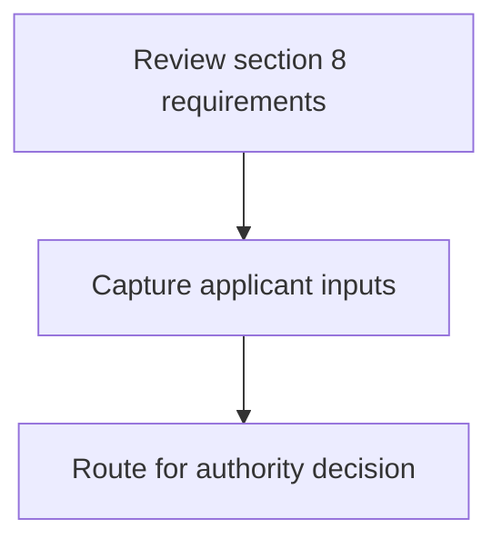
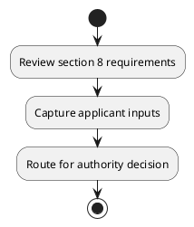

# Chapter 8 / Section 8: Nominee of Development Commissioner of MSME: Member

**Chapter Title:** Quality Complaints and Trade Disputes

**Pages:** 3

**Purpose:** Defines the operational requirements for Nominee of Development Commissioner of MSME: Member.

**Purpose Thanglish:** Indha Nominee of Development Commissioner of MSME: Member section-la, Defines the operational requirements for Nominee of Development Commissioner of MSME: Member.

**Summary:** 8. Nominee of Development Commissioner of MSME: Member

**Business Meaning:** 8.

**Business Explanation:** 8. Nominee of Development Commissioner of MSME: Member

**Business Explanation Thanglish:** Indha Nominee of Development Commissioner of MSME: Member section-la, 8. Nominee of Development Commissioner of MSME: Member

## Business Logic
- None identified

## Business Rules
- rule_id=CH8-SEC8-R001, rule_description=8. Nominee of Development Commissioner of MSME: Member, trigger=Nominee of Development Commissioner of MSME: Member, condition=Not explicitly covered in uploaded documents., validation=Not explicitly covered in uploaded documents., action=Manual review required., exception=No explicit exception found in uploaded documents., output=DEKAI should produce a compliance decision for 8 - Nominee of Development Commissioner of MSME: Member.

## Conditions
- None identified

## Condition Logic
- None identified

## Validations
- None identified

## Exceptions
- None identified

## Dependencies
- None identified

## Authorities
- Development Commissioner
- Nominee of Development Commissioner

## Required Documents
- None identified

## Timelines
- None identified

## Actions
- None identified

## Workflow
- Review section 8 requirements
- Capture applicant inputs
- Route for authority decision

## Workflow ASCII
```text
Nominee of Development Commissioner of MSME: Member
Review section 8 requirements
   |
   v
Capture applicant inputs
   |
   v
Route for authority decision
```

## Decision Tree
- IF section 8 applies THEN proceed with standard DGFT workflow

## Decision Tree ASCII
```text
Nominee of Development Commissioner of MSME: Member Decision
IF section 8 applies THEN proceed with standard DGFT workflow
```

## Examples
- User asks to process Nominee of Development Commissioner of MSME: Member; the platform checks conditions, validations, and documents before action.

**Real-world Example:** Example: an importer or exporter invokes Nominee of Development Commissioner of MSME: Member, submits the prescribed DGFT records, and DEKAI uses the extracted rules to follow the nominee of development commissioner of msme: member process.

**Real-world Example Thanglish:** Indha Nominee of Development Commissioner of MSME: Member section-la, Example: an importer or exporter invokes Nominee of Development Commissioner of MSME: Member, submits the prescribed DGFT records, and DEKAI uses the extracted rules to follow the nominee of development commissioner of msme: member process.

## AI Rules
- None identified

## Database Fields
- name=section_code, type=string, required=True, source=parsed_section_heading
- name=section_title, type=string, required=True, source=parsed_section_heading
- name=msme_flag, type=boolean, required=False, source=keyword:MSME
- name=member_flag, type=boolean, required=False, source=keyword:Member
- name=nominee_flag, type=boolean, required=False, source=keyword:Nominee
- name=development_flag, type=boolean, required=False, source=keyword:Development
- name=commissioner_flag, type=boolean, required=False, source=keyword:Commissioner

## API Requirements
- method=GET, path=/api/dgft/sections/8, purpose=Retrieve knowledge payload for section 8, query_params=['include=workflow,decision_tree,validations'], response_fields=['section', 'title', 'summary', 'conditions', 'validations', 'exceptions', 'workflow', 'decision_tree']
- method=POST, path=/api/dgft/Nominee-of-Development-Commissioner-of-MSME-Member/validate, purpose=Validate inputs and documents for Nominee of Development Commissioner of MSME: Member, request_fields=['section_code', 'section_title'], response_fields=['status', 'errors', 'warnings', 'next_actions']

## UI Screens
- screen_id=Nominee_of_Development_Commissioner_of_MSME_Member_overview, name=Nominee of Development Commissioner of MSME: Member Overview, purpose=Show section summary, authority, timeline, and eligibility cues., widgets=['summary_card', 'conditions_table', 'authority_badges', 'timeline_panel']
- screen_id=Nominee_of_Development_Commissioner_of_MSME_Member_submission, name=Nominee of Development Commissioner of MSME: Member Submission, purpose=Capture applicant data and supporting documents., widgets=['dynamic_form', 'document_uploader', 'validation_panel', 'next_action_footer'], fields=['section_code', 'section_title', 'msme_flag', 'member_flag', 'nominee_flag', 'development_flag', 'commissioner_flag']

## Error Messages
- Validation failed because the section requirements were not fully met.

## FAQ
- question_en=What is the purpose of section 8?, answer_en=8. Nominee of Development Commissioner of MSME: Member, question_thanglish=Indha Nominee of Development Commissioner of MSME: Member section-la, What is the purpose of section 8?, answer_thanglish=Indha Nominee of Development Commissioner of MSME: Member section-la, 8. Nominee of Development Commissioner of MSME: Member
- question_en=What documents are required under Nominee of Development Commissioner of MSME: Member?, answer_en=Not explicitly covered in uploaded documents., question_thanglish=Indha Nominee of Development Commissioner of MSME: Member section-la, What documents are required under Nominee of Development Commissioner of MSME: Member?, answer_thanglish=Indha Nominee of Development Commissioner of MSME: Member section-la, Not explicitly covered in uploaded documents.
- question_en=Which authority handles Nominee of Development Commissioner of MSME: Member?, answer_en=Development Commissioner, Nominee of Development Commissioner, question_thanglish=Indha Nominee of Development Commissioner of MSME: Member section-la, Which authority handles Nominee of Development Commissioner of MSME: Member?, answer_thanglish=Indha Nominee of Development Commissioner of MSME: Member section-la, Development Commissioner, Nominee of Development Commissioner

## Questions Users May Ask
- What does Nominee of Development Commissioner of MSME: Member require?
- Which documents are needed for Nominee of Development Commissioner of MSME: Member?
- How does DEKAI validate Nominee of Development Commissioner of MSME: Member requests?

## Expected AI Answers
- Nominee of Development Commissioner of MSME: Member requires the platform to interpret the section text, apply the extracted business rules, and present the correct next action.
- Required documents are inferred from the section text: no explicit documents were detected.
- DEKAI validates Nominee of Development Commissioner of MSME: Member by checking conditions, required documents, authority references, and exception clauses before recommending an outcome.

## AI Q&A Examples
- question_en=User asks: How do I comply with Nominee of Development Commissioner of MSME: Member?, answer_en=AI answers: DEKAI should evaluate section 8, apply the extracted rules, and guide the user through Review section 8 requirements., question_thanglish=Indha Nominee of Development Commissioner of MSME: Member section-la, User asks: How do I comply with Nominee of Development Commissioner of MSME: Member?, answer_thanglish=Indha Nominee of Development Commissioner of MSME: Member section-la, AI answers: DEKAI should evaluate section 8, apply the extracted rules, and guide the user through Review section 8 requirements.
- question_en=User asks: Which validations apply to Nominee of Development Commissioner of MSME: Member?, answer_en=AI answers: Applicable validations are not explicitly covered in the uploaded documents., question_thanglish=Indha Nominee of Development Commissioner of MSME: Member section-la, User asks: Which validations apply to Nominee of Development Commissioner of MSME: Member?, answer_thanglish=Indha Nominee of Development Commissioner of MSME: Member section-la, AI answers: Applicable validations are not explicitly covered in the uploaded documents.

## DEKAI AI Implementation Notes
- Capture chapter 8, section 8, title, and page references as immutable knowledge metadata.
- Bind validations for Nominee of Development Commissioner of MSME: Member into a rule engine keyed by the rule IDs extracted for this section.
- Route escalations or approvals to: Development Commissioner, Nominee of Development Commissioner.

## DEKAI AI Implementation Notes Thanglish
- Indha Nominee of Development Commissioner of MSME: Member section-la, Capture chapter 8, section 8, title, and page references as immutable knowledge metadata.
- Indha Nominee of Development Commissioner of MSME: Member section-la, Bind validations for Nominee of Development Commissioner of MSME: Member into a rule engine keyed by the rule IDs extracted for this section.
- Indha Nominee of Development Commissioner of MSME: Member section-la, Route escalations or approvals to: Development Commissioner, Nominee of Development Commissioner.

## AI Metadata
- Keywords: MSME, Member, Nominee, Development, Commissioner
- Search Keywords: MSME, Member, Nominee, Development, Commissioner
- Intent: Provide knowledge guidance for Nominee of Development Commissioner of MSME: Member.
- Tags: 8, Nominee of Development Commissioner of MSME: Member, dgft
- Related Sections: 
- Related Chapters: 
- Related Rules: 

## Mermaid


## PlantUML

