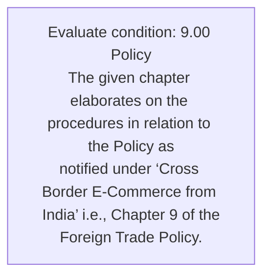
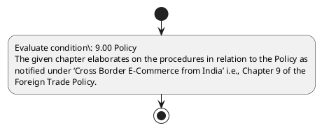

# Chapter 9 / Section 9.00: Policy

**Chapter Title:** Promoting Cross Border Trade in Digital Economy

**Pages:** 2

**Purpose:** 9.00 Policy
The given chapter elaborates on the procedures in relation to the Policy as
notified under ‘Cross Border E-Commerce from India’ i.e., Chapter 9 of the
Foreign Trade Policy.

**Purpose Thanglish:** Indha Policy section-la, 9.00 Policy
The given chapter elaborates on the procedures in relation to the Policy as
notified under ‘Cross Border E-Commerce from India’ i.e., Chapter 9 of the
Foreign Trade Policy.

**Summary:** 9.00 Policy
The given chapter elaborates on the procedures in relation to the Policy as
notified under ‘Cross Border E-Commerce from India’ i.e., Chapter 9 of the
Foreign Trade Policy.

**Business Meaning:** 9.00 Policy
The given chapter elaborates on the procedures in relation to the Policy as
notified under ‘Cross Border E-Commerce from India’ i.e., Chapter 9 of the
Foreign Trade Policy.

**Business Explanation:** 9.00 Policy
The given chapter elaborates on the procedures in relation to the Policy as
notified under ‘Cross Border E-Commerce from India’ i.e., Chapter 9 of the
Foreign Trade Policy.

**Business Explanation Thanglish:** Indha Policy section-la, 9.00 Policy
The given chapter elaborates on the procedures in relation to the Policy as
notified under ‘Cross Border E-Commerce from India’ i.e., Chapter 9 of the
Foreign Trade Policy.

## Business Logic
- None identified

## Business Rules
- rule_id=CH9-SEC9_00-R001, rule_description=9.00 Policy
The given chapter elaborates on the procedures in relation to the Policy as
notified under ‘Cross Border E-Commerce from India’ i.e., Chapter 9 of the
Foreign Trade Policy., trigger=Policy, condition=9.00 Policy
The given chapter elaborates on the procedures in relation to the Policy as
notified under ‘Cross Border E-Commerce from India’ i.e., Chapter 9 of the
Foreign Trade Policy., validation=Not explicitly covered in uploaded documents., action=Manual review required., exception=No explicit exception found in uploaded documents., output=DEKAI should produce a compliance decision for 9.00 - Policy.

## Conditions
- 9.00 Policy
The given chapter elaborates on the procedures in relation to the Policy as
notified under ‘Cross Border E-Commerce from India’ i.e., Chapter 9 of the
Foreign Trade Policy.

## Condition Logic
- id=9.9.00.1, if=9.00 Policy
The given chapter elaborates on the procedures in relation to the Policy as
notified under ‘Cross Border E-Commerce from India’ i.e., Chapter 9 of the
Foreign Trade Policy., then=Route for review, source=9.00 Policy
The given chapter elaborates on the procedures in relation to the Policy as
notified under ‘Cross Border E-Commerce from India’ i.e., Chapter 9 of the
Foreign Trade Policy.

## Validations
- None identified

## Exceptions
- None identified

## Dependencies
- 9

## Authorities
- None identified

## Required Documents
- None identified

## Timelines
- None identified

## Actions
- None identified

## Workflow
- Evaluate condition: 9.00 Policy
The given chapter elaborates on the procedures in relation to the Policy as
notified under ‘Cross Border E-Commerce from India’ i.e., Chapter 9 of the
Foreign Trade Policy.

## Workflow ASCII
```text
Policy
Evaluate condition: 9.00 Policy
The given chapter elaborates on the procedures in relation to the Policy as
notified under ‘Cross Border E-Commerce from India’ i.e., Chapter 9 of the
Foreign Trade Policy.
```

## Decision Tree
- IF section 9.00 applies THEN proceed with standard DGFT workflow

## Decision Tree ASCII
```text
Policy Decision
IF section 9.00 applies THEN proceed with standard DGFT workflow
```

## Examples
- User asks to process Policy; the platform checks conditions, validations, and documents before action.

**Real-world Example:** Example: an importer or exporter invokes Policy, submits the prescribed DGFT records, and DEKAI uses the extracted rules to follow the policy process.

**Real-world Example Thanglish:** Indha Policy section-la, Example: an importer or exporter invokes Policy, submits the prescribed DGFT records, and DEKAI uses the extracted rules to follow the policy process.

## AI Rules
- None identified

## Database Fields
- name=section_code, type=string, required=True, source=parsed_section_heading
- name=section_title, type=string, required=True, source=parsed_section_heading
- name=the_flag, type=boolean, required=False, source=keyword:The
- name=from_flag, type=boolean, required=False, source=keyword:from
- name=given_flag, type=boolean, required=False, source=keyword:given
- name=under_flag, type=boolean, required=False, source=keyword:under
- name=cross_flag, type=boolean, required=False, source=keyword:Cross
- name=india_flag, type=boolean, required=False, source=keyword:India
- name=trade_flag, type=boolean, required=False, source=keyword:Trade
- name=policy_flag, type=boolean, required=False, source=keyword:Policy

## API Requirements
- method=GET, path=/api/dgft/sections/9.00, purpose=Retrieve knowledge payload for section 9.00, query_params=['include=workflow,decision_tree,validations'], response_fields=['section', 'title', 'summary', 'conditions', 'validations', 'exceptions', 'workflow', 'decision_tree']
- method=POST, path=/api/dgft/Policy/validate, purpose=Validate inputs and documents for Policy, request_fields=['section_code', 'section_title'], response_fields=['status', 'errors', 'warnings', 'next_actions']

## UI Screens
- screen_id=Policy_overview, name=Policy Overview, purpose=Show section summary, authority, timeline, and eligibility cues., widgets=['summary_card', 'conditions_table', 'authority_badges', 'timeline_panel']
- screen_id=Policy_submission, name=Policy Submission, purpose=Capture applicant data and supporting documents., widgets=['dynamic_form', 'document_uploader', 'validation_panel', 'next_action_footer'], fields=['section_code', 'section_title', 'the_flag', 'from_flag', 'given_flag', 'under_flag', 'cross_flag', 'india_flag']

## Error Messages
- Validation failed because the section requirements were not fully met.

## FAQ
- question_en=What is the purpose of section 9.00?, answer_en=9.00 Policy
The given chapter elaborates on the procedures in relation to the Policy as
notified under ‘Cross Border E-Commerce from India’ i.e., Chapter 9 of the
Foreign Trade Policy., question_thanglish=Indha Policy section-la, What is the purpose of section 9.00?, answer_thanglish=Indha Policy section-la, 9.00 Policy
The given chapter elaborates on the procedures in relation to the Policy as
notified under ‘Cross Border E-Commerce from India’ i.e., Chapter 9 of the
Foreign Trade Policy.
- question_en=What documents are required under Policy?, answer_en=Not explicitly covered in uploaded documents., question_thanglish=Indha Policy section-la, What documents are required under Policy?, answer_thanglish=Indha Policy section-la, Not explicitly covered in uploaded documents.
- question_en=Which authority handles Policy?, answer_en=Not explicitly covered in uploaded documents., question_thanglish=Indha Policy section-la, Which authority handles Policy?, answer_thanglish=Indha Policy section-la, Not explicitly covered in uploaded documents.

## Questions Users May Ask
- What does Policy require?
- Which documents are needed for Policy?
- How does DEKAI validate Policy requests?

## Expected AI Answers
- Policy requires the platform to interpret the section text, apply the extracted business rules, and present the correct next action.
- Required documents are inferred from the section text: no explicit documents were detected.
- DEKAI validates Policy by checking conditions, required documents, authority references, and exception clauses before recommending an outcome.

## AI Q&A Examples
- question_en=User asks: How do I comply with Policy?, answer_en=AI answers: DEKAI should evaluate section 9.00, apply the extracted rules, and guide the user through Evaluate condition: 9.00 Policy
The given chapter elaborates on the procedures in relation to the Policy as
notified under ‘Cross Border E-Commerce from India’ i.e., Chapter 9 of the
Foreign Trade Policy.., question_thanglish=Indha Policy section-la, User asks: How do I comply with Policy?, answer_thanglish=Indha Policy section-la, AI answers: DEKAI should evaluate section 9.00, apply the extracted rules, and guide the user through Evaluate condition: 9.00 Policy
The given chapter elaborates on the procedures in relation to the Policy as
notified under ‘Cross Border E-Commerce from India’ i.e., Chapter 9 of the
Foreign Trade Policy..
- question_en=User asks: Which validations apply to Policy?, answer_en=AI answers: Applicable validations are not explicitly covered in the uploaded documents., question_thanglish=Indha Policy section-la, User asks: Which validations apply to Policy?, answer_thanglish=Indha Policy section-la, AI answers: Applicable validations are not explicitly covered in the uploaded documents.

## DEKAI AI Implementation Notes
- Capture chapter 9, section 9.00, title, and page references as immutable knowledge metadata.
- Bind validations for Policy into a rule engine keyed by the rule IDs extracted for this section.

## DEKAI AI Implementation Notes Thanglish
- Indha Policy section-la, Capture chapter 9, section 9.00, title, and page references as immutable knowledge metadata.
- Indha Policy section-la, Bind validations for Policy into a rule engine keyed by the rule IDs extracted for this section.

## AI Metadata
- Keywords: The, from, given, under, Cross, India, Trade, Policy, Border, chapter, Foreign, relation, notified, elaborates, procedures, E-Commerce
- Search Keywords: The, from, given, under, Cross, India, Trade, Policy, Border, chapter, Foreign, relation, notified, elaborates, procedures, E-Commerce
- Intent: Provide knowledge guidance for Policy.
- Tags: 9.00, Policy, dgft
- Related Sections: 
- Related Chapters: 
- Related Rules: 

## Mermaid


## PlantUML

