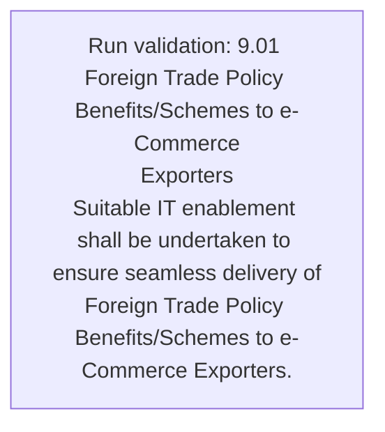
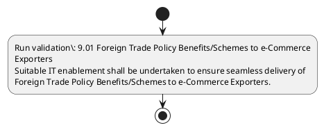

# Chapter 9 / Section 9.01: Foreign Trade Policy Benefits/Schemes to e-Commerce

**Chapter Title:** Promoting Cross Border Trade in Digital Economy

**Pages:** 2

**Purpose:** 9.01 Foreign Trade Policy Benefits/Schemes to e-Commerce
Exporters
Suitable IT enablement shall be undertaken to ensure seamless delivery of
Foreign Trade Policy Benefits/Schemes to e-Commerce Exporters.

**Purpose Thanglish:** Indha Foreign Trade Policy Benefits/Schemes to e-Commerce section-la, 9.01 Foreign Trade Policy Benefits/Schemes to e-Commerce
Exporters
Suitable IT enablement kandippa be undertaken to ensure seamless delivery of
Foreign Trade Policy Benefits/Schemes to e-Commerce Exporters.

**Summary:** 9.01 Foreign Trade Policy Benefits/Schemes to e-Commerce
Exporters
Suitable IT enablement shall be undertaken to ensure seamless delivery of
Foreign Trade Policy Benefits/Schemes to e-Commerce Exporters.

**Business Meaning:** Foreign Trade Policy Benefits/Schemes to e-Commerce governs how DGFT business controls should be applied, validated, and enforced.

**Business Explanation:** Foreign Trade Policy Benefits/Schemes to e-Commerce explains the operating rule set that DEKAI should enforce. Key control points include 9.01 Foreign Trade Policy Benefits/Schemes to e-Commerce
Exporters
Suitable IT enablement shall be undertaken to ensure seamless delivery of
Foreign Trade Policy Benefits/Schemes to e-Commerce Exporters.

**Business Explanation Thanglish:** Indha Foreign Trade Policy Benefits/Schemes to e-Commerce section-la, Foreign Trade Policy Benefits/Schemes to e-Commerce explains the operating rule set that DEKAI should enforce. Key control points include 9.01 Foreign Trade Policy Benefits/Schemes to e-Commerce
Exporters
Suitable IT enablement kandippa be undertaken to ensure seamless delivery of
Foreign Trade Policy Benefits/Schemes to e-Commerce Exporters.

## Business Logic
- 9.01 Foreign Trade Policy Benefits/Schemes to e-Commerce
Exporters
Suitable IT enablement shall be undertaken to ensure seamless delivery of
Foreign Trade Policy Benefits/Schemes to e-Commerce Exporters.

## Business Rules
- rule_id=CH9-SEC9_01-R001, rule_description=9.01 Foreign Trade Policy Benefits/Schemes to e-Commerce
Exporters
Suitable IT enablement shall be undertaken to ensure seamless delivery of
Foreign Trade Policy Benefits/Schemes to e-Commerce Exporters., trigger=Foreign Trade Policy Benefits/Schemes to e-Commerce, condition=Not explicitly covered in uploaded documents., validation=9.01 Foreign Trade Policy Benefits/Schemes to e-Commerce
Exporters
Suitable IT enablement shall be undertaken to ensure seamless delivery of
Foreign Trade Policy Benefits/Schemes to e-Commerce Exporters., action=Manual review required., exception=No explicit exception found in uploaded documents., output=DEKAI should produce a compliance decision for 9.01 - Foreign Trade Policy Benefits/Schemes to e-Commerce.

## Conditions
- None identified

## Condition Logic
- None identified

## Validations
- 9.01 Foreign Trade Policy Benefits/Schemes to e-Commerce
Exporters
Suitable IT enablement shall be undertaken to ensure seamless delivery of
Foreign Trade Policy Benefits/Schemes to e-Commerce Exporters.

## Exceptions
- None identified

## Dependencies
- None identified

## Authorities
- None identified

## Required Documents
- None identified

## Timelines
- None identified

## Actions
- None identified

## Workflow
- Run validation: 9.01 Foreign Trade Policy Benefits/Schemes to e-Commerce
Exporters
Suitable IT enablement shall be undertaken to ensure seamless delivery of
Foreign Trade Policy Benefits/Schemes to e-Commerce Exporters.

## Workflow ASCII
```text
Foreign Trade Policy Benefits/Schemes to e-Commerce
Run validation: 9.01 Foreign Trade Policy Benefits/Schemes to e-Commerce
Exporters
Suitable IT enablement shall be undertaken to ensure seamless delivery of
Foreign Trade Policy Benefits/Schemes to e-Commerce Exporters.
```

## Decision Tree
- IF section 9.01 applies THEN proceed with standard DGFT workflow

## Decision Tree ASCII
```text
Foreign Trade Policy Benefits/Schemes to e-Commerce Decision
IF section 9.01 applies THEN proceed with standard DGFT workflow
```

## Examples
- User asks to process Foreign Trade Policy Benefits/Schemes to e-Commerce; the platform checks conditions, validations, and documents before action.

**Real-world Example:** Example: an importer or exporter invokes Foreign Trade Policy Benefits/Schemes to e-Commerce, submits the prescribed DGFT records, and DEKAI uses the extracted rules to follow the foreign trade policy benefits/schemes to e-commerce process.

**Real-world Example Thanglish:** Indha Foreign Trade Policy Benefits/Schemes to e-Commerce section-la, Example: an importer or exporter invokes Foreign Trade Policy Benefits/Schemes to e-Commerce, submits the prescribed DGFT records, and DEKAI uses the extracted rules to follow the foreign trade policy benefits/schemes to e-commerce process.

## AI Rules
- IF detected context matches section rule THEN enforce: 9.01 Foreign Trade Policy Benefits/Schemes to e-Commerce
Exporters
Suitable IT enablement shall be undertaken to ensure seamless delivery of
Foreign Trade Policy Benefits/Schemes to e-Commerce Exporters.

## Database Fields
- name=section_code, type=string, required=True, source=parsed_section_heading
- name=section_title, type=string, required=True, source=parsed_section_heading
- name=trade_flag, type=boolean, required=False, source=keyword:Trade
- name=shall_flag, type=boolean, required=False, source=keyword:shall
- name=policy_flag, type=boolean, required=False, source=keyword:Policy
- name=ensure_flag, type=boolean, required=False, source=keyword:ensure
- name=foreign_flag, type=boolean, required=False, source=keyword:Foreign
- name=suitable_flag, type=boolean, required=False, source=keyword:Suitable
- name=seamless_flag, type=boolean, required=False, source=keyword:seamless
- name=delivery_flag, type=boolean, required=False, source=keyword:delivery

## API Requirements
- method=GET, path=/api/dgft/sections/9.01, purpose=Retrieve knowledge payload for section 9.01, query_params=['include=workflow,decision_tree,validations'], response_fields=['section', 'title', 'summary', 'conditions', 'validations', 'exceptions', 'workflow', 'decision_tree']
- method=POST, path=/api/dgft/Foreign-Trade-Policy-Benefits-Schemes-to-e-Commerce/validate, purpose=Validate inputs and documents for Foreign Trade Policy Benefits/Schemes to e-Commerce, request_fields=['section_code', 'section_title'], response_fields=['status', 'errors', 'warnings', 'next_actions']

## UI Screens
- screen_id=Foreign_Trade_Policy_Benefits_Schemes_to_e_Commerce_overview, name=Foreign Trade Policy Benefits/Schemes to e-Commerce Overview, purpose=Show section summary, authority, timeline, and eligibility cues., widgets=['summary_card', 'conditions_table', 'authority_badges', 'timeline_panel']
- screen_id=Foreign_Trade_Policy_Benefits_Schemes_to_e_Commerce_submission, name=Foreign Trade Policy Benefits/Schemes to e-Commerce Submission, purpose=Capture applicant data and supporting documents., widgets=['dynamic_form', 'document_uploader', 'validation_panel', 'next_action_footer'], fields=['section_code', 'section_title', 'trade_flag', 'shall_flag', 'policy_flag', 'ensure_flag', 'foreign_flag', 'suitable_flag']

## Error Messages
- Validation failed because the section requirements were not fully met.

## FAQ
- question_en=What is the purpose of section 9.01?, answer_en=Foreign Trade Policy Benefits/Schemes to e-Commerce explains the operating rule set that DEKAI should enforce. Key control points include 9.01 Foreign Trade Policy Benefits/Schemes to e-Commerce
Exporters
Suitable IT enablement shall be undertaken to ensure seamless delivery of
Foreign Trade Policy Benefits/Schemes to e-Commerce Exporters., question_thanglish=Indha Foreign Trade Policy Benefits/Schemes to e-Commerce section-la, What is the purpose of section 9.01?, answer_thanglish=Indha Foreign Trade Policy Benefits/Schemes to e-Commerce section-la, Foreign Trade Policy Benefits/Schemes to e-Commerce explains the operating rule set that DEKAI should enforce. Key control points include 9.01 Foreign Trade Policy Benefits/Schemes to e-Commerce
Exporters
Suitable IT enablement kandippa be undertaken to ensure seamless delivery of
Foreign Trade Policy Benefits/Schemes to e-Commerce Exporters.
- question_en=What documents are required under Foreign Trade Policy Benefits/Schemes to e-Commerce?, answer_en=Not explicitly covered in uploaded documents., question_thanglish=Indha Foreign Trade Policy Benefits/Schemes to e-Commerce section-la, What documents are required under Foreign Trade Policy Benefits/Schemes to e-Commerce?, answer_thanglish=Indha Foreign Trade Policy Benefits/Schemes to e-Commerce section-la, Not explicitly covered in uploaded documents.
- question_en=Which authority handles Foreign Trade Policy Benefits/Schemes to e-Commerce?, answer_en=Not explicitly covered in uploaded documents., question_thanglish=Indha Foreign Trade Policy Benefits/Schemes to e-Commerce section-la, Which authority handles Foreign Trade Policy Benefits/Schemes to e-Commerce?, answer_thanglish=Indha Foreign Trade Policy Benefits/Schemes to e-Commerce section-la, Not explicitly covered in uploaded documents.

## Questions Users May Ask
- What does Foreign Trade Policy Benefits/Schemes to e-Commerce require?
- Which documents are needed for Foreign Trade Policy Benefits/Schemes to e-Commerce?
- How does DEKAI validate Foreign Trade Policy Benefits/Schemes to e-Commerce requests?

## Expected AI Answers
- Foreign Trade Policy Benefits/Schemes to e-Commerce requires the platform to interpret the section text, apply the extracted business rules, and present the correct next action.
- Required documents are inferred from the section text: no explicit documents were detected.
- DEKAI validates Foreign Trade Policy Benefits/Schemes to e-Commerce by checking conditions, required documents, authority references, and exception clauses before recommending an outcome.

## AI Q&A Examples
- question_en=User asks: How do I comply with Foreign Trade Policy Benefits/Schemes to e-Commerce?, answer_en=AI answers: DEKAI should evaluate section 9.01, apply the extracted rules, and guide the user through Run validation: 9.01 Foreign Trade Policy Benefits/Schemes to e-Commerce
Exporters
Suitable IT enablement shall be undertaken to ensure seamless delivery of
Foreign Trade Policy Benefits/Schemes to e-Commerce Exporters.., question_thanglish=Indha Foreign Trade Policy Benefits/Schemes to e-Commerce section-la, User asks: How do I comply with Foreign Trade Policy Benefits/Schemes to e-Commerce?, answer_thanglish=Indha Foreign Trade Policy Benefits/Schemes to e-Commerce section-la, AI answers: DEKAI should evaluate section 9.01, apply the extracted rules, and guide the user through Run validation: 9.01 Foreign Trade Policy Benefits/Schemes to e-Commerce
Exporters
Suitable IT enablement kandippa be undertaken to ensure seamless delivery of
Foreign Trade Policy Benefits/Schemes to e-Commerce Exporters..
- question_en=User asks: Which validations apply to Foreign Trade Policy Benefits/Schemes to e-Commerce?, answer_en=AI answers: Applicable validations are 9.01 Foreign Trade Policy Benefits/Schemes to e-Commerce
Exporters
Suitable IT enablement shall be undertaken to ensure seamless delivery of
Foreign Trade Policy Benefits/Schemes to e-Commerce Exporters., question_thanglish=Indha Foreign Trade Policy Benefits/Schemes to e-Commerce section-la, User asks: Which validations apply to Foreign Trade Policy Benefits/Schemes to e-Commerce?, answer_thanglish=Indha Foreign Trade Policy Benefits/Schemes to e-Commerce section-la, AI answers: Applicable validations are 9.01 Foreign Trade Policy Benefits/Schemes to e-Commerce
Exporters
Suitable IT enablement kandippa be undertaken to ensure seamless delivery of
Foreign Trade Policy Benefits/Schemes to e-Commerce Exporters.

## DEKAI AI Implementation Notes
- Capture chapter 9, section 9.01, title, and page references as immutable knowledge metadata.
- Bind validations for Foreign Trade Policy Benefits/Schemes to e-Commerce into a rule engine keyed by the rule IDs extracted for this section.

## DEKAI AI Implementation Notes Thanglish
- Indha Foreign Trade Policy Benefits/Schemes to e-Commerce section-la, Capture chapter 9, section 9.01, title, and page references as immutable knowledge metadata.
- Indha Foreign Trade Policy Benefits/Schemes to e-Commerce section-la, Bind validations for Foreign Trade Policy Benefits/Schemes to e-Commerce into a rule engine keyed by the rule IDs extracted for this section.

## AI Metadata
- Keywords: Trade, shall, Policy, ensure, Foreign, Suitable, seamless, delivery, Exporters, e-Commerce, enablement, undertaken, Benefits/Schemes
- Search Keywords: Trade, shall, Policy, ensure, Foreign, Suitable, seamless, delivery, Exporters, e-Commerce, enablement, undertaken, Benefits/Schemes
- Intent: Provide knowledge guidance for Foreign Trade Policy Benefits/Schemes to e-Commerce.
- Tags: 9.01, Foreign Trade Policy Benefits/Schemes to e-Commerce, business-rule, dgft
- Related Sections: 
- Related Chapters: 
- Related Rules: 9.01 Foreign Trade Policy Benefits/Schemes to e-Commerce
Exporters
Suitable IT enablement shall be undertaken to ensure seamless delivery of
Foreign Trade Policy Benefits/Schemes to e-Commerce Exporters.

## Mermaid


## PlantUML

