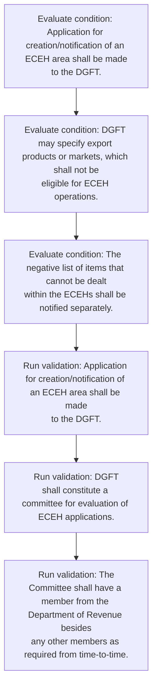
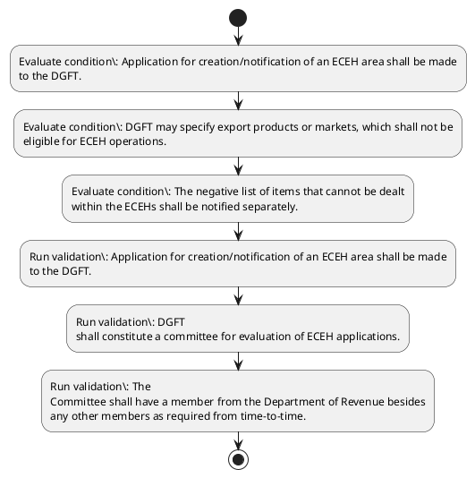

# Chapter 9 / Section 9.02: E-COMMERCE EXPORT HUBs (ECEHs)

**Chapter Title:** Promoting Cross Border Trade in Digital Economy

**Pages:** 2

**Purpose:** Application for creation/notification of an ECEH area shall be made
to the DGFT.

**Purpose Thanglish:** Indha E-COMMERCE EXPORT HUBs (ECEHs) section-la, application for creation/notification of an ECEH area kandippa be made
to the DGFT.

**Summary:** 9.02 E-COMMERCE EXPORT HUBs (ECEHs)
a) Creation of ECEH
i. Application for creation/notification of an ECEH area shall be made
to the DGFT. ii.

**Business Meaning:** E-COMMERCE EXPORT HUBs (ECEHs) governs how DGFT business controls should be applied, validated, and enforced.

**Business Explanation:** E-COMMERCE EXPORT HUBs (ECEHs) explains the operating rule set that DEKAI should enforce. Key control points include Application for creation/notification of an ECEH area shall be made
to the DGFT.

**Business Explanation Thanglish:** Indha E-COMMERCE EXPORT HUBs (ECEHs) section-la, E-COMMERCE export HUBs (ECEHs) explains the operating rule set that DEKAI should enforce. Key control points include application for creation/notification of an ECEH area kandippa be made
to the DGFT.

## Business Logic
- Application for creation/notification of an ECEH area shall be made
to the DGFT.
- DGFT
shall constitute a committee for evaluation of ECEH applications.
- The
Committee shall have a member from the Department of Revenue besides
any other members as required from time-to-time.
- DGFT may specify export products or markets, which shall not be
eligible for ECEH operations.
- The negative list of items that cannot be dealt
within the ECEHs shall be notified separately.
- The ECEH developer shall provide an annual statement of accounts as
per instructions in this regard.
- DGFT shall notify procedures for supervision and inspections at
ECEHs.

## Business Rules
- rule_id=CH9-SEC9_02-R001, rule_description=Application for creation/notification of an ECEH area shall be made
to the DGFT., trigger=E-COMMERCE EXPORT HUBs (ECEHs), condition=Application for creation/notification of an ECEH area shall be made
to the DGFT., validation=Application for creation/notification of an ECEH area shall be made
to the DGFT., action=Manual review required., exception=No explicit exception found in uploaded documents., output=DEKAI should produce a compliance decision for 9.02 - E-COMMERCE EXPORT HUBs (ECEHs).
- rule_id=CH9-SEC9_02-R002, rule_description=DGFT
shall constitute a committee for evaluation of ECEH applications., trigger=E-COMMERCE EXPORT HUBs (ECEHs), condition=DGFT may specify export products or markets, which shall not be
eligible for ECEH operations., validation=DGFT
shall constitute a committee for evaluation of ECEH applications., action=Manual review required., exception=No explicit exception found in uploaded documents., output=DEKAI should produce a compliance decision for 9.02 - E-COMMERCE EXPORT HUBs (ECEHs).
- rule_id=CH9-SEC9_02-R003, rule_description=The
Committee shall have a member from the Department of Revenue besides
any other members as required from time-to-time., trigger=E-COMMERCE EXPORT HUBs (ECEHs), condition=The negative list of items that cannot be dealt
within the ECEHs shall be notified separately., validation=The
Committee shall have a member from the Department of Revenue besides
any other members as required from time-to-time., action=Manual review required., exception=No explicit exception found in uploaded documents., output=DEKAI should produce a compliance decision for 9.02 - E-COMMERCE EXPORT HUBs (ECEHs).
- rule_id=CH9-SEC9_02-R004, rule_description=DGFT may specify export products or markets, which shall not be
eligible for ECEH operations., trigger=E-COMMERCE EXPORT HUBs (ECEHs), condition=DGFT shall notify procedures for supervision and inspections at
ECEHs., validation=DGFT may specify export products or markets, which shall not be
eligible for ECEH operations., action=Manual review required., exception=No explicit exception found in uploaded documents., output=DEKAI should produce a compliance decision for 9.02 - E-COMMERCE EXPORT HUBs (ECEHs).
- rule_id=CH9-SEC9_02-R005, rule_description=The negative list of items that cannot be dealt
within the ECEHs shall be notified separately., trigger=E-COMMERCE EXPORT HUBs (ECEHs), condition=DGFT shall notify procedures for supervision and inspections at
ECEHs., validation=The negative list of items that cannot be dealt
within the ECEHs shall be notified separately., action=Manual review required., exception=No explicit exception found in uploaded documents., output=DEKAI should produce a compliance decision for 9.02 - E-COMMERCE EXPORT HUBs (ECEHs).
- rule_id=CH9-SEC9_02-R006, rule_description=The ECEH developer shall provide an annual statement of accounts as
per instructions in this regard., trigger=E-COMMERCE EXPORT HUBs (ECEHs), condition=DGFT shall notify procedures for supervision and inspections at
ECEHs., validation=The ECEH developer shall provide an annual statement of accounts as
per instructions in this regard., action=Manual review required., exception=No explicit exception found in uploaded documents., output=DEKAI should produce a compliance decision for 9.02 - E-COMMERCE EXPORT HUBs (ECEHs).
- rule_id=CH9-SEC9_02-R007, rule_description=DGFT shall notify procedures for supervision and inspections at
ECEHs., trigger=E-COMMERCE EXPORT HUBs (ECEHs), condition=DGFT shall notify procedures for supervision and inspections at
ECEHs., validation=DGFT shall notify procedures for supervision and inspections at
ECEHs., action=Manual review required., exception=No explicit exception found in uploaded documents., output=DEKAI should produce a compliance decision for 9.02 - E-COMMERCE EXPORT HUBs (ECEHs).

## Conditions
- Application for creation/notification of an ECEH area shall be made
to the DGFT.
- DGFT may specify export products or markets, which shall not be
eligible for ECEH operations.
- The negative list of items that cannot be dealt
within the ECEHs shall be notified separately.
- DGFT shall notify procedures for supervision and inspections at
ECEHs.

## Condition Logic
- id=9.9.02.1, if=Application for creation/notification of an ECEH area shall be made
to the DGFT., then=Route for review, source=Application for creation/notification of an ECEH area shall be made
to the DGFT.
- id=9.9.02.2, if=DGFT may specify export products or markets, which shall not be
eligible for ECEH operations., then=Route for review, source=DGFT may specify export products or markets, which shall not be
eligible for ECEH operations.
- id=9.9.02.3, if=The negative list of items that cannot be dealt
within the ECEHs shall be notified separately., then=Route for review, source=The negative list of items that cannot be dealt
within the ECEHs shall be notified separately.
- id=9.9.02.4, if=DGFT shall notify procedures for supervision and inspections at
ECEHs., then=Route for review, source=DGFT shall notify procedures for supervision and inspections at
ECEHs.

## Validations
- Application for creation/notification of an ECEH area shall be made
to the DGFT.
- DGFT
shall constitute a committee for evaluation of ECEH applications.
- The
Committee shall have a member from the Department of Revenue besides
any other members as required from time-to-time.
- DGFT may specify export products or markets, which shall not be
eligible for ECEH operations.
- The negative list of items that cannot be dealt
within the ECEHs shall be notified separately.
- The ECEH developer shall provide an annual statement of accounts as
per instructions in this regard.
- DGFT shall notify procedures for supervision and inspections at
ECEHs.

## Exceptions
- None identified

## Dependencies
- None identified

## Authorities
- DGFT
- The authority for approval for an ECEH vests with the DGFT

## Required Documents
- Application for creation/notification of an ECEH area shall be made
to the DGFT.
- DGFT
shall constitute a committee for evaluation of ECEH applications.
- The ECEH developer shall provide an annual statement of accounts as
per instructions in this regard.

## Timelines
- The negative list of items that cannot be dealt
within the ECEHs shall be notified separately.

## Actions
- None identified

## Workflow
- Evaluate condition: Application for creation/notification of an ECEH area shall be made
to the DGFT.
- Evaluate condition: DGFT may specify export products or markets, which shall not be
eligible for ECEH operations.
- Evaluate condition: The negative list of items that cannot be dealt
within the ECEHs shall be notified separately.
- Run validation: Application for creation/notification of an ECEH area shall be made
to the DGFT.
- Run validation: DGFT
shall constitute a committee for evaluation of ECEH applications.
- Run validation: The
Committee shall have a member from the Department of Revenue besides
any other members as required from time-to-time.

## Workflow ASCII
```text
E-COMMERCE EXPORT HUBs (ECEHs)
Evaluate condition: Application for creation/notification of an ECEH area shall be made
to the DGFT.
   |
   v
Evaluate condition: DGFT may specify export products or markets, which shall not be
eligible for ECEH operations.
   |
   v
Evaluate condition: The negative list of items that cannot be dealt
within the ECEHs shall be notified separately.
   |
   v
Run validation: Application for creation/notification of an ECEH area shall be made
to the DGFT.
   |
   v
Run validation: DGFT
shall constitute a committee for evaluation of ECEH applications.
   |
   v
Run validation: The
Committee shall have a member from the Department of Revenue besides
any other members as required from time-to-time.
```

## Decision Tree
- IF section 9.02 applies THEN proceed with standard DGFT workflow

## Decision Tree ASCII
```text
E-COMMERCE EXPORT HUBs (ECEHs) Decision
IF section 9.02 applies THEN proceed with standard DGFT workflow
```

## Examples
- User asks to process E-COMMERCE EXPORT HUBs (ECEHs); the platform checks conditions, validations, and documents before action.

**Real-world Example:** Example: an importer or exporter invokes E-COMMERCE EXPORT HUBs (ECEHs), submits Application for creation/notification of an ECEH area shall be made
to the DGFT., DGFT
shall constitute a committee for evaluation of ECEH applications., The ECEH developer shall provide an annual statement of accounts as
per instructions in this regard., and DEKAI uses the extracted rules to follow the e-commerce export hubs (ecehs) process.

**Real-world Example Thanglish:** Indha E-COMMERCE EXPORT HUBs (ECEHs) section-la, Example: an importer or exporter invokes E-COMMERCE export HUBs (ECEHs), submits application for creation/notification of an ECEH area kandippa be made
to the DGFT., DGFT
kandippa constitute a committee for evaluation of ECEH applications., The ECEH developer kandippa provide an annual statement of accounts as
per instructions in this regard., and DEKAI uses the extracted rules to follow the e-commerce export hubs (ecehs) process.

## AI Rules
- IF detected context matches section rule THEN enforce: Application for creation/notification of an ECEH area shall be made
to the DGFT.
- IF detected context matches section rule THEN enforce: DGFT
shall constitute a committee for evaluation of ECEH applications.
- IF detected context matches section rule THEN enforce: The
Committee shall have a member from the Department of Revenue besides
any other members as required from time-to-time.
- IF detected context matches section rule THEN enforce: DGFT may specify export products or markets, which shall not be
eligible for ECEH operations.
- IF detected context matches section rule THEN enforce: The negative list of items that cannot be dealt
within the ECEHs shall be notified separately.
- IF detected context matches section rule THEN enforce: The ECEH developer shall provide an annual statement of accounts as
per instructions in this regard.

## Database Fields
- name=section_code, type=string, required=True, source=parsed_section_heading
- name=section_title, type=string, required=True, source=parsed_section_heading
- name=for_flag, type=boolean, required=False, source=keyword:for
- name=the_flag, type=boolean, required=False, source=keyword:the
- name=any_flag, type=boolean, required=False, source=keyword:any
- name=iii_flag, type=boolean, required=False, source=keyword:iii
- name=may_flag, type=boolean, required=False, source=keyword:may
- name=not_flag, type=boolean, required=False, source=keyword:not
- name=per_flag, type=boolean, required=False, source=keyword:per
- name=and_flag, type=boolean, required=False, source=keyword:and
- name=document_1_submitted, type=boolean, required=True, source=Application for creation/notification of an ECEH area shall be made
to the DGFT.
- name=document_2_submitted, type=boolean, required=True, source=DGFT
shall constitute a committee for evaluation of ECEH applications.
- name=document_3_submitted, type=boolean, required=True, source=The ECEH developer shall provide an annual statement of accounts as
per instructions in this regard.

## API Requirements
- method=GET, path=/api/dgft/sections/9.02, purpose=Retrieve knowledge payload for section 9.02, query_params=['include=workflow,decision_tree,validations'], response_fields=['section', 'title', 'summary', 'conditions', 'validations', 'exceptions', 'workflow', 'decision_tree']
- method=POST, path=/api/dgft/E-COMMERCE-EXPORT-HUBs-ECEHs/validate, purpose=Validate inputs and documents for E-COMMERCE EXPORT HUBs (ECEHs), request_fields=['section_code', 'section_title', 'document_1_submitted', 'document_2_submitted', 'document_3_submitted'], response_fields=['status', 'errors', 'warnings', 'next_actions']

## UI Screens
- screen_id=E_COMMERCE_EXPORT_HUBs_ECEHs_overview, name=E-COMMERCE EXPORT HUBs (ECEHs) Overview, purpose=Show section summary, authority, timeline, and eligibility cues., widgets=['summary_card', 'conditions_table', 'authority_badges', 'timeline_panel']
- screen_id=E_COMMERCE_EXPORT_HUBs_ECEHs_submission, name=E-COMMERCE EXPORT HUBs (ECEHs) Submission, purpose=Capture applicant data and supporting documents., widgets=['dynamic_form', 'document_uploader', 'validation_panel', 'next_action_footer'], fields=['section_code', 'section_title', 'for_flag', 'the_flag', 'any_flag', 'iii_flag', 'may_flag', 'not_flag']

## Error Messages
- Validation failed because the section requirements were not fully met.

## FAQ
- question_en=What is the purpose of section 9.02?, answer_en=E-COMMERCE EXPORT HUBs (ECEHs) explains the operating rule set that DEKAI should enforce. Key control points include Application for creation/notification of an ECEH area shall be made
to the DGFT., question_thanglish=Indha E-COMMERCE EXPORT HUBs (ECEHs) section-la, What is the purpose of section 9.02?, answer_thanglish=Indha E-COMMERCE EXPORT HUBs (ECEHs) section-la, E-COMMERCE export HUBs (ECEHs) explains the operating rule set that DEKAI should enforce. Key control points include application for creation/notification of an ECEH area kandippa be made
to the DGFT.
- question_en=What documents are required under E-COMMERCE EXPORT HUBs (ECEHs)?, answer_en=Application for creation/notification of an ECEH area shall be made
to the DGFT., DGFT
shall constitute a committee for evaluation of ECEH applications., The ECEH developer shall provide an annual statement of accounts as
per instructions in this regard., question_thanglish=Indha E-COMMERCE EXPORT HUBs (ECEHs) section-la, What documents are required under E-COMMERCE export HUBs (ECEHs)?, answer_thanglish=Indha E-COMMERCE EXPORT HUBs (ECEHs) section-la, application for creation/notification of an ECEH area kandippa be made
to the DGFT., DGFT
kandippa constitute a committee for evaluation of ECEH applications., The ECEH developer kandippa provide an annual statement of accounts as
per instructions in this regard.
- question_en=Which authority handles E-COMMERCE EXPORT HUBs (ECEHs)?, answer_en=DGFT, The authority for approval for an ECEH vests with the DGFT, question_thanglish=Indha E-COMMERCE EXPORT HUBs (ECEHs) section-la, Which authority handles E-COMMERCE export HUBs (ECEHs)?, answer_thanglish=Indha E-COMMERCE EXPORT HUBs (ECEHs) section-la, DGFT, The authority for approval for an ECEH vests with the DGFT

## Questions Users May Ask
- What does E-COMMERCE EXPORT HUBs (ECEHs) require?
- Which documents are needed for E-COMMERCE EXPORT HUBs (ECEHs)?
- How does DEKAI validate E-COMMERCE EXPORT HUBs (ECEHs) requests?

## Expected AI Answers
- E-COMMERCE EXPORT HUBs (ECEHs) requires the platform to interpret the section text, apply the extracted business rules, and present the correct next action.
- Required documents are inferred from the section text: Application for creation/notification of an ECEH area shall be made
to the DGFT., DGFT
shall constitute a committee for evaluation of ECEH applications., The ECEH developer shall provide an annual statement of accounts as
per instructions in this regard.
- DEKAI validates E-COMMERCE EXPORT HUBs (ECEHs) by checking conditions, required documents, authority references, and exception clauses before recommending an outcome.

## AI Q&A Examples
- question_en=User asks: How do I comply with E-COMMERCE EXPORT HUBs (ECEHs)?, answer_en=AI answers: DEKAI should evaluate section 9.02, apply the extracted rules, and guide the user through Evaluate condition: Application for creation/notification of an ECEH area shall be made
to the DGFT.., question_thanglish=Indha E-COMMERCE EXPORT HUBs (ECEHs) section-la, User asks: How do I comply with E-COMMERCE export HUBs (ECEHs)?, answer_thanglish=Indha E-COMMERCE EXPORT HUBs (ECEHs) section-la, AI answers: DEKAI should evaluate section 9.02, apply the extracted rules, and guide the user through Evaluate condition: application for creation/notification of an ECEH area kandippa be made
to the DGFT..
- question_en=User asks: Which validations apply to E-COMMERCE EXPORT HUBs (ECEHs)?, answer_en=AI answers: Applicable validations are Application for creation/notification of an ECEH area shall be made
to the DGFT., DGFT
shall constitute a committee for evaluation of ECEH applications., The
Committee shall have a member from the Department of Revenue besides
any other members as required from time-to-time., question_thanglish=Indha E-COMMERCE EXPORT HUBs (ECEHs) section-la, User asks: Which validations apply to E-COMMERCE export HUBs (ECEHs)?, answer_thanglish=Indha E-COMMERCE EXPORT HUBs (ECEHs) section-la, AI answers: Applicable validations are application for creation/notification of an ECEH area kandippa be made
to the DGFT., DGFT
kandippa constitute a committee for evaluation of ECEH applications., The
Committee kandippa have a member from the Department of Revenue besides
any other members as required from time-to-time.

## DEKAI AI Implementation Notes
- Capture chapter 9, section 9.02, title, and page references as immutable knowledge metadata.
- Bind validations for E-COMMERCE EXPORT HUBs (ECEHs) into a rule engine keyed by the rule IDs extracted for this section.
- Expose document upload controls for: Application for creation/notification of an ECEH area shall be made
to the DGFT., DGFT
shall constitute a committee for evaluation of ECEH applications., The ECEH developer shall provide an annual statement of accounts as
per instructions in this regard..
- Route escalations or approvals to: DGFT, The authority for approval for an ECEH vests with the DGFT.

## DEKAI AI Implementation Notes Thanglish
- Indha E-COMMERCE EXPORT HUBs (ECEHs) section-la, Capture chapter 9, section 9.02, title, and page references as immutable knowledge metadata.
- Indha E-COMMERCE EXPORT HUBs (ECEHs) section-la, Bind validations for E-COMMERCE export HUBs (ECEHs) into a rule engine keyed by the rule IDs extracted for this section.
- Indha E-COMMERCE EXPORT HUBs (ECEHs) section-la, Expose document upload controls for: application for creation/notification of an ECEH area kandippa be made
to the DGFT., DGFT
kandippa constitute a committee for evaluation of ECEH applications., The ECEH developer kandippa provide an annual statement of accounts as
per instructions in this regard..
- Indha E-COMMERCE EXPORT HUBs (ECEHs) section-la, Route escalations or approvals to: DGFT, The authority for approval for an ECEH vests with the DGFT.

## AI Metadata
- Keywords: for, the, any, iii, may, not, per, and, HUBs, ECEH, area, made, DGFT, with, have, from, list, that, this, also
- Search Keywords: for, the, any, iii, may, not, per, and, HUBs, ECEH, area, made, DGFT, with, have, from, list, that, this, also
- Intent: Provide knowledge guidance for E-COMMERCE EXPORT HUBs (ECEHs).
- Tags: 9.02, E-COMMERCE EXPORT HUBs (ECEHs), business-rule, document-driven, dgft
- Related Sections: 
- Related Chapters: 
- Related Rules: Application for creation/notification of an ECEH area shall be made
to the DGFT., DGFT
shall constitute a committee for evaluation of ECEH applications., The
Committee shall have a member from the Department of Revenue besides
any other members as required from time-to-time., DGFT may specify export products or markets, which shall not be
eligible for ECEH operations., The negative list of items that cannot be dealt
within the ECEHs shall be notified separately.

## Mermaid


## PlantUML

