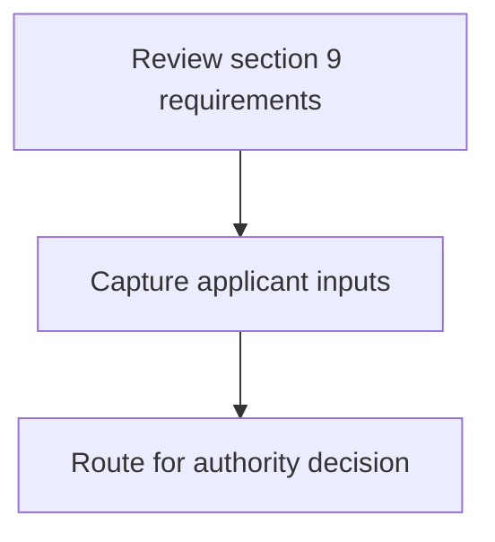
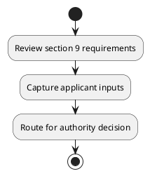

# Chapter 3 / Section 9: Act as one point facilitator for export promotion at District level.

**Chapter Title:** Developing Districts as Export Hubs

**Pages:** 4

**Purpose:** Act as one point facilitator for export promotion at District level.

**Purpose Thanglish:** Indha Act as one point facilitator for export promotion at District level. section-la, Act as one point facilitator for export promotion at District level.

**Summary:** 9. Act as one point facilitator for export promotion at District level.

**Business Meaning:** 9.

**Business Explanation:** 9. Act as one point facilitator for export promotion at District level.

**Business Explanation Thanglish:** Indha Act as one point facilitator for export promotion at District level. section-la, 9. Act as one point facilitator for export promotion at District level.

## Business Logic
- None identified

## Business Rules
- rule_id=CH3-SEC9-R001, rule_description=9. Act as one point facilitator for export promotion at District level., trigger=Act as one point facilitator for export promotion at District level., condition=Not explicitly covered in uploaded documents., validation=Not explicitly covered in uploaded documents., action=Manual review required., exception=No explicit exception found in uploaded documents., output=DEKAI should produce a compliance decision for 9 - Act as one point facilitator for export promotion at District level..

## Conditions
- None identified

## Condition Logic
- None identified

## Validations
- None identified

## Exceptions
- None identified

## Dependencies
- None identified

## Authorities
- None identified

## Required Documents
- None identified

## Timelines
- None identified

## Actions
- None identified

## Workflow
- Review section 9 requirements
- Capture applicant inputs
- Route for authority decision

## Workflow ASCII
```text
Act as one point facilitator for export promotion at District level.
Review section 9 requirements
   |
   v
Capture applicant inputs
   |
   v
Route for authority decision
```

## Decision Tree
- IF section 9 applies THEN proceed with standard DGFT workflow

## Decision Tree ASCII
```text
Act as one point facilitator for export promotion at District level. Decision
IF section 9 applies THEN proceed with standard DGFT workflow
```

## Examples
- User asks to process Act as one point facilitator for export promotion at District level.; the platform checks conditions, validations, and documents before action.

**Real-world Example:** Example: an importer or exporter invokes Act as one point facilitator for export promotion at District level., submits the prescribed DGFT records, and DEKAI uses the extracted rules to follow the act as one point facilitator for export promotion at district level. process.

**Real-world Example Thanglish:** Indha Act as one point facilitator for export promotion at District level. section-la, Example: an importer or exporter invokes Act as one point facilitator for export promotion at District level., submits the prescribed DGFT records, and DEKAI uses the extracted rules to follow the act as one point facilitator for export promotion at district level. process.

## AI Rules
- None identified

## Database Fields
- name=section_code, type=string, required=True, source=parsed_section_heading
- name=section_title, type=string, required=True, source=parsed_section_heading
- name=act_flag, type=boolean, required=False, source=keyword:Act
- name=one_flag, type=boolean, required=False, source=keyword:one
- name=for_flag, type=boolean, required=False, source=keyword:for
- name=point_flag, type=boolean, required=False, source=keyword:point
- name=level_flag, type=boolean, required=False, source=keyword:level
- name=export_flag, type=boolean, required=False, source=keyword:export
- name=district_flag, type=boolean, required=False, source=keyword:District
- name=promotion_flag, type=boolean, required=False, source=keyword:promotion

## API Requirements
- method=GET, path=/api/dgft/sections/9, purpose=Retrieve knowledge payload for section 9, query_params=['include=workflow,decision_tree,validations'], response_fields=['section', 'title', 'summary', 'conditions', 'validations', 'exceptions', 'workflow', 'decision_tree']
- method=POST, path=/api/dgft/Act-as-one-point-facilitator-for-export-promotion-at-District-level/validate, purpose=Validate inputs and documents for Act as one point facilitator for export promotion at District level., request_fields=['section_code', 'section_title'], response_fields=['status', 'errors', 'warnings', 'next_actions']

## UI Screens
- screen_id=Act_as_one_point_facilitator_for_export_promotion_at_District_level_overview, name=Act as one point facilitator for export promotion at District level. Overview, purpose=Show section summary, authority, timeline, and eligibility cues., widgets=['summary_card', 'conditions_table', 'authority_badges', 'timeline_panel']
- screen_id=Act_as_one_point_facilitator_for_export_promotion_at_District_level_submission, name=Act as one point facilitator for export promotion at District level. Submission, purpose=Capture applicant data and supporting documents., widgets=['dynamic_form', 'document_uploader', 'validation_panel', 'next_action_footer'], fields=['section_code', 'section_title', 'act_flag', 'one_flag', 'for_flag', 'point_flag', 'level_flag', 'export_flag']

## Error Messages
- Validation failed because the section requirements were not fully met.

## FAQ
- question_en=What is the purpose of section 9?, answer_en=9. Act as one point facilitator for export promotion at District level., question_thanglish=Indha Act as one point facilitator for export promotion at District level. section-la, What is the purpose of section 9?, answer_thanglish=Indha Act as one point facilitator for export promotion at District level. section-la, 9. Act as one point facilitator for export promotion at District level.
- question_en=What documents are required under Act as one point facilitator for export promotion at District level.?, answer_en=Not explicitly covered in uploaded documents., question_thanglish=Indha Act as one point facilitator for export promotion at District level. section-la, What documents are required under Act as one point facilitator for export promotion at District level.?, answer_thanglish=Indha Act as one point facilitator for export promotion at District level. section-la, Not explicitly covered in uploaded documents.
- question_en=Which authority handles Act as one point facilitator for export promotion at District level.?, answer_en=Not explicitly covered in uploaded documents., question_thanglish=Indha Act as one point facilitator for export promotion at District level. section-la, Which authority handles Act as one point facilitator for export promotion at District level.?, answer_thanglish=Indha Act as one point facilitator for export promotion at District level. section-la, Not explicitly covered in uploaded documents.

## Questions Users May Ask
- What does Act as one point facilitator for export promotion at District level. require?
- Which documents are needed for Act as one point facilitator for export promotion at District level.?
- How does DEKAI validate Act as one point facilitator for export promotion at District level. requests?

## Expected AI Answers
- Act as one point facilitator for export promotion at District level. requires the platform to interpret the section text, apply the extracted business rules, and present the correct next action.
- Required documents are inferred from the section text: no explicit documents were detected.
- DEKAI validates Act as one point facilitator for export promotion at District level. by checking conditions, required documents, authority references, and exception clauses before recommending an outcome.

## AI Q&A Examples
- question_en=User asks: How do I comply with Act as one point facilitator for export promotion at District level.?, answer_en=AI answers: DEKAI should evaluate section 9, apply the extracted rules, and guide the user through Review section 9 requirements., question_thanglish=Indha Act as one point facilitator for export promotion at District level. section-la, User asks: How do I comply with Act as one point facilitator for export promotion at District level.?, answer_thanglish=Indha Act as one point facilitator for export promotion at District level. section-la, AI answers: DEKAI should evaluate section 9, apply the extracted rules, and guide the user through Review section 9 requirements.
- question_en=User asks: Which validations apply to Act as one point facilitator for export promotion at District level.?, answer_en=AI answers: Applicable validations are not explicitly covered in the uploaded documents., question_thanglish=Indha Act as one point facilitator for export promotion at District level. section-la, User asks: Which validations apply to Act as one point facilitator for export promotion at District level.?, answer_thanglish=Indha Act as one point facilitator for export promotion at District level. section-la, AI answers: Applicable validations are not explicitly covered in the uploaded documents.

## DEKAI AI Implementation Notes
- Capture chapter 3, section 9, title, and page references as immutable knowledge metadata.
- Bind validations for Act as one point facilitator for export promotion at District level. into a rule engine keyed by the rule IDs extracted for this section.

## DEKAI AI Implementation Notes Thanglish
- Indha Act as one point facilitator for export promotion at District level. section-la, Capture chapter 3, section 9, title, and page references as immutable knowledge metadata.
- Indha Act as one point facilitator for export promotion at District level. section-la, Bind validations for Act as one point facilitator for export promotion at District level. into a rule engine keyed by the rule IDs extracted for this section.

## AI Metadata
- Keywords: Act, one, for, point, level, export, District, promotion, facilitator
- Search Keywords: Act, one, for, point, level, export, District, promotion, facilitator
- Intent: Provide knowledge guidance for Act as one point facilitator for export promotion at District level..
- Tags: 9, Act as one point facilitator for export promotion at District level., dgft
- Related Sections: 
- Related Chapters: 
- Related Rules: 

## Mermaid


## PlantUML

