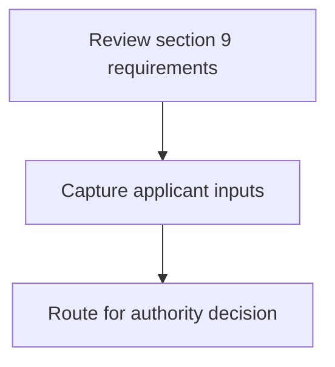
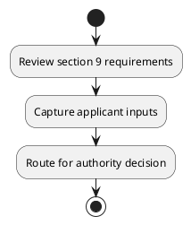

# Chapter 8 / Section 9: Officer as nominated by Chairperson: Member Secretary

**Chapter Title:** Quality Complaints and Trade Disputes

**Pages:** 3

**Purpose:** Defines the operational requirements for Officer as nominated by Chairperson: Member Secretary.

**Purpose Thanglish:** Indha Officer as nominated by Chairperson: Member Secretary section-la, Defines the operational requirements for Officer as nominated by Chairperson: Member Secretary.

**Summary:** 9. Officer as nominated by Chairperson: Member Secretary

**Business Meaning:** 9.

**Business Explanation:** 9. Officer as nominated by Chairperson: Member Secretary

**Business Explanation Thanglish:** Indha Officer as nominated by Chairperson: Member Secretary section-la, 9. Officer as nominated by Chairperson: Member Secretary

## Business Logic
- None identified

## Business Rules
- rule_id=CH8-SEC9-R001, rule_description=9. Officer as nominated by Chairperson: Member Secretary, trigger=Officer as nominated by Chairperson: Member Secretary, condition=Not explicitly covered in uploaded documents., validation=Not explicitly covered in uploaded documents., action=Manual review required., exception=No explicit exception found in uploaded documents., output=DEKAI should produce a compliance decision for 9 - Officer as nominated by Chairperson: Member Secretary.

## Conditions
- None identified

## Condition Logic
- None identified

## Validations
- None identified

## Exceptions
- None identified

## Dependencies
- None identified

## Authorities
- None identified

## Required Documents
- None identified

## Timelines
- None identified

## Actions
- None identified

## Workflow
- Review section 9 requirements
- Capture applicant inputs
- Route for authority decision

## Workflow ASCII
```text
Officer as nominated by Chairperson: Member Secretary
Review section 9 requirements
   |
   v
Capture applicant inputs
   |
   v
Route for authority decision
```

## Decision Tree
- IF section 9 applies THEN proceed with standard DGFT workflow

## Decision Tree ASCII
```text
Officer as nominated by Chairperson: Member Secretary Decision
IF section 9 applies THEN proceed with standard DGFT workflow
```

## Examples
- User asks to process Officer as nominated by Chairperson: Member Secretary; the platform checks conditions, validations, and documents before action.

**Real-world Example:** Example: an importer or exporter invokes Officer as nominated by Chairperson: Member Secretary, submits the prescribed DGFT records, and DEKAI uses the extracted rules to follow the officer as nominated by chairperson: member secretary process.

**Real-world Example Thanglish:** Indha Officer as nominated by Chairperson: Member Secretary section-la, Example: an importer or exporter invokes Officer as nominated by Chairperson: Member Secretary, submits the prescribed DGFT records, and DEKAI uses the extracted rules to follow the officer as nominated by chairperson: member secretary process.

## AI Rules
- None identified

## Database Fields
- name=section_code, type=string, required=True, source=parsed_section_heading
- name=section_title, type=string, required=True, source=parsed_section_heading
- name=member_flag, type=boolean, required=False, source=keyword:Member
- name=officer_flag, type=boolean, required=False, source=keyword:Officer
- name=nominated_flag, type=boolean, required=False, source=keyword:nominated
- name=secretary_flag, type=boolean, required=False, source=keyword:Secretary
- name=chairperson_flag, type=boolean, required=False, source=keyword:Chairperson

## API Requirements
- method=GET, path=/api/dgft/sections/9, purpose=Retrieve knowledge payload for section 9, query_params=['include=workflow,decision_tree,validations'], response_fields=['section', 'title', 'summary', 'conditions', 'validations', 'exceptions', 'workflow', 'decision_tree']
- method=POST, path=/api/dgft/Officer-as-nominated-by-Chairperson-Member-Secretary/validate, purpose=Validate inputs and documents for Officer as nominated by Chairperson: Member Secretary, request_fields=['section_code', 'section_title'], response_fields=['status', 'errors', 'warnings', 'next_actions']

## UI Screens
- screen_id=Officer_as_nominated_by_Chairperson_Member_Secretary_overview, name=Officer as nominated by Chairperson: Member Secretary Overview, purpose=Show section summary, authority, timeline, and eligibility cues., widgets=['summary_card', 'conditions_table', 'authority_badges', 'timeline_panel']
- screen_id=Officer_as_nominated_by_Chairperson_Member_Secretary_submission, name=Officer as nominated by Chairperson: Member Secretary Submission, purpose=Capture applicant data and supporting documents., widgets=['dynamic_form', 'document_uploader', 'validation_panel', 'next_action_footer'], fields=['section_code', 'section_title', 'member_flag', 'officer_flag', 'nominated_flag', 'secretary_flag', 'chairperson_flag']

## Error Messages
- Validation failed because the section requirements were not fully met.

## FAQ
- question_en=What is the purpose of section 9?, answer_en=9. Officer as nominated by Chairperson: Member Secretary, question_thanglish=Indha Officer as nominated by Chairperson: Member Secretary section-la, What is the purpose of section 9?, answer_thanglish=Indha Officer as nominated by Chairperson: Member Secretary section-la, 9. Officer as nominated by Chairperson: Member Secretary
- question_en=What documents are required under Officer as nominated by Chairperson: Member Secretary?, answer_en=Not explicitly covered in uploaded documents., question_thanglish=Indha Officer as nominated by Chairperson: Member Secretary section-la, What documents are required under Officer as nominated by Chairperson: Member Secretary?, answer_thanglish=Indha Officer as nominated by Chairperson: Member Secretary section-la, Not explicitly covered in uploaded documents.
- question_en=Which authority handles Officer as nominated by Chairperson: Member Secretary?, answer_en=Not explicitly covered in uploaded documents., question_thanglish=Indha Officer as nominated by Chairperson: Member Secretary section-la, Which authority handles Officer as nominated by Chairperson: Member Secretary?, answer_thanglish=Indha Officer as nominated by Chairperson: Member Secretary section-la, Not explicitly covered in uploaded documents.

## Questions Users May Ask
- What does Officer as nominated by Chairperson: Member Secretary require?
- Which documents are needed for Officer as nominated by Chairperson: Member Secretary?
- How does DEKAI validate Officer as nominated by Chairperson: Member Secretary requests?

## Expected AI Answers
- Officer as nominated by Chairperson: Member Secretary requires the platform to interpret the section text, apply the extracted business rules, and present the correct next action.
- Required documents are inferred from the section text: no explicit documents were detected.
- DEKAI validates Officer as nominated by Chairperson: Member Secretary by checking conditions, required documents, authority references, and exception clauses before recommending an outcome.

## AI Q&A Examples
- question_en=User asks: How do I comply with Officer as nominated by Chairperson: Member Secretary?, answer_en=AI answers: DEKAI should evaluate section 9, apply the extracted rules, and guide the user through Review section 9 requirements., question_thanglish=Indha Officer as nominated by Chairperson: Member Secretary section-la, User asks: How do I comply with Officer as nominated by Chairperson: Member Secretary?, answer_thanglish=Indha Officer as nominated by Chairperson: Member Secretary section-la, AI answers: DEKAI should evaluate section 9, apply the extracted rules, and guide the user through Review section 9 requirements.
- question_en=User asks: Which validations apply to Officer as nominated by Chairperson: Member Secretary?, answer_en=AI answers: Applicable validations are not explicitly covered in the uploaded documents., question_thanglish=Indha Officer as nominated by Chairperson: Member Secretary section-la, User asks: Which validations apply to Officer as nominated by Chairperson: Member Secretary?, answer_thanglish=Indha Officer as nominated by Chairperson: Member Secretary section-la, AI answers: Applicable validations are not explicitly covered in the uploaded documents.

## DEKAI AI Implementation Notes
- Capture chapter 8, section 9, title, and page references as immutable knowledge metadata.
- Bind validations for Officer as nominated by Chairperson: Member Secretary into a rule engine keyed by the rule IDs extracted for this section.

## DEKAI AI Implementation Notes Thanglish
- Indha Officer as nominated by Chairperson: Member Secretary section-la, Capture chapter 8, section 9, title, and page references as immutable knowledge metadata.
- Indha Officer as nominated by Chairperson: Member Secretary section-la, Bind validations for Officer as nominated by Chairperson: Member Secretary into a rule engine keyed by the rule IDs extracted for this section.

## AI Metadata
- Keywords: Member, Officer, nominated, Secretary, Chairperson
- Search Keywords: Member, Officer, nominated, Secretary, Chairperson
- Intent: Provide knowledge guidance for Officer as nominated by Chairperson: Member Secretary.
- Tags: 9, Officer as nominated by Chairperson: Member Secretary, dgft
- Related Sections: 
- Related Chapters: 
- Related Rules: 

## Mermaid


## PlantUML

