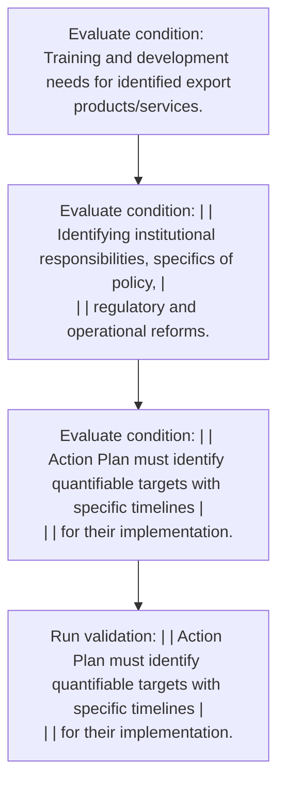

# Chapter 3 / Section 9: Training and development needs for identified export

**Chapter Title:** Developing Districts as Export Hubs

**Pages:** 5

**Purpose:** Training and development needs for identified export
products/services.

**Purpose Thanglish:** Indha Training and development needs for identified export section-la, Training and development needs for identified export
products/services.

**Summary:** 9. Training and development needs for identified export
products/services. pg.

**Business Meaning:** Training and development needs for identified export governs how DGFT business controls should be applied, validated, and enforced.

**Business Explanation:** Training and development needs for identified export explains the operating rule set that DEKAI should enforce. Key control points include | | Action Plan must identify quantifiable targets with specific timelines |
| | for their implementation.

**Business Explanation Thanglish:** Indha Training and development needs for identified export section-la, Training and development needs for identified export explains the operating rule set that DEKAI should enforce. Key control points include | | Action Plan must identify quantifiable targets with specific timelines |
| | for their implementation.

## Business Logic
- | | Action Plan must identify quantifiable targets with specific timelines |
| | for their implementation.

## Business Rules
- rule_id=CH3-SEC9-R001, rule_description=| | Action Plan must identify quantifiable targets with specific timelines |
| | for their implementation., trigger=Training and development needs for identified export, condition=Training and development needs for identified export
products/services., validation=| | Action Plan must identify quantifiable targets with specific timelines |
| | for their implementation., action=Manual review required., exception=No explicit exception found in uploaded documents., output=DEKAI should produce a compliance decision for 9 - Training and development needs for identified export.

## Conditions
- Training and development needs for identified export
products/services.
- | | Identifying institutional responsibilities, specifics of policy, |
| | regulatory and operational reforms.
- | | Action Plan must identify quantifiable targets with specific timelines |
| | for their implementation.
- | | Training and development needs for identified export |
| | products/services.

## Condition Logic
- id=3.9.1, if=Training and development needs for identified export
products/services., then=Route for review, source=Training and development needs for identified export
products/services.
- id=3.9.2, if=| | Identifying institutional responsibilities, specifics of policy, |
| | regulatory and operational reforms., then=Route for review, source=| | Identifying institutional responsibilities, specifics of policy, |
| | regulatory and operational reforms.
- id=3.9.3, if=| | Action Plan must identify quantifiable targets with specific timelines |
| | for their implementation., then=Route for review, source=| | Action Plan must identify quantifiable targets with specific timelines |
| | for their implementation.
- id=3.9.4, if=| | Training and development needs for identified export |
| | products/services., then=Route for review, source=| | Training and development needs for identified export |
| | products/services.

## Validations
- | | Action Plan must identify quantifiable targets with specific timelines |
| | for their implementation.

## Exceptions
- None identified

## Dependencies
- 1
- 3
- 5
- 6
- 7

## Authorities
- DGFT
- Central government
- DGFT Regional Authorities

## Required Documents
- None identified

## Timelines
- None identified

## Actions
- None identified

## Workflow
- Evaluate condition: Training and development needs for identified export
products/services.
- Evaluate condition: | | Identifying institutional responsibilities, specifics of policy, |
| | regulatory and operational reforms.
- Evaluate condition: | | Action Plan must identify quantifiable targets with specific timelines |
| | for their implementation.
- Run validation: | | Action Plan must identify quantifiable targets with specific timelines |
| | for their implementation.

## Workflow ASCII
```text
Training and development needs for identified export
Evaluate condition: Training and development needs for identified export
products/services.
   |
   v
Evaluate condition: | | Identifying institutional responsibilities, specifics of policy, |
| | regulatory and operational reforms.
   |
   v
Evaluate condition: | | Action Plan must identify quantifiable targets with specific timelines |
| | for their implementation.
   |
   v
Run validation: | | Action Plan must identify quantifiable targets with specific timelines |
| | for their implementation.
```

## Decision Tree
- IF section 9 applies THEN proceed with standard DGFT workflow

## Decision Tree ASCII
```text
Training and development needs for identified export Decision
IF section 9 applies THEN proceed with standard DGFT workflow
```

## Examples
- User asks to process Training and development needs for identified export; the platform checks conditions, validations, and documents before action.

**Real-world Example:** Example: an importer or exporter invokes Training and development needs for identified export, submits the prescribed DGFT records, and DEKAI uses the extracted rules to follow the training and development needs for identified export process.

**Real-world Example Thanglish:** Indha Training and development needs for identified export section-la, Example: an importer or exporter invokes Training and development needs for identified export, submits the prescribed DGFT records, and DEKAI uses the extracted rules to follow the training and development needs for identified export process.

## AI Rules
- IF detected context matches section rule THEN enforce: | | Action Plan must identify quantifiable targets with specific timelines |
| | for their implementation.

## Database Fields
- name=section_code, type=string, required=True, source=parsed_section_heading
- name=section_title, type=string, required=True, source=parsed_section_heading
- name=and_flag, type=boolean, required=False, source=keyword:and
- name=for_flag, type=boolean, required=False, source=keyword:for
- name=the_flag, type=boolean, required=False, source=keyword:the
- name=with_flag, type=boolean, required=False, source=keyword:with
- name=from_flag, type=boolean, required=False, source=keyword:from
- name=plan_flag, type=boolean, required=False, source=keyword:Plan
- name=must_flag, type=boolean, required=False, source=keyword:must
- name=dgft_flag, type=boolean, required=False, source=keyword:DGFT

## API Requirements
- method=GET, path=/api/dgft/sections/9, purpose=Retrieve knowledge payload for section 9, query_params=['include=workflow,decision_tree,validations'], response_fields=['section', 'title', 'summary', 'conditions', 'validations', 'exceptions', 'workflow', 'decision_tree']
- method=POST, path=/api/dgft/Training-and-development-needs-for-identified-export/validate, purpose=Validate inputs and documents for Training and development needs for identified export, request_fields=['section_code', 'section_title'], response_fields=['status', 'errors', 'warnings', 'next_actions']

## UI Screens
- screen_id=Training_and_development_needs_for_identified_export_overview, name=Training and development needs for identified export Overview, purpose=Show section summary, authority, timeline, and eligibility cues., widgets=['summary_card', 'conditions_table', 'authority_badges', 'timeline_panel']
- screen_id=Training_and_development_needs_for_identified_export_submission, name=Training and development needs for identified export Submission, purpose=Capture applicant data and supporting documents., widgets=['dynamic_form', 'document_uploader', 'validation_panel', 'next_action_footer'], fields=['section_code', 'section_title', 'and_flag', 'for_flag', 'the_flag', 'with_flag', 'from_flag', 'plan_flag']

## Error Messages
- Validation failed because the section requirements were not fully met.

## FAQ
- question_en=What is the purpose of section 9?, answer_en=Training and development needs for identified export explains the operating rule set that DEKAI should enforce. Key control points include | | Action Plan must identify quantifiable targets with specific timelines |
| | for their implementation., question_thanglish=Indha Training and development needs for identified export section-la, What is the purpose of section 9?, answer_thanglish=Indha Training and development needs for identified export section-la, Training and development needs for identified export explains the operating rule set that DEKAI should enforce. Key control points include | | Action Plan must identify quantifiable targets with specific timelines |
| | for their implementation.
- question_en=What documents are required under Training and development needs for identified export?, answer_en=Not explicitly covered in uploaded documents., question_thanglish=Indha Training and development needs for identified export section-la, What documents are required under Training and development needs for identified export?, answer_thanglish=Indha Training and development needs for identified export section-la, Not explicitly covered in uploaded documents.
- question_en=Which authority handles Training and development needs for identified export?, answer_en=DGFT, Central government, DGFT Regional Authorities, question_thanglish=Indha Training and development needs for identified export section-la, Which authority handles Training and development needs for identified export?, answer_thanglish=Indha Training and development needs for identified export section-la, DGFT, Central government, DGFT Regional Authorities

## Questions Users May Ask
- What does Training and development needs for identified export require?
- Which documents are needed for Training and development needs for identified export?
- How does DEKAI validate Training and development needs for identified export requests?

## Expected AI Answers
- Training and development needs for identified export requires the platform to interpret the section text, apply the extracted business rules, and present the correct next action.
- Required documents are inferred from the section text: no explicit documents were detected.
- DEKAI validates Training and development needs for identified export by checking conditions, required documents, authority references, and exception clauses before recommending an outcome.

## AI Q&A Examples
- question_en=User asks: How do I comply with Training and development needs for identified export?, answer_en=AI answers: DEKAI should evaluate section 9, apply the extracted rules, and guide the user through Evaluate condition: Training and development needs for identified export
products/services.., question_thanglish=Indha Training and development needs for identified export section-la, User asks: How do I comply with Training and development needs for identified export?, answer_thanglish=Indha Training and development needs for identified export section-la, AI answers: DEKAI should evaluate section 9, apply the extracted rules, and guide the user through Evaluate condition: Training and development needs for identified export
products/services..
- question_en=User asks: Which validations apply to Training and development needs for identified export?, answer_en=AI answers: Applicable validations are | | Action Plan must identify quantifiable targets with specific timelines |
| | for their implementation., question_thanglish=Indha Training and development needs for identified export section-la, User asks: Which validations apply to Training and development needs for identified export?, answer_thanglish=Indha Training and development needs for identified export section-la, AI answers: Applicable validations are | | Action Plan must identify quantifiable targets with specific timelines |
| | for their implementation.

## DEKAI AI Implementation Notes
- Capture chapter 3, section 9, title, and page references as immutable knowledge metadata.
- Bind validations for Training and development needs for identified export into a rule engine keyed by the rule IDs extracted for this section.
- Route escalations or approvals to: DGFT, Central government, DGFT Regional Authorities.
- Show contextual links to related sections: 1, 3, 5, 6, 7.

## DEKAI AI Implementation Notes Thanglish
- Indha Training and development needs for identified export section-la, Capture chapter 3, section 9, title, and page references as immutable knowledge metadata.
- Indha Training and development needs for identified export section-la, Bind validations for Training and development needs for identified export into a rule engine keyed by the rule IDs extracted for this section.
- Indha Training and development needs for identified export section-la, Route escalations or approvals to: DGFT, Central government, DGFT Regional Authorities.
- Indha Training and development needs for identified export section-la, Show contextual links to related sections: 1, 3, 5, 6, 7.

## AI Metadata
- Keywords: and, for, the, with, from, Plan, must, DGFT, will, take, this, each, needs, major, Goods, their, State, export, policy, Action
- Search Keywords: and, for, the, with, from, Plan, must, DGFT, will, take, this, each, needs, major, Goods, their, State, export, policy, Action
- Intent: Provide knowledge guidance for Training and development needs for identified export.
- Tags: 9, Training and development needs for identified export, business-rule, dgft
- Related Sections: 1, 3, 5, 6, 7
- Related Chapters: 
- Related Rules: | | Action Plan must identify quantifiable targets with specific timelines |
| | for their implementation.

## Mermaid


## PlantUML
```plantuml
@startuml
start
:Evaluate condition\: Training and development needs for identified export
products/services.;
:Evaluate condition\: | | Identifying institutional responsibilities, specifics of policy, |
| | regulatory and operational reforms.;
:Evaluate condition\: | | Action Plan must identify quantifiable targets with specific timelines |
| | for their implementation.;
:Run validation\: | | Action Plan must identify quantifiable targets with specific timelines |
| | for their implementation.;
stop
@enduml
```
